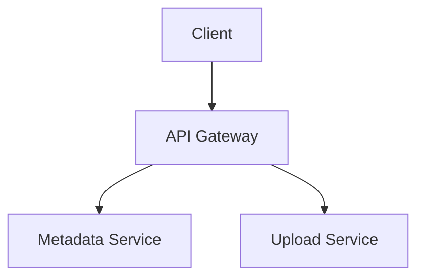

# SDTool Article Format Specification

## Decision: Enhanced Markdown + Mermaid

**Files:** `.md` stored in `articles/`, tracked via `articles/index.md`

---

## Why Not The Alternatives

| Option | Fatal Problem |
|--------|---------------|
| **Editor.js JSON** | No Swift library exists. Months to build from scratch. LLMs can't output it natively. ASCII diagrams still just monospace in a box. |
| **AsciiDoc** | No Swift parser exists. Months to build. Diagrams still just a code block — no visual improvement over what we have today. |
| **Contentful Rich Text** | Requires Contentful CMS API — not a file format. No code block support. No diagram support. Wrong tool entirely. |
| **Enhanced Markdown** ✅ | MarkdownUI already integrated. Mermaid already works. LLMs output it natively. GFM tables render beautifully. Git-friendly. |

---

## Syntax Reference

### 1. Headers
```markdown
# Article Title
## 1. Section Name
### 1.1 Subsection
#### Deep subsection
```

### 2. Data Tables → GFM Pipe Tables
```markdown
| Column A | Column B | Column C |
|----------|----------|----------|
| Value    | Value    | Value    |
```
MarkdownUI renders these as proper styled tables. **Never use ASCII `+---+` box tables.**

### 3. Architecture Diagrams → Mermaid
All diagrams MUST be Mermaid. The app renders these via WKWebView.

````markdown

````

**Supported Mermaid types:**
- `graph TD` / `graph LR` — architecture flows, component diagrams
- `sequenceDiagram` — API call sequences, protocol flows
- `flowchart TD` — state machines, decision trees, pipelines
- `stateDiagram-v2` — state machines
- `erDiagram` — database entity relationships
- `classDiagram` — data models

### 4. Callout Boxes → GitHub-Style Alerts

Use `> [!TYPE]` syntax. A GitHub Action auto-converts these to styled `<div>` elements in the HTML output. Four types are supported:

```markdown
> [!TIP]
> **Title Here**
> Body text. Can be multi-line.
> - Bullet points work too

> [!NOTE]
> **KEY NUMBERS:**
> - Upload RPS peak: ~7,000 writes/s
> - Download RPS: ~70,000 reads/s

> [!WARNING]
> **Common Mistake**
> Never store blobs in a relational database.

> [!IMPORTANT]
> **STRONG CONSISTENCY REQUIRED**
> Explanation here.
```

| Type | Use for | Color |
|------|---------|-------|
| `[!TIP]` | Interview tips, best practices, shortcuts | Green |
| `[!NOTE]` | Background info, calculations, scope | Blue |
| `[!WARNING]` | Common mistakes, gotchas, red flags | Orange |
| `[!IMPORTANT]` | Critical requirements, key decisions | Red |

**Do NOT** use emoji prefixes (the CSS adds labels automatically).

### 5. Code / Schema Blocks → Fenced with Language Tag
```markdown
    ```sql
    SELECT * FROM nodes WHERE owner_id = :uid
    ```

    ```json
    { "upload_id": "uuid", "existing_chunks": [] }
    ```

    ```
    Daily uploads = 100M × 2 = 200M files/day
    Upload RPS    = 200M / 86,400 = ~2,315 writes/s
    ```
```

---

## LLM Prompt Template

When asking an LLM to write or reformat a technical article:

```
Write a technical system design article following these exact rules:

FORMAT:
- File format: Markdown (.md)
- Headers: # for title, ## for sections, ### for subsections
- Data tables: GFM pipe tables (| col | col |) — never ASCII box tables
- Diagrams: Mermaid code fences (```mermaid) — never ASCII art
- Callouts/tips/warnings: GitHub-style alerts (> [!TIP], > [!NOTE], > [!WARNING], > [!IMPORTANT])
- Code/SQL/schemas: Fenced code blocks with language tag (```sql, ```json, etc)
- Back-of-envelope math: Plain ``` code block (no language tag)

NEVER USE:
- ASCII art diagrams (+---+ boxes, │ characters for diagrams)
- Pandoc-style tables (------- separator rows)
- +-------+ box callouts
- Raw Unicode box-drawing characters for layout
```

---

## index.md Format

```
# Articles Index
ai-concepts-staff-engineer-guide.md=AI Basic Concepts|AI-ML
distributed-drive-design.md=File Upload & Hosting Service|System Design
back-of-envelope-calculations.md=Back Of Envelope Calculations|Basics
```

Format: `filename.html=Display Name|Category`

**Note:** Authors write `.md` files. A GitHub Action automatically converts them to `.html` on push. The `index.md` references the `.html` filenames (the format the app fetches).

---

## Reformatting Existing Articles

For articles exported from Word/Notion/Pandoc with box tables and ASCII art:

1. Convert all `+---+` callout boxes → `> [!TIP]` / `> [!NOTE]` / `> [!WARNING]` / `> [!IMPORTANT]` alerts
2. Convert all pipe/space-aligned tables → GFM `| col |` tables
3. Replace ALL ASCII art diagrams with equivalent Mermaid
4. Remove all `\< 200ms` backslash escapes → `< 200ms`
5. Remove all line-wrapped text (re-flow paragraphs)