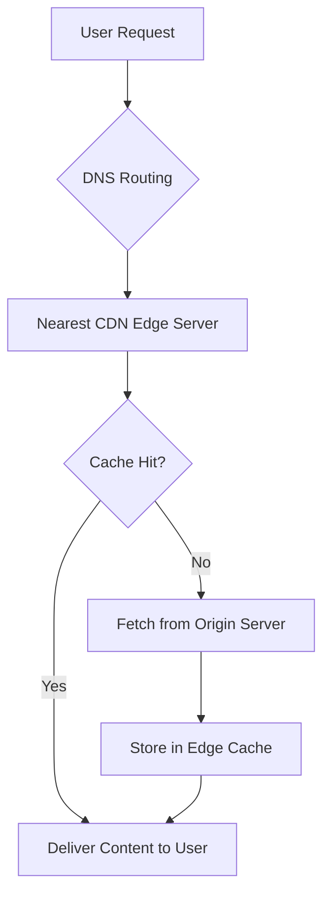
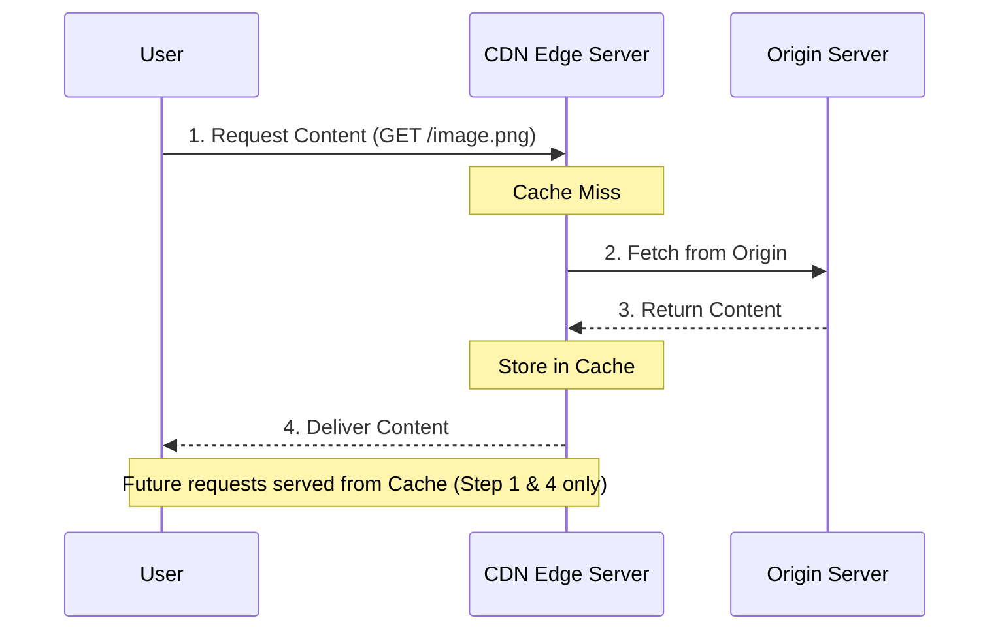
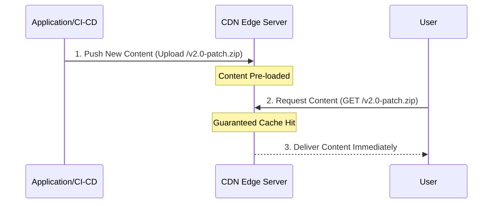

# CDN
## About CDN
Modern applications face the challenge of serving a globally distributed user base. High latency in content delivery directly impacts application performance and user adoption. To mitigate this, **Content Delivery Networks (CDNs)** utilize **distributed caching** to serve content based on the requester's geographical proximity.
By leveraging a network of edge servers, CDNs minimize the distance between the user and the data. While primarily optimized for large-scale **static assets**, CDNs are also increasingly used to accelerate **dynamic content**, such as API responses. When a request occurs, the CDN routes the user to the nearest edge server; if the content is not already cached (**cache miss**), it is fetched from the origin, stored at the edge, and delivered to the user. This architecture ensures high-speed, reliable delivery across diverse global sectors.

## How does CDN work?
A CDN relies on three primary architectural components to minimize latency and optimize content delivery based on geographical proximity:
- **Edge Servers / PoPs (Point of Presence):** Distributed servers that cache and serve content directly to users within a specific geographic region.
- **Origin Server:** The authoritative source of truth (the primary application server) where the original versions of assets are stored.
- **DNS (Domain Name System):** The routing layer that resolves requests to the IP of the optimal Edge Server rather than the Origin.

#### The Request Lifecycle
1. **DNS Resolution:** When a user requests an asset, the browser initiates a DNS query. The CDN’s authoritative DNS identifies the requester’s location and returns the IP address of the **geographically nearest Edge Server**.
2. **Request Routing:** The user’s request is routed to that Edge Server.
3. **Cache Inspection (Hit vs. Miss):**
    - **Cache Hit:** If the Edge Server has a valid, non-expired copy of the asset, it serves the request immediately.
    - **Cache Miss:** If the asset is missing or expired, the Edge Server acts as a reverse proxy, fetching the content from the **Origin Server**.
4. **Ingestion & Delivery:** Upon receiving the response from the Origin, the Edge Server stores the asset in its local cache and simultaneously delivers it to the user.

#### Cache Freshness and TTL
To prevent the delivery of **stale content**, CDNs utilize a **TTL (Time-to-Live)** value.
- **Expiration:** Once the TTL expires, the content is marked as stale.
- **Revalidation:** Upon the next request for a stale item, the Edge Server sends a conditional request to the Origin (using headers like If-Modified-Since) to verify if the content has changed. If unchanged, the TTL is reset; if updated, the Edge fetches the new version.

## Content Ingestion Strategies
When implementing a CDN, you must choose a mechanism for how data is populated from the origin to the edge:
1. Pull CDN (Origin Fetch)
In a Pull model, the CDN acts reactively. The edge server is configured with the origin’s address, but it only fetches content when a user specifically requests it and a cache miss occurs.
- **Best For:** Massive-scale applications with large libraries of content (e.g., video streaming, image hosting).
- **Key Advantages:**
    - **Automated Management:** Content is automatically cached based on demand.
    - **Cost-Efficient Storage**: Only "hot" (frequently requested) data occupies edge storage, while rarely accessed files remain on the origin.

2. Push CDN (Content Pre-fetching)
In a Push model, the application actively uploads content to the CDN before a user ever requests it. The CDN acts more like a distributed storage bucket.
- **Best For:** Time-sensitive or critical content delivery where even the very first request must have zero latency.
- **Key Use Cases:**
    - **Software Updates:** Distributing a new app version or patch.
    - **Marketing Campaigns:** Launching high-traffic landing pages where a "first-request miss" is unacceptable.
- **Key Advantage:** Guarantees a 100% Cache Hit ratio for the pushed assets from the moment they are deployed.

#### Comparison: Pull vs. Push Ingestion

| Feature | Pull CDN (Origin Fetch) | Push CDN (Content Pre-fetching) |
|---|---|---|
| Workflow | Reactive (On-Demand) | Proactive (Manual/Automated upload) |
| Setup Complexity | Low: Point CDN to Origin URL | High: Integration with CI/CD App logic |
| Storage Efficiency | High: Only “Hot” content is cached | Lower: Content sits on Edge regardless of demand |
| First-Request Latency | Higher (Initial Cache Miss) | Zero (Guaranteed Cache Hit) |
| Maintainance | Self-managing (TTL-based) | Manual (Requires manual upload/delete) |
| Best Use Case | Large Libraries, higher traffic sites | Software updates, critical patches, one-time launches |

## Benefits of CDN Implementation
1. Enhanced Performance & User Experience
- **Reduced Latency**: By serving content from the nearest Point of Presence (**PoP**), the physical distance data must travel is minimized,     resulting in significantly faster page load times.
- **Global Reach**: Organizations can provide a consistent high-speed experience to a worldwide audience without deploying full application stacks in every region.
2. Infrastructure Reliability & Scalability
- **High Availability**: The distributed nature of CDNs eliminates Single Points of Failure (**SPOF**). If one edge server or region fails, traffic is automatically rerouted to the next healthy node.
- **Origin Shielding**: Since the majority of requests are handled at the edge, the load on the Origin Server is drastically reduced. This prevents origin **choke points** and lowers compute/bandwidth costs.
- **Traffic Burst Management**: CDNs are designed to absorb massive traffic spikes (e.g., flash sales or breaking news) that would typically overwhelm a standard origin infrastructure.
3. Advanced Security
- **DDoS Mitigation**: CDNs act as a massive buffer that can absorb and disperse Distributed Denial of Service (**DDoS**) attacks before they ever reach your core infrastructure.
- **Edge Security (WAF)**: Most modern CDNs integrate Web Application Firewalls (**WAF**) and SSL/TLS termination at the edge, inspecting and filtering malicious traffic closer to the source.

## Cache Invalidation Strategies
Managing **stale** content is critical to ensuring users see the most recent data. When content changes at the origin before the TTL expires, you must use one of the following invalidation methods:
1. Purge by Path (Manual Invalidation)  
This involves sending a request to the CDN API to delete a specific file (e.g., /images/logo.png) or a directory (/images/*) from all edge caches.
**Pros**: Precise control over specific assets.
**Cons**: Can be slow and computationally expensive for the CDN provider to propagate globally. Some providers limit the number of free purges per month.
2. Cache Busting (Versioning)  
Instead of clearing the old file, you change the file name or append a version string (e.g., style.v2.css or script.js?v=1.1).
**How it works?**: The CDN treats the new filename as a "miss," fetches it, and caches it immediately. The old version simply sits in the cache unused until its TTL naturally expires.
**Status**: This is the preferred architectural pattern for static assets (JS, CSS) as it is instantaneous and cost-effective.
3. Invalidation by Tags (Surrogate Keys)  
You assign metadata "tags" to related files at the time of caching (e.g., all product images for "Summer Collection" get the tag summer_26).
**How it works**: You can issue a single "Purge by Tag" command to expire thousands of related items simultaneously.
**Best For**: E-commerce or dynamic sites where one update (like a price change) affects many different pages/images.

## CDN Security and Privacy Architecture
A CDN does not just accelerate content; it serves as a critical security layer between the open internet and your origin infrastructure.
1. Infrastructure Protection
- **DDoS Mitigation**: CDNs act as a global buffer, absorbing and dispersing Distributed Denial of Service (DDoS)attacks at the edge before they can saturate your origin's bandwidth.
- **Edge Security (WAF)**: Modern CDNs integrate Web Application Firewalls (WAF) to inspect incoming traffic for common vulnerabilities (SQL injection, XSS) and filter malicious actors closer to their source.
- **SSL/TLS Termination**: By handling encryption at the edge, CDNs reduce the computational overhead on the origin while ensuring data is encrypted in transit.
2. Data Privacy & Access Control
- **Signed URLs and Cookies**: For sensitive or premium content, the CDN is configured to reject any request that lacks a valid cryptographic signature. This ensures only authenticated users can access specific assets.
- **Origin Access Control (OAC/OAI)**: To prevent users from bypassing the CDN, the Origin (e.g., AWS S3) is locked down to only accept requests from the CDN’s specific service principals or IP ranges. This ensures the CDN remains the sole, protected entry point.
- **Geo-Fencing**: CDNs can enforce Geographic Restrictions, blocking or allowing traffic from specific countries to comply with local legal regulations, licensing agreements, or "digital sovereignty" requirements.

## Advanced CDN Architectures & Operations
1. Multi-CDN Strategy  
For mission-critical applications, relying on a single provider can create a vendor-level Single Point of Failure (SPOF).
Resiliency: Implementing a Multi-CDN strategy (e.g., combining Cloudflare and Akamai) ensures that if one provider experiences a global outage, traffic can be instantly rerouted.
Performance Optimization: Different CDNs have varying "Last Mile" performance in specific regions (e.g., one may be faster in China while another excels in Europe). A Multi-CDN approach allows for dynamic routing based on real-time latency metrics.
2. Edge Computing (Serverless at the Edge)  
Modern CDNs have evolved into powerful computational engines (e.g., AWS Lambda@Edge, CloudFront Functions, or Cloudflare Workers), allowing logic to execute closer to the user.
Request/Response Manipulation: Developers can write code to modify headers, rewrite URLs, or perform A/B testing redirects at the edge before the request ever reaches the origin.
Edge Authentication: Moving security checks (like JWT validation or cryptographic signature verification) to the edge allows the CDN to reject unauthorized requests immediately, saving backend resources and reducing origin load.
3. Cost & Efficiency Dimensions  
The financial and technical health of a CDN is measured by two key metrics:
Cache Hit Ratio (CHR): A low CHR indicates that most requests are still hitting the origin (Cache Misses), making the CDN inefficient. Monitoring CHR is essential for optimizing TTL and cache-key configurations.
Data Transfer Costs (Egress): CDNs often charge for data leaving their network. However, most cloud providers offer reduced "Origin-to-CDN" transfer rates. Keeping tabs on these Egress costs is vital to ensuring the CDN remains a cost-saving measure rather than a financial burden.
