# 🧠 AI & LLM Concepts — Complete Staff Engineer Reference
### Explained in Plain English with Diagrams

> [!TIP]
> **Who this is for:** Staff AI Engineers preparing for system design and concept interviews at FANG companies. Every concept is explained from first principles, then connected to real systems.

---

## Table of Contents

| # | Concept | One-Line Summary |
|---|---------|-----------------|
| 1 | [Large Language Model (LLM)](#1-large-language-model-llm) | A giant text predictor trained on the internet |
| 2 | [Tokenization](#2-tokenization) | How text gets chopped into pieces a model can digest |
| 3 | [Vectorization (Embeddings)](#3-vectorization-embeddings) | Turning words into coordinates in meaning-space |
| 4 | [Attention Mechanism](#4-attention-mechanism) | How the model decides what to focus on |
| 5 | [Self-Supervised Learning](#5-self-supervised-learning) | Learning without human labels |
| 6 | [Transformer Architecture](#6-transformer-architecture) | The engine powering every modern LLM |
| 7 | [Fine-Tuning](#7-fine-tuning) | Teaching an existing model new tricks |
| 8 | [Few-Shot Prompting](#8-few-shot-prompting) | Showing examples instead of writing instructions |
| 9 | [Retrieval Augmented Generation (RAG)](#9-retrieval-augmented-generation-rag) | Giving the model a live reference book |
| 10 | [Vector Database](#10-vector-database) | A database that understands meaning, not just exact matches |
| 11 | [Model Context Protocol (MCP)](#11-model-context-protocol-mcp) | A universal plug for connecting AI to tools |
| 12 | [A2A Protocol](#12-a2a-protocol-agent-to-agent) | How AI agents talk to each other |
| 13 | [Context Engineering](#13-context-engineering) | The art of filling the model's working memory optimally |
| 14 | [AI Agents](#14-ai-agents) | LLMs that take actions, not just answer questions |
| 15 | [Reinforcement Learning (RL & RLHF)](#15-reinforcement-learning-rl--rlhf) | Training via reward and punishment |
| 16 | [Chain of Thought (CoT)](#16-chain-of-thought-cot) | Making the model show its work |
| 17 | [Reasoning Models](#17-reasoning-models) | Models that think before they answer |
| 18 | [Multimodal Language Models](#18-multimodal-language-models) | Models that see, hear, and read |
| 19 | [Small Language Models (SLM)](#19-small-language-models-slm) | Powerful models that fit on your phone |
| 20 | [Distillation](#20-distillation) | Compressing a large model's knowledge into a smaller one |
| 21 | [Quantization](#21-quantization) | Making models faster and smaller by lowering precision |

---

## 1. Large Language Model (LLM)

### What it is — Plain English

Imagine reading every book, website, Wikipedia article, and code repository ever written. You've absorbed so much language that you can predict what word comes next in almost any sentence, with uncanny accuracy. That's what an LLM is — a system so deeply trained on human language that it can generate coherent, contextually relevant text.

> [!NOTE]
> **The core task:** Given a sequence of words, predict the next most likely word. Repeated millions of times = fluent language generation.

### Anatomy of an LLM

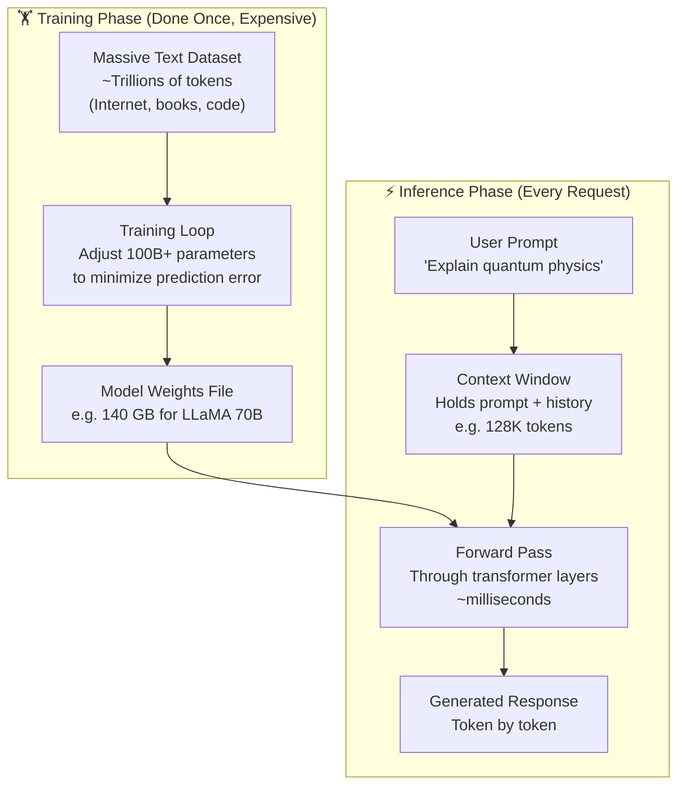

### Scale Comparison

| Model | Parameters | Context Window | Training Tokens | Use Case |
|-------|-----------|----------------|----------------|---------|
| GPT-2 (2019) | 1.5B | 1,024 | ~40B | Historical baseline |
| LLaMA 3 8B | 8B | 128K | ~15T | Local / edge deployment |
| GPT-4 (est.) | ~1.8T (MoE) | 128K | ~13T | General purpose |
| Claude Sonnet | ~70B (est.) | 200K | Undisclosed | Long-context tasks |
| Gemini Ultra | ~1T (est.) | 1M | Undisclosed | Multimodal |

### Key Insight for Interviews

> [!IMPORTANT]
> LLMs are **stateless** — they don't "remember" between conversations unless you explicitly put previous conversation in the context. Every call is independent. This drives architecture decisions around memory, sessions, and RAG.

---

## 2. Tokenization

### What it is — Plain English

Computers only understand numbers. Tokenization is the process of converting raw text into numbers (tokens) that a model can process. Think of tokens as the model's "vocabulary units" — not quite words, not quite characters. They're chunks of text that commonly appear together.

### How It Works

```
Input text:   "ChatGPT is amazing!"

Tokenized:    ["Chat", "G", "PT", " is", " amaz", "ing", "!"]
Token IDs:    [   9459,   38,  2898,  374,  15007,  287,  0  ]

→ 7 tokens for 21 characters
```

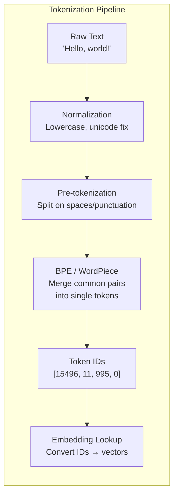

### Tokenization Algorithms

| Algorithm | Used By | How It Works | Strength |
|-----------|---------|-------------|---------|
| **BPE** (Byte Pair Encoding) | GPT series, LLaMA | Start with characters, merge most frequent pairs iteratively | Compact vocabulary |
| **WordPiece** | BERT, DistilBERT | Similar to BPE but maximizes likelihood | Good for NLU |
| **SentencePiece** | T5, Gemma | Language-agnostic, treats text as raw bytes | Works for any language |
| **Tiktoken** | OpenAI GPT-4 | BPE with optimized encoding | Fast, deterministic |

### Why Tokenization Matters for System Design

```
Token counting = cost + latency + context limit

GPT-4 pricing:   $30 / 1M input tokens
Claude Sonnet:   $3  / 1M input tokens

A 10-page document ≈ 3,000 words ≈ 4,000 tokens

Cost of processing 1M documents:
  = 1M × 4,000 tokens = 4 Billion tokens
  = $120,000 at GPT-4 pricing
  = $12,000 at Claude Sonnet pricing

→ Token efficiency is a real infrastructure cost concern
```

### Token Rule of Thumb

```
1 token ≈ 4 characters of English text
1 token ≈ 0.75 words
100 tokens ≈ 75 words ≈ 1 short paragraph
1,000 tokens ≈ 750 words ≈ 1.5 pages
```

---

## 3. Vectorization (Embeddings)

### What it is — Plain English

Imagine placing every word in a giant 3D space. Words that mean similar things are placed *close together*. "King" and "Queen" are nearby. "Dog" and "Cat" are nearby. "Dog" and "Democracy" are far apart. Vectorization converts text into coordinates in this meaning-space — we call these coordinates **embeddings**.

> [!IMPORTANT]
> **Key insight:** Similarity in vector space = similarity in meaning. This is the foundation of semantic search, RAG, and recommendation systems.

### The Famous Word2Vec Example

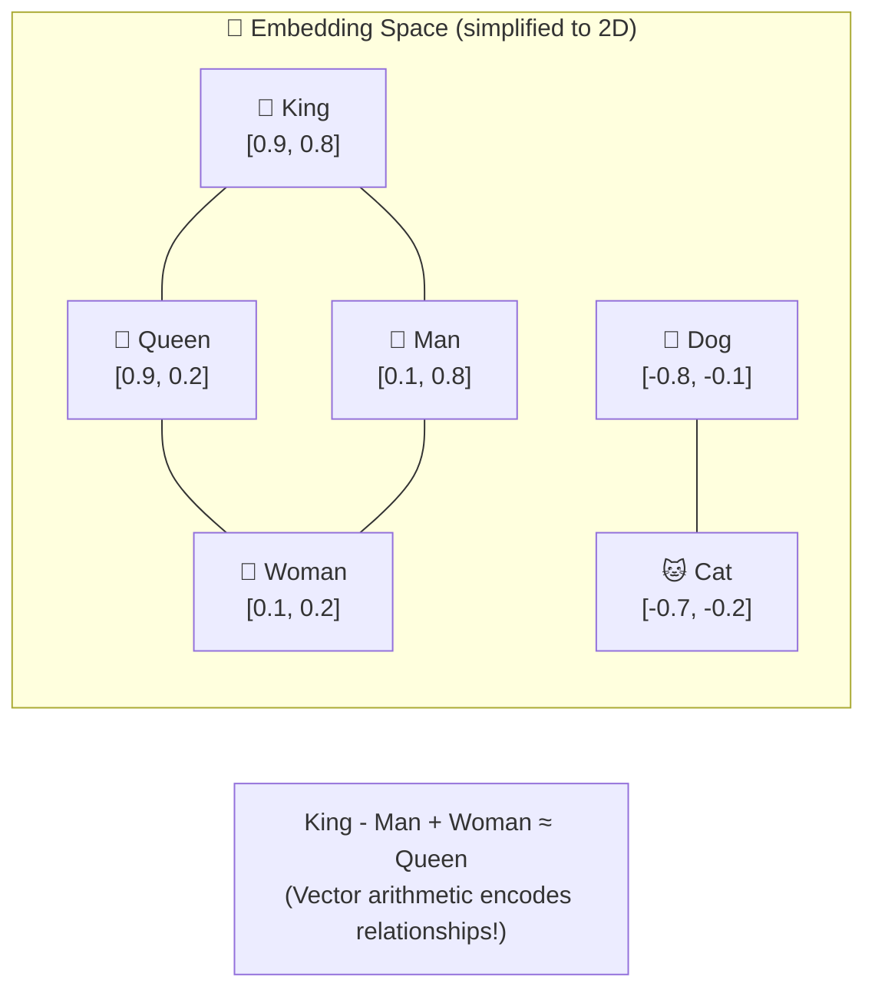

### Embedding Dimensions in Practice

```
Word2Vec (2013):     100–300 dimensions
BERT-base:           768 dimensions
OpenAI text-ada-002: 1,536 dimensions
text-embedding-3-large: 3,072 dimensions

Real embedding for the word "bank" (simplified to 6 dims):
  [0.23, -0.87, 0.45, 0.12, -0.34, 0.78]

Same word, different context:
  "river bank" → [0.91, -0.12, 0.23, -0.45, 0.67, 0.34]  ← near "water", "shore"
  "savings bank" → [0.12, 0.78, -0.34, 0.89, -0.23, 0.45] ← near "money", "finance"
```

### Types of Embeddings

| Type | Input | Dimensions | Best For |
|------|-------|-----------|---------|
| **Word Embeddings** | Single word | 100–300 | Basic NLP tasks |
| **Sentence Embeddings** | Full sentence | 384–1536 | Semantic search |
| **Document Embeddings** | Long text | 768–3072 | RAG, clustering |
| **Image Embeddings** | Image pixels | 512–2048 | Image search, multimodal |
| **Code Embeddings** | Code snippets | 768–1536 | Code search |
| **Multimodal Embeddings** | Text + Image | 512–1536 | Cross-modal search |

### System Design Role

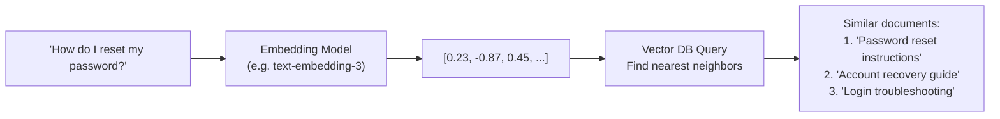

---

## 4. Attention Mechanism

### What it is — Plain English

When you read the sentence *"The animal didn't cross the street because it was too tired"* — how do you know what "it" refers to? You pay **attention** to earlier parts of the sentence and connect "it" back to "animal." The attention mechanism gives neural networks this same ability: for every word being processed, look back at all other words and decide which ones are most relevant.

### The Analogy — A Search Engine Inside the Model

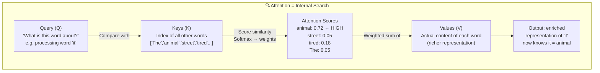

### Multi-Head Attention

Instead of one attention computation, the Transformer runs **multiple attention heads in parallel** — each learning to focus on different types of relationships.

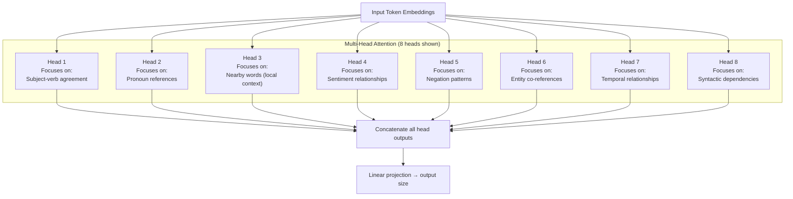

### Attention Complexity — The Scaling Problem

```
Attention complexity = O(n²) where n = sequence length

n = 1,000 tokens → 1M computations
n = 10,000 tokens → 100M computations
n = 100,000 tokens → 10 Billion computations  ← expensive!

This is why long context windows (128K, 1M tokens) require:
  - Flash Attention (memory-efficient attention)
  - Sliding window attention (Mistral)
  - Linear attention approximations
```

---

## 5. Self-Supervised Learning

### What it is — Plain English

Traditional machine learning needs humans to label data — "this photo is a cat," "this email is spam." Self-supervised learning skips the human label step. It *creates its own labels* from the raw data structure. For text, the most common trick: hide some words and ask the model to predict what they were.

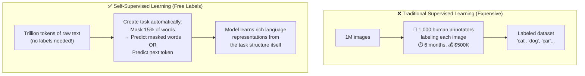

### Two Main Flavors

| Approach | Technique | Used By | Key Idea |
|---------|-----------|---------|----------|
| **Masked Language Modeling (MLM)** | Hide random words, predict them | BERT, RoBERTa | Bidirectional context |
| **Causal Language Modeling (CLM)** | Predict the next word | GPT series, LLaMA, Claude | Left-to-right generation |
| **Contrastive Learning** | Pull similar examples together, push dissimilar apart | CLIP, SimCLR | Representation learning |
| **Span Prediction** | Mask entire spans of text | T5, BART | Text-to-text tasks |

### Why It Matters

```
Before self-supervised learning (pre-2018):
  Training a good NLP model needed 100K+ labeled examples.
  Labeling 100K examples = expensive and slow.

After BERT/GPT (2018+):
  Pre-train on 1 Trillion unlabeled tokens (free from internet).
  Fine-tune on just 1,000 labeled examples.
  Performance = better than old approach with 100K labels.

→ This is why LLMs could scale: data became essentially free.
```

---

## 6. Transformer Architecture

### What it is — Plain English

The Transformer (introduced in the 2017 paper *"Attention Is All You Need"*) is the architectural foundation of every modern LLM. Before it, models processed text sequentially — one word at a time. The Transformer processes the *entire sequence at once* in parallel using attention, making it dramatically faster to train on modern hardware.

### The Full Architecture

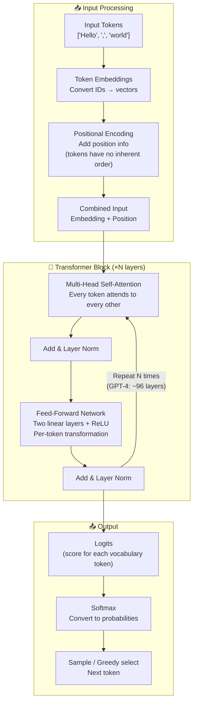

### Encoder vs. Decoder vs. Encoder-Decoder

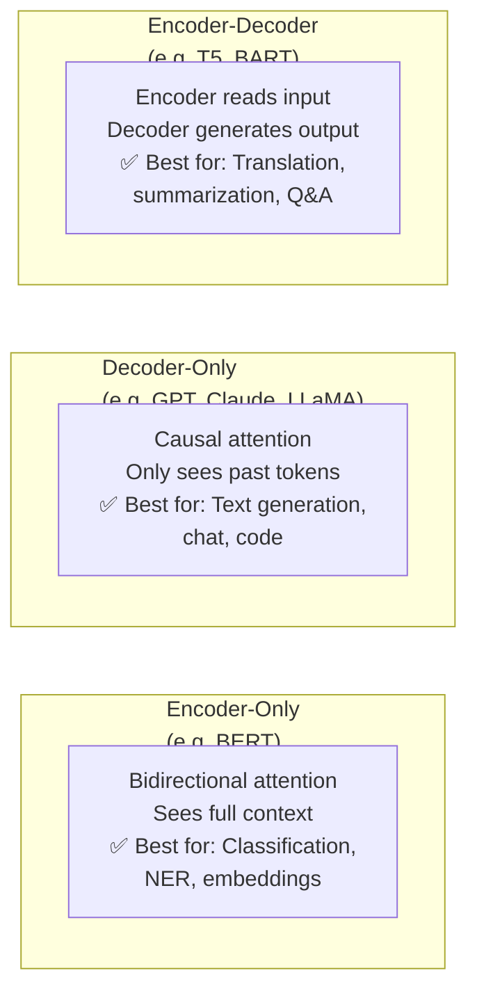

### Key Transformer Components Explained Simply

| Component | Analogy | Purpose |
|-----------|---------|---------|
| **Token Embedding** | Dictionary lookup | Converts token ID to a dense vector |
| **Positional Encoding** | Page numbers in a book | Tells model where each token sits in sequence |
| **Self-Attention** | Highlighting related words | Lets tokens look at and learn from each other |
| **Feed-Forward Network** | Feature transformation | Per-token computation after attention |
| **Layer Norm** | Calibration step | Keeps activations in healthy range |
| **Residual Connection** | Shortcut highway | Passes original input alongside transformed signal |
| **Softmax** | Voting machine | Converts raw scores to probabilities |

---

## 7. Fine-Tuning

### What it is — Plain English

A pre-trained LLM knows a lot about language in general, but it doesn't know *your company's* writing style, *your domain's* terminology, or how to behave as a helpful assistant vs. a neutral text predictor. Fine-tuning takes this general-purpose model and gives it specialized training on a smaller, curated dataset — reshaping its behavior for a specific purpose.

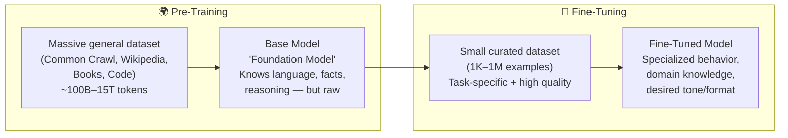

### Types of Fine-Tuning

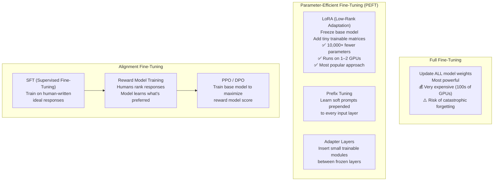

### LoRA — The Workhorse of Fine-Tuning

```
Problem: A 70B model has 70 Billion parameters.
         Updating all of them = massive compute + memory.

LoRA Insight:
  The "update" you need is low-rank.
  Instead of updating full weight matrix W (huge),
  learn two small matrices A and B where A×B ≈ the update.

Original: W is (4096 × 4096) = 16.7M parameters
LoRA:     A is (4096 × 16), B is (16 × 4096) = 131K parameters
          That's 128× fewer parameters to train!

Result: Fine-tune a 70B model on a single A100 GPU.
```

### When to Fine-Tune vs. Prompt Engineer

| Situation | Approach | Reason |
|-----------|---------|--------|
| New writing style/tone | Fine-tune | Style is hard to describe in words |
| Domain-specific vocabulary | Fine-tune | Model may not know your terms |
| Consistent structured output | Fine-tune | Format needs to be rock-solid |
| New task with examples | Few-shot prompting first | Cheaper, faster to iterate |
| Behavior across all inputs | Fine-tune | Prompting is per-request |
| Just need current info | RAG | Fine-tuning doesn't update knowledge easily |

---

## 8. Few-Shot Prompting

### What it is — Plain English

Instead of writing a long instruction manual, you just show the model a few examples of what you want. Like showing a new employee 3 example emails and saying "write like this" — the model figures out the pattern from the examples.

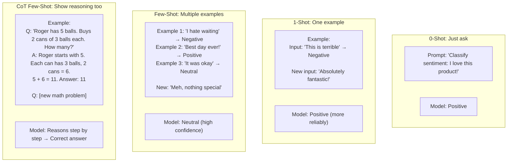

### Few-Shot Prompting Anatomy

```
┌─────────────────────────────────────────────────┐
│               FEW-SHOT PROMPT                   │
├─────────────────────────────────────────────────┤
│ SYSTEM CONTEXT (optional)                       │
│ "You are a customer support classifier."        │
├─────────────────────────────────────────────────┤
│ EXAMPLE 1 (demonstrates the pattern)            │
│ Input:  "My order hasn't arrived"               │
│ Output: {"category": "shipping", "urgency": 3}  │
├─────────────────────────────────────────────────┤
│ EXAMPLE 2                                       │
│ Input:  "I want a refund"                       │
│ Output: {"category": "billing", "urgency": 2}   │
├─────────────────────────────────────────────────┤
│ EXAMPLE 3                                       │
│ Input:  "App keeps crashing"                    │
│ Output: {"category": "technical", "urgency": 4} │
├─────────────────────────────────────────────────┤
│ NEW INPUT (the actual query)                    │
│ Input:  "Can't log into my account"             │
│ Output: ???  ← Model fills this in              │
└─────────────────────────────────────────────────┘
```

### Prompting Strategy Comparison

| Strategy | Examples Needed | Cost | Best For |
|---------|----------------|------|---------|
| **Zero-shot** | 0 | Lowest | Well-known tasks |
| **One-shot** | 1 | Low | Simple format demos |
| **Few-shot** | 3–10 | Medium | Complex format, edge cases |
| **Many-shot** | 10–100 | Higher | Rare tasks, nuanced behavior |
| **Fine-tuning** | 1K–1M | Highest | Consistent behavior at scale |

---

## 9. Retrieval Augmented Generation (RAG)

### What it is — Plain English

LLMs have a knowledge cutoff — they don't know what happened last week. And they can't know *your* company's internal documents, your product specs, or your customer database. RAG solves this by giving the model a search engine: before answering, the system *retrieves* relevant documents from your data, then *augments* the prompt with those documents, so the model can *generate* an informed answer.

> [!TIP]
> **Analogy:** Open-book exam vs. closed-book. RAG = open book. The model can look things up before answering.

### RAG Architecture

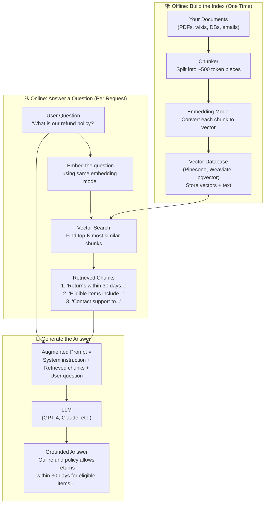

### RAG vs. Fine-Tuning

| Dimension | RAG | Fine-Tuning |
|-----------|-----|-------------|
| **Knowledge updates** | Real-time (just re-index) | Requires re-training |
| **Data privacy** | Data stays in your VectorDB | Data is baked into weights |
| **Hallucination** | Lower (grounded in retrieved docs) | Can still hallucinate |
| **Cost** | Per-query retrieval cost | One-time training cost |
| **Latency** | Adds retrieval step (~50–200ms) | No extra latency |
| **Best for** | Dynamic, changing knowledge | Style, format, behavior |

### Advanced RAG Patterns

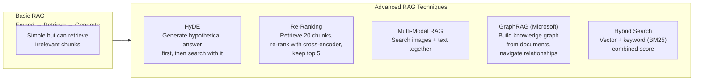

---

## 10. Vector Database

### What it is — Plain English

A regular database answers the question "find me the row where `id = 42`" — exact match. A vector database answers the question "find me the 10 most *similar* items to this" — approximate nearest neighbor search. It's a database optimized for finding meaning-neighbors in a high-dimensional embedding space.

### Regular DB vs. Vector DB

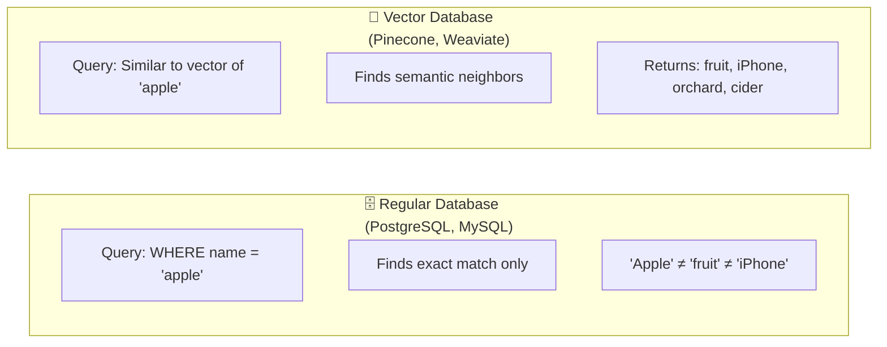

### How Vector Search Works (HNSW Algorithm)

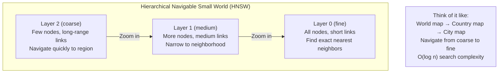

### Vector DB Comparison

| Database | Type | Hosted | Strengths | Weaknesses |
|----------|------|--------|-----------|------------|
| **Pinecone** | Purpose-built | Cloud-only | Simplest API, managed | Expensive, no self-host |
| **Weaviate** | Purpose-built | Both | GraphQL, hybrid search | Complex setup |
| **Qdrant** | Purpose-built | Both | Fast, Rust-based | Smaller ecosystem |
| **Chroma** | Purpose-built | Self-host | Great for dev/prototyping | Not production-scale |
| **pgvector** | PostgreSQL extension | Self-host | Already have Postgres? | Slower than purpose-built |
| **Redis** | Extension | Both | Already using Redis? | Not optimized for vectors |
| **Milvus** | Purpose-built | Both | High scale, open source | Complex operations |

### Key Metrics

```
Recall@K: Of the true K nearest neighbors, what % did we find?
  → Good system: 95%+ recall

Latency: How fast is a single query?
  → Target: < 50ms at p99

QPS: How many queries per second?
  → Pinecone: ~1,000 QPS per pod
  → Weaviate: ~5,000 QPS on good hardware

Dimensionality: How many dimensions per vector?
  → 768 (BERT), 1536 (OpenAI), 3072 (large models)
```

---

## 11. Model Context Protocol (MCP)

### What it is — Plain English

Imagine every AI tool (GitHub Copilot, Claude, ChatGPT) needing a custom integration with every data source (Google Drive, Slack, Jira, Postgres). That's N×M integrations — a nightmare. MCP (introduced by Anthropic in 2024) is a **universal standard** so any AI can talk to any tool through one consistent interface. Like USB-C for AI tool connections.

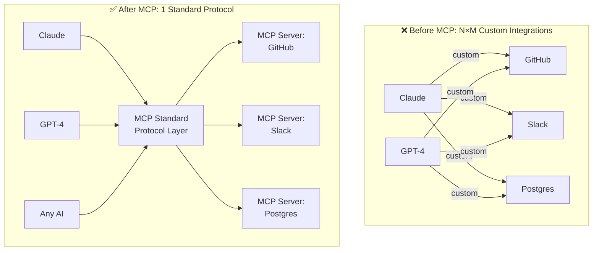

### MCP Architecture

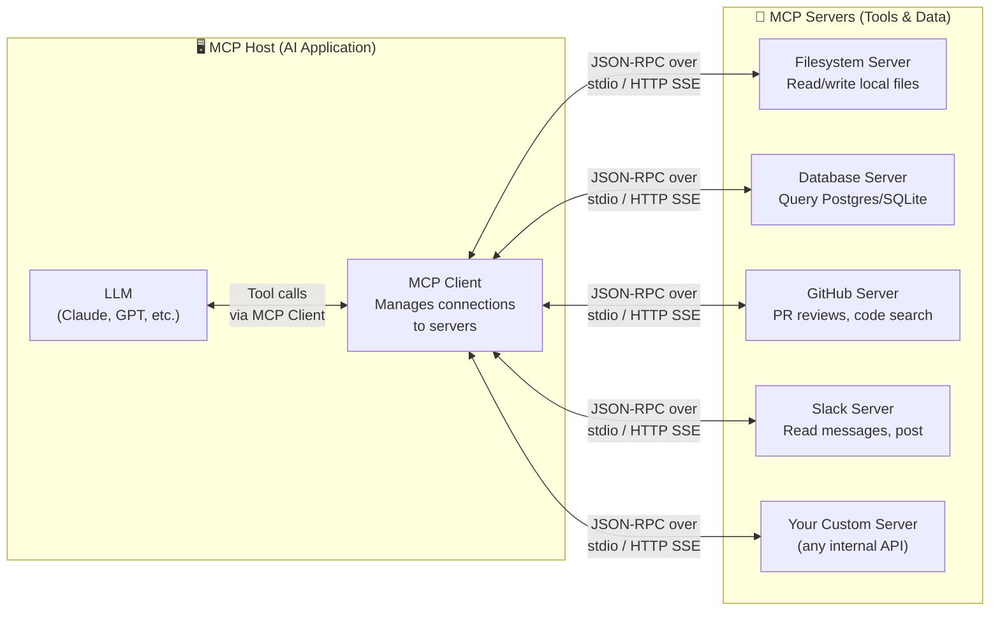

### MCP Primitives

| Primitive | What It Is | Example |
|-----------|-----------|---------|
| **Tools** | Functions the LLM can call | `search_github(query)`, `query_db(sql)` |
| **Resources** | Data the LLM can read | `/documents/policy.pdf`, database schema |
| **Prompts** | Reusable prompt templates | "Summarize this PR in 3 bullet points" |
| **Sampling** | Server requests LLM completion | Nested AI calls from within a server |

---

## 12. A2A Protocol (Agent-to-Agent)

### What it is — Plain English

As AI systems grow more complex, you often need multiple specialized AI agents working together — one agent researches, another writes, another reviews. The A2A (Agent-to-Agent) protocol (introduced by Google, 2025) is a standard for how AI agents **discover, communicate with, and delegate tasks to each other** — even across different vendors and frameworks.

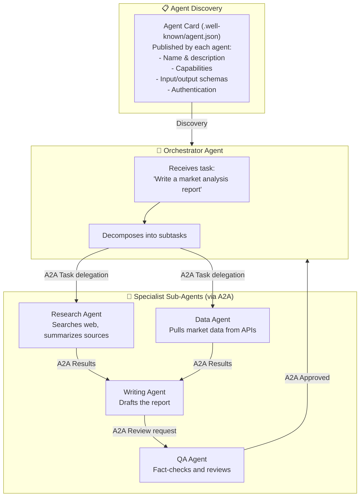

### MCP vs. A2A — Know the Difference

| Dimension | MCP | A2A |
|-----------|-----|-----|
| **Purpose** | Connect AI to tools/data | Connect AI agents to each other |
| **Direction** | LLM → Tools | Agent → Agent |
| **Analogy** | USB-C for tools | REST API for agents |
| **Initiated by** | Anthropic (2024) | Google (2025) |
| **Transport** | JSON-RPC, stdio, SSE | HTTP, JSON |
| **Use case** | "Query this database" | "Delegate this subtask to a specialist" |

---

## 13. Context Engineering

### What it is — Plain English

The context window is the model's working memory — everything it can "see" at once. Context engineering is the discipline of deciding **what goes into that window** to maximize the quality of the output. It's like deciding what papers to put on a consultant's desk before they write a report — you want exactly the right information, in the right order, with no noise.

> *"Context engineering is the delicate art and science of filling the context window with exactly the right information at the right time."* — Andrej Karpathy

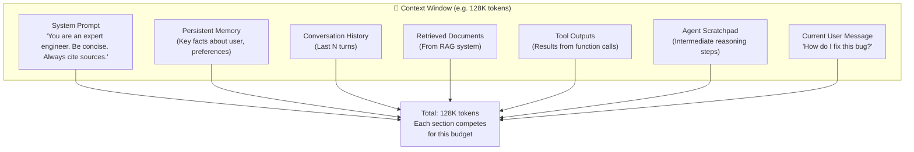

### Context Engineering Techniques

| Technique | What It Does | When to Use |
|-----------|-------------|-------------|
| **Prompt compression** | Summarize old conversation turns | Long multi-turn sessions |
| **Selective retrieval** | Only fetch top-K relevant chunks | RAG systems |
| **Instruction distillation** | Shorten system prompt without losing intent | Cost reduction |
| **Memory summarization** | Compress old context into key facts | Persistent agents |
| **Tool output truncation** | Trim verbose API responses | Tool-using agents |
| **Context ordering** | Put most critical info first and last | Attention is strongest at boundaries |
| **Few-shot placement** | Examples near the end outperform start | Better in-context learning |

### The Lost in the Middle Problem

```
Research finding: LLMs are better at using information
placed at the START or END of context.
Information in the MIDDLE of long contexts is often "lost."

Implication for context engineering:
  ✅ Put the most important instructions at the TOP of system prompt
  ✅ Put the most relevant retrieved chunk closest to the question
  ✅ Summarize and compress the middle section
  ✅ Repeat critical constraints at the end

Context window budget allocation (typical RAG chatbot):
  System prompt:         ~1,000 tokens (0.8%)
  Retrieved docs:        ~8,000 tokens (6.2%)
  Conversation history:  ~4,000 tokens (3.1%)
  User message:          ~500 tokens (0.4%)
  ─────────────────────────────────────────
  Total used:            ~13,500 / 128,000 tokens
  Output budget:         up to ~4,096 tokens
```

---

## 14. AI Agents

### What it is — Plain English

A regular LLM answers questions. An **AI Agent** takes *actions* in the world — it can search the web, run code, query databases, send emails, click on web pages, and call APIs. More importantly, it can do this in a **loop** — observe the result, decide the next action, act, observe again — until a goal is reached.

> [!TIP]
> **Analogy:** LLM = a brilliant advisor sitting in a room answering questions. Agent = that same advisor, but with a computer, phone, and ability to leave the room and do things.

### The Agent Loop

```mermaid
graph TD
    subgraph AgentLoop["🔄 The ReAct Agent Loop"]
        GOAL["User Goal\n'Book me the cheapest flight to NYC next Friday'"]
        THINK["THINK / REASON\nWhat do I need to do next?\n'I should search for flights'"]
        ACT["ACT\nCall tool: search_flights(dest='NYC', date='next Friday')"]
        OBS["OBSERVE\nTool returns: [flight1: $320, flight2: $410...]"]
        DECIDE{"Goal\nAchieved?"}
        NEXT["THINK again\n'I need to check baggage fees for flight1'"]
        DONE["DONE\n'The cheapest option is Delta for $320.\nShall I book it?'"]
    end

    GOAL --> THINK --> ACT --> OBS --> DECIDE
    DECIDE -->|"No"| NEXT --> THINK
    DECIDE -->|"Yes"| DONE
```

### Agent Components

```mermaid
graph TD
    subgraph AgentArch["🤖 AI Agent Architecture"]
        LLM_CORE["LLM Core\n(Reasoning engine)"]

        subgraph Memory["💾 Memory Systems"]
            STM["Short-term (context window)\nCurrent task state"]
            LTM["Long-term (vector DB)\nPast experiences, facts"]
            EPI["Episodic (logs)\nHistory of actions taken"]
        end

        subgraph Tools["🔧 Tool Belt"]
            SEARCH["Web Search\n(Brave, Perplexity)"]
            CODE["Code Interpreter\n(Run Python, JS)"]
            BROWSER["Browser Automation\n(Playwright)"]
            APIS["External APIs\n(Slack, GitHub, Stripe)"]
            FILES["File System\n(Read/write)"]
        end

        PLAN["Planning Module\nDecompose complex tasks\ninto subtasks"]
        REFLECT["Self-Reflection\nCritique own outputs\nCorrect mistakes"]
    end

    LLM_CORE <--> Memory
    LLM_CORE <--> Tools
    LLM_CORE <--> PLAN
    LLM_CORE <--> REFLECT
```

### Agent Patterns

| Pattern | Description | Example |
|---------|-------------|---------|
| **ReAct** | Reason + Act interleaved | General-purpose agent loops |
| **Plan & Execute** | Plan all steps first, then execute | Long, structured workflows |
| **Reflexion** | Reflect on failures, retry with insight | Code generation with self-correction |
| **Multi-Agent** | Orchestrator + specialist agents | Research → Write → Review pipeline |
| **Tree of Thoughts** | Explore multiple reasoning branches | Complex problem solving |

---

## 15. Reinforcement Learning (RL & RLHF)

### What it is — Plain English

In reinforcement learning, an agent learns by trying things and getting **feedback** — reward for good actions, penalty for bad ones. Applied to LLMs (RLHF — Reinforcement Learning from Human Feedback), this is how models learn to be *helpful, harmless, and honest* — not just to predict the next token, but to generate responses that *humans actually prefer*.

```mermaid
graph TD
    subgraph RLHF["RLHF Pipeline"]
        subgraph Step1["Step 1: SFT — Supervised Fine-Tuning"]
            S1A["Collect human-written\nideal responses\n(~10K–100K examples)"]
            S1B["Fine-tune base model\non this data"]
            S1C["SFT Model:\nKnows how to be helpful\nbut not how to rank quality"]
        end

        subgraph Step2["Step 2: Train Reward Model"]
            S2A["Collect preference data:\nShow humans 2 model responses\nThey pick the better one"]
            S2B["Train Reward Model (RM)\nPredicts human preference score\nfor any response"]
        end

        subgraph Step3["Step 3: RL Fine-Tuning (PPO)"]
            S3A["Generate responses with SFT model"]
            S3B["Score each response\nwith Reward Model"]
            S3C["PPO updates model weights\nto maximize reward score\n(while staying close to SFT model)"]
            S3A --> S3B --> S3C --> S3A
        end

        Step1 --> Step2 --> Step3
    end
```

### RLHF → DPO: The Simpler Successor

```
RLHF Problem:
  Needs 3 separate models: SFT + Reward Model + PPO Policy
  Training is unstable and complex
  Reward model can be "hacked" (reward hacking)

DPO (Direct Preference Optimization) — 2023:
  Skips the reward model entirely!
  Directly fine-tunes on preference pairs
  (chosen response vs. rejected response)
  Simpler, more stable, widely adopted

GRPO (Group Relative Policy Optimization) — DeepSeek:
  Used for math/reasoning tasks
  Groups multiple responses, ranks them
  No separate reward model needed
```

### RL in Modern LLMs

| Model | RL Method | Key Outcome |
|-------|-----------|-------------|
| ChatGPT (GPT-3.5) | RLHF + PPO | Conversational helpfulness |
| Claude 3 | Constitutional AI + RLHF | Harmlessness + helpfulness |
| DeepSeek-R1 | GRPO (pure RL) | Mathematical reasoning |
| Llama 3 (Instruct) | DPO | Instruction following |
| Gemini | RLHF variants | Multimodal alignment |

---

## 16. Chain of Thought (CoT)

### What it is — Plain English

Ask a model "What is 17 × 24?" — it may blurt a wrong answer. Ask it "Think step by step: What is 17 × 24?" — it breaks it down, does each step, and gets it right. Chain of Thought prompting forces the model to **externalize its reasoning** before giving a final answer, dramatically improving accuracy on complex tasks.

```mermaid
graph LR
    subgraph WithoutCoT["❌ Without Chain of Thought"]
        Q1["Q: Alice has 3 brothers. Each brother has 2 sisters. How many sisters does Alice have?"]
        A1["Model: 6 ❌\n(just multiplied 3×2)"]
    end

    subgraph WithCoT["✅ With Chain of Thought"]
        Q2["Q: Alice has 3 brothers. Each brother has 2 sisters. How many sisters does Alice have?\nLet's think step by step."]
        REASON["Model reasons:\n- Alice is female, so she is one of the sisters.\n- Each of Alice's 3 brothers has 2 sisters.\n- Those sisters are Alice + 1 other girl.\n- So Alice has 1 sister."]
        A2["Answer: 1 ✅"]
        Q2 --> REASON --> A2
    end
```

### Variants of Chain of Thought

```mermaid
graph TD
    subgraph Variants["CoT Variants"]
        ZS["Zero-Shot CoT\nJust add: 'Let's think step by step'\nWorks surprisingly well!"]
        FS["Few-Shot CoT\nProvide examples with\nfull reasoning chains"]
        AUTO["Auto-CoT\nAutomatically generate\nchain-of-thought examples"]
        SC["Self-Consistency\nGenerate N reasoning chains\nVote on the majority answer"]
        TOT["Tree of Thoughts\nExplore branching reasoning\npaths, backtrack if wrong"]
        PROG["Program of Thought\nReason by writing code\nExecute for answer"]
    end
```

### When CoT Helps Most

| Task Type | CoT Benefit | Why |
|-----------|-------------|-----|
| Multi-step math | 🚀 Huge | Forces intermediate computation |
| Logical deduction | 🚀 Huge | Makes assumptions explicit |
| Commonsense reasoning | ✅ Good | Surfaces implicit knowledge |
| Code debugging | ✅ Good | Step-through logic |
| Simple factual Q&A | ❌ Little | Answer is direct recall |
| Classification | ❌ Little | No reasoning chain needed |

---

## 17. Reasoning Models

### What it is — Plain English

Standard LLMs generate output token-by-token immediately. Reasoning models have a **hidden thinking phase** before they respond — they spend time exploring the problem space, considering multiple approaches, self-correcting, and only then produce a final answer. It's the difference between blurting out the first thing that comes to mind vs. taking 5 minutes to think a problem through.

```mermaid
sequenceDiagram
    participant U as User
    participant STD as Standard LLM
    participant RM as Reasoning Model

    U->>STD: "Prove that √2 is irrational"
    STD->>U: [immediate response, sometimes wrong]

    U->>RM: "Prove that √2 is irrational"
    Note over RM: 🤔 Hidden thinking (seconds to minutes)
    Note over RM: "Assume √2 = p/q in lowest terms..."
    Note over RM: "Then 2 = p²/q², so p² = 2q²..."
    Note over RM: "Wait, that means p is even, let p = 2k..."
    Note over RM: "Then 4k² = 2q², so q² = 2k²..."
    Note over RM: "q must also be even... contradiction!"
    Note over RM: "The proof works. Now write cleanly."
    RM->>U: [polished, correct proof with clear steps]
```

### Standard LLM vs. Reasoning Model

| Dimension | Standard LLM | Reasoning Model |
|-----------|-------------|-----------------|
| **Response time** | Fast (< 1s) | Slower (5s–5min) |
| **Thinking** | Implicit in weights | Explicit "thinking" tokens |
| **Cost** | Lower | Higher (more tokens generated) |
| **Math/logic** | Good | Excellent |
| **Simple tasks** | Great | Overkill |
| **Transparency** | None | Can see reasoning |
| **Examples** | GPT-4o, Claude Sonnet | o1, o3, Claude 3.7 Sonnet, DeepSeek-R1 |

### How Reasoning Models Are Trained

```mermaid
graph LR
    BASE["Base LLM"] --> RL["Reinforcement Learning\non reasoning tasks\n(math, code, logic)"]
    RL --> REWARD{"Reward Signal"}
    REWARD -->|"Correct final answer"| POSITIVE["✅ Positive reward\nReinforce this reasoning path"]
    REWARD -->|"Wrong answer"| NEGATIVE["❌ Negative reward\nDiscorage this path"]
    POSITIVE & NEGATIVE --> POLICY["Updated Policy:\nModel learns to explore\nand self-correct"]
    POLICY --> REASON["Reasoning Model\nSelf-discovers CoT,\nbacktracking, verification"]
```

> [!NOTE]
> **Key insight:** DeepSeek-R1 showed that pure RL (without human-labeled reasoning chains) can teach a model to develop complex reasoning behaviors from scratch — including self-correction and "aha moments."

---

## 18. Multimodal Language Models

### What it is — Plain English

Early LLMs only understood text. Multimodal models understand **multiple types of input** — images, audio, video, documents, and code — and can reason *across* these modalities. Ask a multimodal model "What's in this photo?" or "Describe what's happening in this video" or "Transcribe this audio" — it handles all of these.

```mermaid
graph TD
    subgraph Inputs["📥 Multiple Input Modalities"]
        IMG["🖼️ Images\nPhotos, screenshots, charts"]
        AUD["🎵 Audio\nSpeech, music, sounds"]
        VID["🎬 Video\nClips, screen recordings"]
        DOC["📄 Documents\nPDFs, spreadsheets"]
        CODE["💻 Code\nPrograms, queries"]
        TEXT["📝 Text\nQuestions, instructions"]
    end

    subgraph Encoders["🔄 Modality-Specific Encoders"]
        VE["Vision Encoder\n(e.g. ViT — Vision Transformer)\nConverts image patches → embeddings"]
        AE["Audio Encoder\n(e.g. Whisper)\nConverts spectrogram → embeddings"]
        TE["Text Encoder\nTokenize → embeddings"]
    end

    subgraph Fusion["🔀 Cross-Modal Fusion"]
        PROJ["Projection Layer\nAlign all embeddings\ninto shared vector space"]
        UNILLM["Unified LLM\nAttention across ALL modalities\nReason over combined context"]
    end

    subgraph Output["📤 Outputs"]
        TXT["Text generation"]
        IMG_OUT["Image generation (DALL-E, Imagen)"]
        AUDIO_OUT["Speech synthesis"]
    end

    IMG --> VE
    AUD --> AE
    TEXT --> TE
    VE & AE & TE --> PROJ --> UNILLM
    UNILLM --> TXT & IMG_OUT & AUDIO_OUT
```

### Multimodal Capabilities Matrix

| Model | Text | Images | Audio | Video | Code | Documents |
|-------|------|--------|-------|-------|------|-----------|
| **GPT-4o** | ✅ | ✅ | ✅ | ✅ | ✅ | ✅ |
| **Claude 3.5** | ✅ | ✅ | ❌ | ❌ | ✅ | ✅ |
| **Gemini 1.5 Pro** | ✅ | ✅ | ✅ | ✅ | ✅ | ✅ |
| **LLaMA 3.2 Vision** | ✅ | ✅ | ❌ | ❌ | ✅ | ✅ |
| **Whisper** | ✅ | ❌ | ✅ | ❌ | ❌ | ❌ |
| **CLIP** | ✅ | ✅ | ❌ | ❌ | ❌ | ❌ |

---

## 19. Small Language Models (SLM)

### What it is — Plain English

Bigger isn't always better. Small Language Models are compact, efficient models (1B–13B parameters) that can run on a laptop, phone, or edge device — without needing a data center. They trade some capability for massive gains in **cost, speed, privacy, and deployability**.

```mermaid
graph LR
    subgraph BigLLM["🏔️ Large LLM (70B–1T params)"]
        BL["GPT-4, Claude 3 Opus, Gemini Ultra"]
        BR["✅ Most capable\n✅ Best reasoning\n❌ $0.01–0.06 per 1K tokens\n❌ 100–500ms latency\n❌ Data must leave device\n❌ Needs GPU cluster"]
    end

    subgraph SmallLLM["📱 Small LLM (1B–13B params)"]
        SL["Phi-3 Mini, Gemma 2B,\nLLaMA 3.2 3B, Mistral 7B"]
        SR["✅ Runs on iPhone / laptop\n✅ < 10ms latency on device\n✅ Fully private (no API)\n✅ Near-zero marginal cost\n❌ Less capable on complex tasks\n❌ Smaller knowledge base"]
    end
```

### SLM Use Cases

| Use Case | Why SLM Fits | Example Model |
|----------|-------------|---------------|
| **On-device AI** (phone/edge) | No internet needed, private | Phi-3 Mini (3.8B) on iPhone |
| **Real-time autocomplete** | Must be < 20ms | Gemma 2B |
| **High-volume classification** | Cost prohibitive with LLM APIs | Distilbert (66M params) |
| **Air-gapped environments** | No cloud connectivity | LLaMA 3.2 3B local |
| **Embedded devices** | IoT, wearables | TinyLLM (< 1B) |
| **Specialized tasks** | Fine-tuned SLM beats general LLM | Medical SLM, legal SLM |

### The SLM Sweet Spot

```
Task complexity spectrum:

Simple                                          Complex
  │────────────────────────────────────────────│
  │ Classify  │ Extract  │ Summarize │ Reason  │
  │  email    │  dates   │  doc      │ deeply  │
  ▲           ▲          ▲          ▲          ▲
  SLM 3B    SLM 7B    SLM 13B   LLM 70B   LLM 1T+

Key: Fine-tuned SLM often BEATS general LLM on narrow tasks.
Phi-3-mini fine-tuned on medical data > GPT-4 on medical QA
```

---

## 20. Distillation

### What it is — Plain English

Training a large, expensive model and then "teaching" a small, cheap model to mimic it. The large model (Teacher) has learned rich internal representations. Instead of training the student from scratch, we use the teacher's **soft predictions** (confidence scores across all possibilities) as richer training signals — the student learns not just "the answer is cat" but "it's 70% cat, 25% leopard, 5% other feline."

> [!TIP]
> **Analogy:** A senior engineer writes detailed code reviews with explanations. A junior engineer learns faster from those detailed reviews than from just reading "approved" or "rejected."

```mermaid
graph TD
    subgraph Teacher["🧑‍🏫 Teacher Model (Large — e.g. GPT-4 70B)"]
        T_INPUT["Input: 'What is the capital of France?'"]
        T_LOGITS["Soft output probabilities:\n Paris: 98.2%\n Lyon: 0.9%\n Berlin: 0.5%\n London: 0.3%\n (full distribution, not just 'Paris')"]
    end

    subgraph Student["🎓 Student Model (Small — e.g. 7B)"]
        S_INPUT["Same input"]
        S_LOGITS["Student's output probabilities:\n Paris: 72%\n Lyon: 12%\n Berlin: 8%\n..."]
        LOSS["KL Divergence Loss:\nMeasure how far student's distribution\nis from teacher's distribution"]
        UPDATE["Update student weights\nto match teacher better"]
        S_LOGITS --> LOSS --> UPDATE
    end

    T_LOGITS -->|"Knowledge transfer\n(not just labels)"| LOSS

    subgraph Result["✅ Distilled Student Model"]
        RES["7B model that performs\nclose to 70B model\non target tasks\n~10× faster, ~10× cheaper"]
    end

    UPDATE --> Result
```

### Distillation Techniques

| Technique | What's Transferred | When to Use |
|-----------|-------------------|-------------|
| **Response Distillation** | Final output tokens | Simple tasks, easiest to implement |
| **Logit Distillation** | Full probability distribution | Best knowledge transfer |
| **Feature Distillation** | Intermediate layer activations | Deep architectural transfer |
| **Attention Distillation** | Attention pattern maps | Transfer reasoning patterns |
| **Data-free Distillation** | Generate synthetic data with teacher | When real data is scarce |

### Real-World Examples

```
DistilBERT (2019):
  Teacher: BERT-base (110M params)
  Student: DistilBERT (66M params)
  Result: 40% smaller, 60% faster, 97% of BERT's performance

DeepSeek-R1 Distillation (2025):
  Teacher: DeepSeek-R1 (671B MoE)
  Student: Qwen 7B / 14B
  Result: 7B model beating GPT-4o on many benchmarks!

Phi-3 (Microsoft, 2024):
  3.8B model trained on "textbook quality" synthetic data
  Generated by GPT-4 (distillation of knowledge, not weights)
  Beats LLaMA 70B on coding benchmarks
```

---

## 21. Quantization

### What it is — Plain English

By default, model weights are stored as 32-bit or 16-bit floating point numbers — very precise but very large. Quantization reduces the precision of these numbers — from 32-bit floats down to 8-bit integers, or even 4-bit — making the model dramatically smaller and faster with minimal quality loss. It's like converting a lossless WAV audio file to an MP3 — smaller file, nearly indistinguishable quality.

```mermaid
graph LR
    subgraph Original["🔵 Original Float32 Weight"]
        F32["Value: 0.34521876\nStorage: 32 bits (4 bytes)\nRange: ±3.4 × 10³⁸\nPrecision: Very high"]
    end

    subgraph Q8["🟢 INT8 Quantized"]
        I8["Value: 88 (maps to ≈ 0.345)\nStorage: 8 bits (1 byte)\nRange: -128 to 127\n4× smaller, minimal quality loss"]
    end

    subgraph Q4["🟡 INT4 Quantized"]
        I4["Value: 5 (maps to ≈ 0.34)\nStorage: 4 bits (0.5 byte)\nRange: -8 to 7\n8× smaller, small quality loss"]
    end

    subgraph Q2["🔴 INT2 Quantized (extreme)"]
        I2["Value: 1 (maps to ≈ 0.3)\nStorage: 2 bits (0.25 byte)\nRange: -2 to 1\n16× smaller, noticeable quality loss"]
    end

    Original -->|"Quantize"| Q8 -->|"More aggressive"| Q4 -->|"Extreme"| Q2
```

### Model Size Comparison After Quantization

| Model | FP16 Size | INT8 | INT4 | Hardware Needed (INT4) |
|-------|-----------|------|------|----------------------|
| LLaMA 3 8B | 16 GB | 8 GB | 4 GB | Mac M2 with 8GB RAM |
| LLaMA 3 70B | 140 GB | 70 GB | 35 GB | Mac M2 Ultra / 2× A100 |
| Mistral 7B | 14 GB | 7 GB | 3.5 GB | Laptop GPU (RTX 4070) |
| GPT-4 (est.) | ~1.4 TB | ~700 GB | ~350 GB | Still needs a cluster |

### Quantization Methods

```mermaid
graph TD
    subgraph Methods["Quantization Methods"]
        PTQ["Post-Training Quantization (PTQ)\nQuantize after training is done\n✅ Simple, no re-training needed\n❌ Some accuracy loss"]
        QAT["Quantization-Aware Training (QAT)\nSimulate quantization during training\n✅ Best quality at low bits\n❌ Requires retraining"]
        GGUF["GGUF Format (llama.cpp)\nMixed precision: different layers\nget different bit widths\n✅ Best quality/size tradeoff\n✅ Runs on CPU + GPU hybrid"]
        GPTQ["GPTQ\nLayer-wise quantization\noptimizes per-layer\n✅ Good INT4 quality"]
        AWQ["AWQ (Activation-aware)\nProtects weights that matter most\n✅ Better than GPTQ in practice"]
    end
```

### Quantization Decision Guide

```
Running inference where?           → Choose quantization level

Cloud (A100/H100 GPUs available):  FP16 or BF16 — no need to quantize
Consumer GPU (RTX 4090, 24GB):     INT8 for 7B models, INT4 for 13B–70B
Mac Apple Silicon (M2/M3):         GGUF Q4_K_M or Q5_K_M via llama.cpp
CPU only (powerful laptop):        GGUF Q4_0 (slower but runs)
Mobile / edge device:              INT4 or INT2 with QAT

Quality rule of thumb:
  Q8 ≈ FP16 for most tasks (< 1% degradation)
  Q4 ≈ FP16 for simple tasks (1–3% degradation)
  Q4 noticeably worse on complex reasoning
  Q2 significant quality loss — avoid for production
```

---

## Concept Relationships — The Big Picture

```mermaid
graph TD
    subgraph Foundation["🏗️ Foundation"]
        TOK["Tokenization"]
        VEC["Vectorization\nEmbeddings"]
        ATTN["Attention\nMechanism"]
        SSL["Self-Supervised\nLearning"]
    end

    subgraph Core["⚙️ Core Architecture"]
        TRANS["Transformer"]
    end

    subgraph Training["🏋️ Training & Alignment"]
        FT["Fine-Tuning\n(LoRA, SFT)"]
        RL["Reinforcement\nLearning (RLHF)"]
        DIST["Distillation"]
        QUANT["Quantization"]
    end

    subgraph Runtime["⚡ Runtime & Inference"]
        FSP["Few-Shot\nPrompting"]
        COT["Chain of\nThought"]
        RAG["RAG"]
        CE["Context\nEngineering"]
        REASON["Reasoning\nModels"]
    end

    subgraph Systems["🔧 Systems & Deployment"]
        VDBQ["Vector DB"]
        AGENTS["AI Agents"]
        MCP_N["MCP"]
        A2A_N["A2A Protocol"]
        SLM["Small Language\nModels"]
        MM["Multimodal\nModels"]
    end

    TOK & VEC & ATTN & SSL --> TRANS
    TRANS --> FT & RL & DIST & QUANT
    TRANS --> FSP & COT & RAG & CE & REASON
    VEC --> VDBQ
    VDBQ --> RAG
    RAG & COT & CE --> AGENTS
    AGENTS --> MCP_N & A2A_N
    DIST & QUANT --> SLM
    SLM & MM --> Systems
```

---

## Interview Quick Reference

| Concept | 10-Word Explanation | Key Trade-off |
|---------|--------------------|-----------| 
| LLM | Predict next token, trained on internet-scale data | Size vs. cost/speed |
| Tokenization | Convert text to numbers the model can process | Vocabulary size vs. coverage |
| Embeddings | Words as coordinates; nearby = similar meaning | Dimensions vs. compute cost |
| Attention | Token looks at all others; weights what matters | O(n²) complexity |
| Self-Supervised | Create labels from data structure, no humans needed | Scale vs. label quality |
| Transformer | Parallel attention over full sequence | Context length vs. memory |
| Fine-Tuning | Specialize a pre-trained model for your task | Cost vs. performance gain |
| Few-Shot | Show examples in prompt instead of writing rules | Token budget vs. accuracy |
| RAG | Retrieve relevant docs, inject into prompt | Latency vs. freshness |
| Vector DB | Nearest-neighbor search in embedding space | Recall vs. speed |
| MCP | USB-C standard for connecting AI to tools | Standardization vs. flexibility |
| A2A | Protocol for agents to delegate to other agents | Coordination vs. complexity |
| Context Engineering | Curate exactly what goes in the context window | Relevance vs. completeness |
| Agents | LLM + tools + memory + planning loop | Autonomy vs. reliability |
| RLHF | Human preferences shape model via reward signal | Alignment vs. capability |
| Chain of Thought | Force model to reason step by step | Latency vs. accuracy |
| Reasoning Models | Hidden thinking phase before final answer | Time/cost vs. correctness |
| Multimodal | See, hear, and read in unified model | Complexity vs. capability |
| SLM | Compact model for edge/private deployment | Capability vs. efficiency |
| Distillation | Compress teacher's knowledge into small student | Quality vs. model size |
| Quantization | Reduce weight precision (32-bit → 4-bit) | Size/speed vs. accuracy |

---

*AI Concepts Reference Guide — Staff AI Engineer System Design Interview Preparation*
*Covers: LLMs, Transformers, RAG, Agents, Reasoning, Multimodal, Distillation, Quantization, and more*
