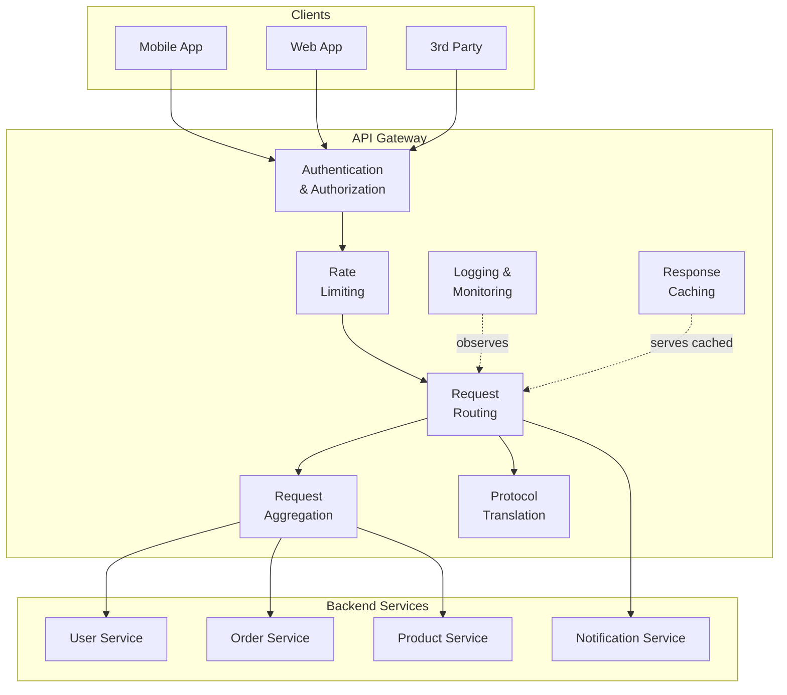
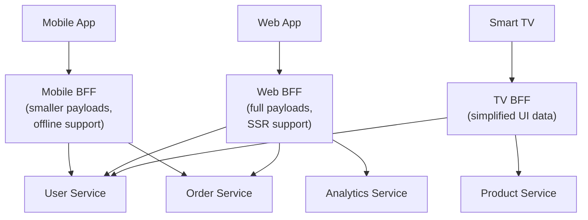
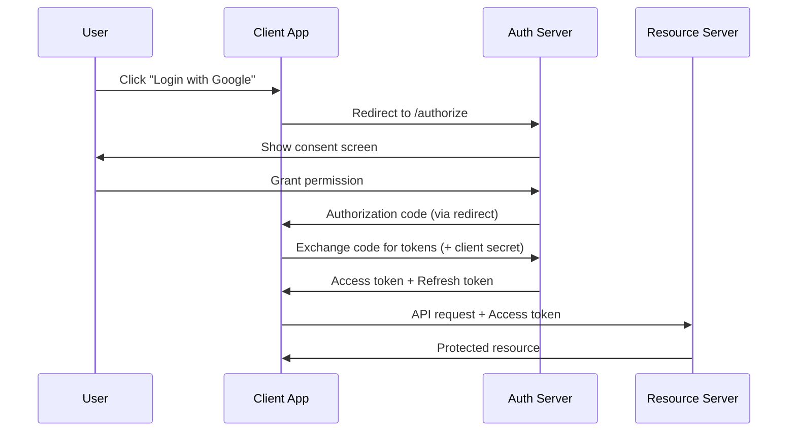
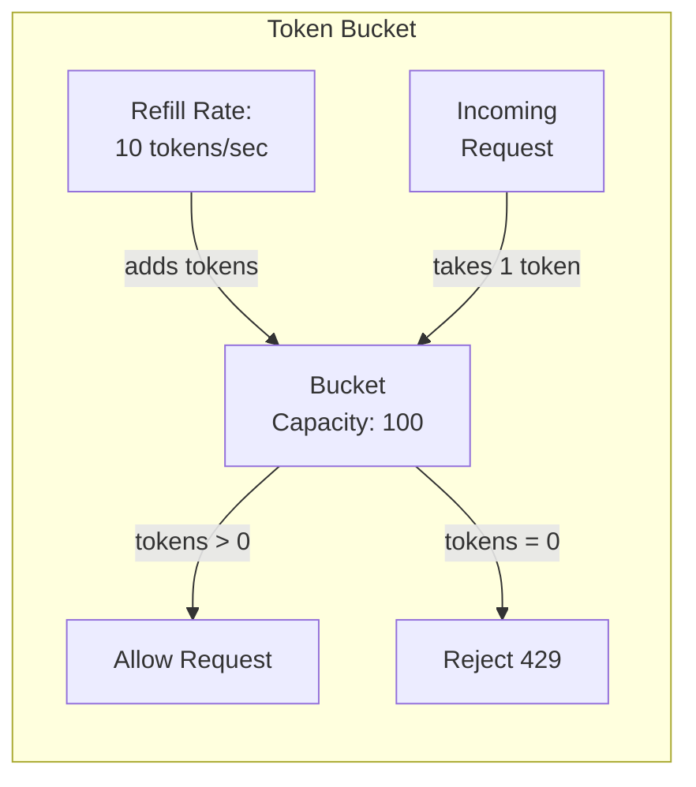
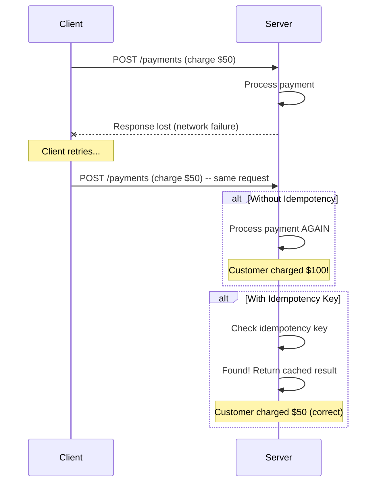

# API Design -- Complete System Design Reference
### Staff Engineer Interview Preparation Guide

> [!TIP]
> **Why API design matters in interviews:** Nearly every system design question involves designing an API layer. Interviewers assess whether you can design clean, scalable, secure APIs and articulate the tradeoffs behind your choices. This is not about memorizing HTTP status codes -- it is about demonstrating you can think about contracts, backward compatibility, and operational concerns.

---

## Table of Contents

1. [REST API Fundamentals](#1-rest-api-fundamentals)
2. [Resource Naming and URL Design](#2-resource-naming-and-url-design)
3. [HTTP Methods and Status Codes](#3-http-methods-and-status-codes)
4. [API Gateway Architecture](#4-api-gateway-architecture)
5. [Authentication Methods](#5-authentication-methods)
6. [Rate Limiting](#6-rate-limiting)
7. [Pagination Approaches](#7-pagination-approaches)
8. [Filtering, Sorting, and Field Selection](#8-filtering-sorting-and-field-selection)
9. [API Versioning Strategies](#9-api-versioning-strategies)
10. [Idempotency](#10-idempotency)
11. [OpenAPI Specification](#11-openapi-specification)
12. [Backward Compatibility](#12-backward-compatibility)
13. [Interview Cheat Sheet](#13-interview-cheat-sheet)

---

## 1. REST API Fundamentals

REST (Representational State Transfer) is an architectural style for distributed systems. It is not a protocol or a standard -- it is a set of constraints that, when followed, yield predictable, scalable APIs.

### The Six REST Constraints

| Constraint | What It Means | Why It Matters |
|---|---|---|
| **Client-Server** | Separate UI concerns from data storage concerns | Independent evolution of frontend and backend |
| **Stateless** | Each request contains all the information needed to process it | Horizontal scaling becomes trivial |
| **Cacheable** | Responses must declare themselves cacheable or non-cacheable | Reduces load, improves latency |
| **Uniform Interface** | Consistent resource identification, manipulation through representations | Simplifies architecture, enables independent evolution |
| **Layered System** | Client cannot tell if it is connected directly to the server or an intermediary | Enables load balancers, caches, gateways |
| **Code on Demand** (optional) | Server can extend client functionality by transferring executable code | Rarely used in practice |

> [!NOTE]
> Most "REST" APIs in practice are actually "RESTish" -- they follow some constraints but not all. This is fine for interviews, but knowing the original constraints shows depth.

### The Richardson Maturity Model

This model describes how "RESTful" an API truly is:

| Level | Description | Example |
|---|---|---|
| **Level 0** | Single URI, single HTTP method (usually POST) | SOAP, XML-RPC |
| **Level 1** | Multiple URIs (resources), but single HTTP method | `/getUser`, `/createUser` all via POST |
| **Level 2** | Multiple URIs + proper HTTP methods | `GET /users`, `POST /users`, `DELETE /users/123` |
| **Level 3** | HATEOAS -- responses include links to related actions | Response contains `_links` with next actions |

> [!TIP]
> **Interview tip:** Most production APIs sit at Level 2. If an interviewer asks about HATEOAS, explain it briefly but note that in practice, most teams find the overhead not worth the benefit for internal APIs.

---

## 2. Resource Naming and URL Design

Good URL design makes an API intuitive. The goal is that a developer reading the URL can guess what it does without reading documentation.

### Core Principles

**Use nouns, not verbs.** The HTTP method already provides the verb.

```
# Good
GET    /articles
POST   /articles
GET    /articles/42
DELETE /articles/42

# Bad
GET    /getArticles
POST   /createArticle
POST   /deleteArticle/42
```

**Use plural nouns for collections.**

```
GET /users          -- collection of users
GET /users/7        -- a single user
GET /users/7/orders -- orders belonging to user 7
```

**Nest resources to express relationships, but keep nesting shallow.**

```
# Good -- one level of nesting
GET /users/7/orders

# Acceptable but getting deep
GET /users/7/orders/42/items

# Too deep -- flatten instead
GET /order-items?orderId=42
```

**Use hyphens for multi-word resources, never underscores or camelCase.**

```
# Good
GET /order-items
GET /user-profiles

# Bad
GET /order_items
GET /userProfiles
```

**Actions that do not map to CRUD can use sub-resources.**

```
POST /users/7/activate
POST /orders/42/cancel
POST /payments/99/refund
```

> [!WARNING]
> Avoid putting verbs in URLs except for true "action" endpoints. If you find yourself writing `/getUsers` or `/fetchOrders`, step back and reconsider your resource model.

### URL Design Patterns for Common Scenarios

| Scenario | URL Pattern | Method |
|---|---|---|
| List all items | `/items` | GET |
| Create an item | `/items` | POST |
| Get one item | `/items/{id}` | GET |
| Update an item fully | `/items/{id}` | PUT |
| Partial update | `/items/{id}` | PATCH |
| Delete an item | `/items/{id}` | DELETE |
| Items belonging to a parent | `/users/{id}/items` | GET |
| Search with complex filters | `/items/search` | POST (body has filters) |
| Bulk operations | `/items/batch` | POST |

---

## 3. HTTP Methods and Status Codes

### HTTP Methods Deep Dive

| Method | Semantics | Idempotent? | Safe? | Request Body? |
|---|---|---|---|---|
| **GET** | Retrieve a resource | Yes | Yes | No (technically allowed, but discouraged) |
| **POST** | Create a resource or trigger an action | No | No | Yes |
| **PUT** | Replace a resource entirely | Yes | No | Yes |
| **PATCH** | Partially update a resource | No* | No | Yes |
| **DELETE** | Remove a resource | Yes | No | Rarely |
| **HEAD** | Same as GET but no response body | Yes | Yes | No |
| **OPTIONS** | Describe communication options (CORS preflight) | Yes | Yes | No |

> [!NOTE]
> *PATCH is technically not idempotent by the HTTP spec because the same patch applied twice could have different effects (e.g., "increment counter by 1"). In practice, most PATCH implementations are idempotent because they set fields to specific values.

### PUT vs PATCH -- A Common Interview Question

**PUT** replaces the entire resource. If you omit a field, it gets cleared.

```json
// Original: { "name": "Alice", "email": "alice@co.com", "role": "admin" }

PUT /users/7
{ "name": "Alice", "email": "alice@newco.com" }

// Result: { "name": "Alice", "email": "alice@newco.com", "role": null }
// role is gone because PUT replaces the whole object
```

**PATCH** updates only the specified fields. Everything else stays unchanged.

```json
PATCH /users/7
{ "email": "alice@newco.com" }

// Result: { "name": "Alice", "email": "alice@newco.com", "role": "admin" }
// name and role are untouched
```

### Status Codes You Must Know

**2xx -- Success**

| Code | Meaning | When to Use |
|---|---|---|
| 200 OK | Generic success | GET returning data, PUT/PATCH success |
| 201 Created | Resource created | POST that creates a new resource |
| 202 Accepted | Request accepted for async processing | Long-running tasks, message queue submissions |
| 204 No Content | Success, nothing to return | DELETE success, PUT with no response body needed |

**3xx -- Redirection**

| Code | Meaning | When to Use |
|---|---|---|
| 301 Moved Permanently | Resource permanently moved | API version sunset, permanent URL change |
| 304 Not Modified | Cached version is still valid | Conditional GET with ETag/If-Modified-Since |

**4xx -- Client Errors**

| Code | Meaning | When to Use |
|---|---|---|
| 400 Bad Request | Malformed request | Invalid JSON, missing required fields |
| 401 Unauthorized | Authentication required | No token, expired token |
| 403 Forbidden | Authenticated but not authorized | User lacks permission for this resource |
| 404 Not Found | Resource does not exist | Invalid ID, deleted resource |
| 405 Method Not Allowed | HTTP method not supported on this resource | POST to a read-only endpoint |
| 409 Conflict | Conflict with current state | Duplicate creation, optimistic locking failure |
| 422 Unprocessable Entity | Semantically invalid | Validation errors (email format wrong, etc.) |
| 429 Too Many Requests | Rate limit exceeded | Include Retry-After header |

**5xx -- Server Errors**

| Code | Meaning | When to Use |
|---|---|---|
| 500 Internal Server Error | Unexpected server failure | Unhandled exceptions |
| 502 Bad Gateway | Upstream service returned invalid response | Broken microservice dependency |
| 503 Service Unavailable | Server temporarily overloaded | During deployments, maintenance windows |
| 504 Gateway Timeout | Upstream service timed out | Slow downstream dependency |

> [!TIP]
> **Interview tip:** When designing an API in an interview, always specify which status codes your endpoints return for both success and error cases. It shows you think about error handling, not just the happy path.

---

## 4. API Gateway Architecture

An API Gateway sits between clients and your backend services, acting as a reverse proxy that handles cross-cutting concerns.

### Why You Need an API Gateway

Without a gateway, every microservice must independently handle authentication, rate limiting, logging, CORS, protocol translation, and more. This leads to duplicated logic, inconsistent behavior, and security gaps.



### Core Gateway Responsibilities

**1. Request Routing**

The gateway examines the incoming request path, headers, or query parameters and forwards it to the appropriate backend service. This decouples clients from the internal service topology.

```
/api/users/*    -> User Service (port 8001)
/api/orders/*   -> Order Service (port 8002)
/api/products/* -> Product Service (port 8003)
```

**2. Authentication and Authorization**

The gateway validates tokens (JWT, OAuth, API keys) before the request reaches any backend service. If the token is invalid, the request is rejected at the edge. This means backend services can trust that any request they receive has already been authenticated.

**3. Rate Limiting**

Enforced at the gateway level to protect all downstream services uniformly. Rate limits can be set per user, per API key, per IP, or per endpoint.

**4. Request Aggregation (API Composition)**

A single client request might need data from multiple services. Instead of making the client call each service separately, the gateway can fan out, call multiple services in parallel, and merge the responses.

```
Client: GET /api/dashboard

Gateway internally calls:
  GET /user-service/profile
  GET /order-service/recent-orders
  GET /notification-service/unread-count

Returns combined response to client
```

**5. Protocol Translation**

Clients speak HTTP/REST, but internal services might use gRPC, WebSockets, or message queues. The gateway translates between protocols.

**6. Response Caching**

Frequently requested, rarely changing data (product catalogs, configuration) can be cached at the gateway layer to reduce backend load.

### Popular API Gateway Solutions

| Gateway | Type | Best For |
|---|---|---|
| **Kong** | Open-source, plugin-based | Self-hosted, highly customizable |
| **AWS API Gateway** | Managed service | AWS-native architectures |
| **Nginx** | Web server + reverse proxy | High-performance routing |
| **Envoy** | Service mesh sidecar | Kubernetes, microservices |
| **Apigee** | Enterprise managed | Large organizations, analytics |
| **Traefik** | Cloud-native | Docker/Kubernetes auto-discovery |

> [!IMPORTANT]
> The API Gateway is a single point of failure. In interviews, always mention that it must be deployed with redundancy (multiple instances behind a load balancer) and that you need health checks and circuit breakers to handle gateway failures gracefully.

### Backend for Frontend (BFF) Pattern

Instead of one gateway for all clients, create separate gateways optimized for each client type:



> [!TIP]
> **Interview tip:** The BFF pattern is a strong signal of senior thinking. Mention it when designing systems with multiple client types (mobile, web, TV, IoT). It allows each client to get exactly the data shape it needs without over-fetching.

---

## 5. Authentication Methods

### API Keys

The simplest form of authentication. The client includes a static key in every request, typically in a header.

```
GET /api/data
X-API-Key: sk_live_abc123def456
```

**When to use:** Server-to-server communication, third-party API access, public data APIs where you just need to track usage.

**When NOT to use:** User-facing authentication (API keys do not represent a user identity).

| Pros | Cons |
|---|---|
| Simple to implement | No user identity -- just identifies the application |
| Easy to rotate | If leaked, full access until rotated |
| Good for rate limiting per client | Cannot represent different permission levels easily |

### OAuth 2.0

OAuth 2.0 is a delegation framework. It lets a user grant a third-party application limited access to their resources without sharing their password.



**Key OAuth 2.0 Flows:**

| Flow | Use Case | Security Level |
|---|---|---|
| **Authorization Code** | Server-side web apps | Highest (code exchanged server-side) |
| **Authorization Code + PKCE** | Mobile apps, SPAs | High (no client secret needed) |
| **Client Credentials** | Service-to-service (no user) | High (server-side only) |
| **Implicit** (deprecated) | Was used for SPAs | Low (token in URL fragment) |

> [!WARNING]
> The Implicit flow is deprecated as of OAuth 2.1. Always use Authorization Code + PKCE for browser-based apps. If an interviewer asks about the implicit flow, mention that it is no longer recommended.

### JWT (JSON Web Tokens)

A JWT is a self-contained token that carries claims (user ID, roles, expiry) in a signed, base64-encoded format.

**Structure:** `header.payload.signature`

```
Header:  { "alg": "RS256", "typ": "JWT" }
Payload: { "sub": "user123", "role": "admin", "exp": 1700000000 }
Signature: RSASHA256(base64(header) + "." + base64(payload), privateKey)
```

**How validation works:** The server verifies the signature using the public key. If the signature is valid and the token has not expired, the request is authenticated. No database lookup is needed.

| Pros | Cons |
|---|---|
| Stateless -- no server-side session store needed | Cannot be revoked individually (must wait for expiry) |
| Contains user info -- avoids extra DB queries | Larger than opaque tokens (adds bandwidth) |
| Works across services (shared public key) | If secret key is compromised, all tokens are compromised |
| Self-contained -- any service can validate | Payload is base64-encoded, NOT encrypted (do not put secrets in it) |

**Handling JWT Revocation:**

Since JWTs cannot be individually revoked, common strategies include:
- **Short expiry times** (15 minutes) with refresh tokens
- **Token blacklist** in a fast store like Redis (somewhat defeats the stateless benefit)
- **Token versioning** -- store a version counter per user; reject tokens with old versions

> [!TIP]
> **Interview tip:** A common question is "How do you handle logout with JWTs?" The answer is: use short-lived access tokens (15 min) paired with longer-lived refresh tokens stored server-side. On logout, revoke the refresh token. The access token will expire shortly.

### Choosing an Authentication Method

| Scenario | Recommended Method |
|---|---|
| Internal microservice-to-microservice | Mutual TLS or JWT with service accounts |
| Third-party developers accessing your API | OAuth 2.0 + API keys |
| Mobile app user login | OAuth 2.0 Authorization Code + PKCE |
| Simple rate-limited public API | API keys |
| Web app user sessions | OAuth 2.0 or session cookies (HttpOnly, Secure) |

---

## 6. Rate Limiting

Rate limiting controls how many requests a client can make in a given time window. It protects your system from abuse, ensures fair usage, and prevents cascading failures.

### Rate Limiting Algorithms

#### Token Bucket

The most widely used algorithm. Imagine a bucket that holds tokens. Each request costs one token. Tokens are added at a fixed rate. If the bucket is empty, the request is rejected.

**How it works:**
1. Bucket has a maximum capacity (e.g., 100 tokens)
2. Tokens are added at a fixed rate (e.g., 10 per second)
3. Each request removes one token
4. If no tokens remain, the request is rejected (429)
5. Tokens that would overflow the bucket are discarded



**Pros:** Allows bursts (up to bucket capacity), smooth rate limiting, memory efficient.
**Cons:** Tuning bucket size and refill rate requires experimentation.

**Used by:** AWS, Stripe, most cloud providers.

#### Leaky Bucket

Requests enter a queue (bucket) and are processed at a fixed rate, like water leaking from a bucket. If the queue is full, new requests are dropped.

**How it works:**
1. Requests enter a FIFO queue
2. Requests are processed at a fixed rate (e.g., 10/sec)
3. If the queue is full, new requests are dropped
4. Output rate is perfectly smooth

**Pros:** Perfectly smooth output rate, good for APIs that need consistent throughput.
**Cons:** A burst of traffic fills the queue, causing subsequent requests to wait even if the system has capacity. Recent requests may be dropped while old ones are still in the queue.

#### Fixed Window Counter

Divide time into fixed windows (e.g., 1-minute intervals) and count requests per window. Reset the counter at the start of each window.

**How it works:**
1. Time is divided into windows (e.g., 00:00-00:59, 01:00-01:59)
2. Counter starts at 0 for each window
3. Each request increments the counter
4. If counter exceeds limit, reject the request
5. Counter resets at the start of the next window

**Pros:** Simple to implement, low memory (one counter per window).
**Cons:** Boundary problem -- a client can send 2x the limit by sending max requests at the end of one window and the start of the next.

```
Window 1: [............XXXXXXX]  (100 requests at end)
Window 2: [XXXXXXX............]  (100 requests at start)
           ^-- 200 requests in a short burst, despite 100/min limit
```

#### Sliding Window Log

Keep a log of timestamps for each request. When a new request arrives, remove timestamps older than the window, then count remaining entries.

**How it works:**
1. Store timestamp of every request in a sorted set
2. On new request, remove all entries older than (now - window_size)
3. Count remaining entries
4. If count exceeds limit, reject; otherwise, add timestamp and allow

**Pros:** Perfectly accurate, no boundary problem.
**Cons:** Memory-intensive -- stores every request timestamp.

#### Sliding Window Counter

A hybrid approach that combines fixed window and sliding window. It estimates the count in the current sliding window using a weighted combination of the current and previous fixed window counts.

**How it works:**
1. Track counts for the current and previous fixed windows
2. Estimate sliding window count = (previous window count * overlap percentage) + current window count
3. If estimated count exceeds limit, reject

**Example:** Window size = 1 minute, limit = 100. Previous window had 80 requests. Current window has 30 requests. We are 40% into the current window.
- Estimated count = 80 * 0.6 + 30 = 78. Allow.

**Pros:** Low memory (two counters), reasonably accurate, no boundary problem.
**Cons:** Approximate -- not perfectly accurate.

### Algorithm Comparison

| Algorithm | Memory | Accuracy | Burst Handling | Complexity |
|---|---|---|---|---|
| Token Bucket | Low | Good | Allows controlled bursts | Medium |
| Leaky Bucket | Low | Good | Smooths out bursts | Medium |
| Fixed Window | Very Low | Poor (boundary) | No burst control | Simple |
| Sliding Window Log | High | Perfect | No burst control | Medium |
| Sliding Window Counter | Low | Good (approximate) | No burst control | Simple |

> [!TIP]
> **Interview tip:** If asked to design rate limiting, start with Token Bucket -- it is the most common in production. Mention that the implementation typically uses Redis with atomic operations (MULTI/EXEC or Lua scripting) to handle distributed rate limiting across multiple server instances.

### Rate Limit Response Headers

Well-designed APIs communicate rate limit status through response headers:

```
HTTP/1.1 200 OK
X-RateLimit-Limit: 100
X-RateLimit-Remaining: 73
X-RateLimit-Reset: 1700000060

HTTP/1.1 429 Too Many Requests
Retry-After: 30
X-RateLimit-Limit: 100
X-RateLimit-Remaining: 0
X-RateLimit-Reset: 1700000060
```

---

## 7. Pagination Approaches

When a collection has thousands or millions of items, you must paginate. There are three main approaches, each with significant tradeoffs.

### Offset-Based Pagination

The simplest approach. The client specifies a page number (or offset) and page size.

```
GET /articles?page=3&per_page=20
-- or equivalently --
GET /articles?offset=40&limit=20
```

**How it works internally:**
```sql
SELECT * FROM articles ORDER BY created_at DESC LIMIT 20 OFFSET 40;
```

| Pros | Cons |
|---|---|
| Simple to implement | Slow for large offsets (DB must scan and skip rows) |
| Client can jump to any page | Inconsistent results if data is inserted/deleted between requests |
| Easy to show "Page X of Y" | OFFSET 1000000 is extremely expensive |

> [!WARNING]
> Offset-based pagination breaks down at scale. `OFFSET 1,000,000` means the database reads 1,000,020 rows and discards the first 1,000,000. This is O(offset + limit), not O(limit).

### Cursor-Based Pagination

Instead of an offset, the client sends a cursor -- an opaque token that represents the position of the last item received. The server uses this to fetch the next batch.

```
GET /articles?limit=20
Response: { "data": [...], "next_cursor": "eyJpZCI6NDJ9" }

GET /articles?limit=20&cursor=eyJpZCI6NDJ9
Response: { "data": [...], "next_cursor": "eyJpZCI6NjJ9" }
```

**How it works internally:**

The cursor typically encodes the last seen value of the sort column. The query uses a WHERE clause instead of OFFSET:

```sql
-- Cursor decodes to: id > 42
SELECT * FROM articles WHERE id > 42 ORDER BY id ASC LIMIT 20;
```

| Pros | Cons |
|---|---|
| Consistent performance regardless of position | Cannot jump to an arbitrary page |
| Stable results even with concurrent inserts/deletes | Cannot show "Page X of Y" easily |
| Works well at scale | More complex to implement |

### Keyset Pagination

A refinement of cursor-based pagination where the cursor is a composite of the sort columns. This handles the case where you sort by non-unique columns (e.g., created_at, which could have duplicates).

```sql
-- Sort by created_at DESC, id DESC (tie-breaker)
-- Last seen: created_at = '2024-01-15', id = 42

SELECT * FROM articles
WHERE (created_at, id) < ('2024-01-15', 42)
ORDER BY created_at DESC, id DESC
LIMIT 20;
```

### Pagination Comparison

| Feature | Offset | Cursor | Keyset |
|---|---|---|---|
| Jump to page N | Yes | No | No |
| Consistent with mutations | No | Yes | Yes |
| Performance at page 10,000 | Very slow | Fast | Fast |
| "Total count" easily available | Yes | Expensive | Expensive |
| Implementation complexity | Simple | Medium | Medium-High |
| Best for | Small datasets, admin UIs | Infinite scroll, feeds | Large sorted datasets |

> [!TIP]
> **Interview tip:** For social media feeds, timelines, chat histories, and any "infinite scroll" UI, always use cursor-based pagination. For admin dashboards where users need "go to page 50," offset-based is acceptable if the dataset is small enough.

---

## 8. Filtering, Sorting, and Field Selection

### Filtering

Allow clients to filter results using query parameters:

```
GET /products?category=electronics&price_min=100&price_max=500&in_stock=true
```

For more complex filtering, consider a structured query parameter:

```
GET /products?filter[category]=electronics&filter[price][gte]=100&filter[price][lte]=500
```

### Sorting

Allow clients to specify sort order:

```
GET /products?sort=price           -- ascending by price
GET /products?sort=-price          -- descending by price (prefix with -)
GET /products?sort=-created_at,name -- multi-field sort
```

### Field Selection (Sparse Fieldsets)

Let clients request only the fields they need to reduce payload size:

```
GET /users/7?fields=name,email,avatar_url
```

This is particularly important for mobile clients on limited bandwidth.

> [!NOTE]
> GraphQL was created largely to solve the over-fetching problem. If your API consumers frequently need different field subsets, consider whether GraphQL might be a better fit than REST with field selection.

---

## 9. API Versioning Strategies

APIs evolve. Versioning lets you make breaking changes without breaking existing clients.

### Strategy 1: URL Path Versioning

```
GET /v1/users/7
GET /v2/users/7
```

| Pros | Cons |
|---|---|
| Immediately visible which version is in use | URL changes with every version |
| Easy to route in load balancers/gateways | Can lead to code duplication across versions |
| Simple to understand | Some argue it breaks REST (resource URI should not change) |

**Used by:** Twitter, Stripe, Google, most major APIs.

### Strategy 2: Header Versioning

```
GET /users/7
Accept: application/vnd.myapi.v2+json
```

Or a custom header:

```
GET /users/7
X-API-Version: 2
```

| Pros | Cons |
|---|---|
| Clean URLs | Not visible in browser/logs |
| Follows HTTP content negotiation | Harder to test (need to set headers) |
| Same URL for all versions | Gateway routing is more complex |

**Used by:** GitHub (Accept header).

### Strategy 3: Query Parameter Versioning

```
GET /users/7?version=2
```

| Pros | Cons |
|---|---|
| Easy to add | Easy to forget, defaulting to wrong version |
| Works in browsers | Pollutes query string |
| Optional (can default to latest) | Caching is harder (varies by param) |

### Which Should You Choose?

> [!TIP]
> **Interview tip:** Default to URL path versioning (`/v1/`, `/v2/`). It is the most common, most explicit, and easiest to reason about. Mention header versioning as an alternative and explain why you prefer URL path versioning for its simplicity and debuggability.

### Versioning Best Practices

1. **Do not version aggressively.** Aim for backward-compatible changes that do not require a new version.
2. **Deprecate gracefully.** Announce deprecation, set a sunset date, include `Sunset` and `Deprecation` headers.
3. **Keep at most 2-3 versions active.** Supporting many versions multiplies maintenance cost.
4. **Version the API, not individual endpoints.** Mixing `/v1/users` and `/v2/orders` in the same API is confusing.

---

## 10. Idempotency

An operation is idempotent if performing it multiple times produces the same result as performing it once. This is critical in distributed systems where network failures cause retries.

### Why Idempotency Matters

Consider a payment API. The client sends a request to charge $50. The server processes it, but the response is lost due to a network failure. The client retries. Without idempotency, the customer is charged $100.



### Idempotency Keys

The client generates a unique key (usually a UUID) for each logical operation and sends it with the request:

```
POST /payments
Idempotency-Key: 550e8400-e29b-41d4-a716-446655440000
Content-Type: application/json

{ "amount": 5000, "currency": "usd", "customer": "cus_abc" }
```

**Server-side implementation:**
1. Receive request with idempotency key
2. Check if this key exists in the store (Redis or database)
3. If exists, return the stored response (do not reprocess)
4. If not exists, process the request, store the response with the key, return the response
5. Keys expire after a reasonable period (e.g., 24 hours)

### HTTP Method Idempotency

| Method | Idempotent by Spec? | Notes |
|---|---|---|
| GET | Yes | Reading the same resource always returns the same result |
| PUT | Yes | Replacing a resource with the same data yields the same state |
| DELETE | Yes | Deleting an already-deleted resource is a no-op (return 404 or 204) |
| PATCH | Not guaranteed | Depends on implementation |
| POST | No | Each POST can create a new resource -- needs idempotency key |

> [!IMPORTANT]
> Always make payment, order creation, and any financially sensitive POST endpoints idempotent. This is non-negotiable in production systems.

---

## 11. OpenAPI Specification

OpenAPI (formerly Swagger) is the standard way to describe REST APIs. It is a machine-readable YAML/JSON file that documents every endpoint, parameter, request body, and response.

### Why It Matters

1. **Auto-generates documentation** (Swagger UI, Redoc)
2. **Auto-generates client SDKs** (openapi-generator for 40+ languages)
3. **Enables contract-first development** -- design the API before writing code
4. **Powers API testing tools** (Postman can import OpenAPI specs)
5. **Gateway configuration** -- API gateways can use the spec for validation and routing

### Minimal Example

```yaml
openapi: 3.0.3
info:
  title: User API
  version: 1.0.0
paths:
  /users:
    get:
      summary: List users
      parameters:
        - name: page
          in: query
          schema:
            type: integer
            default: 1
      responses:
        '200':
          description: A list of users
          content:
            application/json:
              schema:
                type: array
                items:
                  $ref: '#/components/schemas/User'
  /users/{id}:
    get:
      summary: Get a user
      parameters:
        - name: id
          in: path
          required: true
          schema:
            type: integer
      responses:
        '200':
          description: A single user
          content:
            application/json:
              schema:
                $ref: '#/components/schemas/User'
        '404':
          description: User not found
components:
  schemas:
    User:
      type: object
      properties:
        id:
          type: integer
        name:
          type: string
        email:
          type: string
          format: email
```

> [!TIP]
> **Interview tip:** Mentioning OpenAPI shows you think about API documentation and developer experience. In a design interview, saying "I would define this API contract using OpenAPI and generate client SDKs" signals production-level thinking.

---

## 12. Backward Compatibility

Breaking changes to an API can destroy client applications. Understanding what is and is not a breaking change is essential.

### Non-Breaking Changes (Safe)

- Adding a new optional field to request or response
- Adding a new endpoint
- Adding a new optional query parameter
- Adding a new HTTP method to an existing resource
- Widening the accepted range of a parameter (e.g., string field now also accepts null)

### Breaking Changes (Dangerous)

- Removing or renaming a field in the response
- Changing a field's type (e.g., `id` from integer to string)
- Making a previously optional field required
- Removing an endpoint
- Changing the URL structure
- Changing the authentication mechanism
- Changing the meaning/behavior of an existing field

### Strategies for Managing Breaking Changes

1. **Expand-and-contract:** Add the new field alongside the old one. Migrate clients. Remove the old field.
2. **API versioning:** Introduce a new API version with the breaking change.
3. **Deprecation headers:** Add `Deprecated: true` and `Sunset: <date>` headers to warn clients.
4. **Client library updates:** If you control the client SDKs, update them before making the server change.

> [!NOTE]
> The golden rule of backward compatibility: **Adding is safe. Removing and changing are dangerous.** If you remember nothing else about backward compatibility, remember this.

---

## 13. Interview Cheat Sheet

### Quick Reference Card

| Topic | Key Point |
|---|---|
| **Resource naming** | Plural nouns, no verbs, hyphens for multi-word |
| **PUT vs PATCH** | PUT replaces entirely; PATCH updates specific fields |
| **401 vs 403** | 401 = not authenticated; 403 = authenticated but not authorized |
| **API Gateway** | Single entry point: auth, rate limiting, routing, aggregation |
| **BFF pattern** | Separate gateways per client type (mobile, web, TV) |
| **API Key vs OAuth** | API key = identify the app; OAuth = delegate user access |
| **JWT revocation** | Short-lived access tokens + server-side refresh tokens |
| **Token Bucket** | Most common rate limiting algorithm; allows controlled bursts |
| **Offset pagination** | Simple but slow at large offsets; breaks with mutations |
| **Cursor pagination** | Fast at any position; stable with mutations; no page jumps |
| **Idempotency key** | UUID per request to prevent duplicate processing |
| **API versioning** | Prefer URL path (/v1/); keep max 2-3 versions |
| **Backward compatibility** | Adding is safe; removing/changing is dangerous |

### System Design Interview Template

When designing an API in an interview:

1. **Define resources** -- What are the nouns? (users, orders, products)
2. **Define endpoints** -- CRUD operations for each resource
3. **Specify request/response formats** -- JSON schemas, required vs optional fields
4. **Choose authentication** -- Who is calling this API? Internal service, mobile app, third party?
5. **Add pagination** -- How will you handle large collections?
6. **Add rate limiting** -- What limits are appropriate? Per user? Per endpoint?
7. **Plan versioning** -- How will you evolve the API without breaking clients?
8. **Consider idempotency** -- Which operations need idempotency keys?
9. **Error handling** -- What status codes for each failure mode?
10. **Document with OpenAPI** -- How will developers discover and understand the API?

### Common Mistakes to Avoid

1. Using verbs in URLs (`/getUsers` instead of `GET /users`)
2. Returning 200 for everything with error codes in the body
3. Not paginating large collections
4. Ignoring rate limiting until it is too late
5. Making all fields required when they should be optional
6. Versioning individual endpoints instead of the whole API
7. Not handling duplicate/retry scenarios (no idempotency)
8. Exposing internal service topology through the API
9. Returning more data than the client needs (no field selection)
10. Using sequential IDs that leak business information (use UUIDs)

### Talking Points That Impress Interviewers

- "I would use cursor-based pagination here because this is a feed with frequent insertions, and offset pagination would give inconsistent results."
- "The API Gateway handles authentication so individual services do not need to duplicate that logic, but it introduces a single point of failure, so we need to deploy multiple instances."
- "I would add an Idempotency-Key header for the payment endpoint because network retries could cause duplicate charges."
- "This is a non-breaking change because we are only adding an optional field. Existing clients will simply ignore it."
- "Token Bucket is the right rate limiting algorithm here because we want to allow short bursts of traffic while maintaining an average rate."
