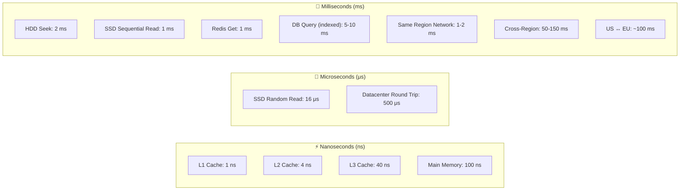
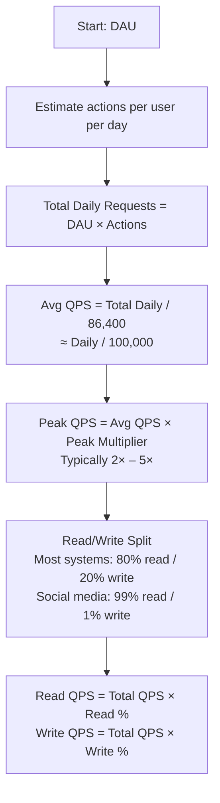
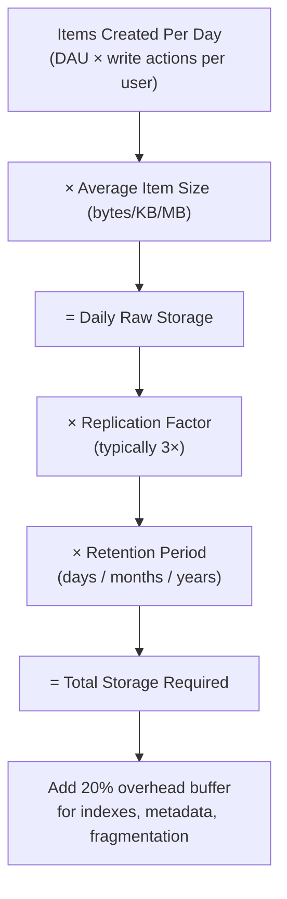
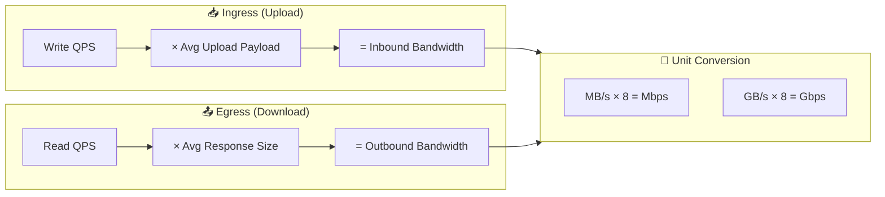
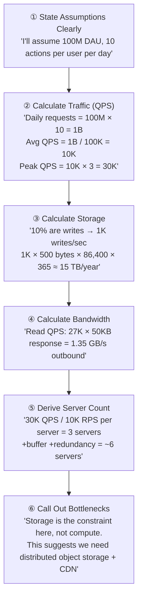

# 🧮 Back of the Envelope Calculations
### Staff Engineer System Design Interview — Quick Reference

> [!TIP]
> **How to use this:** Interviewers don't expect precision. They want to see structured thinking, correct order-of-magnitude estimates, and awareness of bottlenecks. Always show your work out loud.

---

## Table of Contents

1. [Powers of 10 — The Foundation](#1-powers-of-10--the-foundation)
2. [Time Conversions](#2-time-conversions)
3. [Latency Numbers Every Engineer Must Know](#3-latency-numbers-every-engineer-must-know)
4. [Storage Units Cheat Sheet](#4-storage-units-cheat-sheet)
5. [Throughput Reference](#5-throughput-reference)
6. [Common Estimation Formulas](#6-common-estimation-formulas)
7. [DAU → QPS Estimation Framework](#7-dau--qps-estimation-framework)
8. [Storage Estimation Framework](#8-storage-estimation-framework)
9. [Bandwidth Estimation Framework](#9-bandwidth-estimation-framework)
10. [Server Count Estimation](#10-server-count-estimation)
11. [Real-World System Examples](#11-real-world-system-examples)
12. [Interview Estimation Template](#12-interview-estimation-template)

---

## 1. Powers of 10 — The Foundation

> [!TIP]
> Everything in back-of-envelope math reduces to powers of 10. Internalize this table first.

| Power | Value | Name | Symbol | Real-World Anchor |
|-------|-------|------|--------|-------------------|
| 10³ | 1,000 | Thousand | K | Small city population |
| 10⁶ | 1,000,000 | Million | M | Tweets per day (rough) |
| 10⁹ | 1,000,000,000 | Billion | B | Facebook MAU (approx) |
| 10¹² | 1,000,000,000,000 | Trillion | T | Google searches per year |
| 10¹⁵ | — | Quadrillion | P | Global internet traffic / year |

### Quick Multiplication Rules

```
K × K = M         (10³ × 10³ = 10⁶)
K × M = B         (10³ × 10⁶ = 10⁹)
M × M = T         (10⁶ × 10⁶ = 10¹²)

1B / 10K = 100K   — useful for "users ÷ connections per server"
1M / 1K  = 1K     — useful for "requests ÷ capacity per machine"
```

---

## 2. Time Conversions

> [!TIP]
> Memorize the seconds-per-day — it's used in nearly every QPS calculation.

| Period | Exact Seconds | Approximation Used |
|--------|--------------|-------------------|
| 1 minute | 60 s | 60 s |
| 1 hour | 3,600 s | ~4,000 s |
| 1 day | 86,400 s | **~100,000 s** ✅ |
| 1 month | 2,592,000 s | ~2.5M s |
| 1 year | 31,536,000 s | ~30M s |

### The Golden Rule

```
QPS = Daily Requests / 86,400
    ≈ Daily Requests / 100,000      ← Use this approximation

Example:
  10B requests/day ÷ 100,000 = 100,000 QPS = 100K QPS
```

---

## 3. Latency Numbers Every Engineer Must Know

> [!TIP]
> Originally from Jeff Dean (Google). These are the numbers you cite during interviews.



### Latency Table

| Operation | Latency | Relative to L1 Cache |
|-----------|---------|---------------------|
| L1 cache hit | **1 ns** | 1× |
| L2 cache hit | **4 ns** | 4× |
| L3 cache hit | **40 ns** | 40× |
| RAM read | **100 ns** | 100× |
| SSD random read | **16 μs** | 16,000× |
| Redis GET | **~1 ms** | 1,000,000× |
| HDD seek | **2 ms** | 2,000,000× |
| DB query (indexed, local) | **5–10 ms** | ~10,000,000× |
| Intra-datacenter round trip | **0.5 ms** | 500,000× |
| Same-region network | **1–2 ms** | ~1,500,000× |
| Cross-region (US → EU) | **~100 ms** | 100,000,000× |
| Cross-region (US → APAC) | **~150 ms** | 150,000,000× |
| HDD sequential read (1 MB) | **~5 ms** | — |
| SSD sequential read (1 MB) | **~1 ms** | — |
| Memory sequential read (1 MB) | **~0.25 ms** | — |

### Key Takeaways

```
Memory is 1000× faster than SSD.
SSD is 100× faster than HDD.
Network same-region ≈ Redis ≈ 1ms (treat them equally for rough math).
Cross-region adds 50–150ms — design to avoid cross-region in the critical path.
```

---

## 4. Storage Units Cheat Sheet

| Unit | Bytes | Abbrev | Real-World Anchor |
|------|-------|--------|-------------------|
| Kilobyte | 1,024 ≈ **1,000** | KB | A short text email |
| Megabyte | 1,024² ≈ **1,000,000** | MB | A 1-min MP3 song |
| Gigabyte | 1,024³ ≈ **10⁹** | GB | A full HD movie |
| Terabyte | 1,024⁴ ≈ **10¹²** | TB | 1,000 HD movies |
| Petabyte | 1,024⁵ ≈ **10¹⁵** | PB | Facebook stores ~100 PB |
| Exabyte | 1,024⁶ ≈ **10¹⁸** | EB | All words ever spoken |

### Common Data Size Anchors

| Data Type | Size (Approximate) |
|-----------|-------------------|
| ASCII character | 1 byte |
| Unicode character (UTF-8) | 1–4 bytes |
| Integer (int32) | 4 bytes |
| Long / Timestamp | 8 bytes |
| UUID | 16 bytes |
| Short text message | 100 bytes |
| Average tweet | 280 bytes |
| Metadata row (DB) | 1 KB |
| Web page (HTML) | 50–100 KB |
| Profile photo (thumbnail) | 50 KB |
| Profile photo (full) | 300 KB |
| High-res photo | 2–5 MB |
| 1 min audio (compressed) | 1 MB |
| 1 min HD video (compressed) | 50–100 MB |

---

## 5. Throughput Reference

### Network Bandwidth Anchors

| Link Type | Bandwidth |
|-----------|-----------|
| Home WiFi | 100 Mbps – 1 Gbps |
| Mobile 4G | 10–50 Mbps |
| Mobile 5G | 100 Mbps – 1 Gbps |
| Datacenter NIC | 10–100 Gbps |
| Datacenter backbone | 1–100 Tbps |

### System Throughput Anchors

| System | Throughput |
|--------|-----------|
| Single web server (simple) | ~1,000 – 10,000 RPS |
| Single web server (optimized) | ~50,000 – 100,000 RPS |
| Nginx (reverse proxy) | ~50,000 RPS |
| Redis (single node) | ~100,000 – 1,000,000 ops/sec |
| Kafka (single broker) | ~1,000,000 msgs/sec |
| Cassandra (single node) | ~50,000 writes/sec |
| PostgreSQL (single node) | ~10,000 – 50,000 writes/sec |
| MySQL (single node) | ~10,000 – 30,000 writes/sec |

---

## 6. Common Estimation Formulas

### Core Formulas

```
┌─────────────────────────────────────────────────────┐
│                 CORE FORMULAS                       │
├─────────────────────────────────────────────────────┤
│  QPS      = Daily Actions / 86,400                  │
│  Peak QPS = Avg QPS × Peak Factor (2x – 5x)        │
│  Storage  = Daily Items × Item Size × Retention     │
│  Bandwidth= QPS × Avg Payload Size                  │
│  Servers  = Peak QPS / RPS per Server               │
└─────────────────────────────────────────────────────┘
```

### Useful Approximations

```
1 billion / day  → ~10,000 / sec  (10K QPS)
10 billion / day → ~100,000 / sec (100K QPS)
1 million / day  → ~12 / sec      (~10 QPS)

1 GB/sec bandwidth = 8 Gbps (multiply by 8 for bits)
```

---

## 7. DAU → QPS Estimation Framework



### DAU → QPS Quick Reference Table

| DAU | Actions/User/Day | Total Daily Requests | Avg QPS | Peak QPS (3×) |
|-----|-----------------|---------------------|---------|---------------|
| 1M | 10 | 10M | ~100 | ~300 |
| 10M | 10 | 100M | ~1,000 | ~3,000 |
| 100M | 50 | 5B | ~50,000 | ~150,000 |
| 500M | 50 | 25B | ~250,000 | ~750,000 |
| 1B | 100 | 100B | ~1,000,000 | ~3,000,000 |

### Example: Twitter-Scale Estimation

```
DAU              = 300 Million
Avg tweets/user  = 1 tweet per 30 days ≈ 0.033/day (writes are rare)
Avg views/user   = 200 timelines/day

Write QPS:
  300M × 0.033 / 86,400 = ~115 writes/sec (very low!)

Read QPS:
  300M × 200 / 86,400 = ~694,000 reads/sec ≈ 700K QPS

Peak Read QPS (3×): ~2.1 Million reads/sec

→ Twitter is overwhelmingly read-heavy. Design the read path first.
```

---

## 8. Storage Estimation Framework



### Storage Estimation Table

| System | Item | Size | Daily Volume | Daily Storage |
|--------|------|------|-------------|---------------|
| Chat (WhatsApp scale) | Text message | 100 B | 100B msgs | 10 TB |
| Chat (WhatsApp scale) | Media message | 1 MB | 10B msgs | 10 PB |
| Twitter | Tweet (text) | 280 B | 500M tweets | ~140 GB |
| Twitter | Photo | 300 KB | 200M photos | ~60 TB |
| YouTube | Video (uploaded) | 300 MB | 500 hrs/min × 60 | ~4.5 PB |
| Instagram | Photo | 2 MB | 100M photos | ~200 TB |
| Uber | Trip record | 1 KB | 20M trips | ~20 GB |

### Example: URL Shortener Storage

```
DAU                     = 100M users
URLs shortened per user = 0.1 per day (most users just click)
New URLs per day        = 100M × 0.1 = 10M URLs/day

Per URL record size:
  short_code  = 7 chars = 7 bytes
  long_url    = avg 200 chars = 200 bytes
  created_at  = 8 bytes (timestamp)
  user_id     = 8 bytes
  click_count = 8 bytes
  Total       ≈ 250 bytes per record

Daily storage  = 10M × 250 bytes = 2.5 GB/day
Annual storage = 2.5 GB × 365   = ~900 GB/year ≈ 1 TB/year

Replication (3×): ~3 TB/year
With 10-year retention: ~30 TB total  ← Very manageable
```

---

## 9. Bandwidth Estimation Framework



### Bandwidth Anchor Points

| Bandwidth | Equivalent |
|-----------|-----------|
| 1 MB/s | 8 Mbps — Single video stream (SD) |
| 10 MB/s | 80 Mbps — HD video stream |
| 100 MB/s | 800 Mbps — ~1 datacenter NIC |
| 1 GB/s | 8 Gbps — Heavy traffic server |
| 10 GB/s | 80 Gbps — Backbone connection |

### Example: Video Streaming Bandwidth (YouTube-scale)

```
DAU                  = 2 Billion
Avg watch per day    = 30 minutes = 1,800 seconds
Video bitrate (avg)  = 2 Mbps (720p compressed)

Concurrent viewers at peak (assume 10% of DAU):
  = 2B × 10% = 200M concurrent viewers

Bandwidth required:
  = 200M viewers × 2 Mbps
  = 400 Tbps outbound

→ This is why YouTube needs massive CDN infrastructure
→ 95%+ of traffic served from CDN edge, not origin
```

---

## 10. Server Count Estimation

### Single Server Capacity Reference

| Server Type | Capacity |
|------------|---------|
| Web server (stateless, async) | 10K – 50K RPS |
| Web server (CPU-heavy, sync) | 1K – 5K RPS |
| WebSocket server | 10K – 50K concurrent connections |
| Cache server (Redis) | 100K – 1M ops/sec |
| DB server (PostgreSQL reads) | 10K – 50K QPS |
| DB server (Cassandra writes) | 50K – 100K writes/sec |
| Kafka broker | 1M msgs/sec |
| Load balancer | 1M – 10M RPS |

### Server Count Formula

```
Servers needed = Peak QPS / RPS per Server

Always add:
  × 1.2 buffer for headroom (don't run servers at 100%)
  + N servers for redundancy (at least 2 in each AZ)

Example: 100K Peak QPS, web servers handle 10K RPS each
  = 100K / 10K = 10 servers
  + 20% buffer = 12 servers
  + redundancy = ~15 servers across 3 AZs (5 per AZ)
```

### Example: Chat System Server Estimation

```
DAU             = 1 Billion
Concurrent users = 60% online = 600M

WebSocket Servers:
  Connections per server = 50,000
  Servers needed         = 600M / 50K = 12,000 servers

Message Services:
  Peak QPS = 3.5M msg/sec
  Each service handles 50K msg/sec
  Services needed = 3.5M / 50K = 70 service pods

Cassandra Nodes:
  Peak write QPS = 3.5M writes/sec
  Per node capacity = 50K writes/sec
  Nodes needed = 3.5M / 50K = 70 nodes (before replication)
  With RF=3: 70 × 3 = 210 nodes total
```

---

## 11. Amdahl's Law — Parallelism Limits

Amdahl's Law defines the theoretical maximum speedup of a system when only part of it can be parallelized.

### The Formula

```
Speedup = 1 / ((1 - P) + P/N)

Where:
  P = fraction of the task that can be parallelized (0 to 1)
  N = number of parallel processors/threads
```

### Practical Examples

| Parallelizable (P) | 2 cores | 4 cores | 16 cores | 1000 cores | Max speedup |
|---------------------|---------|---------|----------|------------|-------------|
| 50% | 1.33x | 1.60x | 1.88x | 2.00x | **2x** |
| 75% | 1.60x | 2.29x | 3.37x | 3.99x | **4x** |
| 90% | 1.82x | 3.08x | 6.40x | 9.91x | **10x** |
| 95% | 1.90x | 3.48x | 9.14x | 19.6x | **20x** |
| 99% | 1.98x | 3.88x | 13.9x | 90.8x | **100x** |

> [!IMPORTANT]
> **The key insight:** Even with infinite cores, the serial portion of your code sets an absolute ceiling on speedup. If 5% of your task is serial, you can never exceed 20x speedup no matter how many servers you throw at it.

### Interview Application

When estimating server counts, consider which parts of the pipeline are inherently serial:
- **Database writes with strong consistency** — serial (leader-based)
- **Stateless API processing** — fully parallelizable
- **Aggregation/reduce steps** — partially serial (final merge)

This is why horizontally scaling a system hits diminishing returns — Amdahl's Law in action.

---

## 12. Real-World System Examples

### Instagram-Scale Estimation

```
┌─────────────────────────────────────────────────┐
│             INSTAGRAM SCALE ESTIMATES            │
├──────────────────────┬──────────────────────────┤
│ DAU                  │ 500 Million               │
│ Photos uploaded/day  │ 100 Million               │
│ Photo size (avg)     │ 2 MB                      │
│ Reads per write      │ 100× (very read-heavy)    │
├──────────────────────┼──────────────────────────┤
│ Write QPS            │ 100M / 86,400 ≈ 1,200/s  │
│ Read QPS             │ 1,200 × 100 = 120,000/s  │
│ Peak Read QPS        │ 120K × 3 = ~360K QPS     │
├──────────────────────┼──────────────────────────┤
│ Daily photo storage  │ 100M × 2MB = 200 TB/day  │
│ Annual photo storage │ 200TB × 365 = ~73 PB/yr  │
│ With replication 3×  │ ~220 PB/year              │
├──────────────────────┼──────────────────────────┤
│ Outbound bandwidth   │ 360K × 300KB ≈ 108 GB/s  │
└──────────────────────┴──────────────────────────┘
```

---

### Uber-Scale Estimation

```
┌─────────────────────────────────────────────────┐
│               UBER SCALE ESTIMATES               │
├──────────────────────┬──────────────────────────┤
│ DAU (riders)         │ 10 Million                │
│ DAU (drivers)        │ 1 Million                 │
│ Driver location freq │ Every 4 seconds           │
│ Trips per day        │ 20 Million                │
├──────────────────────┼──────────────────────────┤
│ Location updates/sec │ 1M drivers / 4s = 250K/s │
│ Trip write QPS       │ 20M / 86,400 ≈ 230/s     │
│ Ride matching QPS    │ ~5,000 active searches/s  │
├──────────────────────┼──────────────────────────┤
│ Location data/update │ ~50 bytes (lat/lng + meta)│
│ Location data/day    │ 250K × 50B × 86,400 ≈    │
│                      │ ~1 TB/day (raw GPS)       │
│ Trip record size     │ ~1 KB                     │
│ Trip storage/day     │ 20M × 1KB = 20 GB/day    │
└──────────────────────┴──────────────────────────┘

Key insight: Location update volume (250K/s) dwarfs trip writes (230/s).
Design the write path for location, not trips.
```

---

### Google Search Estimation

```
┌─────────────────────────────────────────────────┐
│           GOOGLE SEARCH SCALE ESTIMATES          │
├──────────────────────┬──────────────────────────┤
│ Searches/day         │ 8.5 Billion               │
│ Avg QPS              │ 8.5B / 86,400 ≈ 100K/s   │
│ Peak QPS             │ ~200K – 500K/s            │
├──────────────────────┼──────────────────────────┤
│ Avg query size       │ ~30 bytes                 │
│ Avg response size    │ ~500 KB (HTML + assets)   │
│ Bandwidth (outbound) │ 100K × 500KB = 50 GB/s   │
├──────────────────────┼──────────────────────────┤
│ Web pages indexed    │ ~50 Billion pages         │
│ Avg page size (index)│ ~10 KB (compressed text)  │
│ Index storage        │ 50B × 10KB = 500 TB       │
│ With replication 3×  │ ~1.5 PB for index alone   │
└──────────────────────┴──────────────────────────┘
```

---

## 12. Interview Estimation Template

> [!TIP]
> Use this exact structure in your interview. Takes ~5 minutes and signals strong engineering judgment.



### Interview Estimation Script

```
"Let me start with some assumptions I'd like you to validate..."

STEP 1 — USERS
  DAU = [X] Million / Billion
  Concurrent users = [20–60]% of DAU

STEP 2 — TRAFFIC
  Actions per user per day = [Y]
  Total daily requests = DAU × Y
  Avg QPS = Daily / 100,000
  Peak QPS = Avg × 3 (standard multiplier)
  Read:Write ratio = [80:20 or 99:1 depending on system]

STEP 3 — STORAGE
  Writes per day = DAU × write actions per user
  Storage per day = writes × avg record size
  Annual storage = daily × 365 × replication factor (3)

STEP 4 — BANDWIDTH
  Outbound = Read QPS × avg response size
  Inbound  = Write QPS × avg upload size

STEP 5 — SERVERS
  Web servers = Peak QPS / 10,000 (RPS per server)
  DB servers  = Write QPS / 50,000 (writes per node)
  Add 20% buffer + redundancy across AZs

STEP 6 — INSIGHT
  "The bottleneck is [storage/bandwidth/compute] because..."
  "This tells me we need [CDN/sharding/caching/async]..."
```

---

### Quick Reference — Numbers to Memorize

| Category | Number | Use |
|----------|--------|-----|
| Seconds per day | **86,400 ≈ 100K** | QPS calculation |
| L1 Cache | **1 ns** | Latency baseline |
| RAM read | **100 ns** | Memory latency |
| SSD random read | **16 μs** | Disk latency |
| Redis GET | **~1 ms** | Cache latency |
| DB query | **5–10 ms** | DB latency |
| Cross-region | **50–150 ms** | Network latency |
| Connections per WS server | **10K – 50K** | WebSocket sizing |
| RPS per web server | **10K – 50K** | Server sizing |
| Kafka throughput | **1M msg/sec** | Queue sizing |
| Replication factor | **3×** | Storage multiplier |
| Peak multiplier | **3×** | Traffic spike |
| CDN offload | **90–95%** | Bandwidth relief |

---

*Back of the Envelope Quick Reference — Staff Engineer System Design Interviews*
