# ⚡ Caching — Complete System Design Reference
### Staff Engineer Interview Preparation Guide

> [!TIP]
> **Why caching matters in interviews:** Every large-scale system design question eventually comes down to caching. Interviewers expect you to know *which* cache type to use, *why*, and *what the tradeoffs are* — not just "add Redis."

---

## Table of Contents

1. [Why Cache? The Fundamental Problem](#1-why-cache-the-fundamental-problem)
2. [Caching Hierarchy — The Big Picture](#2-caching-hierarchy--the-big-picture)
3. [Cache Types — Complete Reference](#3-cache-types--complete-reference)
4. [Caching Strategies (Read Patterns)](#4-caching-strategies-read-patterns)
5. [Cache Write Policies](#5-cache-write-policies)
6. [Cache Eviction Policies](#6-cache-eviction-policies)
7. [Cache Invalidation — The Hard Problem](#7-cache-invalidation--the-hard-problem)
8. [Distributed Caching](#8-distributed-caching)
9. [When to Use Which Cache](#9-when-to-use-which-cache)
10. [Cache Anti-Patterns & Failure Modes](#10-cache-anti-patterns--failure-modes)
11. [Real-World System Examples](#11-real-world-system-examples)
12. [Interview Cheat Sheet](#12-interview-cheat-sheet)

---

## 1. Why Cache? The Fundamental Problem

### The Latency Gap

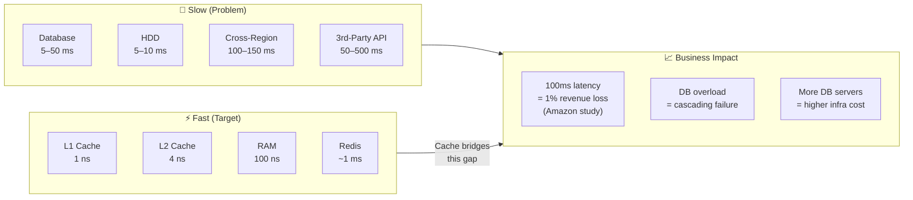

### The Core Value Proposition

| Without Cache | With Cache |
|--------------|-----------|
| Every request hits the database | 95%+ requests served from memory |
| DB becomes bottleneck at scale | DB handles only cache misses |
| Latency = DB query time (5–50ms) | Latency = cache lookup (<1ms) |
| Vertical scaling only (expensive) | Horizontal scale-out possible |
| 3rd-party API rate limits hit | API called once, result cached |

---

## 2. Caching Hierarchy — The Big Picture

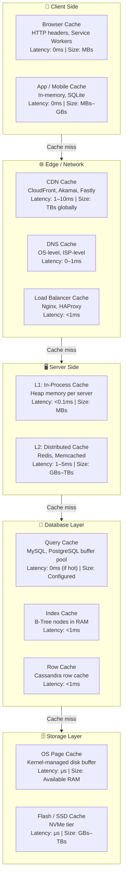

### Hierarchy Summary

| Layer | Technology | Latency | Scope | Best For |
|-------|-----------|---------|-------|----------|
| Browser | HTTP Cache, SW | 0 ms | Per user | Static assets, API responses |
| CDN | CloudFront, Akamai | 1–10 ms | Global | Images, video, static files |
| Load Balancer | Nginx | < 1 ms | Regional | Common API responses |
| In-Process (L1) | Guava, Caffeine | < 0.1 ms | Per server | Hot configuration, session tokens |
| Distributed (L2) | Redis, Memcached | 1–5 ms | Cluster-wide | User sessions, computed results |
| Database | Buffer pool, row cache | < 1 ms | Per DB node | Hot rows and index pages |
| OS | Page cache | μs | Per machine | Sequential file reads |

---

## 3. Cache Types — Complete Reference

### 3.1 In-Process / Local Cache

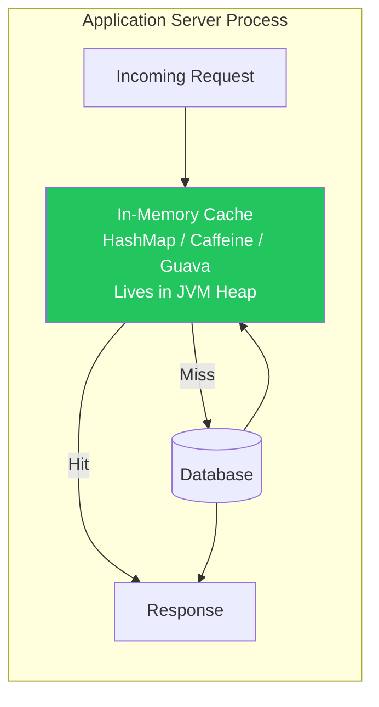

**Characteristics:**

| Property | Detail |
|----------|--------|
| **Latency** | Sub-millisecond (< 0.1ms) |
| **Scope** | Single process / single server only |
| **Size limit** | JVM heap size (typically 256MB – 4GB) |
| **Consistency** | Each server has its own copy — can diverge |
| **Eviction** | LRU, LFU, Size-based |
| **Serialization** | None — objects stored as-is |
| **Implementation** | Caffeine (Java), Guava Cache, Python `functools.lru_cache` |

**When to use:**
- Configuration values that rarely change (feature flags, app config)
- Rate limiting counters per server
- Frequently accessed, immutable reference data (country codes, enums)
- Cost-sensitive environments where Redis is overkill

**When NOT to use:**
- Data that must be consistent across servers
- Session data (user might hit different server on next request)
- Large datasets that exceed heap budget

---

### 3.2 Distributed Cache

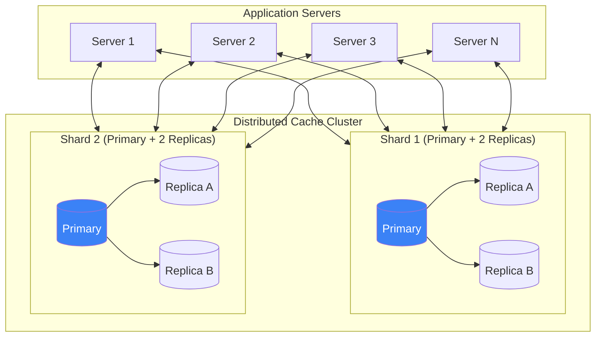

**Characteristics:**

| Property | Detail |
|----------|--------|
| **Latency** | 1–5 ms (network round trip) |
| **Scope** | Shared across all servers in cluster |
| **Size limit** | Scales horizontally (TBs possible) |
| **Consistency** | Strong within cluster |
| **Eviction** | LRU, LFU, Allkeys, Volatile |
| **Serialization** | Required (JSON, MessagePack, Protobuf) |
| **Implementation** | Redis, Memcached, Hazelcast, Apache Ignite |

**When to use:**
- User sessions (must be server-agnostic)
- Computed / aggregated results shared across services
- Rate limiting at cluster level
- Leaderboards, counters, pub/sub

---

### 3.3 CDN Cache (Content Delivery Network)

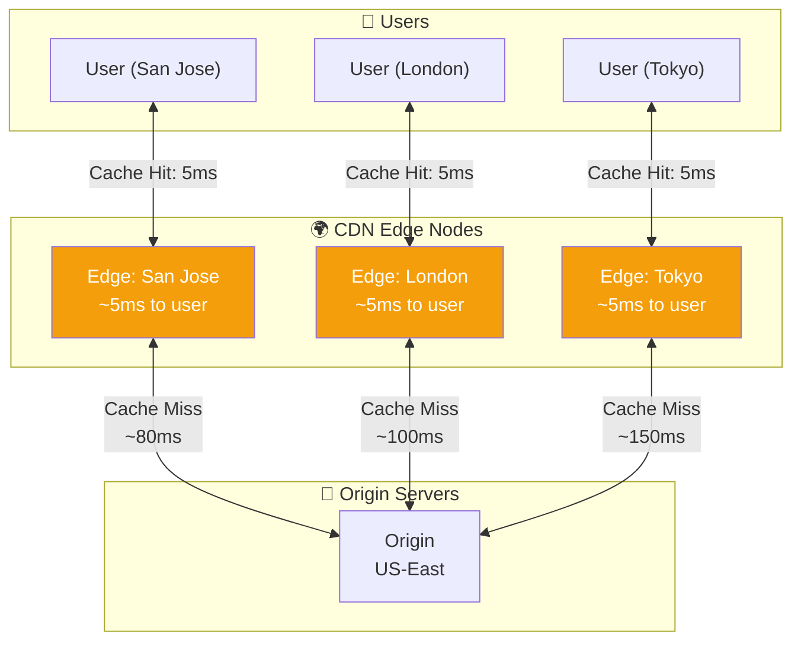

**Cache-Control Headers — The CDN Control Plane:**

```
# Cache forever (immutable assets with hash in filename)
Cache-Control: public, max-age=31536000, immutable
→ Use for: /static/app.a3b4c5.js, /images/logo.png

# Cache for 5 minutes, allow stale while revalidating
Cache-Control: public, max-age=300, stale-while-revalidate=60
→ Use for: API responses, product listings

# Never cache (private user data)
Cache-Control: private, no-store
→ Use for: /api/account/details, /cart

# Cache but always revalidate with origin
Cache-Control: no-cache
→ Use for: HTML pages (ensures fresh content)
```

**When to use CDN:**
- Static assets (JS, CSS, images, fonts, video)
- Public API responses (product catalog, news articles)
- User-generated media (profile photos, uploaded images)
- Anything that can tolerate eventual consistency

---

### 3.4 Database Query Cache / Buffer Pool

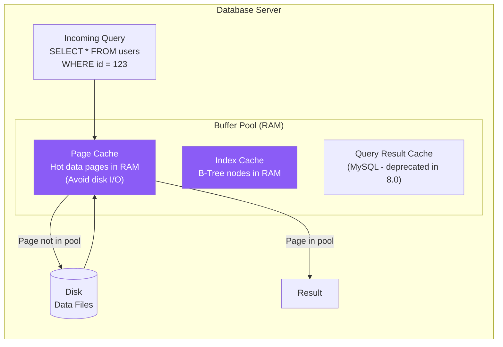

**PostgreSQL / MySQL Buffer Pool sizing rule:**

```
Recommended buffer pool = 70–80% of available RAM

Example: 64 GB RAM server
  Buffer pool = 64 × 0.75 = 48 GB
  OS + connections use remaining 16 GB

Monitor with:
  SHOW STATUS LIKE 'Innodb_buffer_pool_read_requests';  -- Total reads
  SHOW STATUS LIKE 'Innodb_buffer_pool_reads';          -- Disk reads
  Hit Rate = 1 - (reads / read_requests) → aim for > 99%
```

---

### 3.5 Write-Ahead Log (WAL) / Redo Log Cache

Not typically discussed but worth mentioning at Staff level:

- Databases buffer writes in memory (WAL buffer) before flushing to disk
- PostgreSQL: `wal_buffers = 16MB` default
- This makes writes appear fast even though disk I/O is expensive
- Crash recovery replays the WAL to restore consistency

---

### 3.6 Application-Level Memoization

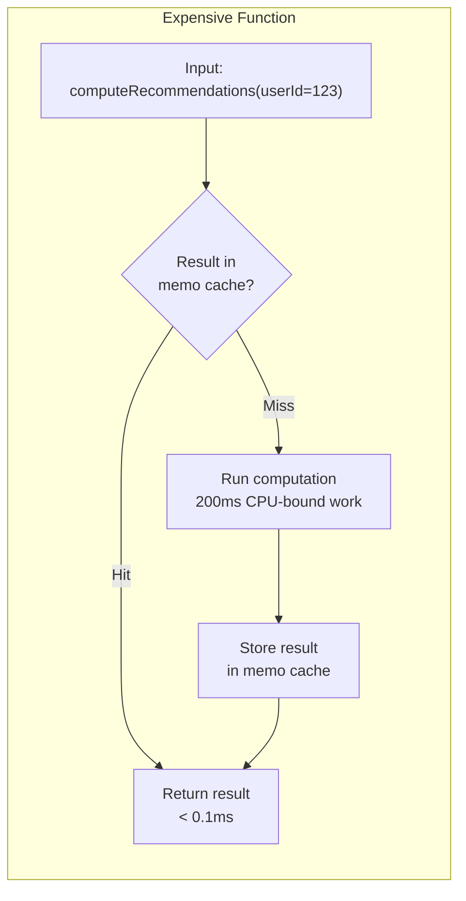

**Implementation examples:**

```python
# Python — functools.lru_cache
from functools import lru_cache

@lru_cache(maxsize=1000)
def get_user_permissions(user_id: int) -> list[str]:
    return db.query("SELECT permissions FROM users WHERE id = ?", user_id)

# Python — TTL-aware with cachetools
from cachetools import TTLCache, cached

cache = TTLCache(maxsize=1000, ttl=300)  # 5-minute TTL

@cached(cache)
def get_exchange_rate(currency: str) -> float:
    return external_api.get_rate(currency)
```

---

### 3.7 Session Cache

Dedicated pattern for user authentication state:

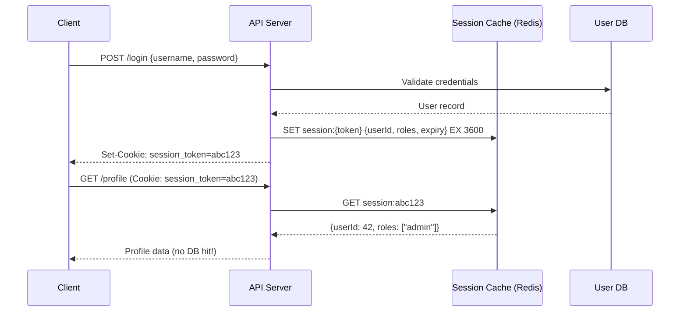

---

### 3.8 Write-Through vs. Side Cache — Summary Comparison

| Cache Type | Data Lives | Consistency | Latency | Best For |
|-----------|-----------|-------------|---------|----------|
| In-Process | App heap | Per-server | < 0.1ms | Immutable reference data |
| Distributed | Redis/Memcached | Cluster-wide | 1–5ms | Sessions, shared state |
| CDN | Edge nodes globally | Eventual | 1–10ms | Static assets, public content |
| DB Buffer Pool | DB server RAM | Strong | < 1ms | Hot rows and index pages |
| Session Cache | Redis | Strong | 1–5ms | Auth state, user context |
| Memoization | Function scope | N/A | < 0.1ms | CPU-bound computation results |

---

## 4. Caching Strategies (Read Patterns)

### 4.1 Cache-Aside (Lazy Loading)

> [!TIP]
> The most common pattern. Application code manages the cache explicitly.

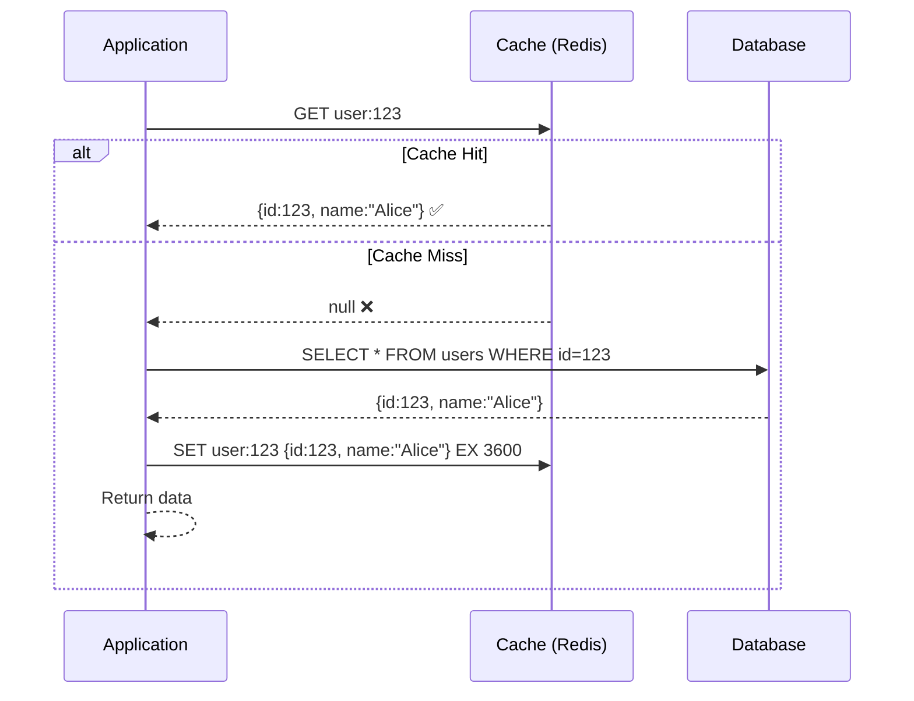

**Pseudocode:**
```python
def get_user(user_id: int) -> User:
    # 1. Check cache
    cached = redis.get(f"user:{user_id}")
    if cached:
        return deserialize(cached)

    # 2. Cache miss → query DB
    user = db.query("SELECT * FROM users WHERE id = ?", user_id)

    # 3. Populate cache (TTL = 1 hour)
    redis.setex(f"user:{user_id}", 3600, serialize(user))

    return user
```

| ✅ Pros | ❌ Cons |
|---------|---------|
| Cache only what's actually requested | Cache miss = 2 round trips (slower first load) |
| Cache failure doesn't block reads (falls back to DB) | Cold start = all misses |
| Flexible TTL per key | Risk of stale data between TTL expiry |
| Simple to implement | Cache stampede risk on popular keys |

**Best for:** General-purpose read caching, user profiles, product data

---

### 4.2 Read-Through Cache

> [!TIP]
> Cache sits in front of DB. Application never talks to DB directly.

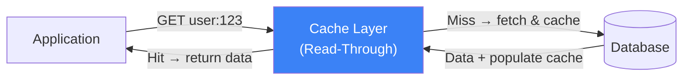

| ✅ Pros | ❌ Cons |
|---------|---------|
| Application logic is simpler (one interface) | Cache layer must be smart / configurable |
| Cache population is transparent | Less control over what gets cached |
| Consistent caching behavior | Cache provider must support this pattern natively |

**Best for:** Systems using cache providers like AWS ElastiCache, DAX (DynamoDB Accelerator), or Varnish

---

### 4.3 Write-Through Cache

> [!TIP]
> Every write goes to cache AND database synchronously.

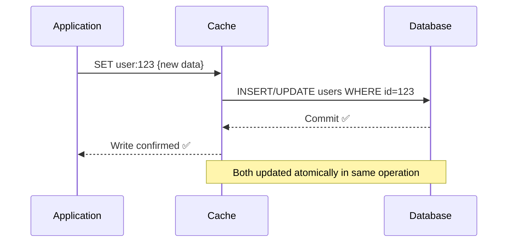

| ✅ Pros | ❌ Cons |
|---------|---------|
| Cache always consistent with DB | Write latency = cache + DB (slower writes) |
| No stale reads after writes | Every write hits DB (no write offloading benefit) |
| No separate invalidation needed | Unused data gets cached (wasted space) |

**Best for:** Systems where read consistency is critical and write volume is low — financial dashboards, inventory systems

---

### 4.4 Write-Behind (Write-Back) Cache

> [!TIP]
> Writes go to cache first. DB write happens asynchronously later.

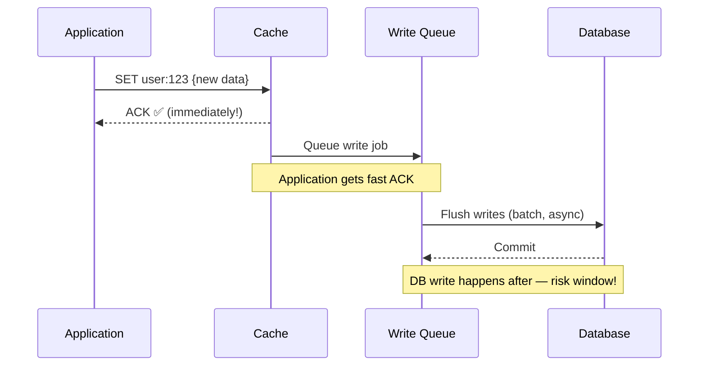

| ✅ Pros | ❌ Cons |
|---------|---------|
| Very fast writes (cache speed) | Data loss risk if cache fails before flush |
| Write batching reduces DB load | Complexity — need reliable write queue |
| Great for write-heavy workloads | Harder to debug inconsistency |

**Best for:** Analytics counters, like/view counts, leaderboards, gaming scores — where losing a few writes is tolerable

---

### 4.5 Refresh-Ahead (Predictive Cache)

> [!TIP]
> Cache proactively refreshes before TTL expires, based on access patterns.

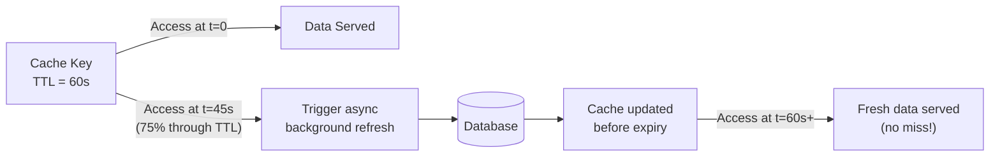

| ✅ Pros | ❌ Cons |
|---------|---------|
| Eliminates cache miss latency for hot keys | Complex to implement correctly |
| Users always get low latency | May refresh keys that won't be accessed again |
| Prevents thundering herd on expiry | Requires prediction logic |

**Best for:** Hot keys with predictable access patterns — homepage content, trending items, config values

---

### Strategy Selection Guide

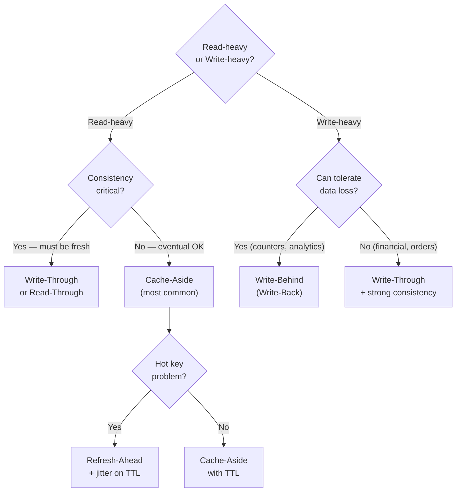

---

## 5. Cache Write Policies

| Policy | Write Path | Read Consistency | Durability | Use Case |
|--------|-----------|-----------------|------------|---------|
| **Write-Through** | Cache + DB (sync) | Strong | High | Financial, inventory |
| **Write-Behind** | Cache → DB (async) | Eventual | Lower | Counters, analytics |
| **Write-Around** | Skip cache, DB only | Eventual | High | Write-once read-never data |
| **Write-Invalidate** | Write DB → delete cache key | Strong on next read | High | Most common invalidation |

---

## 6. Cache Eviction Policies

> [!TIP]
> When the cache is full, which key gets removed?

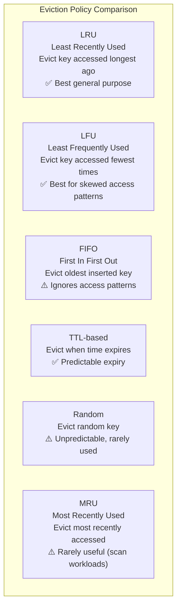

### Redis Eviction Policies

| Policy | Description | When to Use |
|--------|-------------|-------------|
| `noeviction` | Return error when memory full | When cache loss is unacceptable |
| `allkeys-lru` ✅ | LRU across all keys | General-purpose caching |
| `volatile-lru` | LRU only on keys with TTL set | Mix of persistent + cached data |
| `allkeys-lfu` ✅ | LFU across all keys | Skewed hot-key workloads |
| `volatile-ttl` | Evict keys with shortest TTL | Prioritize long-lived data |
| `allkeys-random` | Random eviction | Uniform access distributions |

### LRU vs LFU Decision

```
Use LRU when:
  - Access pattern is recency-based (recently viewed = likely viewed again)
  - Sequential scan workloads
  - General web application caching

Use LFU when:
  - Some keys are accessed much more than others (Zipfian distribution)
  - Social media (1% of content = 99% of views)
  - Product catalog (top 100 products = 80% of traffic)
```

---

## 7. Cache Invalidation — The Hard Problem

> *"There are only two hard things in Computer Science: cache invalidation and naming things."* — Phil Karlton

### 7.1 Invalidation Strategies

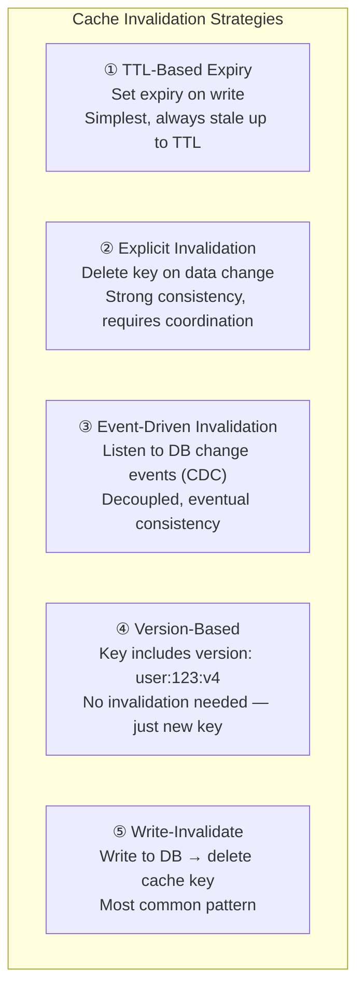

### 7.2 TTL Strategy — Choose Your TTL Wisely

| Data Type | Recommended TTL | Reason |
|-----------|----------------|--------|
| User profile | 5–30 minutes | Changes infrequently |
| Product price | 1–5 minutes | Can change, must be fairly fresh |
| Session token | 1–24 hours | Matches auth session lifetime |
| Config / feature flags | 1–5 minutes | Must propagate quickly |
| Exchange rates | 30–60 seconds | Changes frequently |
| Static reference data | 24 hours – forever | Never changes (country codes) |
| Search results | 1–5 minutes | Tolerate slight staleness |
| News feed | 30 seconds – 2 minutes | Freshness is important |
| Stock prices | 1–15 seconds | Very high freshness requirement |

### 7.3 Event-Driven Invalidation (CDC Pattern)

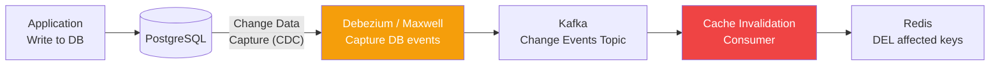

**CDC advantages:**
- DB write and cache invalidation are decoupled
- No risk of forgetting to invalidate in application code
- Handles bulk DB updates (migration scripts) automatically
- Audit trail of all changes

---

### 7.4 The Cache Stampede Problem

> [!WARNING]
> When a popular cache key expires, thousands of simultaneous requests all hit the DB at once.

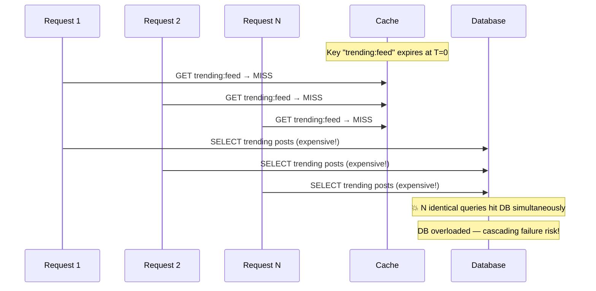

**Solutions:**

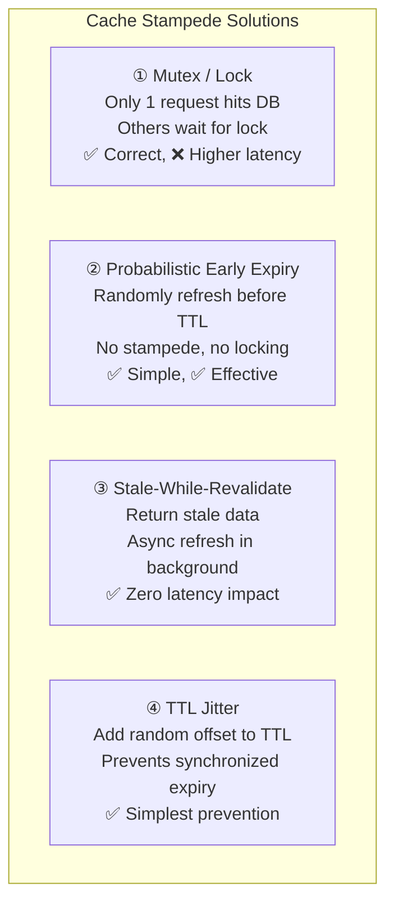

**TTL Jitter Implementation:**
```python
import random

def set_with_jitter(key: str, value: Any, base_ttl: int, jitter_pct: float = 0.1):
    """Add ±10% jitter to TTL to prevent synchronized expiry"""
    jitter = int(base_ttl * jitter_pct)
    ttl = base_ttl + random.randint(-jitter, jitter)
    redis.setex(key, ttl, serialize(value))

# 1-hour TTL with ±6 minutes jitter
set_with_jitter("trending:feed", feed_data, base_ttl=3600, jitter_pct=0.1)
```

---

## 8. Distributed Caching

### 8.1 Redis vs. Memcached

| Feature | Redis | Memcached |
|---------|-------|-----------|
| **Data Structures** | Strings, Hashes, Lists, Sets, Sorted Sets, Streams | Strings only |
| **Persistence** | RDB snapshots + AOF log | None (memory only) |
| **Replication** | Primary-Replica + Sentinel + Cluster | None (client-side only) |
| **Pub/Sub** | ✅ Native | ❌ No |
| **Lua Scripting** | ✅ Yes | ❌ No |
| **Cluster Mode** | ✅ Native cluster | ✅ Client-side sharding |
| **Memory Efficiency** | Slightly higher overhead | Slightly more memory-efficient for strings |
| **Multi-threading** | Single-threaded (I/O multi-threaded in v6+) | Multi-threaded |
| **Use Case** | Sessions, pub/sub, sorted sets, complex data | Simple key-value at massive scale |

**Decision rule:** Choose Redis unless you specifically need Memcached's multi-threading advantage at extreme scale (100K+ ops/sec on a single node with simple string values).

---

### 8.2 Redis Data Structures — When to Use Each

| Structure | Commands | Use Case |
|-----------|----------|----------|
| **String** | GET/SET/INCR | Simple key-value, counters, sessions |
| **Hash** | HGET/HSET/HGETALL | User profile fields (avoid serializing whole object) |
| **List** | LPUSH/RPOP/LRANGE | Message queues, activity feeds, recent items |
| **Set** | SADD/SMEMBERS/SINTER | Unique visitors, friend lists, tags |
| **Sorted Set** | ZADD/ZRANGE/ZRANK | Leaderboards, rate limiting, priority queues |
| **Bitmap** | SETBIT/GETBIT/BITCOUNT | Daily active users, feature flags per user |
| **HyperLogLog** | PFADD/PFCOUNT | Approximate unique counts (< 1% error, 12KB max) |
| **Stream** | XADD/XREAD | Event sourcing, message bus |
| **Geo** | GEOADD/GEODIST/GEORADIUS | Location-based queries (Uber, Yelp) |

```
Leaderboard example (Sorted Set):
  ZADD leaderboard 9500 "alice"
  ZADD leaderboard 8800 "bob"
  ZREVRANGE leaderboard 0 9 WITHSCORES  → Top 10 players

Rate limiting (Sorted Set sliding window):
  ZADD rate:userId timestamp timestamp  → Record request
  ZREMRANGEBYSCORE rate:userId 0 (now-60s)  → Remove old
  ZCARD rate:userId → Count in last 60s
```

---

### 8.3 Cache Sharding Strategies

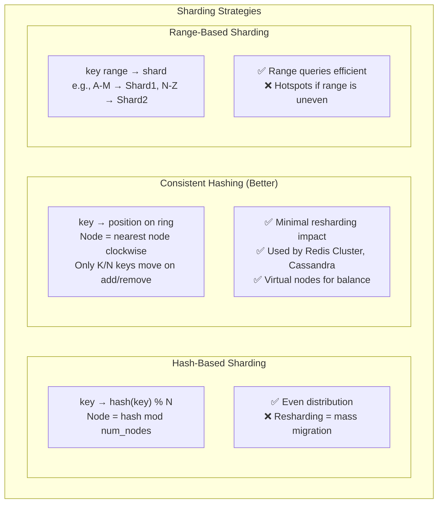

**Redis Cluster — Consistent Hashing with Hash Slots:**
```
Redis Cluster divides keyspace into 16,384 hash slots.
Each node owns a range of slots.

hash_slot = CRC16(key) % 16384

3-node cluster:
  Node A: slots 0–5460
  Node B: slots 5461–10922
  Node C: slots 10923–16383

Adding a node: only reassign slots from existing nodes.
Removing a node: redistribute its slots to remaining nodes.
No full data migration needed! ✅
```

---

### 8.4 Cache Topology Patterns

```mermaid
graph TD
    subgraph T1["Single Node"]
        SN["Redis Primary\n↑ Simple\n↑ Fast\n↓ SPOF\n↓ Limited size"]
    end

    subgraph T2["Primary-Replica"]
        PR["Primary\n(Writes)"] --> RR1["Replica 1\n(Reads)"]
        PR --> RR2["Replica 2\n(Reads)"]
        NOTE2["↑ Read scale-out\n↑ Failover with Sentinel\n↓ Writes still single node"]
    end

    subgraph T3["Redis Sentinel"]
        SP["Primary"] --> SR1["Replica 1"]
        SP --> SR2["Replica 2"]
        SEN1["Sentinel 1"] & SEN2["Sentinel 2"] & SEN3["Sentinel 3"] --> SP
        NOTE3["↑ Automatic failover\n↑ Monitoring\n↓ No horizontal write scale"]
    end

    subgraph T4["Redis Cluster"]
        CC1["Shard 1\nPrimary+Replica"] --- CC2["Shard 2\nPrimary+Replica"]
        CC2 --- CC3["Shard 3\nPrimary+Replica"]
        NOTE4["↑ Horizontal scale\n↑ Automatic sharding\n↑ Fault tolerant\n↓ Complex ops"]
    end
```

---

## 9. When to Use Which Cache

### Decision Framework

```mermaid
flowchart TD
    START["What are you caching?"] --> Q1

    Q1{"Static assets?\n(JS, CSS, images)"}
    Q1 -->|Yes| CDN["✅ CDN\nCloudFront, Akamai\nCache-Control headers"]
    Q1 -->|No| Q2

    Q2{"Per-user session\nor auth state?"}
    Q2 -->|Yes| SESSION["✅ Distributed Cache\nRedis with TTL\nvolatile-lru eviction"]
    Q2 -->|No| Q3

    Q3{"Shared across\nmultiple servers?"}
    Q3 -->|Yes| Q4
    Q3 -->|No| LOCAL["✅ In-Process Cache\nCaffeine / Guava\nFor immutable or rarely-changing data"]

    Q4{"Write-heavy?\n(> 10K writes/sec)"}
    Q4 -->|Yes| Q5
    Q4 -->|No| Q6

    Q5{"Can tolerate\ndata loss?"}
    Q5 -->|Yes| WB["✅ Redis Write-Behind\nAsync persistence\nCounters, analytics"]
    Q5 -->|No| WT["✅ Redis Write-Through\n+ Cassandra/DB\nOrders, financial"]

    Q6{"Hot keys /\nuneven access?"}
    Q6 -->|Yes| LFU["✅ Redis with allkeys-lfu\nRefresh-Ahead for top keys"]
    Q6 -->|No| CA["✅ Cache-Aside\nRedis, TTL-based\nGeneral purpose"]
```

---

### Master Decision Table

| Scenario | Cache Type | Strategy | Eviction | TTL |
|----------|-----------|---------|---------|-----|
| Static website assets | CDN | Cache-Control immutable | Size-based | 1 year |
| User profile data | Distributed (Redis) | Cache-Aside | LRU | 15–30 min |
| User session / auth | Distributed (Redis) | Write-Through | Volatile-TTL | 1–24 hrs |
| Product catalog | CDN + Distributed | Read-Through | LFU | 5–15 min |
| Real-time leaderboard | Distributed (Redis Sorted Set) | Write-Behind | LFU | No TTL |
| Feature flags / config | In-Process + Distributed | Refresh-Ahead | LRU | 1–5 min |
| Search results | Distributed (Redis) | Cache-Aside | LRU | 1–5 min |
| Rate limiting | Distributed (Redis) | Write-Through | Volatile-TTL | 60 sec sliding |
| DB hot rows | DB Buffer Pool | Automatic | LRU (buffer pool) | Automatic |
| API aggregation | Distributed (Redis) | Cache-Aside | LRU | 30–60 sec |
| ML model output | In-Process + Distributed | Cache-Aside | LFU | 1–24 hrs |
| Location data (Uber) | Distributed (Redis Geo) | Write-Behind | LRU | 30 sec |
| Like / view counts | Distributed (Redis Counter) | Write-Behind | LFU | No TTL |
| News feed / timeline | Distributed (Redis) | Refresh-Ahead | LRU | 30–60 sec |

---

## 10. Cache Anti-Patterns & Failure Modes

### 10.1 Cache Penetration

> [!WARNING]
> Querying a key that doesn't exist in cache OR database — bypasses cache every time.

```mermaid
sequenceDiagram
    participant ATK as Attacker / Bug
    participant C as Cache
    participant DB as Database

    loop Millions of requests
        ATK->>C: GET user:99999999 (doesn't exist)
        C-->>ATK: MISS (null)
        ATK->>DB: SELECT WHERE id=99999999
        DB-->>ATK: null (not found)
        Note over DB: 💥 DB hit on every request!
    end
```

**Solutions:**
- **Cache null values:** Store `null` or `"NOT_FOUND"` in cache with short TTL (30–60s)
- **Bloom Filter:** Probabilistic structure to check if key *might* exist before querying DB

```python
# Cache null solution
def get_user(user_id: int):
    cached = redis.get(f"user:{user_id}")

    if cached == "NULL":           # Cached null sentinel
        return None

    if cached is not None:
        return deserialize(cached)

    user = db.query(user_id)

    if user is None:
        redis.setex(f"user:{user_id}", 60, "NULL")  # Cache the miss!
        return None

    redis.setex(f"user:{user_id}", 3600, serialize(user))
    return user
```

---

### 10.2 Cache Avalanche

> [!WARNING]
> Many cache keys expire simultaneously → massive DB load spike.

```mermaid
graph TD
    subgraph Avalanche["❌ Cache Avalanche Scenario"]
        T0["t=0: 10,000 keys cached\nAll with TTL = 3600s"]
        T1["t=3600: All 10,000 keys expire\nat exactly the same time"]
        T2["t=3600+: All 10,000 requests\nhit database simultaneously"]
        T3["💥 DB overwhelmed\nCascading failure"]
        T0 --> T1 --> T2 --> T3
    end

    subgraph Fix["✅ Solutions"]
        F1["① TTL Jitter\nTTL = base ± random(0, 600)"]
        F2["② Staggered pre-warming\nPre-load cache before expiry"]
        F3["③ Circuit breaker\nFail fast if DB is overloaded"]
        F4["④ Refresh-Ahead\nProactively refresh hot keys"]
    end
```

---

### 10.3 Hot Key Problem

> [!WARNING]
> One key receives disproportionate traffic — single Redis node becomes bottleneck.

**Detection:**
```bash
# Redis built-in hot key detection
redis-cli --hotkeys

# Or enable keyspace notifications and monitor
redis-cli CONFIG SET notify-keyspace-events KEA
```

**Solutions:**

| Solution | How | Trade-off |
|---------|-----|-----------|
| **Local cache** | Cache hot key in app memory | Stale per server, eventual consistency |
| **Key replication** | Store as `key:shard:0..N`, read random shard | More memory, coordination needed |
| **Read replicas** | Route reads to replicas | Replication lag |
| **Request coalescing** | Batch identical in-flight requests | Added complexity |

```python
# Key sharding for hot keys
import random

NUM_SHARDS = 10

def get_hot_key(key: str) -> Any:
    shard = random.randint(0, NUM_SHARDS - 1)
    sharded_key = f"{key}:shard:{shard}"

    result = redis.get(sharded_key)
    if result:
        return deserialize(result)

    # Miss: fetch and populate all shards
    data = db.fetch(key)
    for i in range(NUM_SHARDS):
        redis.setex(f"{key}:shard:{i}", 3600, serialize(data))
    return data
```

---

### 10.4 Anti-Pattern Summary

| Anti-Pattern | Problem | Fix |
|-------------|---------|-----|
| **Cache Penetration** | Non-existent keys bypass cache | Cache null values + Bloom Filter |
| **Cache Avalanche** | Mass expiry = DB flood | TTL jitter + refresh-ahead |
| **Cache Stampede** | Popular key expiry = race to DB | Mutex + stale-while-revalidate |
| **Hot Key** | Single key overloads one node | Local cache + key sharding |
| **Over-caching** | Caching everything wastes memory | Cache only hot, expensive reads |
| **Missing Invalidation** | Stale data served indefinitely | Write-invalidate pattern + TTL |
| **No TTL set** | Memory fills up permanently | Always set TTL or eviction policy |
| **Large values** | Serializing huge objects | Normalize — cache partial objects |

---

## 11. Real-World System Examples

### Twitter / X — Timeline Cache

```
Problem: Reading a user's timeline requires aggregating tweets
         from all accounts they follow — expensive JOIN.

Solution: Pre-computed timeline cache (fan-out on write)

Architecture:
  Write path: New tweet → fan-out to followers' Redis lists
  Read path:  GET timeline:{userId} → O(1) Redis list read

Redis structure:
  Key: timeline:{userId}
  Type: List
  Value: [tweetId1, tweetId2, ... tweetId800]  (latest 800)
  TTL: 7 days (inactive users' timelines not pre-computed)

Trade-off:
  Users with 10M followers need 10M list inserts on write
  → Exception: celebrity tweets are pulled at read time (hybrid)
```

---

### Uber — Driver Location Cache

```
Problem: 1M drivers update GPS every 4 seconds.
         Riders search for nearby drivers in real-time.

Solution: Redis Geo + in-memory ring buffer per city

Architecture:
  Write: Driver app → GEOADD drivers:city lat lng driverId EX 35s
  Read:  GEORADIUS drivers:city lat lng 5 km → nearby driver IDs

Key insight: Location data is ephemeral — 35s TTL.
             No need for persistent storage of current location.
             Historical trips stored separately in DB.

Scale numbers:
  250,000 GEOADD ops/sec (1M drivers ÷ 4s)
  Redis Geo can handle 100K+ ops/sec per shard
  → Partition by city or geohash cell
```

---

### Facebook — Social Graph Cache

```
Problem: Checking "mutual friends" or "is this person my friend?"
         requires graph traversal — extremely expensive at scale.

Solution: TAO (The Associations and Objects) — Facebook's custom
          distributed graph cache built on top of MySQL

Architecture:
  Objects: Users, Posts, Events → cached as key-value
  Associations: Friendships, Likes, Comments → cached as lists

  Write: Invalidate cache on relationship change
  Read: Check TAO cache first → MySQL only on cache miss

Cache hit rate: > 99% for social graph lookups
```

---

## 12. Interview Cheat Sheet

### Key Numbers

| Cache | Latency | Throughput |
|-------|---------|-----------|
| L1 CPU Cache | 1 ns | Tens of GB/s |
| RAM / In-Process | 100 ns – 0.1ms | GB/s |
| Redis (local) | ~0.5ms | 100K – 1M ops/sec |
| Redis (remote) | 1–5ms | 100K+ ops/sec |
| CDN Edge | 1–10ms | Effectively unlimited |
| DB (cached) | 1–5ms | 10K–50K QPS |
| DB (disk) | 5–50ms | 1K–10K QPS |

---

### Cache Interview One-Liners

```
"I'd use Cache-Aside here because the read:write ratio is 10:1
 and we can tolerate TTL-bounded staleness."

"For the session store I'd use Redis with volatile-lru eviction
 and a 24-hour TTL matching the auth token lifetime."

"To prevent cache stampede on the trending feed, I'd use
 TTL jitter and stale-while-revalidate."

"Static assets go to CDN with immutable Cache-Control headers —
 this offloads 90%+ of our bandwidth from origin servers."

"For the leaderboard I'd use a Redis Sorted Set with ZADD/ZREVRANGE
 — O(log N) updates and O(log N + K) range queries."

"Hot key issue with celebrity profiles — I'd shard the key
 across 10 Redis replicas and read from a random shard."
```

---

### The Cache Decision in 30 Seconds

```mermaid
graph LR
    A["Is it static?"] -->|Yes| B["CDN"]
    A -->|No| C["Is it user-specific?"]
    C -->|Yes| D["Redis + TTL"]
    C -->|No| E["Is it shared state?"]
    E -->|Yes| F["Redis Cluster"]
    E -->|No| G["In-Process Cache"]
```

---

*Caching Deep Dive — Staff Engineer System Design Interview Preparation*
*Covers: Cache types, strategies, invalidation, Redis internals, anti-patterns, real-world systems*
