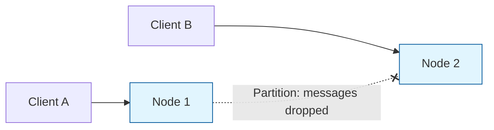
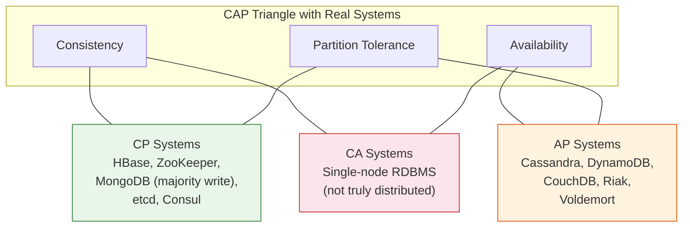
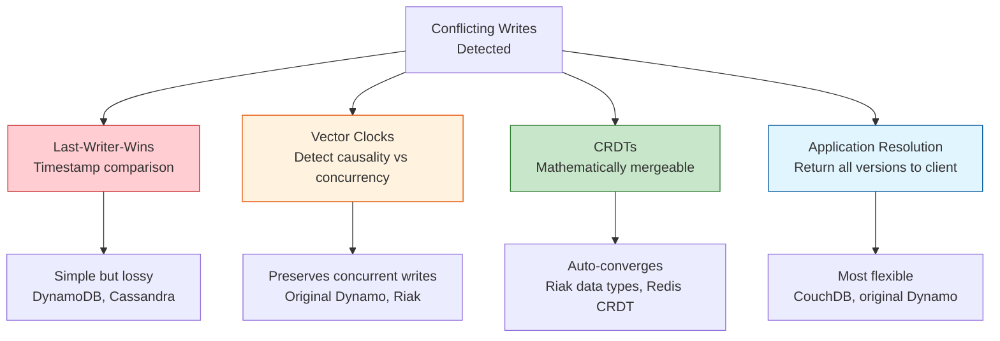
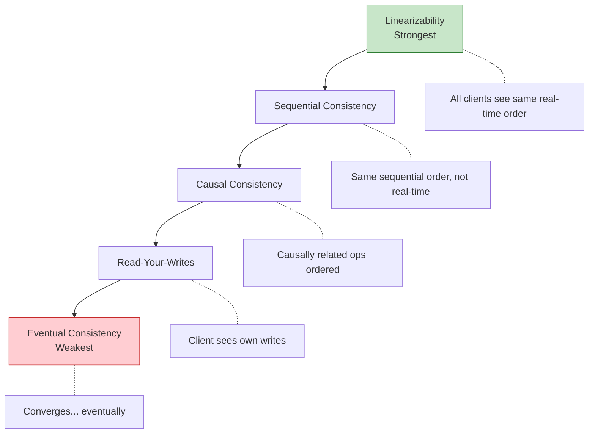
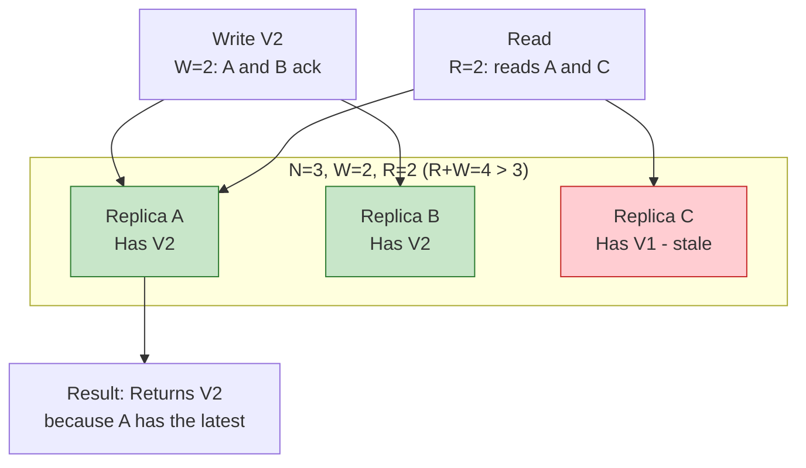
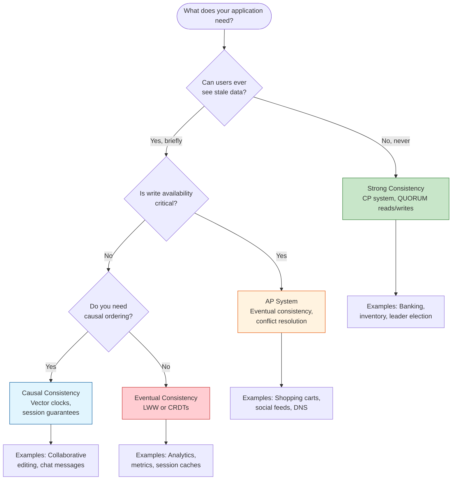
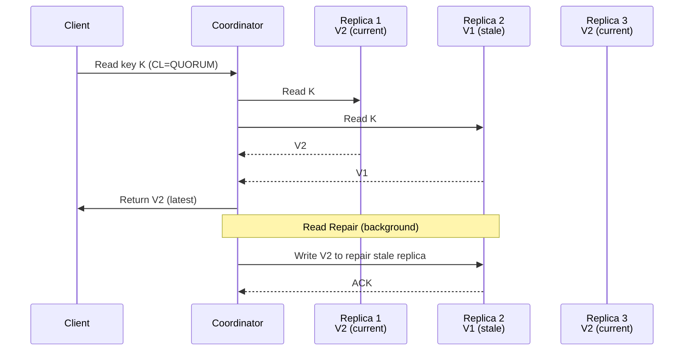

# CAP Theorem and Consistency Models

## Introduction

Every distributed system must make fundamental tradeoffs about how data behaves when spread across multiple machines. The CAP theorem, formulated by Eric Brewer in 2000 and formally proven by Gilbert and Lynch in 2002, captures the most important of these tradeoffs. Understanding CAP is not just academic -- it directly shapes how you choose databases, design replication strategies, and answer interview questions about system design.

This article covers the CAP theorem in depth, extends it with PACELC, walks through every major consistency model you will encounter, and shows how systems like Cassandra, MongoDB, and ZooKeeper actually implement these ideas in practice.

> [!NOTE]
> The CAP theorem is one of the most frequently referenced concepts in system design interviews. It often comes up when the interviewer asks "why did you choose this database?" or "what happens during a network partition?" Having a precise understanding -- including the common misconceptions -- will distinguish you from candidates who only know the surface-level "pick 2 of 3" framing.

## The CAP Theorem

### What Each Letter Means

The three properties in CAP are:

| Property | Definition | What It Means in Practice |
|----------|-----------|--------------------------|
| **Consistency (C)** | Every read receives the most recent write or an error | All nodes see the same data at the same time; there is a single, up-to-date copy of the data from the perspective of any client |
| **Availability (A)** | Every request receives a non-error response, without guarantee that it contains the most recent write | Every functioning node always returns a result, even if it might be stale |
| **Partition Tolerance (P)** | The system continues to operate despite arbitrary message loss or network failures between nodes | The network can drop or delay messages between any two nodes, and the system keeps running |

> [!IMPORTANT]
> The "C" in CAP is NOT the same as the "C" in ACID. ACID consistency means a transaction brings the database from one valid state to another (application-level invariants). CAP consistency means linearizability -- every operation appears to take effect instantaneously at some point between its invocation and its response.

### The Proof Sketch: Why You Can Only Pick Two

The proof is surprisingly simple. Consider two nodes, N1 and N2, separated by a network partition (they cannot communicate):



1. Client A writes value V2 to N1, replacing the old value V1
2. The partition means N1 cannot forward this update to N2
3. Client B reads from N2

Now the system must choose:
- **Return V1 (the stale value):** The system is **available** (it responded) but **not consistent** (Client B got old data). This is an AP choice.
- **Return an error or wait indefinitely:** The system is **consistent** (it refuses to give stale data) but **not available** (Client B did not get a successful response). This is a CP choice.
- **Not tolerate the partition at all:** Put everything on a single node. Now you have no partition tolerance. This is a CA choice -- but it is not really a distributed system anymore.

> [!NOTE]
> In any real distributed system, network partitions WILL happen. Cables get cut, switches fail, cloud availability zones lose connectivity. Since P is not optional in practice, the real choice is between C and A during a partition.

### The Common Misconception: It Is Not a Binary Choice

Many engineers treat CAP as "pick exactly two from three" -- as if you permanently commit to CP or AP and never revisit it. This framing is misleading for several reasons:

1. **CAP only applies during a partition.** When the network is healthy, you can have all three properties simultaneously. The tradeoff only kicks in when nodes lose contact.

2. **The choice is per operation, not per system.** A single system can be CP for some operations and AP for others. MongoDB, for example, offers tunable write concern -- you choose per-write whether to wait for majority acknowledgment (CP behavior) or accept a write on a single node (AP behavior).

3. **Consistency and availability are spectrums, not binaries.** There are many levels of consistency weaker than linearizability, and availability has degrees (99.9% vs 99.99%).

4. **The theorem says nothing about latency.** A system can technically be consistent and available (no partition) but have 30-second response times. CAP does not capture this.



## CP Systems in Practice

CP systems prioritize consistency over availability. During a partition, they will refuse to serve reads or writes rather than risk returning stale data.

### HBase

HBase uses a single active master (HMaster) and region servers. Each piece of data is owned by exactly one region server at a time. If that region server goes down, the data is unavailable until a new region server takes over the region. There is no multi-master replication where two nodes could serve conflicting data.

### MongoDB with Majority Writes

When configured with `writeConcern: "majority"` and `readConcern: "linearizable"`, MongoDB behaves as a CP system. Writes are only acknowledged after a majority of replica set members confirm them. During a partition, if the primary cannot reach a majority, it steps down and stops accepting writes. The minority partition becomes read-only or unavailable.

### ZooKeeper

ZooKeeper implements the ZAB (ZooKeeper Atomic Broadcast) protocol. All writes go through a single leader. If the leader is partitioned from a majority, the majority elects a new leader. Nodes in the minority partition cannot serve writes, and reads may also be unavailable (depending on configuration). Consistency is never sacrificed.

> [!TIP]
> In interviews, when someone asks "Is MongoDB CP or AP?" the best answer is: "It depends on the configuration." With majority write concern, it leans CP. With `w:1` (acknowledge after one node), it leans AP. This nuanced answer demonstrates real understanding.

## AP Systems in Practice

AP systems prioritize availability over consistency. During a partition, every reachable node continues to accept reads and writes, even if nodes have divergent data.

### Cassandra

Cassandra is masterless -- every node can accept reads and writes. During a partition, nodes on both sides keep operating. When the partition heals, Cassandra uses timestamps (last-write-wins) and optional read repair to reconcile conflicts. You can tune consistency per query with consistency levels (ONE, QUORUM, ALL), but the architecture fundamentally favors availability.

### DynamoDB

Amazon designed DynamoDB (evolved from Dynamo) with an "always writable" philosophy. Shopping cart additions should never fail, even during partitions. Conflicting writes are resolved at read time using vector clocks (in the original Dynamo paper) or last-writer-wins (in DynamoDB).

### CouchDB

CouchDB supports multi-master replication. Each node operates independently. Conflicts are stored (not silently dropped), and the application can resolve them. This makes it a natural fit for offline-first applications where nodes regularly lose connectivity.

### How AP Systems Handle Conflicts

AP systems must deal with the inevitable consequence of accepting writes during a partition: conflicting data. Different systems use different strategies:



**Last-Writer-Wins (LWW):** The simplest strategy. Each write gets a timestamp. When conflicts are detected, the write with the highest timestamp wins. The problem is that clocks are unreliable across nodes -- a write that truly happened second may have an earlier timestamp due to clock skew, causing silent data loss. Cassandra uses LWW by default.

**Vector Clocks:** Track the causal history of each write. When two writes are concurrent (neither causally precedes the other), the system detects the conflict and can present both versions to the application for resolution. This avoids silent data loss but requires application-level conflict handling.

**CRDTs (Conflict-free Replicated Data Types):** Specially designed data structures that can be merged automatically without conflicts. Examples include G-Counters (grow-only counters), PN-Counters (increment/decrement counters), OR-Sets (observed-remove sets), and LWW-Registers. CRDTs guarantee convergence regardless of the order in which operations are applied.

**Application-level resolution:** The system stores all conflicting versions (siblings) and returns them to the client on the next read. The application applies domain-specific logic to merge them. Amazon's original Dynamo paper uses this for shopping carts: merge the carts by taking the union of items.

> [!WARNING]
> Choosing a conflict resolution strategy is a critical design decision for AP systems. LWW trades correctness for simplicity -- acceptable for caches and session data, dangerous for financial data. Vector clocks plus application resolution is the safest but pushes complexity to the application layer. CRDTs are elegant but only work for specific data structures.

## The PACELC Theorem

### Extending CAP: What Happens Without a Partition?

CAP only describes behavior during a partition. But most of the time, there is no partition. The PACELC theorem (proposed by Daniel Abadi in 2012) extends CAP:

> If there is a **P**artition, choose between **A**vailability and **C**onsistency; **E**lse (no partition), choose between **L**atency and **C**onsistency.

The insight is that even without network failures, there is a fundamental tradeoff between response time and consistency. Replicating data synchronously to all nodes gives you consistency but adds latency. Replicating asynchronously gives you low latency but weaker consistency.

| System | During Partition (PAC) | Normal Operation (ELC) | Classification |
|--------|----------------------|----------------------|----------------|
| Cassandra | AP | EL (favors low latency) | PA/EL |
| DynamoDB | AP | EL (favors low latency) | PA/EL |
| MongoDB (majority) | CP | EC (favors consistency) | PC/EC |
| HBase | CP | EC (favors consistency) | PC/EC |
| PNUTS (Yahoo) | AP | EC (favors consistency) | PA/EC |
| Cosmos DB | Configurable | Configurable | Tunable |

> [!TIP]
> Mentioning PACELC in an interview signals depth. Most candidates stop at CAP. Saying "CAP only tells half the story -- PACELC captures the latency-consistency tradeoff during normal operation" sets you apart.

## Consistency Models

Consistency models define the contract between a distributed data store and its clients about what values reads can return and in what order operations appear to execute.

### Strong Consistency (Linearizability)

The strongest model. Every operation appears to take effect atomically at some single point in time between when the client sends the request and receives the response. All clients see operations in the same real-time order.

**Properties:**
- Once a write completes, all subsequent reads (by any client, on any node) return that write's value
- Operations respect real-time ordering
- The system behaves as if there is a single copy of the data

**Cost:** High latency (must coordinate across nodes), reduced availability during partitions.

**Systems:** ZooKeeper, etcd, Spanner (with TrueTime).

### Sequential Consistency

Weaker than linearizability. All operations appear to execute in some sequential order, and every client's operations appear in the order that client issued them. However, this order does not need to match real-time -- one client's write might not be visible to another client immediately.

**Difference from linearizability:** In linearizable systems, if operation A completes before operation B starts (in real time), then A must appear before B. Sequential consistency does not require this.

### Causal Consistency

Operations that are causally related must be seen by all nodes in the same order. Concurrent operations (not causally related) can be seen in different orders by different nodes.

Two operations are causally related if:
- They come from the same client (session ordering)
- One reads a value written by the other
- They are transitively linked through such relationships

**Example:** If user A posts a message and user B replies to it, all nodes must show A's post before B's reply. But two unrelated posts from different users can appear in any order.

**Systems:** MongoDB (with causal read concern), COPS.

### Read-Your-Writes Consistency

A client always sees its own writes. If client A writes a value, subsequent reads by client A will reflect that write. Other clients may or may not see the write yet.

This is a session-level guarantee. It is what users typically expect -- after updating their profile, they should see the updated profile. Another user might briefly see the old profile (this is acceptable).

**Implementation:** Often done by routing reads to the same node that accepted the write, or by tracking a write timestamp and only reading from replicas that have caught up past that timestamp.

### Eventual Consistency

The weakest commonly discussed model. If no new writes are made, all replicas will eventually converge to the same value. There is no bound on how long "eventually" takes.

**Properties:**
- Reads may return stale data at any time
- No ordering guarantees across clients
- Convergence is guaranteed only in the absence of new writes

**Systems:** DNS, Cassandra (at consistency level ONE), DynamoDB (default reads).

> [!WARNING]
> Eventual consistency does not mean "anything goes." It still guarantees convergence. But without careful application design, users can experience confusing behavior: seeing a comment they just posted disappear on refresh, then reappear seconds later.

### Consistency Model Comparison



## BASE vs ACID

### ACID (Traditional Databases)

ACID properties govern transactions in relational databases:

- **Atomicity:** A transaction either fully completes or fully rolls back. No partial application.
- **Consistency:** A transaction brings the database from one valid state to another, respecting all constraints and invariants.
- **Isolation:** Concurrent transactions do not interfere with each other. The result is the same as if they ran serially.
- **Durability:** Once a transaction commits, its effects survive crashes and power failures.

### BASE (Distributed NoSQL)

BASE is a philosophy for systems that relax ACID guarantees to gain scalability and availability:

- **Basically Available:** The system guarantees availability in the CAP sense. It will respond, even if the data is stale.
- **Soft State:** The state of the system may change over time, even without new input, as data propagates between replicas.
- **Eventually Consistent:** The system will converge to a consistent state given enough time without new writes.

### Comparison Table

| Property | ACID | BASE |
|----------|------|------|
| **Focus** | Correctness | Availability |
| **Consistency** | Strong (immediate) | Eventual |
| **Concurrency model** | Pessimistic locking or MVCC | Optimistic, conflict resolution |
| **Availability during failures** | Reduced (may block) | High (always responds) |
| **Scalability** | Vertical (scale up) | Horizontal (scale out) |
| **Schema** | Rigid, predefined | Flexible, schema-on-read |
| **Best for** | Financial transactions, inventory, bookings | Social feeds, analytics, IoT telemetry |
| **Typical systems** | PostgreSQL, MySQL, Oracle | Cassandra, DynamoDB, CouchDB |
| **Partition handling** | Sacrifice availability | Sacrifice consistency |
| **Complexity** | In the database engine | In the application layer |

> [!NOTE]
> The ACID vs BASE framing is a simplification. Many modern systems offer tunable guarantees that sit between these poles. CockroachDB provides ACID semantics in a distributed SQL database. Cassandra allows QUORUM reads/writes that approximate strong consistency. The line is blurry.

## Quorum-Based Consistency

### The R + W > N Formula

Quorum-based systems provide tunable consistency by controlling how many nodes must participate in reads and writes.

- **N** = total number of replicas
- **W** = number of replicas that must acknowledge a write
- **R** = number of replicas that must respond to a read

The key insight: **if R + W > N, read and write quorums overlap.** At least one node in any read quorum will have the latest write, guaranteeing the client sees fresh data.



### Common Configurations

| Configuration | W | R | Behavior |
|--------------|---|---|----------|
| Strong consistency | N/2 + 1 | N/2 + 1 | R + W > N; reads always see latest write |
| Write-optimized | 1 | N | Fast writes, slow reads; still consistent |
| Read-optimized | N | 1 | Slow writes, fast reads; still consistent |
| Eventual consistency | 1 | 1 | R + W = 2 <= N; may read stale data |

### Sloppy Quorums and Hinted Handoff

In strict quorum systems, if W nodes from the data's home replicas are unreachable, the write fails. A **sloppy quorum** relaxes this: the write goes to W available nodes, even if they are not the designated replicas. These stand-in nodes store a **hint** indicating the write belongs to a different node. When the original node recovers, the hints are forwarded. This improves write availability at the cost of consistency -- reading from the home replicas might miss the hinted write.

> [!TIP]
> When an interviewer asks "how does Dynamo achieve high write availability?", the answer involves sloppy quorums and hinted handoff. This combination lets every write succeed even during node failures, at the cost of temporarily weaker consistency.

## Vector Clocks and Conflict Resolution

### The Problem: Ordering Events Without a Global Clock

In a distributed system, there is no single global clock. Each node has its own clock, and these clocks drift. You cannot rely on wall-clock timestamps to determine which event happened first.

### Lamport Timestamps

Lamport timestamps provide a logical clock: a single counter incremented on every event. Each message carries the sender's timestamp, and the receiver sets its counter to `max(own, received) + 1`.

**Limitation:** If `timestamp(A) < timestamp(B)`, event A might have happened before B, or they might be concurrent. Lamport timestamps cannot distinguish causality from concurrency.

### Vector Clocks

A vector clock is a list of (node, counter) pairs -- one entry per node in the system. Each node increments its own entry on every event. When nodes communicate, they merge vectors by taking the element-wise maximum.

**How to compare two vector clocks:**
- **VC(A) < VC(B):** Every entry in A is less than or equal to the corresponding entry in B, and at least one is strictly less. A causally preceded B.
- **VC(A) || VC(B):** Neither is strictly less than the other. A and B are concurrent -- there is a conflict.

**Example:**

```
Node X: [X:1, Y:0, Z:0]  -- X writes value "foo"
Node Y: [X:0, Y:1, Z:0]  -- Y writes value "bar" concurrently

These are concurrent: neither dominates. Conflict detected.

Node X sends to Z: Z merges to [X:1, Y:0, Z:1]
Node Y sends to Z: Z now sees [X:1, Y:0, Z:1] vs [X:0, Y:1, Z:0]
  -- Still concurrent. Z must resolve the conflict.
```

### Conflict Resolution Strategies

| Strategy | How It Works | Pros | Cons |
|----------|-------------|------|------|
| **Last-Writer-Wins (LWW)** | Use wall-clock timestamp; latest wins | Simple, deterministic | Clock skew causes data loss |
| **Application-level merge** | Return all conflicting values to client; app resolves | No data loss | Complex client logic |
| **CRDTs** | Use data structures designed to auto-merge (counters, sets) | Automatic, correct | Limited to specific data types |
| **Read repair** | On read, detect stale replicas and update them | Passive consistency healing | Only fixes data that is actually read |

> [!WARNING]
> Last-Writer-Wins is dangerous. If Node A's clock is 5 seconds ahead and Node B writes a value 3 seconds after Node A, Node A's older write will overwrite Node B's newer write. Amazon's Dynamo paper uses vector clocks specifically to avoid this. Use LWW only when data loss is acceptable (e.g., session caches).

## Linearizability vs Serializability

These two terms are frequently confused, but they describe different things.

### Linearizability

A property of **single-object, single-operation** behavior in a distributed system. It means every read and write on a single data item appears to happen atomically at some point between invocation and response. It is a **recency guarantee**.

- Scope: One object at a time
- Guarantee: Real-time ordering of operations on that object
- Context: Distributed systems, replication

### Serializability

A property of **multi-object transactions** in a database. It means the result of executing concurrent transactions is the same as if they had executed in some serial order. It is an **isolation guarantee**.

- Scope: Multiple objects across a transaction
- Guarantee: Equivalent to some serial execution
- Context: Database transactions, concurrency control

### Strict Serializability

The combination of both: transactions are serializable AND the serial order respects real-time ordering. This is the strongest guarantee a database can provide.

| Property | Linearizability | Serializability |
|----------|----------------|-----------------|
| **Scope** | Single object | Multiple objects (transactions) |
| **Guarantee type** | Recency | Isolation |
| **Orders** | Individual reads/writes | Entire transactions |
| **Real-time ordering** | Yes | No (any serial order is fine) |
| **Found in** | Distributed KV stores, consensus systems | SQL databases |
| **Example system** | etcd, ZooKeeper | PostgreSQL (SSI), MySQL (2PL) |

> [!TIP]
> If an interviewer asks "what's the difference between linearizability and serializability?", a great concise answer is: "Linearizability is about real-time ordering of single operations on one object. Serializability is about isolating multi-object transactions so they appear serial. They operate at different levels. Strict serializability combines both."

## Google Spanner and TrueTime

### How Spanner Achieves External Consistency

Google Spanner is a globally distributed database that provides the strongest consistency guarantee: external consistency (equivalent to strict serializability). It achieves this by combining Paxos consensus with a novel clock system called TrueTime.

**TrueTime** uses GPS receivers and atomic clocks in every data center to provide a clock API that returns an interval `[earliest, latest]` rather than a single timestamp. The interval represents the uncertainty in the current time.

**How it enables strong consistency:**
1. When a transaction commits, Spanner assigns it a timestamp
2. The transaction waits until the uncertainty interval has passed (the "commit wait")
3. This guarantees that no future transaction can receive a timestamp that precedes this one
4. The result: transactions are ordered by their timestamps, and this order matches real-time causal order

**The cost:** Commit wait adds latency (typically 5-10ms, based on TrueTime's uncertainty window). This is the price of global strong consistency.

**Why other systems cannot do this:** Without hardware-assisted clocks (GPS + atomic clocks), clock uncertainty is too large (NTP gives 1-10ms uncertainty). The commit wait would be unacceptably long. Spanner works because Google invested in dedicated time infrastructure.

> [!NOTE]
> Spanner demonstrates that strong consistency at global scale is technically possible, but it requires significant infrastructure investment. For most organizations, the practical choice remains tunable consistency with careful application-level handling of edge cases.

### CockroachDB's Approach

CockroachDB was inspired by Spanner but runs on commodity hardware without GPS/atomic clocks. It uses hybrid logical clocks (HLCs) and a configurable maximum clock offset (default 500ms). When a transaction detects possible clock skew, it restarts. This achieves serializable isolation with some additional transaction restarts under clock skew, trading a small amount of availability for consistency without requiring specialized hardware.

## Tunable Consistency in Practice

### Cassandra's Consistency Levels

Cassandra lets you choose a consistency level per query:

| Level | Behavior | Use Case |
|-------|----------|----------|
| ANY | Write acknowledged by any node (including hints) | Maximum write availability |
| ONE | Read/write on one replica | Low-latency, stale reads OK |
| QUORUM | Majority of replicas (N/2 + 1) | Balance of consistency and performance |
| LOCAL_QUORUM | Quorum within the local data center | Cross-DC deployments |
| EACH_QUORUM | Quorum in each data center | Strong cross-DC consistency |
| ALL | All replicas must respond | Strongest consistency, lowest availability |

### DynamoDB's Consistency Options

DynamoDB offers two read modes:
- **Eventually consistent reads (default):** May return slightly stale data. Lower latency, higher throughput, half the cost.
- **Strongly consistent reads:** Returns the most up-to-date data. Higher latency, uses more capacity units.

Writes in DynamoDB are always sent to the leader of the partition's replication group and replicated to two additional nodes. The write is acknowledged once a quorum (2 of 3) confirms.

## Putting It All Together: How to Choose

### Decision Framework



## Real-World Consistency Patterns

### Consistency in Multi-Region Deployments

When a system spans multiple geographic regions (US-East, EU-West, Asia-Pacific), the consistency tradeoff becomes sharper. Synchronous replication across continents adds 100-300ms of latency per operation. This pushes many systems toward weaker consistency models for cross-region data.

**Common patterns:**

**Strong consistency within a region, eventual across regions:** The primary region handles writes with strong consistency. Changes are asynchronously replicated to other regions. Users in secondary regions may see stale data for a few hundred milliseconds. This is the approach most cloud databases use by default.

**Leader per partition:** Different data partitions can have leaders in different regions. User data for US customers has its leader in US-East. User data for EU customers has its leader in EU-West. Cross-region reads are eventually consistent unless the reader happens to be in the leader's region.

**Conflict-free replicated data types (CRDTs):** For specific data structures (counters, sets, registers), CRDTs allow concurrent updates in any region without conflicts. A "like count" on a post can be a G-Counter CRDT -- each region increments independently, and the final value is the sum across all regions. No coordination needed.

| Pattern | Latency | Consistency | Complexity |
|---------|---------|-------------|------------|
| Single-region leader | Low (intra-region) | Strong within region | Low |
| Multi-region sync replication | High (cross-region RTT) | Strong globally | Medium |
| Multi-region async replication | Low | Eventual across regions | Medium |
| CRDTs | Low | Strong convergence, no conflicts | High (limited data types) |

### Read Repair and Anti-Entropy

Systems with eventual consistency need mechanisms to converge replicas. Two common approaches:

**Read repair:** When a coordinator reads from multiple replicas and detects that some have stale data, it sends the latest version to the stale replicas in the background. This is "lazy" -- only data that is actually read gets repaired.

**Anti-entropy (background repair):** A background process periodically compares replicas using Merkle trees and synchronizes any differences. This is "proactive" -- it repairs data regardless of whether it is being read.

Cassandra uses both: read repair on every read (configurable), and a periodic `nodetool repair` operation that builds Merkle trees and synchronizes replicas.



### Monotonic Reads and Writes

Two session-level consistency guarantees that are often overlooked but important in practice:

**Monotonic reads:** Once a client reads a value at version N, it will never subsequently read a value at version M where M < N. Without this guarantee, a user could refresh a page and see older data than what they saw before (if their request hits a different, less up-to-date replica).

**Implementation:** Route all reads from a session to the same replica (sticky sessions), or track the highest version seen and only read from replicas at or above that version.

**Monotonic writes:** A client's writes are applied in the order they were issued. If a client writes A then B, no replica will apply B before A.

**Implementation:** Each write carries a sequence number from the session. Replicas buffer out-of-order writes and apply them sequentially.

> [!TIP]
> In interviews, if you are designing a user-facing application with eventual consistency, proactively mention monotonic reads: "To avoid confusing the user, I'd ensure monotonic reads by routing session reads to the same replica or tracking a read watermark. This prevents the user from seeing data go backward on refresh."

### Common Interview Scenarios

**"Design a banking system"** -- You need strong consistency. A user's balance must never show the wrong amount. Use a CP system or a distributed SQL database with strict serializability (CockroachDB, Spanner).

**"Design a social media feed"** -- Eventual consistency is fine. If a post shows up 2 seconds late on some users' feeds, nobody notices. Use an AP system (Cassandra, DynamoDB) with high write throughput.

**"Design a collaborative document editor"** -- Causal consistency is the sweet spot. Users need to see edits in causal order (you should not see a reply before the original message), but you do not need linearizability across all users globally.

**"Design a distributed cache"** -- Eventual consistency is usually acceptable. Cache misses are already expected. Use an AP system with short TTLs and read-through caching.

**"Design a distributed configuration service"** -- Strong consistency is essential. Configuration affects all nodes, and stale configuration can cause incorrect behavior. Use a CP system like ZooKeeper or etcd with Raft consensus.

**"Design a leaderboard system"** -- If exact real-time accuracy is not critical (most leaderboards), eventual consistency with periodic recalculation works. If users expect instant updates (live gaming), use stronger consistency for the write path and read-your-writes for the requesting user.

**"Design a URL shortener"** -- The mapping from short URL to long URL is immutable after creation. Once written, it never changes. This means eventual consistency is perfectly fine for reads -- even a slightly stale replica will return the correct URL because the data does not change. The only moment where consistency matters is the write path: ensuring no two users get the same short URL. Use a CP write (unique constraint or quorum write) with AP reads.

> [!TIP]
> Notice a pattern in these scenarios: the right consistency model depends on the nature of the data, not the system as a whole. Within a single system, you might use strong consistency for financial transactions, causal consistency for messaging, and eventual consistency for analytics. Always match the consistency model to the data's requirements.

## Interview Cheat Sheet

| Concept | One-Liner |
|---------|-----------|
| CAP Theorem | During a network partition, choose between consistency (refuse stale reads) or availability (always respond) |
| P is mandatory | Network partitions are inevitable in distributed systems; the real choice is C vs A during partitions |
| PACELC | Extends CAP: even without partitions, you trade latency vs consistency |
| Linearizability | Strongest consistency: every op appears atomic and respects real-time ordering |
| Eventual consistency | All replicas converge if writes stop; no timing guarantee |
| Quorum formula | R + W > N guarantees read-write overlap (at least one node has latest data) |
| Vector clocks | Detect concurrent writes without relying on wall clocks; enable conflict detection |
| LWW danger | Last-Writer-Wins uses timestamps, which are unreliable across nodes; can silently lose writes |
| Linearizability vs serializability | Linearizability = recency of single ops; serializability = isolation of transactions |
| Sloppy quorum | Write to any W available nodes (not just home replicas); improves availability, weaker consistency |
| Cassandra | AP system with tunable consistency per query (ONE through ALL) |
| MongoDB | CP when using majority write concern; can behave AP with w:1 |
| ZooKeeper | CP system using ZAB consensus; all writes through leader |
| BASE | Basically Available, Soft state, Eventually consistent -- the NoSQL philosophy |

> [!TIP]
> When discussing CAP in interviews, always mention that it is a spectrum, not a binary. Say "systems are not simply CP or AP -- they make tradeoffs per operation and configuration. The real question is: what consistency guarantee does this particular operation need?" This demonstrates engineering maturity.
