# 💬 System Design Interview: Chat System
### Facebook Messenger / WhatsApp Scale
> [!NOTE]
> **Staff Engineer Interview Preparation Guide** — High Level Design Round

---

## Table of Contents

1. [Problem Clarification & Requirements](#1-problem-clarification--requirements)
2. [Capacity Estimation & Scale](#2-capacity-estimation--scale)
3. [High-Level Architecture](#3-high-level-architecture)
4. [Core Components Deep Dive](#4-core-components-deep-dive)
5. [Data Models & Storage](#5-data-models--storage)
6. [Message Flow Diagrams](#6-message-flow-diagrams)
7. [Real-Time Communication](#7-real-time-communication)
8. [Group Messaging Architecture](#8-group-messaging-architecture)
9. [Presence & Online Status](#9-presence--online-status)
10. [Push Notifications](#10-push-notifications)
11. [Media & File Sharing](#11-media--file-sharing)
12. [Reliability & Fault Tolerance](#12-reliability--fault-tolerance)
13. [Scalability Strategies](#13-scalability-strategies)
14. [Design Trade-offs & Justifications](#14-design-trade-offs--justifications)
15. [Interview Cheat Sheet](#15-interview-cheat-sheet)

---

## 1. Problem Clarification & Requirements

> [!TIP]
> **Interview Tip:** Always spend the first 5 minutes clarifying requirements. This shows structured thinking and prevents wasted effort.

### Questions to Ask the Interviewer

| Category | Question | Why It Matters |
|----------|----------|----------------|
| **Scale** | How many DAU? 1M, 100M, 1B? | Drives architecture complexity |
| **Features** | 1-1 chat only, or groups too? | Fan-out complexity changes drastically |
| **Media** | Text only, or images/video/files? | Storage and CDN requirements |
| **Real-time** | Must messages be instant? | Polling vs. WebSocket decision |
| **History** | How long to retain messages? | Storage and archival strategy |
| **E2E Encryption** | Required? | Key management complexity |
| **Read Receipts** | Delivered/Read indicators? | Adds state tracking overhead |
| **Consistency** | Strong or eventual? | CAP theorem tradeoffs |

---

### Functional Requirements (Agreed Upon)

- ✅ One-on-one messaging (text, images, files)
- ✅ Group messaging (up to 1,000 members)
- ✅ Message delivery guarantees (at-least-once)
- ✅ Online presence & last seen
- ✅ Read receipts (sent → delivered → read)
- ✅ Push notifications for offline users
- ✅ Message history (last 1 year hot, rest archived)
- ✅ End-to-end encryption (Signal Protocol)

### Non-Functional Requirements

- ✅ **Availability:** 99.99% uptime (< 52 min downtime/year)
- ✅ **Latency:** < 100ms message delivery P99 (same region)
- ✅ **Scale:** 1B DAU, 100B messages/day
- ✅ **Durability:** Messages must never be lost
- ✅ **Consistency:** Eventual consistency acceptable; ordering must be preserved per conversation

---

## 2. Capacity Estimation & Scale

> [!TIP]
> **Interview Tip:** Show your math clearly. Interviewers want to see you can reason about numbers, not just memorize them.

### Traffic Estimation

```
DAU = 1 Billion users
Average messages per user per day = 100

Total messages/day = 1B × 100 = 100 Billion messages/day
Messages per second (avg) = 100B / 86,400 ≈ 1.16 Million msg/sec
Messages per second (peak, 3x) ≈ 3.5 Million msg/sec
```

### Storage Estimation

```
Average message size = 100 bytes (text)
Daily text storage = 100B × 100 bytes = 10 TB/day
Annual text storage = 10 TB × 365 = 3.65 PB/year

Media messages = 10% of all messages
Average media size = 1 MB
Daily media storage = 100B × 10% × 1MB = 10 PB/day
```

### Bandwidth Estimation

```
Ingress (upload) = 10 TB text + 10 PB media ≈ 10 PB/day
Egress (download) = Ingress × avg recipients (1.5) ≈ 15 PB/day
Peak bandwidth ≈ 15 PB / 86,400 sec × 3 (peak) ≈ 520 GB/sec
```

### Summary Capacity Table

| Metric | Value |
|--------|-------|
| DAU | 1 Billion |
| Peak QPS | ~3.5 Million msg/sec |
| Message Storage (text) | ~10 TB/day |
| Media Storage | ~10 PB/day |
| Chat servers needed | ~100,000 (at 10K connections each) |
| WebSocket connections | 1 Billion (1 per active user) |

---

## 3. High-Level Architecture

### System Overview

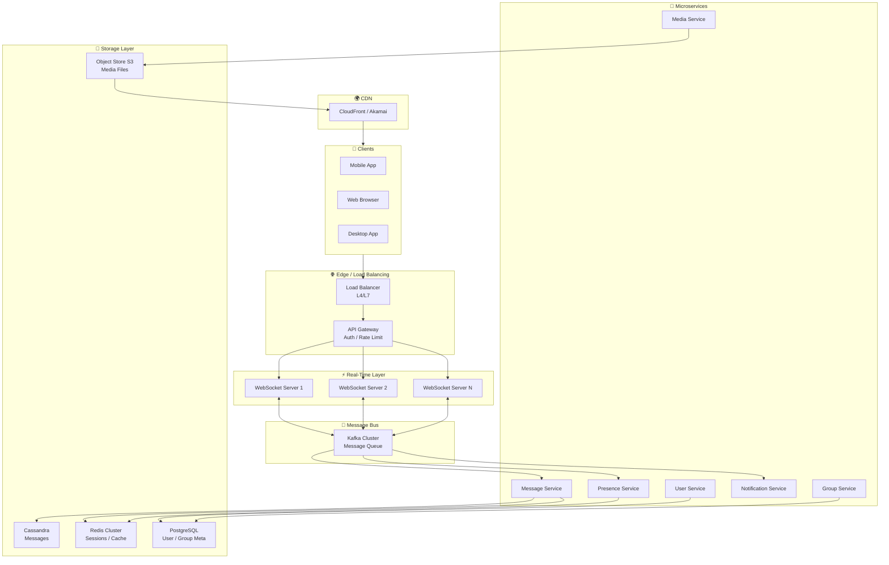

### Key Architectural Decisions at This Level

| Decision | Choice | Rationale |
|----------|--------|-----------|
| Connection Protocol | WebSocket | Bidirectional, persistent, low overhead vs HTTP polling |
| Message Bus | Kafka | High throughput, durable, replay-able |
| Primary DB | Cassandra | Write-heavy, horizontally scalable, time-series optimized |
| Cache | Redis | Sub-millisecond latency, pub/sub support |
| CDN | CloudFront | Media delivery at edge, reduce origin load |

---

## 4. Core Components Deep Dive

### 4.1 WebSocket / Chat Servers

The WebSocket servers are the heart of the real-time system. Each server maintains **persistent TCP connections** with clients.

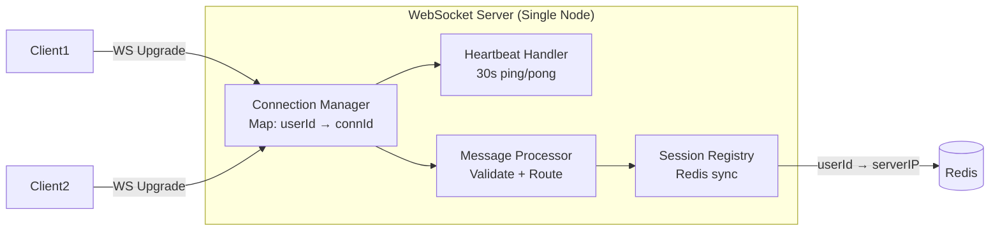

**Key Responsibilities:**
- Maintain connection map: `userId → connectionId`
- Register `userId → serverIP` in Redis (for routing)
- Forward messages to Kafka topic `chat.messages`
- Subscribe to Kafka topic `chat.delivery.{userId}` to push messages to connected clients
- Handle disconnections and cleanup registry

**Capacity per server:**
```
Connections per server = 10,000 - 50,000 (depends on RAM)
At 1B users, 60% online = 600M connections
Servers needed = 600M / 50,000 = 12,000 servers
```

---

### 4.2 Message Service

The Message Service is the write path — it receives messages from Kafka, persists them, and fans out delivery.

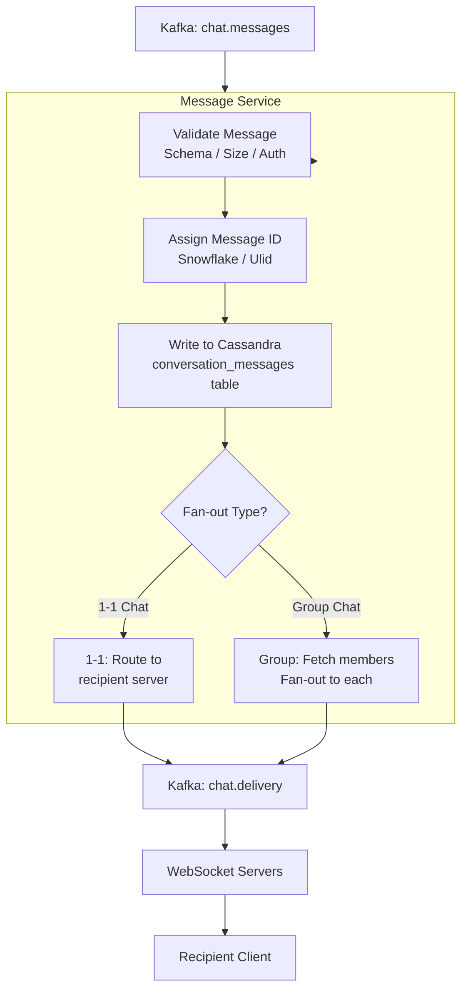

---

### 4.3 Message ID Generation — Snowflake IDs

Messages need **globally unique, time-sortable IDs**. We use a Snowflake-like ID generator:

```
 63 bits total
 ┌──────────────────────────────┬──────────────┬────────────┐
 │  41 bits timestamp (ms)      │ 10 bits node │ 12 bits seq│
 └──────────────────────────────┴──────────────┴────────────┘

Max QPS per node = 2^12 = 4096 IDs/ms = 4M IDs/sec
With 1024 nodes = 4 Billion IDs/sec (more than enough)
```

**Why Snowflake over UUID?**
- Time-sortable → queries by time range are efficient
- Monotonically increasing → append-friendly in Cassandra
- Compact (8 bytes vs 16 bytes UUID)

---

### 4.4 Presence Service

Tracks which users are online in real-time.

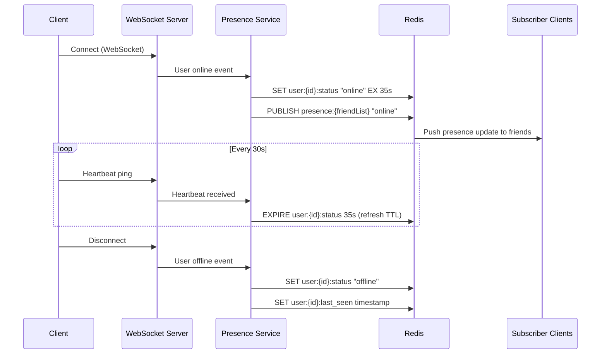

**Design Choice — TTL-based presence:**
- Store `online` status in Redis with 35s TTL
- Heartbeat every 30s refreshes the TTL
- If heartbeat stops (crash/disconnect) → key expires → user marked offline
- This avoids zombie sessions from ungraceful disconnections

---

## 5. Data Models & Storage

### 5.1 Storage Technology Selection

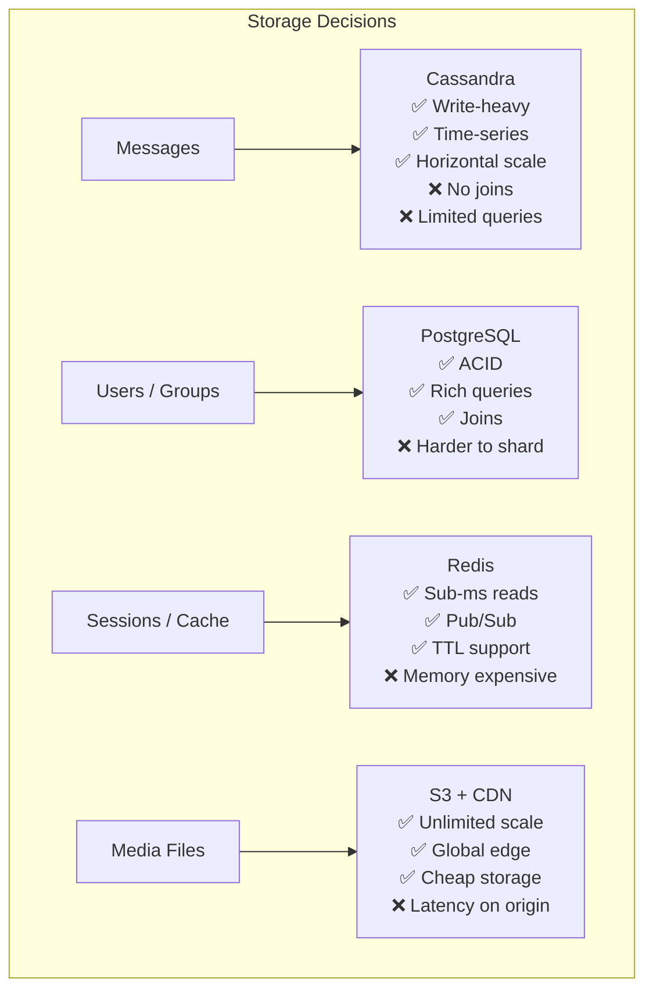

---

### 5.2 Cassandra Schema (Messages)

**Table: `conversation_messages`**

```sql
CREATE TABLE conversation_messages (
    conversation_id  UUID,           -- Partition key (1-1: sorted pair of user IDs, group: group ID)
    message_id       BIGINT,         -- Clustering key (Snowflake ID — time sortable, DESC)
    sender_id        UUID,
    message_type     TEXT,           -- 'text', 'image', 'video', 'file', 'reaction'
    content          TEXT,           -- Encrypted content (E2E)
    media_url        TEXT,           -- S3 URL if media message
    status           TEXT,           -- 'sent', 'delivered', 'read'
    created_at       TIMESTAMP,
    metadata         MAP<TEXT, TEXT>, -- extensible metadata
    PRIMARY KEY (conversation_id, message_id)
) WITH CLUSTERING ORDER BY (message_id DESC)
  AND default_time_to_live = 31536000  -- 1 year TTL
  AND compaction = {'class': 'TimeWindowCompactionStrategy',
                    'compaction_window_unit': 'DAYS',
                    'compaction_window_size': 1};
```

**Why this schema?**

| Design Choice | Reason |
|--------------|--------|
| `conversation_id` as partition key | All messages in a conversation co-located on same node |
| `message_id` (Snowflake) as clustering key | Messages auto-sorted by time; efficient range scans |
| `DESC` clustering order | Newest messages first — common query pattern |
| TTL = 1 year | Auto-expiry without manual cleanup jobs |
| TimeWindowCompaction | Optimal for time-series data, efficient tombstone handling |

---

**Table: `user_conversations`** (Inbox)

```sql
CREATE TABLE user_conversations (
    user_id          UUID,
    last_message_id  BIGINT,         -- For ordering inbox
    conversation_id  UUID,
    unread_count     COUNTER,
    last_message     TEXT,           -- Denormalized preview
    updated_at       TIMESTAMP,
    PRIMARY KEY (user_id, last_message_id, conversation_id)
) WITH CLUSTERING ORDER BY (last_message_id DESC);
```

---

### 5.3 PostgreSQL Schema (Users & Groups)

```sql
-- Users
CREATE TABLE users (
    id              UUID PRIMARY KEY DEFAULT gen_random_uuid(),
    phone_number    VARCHAR(20) UNIQUE NOT NULL,
    username        VARCHAR(50),
    display_name    VARCHAR(100),
    profile_pic_url TEXT,
    public_key      TEXT,           -- For E2E encryption (Signal Protocol)
    created_at      TIMESTAMPTZ DEFAULT NOW(),
    deleted_at      TIMESTAMPTZ     -- Soft delete
);

-- Groups
CREATE TABLE groups (
    id              UUID PRIMARY KEY DEFAULT gen_random_uuid(),
    name            VARCHAR(100) NOT NULL,
    description     TEXT,
    avatar_url      TEXT,
    creator_id      UUID REFERENCES users(id),
    max_members     INT DEFAULT 1000,
    created_at      TIMESTAMPTZ DEFAULT NOW()
);

-- Group Members
CREATE TABLE group_members (
    group_id        UUID REFERENCES groups(id),
    user_id         UUID REFERENCES users(id),
    role            VARCHAR(20) DEFAULT 'member',  -- 'admin', 'member'
    joined_at       TIMESTAMPTZ DEFAULT NOW(),
    PRIMARY KEY (group_id, user_id)
);

CREATE INDEX idx_group_members_user ON group_members(user_id);  -- Find all groups for a user
```

---

### 5.4 Redis Data Structures

```
# WebSocket routing — which server a user is connected to
Key: ws:routing:{userId}
Type: String
Value: "10.0.1.42:8080"
TTL: 35 seconds (refreshed on heartbeat)

# Online presence
Key: presence:{userId}
Type: String
Value: "online" | "offline"
TTL: 35 seconds

# Last seen timestamp
Key: last_seen:{userId}
Type: String
Value: Unix timestamp

# Unread message counts per conversation
Key: unread:{userId}:{conversationId}
Type: String (counter)
Value: "42"

# Recent message cache (inbox)
Key: inbox:{userId}
Type: Sorted Set
Score: last_message_timestamp
Value: conversationId

# Rate limiting (per user per minute)
Key: rate_limit:{userId}
Type: String (counter)
TTL: 60 seconds
```

---

## 6. Message Flow Diagrams

### 6.1 Sending a 1-1 Message (Happy Path)

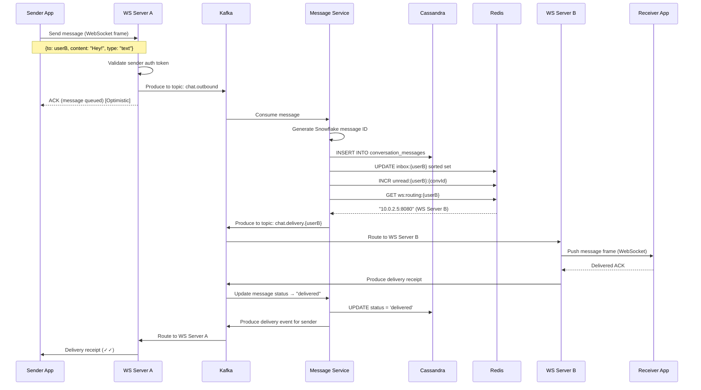

---

### 6.2 Offline Message Delivery (User Returns Online)

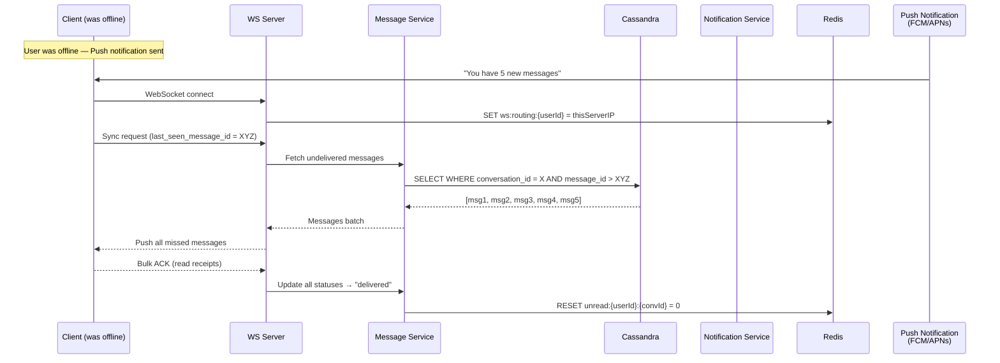

---

### 6.3 Message Failure & Retry Flow

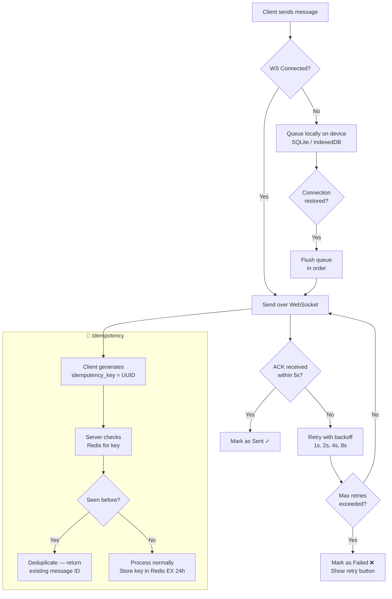

---

## 7. Real-Time Communication

### 7.1 WebSocket vs. Alternatives

| Protocol | Latency | Server Load | Bi-directional | Use Case |
|----------|---------|-------------|----------------|----------|
| **WebSocket** ✅ | Very Low | Medium | ✅ Yes | Real-time chat |
| Short Polling | High | Very High | ❌ No | Legacy systems |
| Long Polling | Medium | High | Partial | Fallback only |
| SSE | Low | Low | ❌ Server → Client only | Notifications |
| HTTP/2 Push | Low | Low | ❌ Server → Client only | Web push |

**Decision: WebSocket** — Full duplex, persistent connection, low overhead per message after handshake.

---

### 7.2 WebSocket Connection Lifecycle

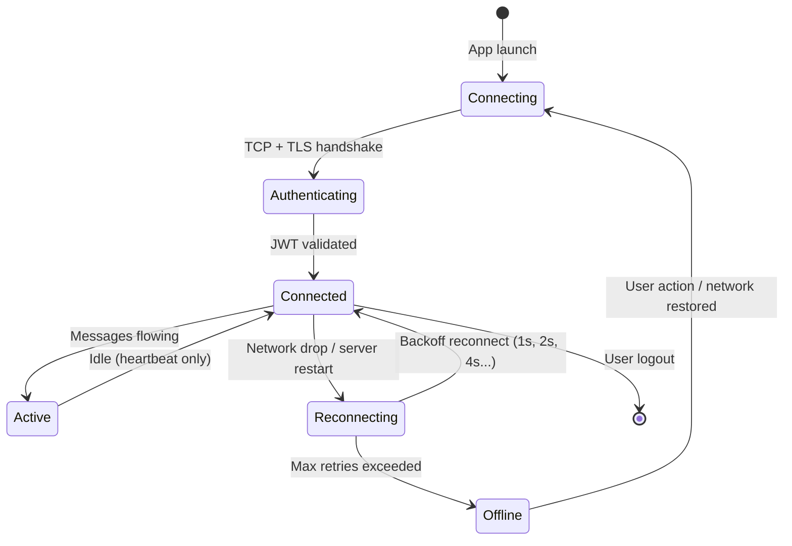

### 7.3 Message Routing Architecture

When a message needs to reach `userB`, the Message Service must find which WebSocket server `userB` is connected to:

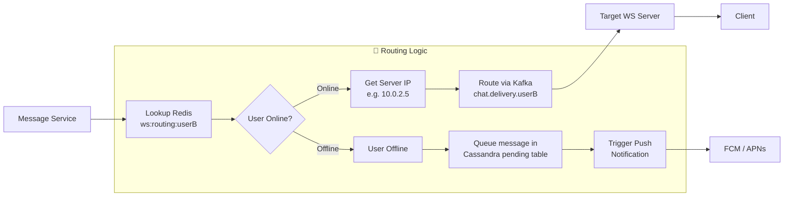

---

## 8. Group Messaging Architecture

### 8.1 The Fan-out Problem

Group messaging at scale is one of the hardest design challenges. With 1,000 members in a group and millions of groups, naive fan-out is catastrophic.

```
Problem: A group has 1,000 members.
One message = 1,000 delivery operations.
If 1M groups are active simultaneously = 1 Billion ops/sec ❌
```

### 8.2 Fan-out Strategies Compared

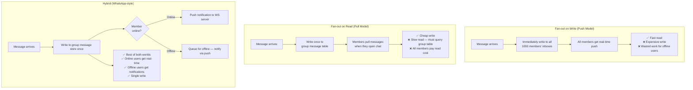

**Decision: Hybrid Fan-out**

---

### 8.3 Group Message Flow

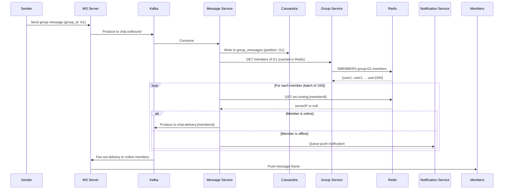

### 8.4 Group Membership Cache

```
Redis Set: group:{groupId}:members
  SMEMBERS → all member IDs
  SADD / SREM → add/remove member

Redis Hash: group:{groupId}:meta
  name, description, avatar, creator_id, member_count

Cache TTL: 5 minutes (acceptable staleness for member list)
Cache Invalidation: On member add/remove, delete key
```

---

## 9. Presence & Online Status

### 9.1 Architecture

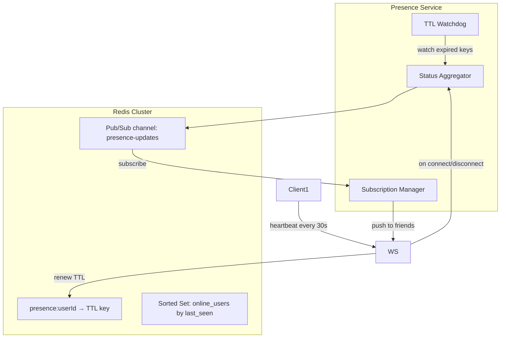

### 9.2 Presence States & Transitions

| State | Meaning | Storage | TTL |
|-------|---------|---------|-----|
| `online` | Active, heartbeat received | Redis | 35s |
| `away` | No activity > 5 min but connected | Redis | 35s |
| `offline` | Key expired or explicit disconnect | Redis (last_seen) | Permanent |
| `do_not_disturb` | User-configured | PostgreSQL | None |

### 9.3 Scalability Challenge: Friend Presence

```
Problem: 
User A has 500 friends.
Each friend state change = notify 500 users = O(N²) fan-out.
At 1B users this is catastrophic.

Solutions:
1. Batching: Coalesce presence events over 500ms window before broadcasting
2. Interest-based: Only notify if recipient has chat open with that user
3. Lazy loading: Client polls presence only for currently-visible conversations
4. Sampling: For users with 500+ friends, batch broadcast every 30s instead of real-time
```

---

## 10. Push Notifications

### 10.1 Architecture

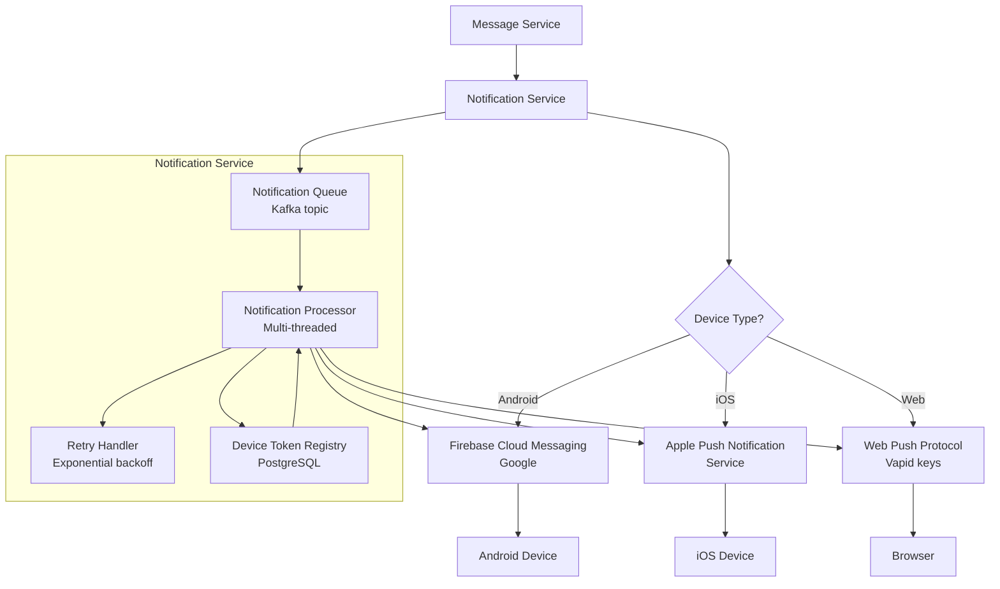

### 10.2 Notification Payload Design

```json
{
  "to": "device_token_xyz",
  "priority": "high",
  "content_available": true,
  "notification": {
    "title": "Alice",
    "body": "Hey, are you free tonight?",
    "badge": 5,
    "sound": "default"
  },
  "data": {
    "conversation_id": "conv-uuid-123",
    "message_id": "1234567890",
    "sender_id": "user-uuid-456",
    "message_type": "text",
    "notification_type": "new_message"
  }
}
```

**Note on E2E Encryption:** If E2E encryption is enabled, the notification body must be generic ("You have a new message") — the actual content is encrypted and only decryptable by the recipient device.

---

## 11. Media & File Sharing

### 11.1 Media Upload Flow

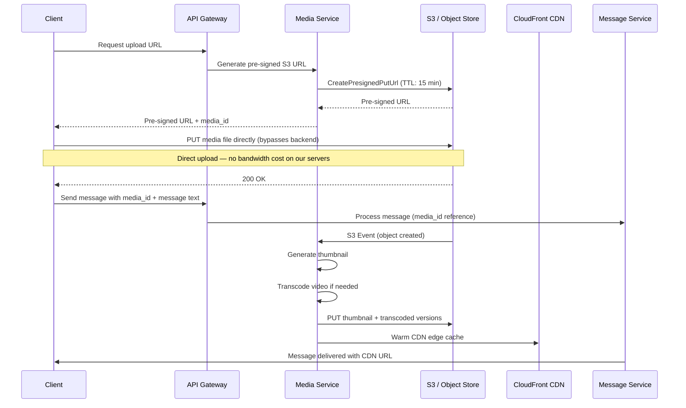

### 11.2 Media Storage Strategy

| Media Type | Strategy | Retention |
|-----------|---------|-----------|
| Images | Original + thumbnails (480px, 1080px) | 1 year hot, then Glacier |
| Videos | Transcode to H.264/HLS multi-bitrate | 1 year hot |
| Audio messages | Store as-is (M4A/OGG) | 1 year |
| Documents | Store original | 1 year |
| Profile pics | Multiple resolutions (64, 256, 512px) | Indefinite |

### 11.3 CDN Strategy

```
URL Structure:
cdn.chat.com/{media_id}/{variant}

Examples:
cdn.chat.com/abc123/thumbnail   → 480px JPEG
cdn.chat.com/abc123/full        → Original
cdn.chat.com/abc123/video/720p  → Transcoded video

Cache-Control: public, max-age=31536000, immutable
```

---

## 12. Reliability & Fault Tolerance

### 12.1 Message Delivery Guarantees

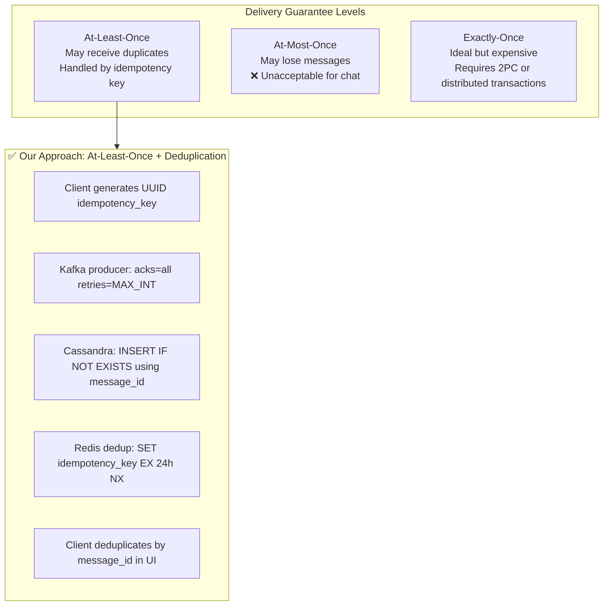

### 12.2 Single Points of Failure Mitigation

| Component | SPOF Risk | Mitigation |
|-----------|-----------|------------|
| WebSocket Servers | Server crash drops all connections | Stateless servers; clients auto-reconnect; messages in Kafka |
| Kafka | Broker failure | 3x replication factor; min.insync.replicas=2 |
| Cassandra | Node failure | Replication factor=3; consistency=QUORUM (2/3 nodes) |
| Redis | Cache failure | Redis Sentinel / Cluster; graceful degradation to DB |
| Single Region | Region outage | Multi-region active-active (see below) |

### 12.3 Multi-Region Active-Active Architecture

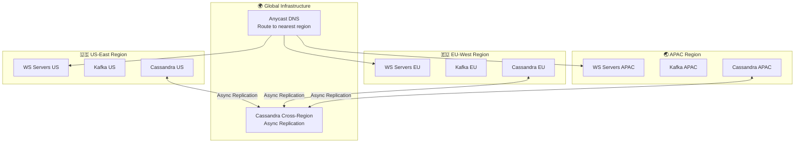

**Cross-region replication note:** 
- Cassandra natively supports multi-datacenter replication
- `LOCAL_QUORUM` consistency ensures reads/writes succeed even if cross-region link is down
- Accept eventual consistency for cross-region (usually < 100ms lag)

---

### 12.4 Kafka Configuration for Durability

```
Topic: chat.messages
  Partitions: 1024 (allows 1024 parallel consumers)
  Replication Factor: 3
  min.insync.replicas: 2
  retention.ms: 604800000 (7 days — for replay/debugging)

Producer config:
  acks: all (wait for all ISR replicas)
  retries: MAX_INT
  enable.idempotence: true
  max.in.flight.requests.per.connection: 5

Consumer config:
  auto.offset.reset: earliest
  enable.auto.commit: false  (manual commit after DB write)
  isolation.level: read_committed
```

---

## 13. Scalability Strategies

### 13.1 Database Sharding Strategy

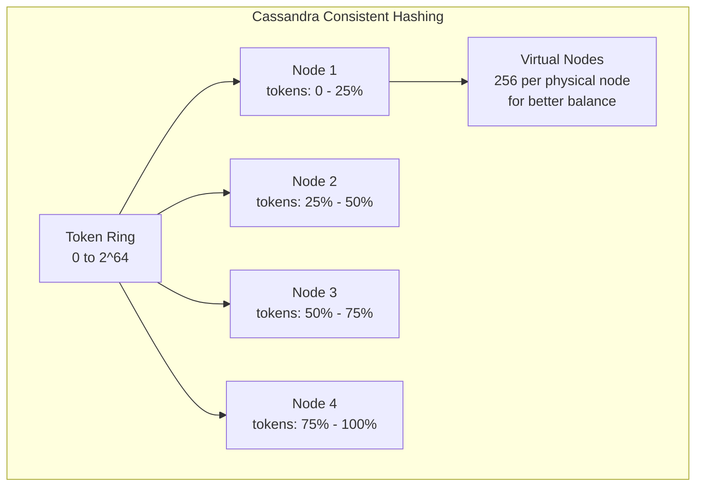

**Partition Key Choice for Messages:**

| Key Choice | Pro | Con |
|-----------|-----|-----|
| `user_id` | Simple | Hot partitions for popular users |
| `conversation_id` | Co-locates conversation | Large groups = large partitions |
| `conversation_id + date_bucket` ✅ | Bounded partition size | Slightly more complex queries |

```sql
-- With date bucketing to cap partition size
PRIMARY KEY ((conversation_id, date_bucket), message_id)
-- date_bucket = DATE_TRUNC('day', created_at)
-- Each partition = one day of a conversation = bounded size
```

---

### 13.2 Horizontal Scaling — WebSocket Servers

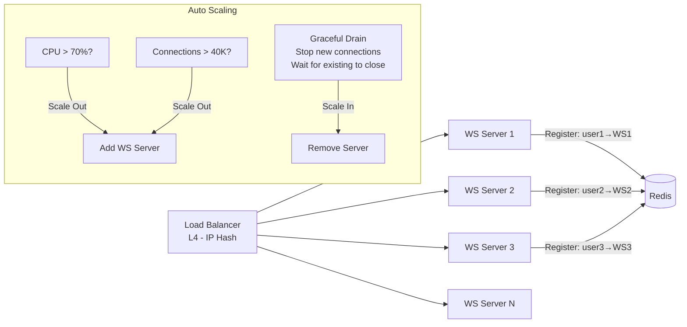

**Key:** WebSocket servers are **stateless** — all state lives in Redis. This enables horizontal scale-out without session affinity issues.

---

### 13.3 Caching Strategy

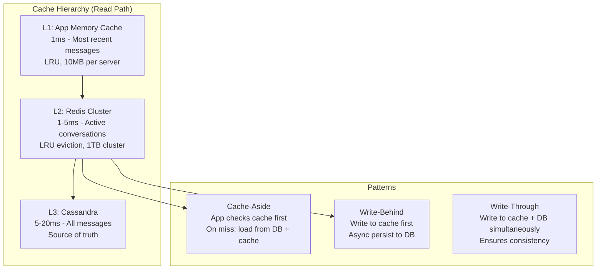

---

## 14. Design Trade-offs & Justifications

> [!TIP]
> **Interview Tip:** This is where Staff-level candidates differentiate themselves. Always articulate WHY, not just WHAT.

### Trade-off 1: Consistency vs. Availability (CAP Theorem)

| Scenario | Choice | Justification |
|----------|--------|---------------|
| Message storage | **AP** (Eventual Consistency) | Better to show a message slightly delayed than fail the send. Chat is tolerant of eventual consistency. |
| User authentication | **CP** (Strong Consistency) | Cannot allow auth to be stale — security risk |
| Presence status | **AP** (Eventual) | 1-2 second delay in presence update is imperceptible to users |
| Message ordering | **Causal Consistency** | Messages within a conversation must be ordered; global ordering not needed |

---

### Trade-off 2: Push vs. Pull for Message Delivery

```
PUSH (WebSocket, we chose this):
  ✅ Real-time delivery, <100ms latency
  ✅ No polling overhead
  ✅ Server controls timing
  ❌ Requires persistent connections (1B connections = memory intensive)
  ❌ Server must track which socket to send to

PULL (Polling):
  ✅ Simple to implement
  ✅ No persistent connections
  ❌ Latency = polling interval (minimum 1-30s)
  ❌ Massive wasted requests when nothing to receive
  ❌ Cannot scale to 1B users efficiently
```

**Decision: WebSocket (Push)** — At Facebook/WhatsApp scale, poll frequency of even 1s = 1 Billion requests/sec from polling alone. WebSocket amortizes connection cost across thousands of messages.

---

### Trade-off 3: Storage — SQL vs. NoSQL for Messages

```
SQL (PostgreSQL):
  ✅ ACID transactions
  ✅ Rich query language
  ✅ Strong consistency
  ❌ Hard to shard horizontally
  ❌ Write throughput limits (10K-100K writes/sec per node)
  ❌ At 100B messages/day = 1.16M writes/sec → SQL cannot handle this

Cassandra:
  ✅ Horizontally scalable (linear scale-out)
  ✅ Write-optimized (LSM tree)
  ✅ Built-in replication and fault tolerance
  ✅ Time-series friendly with clustering keys
  ❌ No joins — must denormalize
  ❌ Limited query patterns (must query by partition key)
  ❌ Eventual consistency requires client-side handling
```

**Decision: Cassandra for messages** — Write throughput requirement (1.16M/sec) eliminates SQL. Cassandra scales linearly; add nodes to add capacity.

---

### Trade-off 4: Message Fan-out Strategy for Groups

| Strategy | Write Cost | Read Cost | Recommended For |
|---------|-----------|-----------|----------------|
| Fan-out on Write | O(members) per message | O(1) | Small groups < 100 |
| Fan-out on Read | O(1) per message | O(messages) per open | Large groups > 1000 |
| **Hybrid** ✅ | O(1) storage + async fan-out | O(1) | Our choice — all sizes |

**Our hybrid approach:**
- Store message once in `group_messages` table (partition: group_id)
- Fan-out delivery notifications asynchronously via Kafka
- Online members get pushed immediately
- Offline members get push notification; pull messages on reconnect

---

### Trade-off 5: Message ID — UUID vs. Snowflake

| Property | UUID v4 | Snowflake ID |
|----------|---------|-------------|
| Sortable by time | ❌ No | ✅ Yes |
| Size | 128 bits (16 bytes) | 64 bits (8 bytes) |
| Generation | Decentralized | Requires coordination service |
| Cassandra performance | ❌ Random writes → poor SSTable locality | ✅ Sequential writes → excellent locality |
| Human readable order | ❌ No | ✅ Monotonically increasing |

**Decision: Snowflake** — Time-sortable IDs are critical for efficiently reading messages in chronological order without secondary indexes.

---

### Trade-off 6: End-to-End Encryption

```
With E2E Encryption (Signal Protocol):
  ✅ True privacy — server never sees plaintext
  ✅ Forward secrecy (compromise of long-term key doesn't expose past messages)
  ❌ Server cannot search message content
  ❌ Cannot do spam/abuse detection on content
  ❌ Key management complexity (what if user loses device?)
  ❌ Backup complexity (iCloud/Google Drive backup of keys)
  ❌ Push notification body must be generic ("New message")

Without E2E:
  ✅ Server can scan for spam/malware
  ✅ Full-text search
  ✅ Legal compliance easier (CSAM detection)
  ❌ Privacy concerns; server can read all messages

Decision: E2E by default (WhatsApp approach), with server-side scanning 
at message metadata layer for abuse patterns.
```

---

## 15. Interview Cheat Sheet

> [!TIP]
> **Use this section for quick reference during the interview**

### Key Numbers to Remember

| Metric | Value |
|--------|-------|
| WS connections per server | 10,000 – 50,000 |
| Kafka throughput | 10M+ messages/sec |
| Cassandra write throughput | 1M+ writes/sec per cluster |
| Redis read latency | < 1ms |
| Message latency target | < 100ms P99 |
| Snowflake IDs per sec | 4M per node |

### Common Interview Questions & Key Points

**Q: How do you handle message ordering in a distributed system?**
> [!NOTE]
> Use Snowflake IDs as clustering keys in Cassandra. Within a conversation, all writes go to the same partition (ordered by message_id). For cross-device ordering, use vector clocks or logical timestamps on the client.

**Q: What happens when a WebSocket server crashes?**
> [!NOTE]
> 1. Clients auto-reconnect with exponential backoff
> 2. New server registers userId → newIP in Redis
> 3. Inflight Kafka messages are reprocessed (Kafka consumer group rebalances)
> 4. Client requests sync since last_seen_message_id on reconnect

**Q: How do you prevent message duplication?**
> [!NOTE]
> Client assigns UUID idempotency_key. Server stores key in Redis (EX 24h) and uses `INSERT IF NOT EXISTS` in Cassandra. Client deduplicates in UI by message_id.

**Q: How do you scale to 1 Billion users?**
> [!NOTE]
> 1. Stateless WebSocket servers → horizontal scale-out
> 2. Kafka for async decoupling → absorbs traffic spikes
> 3. Cassandra linear scaling → add nodes, capacity scales linearly
> 4. Redis cluster for routing → sharded across multiple nodes
> 5. CDN for media → offloads bandwidth from origin

**Q: How does group message delivery work?**
> [!NOTE]
> Single write to group_messages table. Async fan-out via Kafka to online members (push) and offline members (push notification). Pull on reconnect.

**Q: How do you handle the thundering herd problem on reconnect?**
> [!NOTE]
> Jitter in reconnect backoff: `delay = min(cap, base * 2^attempt) + random(0, 1000ms)`. This prevents all 1B clients from reconnecting simultaneously after a regional outage.

---

### Architecture Summary Diagram (One-Page View)

```mermaid
graph TB
    subgraph C["Clients"]
        MOB[📱 Mobile]
        WEB[🌐 Web]
    end

    subgraph E["Edge"]
        DNS[DNS Anycast] --> LB[Load Balancer]
        LB --> GW[API Gateway<br/>Auth • Rate Limit • SSL]
    end

    subgraph RT["Real-Time Layer"]
        WS[WebSocket Servers<br/>10K-50K connections each]
    end

    subgraph MQ["Message Queue"]
        KF[Kafka<br/>1024 partitions • RF=3]
    end

    subgraph SVC["Services"]
        MS[Message Service]
        PS[Presence Service]
        NS[Notification Service]
        GS[Group Service]
        MDS[Media Service]
    end

    subgraph DB["Storage"]
        CA[Cassandra<br/>Messages • RF=3]
        PG[PostgreSQL<br/>Users • Groups]
        RE[Redis<br/>Sessions • Routing • Cache]
        S3[S3 + CDN<br/>Media]
    end

    C --> DNS
    GW --> WS
    WS <--> KF
    KF --> MS
    KF --> NS
    KF --> PS
    MS --> CA
    MS --> RE
    PS --> RE
    GS --> PG
    GS --> RE
    MDS --> S3
    NS --> FCM[FCM/APNs]
```

---

*Document prepared for Staff Software Engineer System Design Interview Preparation*
*Covers: Facebook Messenger / WhatsApp architecture at 1 Billion user scale*
