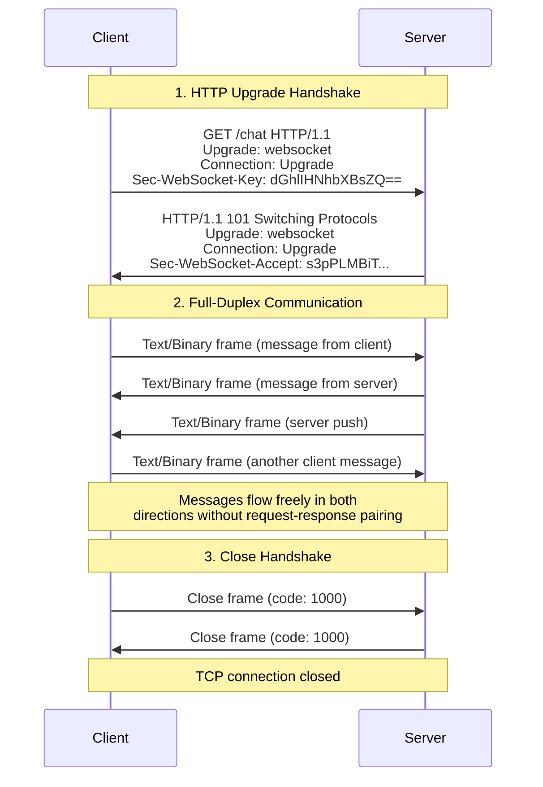
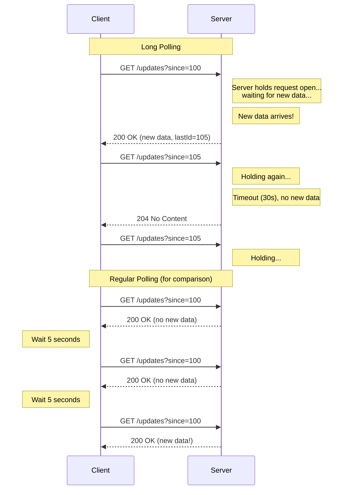
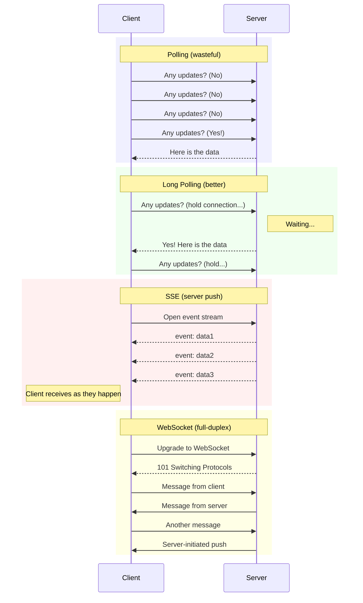

# Communication Patterns — Complete System Design Reference
### Staff Engineer Interview Preparation Guide

> [!TIP]
> Choosing the right communication pattern is one of the most impactful decisions in system design. Interviewers evaluate whether you understand the trade-offs deeply enough to pick the right tool — not just the most popular one.

---

## Table of Contents

1. [REST — The Default Choice](#1-rest--the-default-choice)
2. [GraphQL — Flexible Queries](#2-graphql--flexible-queries)
3. [gRPC — High-Performance RPC](#3-grpc--high-performance-rpc)
4. [WebSockets — Full-Duplex Communication](#4-websockets--full-duplex-communication)
5. [Server-Sent Events (SSE)](#5-server-sent-events-sse)
6. [Long Polling](#6-long-polling)
7. [Webhooks — Push-Based Integration](#7-webhooks--push-based-integration)
8. [RPC vs REST — A Deeper Comparison](#8-rpc-vs-rest--a-deeper-comparison)
9. [Choosing the Right Pattern](#9-choosing-the-right-pattern)
10. [Interview Cheat Sheet](#10-interview-cheat-sheet)

---

## 1. REST — The Default Choice

### What REST Actually Is

REST (Representational State Transfer) is an architectural style, not a protocol. It was defined by Roy Fielding in his 2000 doctoral dissertation. A truly RESTful API follows six constraints:

1. **Client-Server:** Separation of concerns between the UI and data storage
2. **Stateless:** Each request contains all information needed to process it — no server-side session state
3. **Cacheable:** Responses must declare themselves cacheable or non-cacheable
4. **Uniform Interface:** Resources are identified by URIs, manipulated through representations, and self-descriptive
5. **Layered System:** Clients cannot tell whether they are connected to the end server or an intermediary
6. **Code on Demand (optional):** Servers can extend client functionality by sending executable code

> [!NOTE]
> Most "REST APIs" in production are not truly RESTful. They use HTTP with JSON payloads and resource-oriented URLs, which is more accurately called "HTTP APIs" or "REST-ish." True REST includes HATEOAS (see below), which almost nobody implements. This is fine for interviews — just show you know the distinction.

### HTTP Methods and Their Semantics

| Method | Operation | Idempotent? | Safe? | Request Body | Use Case |
|--------|-----------|:-----------:|:-----:|:------------:|----------|
| GET | Read | Yes | Yes | No | Fetch a resource or collection |
| POST | Create | No | No | Yes | Create a new resource |
| PUT | Replace | Yes | No | Yes | Full update of a resource |
| PATCH | Partial update | No* | No | Yes | Modify specific fields |
| DELETE | Remove | Yes | No | Optional | Delete a resource |
| HEAD | Read metadata | Yes | Yes | No | Check if resource exists, get headers |
| OPTIONS | Read capabilities | Yes | Yes | No | CORS preflight, discover allowed methods |

*PATCH is idempotent if the patch document describes the final state, but not if it describes a delta (e.g., "increment by 1").

> [!IMPORTANT]
> Idempotency matters enormously at scale. If a network timeout occurs and the client retries a POST, you might create a duplicate resource. Solutions include idempotency keys (a unique token the client sends with the request — the server deduplicates), or designing endpoints to be naturally idempotent (PUT with a client-generated ID).

### HTTP Status Codes — The Essential Ones

| Code | Meaning | When to Use |
|------|---------|-------------|
| 200 | OK | Successful GET, PUT, PATCH, DELETE |
| 201 | Created | Successful POST that created a resource |
| 204 | No Content | Successful DELETE with no response body |
| 301 | Moved Permanently | Resource has a new permanent URL |
| 304 | Not Modified | Cached version is still valid (ETag match) |
| 400 | Bad Request | Invalid request syntax or parameters |
| 401 | Unauthorized | Missing or invalid authentication |
| 403 | Forbidden | Authenticated but lacking permission |
| 404 | Not Found | Resource does not exist |
| 409 | Conflict | Request conflicts with current state (e.g., duplicate) |
| 429 | Too Many Requests | Rate limit exceeded |
| 500 | Internal Server Error | Unhandled server failure |
| 502 | Bad Gateway | Upstream service returned invalid response |
| 503 | Service Unavailable | Server temporarily overloaded or in maintenance |
| 504 | Gateway Timeout | Upstream service did not respond in time |

### HATEOAS

HATEOAS (Hypermedia as the Engine of Application State) is the constraint that makes an API truly RESTful. Responses include links to related actions and resources, so the client discovers what it can do next by following links rather than hardcoding URL patterns.

Example response:
```json
{
  "id": 42,
  "name": "Jane Doe",
  "email": "jane@example.com",
  "_links": {
    "self": { "href": "/users/42" },
    "orders": { "href": "/users/42/orders" },
    "update": { "href": "/users/42", "method": "PUT" },
    "delete": { "href": "/users/42", "method": "DELETE" }
  }
}
```

In practice, very few APIs implement HATEOAS. The overhead of generating and parsing these links is rarely worth it for tightly coupled frontend-backend pairs. It becomes more valuable in public APIs consumed by many third-party clients.

### REST Best Practices for Interviews

**Use nouns for resources, not verbs:** `/users/42` not `/getUser?id=42`

**Use plural nouns:** `/users` not `/user`

**Nest for relationships:** `/users/42/orders` to get orders for user 42

**Use query parameters for filtering:** `/users?role=admin&status=active`

**Version your API:** `/v1/users` or `Accept: application/vnd.api.v1+json`

**Pagination:** Use cursor-based pagination for large datasets (`?cursor=abc123&limit=20`) rather than offset-based (`?page=3&limit=20`), which has issues with concurrent writes.

---

## 2. GraphQL — Flexible Queries

### Core Concepts

GraphQL, developed by Facebook in 2012 and open-sourced in 2015, is a query language for APIs with a strongly typed schema. The client specifies exactly what data it needs, and the server returns precisely that — nothing more, nothing less.

#### Schema Definition

```graphql
type User {
  id: ID!
  name: String!
  email: String!
  posts(first: Int, after: String): PostConnection!
}

type Post {
  id: ID!
  title: String!
  content: String!
  author: User!
  comments: [Comment!]!
}

type Query {
  user(id: ID!): User
  users(filter: UserFilter): [User!]!
}

type Mutation {
  createPost(input: CreatePostInput!): Post!
  updateUser(id: ID!, input: UpdateUserInput!): User!
}
```

#### Queries and Mutations

A client query requests exactly the fields it needs:

```graphql
query {
  user(id: "42") {
    name
    email
    posts(first: 5) {
      edges {
        node {
          title
          comments {
            text
          }
        }
      }
    }
  }
}
```

This single request replaces what might be 3 REST calls: `GET /users/42`, `GET /users/42/posts?limit=5`, and `GET /posts/{id}/comments` for each post.

### Problems GraphQL Solves

**Over-fetching:** REST endpoints return all fields even if the client only needs two. A mobile client requesting a user profile might receive 30 fields when it only displays the name and avatar. GraphQL lets the client request exactly `name` and `avatarUrl`.

**Under-fetching:** Getting a user's profile page might require one call for user data, another for their posts, and another for their followers. With GraphQL, a single query retrieves all three in one round trip.

**API versioning:** Instead of `/v1/users` and `/v2/users`, GraphQL schemas evolve by adding new fields. Old clients simply do not query the new fields. Deprecation is handled with the `@deprecated` directive.

### The N+1 Problem

The most notorious GraphQL performance issue. Consider this query:

```graphql
{
  posts(first: 20) {
    title
    author {
      name
    }
  }
}
```

A naive resolver fetches 20 posts (1 query), then for each post fetches the author (20 queries) = 21 total database queries.

**Solution: DataLoader pattern.** DataLoader batches and deduplicates requests within a single execution cycle. Instead of 20 individual author lookups, it collects all 20 author IDs and makes a single `SELECT * FROM users WHERE id IN (...)` query.

> [!WARNING]
> The N+1 problem is the most common GraphQL pitfall cited in interviews. Always mention DataLoader (or equivalent batching) when discussing GraphQL. Without it, GraphQL can be dramatically slower than REST because of resolver execution patterns.

### GraphQL vs REST — When to Choose Which

| Factor | REST | GraphQL |
|--------|------|---------|
| Client diversity | Low (one or two clients) | High (mobile, web, third party with different needs) |
| Data shape predictability | Stable, well-known shapes | Variable, client-driven shapes |
| Caching | HTTP caching works naturally (GET + URL = cache key) | Complex (POST to single endpoint, need app-level caching) |
| File uploads | Well-supported (multipart/form-data) | Awkward (spec does not cover uploads natively) |
| Real-time | Requires separate WebSocket setup | Built-in subscriptions |
| Learning curve | Low | Medium-high (schema, resolvers, DataLoader) |
| Monitoring | Easy (each endpoint is a metric) | Hard (all queries hit one endpoint, need query-level metrics) |
| Rate limiting | Easy (per endpoint) | Hard (query complexity varies wildly) |

> [!TIP]
> A strong interview answer: "I would use GraphQL for the client-facing API because we have mobile and web clients with very different data needs, and I want to avoid building and maintaining separate endpoints for each. But for service-to-service communication internally, I would use gRPC for its performance and strong typing."

---

## 3. gRPC — High-Performance RPC

### What gRPC Is

gRPC (Google Remote Procedure Call) is an open-source RPC framework built on HTTP/2 and Protocol Buffers. It is designed for high-throughput, low-latency communication, particularly between microservices.

### Protocol Buffers (Protobuf)

Protobuf is the default serialization format for gRPC. You define your service and message types in `.proto` files, and the protobuf compiler generates client and server code in your language of choice.

```protobuf
syntax = "proto3";

service UserService {
  rpc GetUser (GetUserRequest) returns (User);
  rpc ListUsers (ListUsersRequest) returns (stream User);
  rpc Chat (stream ChatMessage) returns (stream ChatMessage);
}

message GetUserRequest {
  string id = 1;
}

message User {
  string id = 1;
  string name = 2;
  string email = 3;
  int64 created_at = 4;
}
```

#### Why Protobuf Over JSON

| Aspect | JSON | Protobuf |
|--------|------|----------|
| Format | Text (human-readable) | Binary (compact) |
| Size | Larger (field names repeated) | 3-10x smaller (field numbers, not names) |
| Parse speed | Slower (string parsing) | 5-100x faster (direct memory mapping) |
| Schema | None (or JSON Schema, optional) | Required (.proto file) |
| Backward compatibility | Fragile (field name changes break clients) | Built-in (field numbers provide stable identity) |
| Debugging | Easy (readable in logs) | Hard (binary, need tools to inspect) |

### gRPC Streaming Modes

gRPC supports four communication patterns:

| Mode | Client | Server | Use Case |
|------|--------|--------|----------|
| Unary | 1 request | 1 response | Standard request-response (like REST) |
| Server streaming | 1 request | Stream of responses | Real-time feeds, large result sets |
| Client streaming | Stream of requests | 1 response | File upload, sensor data aggregation |
| Bidirectional streaming | Stream of requests | Stream of responses | Chat, collaborative editing, gaming |

> [!NOTE]
> gRPC streaming over HTTP/2 gives you WebSocket-like capabilities without needing a separate protocol or connection upgrade. The same connection used for unary calls can also carry streams. This simplifies infrastructure because you do not need to handle WebSocket scaling separately.

### gRPC Limitations

**Browser support:** Browsers cannot make raw gRPC calls because they lack HTTP/2 trailer support. gRPC-Web exists as a workaround but requires a proxy (like Envoy) to translate between the browser and gRPC services.

**Load balancer support:** L7 load balancing for gRPC requires HTTP/2-aware load balancers. Standard HTTP/1.1 load balancers will not work because gRPC multiplexes everything over a single long-lived connection, so L4 load balancing distributes very unevenly.

**Debugging:** Binary protocol means you cannot just `curl` your API. You need tools like `grpcurl`, Postman with gRPC support, or built-in reflection endpoints.

**Human readability:** Protobuf messages are not human-readable. Logs, debugging, and ad-hoc testing are harder compared to JSON-based APIs.

> [!TIP]
> In interviews, position gRPC as the choice for internal microservice communication where performance matters, and REST/GraphQL as the choice for external-facing APIs where developer experience and browser compatibility matter. This demonstrates architectural awareness.

---

## 4. WebSockets — Full-Duplex Communication

### The WebSocket Protocol

WebSockets provide a persistent, bidirectional, full-duplex communication channel over a single TCP connection. Unlike HTTP's request-response model, either side can send messages at any time after the connection is established.

### Connection Lifecycle



### When to Use WebSockets

| Use Case | Why WebSockets? |
|----------|----------------|
| Chat applications | Both parties send messages unpredictably |
| Real-time collaboration (Google Docs) | Cursor positions, edits broadcast to all participants |
| Live sports scores / stock tickers | High-frequency server-to-client updates |
| Multiplayer gaming | Low-latency bidirectional state sync |
| Live notifications | Server pushes events as they happen |

### Scaling Challenges

WebSockets are stateful. Each connection is a long-lived TCP connection tied to a specific server. This creates unique scaling problems:

**Connection limits:** Each WebSocket connection consumes a file descriptor and memory on the server. A typical server might handle 50,000-100,000 concurrent connections before running into OS limits (file descriptors) or memory pressure.

**Load balancer stickiness:** Once a WebSocket connection is established, all traffic on that connection must go to the same server. Sticky sessions or L4 load balancing is required. You cannot round-robin at L7 because the connection is persistent.

**Horizontal scaling:** Adding a server does not help existing connections. New connections go to the new server, but existing ones stay where they are. Rebalancing requires disconnecting and reconnecting clients.

**Message broadcasting:** If user A on Server 1 sends a message to user B on Server 3, there must be a cross-server communication mechanism. Common solutions:

- **Pub/Sub backbone:** Redis Pub/Sub, Kafka, or NATS. Servers subscribe to channels and relay messages to their local WebSocket clients.
- **Shared nothing with routing:** A coordination service maintains a map of which user is connected to which server, and messages are routed directly.

**Reconnection handling:** Network interruptions are common (mobile switching networks, laptop sleep/wake). Clients must implement reconnection logic with exponential backoff, and the server must handle resumption (buffering missed messages, reassigning state).

> [!WARNING]
> A common interview mistake is proposing WebSockets for a notification system and not addressing scaling. Always discuss: (1) how you fan out messages across servers (pub/sub backbone), (2) connection limits per server, and (3) reconnection/missed message handling.

---

## 5. Server-Sent Events (SSE)

### How SSE Works

Server-Sent Events provide a unidirectional channel where the server pushes events to the client over a standard HTTP connection. The client makes a regular HTTP GET request with `Accept: text/event-stream`, and the server keeps the connection open, sending events as they occur.

```
GET /events HTTP/1.1
Accept: text/event-stream

HTTP/1.1 200 OK
Content-Type: text/event-stream
Cache-Control: no-cache
Connection: keep-alive

event: message
data: {"user": "Alice", "text": "Hello"}
id: 1

event: message
data: {"user": "Bob", "text": "Hi there"}
id: 2

event: heartbeat
data: ping

```

### SSE vs WebSockets

| Feature | SSE | WebSockets |
|---------|-----|------------|
| Direction | Server to client only | Bidirectional |
| Protocol | HTTP (standard) | WebSocket (upgrade from HTTP) |
| Reconnection | Built-in (browser auto-reconnects) | Manual implementation required |
| Last-Event-ID | Built-in (resume from where you left off) | Manual implementation required |
| Data format | Text only (UTF-8) | Text and binary |
| HTTP/2 multiplexing | Yes (shares connection with other requests) | No (separate TCP connection) |
| Firewall/proxy compatibility | Excellent (standard HTTP) | Sometimes blocked (non-HTTP protocol) |
| Browser support | All modern browsers | All modern browsers |
| Max connections per domain | 6 (HTTP/1.1) or unlimited (HTTP/2) | No browser limit |

> [!TIP]
> SSE is dramatically underused. For any scenario where you need server-to-client push but the client does not need to send data back on the same channel (live feeds, notifications, real-time dashboards), SSE is simpler, more reliable, and easier to scale than WebSockets. The client can still send data via regular HTTP requests.

### When SSE Wins Over WebSockets

- **Live feed / timeline updates:** Twitter-like feed where new posts appear in real time
- **Progress tracking:** File upload/processing progress pushed to client
- **Dashboard updates:** Metrics that refresh every few seconds
- **Notification streams:** Events pushed as they happen

SSE works well here because the client does not need to send data back on the event channel. If the user wants to post a tweet, they make a regular HTTP POST — they do not need a bidirectional channel for that.

---

## 6. Long Polling

### Mechanism

Long polling is a technique that simulates server push using regular HTTP. The client sends a request, and the server holds the connection open until new data is available (or a timeout occurs). When the server responds, the client immediately sends a new request, creating a near-continuous connection.



### Pros and Cons

| Pros | Cons |
|------|------|
| Works everywhere (standard HTTP) | Server holds open connections (resource intensive) |
| No special protocol or library needed | Timeout management adds complexity |
| Works through all firewalls and proxies | Higher latency than WebSockets (re-establish each time) |
| Simple server implementation | Thundering herd if many clients reconnect simultaneously |
| Compatible with standard load balancers | Not truly real-time (slight delay on reconnection) |

### When to Use Long Polling

Long polling is a reasonable choice when:
- WebSocket and SSE infrastructure is not available (legacy systems, restrictive proxies)
- The update frequency is low (minutes between events, not seconds)
- Simplicity is prioritized over performance
- You need broad compatibility with minimal infrastructure

> [!NOTE]
> Long polling was the standard approach for real-time web features before WebSockets and SSE became widely supported. It is still used in some systems (early Slack, some email clients). In a modern system design interview, mention it as a fallback option but prefer SSE or WebSockets for primary design.

---

## 7. Webhooks — Push-Based Integration

### How Webhooks Work

Webhooks flip the typical client-server relationship. Instead of the client polling for changes, the server proactively sends an HTTP POST to a URL the client has registered whenever an event occurs.

The flow:

1. **Registration:** Client registers a callback URL with the server (e.g., `POST /webhooks` with `{ "url": "https://myapp.com/hooks/payment", "events": ["payment.completed"] }`)
2. **Event occurs:** A payment is completed on the server
3. **Delivery:** Server sends an HTTP POST to `https://myapp.com/hooks/payment` with the event payload
4. **Acknowledgment:** Client returns 200 OK to confirm receipt
5. **Retry on failure:** If the client does not return 2xx, the server retries with exponential backoff

### Webhook Design Considerations

**Security:** How does the receiver verify the webhook is genuine and not spoofed?
- **Signature verification:** The sender includes an HMAC signature (e.g., `X-Signature: sha256=...`) computed with a shared secret. The receiver recomputes and compares.
- **IP allowlisting:** Only accept webhooks from known IP ranges (fragile, hard to maintain).
- **Challenge-response:** During registration, the server sends a challenge to the URL to verify ownership.

**Reliability:** Webhooks are HTTP requests that can fail.
- **Retry policy:** Exponential backoff with a maximum number of attempts (e.g., Stripe retries up to 3 days)
- **Idempotency:** Receivers must handle duplicate deliveries gracefully (network timeout after successful processing means the sender retries)
- **Dead letter queue:** After all retries fail, store the event for manual inspection or replay
- **Event ordering:** Webhooks may arrive out of order. Include a timestamp or sequence number so the receiver can handle this.

**At-least-once delivery:** Webhooks guarantee at-least-once delivery (with retries) but not exactly-once. The receiver must be idempotent.

> [!TIP]
> In interviews, webhooks commonly appear in integration scenarios: "How does Service A notify Service B when something happens?" If Service B is an external partner you do not control, webhooks are the standard answer. If both services are internal, consider message queues (more reliable, better ordering) or event streaming (Kafka).

### Real-World Webhook Examples

| Provider | Events | Delivery |
|----------|--------|----------|
| Stripe | payment.succeeded, invoice.created | Retries for 3 days, exponential backoff |
| GitHub | push, pull_request.opened | Retries 3 times within hours |
| Twilio | message.delivered, call.completed | Configurable retry policy |
| Shopify | order.created, product.updated | Retries for 48 hours |

---

## 8. RPC vs REST — A Deeper Comparison

### Fundamental Philosophical Difference

**REST** is resource-oriented. You think in terms of resources (nouns) and standard operations (HTTP methods) on those resources. `GET /users/42` means "give me the representation of user 42."

**RPC** is action-oriented. You think in terms of procedures (verbs) to call. `GetUser(42)` means "execute the GetUser procedure with argument 42."

### Detailed Comparison

| Dimension | REST | RPC (gRPC) |
|-----------|------|------------|
| Mental model | Resources and representations | Functions and arguments |
| Coupling | Loose (client follows links, standard methods) | Tight (client must know exact method signatures) |
| Discoverability | High (uniform interface, HATEOAS) | Low (need the .proto file or documentation) |
| Transport | HTTP/1.1 or HTTP/2 | HTTP/2 (gRPC), or any transport |
| Payload | JSON (typically), XML | Protobuf (typically), JSON |
| Streaming | Not native (requires WebSocket or SSE) | Built-in (4 streaming modes) |
| Code generation | Optional (OpenAPI/Swagger) | Required (protobuf compiler) |
| Browser support | Native | Requires proxy (gRPC-Web) |
| Caching | HTTP caching (GET is cacheable by default) | No standard caching |
| Error handling | HTTP status codes | Status codes + rich error details |

### When Each Shines

**REST wins when:**
- Building public-facing APIs consumed by unknown third parties
- Browser clients need direct access
- You want HTTP caching to work out of the box
- Your operations map cleanly to CRUD on resources

**gRPC wins when:**
- Microservices communicate with each other at high frequency
- Low latency and high throughput are critical
- You need streaming (real-time data, large file transfer)
- Strong typing and code generation improve developer velocity
- Payload size matters (protobuf is 3-10x smaller than JSON)

---

## 9. Choosing the Right Pattern

### Decision Framework

| Question | If Yes | If No |
|----------|--------|-------|
| Does the client need real-time server updates? | SSE, WebSocket, or Long Polling | REST or gRPC (request-response) |
| Does the client also need to send real-time data? | WebSocket or gRPC bidirectional stream | SSE |
| Is this a public API for third parties? | REST (+ webhooks for events) | gRPC or GraphQL |
| Do multiple clients need different data shapes? | GraphQL | REST |
| Is this service-to-service, high throughput? | gRPC | REST |
| Does the external system need to know about events? | Webhooks | Internal: message queue |
| Is the infrastructure constrained (legacy proxies)? | Long Polling or REST | WebSocket or SSE |

### Pattern Comparison Matrix

| Pattern | Direction | Latency | Complexity | Scalability | Best For |
|---------|-----------|---------|------------|-------------|----------|
| REST | Client to server | Medium (per-request) | Low | Excellent (stateless) | CRUD APIs, public APIs |
| GraphQL | Client to server | Medium | Medium-High | Good (with caching) | Multi-client APIs |
| gRPC | Bidirectional | Low | Medium | Excellent | Microservices |
| WebSocket | Bidirectional | Very low | High | Hard (stateful) | Chat, gaming, collaboration |
| SSE | Server to client | Low | Low | Good (HTTP infra) | Live feeds, notifications |
| Long Polling | Server to client | Medium | Low | Fair (held connections) | Legacy/fallback real-time |
| Webhooks | Server to server | Event-driven | Medium | Good | Event notification to external systems |

### Common Architecture Combinations

Real systems use multiple patterns together:

**E-commerce platform:**
- REST API for catalog browsing, cart management, checkout
- WebSockets for live chat with support
- Webhooks for payment provider callbacks (Stripe)
- SSE for order status tracking

**Social media feed:**
- GraphQL for flexible feed queries (mobile vs web)
- WebSockets for real-time message delivery
- SSE for live comment/like counts
- Webhooks for third-party integrations

**Microservice backend:**
- gRPC for inter-service communication (high throughput)
- REST for external-facing API gateway
- Kafka/message queues for async events (not a communication pattern per se, but replaces webhooks internally)

---

## 10. Interview Cheat Sheet

### Quick Decision Guide

```
Need real-time?
├── No → Need flexible queries from multiple clients?
│        ├── Yes → GraphQL
│        └── No → Service-to-service?
│                 ├── Yes → gRPC
│                 └── No → REST
└── Yes → Bidirectional?
         ├── Yes → WebSocket (or gRPC bidirectional stream)
         └── No (server→client only) → SSE
              └── SSE not supported? → Long Polling
```

### Comparison of Real-Time Approaches



### Numbers and Limits to Know

| Metric | Value |
|--------|-------|
| WebSocket connections per server | 50K-100K (practical limit) |
| SSE max connections (HTTP/1.1) | 6 per domain per browser |
| SSE max connections (HTTP/2) | 100+ (multiplexed) |
| REST typical response time | 50-500 ms |
| gRPC typical response time | 1-50 ms (internal, protobuf) |
| WebSocket message latency | < 10 ms (same region) |
| Long polling reconnection overhead | 50-200 ms per cycle |
| Protobuf vs JSON size | 3-10x smaller |
| Protobuf vs JSON parse speed | 5-100x faster |

### Common Interview Mistakes

| Mistake | Better Answer |
|---------|--------------|
| "Use WebSockets for everything real-time" | SSE is simpler when you only need server-to-client push |
| "REST is always the right choice" | gRPC is better for internal microservice calls; GraphQL for multi-client APIs |
| "GraphQL replaces REST" | They solve different problems; GraphQL adds complexity (N+1, caching, security) |
| "WebSockets scale like HTTP" | WebSockets are stateful — discuss connection limits, pub/sub backbone, reconnection |
| "Webhooks are reliable" | Discuss retry policies, idempotency, signature verification |
| "Long polling is outdated" | It is still a valid fallback; discuss when it is appropriate |
| Not mentioning gRPC limitations | Browser support, L7 load balancing, debugging difficulty |

### Key Phrases for Interviews

1. **REST:** "Stateless, cacheable, resource-oriented. Great for public APIs and standard CRUD. Uses HTTP semantics natively."

2. **GraphQL:** "Client-driven queries eliminate over- and under-fetching. Best for multi-client scenarios. Watch out for N+1 — use DataLoader."

3. **gRPC:** "Binary protocol over HTTP/2 with strong typing via Protobuf. Ideal for internal microservices where latency and bandwidth matter. Four streaming modes."

4. **WebSockets:** "Full-duplex persistent connection. Perfect for bidirectional real-time. Scaling is the challenge — stateful connections need pub/sub backbone and sticky sessions."

5. **SSE:** "Server-to-client push over standard HTTP. Built-in reconnection and last-event-ID. Simpler than WebSockets when you only need one-way push."

6. **Webhooks:** "Event-driven push between services. Register a callback URL, get notified when events happen. Must handle retries, idempotency, and signature verification."

---

> [!TIP]
> The strongest interview signal is not knowing every pattern in depth — it is being able to articulate *why* you chose one over another for a specific scenario. Practice saying: "I would choose X over Y here because..." and listing 2-3 concrete reasons related to the requirements. Trade-off articulation is the hallmark of a Staff+ engineer.
