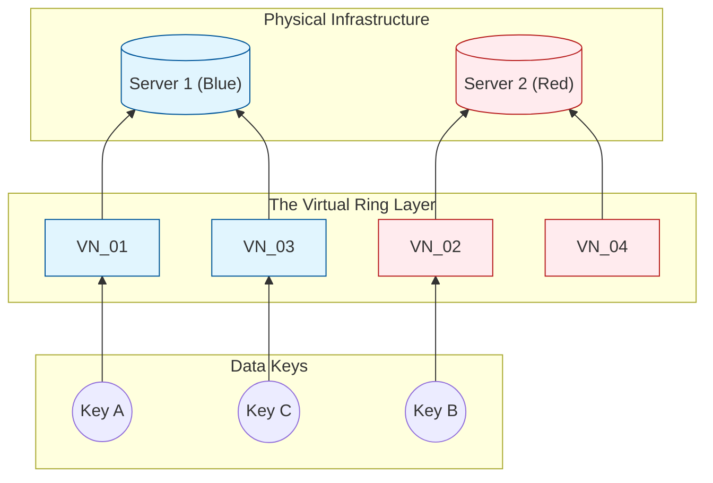
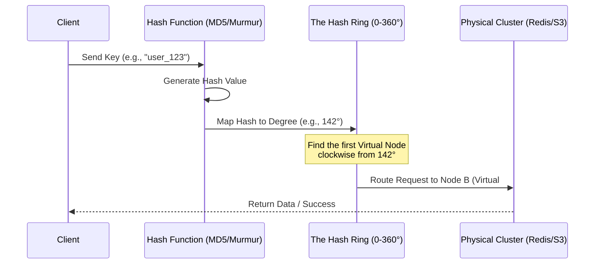
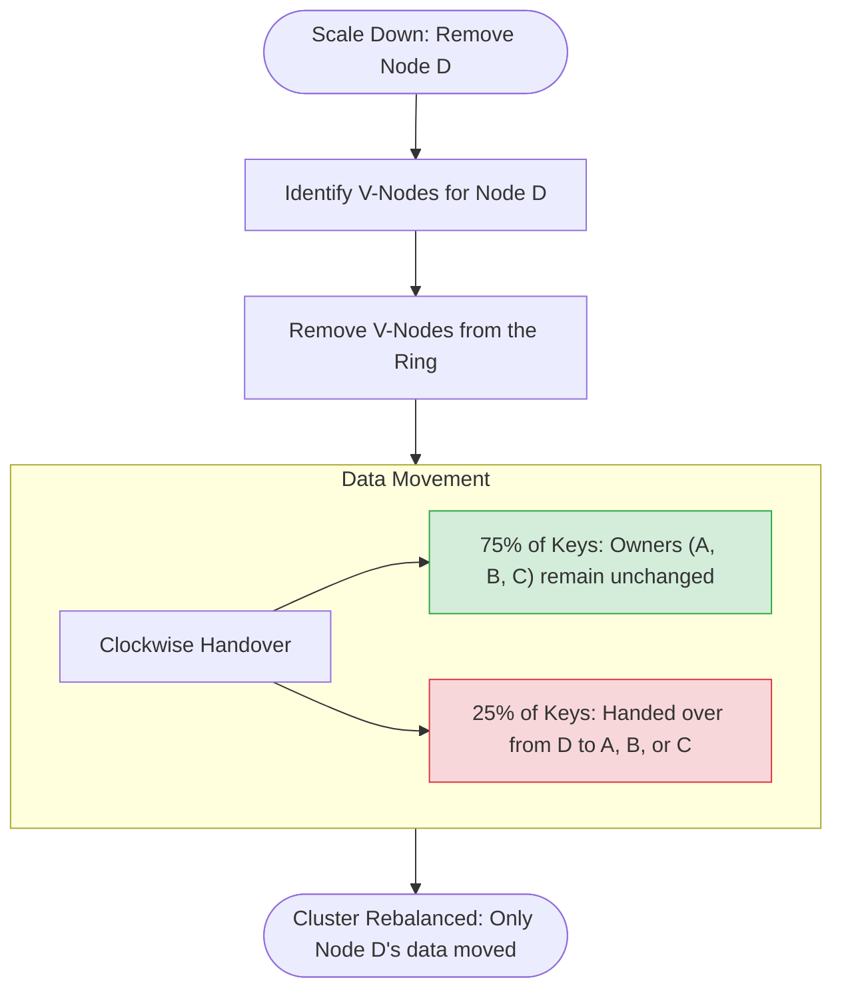
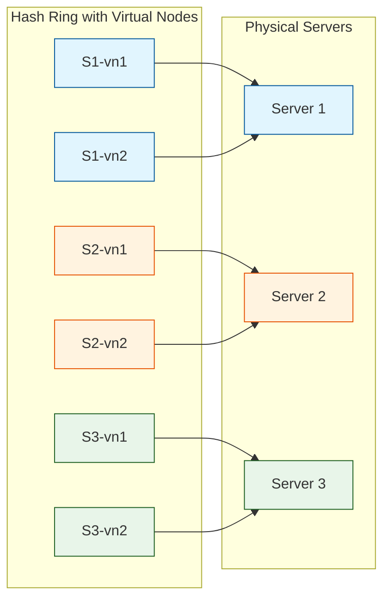
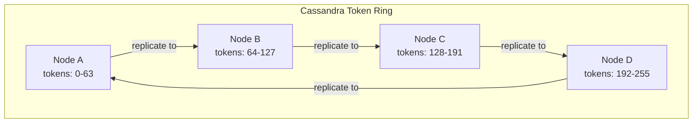

# Consistent Hashing
## Introduction  
In a **distributed system**, horizontal scaling is essential as data outgrows the capacity of a single machine. To manage this, data is partitioned across a cluster of nodes. Knowing exactly which node holds specific data—without relying on a slow, centralized lookup table—requires Hashing.  
Hashing acts as a deterministic GPS: given the same input, it always produces the same output, allowing any node to calculate a data location independently. However, traditional 'Modulo N' hashing (key mod n) is brittle. Because the formula depends on the total number of nodes (n), adding or removing a single server changes the mapping for nearly every key in the system. This triggers a data migration storm and massive cache misses, as the system struggles to re-allocate almost all existing data to new locations.



Sequence diagram: Request Routing lifecycle in a Consistent Hashing system


## Why Consistent Hashing?
#### The Core Problem
As described above, Consistent hashing solves the "rehash" problem. When a cluster changes size, only K/n keys need to be remapped (where K is the total keys and n is the number of nodes), preventing a system-wide "cache storm."

#### The Hash Ring (Logical Topology)
Imagine all possible hash values arranged in a fixed circle. For a 32-bit hash, the Hash Space ranges from 0 to 2<sup>32</sup>−1.
- **Placing Nodes**: Each server is hashed (by ID or IP) and placed at a specific coordinate on this ring.
- **Placing Keys**: Each data key is hashed using the same function and mapped onto the same ring.
- **The Lookup**: To find which server owns a key, you move clockwise from the key's position until you hit the first available server.

#### Handling Cluster Changes
Because mapping depends on relative positions, the impact of a change is localized:
- **Adding a Node**: A new node only "captures" keys located between itself and its immediate counter-clockwise neighbor. All other nodes remain unaffected.

- **Removing a Node**: If a node fails, its keys simply "slide" clockwise to the next available neighbor. Only the keys from the failed node are remapped.


#### Skewness (The problem of Hotspot)
In basic implementation, the nodes might not be distributed uniformly around the ring. This can lead to non-uniform distribution of keys where one server needs to handle 70% of traffic while others sit idle.
**Virtual Nodes**: To fix this issue, Virtual nodes are used. Instead of hashing one server once, we hash it multiple times. This places one server at multiple points on the ring which makes distribution more granular and balanced.

## Visualize Consisten Hashing in work
Apply below Kuberentes manifest in Kubernetes cluster.  
Change name, namespace as per need.
> [!NOTE]
> **Note:** More virtualnode, more uniforml distribution of key on servers.
```yaml
apiVersion: apps/v1
kind: Deployment
metadata:
  name: hashing-ui
  namespace: redis
spec:
  replicas: 1
  selector:
    matchLabels:
      app: hashing-ui
  template:
    metadata:
      labels:
        app: hashing-ui
    spec:
      containers:
      - name: visualizer
        image: sunnysaurabh/hashing-visualizer:v4
        ports:
        - containerPort: 8501
        resources:
          limits:
            memory: "256Mi"
            cpu: "500m"
---
apiVersion: v1
kind: Service
metadata:
  name: hashing-ui-service
  namespace: redis
spec:
  type: ClusterIP
  selector:
    app: hashing-ui
  ports:
  - port: 8501
    targetPort: 8501
```
Access UI:  
To access UI, please port-forward the server from above(after deployment)
```
kubectl port-forward -n redis svc/hashing-ui-service 8501:8501
```

## Virtual Nodes Deep Dive

As mentioned above, basic consistent hashing can lead to uneven load distribution. Virtual nodes (vnodes) solve this elegantly.

### How Virtual Nodes Work

Instead of placing each physical server at a single point on the ring, you create multiple "virtual" copies of each server. For example, with 150 vnodes per server, a 5-server cluster has 750 points on the ring. Each virtual node maps back to its physical server.



### Distribution Analysis

| Virtual Nodes per Server | Standard Deviation of Load | Key Movement on Node Add |
|--------------------------|---------------------------|-------------------------|
| 1 (no vnodes) | ~50% of mean | K/n keys (but uneven) |
| 10 | ~15% of mean | Close to K/n |
| 100 | ~5% of mean | Very close to K/n |
| 150+ | ~2-3% of mean | Practically ideal K/n |

> [!TIP]
> **Interview guidance:** 150-200 vnodes per physical server is the sweet spot used by production systems. Fewer gives uneven distribution; more wastes memory on the ring metadata.

### Heterogeneous Servers

Virtual nodes also let you assign more ring positions to more powerful servers. A server with 2x the capacity gets 2x the vnodes, so it naturally handles 2x the traffic — no separate weighting logic needed.

---

## Modular Hashing vs Consistent Hashing

Understanding the contrast is essential for explaining why consistent hashing matters.

### The Problem with Modular Hashing

With modular hashing (`server = hash(key) % N`), the mapping depends on the total count of servers. When N changes, nearly every key maps to a different server.

| Scenario | Modular Hashing (key % N) | Consistent Hashing |
|----------|--------------------------|-------------------|
| 3 servers, add 1 | **~75% of keys remapped** | ~25% of keys remapped (K/n) |
| 10 servers, remove 1 | **~90% of keys remapped** | ~10% of keys remapped |
| 100 servers, add 5 | **~95% of keys remapped** | ~5% of keys remapped |
| Cache impact | Massive cache storm, cold start | Minimal cache misses |
| Complexity | O(1) lookup | O(log n) lookup (binary search on ring) |

> [!WARNING]
> **The cache storm scenario:** With modular hashing on 100 cache servers, removing 1 server remaps ~99% of keys. Every remapped key is a cache miss, and all those requests hit your database simultaneously. This can cascade into a full system outage.

---

## Real-World Implementations

### Amazon DynamoDB

DynamoDB uses consistent hashing as the foundation of its partitioning strategy. Each table's data is distributed across partitions using a hash of the partition key. When DynamoDB splits a partition (due to throughput or storage limits), only the data in that partition's range is redistributed — other partitions are unaffected.

### Apache Cassandra

Cassandra assigns each node a set of token ranges on a consistent hash ring (using Murmur3 as the hash function). When a new node joins, it takes ownership of a portion of the ring from existing nodes. With vnodes enabled (default: 256 per node), the data movement during topology changes is evenly spread across all existing nodes rather than burdening a single neighbor.



With replication factor 3, each key is stored on its primary node plus the next 2 nodes clockwise on the ring.

### Redis Cluster

Redis Cluster divides the keyspace into 16,384 fixed hash slots. Each node owns a subset of slots. When resharding, Redis migrates individual slots between nodes — consistent hashing at the slot level ensures only the moved slots' keys are affected.

### Other Uses

- **Nginx** uses consistent hashing for upstream load balancing (the `hash` directive with `consistent` flag)
- **Akamai CDN** pioneered consistent hashing for deciding which edge server caches a given URL
- **Discord** uses consistent hashing to route users to specific gateway servers for WebSocket connections

---

## Where Consistent Hashing?

A summary of the most common interview scenarios:

- **Distributed Cache (Memcached/Redis):** The most frequent use case. Thousands of cache servers need to know which server holds a given key without a central lookup.
- **Distributed Storage & NoSQL (DynamoDB/Cassandra):** Data partitioning across nodes where cluster membership changes frequently.
- **Stateful Load Balancing (Sticky Sessions):** Online multiplayer games or real-time chat (Discord) where users need to stay connected to the same server.
- **Content Delivery Networks (CDNs):** Deciding which edge server should cache a specific file.
- **Distributed Rate Limiting:** Routing rate-limit checks to the correct counter server based on client ID.

---

## Interview Cheat Sheet

| Question | Key Points |
|----------|-----------|
| What problem does consistent hashing solve? | Minimizes key remapping when nodes are added/removed. Only K/n keys move instead of nearly all. |
| How does the hash ring work? | Hash both servers and keys to a ring. Keys map to the first server found clockwise. |
| What are virtual nodes? | Multiple ring positions per physical server for even load distribution. 150-200 vnodes is typical. |
| How does it handle heterogeneous servers? | More powerful servers get more virtual nodes, proportional to capacity. |
| What's the lookup complexity? | O(log n) using binary search on sorted ring positions. |
| When would you NOT use it? | Small, fixed-size clusters where modular hashing is simpler and remapping cost is negligible. |
| Name 3 real systems that use it. | DynamoDB (partitioning), Cassandra (token ring), Redis Cluster (hash slots). |
| How does replication work with it? | Replicate each key to the next N-1 nodes clockwise on the ring. |
