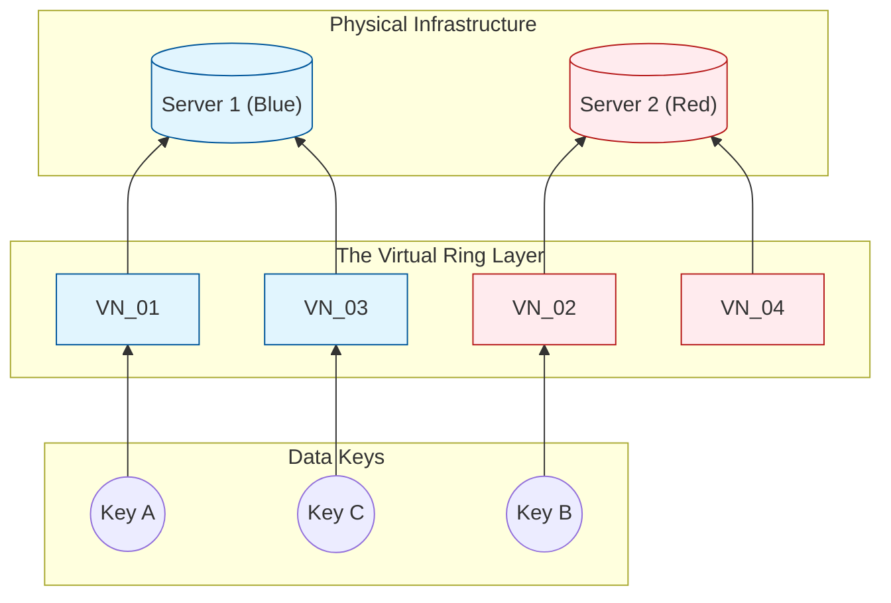
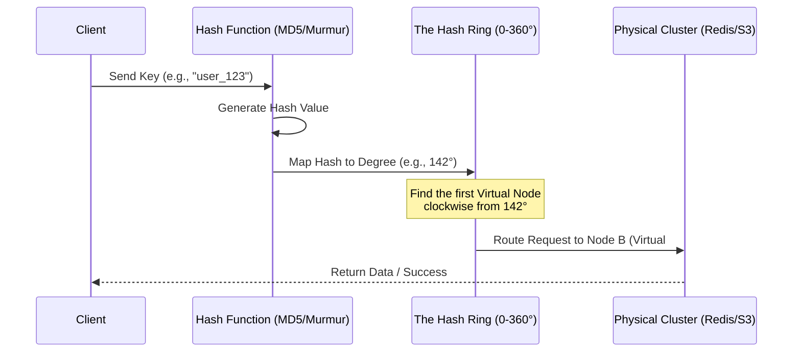
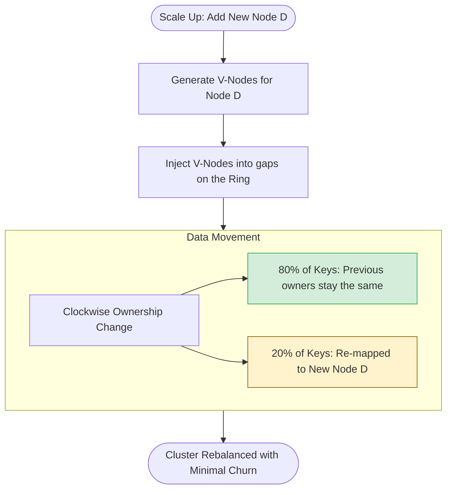

# Consistent Hashing
## Introduction  
In a **distributed system**, horizontal scaling is essential as data outgrows the capacity of a single machine. To manage this, data is partitioned across a cluster of nodes. Knowing exactly which node holds specific data—without relying on a slow, centralized lookup table—requires Hashing.  
Hashing acts as a deterministic GPS: given the same input, it always produces the same output, allowing any node to calculate a data location independently. However, traditional 'Modulo N' hashing (key mod n) is brittle. Because the formula depends on the total number of nodes (n), adding or removing a single server changes the mapping for nearly every key in the system. This triggers a data migration storm and massive cache misses, as the system struggles to re-allocate almost all existing data to new locations.

Sequence diagram: Requect Routing lifecycle in a Consistent Hashing system

## Why Consistent Hashing?
#### The Core Problem
As described above, Consistent hashing solves the "rehash" problem. When a cluster changes size, only K/n keys need to be remapped (where K is the total keys and n is the number of nodes), preventing a system-wide "cache storm."

#### The Hash Ring (Logical Topology)
Imagine all possible hash values arranged in a fixed circle. For a 32-bit hash, the Hash Space ranges from 0 to 232−1.
- **Placing Nodes**: Each server is hashed (by ID or IP) and placed at a specific coordinate on this ring.
- **Placing Keys**: Each data key is hashed using the same function and mapped onto the same ring.
- **The Lookup**: To find which server owns a key, you move clockwise from the key's position until you hit the first available server.

#### Handling Cluster Changes
Because mapping depends on relative positions, the impact of a change is localized:
- **Adding a Node**: A new node only "captures" keys located between itself and its immediate counter-clockwise neighbor. All other nodes remain unaffected.

- **Removing a Node**: If a node fails, its keys simply "slide" clockwise to the next available neighbor. Only the keys from the failed node are remapped.

#### Skewness (The problem of Hotspot)
In basic implementation, the nodes might not be distributed uniformly around the ring. This can lead to non-uniform distribution of keys where one server needs to handle 70% of traffic while others sit idle.
**Virtual Nodes**: To fix this issue, Virtual nodes are used. Instead of hashing one server once, we hash it multiple times. This places one server at multiple points on the ring which makes distribution more granular and balanced.
