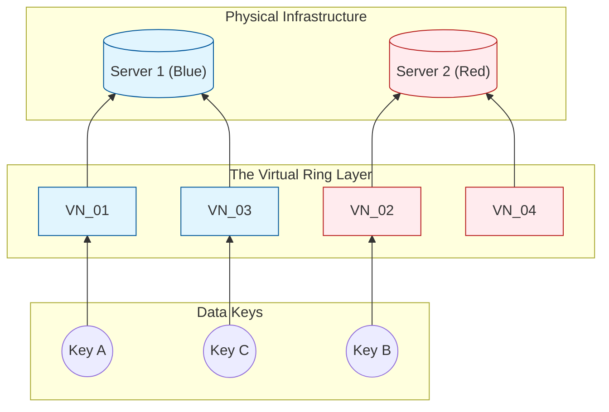
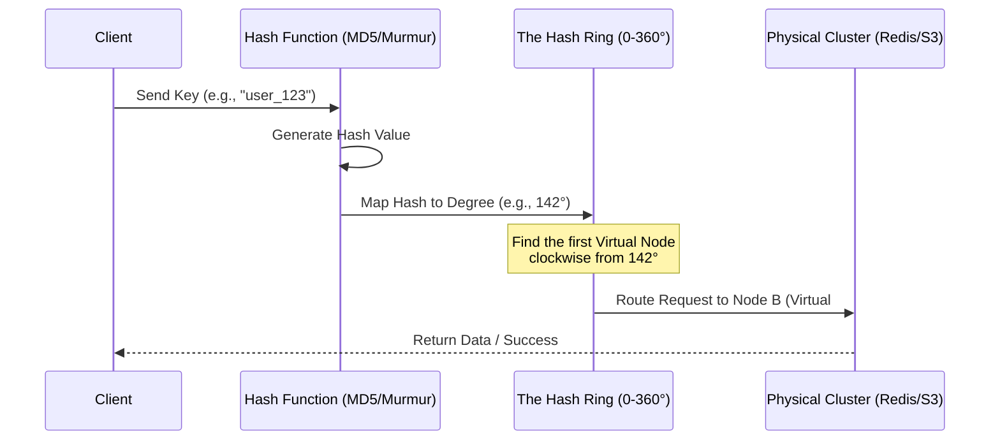

# Consistent Hashing
## Introduction  
In a **distributed system**, horizontal scaling is essential as data outgrows the capacity of a single machine. To manage this, data is partitioned across a cluster of nodes. Knowing exactly which node holds specific data—without relying on a slow, centralized lookup table—requires Hashing.  
Hashing acts as a deterministic GPS: given the same input, it always produces the same output, allowing any node to calculate a data location independently. However, traditional 'Modulo N' hashing (key mod n) is brittle. Because the formula depends on the total number of nodes (n), adding or removing a single server changes the mapping for nearly every key in the system. This triggers a data migration storm and massive cache misses, as the system struggles to re-allocate almost all existing data to new locations.

Sequence diagram: Requect Routing lifecycle in a Consistent Hashing system

