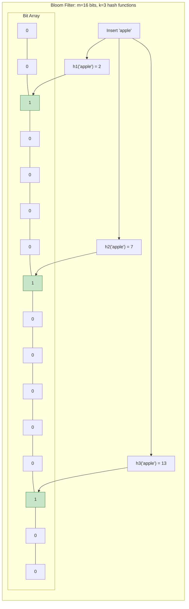
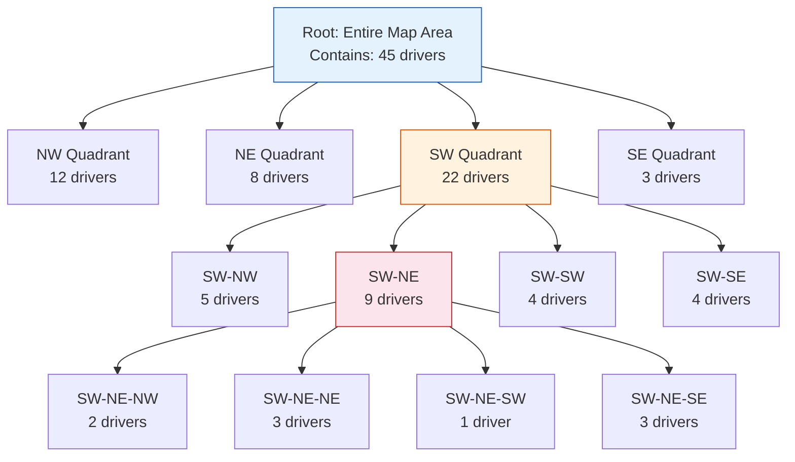

# Data Structures for System Design

## Introduction

System design interviews are not just about drawing boxes and arrows. The data structures underlying those boxes often determine whether a system can scale to millions of users or collapses under the weight of its own data. Most candidates know arrays, hash maps, and trees from coding interviews. Far fewer understand the probabilistic and specialized data structures that power real-world systems at scale.

This article covers the data structures that appear most frequently in system design discussions. These are not theoretical curiosities -- they are the building blocks of production systems at companies like Google, Facebook, Redis, and Uber. Understanding when and why to reach for each one will set you apart in interviews.

> [!NOTE]
> Several of these data structures trade exactness for efficiency. Bloom filters, HyperLogLog, and Count-Min Sketch all provide approximate answers using a fraction of the memory that exact solutions would require. Understanding this tradeoff -- and when it is acceptable -- is a key system design skill.

---

## Bloom Filters

A Bloom filter is a space-efficient probabilistic data structure that answers the question: "Is this element in the set?" It can tell you "definitely not in the set" or "probably in the set" -- but never gives a false negative.

### How It Works

A Bloom filter consists of:
- A bit array of `m` bits, all initialized to 0
- `k` independent hash functions, each mapping an element to one of the `m` bit positions

**Insertion:**
1. Take the element and compute `k` hash values
2. Set the bit at each of the `k` positions to 1

**Lookup:**
1. Take the query element and compute the same `k` hash values
2. Check the bit at each of the `k` positions
3. If ALL bits are 1, the element is "probably in the set"
4. If ANY bit is 0, the element is "definitely not in the set"



### Why No False Negatives

If an element was inserted, all `k` bits corresponding to its hash values were set to 1. During lookup, all `k` bits will still be 1 (bits are never reset to 0 in a standard Bloom filter). Therefore, an inserted element will never be reported as absent.

### Why False Positives Occur

Different elements can hash to the same bit positions. Over time, as more elements are inserted, more bits are set to 1. A query element might find all `k` of its bit positions already set to 1 by other elements, even though it was never inserted itself.

### False Positive Rate

The false positive probability is approximately:

```
p = (1 - e^(-kn/m))^k
```

Where:
- `m` = number of bits in the array
- `k` = number of hash functions
- `n` = number of elements inserted

**Practical sizing:**

| Elements (n) | Bits (m) | Hash Functions (k) | False Positive Rate |
|--------------|----------|-------------------|-------------------|
| 1 million | 9.6 MB | 7 | 1% |
| 1 million | 14.4 MB | 10 | 0.1% |
| 10 million | 96 MB | 7 | 1% |
| 100 million | 960 MB | 7 | 1% |

Compare this to storing 100 million URLs (average 50 bytes each) in a hash set: approximately 5 GB plus overhead. A Bloom filter with 1% false positive rate uses under 1 GB for the same task.

### Use Cases in System Design

| Use Case | How It Helps |
|----------|-------------|
| Web crawler: "Have we crawled this URL?" | Avoid re-crawling billions of URLs. False positive means skipping a URL (minor loss). False negative would mean crawling twice. |
| Cache: "Is this key in the cache?" | Check the Bloom filter before querying the cache server. Avoids cache misses hitting the database for keys that were never cached. |
| Database: "Might this SSTable contain this key?" | LSM-tree databases (Cassandra, LevelDB) use Bloom filters on each SSTable to skip files that definitely don't contain a key. |
| Spam filter: "Have we seen this email before?" | Check against a set of known spam signatures. |
| Weak password check: "Is this password in our breached passwords list?" | Check against billions of known breached passwords without storing them all. |

> [!TIP]
> In interviews, Bloom filters are the answer whenever you hear "check if something exists in a very large set" and approximate answers are acceptable. The key phrase is: "We can use a Bloom filter to avoid unnecessary lookups -- it has no false negatives, so if it says 'not present,' we can trust it completely."

---

## HyperLogLog

HyperLogLog (HLL) is a probabilistic data structure for estimating the cardinality (count of distinct elements) of a set. It can count billions of unique items using only about 12 KB of memory.

### The Core Insight

Consider hashing elements to binary strings. For a random hash, the probability of seeing a binary string that starts with `n` leading zeros is `1/2^n`. If you observe a hash starting with 5 leading zeros, you likely hashed about `2^5 = 32` distinct elements.

This is the intuition behind HyperLogLog: track the maximum number of leading zeros seen across all hashed elements, and use that to estimate the cardinality.

### How It Works

1. **Hash each element** to a fixed-length binary string
2. **Divide elements into buckets** using the first few bits of the hash (e.g., first 14 bits = 16,384 buckets)
3. **For each bucket**, track the maximum number of leading zeros in the remaining bits
4. **Estimate cardinality** by computing the harmonic mean of the estimates from all buckets

Using multiple buckets (instead of a single counter) dramatically reduces variance. With 16,384 buckets, HyperLogLog achieves a standard error of about 0.81%.

### Memory Usage

- 16,384 buckets x 6 bits per bucket = 12 KB
- This is constant regardless of the actual cardinality
- You can count billions of unique elements with 12 KB

### Redis Implementation

Redis provides native HyperLogLog support:

```
PFADD visitors "user_123"    # Add element
PFADD visitors "user_456"    # Add another
PFCOUNT visitors             # Get approximate count: 2
PFMERGE total visitors_us visitors_eu  # Merge multiple HLLs
```

**Key property:** HyperLogLogs can be merged. If you track unique visitors per region, you can merge them to get global unique visitors without double-counting users who visited from multiple regions.

### Use Cases

| Use Case | Why HLL |
|----------|---------|
| Unique website visitors per day | Exact count would require storing all visitor IDs. HLL uses 12 KB. |
| Unique search queries | Counting distinct queries across billions of searches |
| Unique IP addresses | Network security: how many distinct IPs contacted a server |
| Social media: unique post viewers | Count distinct viewers of a viral post without storing all viewer IDs |

> [!IMPORTANT]
> HyperLogLog cannot tell you which elements are in the set -- only how many distinct elements there are. If you need to check membership, use a Bloom filter. If you need to count distinct elements, use HyperLogLog. They solve different problems.

---

## Count-Min Sketch

A Count-Min Sketch estimates the frequency of elements in a stream. Given an element, it answers "approximately how many times has this element appeared?" using sub-linear space.

### How It Works

A Count-Min Sketch consists of:
- A 2D array with `d` rows and `w` columns, initialized to zeros
- `d` independent hash functions, one per row

**Adding an element:**
1. For each row `i`, compute `h_i(element) mod w` to get a column index
2. Increment the counter at position `[i, column_index]`

**Querying frequency:**
1. For each row `i`, compute the same hash to get the column index
2. Read the counter at position `[i, column_index]`
3. Return the MINIMUM of all `d` counters

**Why minimum?** Hash collisions cause counters to be over-counted (other elements hash to the same position and inflate the count). Taking the minimum across all rows minimizes the impact of collisions, since it's unlikely that the same colliding elements appear in all rows.

### Properties

- **Over-estimates only:** The sketch never under-counts an element's frequency. The true count is always less than or equal to the estimate.
- **No deletions:** Standard Count-Min Sketch doesn't support removing elements (though Count-Min-Log variants do)
- **Mergeable:** Two sketches with the same dimensions can be merged by adding corresponding counters

### Use Cases

| Use Case | Description |
|----------|-------------|
| Heavy hitters / Top-K | Find the most frequently accessed items (popular products, trending hashtags) |
| Network traffic analysis | Identify IP addresses generating the most traffic |
| Database query optimization | Track query frequency to decide what to cache |
| Advertising: click counting | Count clicks per ad across billions of events |
| Rate limiting | Track per-user request counts without storing a counter per user |

> [!TIP]
> Count-Min Sketch is your answer when an interviewer asks about "finding the top K items in a stream" or "tracking frequency of events." Pair it with a min-heap of size K: for each element, query the sketch for its estimated frequency, and maintain a heap of the K highest frequencies.

---

## Geohashing

Geohashing encodes a geographic coordinate (latitude, longitude) into a short string that represents a rectangular area on the Earth's surface. It is the backbone of location-based search in system design.

### How It Works

1. Start with the entire world: latitude [-90, 90], longitude [-180, 180]
2. Divide longitude range in half. If the longitude falls in the left half, append '0'. If right, append '1'.
3. Divide latitude range in half. Same logic.
4. Alternate between longitude and latitude bits
5. Each additional bit doubles the precision (halves the area)
6. Convert the binary string to Base32 for a human-readable geohash

**Example:** The coordinate (37.7749, -122.4194) -- San Francisco -- encodes to the geohash `9q8yyk`.

### Precision Levels

| Geohash Length | Cell Dimensions | Use Case |
|---------------|----------------|----------|
| 1 | ~5000 km x 5000 km | Continental |
| 3 | ~156 km x 156 km | Region / State |
| 5 | ~4.9 km x 4.9 km | City neighborhood |
| 6 | ~1.2 km x 0.6 km | Several city blocks |
| 7 | ~153 m x 153 m | Street level |
| 8 | ~38 m x 19 m | Building level |
| 9 | ~4.8 m x 4.8 m | Room level |

### Key Property: Prefix Sharing

Points that are geographically close share a common prefix. All locations in downtown San Francisco might start with `9q8yy`. This enables:

- **Proximity search via prefix query:** To find all restaurants near a location, compute the geohash and search for entries sharing the same prefix using a database index
- **Efficient storage:** Store geohashes as strings in any database and use prefix queries (LIKE '9q8yy%' or range scans)
- **Sharding by prefix:** Distribute location data across shards based on geohash prefixes

### Edge Cases and Limitations

**Boundary problem:** Two points can be physically adjacent but have completely different geohashes if they fall on opposite sides of a cell boundary. To handle this, always search the target cell AND its 8 neighboring cells.

**Non-uniform cell sizes:** Geohash cells are not equal area -- they are taller near the equator and shorter near the poles. This is usually acceptable for practical applications.

> [!NOTE]
> Geohashing is not the only approach to spatial indexing. Quadtrees (covered next) and S2 geometry (used by Google) are alternatives. Geohashing's strength is simplicity: it works with any database that supports string indexing and range queries. Quadtrees offer better precision for point queries. S2 provides uniform cell sizes on a sphere.

---

## Quadtrees

A quadtree is a tree data structure that recursively divides a 2D space into four quadrants. It is used for efficient spatial queries, most famously for finding nearby points (like drivers in a ride-sharing app).

### How It Works



1. Start with the entire geographic area as the root node
2. Set a capacity threshold (e.g., max 10 points per cell)
3. When a cell exceeds the threshold, split it into four equal quadrants
4. Recursively split any child that exceeds the threshold
5. Leaf nodes contain the actual point data

### Types of Quadtrees

| Type | Description | Use Case |
|------|-------------|----------|
| Point quadtree | Each node stores a single point, children represent quadrants around that point | Exact point location |
| Region quadtree | Regular subdivision of space, points stored in leaves | Area-based queries |
| PR quadtree (Point-Region) | Hybrid: region subdivision, but with a bucket capacity per leaf | Most common for spatial search |

### How Uber Uses Quadtrees

When a rider requests a ride, the system needs to find the nearest available drivers:

1. The quadtree covers the service area (a city)
2. Each leaf node contains a list of driver locations (updated as drivers move)
3. When a rider requests a ride at location (lat, lng):
   - Traverse the tree to find the leaf containing the rider's location
   - Search that leaf for nearby drivers
   - If not enough drivers, expand to neighboring cells (parent's siblings)
   - Return the K nearest drivers

**Dynamic updates:** Drivers send location updates every few seconds. The quadtree must handle frequent insertions and deletions as drivers move between cells.

### Quadtree vs Geohash

| Factor | Quadtree | Geohash |
|--------|----------|---------|
| Precision | Adaptive (denser areas get finer subdivision) | Fixed precision per string length |
| Implementation | Custom tree structure, in-memory | Simple string, works with any DB |
| Dynamic data | Good (insert/delete in O(log n)) | Requires re-indexing |
| Range queries | Natural tree traversal | Prefix-based range scan |
| Distribution | Better for non-uniform distributions | Simpler for uniform data |

> [!TIP]
> In interviews for ride-sharing or delivery systems, quadtrees are the expected data structure for "find nearby drivers/restaurants." Mention that the quadtree adapts to density: a busy downtown area gets subdivided into many small cells, while a rural area stays as one large cell. This adaptive precision is the key advantage over fixed-precision geohashes.

---

## Tries (Prefix Trees)

A trie (pronounced "try") is a tree data structure where each node represents a single character, and paths from root to leaf spell out stored strings. Tries excel at prefix-based operations.

### Structure

Each node in a trie contains:
- A character (or is implicitly defined by the edge from its parent)
- A flag indicating whether this node marks the end of a complete word
- Child pointers (typically a hash map or array of size 26 for lowercase English)

**Example trie containing: "cat", "car", "card", "care", "do", "dog"**

```
        root
       /    \
      c      d
      |      |
      a      o
     / \      \
    t   r      g
       / \
      d   e
```

### Operations and Time Complexity

| Operation | Time Complexity | Description |
|-----------|----------------|-------------|
| Insert | O(L) | L = length of the string |
| Search | O(L) | Check if exact string exists |
| Prefix search | O(P + K) | P = prefix length, K = number of results |
| Delete | O(L) | Remove a string |

### Use Cases in System Design

**Autocomplete / Typeahead:**
As the user types each character, traverse the trie to the current prefix node and return all words in that subtree. This is O(prefix_length) to find the node, then a bounded traversal for suggestions.

For production autocomplete, each node also stores:
- Frequency/popularity score (to rank suggestions)
- Top-K cached suggestions (precomputed for common prefixes)

**IP Routing (Longest Prefix Match):**
Routers use tries to find the most specific matching route for an IP address. Each node represents a bit of the IP address, and the longest matching prefix determines the routing decision.

**Spell Checkers:**
Store a dictionary in a trie. For a misspelled word, find the closest matches by traversing the trie with edit distance tolerance.

> [!NOTE]
> In practice, compressed tries (radix trees or Patricia tries) are preferred. They collapse single-child chains into single nodes, dramatically reducing memory usage. For example, if no other word starts with "ca" except "cat", "car", "card", "care", the "c" and "a" nodes are merged into a single "ca" node.

---

## Skip Lists

A skip list is a probabilistic data structure that provides O(log n) search, insert, and delete operations -- similar to a balanced binary search tree -- but with a much simpler implementation.

### How It Works

A skip list starts with a sorted linked list (the base level). Additional levels are added probabilistically: each element has a 50% chance of being "promoted" to the next level. Higher levels act as express lanes for faster traversal.

```
Level 3:  HEAD ---------------------------------> 50 ---------> NIL
Level 2:  HEAD --------> 20 --------------------> 50 ---------> NIL
Level 1:  HEAD --------> 20 --------> 35 -------> 50 --> 60 --> NIL
Level 0:  HEAD -> 10 --> 20 --> 25 --> 35 --> 42 -> 50 --> 60 --> NIL
```

**Search for 35:**
1. Start at Level 3, HEAD. Next is 50 (too big). Drop to Level 2.
2. At Level 2, HEAD. Next is 20 (less than 35, advance). Next is 50 (too big). Drop to Level 1.
3. At Level 1, at 20. Next is 35 (found!).

Total comparisons: 4 instead of 5 (linear scan of base level).

### Why Redis Uses Skip Lists

Redis sorted sets (ZSET) use skip lists internally instead of balanced BSTs. The reasons:

| Factor | Skip List | Balanced BST (e.g., Red-Black Tree) |
|--------|----------|--------------------------------------|
| Implementation | Simple (linked list + randomization) | Complex (rotation logic) |
| Range queries | Natural (follow forward pointers) | Requires in-order traversal |
| Concurrency | Lock-free variants are simpler | Lock-free BSTs are very complex |
| Memory | Slightly more (extra pointers per level) | Slightly less |
| Constant factors | Better in practice for Redis workloads | Comparable |

### Operations

| Operation | Average | Worst Case |
|-----------|---------|------------|
| Search | O(log n) | O(n) (very unlikely) |
| Insert | O(log n) | O(n) |
| Delete | O(log n) | O(n) |
| Range query | O(log n + k) | k = number of results |

> [!TIP]
> Skip lists appear in interviews when discussing Redis sorted sets or when someone asks "how would you implement an ordered data structure without a tree?" The key selling point is simplicity: skip lists achieve the same time complexity as balanced BSTs with far simpler code.

---

## Merkle Trees

A Merkle tree is a hash tree where every leaf node contains a hash of a data block, and every non-leaf node contains a hash of its children's hashes. It provides efficient, cryptographically secure verification of data integrity.

### How It Works

```
            Root Hash
           H(H12 + H34)
          /             \
      H12                H34
    H(H1+H2)          H(H3+H4)
    /      \           /      \
  H1       H2       H3       H4
 hash(D1) hash(D2) hash(D3) hash(D4)
  |         |        |        |
 Data1    Data2    Data3    Data4
```

**Verification:** If any data block changes, its leaf hash changes, which propagates up, changing all ancestor hashes up to the root. By comparing root hashes, you can instantly determine whether two copies of the data are identical.

**Efficient difference detection:** If root hashes differ, recursively compare children. You can identify exactly which data blocks differ in O(log n) comparisons instead of comparing every block.

### Use Cases

**BitTorrent:**
When downloading a file, the file is split into blocks. The Merkle tree root hash is known in advance (from the torrent file). As each block is downloaded, its hash is verified against the tree. If a block is corrupted or tampered with, the hash mismatch is detected immediately, and only that block needs to be re-downloaded.

**Blockchain:**
Each block in a blockchain contains a Merkle root of all transactions in that block. This allows lightweight clients (SPV -- Simplified Payment Verification) to verify that a specific transaction is included in a block without downloading all transactions. They only need the Merkle proof path (O(log n) hashes).

**Amazon Dynamo (Anti-Entropy):**
Dynamo uses Merkle trees to synchronize replicas. Each replica builds a Merkle tree over its data. Replicas compare root hashes:
- If roots match, replicas are in sync
- If roots differ, they compare subtrees to identify exactly which key ranges have diverged
- Only the divergent data is transferred

This is dramatically more efficient than comparing every key-value pair across replicas.

**Git:**
Git uses Merkle trees (via its object model) to track file changes. Each commit points to a tree object whose hash depends on the hashes of all contained files. Changing any file changes the tree hash, enabling efficient difference detection.

> [!IMPORTANT]
> Merkle trees are the standard answer to "how do you efficiently detect differences between replicas in a distributed database?" If an interviewer asks about anti-entropy or replica synchronization, Merkle trees should be your go-to data structure.

---

## Consistent Hashing (Brief)

Consistent hashing distributes data across nodes such that adding or removing a node only affects a small fraction of keys. It is essential for distributed caches, databases, and any sharded system.

The core idea: arrange all possible hash values in a ring. Place nodes on the ring. Each key maps to the first node clockwise from its hash position. When a node is added or removed, only the keys between the affected node and its predecessor need to move.

Virtual nodes (multiple positions per physical node) solve the load balancing problem that arises with few nodes on the ring.

For a comprehensive treatment, see the [Consistent Hashing](consistent-hashing.html) article.

---

## LSM Trees (Brief)

Log-Structured Merge Trees are the write-optimized data structure underlying databases like Cassandra, RocksDB, LevelDB, and HBase.

The core idea: writes go to an in-memory buffer (memtable). When the buffer fills, it is flushed to disk as a sorted, immutable file (SSTable). Background compaction merges SSTables to reduce read amplification. Bloom filters on each SSTable prevent unnecessary disk reads.

LSM trees trade read performance for write performance, making them ideal for write-heavy workloads.

For a comprehensive treatment, see the databases article.

---

## When to Use Each Data Structure

This decision table summarizes when to reach for each data structure in a system design interview.

| Problem | Data Structure | Why |
|---------|---------------|-----|
| "Check if X exists in a huge set" | Bloom Filter | O(1) membership test, tiny memory, no false negatives |
| "Count distinct elements" | HyperLogLog | 12 KB for billions of uniques, mergeable across nodes |
| "Find most frequent items in a stream" | Count-Min Sketch | Sub-linear space frequency estimation |
| "Find nearby locations" | Geohash or Quadtree | Geohash for simplicity with any DB; quadtree for adaptive precision |
| "Autocomplete / prefix search" | Trie (Prefix Tree) | O(prefix_length) lookup, natural prefix enumeration |
| "Ordered set with range queries" | Skip List | O(log n) operations, simpler than balanced BST |
| "Detect data differences between replicas" | Merkle Tree | O(log n) divergence detection, efficient sync |
| "Distribute data across nodes" | Consistent Hashing | Minimal data movement on node add/remove |
| "Write-heavy database storage" | LSM Tree | Sequential writes, high write throughput |
| "Approximate: is X in the set?" | Bloom Filter | Cannot tell you "what" is in the set, only "probably yes/definitely no" |
| "Approximate: how many unique Xs?" | HyperLogLog | Cannot list the elements, only count them |
| "Approximate: how often does X appear?" | Count-Min Sketch | Over-estimates only, never under-counts |

> [!TIP]
> When an interviewer presents a scale challenge, pause and think about whether an approximate solution is acceptable. Counting exact unique visitors across 1 billion pageviews requires terabytes. HyperLogLog does it in 12 KB with 0.81% error. For most business purposes, that approximation is more than good enough, and saying so demonstrates engineering maturity.

---

## Combining Data Structures in Real Systems

In practice, these data structures are rarely used in isolation. Real systems combine them to solve complex problems.

### Example: Web Crawler

A web crawler that indexes billions of pages uses multiple data structures together:

| Component | Data Structure | Purpose |
|-----------|---------------|---------|
| URL deduplication | Bloom Filter | Quickly check if a URL was already crawled without storing all URLs |
| Unique page count | HyperLogLog | Track how many distinct pages have been indexed |
| Priority queue | Skip List or Heap | Order URLs by priority for crawling |
| Content fingerprinting | Merkle Tree (SimHash variant) | Detect near-duplicate pages |
| Domain frequency | Count-Min Sketch | Track crawl rate per domain to respect rate limits |

### Example: Ride-Sharing Platform

A ride-sharing system like Uber combines spatial data structures:

1. **Quadtree** for driver location indexing -- find the nearest available drivers
2. **Geohash** for persistent storage -- store ride history with location-searchable indexes
3. **Bloom filter** for promo code validation -- quickly reject invalid promo codes without database lookup
4. **Count-Min Sketch** for surge detection -- track request frequency per geographic cell to detect demand spikes
5. **Consistent hashing** for distributing location data -- partition driver location updates across servers by city/region

### Example: Social Media Feed

A social media platform uses:

1. **Trie** for typeahead search -- autocomplete usernames and hashtags
2. **HyperLogLog** for post view counts -- approximate unique viewer counts (shown as "~1.2M views")
3. **Bloom filter** for "already seen" detection -- prevent showing the same post twice in a user's feed
4. **Count-Min Sketch** for trending topics -- identify the most frequently mentioned hashtags in real time
5. **Skip list** (Redis sorted sets) for leaderboards and feed ranking -- maintain sorted scores

### Memory Comparison at Scale

To appreciate why probabilistic data structures matter, consider tracking 1 billion unique items:

| Approach | Memory Required | Accuracy |
|----------|----------------|----------|
| HashSet (exact) | ~40-80 GB | 100% |
| Bloom Filter (membership) | ~1.2 GB (1% FPR) | No false negatives |
| HyperLogLog (cardinality) | 12 KB | 0.81% standard error |
| Count-Min Sketch (frequency) | ~40 MB (with good accuracy) | Over-estimates only |

The difference is staggering. At internet scale, exact data structures simply cannot fit in memory, and probabilistic alternatives are not just nice-to-haves -- they are necessities.

> [!WARNING]
> Probabilistic data structures have important limitations beyond accuracy. Most cannot delete elements (standard Bloom filters, HyperLogLog). They cannot enumerate their contents (you can't list all elements in a Bloom filter). And their error characteristics must be understood: Bloom filters have false positives, Count-Min Sketch over-estimates, and HyperLogLog has a standard error. Choose them when these limitations are acceptable for your use case.

---

## Comparison: Exact vs Probabilistic

| Property | Exact (HashSet, TreeMap) | Probabilistic (Bloom, HLL, CMS) |
|----------|------------------------|----------------------------------|
| Memory | O(n) -- grows with data size | O(1) or O(epsilon) -- constant or sub-linear |
| Accuracy | 100% correct | Small, bounded error rate |
| Deletions | Supported | Usually not (except counting variants) |
| Mergeability | Expensive (union of sets) | Cheap (bitwise OR, counter addition) |
| Scale | Limited by memory | Works at any scale |
| Use when | Correctness is mandatory | Approximate is good enough, scale is huge |

---

## Interview Cheat Sheet

| Data Structure | One-Liner | Typical Interview Signal |
|---------------|-----------|------------------------|
| Bloom Filter | Probabilistic set membership: no false negatives | "Check if URL was crawled", "cache key existence" |
| HyperLogLog | Cardinality estimation in constant space | "Count unique visitors", "distinct elements" |
| Count-Min Sketch | Frequency estimation in sub-linear space | "Top-K items", "heavy hitters", "trending" |
| Geohash | Encode lat/lng as string, prefix = proximity | "Find nearby", location search with SQL database |
| Quadtree | Adaptive spatial partitioning | "Find nearest drivers", ride-sharing, delivery |
| Trie | Character-by-character tree, prefix operations | "Autocomplete", "typeahead", "spell check" |
| Skip List | Probabilistic balanced linked list | "Redis sorted sets", "ordered data structure" |
| Merkle Tree | Hash tree for integrity and diff detection | "Replica sync", "anti-entropy", "data verification" |
| Consistent Hashing | Hash ring for distributed data placement | "Shard data", "distributed cache" |
| LSM Tree | Write-optimized storage with background compaction | "Write-heavy workload", "time-series database" |

**Key interview phrases:**
- "We can use a Bloom filter as a first check to avoid hitting the database for keys that definitely don't exist."
- "For counting unique visitors, HyperLogLog gives us 0.81% error in 12 KB -- we don't need exact counts for this use case."
- "To find the top-K trending topics, I'd use a Count-Min Sketch paired with a min-heap."
- "For proximity search, I'd geohash the locations and use prefix queries on a standard database index. For adaptive precision in dense areas, a quadtree is better."
- "To sync replicas efficiently, we compare Merkle tree roots -- if they match, the replicas are identical. If not, we walk the tree to find exactly which keys diverged."
- "The trie gives us O(prefix_length) autocomplete lookups, and we can precompute the top-K suggestions at each node for instant results."
