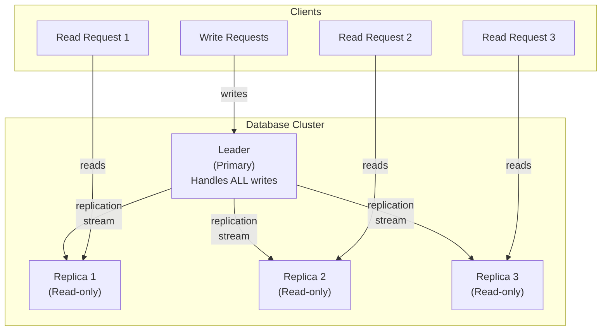
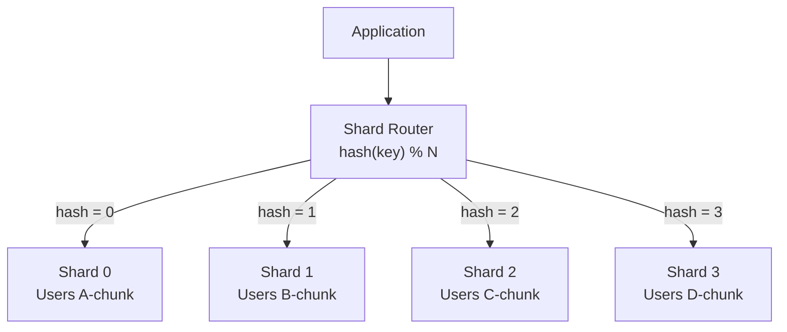
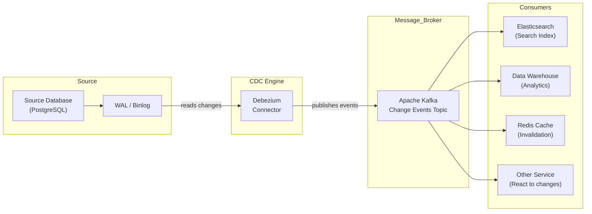

# Database Scaling -- Complete System Design Reference
### Staff Engineer Interview Preparation Guide

> [!TIP]
> **Why database scaling matters in interviews:** "How would you handle 10x growth?" is one of the most common follow-up questions in system design interviews. The answer always involves database scaling. Interviewers expect you to reason about replication, sharding, and partitioning tradeoffs -- not just name-drop technologies.

---

## Table of Contents

1. [Vertical vs Horizontal Scaling](#1-vertical-vs-horizontal-scaling)
2. [Replication Patterns](#2-replication-patterns)
3. [Synchronous vs Asynchronous Replication](#3-synchronous-vs-asynchronous-replication)
4. [Sharding Strategies](#4-sharding-strategies)
5. [Shard Key Selection](#5-shard-key-selection)
6. [Cross-Shard Queries and Joins](#6-cross-shard-queries-and-joins)
7. [Database Federation](#7-database-federation)
8. [Read Replicas and Write Replicas](#8-read-replicas-and-write-replicas)
9. [Connection Pooling](#9-connection-pooling)
10. [Horizontal vs Vertical Partitioning](#10-horizontal-vs-vertical-partitioning)
11. [SQL Tuning Basics](#11-sql-tuning-basics)
12. [Change Data Capture (CDC)](#12-change-data-capture-cdc)
13. [Interview Cheat Sheet](#13-interview-cheat-sheet)

---

## 1. Vertical vs Horizontal Scaling

When a single database server cannot handle the load, you have two fundamental choices: make the machine bigger (vertical) or add more machines (horizontal).

### Vertical Scaling (Scale Up)

Upgrade the hardware of your existing server: more CPU cores, more RAM, faster SSDs, better network cards.

**Example progression:**
```
Stage 1: 4 cores,  16 GB RAM,  500 GB SSD    ($200/month)
Stage 2: 16 cores, 64 GB RAM,  2 TB SSD      ($800/month)
Stage 3: 64 cores, 256 GB RAM, 8 TB NVMe     ($3,200/month)
Stage 4: 128 cores, 1 TB RAM,  32 TB NVMe    ($12,000/month)
... eventually, you hit the ceiling
```

| Pros | Cons |
|---|---|
| Simple -- no application changes needed | Hardware has an upper limit |
| No distributed system complexity | Single point of failure |
| Transactions work normally | Cost grows non-linearly (2x CPU is not 2x price -- it is 3-4x) |
| Strong consistency is easy | Downtime required for hardware upgrades |

### Horizontal Scaling (Scale Out)

Add more database servers and distribute data across them.

| Pros | Cons |
|---|---|
| Nearly unlimited scaling potential | Distributed system complexity (network failures, consistency) |
| No single point of failure (with proper replication) | Cross-node queries are expensive |
| Can use commodity hardware | Application must be aware of data distribution |
| Cost grows linearly | Distributed transactions are complex |

### The Practical Scaling Path

In interviews, the typical progression is:

1. **Start with a single database.** Optimize queries, add indexes.
2. **Vertical scale** when load increases. Bigger machine.
3. **Add read replicas** when reads are the bottleneck.
4. **Add caching** (Redis) to reduce database load.
5. **Shard** when a single machine cannot handle writes or store all data.
6. **Consider NewSQL** (CockroachDB, Spanner) if you need horizontal scaling with strong consistency.

> [!IMPORTANT]
> Always exhaust simpler options before sharding. Sharding adds permanent complexity to your application. Many companies run successfully on a single PostgreSQL instance with read replicas for years before needing to shard.

---

## 2. Replication Patterns

Replication means keeping copies of the same data on multiple servers. The primary goals are high availability (if one server dies, others continue serving), read scalability (distribute reads across replicas), and disaster recovery.

### Single-Leader (Master-Slave) Replication

One server (the leader/master) handles all writes. One or more servers (followers/slaves/replicas) receive a copy of every write and serve read queries.



**How it works:**
1. All writes go to the leader
2. The leader writes to its local storage and WAL
3. The WAL records are shipped to each replica
4. Replicas apply the WAL records to update their local copies
5. Reads can go to any replica (or the leader)

**Failover:** If the leader fails, one replica is promoted to become the new leader. This can be automatic (using a consensus protocol or a watchdog) or manual.

**Problems with failover:**
- **Data loss:** If using async replication, the new leader may be behind -- uncommitted writes on the old leader are lost.
- **Split brain:** If the old leader comes back and both think they are the leader, you get conflicting writes.
- **Replication lag:** Replicas may be seconds behind the leader, causing stale reads.

| Pros | Cons |
|---|---|
| Simple model -- one source of truth | Leader is a write bottleneck |
| Read scalability (add more replicas) | Failover is complex |
| Well-understood, battle-tested | Replication lag causes stale reads |
| Used by: PostgreSQL, MySQL, MongoDB | Single point of failure for writes |

### Multi-Leader (Master-Master) Replication

Multiple servers can accept writes. Each leader replicates its writes to all other leaders.

**When to use:**
- Multi-datacenter deployments (one leader per datacenter)
- Offline-capable applications (each device is a "leader")
- Collaborative editing (each user's changes are written to a local leader)

**The fundamental problem: write conflicts.**

If User A updates a record on Leader 1 and User B updates the same record on Leader 2 at the same time, the system must resolve the conflict.

**Conflict Resolution Strategies:**

| Strategy | How It Works | Tradeoff |
|---|---|---|
| **Last Write Wins (LWW)** | Use timestamps; latest write wins | Simple but can lose data silently |
| **Merge values** | Combine both changes | Only works for specific data types (e.g., CRDT counters) |
| **Custom resolution** | Application-specific logic (e.g., prompt user) | Most correct but most complex |
| **Conflict-free Replicated Data Types (CRDTs)** | Data structures that mathematically guarantee convergence | Limited to specific operations (counters, sets, maps) |

> [!WARNING]
> Multi-leader replication looks attractive but the conflict resolution complexity is enormous. Avoid it unless you have a genuine multi-datacenter requirement. Most systems are better served by single-leader replication with fast failover.

### Leaderless Replication

There is no leader. Any node can accept reads and writes. The client writes to multiple nodes simultaneously and reads from multiple nodes simultaneously.

**Quorum reads and writes:**

With N total replicas, W write nodes, and R read nodes:
- **W + R > N** guarantees that at least one read node has the latest write
- Common configuration: N=3, W=2, R=2

```
Write: Client sends write to all 3 replicas.
       Wait for 2 acknowledgments (W=2). 
       Write succeeds.

Read:  Client sends read to all 3 replicas.
       Wait for 2 responses (R=2).
       Return the value with the latest timestamp.
```

**Repair mechanisms:**
- **Read repair:** When a client reads from multiple replicas and detects a stale value, it writes the latest value back to the stale replica.
- **Anti-entropy process:** Background process that compares data across replicas and fixes inconsistencies.

**Used by:** Cassandra, DynamoDB, Riak.

| Pros | Cons |
|---|---|
| No single point of failure at all | Conflict resolution is required |
| High availability (survives multiple node failures) | Quorum operations are slower (wait for multiple nodes) |
| No failover needed | Harder to provide strong consistency |
| Good for multi-datacenter | Sloppy quorums can lead to stale reads |

> [!TIP]
> **Interview tip:** When discussing leaderless replication, always mention the quorum formula W + R > N. Then explain the tradeoff: if you set W=1, R=N, you get fast writes but slow reads. If you set W=N, R=1, you get slow writes but fast reads. The choice depends on your read/write ratio.

---

## 3. Synchronous vs Asynchronous Replication

### Synchronous Replication

The leader waits for the replica to confirm it has received and written the data before acknowledging the write to the client.

```
Client -> Leader: Write X=5
Leader -> Replica: Replicate X=5
Replica -> Leader: ACK (written to disk)
Leader -> Client: Write confirmed
```

**Guarantee:** If the leader crashes after acknowledging the write, the data is safe on the replica.

**Downside:** Every write is as slow as the slowest replica. If a replica is down or slow, writes are blocked.

### Asynchronous Replication

The leader acknowledges the write immediately after writing to its own storage. Replication happens in the background.

```
Client -> Leader: Write X=5
Leader -> Client: Write confirmed (immediately)
Leader -> Replica: Replicate X=5 (background, later)
```

**Guarantee:** Fast writes. But if the leader crashes before replicating, the data is lost.

**Downside:** Replication lag means replicas may serve stale data.

### Semi-Synchronous Replication

A compromise. The leader waits for at least one replica to confirm before acknowledging. The remaining replicas are asynchronous.

```
Client -> Leader: Write X=5
Leader -> Replica 1: Replicate X=5 (synchronous)
Leader -> Replica 2: Replicate X=5 (asynchronous)
Replica 1 -> Leader: ACK
Leader -> Client: Write confirmed
```

**This is the most common production setup.** PostgreSQL calls this "synchronous_standby_names" -- you configure which replicas must be synchronous.

### Comparison

| Aspect | Synchronous | Asynchronous | Semi-Synchronous |
|---|---|---|---|
| Write latency | Highest | Lowest | Medium |
| Data loss risk | None (if replica is up) | Possible (during lag window) | Minimal (1 sync replica) |
| Availability | Lower (blocked by slow replica) | Highest | Good balance |
| Consistency | Strong | Eventual | Strong for 1 replica |
| Production use | Rare (for all replicas) | Common | Most common |

> [!NOTE]
> "Replication lag" is the delay between a write on the leader and the write becoming visible on replicas. With async replication, this can range from milliseconds to seconds. Techniques like "read-your-writes" consistency (always read from leader after writing) can mitigate user-visible staleness.

---

## 4. Sharding Strategies

Sharding (also called horizontal partitioning) splits data across multiple database servers, so each server holds only a fraction of the total data.

### Hash-Based Sharding

Apply a hash function to the shard key and use the result to determine which shard holds the data.

```
shard_number = hash(shard_key) % number_of_shards
```

**Example:**
```
hash("user_123") % 4 = 2  --> Shard 2
hash("user_456") % 4 = 0  --> Shard 0
hash("user_789") % 4 = 3  --> Shard 3
```



| Pros | Cons |
|---|---|
| Even data distribution (with a good hash function) | Range queries require hitting all shards |
| Simple to implement | Adding/removing shards requires rehashing (use consistent hashing to mitigate) |
| No hot spots (assuming even hash distribution) | Cannot exploit data locality |

### Range-Based Sharding

Divide data into contiguous ranges based on the shard key value.

```
Shard 0: user_id 1 - 1,000,000
Shard 1: user_id 1,000,001 - 2,000,000
Shard 2: user_id 2,000,001 - 3,000,000
Shard 3: user_id 3,000,001 - 4,000,000
```

| Pros | Cons |
|---|---|
| Range queries are efficient (only hit relevant shards) | Can cause hot spots (new users all go to the latest shard) |
| Simple to understand | Uneven distribution if data is not uniformly distributed |
| Good for time-series data (shard by date range) | May need to split ranges as data grows |

### Geographic (Directory-Based) Sharding

Data is routed to shards based on a lookup table or geographic rules. A directory service maps each key to its shard.

```
Europe users  --> EU Shard (Frankfurt)
US users      --> US Shard (Virginia)
Asia users    --> Asia Shard (Tokyo)
```

| Pros | Cons |
|---|---|
| Data locality (users access nearby shard) | Directory is a single point of failure |
| Compliance (data residency requirements) | Directory lookup adds latency |
| Flexible -- any routing logic | Uneven distribution (some regions have more users) |
| Good for global applications | Cross-region queries are expensive |

### Sharding Strategy Comparison

| Strategy | Distribution | Range Queries | Hot Spots | Resharding |
|---|---|---|---|---|
| Hash-based | Even | Expensive (all shards) | Rare | Hard (use consistent hashing) |
| Range-based | Can be uneven | Efficient | Possible | Easier (split ranges) |
| Directory-based | Configurable | Depends on mapping | Configurable | Flexible (update directory) |

> [!TIP]
> **Interview tip:** When discussing sharding, always mention consistent hashing as a way to handle hash-based sharding with node additions/removals. Regular hash-based sharding with modulo requires rehashing all keys when you add a shard. Consistent hashing only moves a fraction of keys.

---

## 5. Shard Key Selection

Choosing the right shard key is the most critical decision in a sharding strategy. A bad shard key leads to hot spots, uneven data distribution, and expensive cross-shard queries.

### Selection Criteria

#### 1. High Cardinality

The shard key must have many distinct values. If the shard key has only 10 unique values and you have 20 shards, 10 shards will be empty.

```
Bad:  country (only ~200 values, USA dominates)
Good: user_id (millions of distinct values)
```

#### 2. Even Distribution

Data should be evenly distributed across the key's value space. If 80% of data has the same shard key value, one shard holds 80% of the data.

```
Bad:  status ("active" has 95% of users)
Good: user_id (uniformly distributed)
```

#### 3. Query Pattern Alignment

The shard key should match your most common query patterns. If most queries filter by user_id, shard by user_id so each query hits only one shard.

```
Most common query: SELECT * FROM orders WHERE user_id = ?
Best shard key: user_id (query hits exactly one shard)

Most common query: SELECT * FROM orders WHERE created_at BETWEEN ? AND ?
Best shard key: created_at range (query hits one or few shards)
```

#### 4. Write Distribution

Writes should be distributed across shards. If all new writes go to one shard (e.g., sharding by auto-incrementing ID with range-based sharding), that shard becomes a write hot spot.

### Shard Key Examples by Use Case

| Use Case | Good Shard Key | Why | Bad Shard Key | Why Bad |
|---|---|---|---|---|
| Social media posts | user_id | Even distribution, queries by user | post_id | Cross-shard for user timelines |
| E-commerce orders | customer_id | Queries by customer, even distribution | order_date | Hot spot on current date shard |
| Chat messages | channel_id | All messages for a chat in one shard | message_id | Cross-shard for channel history |
| IoT sensor data | device_id + date | Time + device isolation | timestamp alone | All writes to one shard |
| Multi-tenant SaaS | tenant_id | Data isolation per tenant | user_id | Cross-shard for tenant queries |

> [!WARNING]
> There is no universally perfect shard key. The best shard key depends entirely on your query patterns. Analyze your top 5 most frequent queries before choosing a shard key. If your access patterns change significantly, you may need to reshard -- which is an expensive, complex migration.

### Compound Shard Keys

Sometimes a single field is not sufficient. A compound shard key combines multiple fields.

```
Shard key: (tenant_id, created_at)

Benefits:
- Tenant data is co-located (queries by tenant hit fewer shards)
- Time-based range queries within a tenant hit one shard
- Better distribution than tenant_id alone (if some tenants are much larger)
```

---

## 6. Cross-Shard Queries and Joins

The biggest pain point of sharding. When a query needs data from multiple shards, the system must coordinate across shards, merge results, and handle failures.

### The Problem

```sql
-- This is easy with a single database:
SELECT u.name, COUNT(o.id) as order_count
FROM users u
JOIN orders o ON u.id = o.user_id
GROUP BY u.name
ORDER BY order_count DESC
LIMIT 10;

-- With users sharded by user_id and orders sharded by user_id,
-- this query must:
-- 1. Send the query to ALL shards
-- 2. Each shard returns its local top 10
-- 3. The coordinator merges all results
-- 4. Re-sort and return the global top 10
```

### Strategies for Cross-Shard Queries

**1. Scatter-Gather**

Send the query to all relevant shards in parallel, collect results, and merge at the application layer.

- Simple to implement
- Performance degrades linearly with shard count
- Aggregations (COUNT, SUM, AVG) must be carefully combined

**2. Denormalization**

Store redundant data so that queries can be served from a single shard. For example, store user name directly in the orders table, so you do not need to join across shards.

- Eliminates cross-shard joins
- Increases write complexity (must update denormalized data in multiple places)
- Storage cost increases

**3. Global Tables (Reference Tables)**

Small, rarely changing tables (countries, currencies, categories) can be replicated to every shard. Joins with these tables are always local.

**4. Separate Analytics Database**

For complex analytical queries, replicate data into a separate analytical database (data warehouse) that is not sharded. Use CDC to keep it in sync.

> [!TIP]
> **Interview tip:** When sharding comes up, proactively mention cross-shard query challenges. "Sharding by user_id means that any query that does not filter by user_id will need to scatter-gather across all shards, which is expensive. For analytics queries, I would use a separate data warehouse fed by CDC."

---

## 7. Database Federation

Federation (or functional partitioning) splits databases by function rather than by data. Each service or domain gets its own database.

```
User Service      --> Users Database (PostgreSQL)
Order Service     --> Orders Database (PostgreSQL)
Product Service   --> Products Database (MongoDB)
Analytics Service --> Analytics Database (ClickHouse)
```

### How It Differs from Sharding

| Aspect | Federation | Sharding |
|---|---|---|
| Split criterion | By function/domain | By data range/hash |
| Data model | Different schemas per DB | Same schema across shards |
| Cross-DB queries | Rare (by design) | Common problem |
| Alignment | Maps to microservices | Maps to data volume |
| Independence | Each DB independently sized | All shards must handle similar load |

### Benefits

- Each database can be independently scaled and tuned for its workload
- Reduces read/write volume per database
- Natural fit for microservice architectures
- Different database types for different services (polyglot persistence)

### Challenges

- No cross-database joins (must join in application code or use an API)
- No cross-database transactions (must use sagas or eventual consistency)
- Increased operational complexity

> [!NOTE]
> Federation is typically the first step before sharding. Split by function first (each microservice owns its data). If a single service's database grows too large, then shard that specific database.

---

## 8. Read Replicas and Write Replicas

### Read Replicas

Read replicas are copies of the primary database that handle read-only queries. The primary handles all writes and streams changes to the replicas.

**When to add read replicas:**
- Read-to-write ratio is high (90%+ reads)
- Read queries are slow due to load on the primary
- You want to isolate analytical queries from transactional queries
- You need geographic distribution for read latency

**Architecture:**
```
Write -> Primary (single server)
Read  -> Load balancer -> [Replica 1, Replica 2, Replica 3]
```

**Replication lag considerations:**
- User writes a comment, then refreshes the page and does not see it (read hit a stale replica)
- Solution: "Read-your-writes consistency" -- after a write, route the user's subsequent reads to the primary for a short window

### Write Scaling

Read replicas do not help with write scaling. For write-heavy workloads:

1. **Optimize writes** -- batch inserts, async processing, queue writes
2. **Shard the database** -- distribute writes across multiple primaries
3. **Use a write-optimized database** -- Cassandra, ScyllaDB for high write throughput
4. **Buffer writes** -- use a message queue (Kafka) to absorb write bursts and write to the database at a controlled rate

> [!TIP]
> **Interview tip:** Always distinguish between read scaling and write scaling. Adding read replicas is a read scaling strategy. It does nothing for write throughput. If the bottleneck is writes, you need sharding or a write-optimized database.

---

## 9. Connection Pooling

Database connections are expensive to create. Each connection requires a TCP handshake, authentication, memory allocation on the server (typically 5-10 MB per connection in PostgreSQL), and process/thread creation.

### The Problem

A web application with 100 server instances, each opening 10 connections, requires 1,000 concurrent database connections. PostgreSQL defaults to a max of 100 connections. Even with a higher limit, each connection consumes memory.

### Connection Poolers

A connection pooler sits between your application and the database, maintaining a pool of database connections that are shared across application requests.

**How it works:**
1. Application requests a connection from the pooler
2. Pooler assigns an idle connection from the pool
3. Application uses the connection for its query
4. Application returns the connection to the pool
5. Pooler makes the connection available for the next request

### PgBouncer (PostgreSQL)

The most popular connection pooler for PostgreSQL. Lightweight, single-process, handles thousands of client connections with a small number of database connections.

**Pooling modes:**

| Mode | Description | Use Case |
|---|---|---|
| **Session** | Connection assigned for the entire client session | Long-lived connections, prepared statements |
| **Transaction** | Connection assigned for one transaction, then returned | Most common, best utilization |
| **Statement** | Connection assigned for one statement | Multi-statement transactions not supported |

**Typical configuration:**
```
Application (1000 connections) --> PgBouncer (pool of 50 connections) --> PostgreSQL
```

The database sees only 50 connections instead of 1,000.

### ProxySQL (MySQL)

Similar to PgBouncer but for MySQL. Additional features include:
- Query routing (send reads to replicas, writes to primary)
- Query caching
- Query rewriting
- Connection multiplexing

### Application-Level Pooling

Most programming languages and frameworks have built-in connection pooling:
- Java: HikariCP
- Python: SQLAlchemy connection pool
- Node.js: pg-pool, knex.js
- Go: database/sql has built-in pooling

> [!NOTE]
> Application-level pooling and external poolers like PgBouncer serve different purposes. Application-level pools manage connections within one application instance. PgBouncer aggregates connections across many application instances, which is essential in environments with many short-lived connections (serverless, Kubernetes pods).

---

## 10. Horizontal vs Vertical Partitioning

### Horizontal Partitioning (Sharding)

Split rows across multiple tables or servers. Each partition has the same schema but different rows.

```
orders_2023: [all orders from 2023]
orders_2024: [all orders from 2024]
orders_2025: [all orders from 2025]
```

This is what we have been discussing as "sharding" throughout this article. Each partition can live on a different server.

### Vertical Partitioning

Split columns across multiple tables. Each partition has different columns for the same entity.

```
users_core:     | user_id | name     | email           |
users_profile:  | user_id | bio      | avatar_url      | preferences_json |
users_activity: | user_id | last_login | login_count    | last_ip          |
```

**When to use vertical partitioning:**
- Some columns are accessed much more frequently than others
- Some columns are very large (text blobs, JSON) and slow down queries on small columns
- You want to apply different storage or caching strategies to different column groups
- Security: sensitive columns (SSN, credit card) in a separate, more protected partition

**Example:** A user profile table has a small `name` and `email` that are queried on every page load, and a large `bio` text and `avatar_url` that are only needed on the profile page. Vertically partitioning separates the hot, small columns from the cold, large columns.

### Comparison

| Aspect | Horizontal Partitioning | Vertical Partitioning |
|---|---|---|
| Splits by | Rows | Columns |
| Each partition has | Same columns, different rows | Different columns, same rows |
| Scales | Write and read throughput | Query performance for specific column sets |
| Common use | Sharding at scale | Separating hot/cold data, large columns |
| Complexity | High (distributed queries) | Medium (joins across partitions) |

---

## 11. SQL Tuning Basics

Before scaling out, make sure you have squeezed all possible performance from your existing database. SQL tuning is the first line of defense.

### EXPLAIN -- Understanding Query Plans

Every relational database has an EXPLAIN command that shows how the database plans to execute a query. This is the single most important tool for debugging slow queries.

```sql
EXPLAIN ANALYZE SELECT * FROM orders WHERE customer_id = 42;
```

**Key things to look for in the EXPLAIN output:**

| Indicator | Good | Bad |
|---|---|---|
| **Scan type** | Index Scan, Index Only Scan | Sequential Scan (Seq Scan) on large tables |
| **Rows estimated** | Close to actual rows | Wildly off (statistics need updating) |
| **Sort** | Using index for sort order | External sort (disk sort on large datasets) |
| **Join type** | Nested Loop (small datasets), Hash Join | Nested Loop on large datasets without index |
| **Buffers** | Low shared hit count | High shared read (disk I/O) |

### Common Query Optimization Patterns

**1. Add missing indexes**

```sql
-- Slow: Sequential scan on 10 million rows
SELECT * FROM orders WHERE customer_id = 42;

-- Fix: Add an index
CREATE INDEX idx_orders_customer ON orders (customer_id);
-- Now: Index scan, sub-millisecond
```

**2. Avoid SELECT ***

```sql
-- Bad: Fetches all columns, including large blobs
SELECT * FROM products WHERE category = 'electronics';

-- Good: Fetch only what you need
SELECT id, name, price FROM products WHERE category = 'electronics';
-- If there is a covering index on (category, id, name, price), no table lookup needed
```

**3. Use EXISTS instead of COUNT for existence checks**

```sql
-- Bad: Counts all matching rows, then checks if > 0
SELECT COUNT(*) FROM orders WHERE user_id = 42;
-- Then in application: if count > 0 ...

-- Good: Stops as soon as one row is found
SELECT EXISTS (SELECT 1 FROM orders WHERE user_id = 42);
```

**4. Avoid functions on indexed columns**

```sql
-- Bad: Index on created_at is not used (function wraps the column)
SELECT * FROM orders WHERE YEAR(created_at) = 2024;

-- Good: Use a range instead
SELECT * FROM orders WHERE created_at >= '2024-01-01' AND created_at < '2025-01-01';
```

**5. Use LIMIT for paginated queries**

```sql
-- Bad: Fetches all rows, application discards most
SELECT * FROM products ORDER BY created_at DESC;

-- Good: Fetch only what you need
SELECT * FROM products ORDER BY created_at DESC LIMIT 20;
```

**6. Optimize JOIN order and types**

```sql
-- Let the query planner handle join order (usually it does a good job)
-- But ensure join columns are indexed

-- Ensure foreign keys have indexes:
CREATE INDEX idx_orders_user_id ON orders (user_id);
CREATE INDEX idx_order_items_order_id ON order_items (order_id);
```

### Index Optimization Tips

1. **Create indexes for WHERE, JOIN, and ORDER BY columns**
2. **Composite indexes:** Put equality conditions first, range conditions last
3. **Do not over-index:** Each index slows down writes and uses storage
4. **Monitor unused indexes:** Drop indexes that queries never use
5. **Update statistics regularly:** `ANALYZE` in PostgreSQL, `ANALYZE TABLE` in MySQL

> [!TIP]
> **Interview tip:** When asked about performance optimization, start with "I would run EXPLAIN ANALYZE on the slow queries to identify whether the issue is missing indexes, sequential scans, or expensive joins." This shows you follow a data-driven approach rather than guessing.

---

## 12. Change Data Capture (CDC)

CDC is a pattern for tracking changes (inserts, updates, deletes) in a database and streaming them to other systems in real time.

### Why CDC Matters

In a microservice architecture, different services need to react to database changes:
- Search index needs to update when a product is modified
- Analytics warehouse needs a copy of transactional data
- Cache needs to be invalidated when source data changes
- Another service needs to react to events (e.g., send email when order status changes)

### How CDC Works

CDC reads the database's WAL (write-ahead log) or transaction log and converts each change into an event that is published to a message broker.



### CDC Approaches

**1. Log-Based CDC (Recommended)**

Read the database's internal transaction log (WAL in PostgreSQL, binlog in MySQL). This is the most reliable approach because it captures all changes without modifying the application.

- No application code changes needed
- Captures all changes (even those made by direct SQL)
- Minimal performance impact on the source database
- Preserves the exact order of changes

**2. Trigger-Based CDC**

Database triggers fire on INSERT/UPDATE/DELETE and write changes to an outbox table. A separate process reads the outbox and publishes events.

- Works with any database
- Adds overhead to every write (trigger execution)
- Can miss changes made outside the application

**3. Polling-Based CDC**

Periodically query the source table for changes using a timestamp or version column.

```sql
SELECT * FROM orders WHERE updated_at > :last_poll_time;
```

- Simplest to implement
- Cannot capture deletes (the row is gone)
- Polling interval creates a latency floor
- Misses changes if clock skew occurs

### Debezium

Debezium is the most widely used open-source CDC platform. It connects to your database's transaction log and streams changes to Kafka.

**Supported databases:** PostgreSQL, MySQL, MongoDB, Oracle, SQL Server, Cassandra, Db2.

**Event format (simplified):**
```json
{
  "op": "u",
  "before": { "id": 42, "name": "Old Name", "price": 29.99 },
  "after":  { "id": 42, "name": "New Name", "price": 34.99 },
  "source": {
    "db": "products_db",
    "table": "products",
    "ts_ms": 1700000000000
  }
}
```

- `op`: "c" (create), "u" (update), "d" (delete), "r" (read/snapshot)
- `before`: The state before the change (null for inserts)
- `after`: The state after the change (null for deletes)

### CDC Use Cases

| Use Case | How CDC Helps |
|---|---|
| **Search index sync** | Update Elasticsearch when source data changes |
| **Cache invalidation** | Invalidate Redis cache when source data changes |
| **Data warehouse loading** | Stream changes to analytics warehouse in near-real-time |
| **Microservice event sourcing** | Other services react to database changes as events |
| **Audit logging** | Capture every change for compliance |
| **Database migration** | Replicate data to a new database with zero downtime |

### The Outbox Pattern

A common pattern that combines CDC with reliable event publishing. Instead of publishing events directly from application code (which can fail independently of the database transaction), write events to an outbox table within the same database transaction. CDC then reads the outbox table and publishes to Kafka.

```
Application:
  BEGIN TRANSACTION
    INSERT INTO orders (...) VALUES (...);
    INSERT INTO outbox (event_type, payload) VALUES ('order_created', '...');
  COMMIT;

CDC reads outbox table -> Publishes to Kafka -> Consumers process events
```

**Why this matters:** The event and the data change are in the same transaction, guaranteeing they are consistent. You never have a situation where the order was created but the event was not published (or vice versa).

> [!IMPORTANT]
> The Outbox Pattern solves one of the hardest problems in distributed systems: ensuring that a database write and an event publication happen atomically. It is the correct answer when an interviewer asks "How do you ensure events are published reliably?"

---

## 13. Interview Cheat Sheet

### Quick Reference Card

| Topic | Key Point |
|---|---|
| **Scale up first** | Exhaust vertical scaling and optimization before sharding |
| **Single-leader** | One writer, many readers. Simple. Leader is write bottleneck |
| **Multi-leader** | Multiple writers. Conflict resolution is the hard problem |
| **Leaderless** | Quorum: W + R > N guarantees reading latest write |
| **Sync replication** | No data loss, but slower writes and blocked by slow replicas |
| **Async replication** | Fast writes, but possible data loss during failover |
| **Hash sharding** | Even distribution, but range queries hit all shards |
| **Range sharding** | Good for range queries, but hot spots on recent data |
| **Shard key** | High cardinality, even distribution, matches query patterns |
| **Cross-shard queries** | Expensive. Use denormalization, global tables, or analytics DB |
| **Federation** | Split by function (per microservice), not by data |
| **Connection pooling** | PgBouncer for PostgreSQL, ProxySQL for MySQL |
| **EXPLAIN ANALYZE** | First step in any query optimization |
| **CDC** | Read WAL, stream changes to Kafka. Debezium is the standard tool |
| **Outbox pattern** | Event + data in same transaction. CDC reads outbox. Guarantees consistency |

### Scaling Decision Flowchart

```
Is the database slow?
  |
  +-- Are queries slow? --> Run EXPLAIN, add indexes, optimize SQL
  |
  +-- Is CPU/RAM maxed? --> Vertical scaling (bigger machine)
  |
  +-- Are reads the bottleneck? --> Add read replicas + caching (Redis)
  |
  +-- Are writes the bottleneck? --> 
  |     +-- Can you batch/async writes? --> Queue writes through Kafka
  |     +-- Still too many writes? --> Shard the database
  |
  +-- Is the data too large for one machine? --> Shard the database
  |
  +-- Need multi-region? --> 
        +-- Reads only? --> Read replicas in each region
        +-- Reads + writes? --> Multi-leader or leaderless replication
```

### Common Mistakes to Avoid

1. Sharding before optimizing queries and indexes
2. Choosing a shard key without analyzing query patterns
3. Ignoring cross-shard query costs when designing the sharding strategy
4. Using synchronous replication for all replicas (one slow replica blocks all writes)
5. Not having a connection pooler in front of PostgreSQL
6. Using `SELECT *` in production queries
7. Forgetting that read replicas do not help with write scaling
8. Dual-writing to database and Kafka separately (use Outbox Pattern instead)
9. Not considering replication lag when reading from replicas
10. Over-sharding -- starting with too many shards when the data does not justify it

### Talking Points That Impress Interviewers

- "Before sharding, I would check if query optimization and adding read replicas can handle the load. Sharding adds permanent complexity that is hard to undo."
- "I would use semi-synchronous replication -- synchronous to one replica for durability, asynchronous to the rest for performance. This gives us a good balance between data safety and write latency."
- "The shard key should be customer_id because our most common query filters by customer. This means 95% of queries hit exactly one shard. For the 5% that need cross-shard data, I would use a separate analytics database fed by CDC."
- "I would implement the Outbox Pattern to ensure reliable event publishing. The event is written to an outbox table in the same transaction as the data change, and Debezium reads the outbox and publishes to Kafka."
- "Connection pooling with PgBouncer in transaction mode lets us support 10,000 application connections with only 100 actual database connections, dramatically reducing memory pressure on PostgreSQL."
- "For this read-heavy workload with a 95:5 read-write ratio, I would start with one primary and three read replicas behind a load balancer, with read-your-writes consistency for the writing user."
