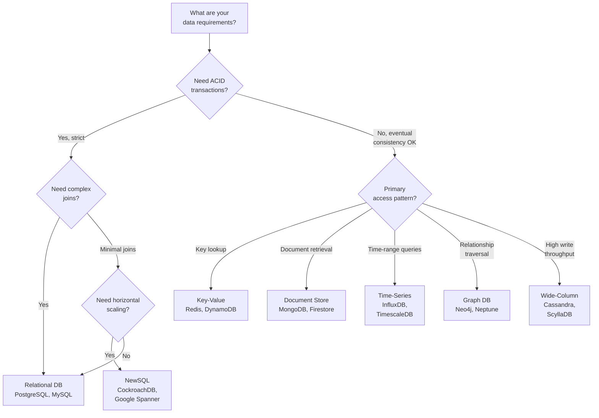
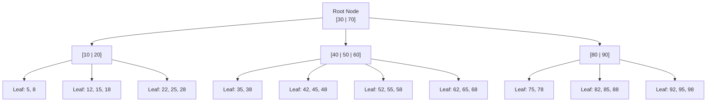
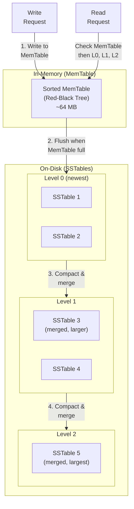

# Databases Deep Dive -- Complete System Design Reference
### Staff Engineer Interview Preparation Guide

> [!TIP]
> **Why databases matter in interviews:** Every system design question involves choosing a database. Interviewers want to see that you can pick the right database for the right use case, explain why, and discuss indexing, normalization, and query performance tradeoffs. "I would use a database" is not an answer -- "I would use Cassandra because we need high write throughput with eventual consistency across regions" is.

---

## Table of Contents

1. [Relational Databases and ACID](#1-relational-databases-and-acid)
2. [Transaction Isolation Levels](#2-transaction-isolation-levels)
3. [NoSQL Database Types](#3-nosql-database-types)
4. [SQL vs NoSQL Decision Framework](#4-sql-vs-nosql-decision-framework)
5. [Database Indexing](#5-database-indexing)
6. [Full-Text Search](#6-full-text-search)
7. [Normalization and Denormalization](#7-normalization-and-denormalization)
8. [Write-Ahead Logging (WAL)](#8-write-ahead-logging-wal)
9. [Polyglot Persistence](#9-polyglot-persistence)
10. [Comprehensive Database Comparison](#10-comprehensive-database-comparison)
11. [Interview Cheat Sheet](#11-interview-cheat-sheet)

---

## 1. Relational Databases and ACID

Relational databases (PostgreSQL, MySQL, Oracle, SQL Server) store data in tables with predefined schemas. They enforce relationships between tables using foreign keys and guarantee data integrity through ACID properties.

### ACID Properties Explained

#### Atomicity -- "All or Nothing"

A transaction is a single unit of work. Either all operations in the transaction succeed, or none of them do. There is no partial completion.

**Example:** Transferring $500 from Account A to Account B.

```sql
BEGIN TRANSACTION;
  UPDATE accounts SET balance = balance - 500 WHERE id = 'A';
  UPDATE accounts SET balance = balance + 500 WHERE id = 'B';
COMMIT;
```

If the server crashes after debiting A but before crediting B, atomicity guarantees the entire transaction is rolled back. Account A gets its $500 back. The money does not vanish.

#### Consistency -- "Valid State to Valid State"

A transaction brings the database from one valid state to another. All constraints (foreign keys, unique constraints, check constraints) are satisfied before and after the transaction.

**Example:** If there is a constraint that account balances cannot be negative, and Account A has $300, a transaction trying to transfer $500 from A will be rejected -- the database remains in a consistent state.

#### Isolation -- "Transactions Don't Interfere"

Concurrent transactions execute as if they were serial -- one after the other. In practice, databases use various isolation levels that trade off between strictness and performance (covered in the next section).

**Example:** Two users simultaneously reading and updating the same inventory count. Without isolation, one update could be lost. With proper isolation, each transaction sees a consistent view of the data.

#### Durability -- "Committed Means Permanent"

Once a transaction is committed, it survives system failures -- power loss, crashes, disk failures (assuming proper replication). This is typically achieved through Write-Ahead Logging (WAL), covered in Section 8.

> [!IMPORTANT]
> ACID is a spectrum, not a binary. Many databases let you tune how strictly these properties are enforced. For example, PostgreSQL supports multiple isolation levels. Understanding these tradeoffs is what distinguishes a senior engineer from a junior one.

---

## 2. Transaction Isolation Levels

Isolation levels define how much one transaction can see of another concurrent transaction's uncommitted changes. Higher isolation means stronger correctness guarantees but lower concurrency (and thus lower throughput).

### The Four Standard Isolation Levels

#### Read Uncommitted (Lowest Isolation)

A transaction can read data modified by other transactions that have not yet committed. This is called a **dirty read**.

```
Transaction A:                   Transaction B:
UPDATE products SET price=50     
  WHERE id=1;                    
                                 SELECT price FROM products
                                   WHERE id=1;
                                 -- Returns 50 (dirty read!)
ROLLBACK;                        
                                 -- Transaction B used a price
                                 -- that was never committed!
```

**Used in practice:** Almost never. The risk of dirty reads is too high.

#### Read Committed

A transaction only sees data that has been committed. No dirty reads. However, if you read the same row twice in a transaction, you might get different values if another transaction committed in between. This is called a **non-repeatable read**.

```
Transaction A:                   Transaction B:
SELECT price FROM products       
  WHERE id=1;                    
-- Returns 100                   
                                 UPDATE products SET price=150
                                   WHERE id=1;
                                 COMMIT;
SELECT price FROM products       
  WHERE id=1;                    
-- Returns 150 (changed!)        
```

**Used in practice:** Default in PostgreSQL and Oracle. Good enough for most use cases.

#### Repeatable Read

Once you read a row, you see the same value for the entire duration of your transaction, even if other transactions modify and commit changes to that row. However, **phantom reads** can still occur -- new rows inserted by other transactions may appear.

```
Transaction A:                   Transaction B:
SELECT * FROM products           
  WHERE price > 100;             
-- Returns 5 rows                
                                 INSERT INTO products (price)
                                   VALUES (200);
                                 COMMIT;
SELECT * FROM products           
  WHERE price > 100;             
-- Returns 6 rows (phantom!)     
```

**Used in practice:** Default in MySQL/InnoDB. Good for most read-heavy workloads.

#### Serializable (Highest Isolation)

Transactions execute as if they were run one after another, in some serial order. No dirty reads, no non-repeatable reads, no phantom reads. This is the safest but slowest level.

**Used in practice:** Financial transactions, booking systems, inventory systems where correctness is more important than throughput.

### Isolation Level Comparison

| Isolation Level | Dirty Read | Non-Repeatable Read | Phantom Read | Performance |
|---|---|---|---|---|
| Read Uncommitted | Possible | Possible | Possible | Fastest |
| Read Committed | Prevented | Possible | Possible | Fast |
| Repeatable Read | Prevented | Prevented | Possible | Medium |
| Serializable | Prevented | Prevented | Prevented | Slowest |

> [!TIP]
> **Interview tip:** Know that Read Committed is the default for PostgreSQL and Repeatable Read is the default for MySQL. When asked about isolation levels, explain the anomalies (dirty read, non-repeatable read, phantom read) with concrete examples. This demonstrates real understanding rather than memorization.

### Implementation Techniques

Databases implement isolation using two main strategies:

**Pessimistic locking (traditional):** Acquire locks on rows/tables before reading or writing. Other transactions wait for the lock to be released. Simple but can lead to deadlocks and reduced concurrency.

**Optimistic concurrency control (MVCC):** Multi-Version Concurrency Control keeps multiple versions of each row. Readers see a snapshot of the data as of their transaction start time. Writers create a new version. No read locks needed. Used by PostgreSQL, MySQL/InnoDB, Oracle.

---

## 3. NoSQL Database Types

NoSQL databases relax the relational model to optimize for specific access patterns. There is no single "NoSQL" model -- it is an umbrella term covering several fundamentally different architectures.

### Key-Value Stores

The simplest model. Every item is stored as a key-value pair. Lookups by key are O(1). No support for complex queries.

**Examples:** Redis, Amazon DynamoDB, Memcached, etcd

**Data model:**
```
Key: "user:7:session"
Value: "{ \"token\": \"abc123\", \"expires\": 1700000000 }"

Key: "product:42:price"
Value: "29.99"
```

**Best for:** Caching, session storage, feature flags, rate limiting counters, leaderboards.

**Redis specifically** adds data structures (lists, sets, sorted sets, hashes, streams) on top of the key-value model, making it much more than a simple cache.

| Pros | Cons |
|---|---|
| Extremely fast (sub-millisecond reads) | No relationships between keys |
| Simple mental model | Limited query capabilities (only by key) |
| Horizontally scalable | Value size limits (Redis: 512 MB, but practical limit is much lower) |
| Great for caching and sessions | Not suitable for complex data models |

### Document Stores

Store data as semi-structured documents (usually JSON or BSON). Each document can have a different structure. Documents can be nested (objects within objects).

**Examples:** MongoDB, Couchbase, Amazon DocumentDB, Firestore

**Data model:**
```json
{
  "_id": "user_7",
  "name": "Alice Chen",
  "email": "alice@example.com",
  "addresses": [
    {
      "type": "home",
      "street": "123 Main St",
      "city": "Seattle",
      "state": "WA"
    },
    {
      "type": "work",
      "street": "456 Pine Ave",
      "city": "Seattle",
      "state": "WA"
    }
  ],
  "preferences": {
    "theme": "dark",
    "notifications": true
  }
}
```

**Best for:** Content management, user profiles, product catalogs, any data with variable schemas or deeply nested structures.

| Pros | Cons |
|---|---|
| Flexible schema -- no migrations needed | No joins (must denormalize or do application-level joins) |
| Natural mapping to application objects | Data duplication is common |
| Good read performance for document-level access | Transactions across documents are limited |
| Horizontal scaling via sharding | Schema discipline must be enforced in application code |

### Wide-Column Stores

Data is organized by column families rather than rows. Each row can have a different set of columns. Optimized for queries that read specific columns across many rows.

**Examples:** Apache Cassandra, Apache HBase, Google Bigtable, ScyllaDB

**Data model (conceptual):**
```
Row Key: "user:7"
Column Family "profile":    name="Alice", email="alice@co.com"
Column Family "activity":   last_login="2024-01-15", login_count=342
Column Family "preferences": theme="dark", lang="en"
```

**Best for:** Time-series data, IoT sensor data, messaging systems, write-heavy workloads, data that spans multiple data centers.

**Cassandra specifically** is designed for:
- Multi-datacenter replication with tunable consistency
- Linear scalability (add nodes to increase throughput)
- High write throughput (append-only storage using LSM trees)
- No single point of failure (peer-to-peer architecture, no master node)

| Pros | Cons |
|---|---|
| Extreme write throughput | Limited query flexibility (must design around partition keys) |
| Linear horizontal scaling | No joins, no subqueries |
| Multi-datacenter replication built in | Eventual consistency by default |
| No single point of failure | Data modeling is complex and unintuitive |

### Graph Databases

Store data as nodes (entities) and edges (relationships). Optimized for traversing relationships, which is extremely slow in relational databases (requires multiple joins).

**Examples:** Neo4j, Amazon Neptune, ArangoDB, JanusGraph

**Data model:**
```
(Alice)-[:FRIENDS_WITH]->(Bob)
(Alice)-[:WORKS_AT]->(Acme Corp)
(Bob)-[:WORKS_AT]->(Acme Corp)
(Alice)-[:PURCHASED]->(Product42)
(Bob)-[:REVIEWED]->(Product42)
```

**Best for:** Social networks, recommendation engines, fraud detection, knowledge graphs, dependency analysis.

**Example query (Cypher, Neo4j's query language):**
```cypher
// Find friends of friends who bought the same product
MATCH (me:User {name: "Alice"})-[:FRIENDS_WITH*2]-(fof:User)
      -[:PURCHASED]->(p:Product)<-[:PURCHASED]-(me)
RETURN fof.name, p.name
```

This query would require 4+ joins in SQL and would be extremely slow on large datasets.

| Pros | Cons |
|---|---|
| Relationship traversal is O(1) per hop | Not good for bulk data processing |
| Intuitive for connected data | Smaller ecosystem than relational DBs |
| Complex queries are natural to express | Sharding graph data is hard |
| Pattern matching is built in | Not suitable for simple CRUD apps |

### Time-Series Databases

Optimized for data that is indexed by time. Each data point has a timestamp, a set of tags (metadata), and one or more values. Designed for high-throughput inserts and time-range queries.

**Examples:** InfluxDB, TimescaleDB (PostgreSQL extension), Prometheus, QuestDB

**Data model:**
```
measurement: cpu_usage
tags: host=server1, region=us-east-1
time: 2024-01-15T10:30:00Z
fields: usage_percent=78.5, cores_active=6
```

**Best for:** Application metrics, infrastructure monitoring, IoT sensor data, financial tick data, analytics event streams.

| Pros | Cons |
|---|---|
| Extremely high write throughput | Not suitable for general-purpose querying |
| Efficient time-range queries | Limited relationship modeling |
| Automatic data retention/downsampling | Smaller community/tooling than RDBMS |
| Built-in aggregation functions | Updates/deletes are expensive |

> [!NOTE]
> TimescaleDB is worth mentioning in interviews because it adds time-series capabilities on top of PostgreSQL, giving you the best of both worlds -- full SQL support plus time-series optimizations. This avoids the need for a separate database.

---

## 4. SQL vs NoSQL Decision Framework

### When to Choose SQL (Relational)

- Data has clear relationships (foreign keys, joins are common)
- Schema is well-defined and unlikely to change drastically
- ACID transactions are required (financial, booking, inventory)
- Complex queries with aggregations, joins, subqueries
- Data integrity is more important than write speed
- Team is experienced with SQL

### When to Choose NoSQL

- Schema evolves rapidly (early-stage product, flexible content)
- Massive write throughput is needed (IoT, logging, metrics)
- Data is naturally hierarchical/nested (JSON documents)
- Horizontal scaling is a primary requirement
- Simple access patterns (key lookup, document retrieval)
- Eventual consistency is acceptable

### Decision Tree



> [!TIP]
> **Interview tip:** Never say "I would use NoSQL because it scales better." This is a red flag. Instead, articulate the specific access pattern that makes a particular NoSQL type a better fit. For example: "We have a social graph with deep traversal queries, so Neo4j is a better fit than joining 5 tables in PostgreSQL."

---

## 5. Database Indexing

Indexes are data structures that speed up read queries at the cost of slower writes and additional storage. Understanding how indexes work internally is essential for system design interviews.

### B-Tree Index

The most common index type in relational databases. A B-tree is a self-balancing tree where each node can have multiple children. All leaf nodes are at the same depth.



**How a B-tree lookup works:**

To find the value 55:
1. Start at root [30 | 70]. 55 is between 30 and 70, go to middle child.
2. At node [40 | 50 | 60]. 55 is between 50 and 60, go to corresponding child.
3. At leaf [52, 55, 58]. Found 55! Return the pointer to the actual row.

**Performance:** O(log N) for lookups, inserts, and deletes. A B-tree with a branching factor of 100 can index 1 billion rows with only 5 levels -- meaning 5 disk reads to find any row.

**Characteristics:**
- Keeps data sorted -- great for range queries (`WHERE price BETWEEN 10 AND 50`)
- All leaf nodes are linked -- efficient for scanning ranges
- Self-balancing -- performance does not degrade as data grows
- Used by: PostgreSQL, MySQL, Oracle, SQL Server (all major RDBMS)

### LSM Tree (Log-Structured Merge Tree)

Optimized for write-heavy workloads. Instead of updating data in place (like B-trees), LSM trees buffer writes in memory and periodically flush them to sorted files on disk.



**How LSM tree writes work:**
1. Write goes to an in-memory sorted structure (MemTable, typically a red-black tree)
2. Writes are also appended to a WAL on disk for durability
3. When the MemTable reaches a size threshold, it is flushed to disk as an immutable Sorted String Table (SSTable)
4. Background compaction merges SSTables from level N into level N+1, removing duplicates and deleted entries

**How LSM tree reads work:**
1. Check the MemTable first (fastest)
2. Check Level 0 SSTables (most recent)
3. Check Level 1, then Level 2, and so on
4. Bloom filters are used at each level to quickly skip SSTables that definitely do not contain the key

**Performance:**
- Writes: O(1) amortized (just append to MemTable)
- Reads: Can be slower than B-trees (must check multiple levels)
- Space: Write amplification from compaction

**Used by:** Cassandra, RocksDB, LevelDB, HBase, ScyllaDB, CockroachDB.

### B-Tree vs LSM Tree Comparison

| Feature | B-Tree | LSM Tree |
|---|---|---|
| Write speed | Slower (random I/O) | Faster (sequential I/O) |
| Read speed | Faster (single lookup) | Slower (check multiple levels) |
| Space efficiency | More space (fragmentation) | Less space (compaction removes waste) |
| Write amplification | Low | High (due to compaction) |
| Best for | Read-heavy workloads | Write-heavy workloads |
| Range queries | Excellent | Good (after compaction) |
| Predictable latency | Yes | Less predictable (compaction can spike latency) |

### Hash Index

A hash table that maps keys to file offsets. O(1) lookups for exact match queries.

**Limitation:** Cannot do range queries. If you need `WHERE age > 25`, a hash index is useless -- you need a B-tree.

**Used by:** Memory-optimized tables in some databases, hash partitioning in DynamoDB.

### Composite (Multi-Column) Indexes

An index on multiple columns, ordered left to right. The order matters significantly.

```sql
CREATE INDEX idx_name_age ON users (last_name, first_name, age);
```

**This index helps with:**
```sql
WHERE last_name = 'Chen'                          -- Yes (leftmost prefix)
WHERE last_name = 'Chen' AND first_name = 'Alice'  -- Yes (uses two columns)
WHERE last_name = 'Chen' AND first_name = 'Alice' AND age > 25  -- Yes (all three)
```

**This index does NOT help with:**
```sql
WHERE first_name = 'Alice'              -- No (skips leftmost column)
WHERE age > 25                           -- No (skips two leftmost columns)
WHERE first_name = 'Alice' AND age > 25  -- No (skips leftmost column)
```

> [!WARNING]
> The order of columns in a composite index is critical. Put the most selective (highest cardinality) column first, unless your most common query filters on a different column. Index design should be driven by your query patterns.

### Covering Index

An index that includes all the columns a query needs, so the database can answer the query entirely from the index without touching the main table. This is a significant performance optimization.

```sql
-- If we frequently run:
SELECT email, name FROM users WHERE last_name = 'Chen';

-- A covering index:
CREATE INDEX idx_covering ON users (last_name) INCLUDE (email, name);
-- The query is answered from the index alone -- no table lookup needed.
```

> [!TIP]
> **Interview tip:** When discussing database optimization, always mention that you would analyze query patterns before creating indexes. More indexes means slower writes and more storage. The goal is to have indexes that cover your most frequent and most critical queries.

---

## 6. Full-Text Search

When you need to search text content (product descriptions, article bodies, user comments), standard database indexes are insufficient. You need inverted indexes.

### How an Inverted Index Works

An inverted index maps every unique word (term) to the list of documents that contain it.

**Documents:**
```
Doc 1: "the quick brown fox"
Doc 2: "the lazy brown dog"
Doc 3: "the quick red fox jumps"
```

**Inverted Index:**
```
the    -> [Doc 1, Doc 2, Doc 3]
quick  -> [Doc 1, Doc 3]
brown  -> [Doc 1, Doc 2]
fox    -> [Doc 1, Doc 3]
lazy   -> [Doc 2]
dog    -> [Doc 2]
red    -> [Doc 3]
jumps  -> [Doc 3]
```

**Searching for "quick fox":**
- Look up "quick" -> [Doc 1, Doc 3]
- Look up "fox" -> [Doc 1, Doc 3]
- Intersect -> [Doc 1, Doc 3]

### Elasticsearch

Elasticsearch is the dominant full-text search engine. Built on Apache Lucene, it provides:

- **Inverted indexes** for fast text search
- **Analyzers** that tokenize text, apply stemming (running -> run), remove stop words (the, a, an)
- **Relevance scoring** (TF-IDF, BM25) to rank results by how well they match
- **Fuzzy matching** to handle typos
- **Aggregations** for analytics (similar to SQL GROUP BY)
- **Horizontal scaling** via sharding

**Common architecture pattern:**

```
Primary Database (PostgreSQL) --> CDC/Sync --> Elasticsearch
       (source of truth)                      (search index)
```

The primary database remains the source of truth. Elasticsearch is a read-optimized search index that is kept in sync through Change Data Capture or application-level dual writes.

> [!NOTE]
> PostgreSQL has built-in full-text search (`tsvector`, `tsquery`) that is good enough for many use cases. You do not always need Elasticsearch. If your search needs are simple (search within a few million documents with basic relevance ranking), PostgreSQL full-text search avoids the operational complexity of running a separate search cluster.

---

## 7. Normalization and Denormalization

### Normalization

Normalization is the process of organizing data to minimize redundancy and dependency. Each fact is stored exactly once.

#### First Normal Form (1NF)

**Rule:** Each column contains atomic (indivisible) values. No repeating groups or arrays.

**Violation:**
```
| student_id | name  | phone_numbers          |
|-----------|-------|------------------------|
| 1         | Alice | 555-1234, 555-5678     |
```

**1NF (fixed):**
```
| student_id | name  | phone_number |
|-----------|-------|--------------|
| 1         | Alice | 555-1234     |
| 1         | Alice | 555-5678     |
```

Or better, create a separate phone_numbers table:
```
students:       | student_id | name  |
                | 1          | Alice |

phone_numbers:  | student_id | phone_number |
                | 1          | 555-1234     |
                | 1          | 555-5678     |
```

#### Second Normal Form (2NF)

**Rule:** Must be in 1NF, and every non-key column must depend on the entire primary key, not just part of it.

**Violation (composite key: student_id + course_id):**
```
| student_id | course_id | student_name | course_name | grade |
|-----------|----------|-------------|------------|-------|
| 1         | CS101    | Alice       | Intro CS   | A     |
```

`student_name` depends only on `student_id`, not on the full key (student_id, course_id). `course_name` depends only on `course_id`.

**2NF (fixed) -- split into three tables:**
```
students:     | student_id | student_name |
courses:      | course_id  | course_name  |
enrollments:  | student_id | course_id | grade |
```

#### Third Normal Form (3NF)

**Rule:** Must be in 2NF, and no non-key column depends on another non-key column (no transitive dependencies).

**Violation:**
```
| employee_id | department_id | department_name | department_head |
|------------|--------------|----------------|----------------|
| 1          | D10          | Engineering    | Bob            |
```

`department_name` and `department_head` depend on `department_id`, not on `employee_id`.

**3NF (fixed):**
```
employees:    | employee_id | department_id |
departments:  | department_id | department_name | department_head |
```

### Denormalization

Denormalization is the deliberate introduction of redundancy to speed up read queries. Instead of joining 5 tables, you store pre-computed data together.

**When to denormalize:**
- Read performance is critical and joins are too slow
- Data is read far more often than written
- The data rarely changes (or you can tolerate stale data)
- You need sub-millisecond query latency

**Example:** An e-commerce product page needs product name, seller name, average rating, and review count. Normalized, this requires joining 4 tables. Denormalized:

```json
{
  "product_id": 42,
  "product_name": "Wireless Mouse",
  "seller_name": "TechGadgets Inc",
  "average_rating": 4.3,
  "review_count": 1247,
  "price": 29.99
}
```

**The tradeoff:** Writes become more complex because you must update redundant data in multiple places. If the seller changes their name, you must update every product document.

### Normalization vs Denormalization Comparison

| Aspect | Normalized | Denormalized |
|---|---|---|
| Data redundancy | Minimal | Intentional duplication |
| Write complexity | Simple (update once) | Complex (update many places) |
| Read performance | Slower (joins needed) | Faster (data pre-joined) |
| Storage | Efficient | More storage used |
| Data consistency | Guaranteed by schema | Must be maintained by application |
| Best for | OLTP (transactional systems) | OLAP (analytics), read-heavy systems |
| Schema changes | Easier (well-structured) | Harder (redundancy spread around) |

> [!TIP]
> **Interview tip:** Start normalized. Denormalize only when you have evidence (query performance metrics) that joins are a bottleneck. "Premature denormalization is the root of all evil" -- paraphrasing Knuth. Always mention this tradeoff in interviews.

---

## 8. Write-Ahead Logging (WAL)

WAL is the mechanism that ensures database durability. Every database that claims durability (the D in ACID) uses some form of write-ahead logging.

### The Problem WAL Solves

Databases keep frequently accessed data in memory (buffer pool) for performance. But memory is volatile -- a crash would lose all uncommitted changes. Writing every change directly to the data files on disk would be too slow (random I/O).

### How WAL Works

1. **Before** modifying any data page in memory, write a log record describing the change to a sequential log file on disk.
2. The log write is sequential (fast -- just append to a file).
3. Only after the log record is safely on disk, acknowledge the transaction as committed.
4. Periodically, flush the modified data pages from memory to disk (checkpoint).

**The key insight:** Sequential writes to a log file are orders of magnitude faster than random writes to data files. By writing to the log first, the database gets both durability and performance.

### Recovery After a Crash

When the database restarts after a crash:
1. Read the WAL from the last checkpoint forward
2. **Redo** all committed transactions that may not have been flushed to data files
3. **Undo** all uncommitted transactions that modified data pages in memory

This ensures the database returns to a consistent state, with all committed transactions present and all uncommitted transactions rolled back.

### WAL in Practice

| Database | WAL Implementation |
|---|---|
| PostgreSQL | WAL (used for replication, point-in-time recovery, crash recovery) |
| MySQL/InnoDB | Redo log + undo log |
| SQLite | WAL mode (alternative to rollback journal) |
| Cassandra | Commit log (similar concept) |
| MongoDB | Journal (oplog for replication) |

> [!NOTE]
> WAL is also the foundation for database replication. The leader ships WAL records to replicas, which replay them to stay in sync. This is how PostgreSQL streaming replication works.

---

## 9. Polyglot Persistence

Polyglot persistence means using different database technologies for different parts of your system, choosing the best tool for each specific data access pattern.

### Example: E-Commerce Platform

```
User Profiles + Orders   -->  PostgreSQL     (ACID transactions, complex queries)
Product Catalog Search   -->  Elasticsearch  (full-text search, faceted filters)
Shopping Cart + Sessions -->  Redis          (fast reads/writes, TTL expiry)
Recommendations          -->  Neo4j          (graph traversal for "users who bought X also bought Y")
Analytics + Event Stream -->  ClickHouse     (columnar storage for aggregation queries)
Product Images Metadata  -->  MongoDB        (flexible schema for varying image attributes)
Application Metrics      -->  Prometheus     (time-series, alerting)
```

### Benefits and Risks

**Benefits:**
- Each data store is optimized for its specific use case
- Better performance than forcing everything into one database type
- Can scale each store independently

**Risks:**
- Operational complexity (must run, monitor, and maintain multiple databases)
- Data consistency across stores is hard (no cross-database transactions)
- Team must learn multiple query languages and operational procedures
- Data synchronization between stores adds latency and failure modes

> [!IMPORTANT]
> Polyglot persistence is powerful but comes with significant operational overhead. In an interview, do not suggest 5 different databases for a system that could work fine with PostgreSQL + Redis. Start with the simplest stack that meets requirements, and add specialized databases only when you can justify the complexity.

---

## 10. Comprehensive Database Comparison

| Database | Type | Best For | Consistency | Scaling | Query Language |
|---|---|---|---|---|---|
| **PostgreSQL** | Relational | General purpose, complex queries, geospatial | Strong (ACID) | Vertical + read replicas | SQL |
| **MySQL** | Relational | Web apps, read-heavy workloads | Strong (ACID) | Vertical + read replicas | SQL |
| **CockroachDB** | NewSQL | Global distributed ACID | Strong (serializable) | Horizontal | SQL |
| **Google Spanner** | NewSQL | Global consistency at scale | Strong (external) | Horizontal | SQL |
| **MongoDB** | Document | Flexible schema, rapid prototyping | Configurable | Horizontal (sharding) | MQL |
| **Redis** | Key-Value | Caching, sessions, real-time | Single-node strong | Redis Cluster | Commands |
| **DynamoDB** | Key-Value/Doc | Serverless, predictable latency | Configurable | Automatic | PartiQL/API |
| **Cassandra** | Wide-Column | Write-heavy, multi-DC | Tunable | Horizontal (linear) | CQL |
| **HBase** | Wide-Column | Hadoop ecosystem, analytics | Strong (row-level) | Horizontal | Java API/HQL |
| **Neo4j** | Graph | Social networks, knowledge graphs | ACID | Limited horizontal | Cypher |
| **Elasticsearch** | Search | Full-text search, log analytics | Near real-time | Horizontal | Query DSL |
| **InfluxDB** | Time-Series | Metrics, monitoring | Eventual | Horizontal (enterprise) | InfluxQL/Flux |
| **TimescaleDB** | Time-Series | Time-series with SQL support | Strong (ACID) | Horizontal | SQL |
| **ClickHouse** | Columnar | OLAP, analytics | Eventual | Horizontal | SQL |
| **SQLite** | Relational | Embedded, mobile, edge | Strong (ACID) | None (single file) | SQL |

### When Interviewers Ask "Why Not Just Use Postgres for Everything?"

PostgreSQL is remarkably versatile. It supports JSON documents (JSONB), full-text search, geospatial data (PostGIS), time-series (TimescaleDB extension), and even graph queries (recursive CTEs). For many startups and mid-size applications, PostgreSQL is genuinely sufficient.

You should choose a specialized database when:
- PostgreSQL cannot meet your latency requirements (use Redis for sub-millisecond reads)
- You need to write millions of rows per second (use Cassandra or ClickHouse)
- You have complex graph traversals with 4+ hops (use Neo4j)
- You need multi-region strong consistency (use CockroachDB or Spanner)
- You need advanced search features like fuzzy matching, facets, and relevance scoring at scale (use Elasticsearch)

---

## 11. Interview Cheat Sheet

### Quick Reference Card

| Topic | Key Point |
|---|---|
| **ACID** | Atomicity (all or nothing), Consistency (valid states), Isolation (no interference), Durability (permanent commits) |
| **Default isolation** | PostgreSQL: Read Committed. MySQL: Repeatable Read |
| **Key-Value DB** | Redis, DynamoDB. Use for: caching, sessions, counters |
| **Document DB** | MongoDB, Firestore. Use for: flexible schema, nested data |
| **Wide-Column** | Cassandra, HBase. Use for: write-heavy, time-series, multi-DC |
| **Graph DB** | Neo4j. Use for: social graphs, recommendations, fraud detection |
| **B-Tree** | O(log N) reads, in-place updates, range queries. Used by RDBMS |
| **LSM Tree** | O(1) writes, sequential I/O, needs compaction. Used by Cassandra |
| **Composite index** | Column order matters. Leftmost prefix rule |
| **Normalization** | Minimize redundancy. Start here. 3NF is usually sufficient |
| **Denormalization** | Add redundancy for read speed. Only when justified by metrics |
| **WAL** | Write log first, then data. Sequential writes for durability |
| **Polyglot persistence** | Right DB for each use case. Do not over-complicate |

### Database Selection Cheat Sheet

| Use Case | Recommended Database | Why |
|---|---|---|
| E-commerce orders | PostgreSQL | ACID transactions, complex queries |
| User sessions | Redis | Sub-millisecond reads, TTL expiry |
| Product catalog | MongoDB or PostgreSQL | Flexible attributes vs strong schema |
| Social graph | Neo4j | Deep relationship traversal |
| Chat messages | Cassandra | High write throughput, time-ordered |
| Search | Elasticsearch | Full-text search, relevance ranking |
| Metrics/monitoring | InfluxDB or Prometheus | Time-series optimized |
| Analytics warehouse | ClickHouse or BigQuery | Columnar storage, fast aggregations |
| Global ACID at scale | CockroachDB or Spanner | Distributed strong consistency |
| Mobile/embedded | SQLite | Single-file, zero configuration |

### Common Mistakes to Avoid

1. Choosing a database before understanding access patterns
2. Using MongoDB "because it is web scale" without considering if you need joins
3. Not creating indexes for frequent queries
4. Creating too many indexes (slowing down writes)
5. Ignoring composite index column order
6. Denormalizing prematurely without performance evidence
7. Using eventual consistency when strong consistency is needed (financial data)
8. Suggesting 5 different databases for a system that could work with PostgreSQL + Redis
9. Not mentioning WAL when asked about durability
10. Confusing 401 (Unauthorized/Unauthenticated) with 403 (Forbidden/Unauthorized)

### Talking Points That Impress Interviewers

- "I would start with PostgreSQL for this use case because it covers 80% of our needs. We can add Elasticsearch later specifically for search if PostgreSQL's built-in full-text search becomes a bottleneck."
- "Cassandra is the right choice here because we need multi-datacenter replication with high write throughput. The tradeoff is that we lose joins and must design our data model around query patterns."
- "I would create a composite index on (user_id, created_at) because our most frequent query filters by user and sorts by creation time. The leftmost prefix rule means this also serves queries that filter only by user_id."
- "We should normalize this data to Third Normal Form because data integrity is critical for financial records. We can add materialized views for read-heavy reporting queries."
- "LSM trees are better for this write-heavy workload because writes are sequential I/O. The tradeoff is that reads may need to check multiple levels, but we mitigate that with Bloom filters."
