# File Upload & Hosting Service
*System Design Interview — Dropbox / Google Drive at Scale*

> [!NOTE]
> **SCOPE:** Senior Software Engineer · FANG Interview Prep · High-Level System Design
> Architecture • Deep Dives • Flow Diagrams • Trade-offs
> Covers: Upload Pipeline • Chunking & Deduplication • Sync Engine • Storage Tiers • Collaboration • CDN • Security

---

## Table of Contents
1. [Requirements Gathering](#1-requirements-gathering)
2. [Capacity Estimation & Scale](#2-capacity-estimation--scale)
3. [High-Level Architecture](#3-high-level-architecture)
4. [Data Models & Database Design](#4-data-models--database-design)
5. [API Design](#5-api-design)
6. [Component Deep Dives](#6-component-deep-dives)
7. [CDN & Download Optimization](#7-cdn--download-optimization)
8. [Security Design](#8-security-design)
9. [Design Trade-offs & Justifications](#9-design-trade-offs--justifications)
10. [Scaling Strategies & Reliability](#10-scaling-strategies--reliability)
11. [Interview Strategy & Common Questions](#11-interview-strategy--common-questions)
12. [Quick Reference](#12-quick-reference)

---

## 1. Requirements Gathering

Spend the first 5–8 minutes of the interview on requirements. The file storage domain is deceptively broad — Google Drive, Dropbox, iCloud, and OneDrive share a surface-level description but have very different design priorities. Nail the scope before touching a whiteboard.

> [!TIP]
> **INTERVIEW TIP:** Questions to Ask
>
> - What is the primary use case: personal storage, enterprise collaboration, or developer API?
> - Do we need real-time co-editing (Google Docs) or just sync + share (Dropbox)?
> - What is the expected max file size? 1 GB? 5 GB? 100 GB video files?
> - Do we need versioning? How many versions should we retain?
> - Is deduplication across users (global dedup) in scope?
> - What platforms: web, desktop sync client, mobile?

### 1.1 Functional Requirements

**Core (P0 — Must Have)**

- **File Upload:** Users can upload any file type up to 5 GB per file via web or desktop client
- **File Download:** Users can download any of their stored files at any time
- **File Management:** Create folders, rename, move, copy, and delete files/folders
- **File Sharing:** Generate shareable links (view-only or edit); share with specific users by email
- **File Sync:** Desktop client automatically syncs local file changes to the cloud and across devices
- **Conflict Resolution:** When the same file is edited on two devices simultaneously, produce a conflict copy
- **File Versioning:** Retain last 30 versions of each file; users can restore any prior version
- **File Search:** Full-text search across filenames and document content (PDF, DOCX, TXT)

**Extended (P1 — Should Have)**

- **Chunked / Resumable Upload:** Large files split into chunks; interrupted uploads resume from last checkpoint
- **Delta Sync:** Only the changed portion (bytes) of a modified file is uploaded, not the whole file
- **Real-time Collaboration:** Multiple users can edit a Google-Doc-style document simultaneously (OT/CRDT)
- **Offline Support:** Desktop/mobile client works offline; changes queue and sync when back online
- **Storage Quotas:** Per-user storage limits (e.g., 15 GB free tier, paid tiers for more)
- **Thumbnail & Preview:** Generate image thumbnails, PDF previews, video stills inline
- **Audit Log:** Record all file events (upload, download, share, delete) for compliance

**Out of Scope**

- Real-time rich text co-editing (Google Docs internals — CRDT/OT is a separate design)
- Payments and billing infrastructure
- Machine learning features (smart search, photo recognition)

### 1.2 Non-Functional Requirements

| Requirement | Target | Justification |
|-------------|--------|---------------|
| Availability | 99.99% (52 min downtime/year) | Storage is mission-critical; data loss is catastrophic |
| Durability | 99.999999999% (11 nines) | Files must never be lost — multi-region replication |
| Upload Latency | < 200 ms to first byte accepted | User experience; background upload queuing |
| Download Latency (P99) | < 500 ms TTFB via CDN | CDN edge cache for hot files |
| Throughput | 10 GB/s aggregate upload across fleet | 500K DAU × 20 MB avg daily upload |
| Consistency | Strong for metadata; eventual for blobs | Metadata needs ACID; blob propagation can lag |
| Scalability | Horizontal; handle 10x traffic spikes | Launch day / viral sharing events |
| Security | Encryption at rest (AES-256) and in transit (TLS 1.3) | Regulatory compliance; user trust |
| Data Isolation | Multi-tenant with strict isolation | No user can access another's private files |

---

## 2. Capacity Estimation & Scale

Always state your assumptions explicitly. Interviewers want to see your reasoning process, not just numbers.

### 2.1 Traffic Estimation

**Assumptions**
- Total registered users: 500 million
- Daily Active Users (DAU): 100 million (20% of registered)
- Average files uploaded per DAU per day: 2
- Average file size: 500 KB (mix of documents, images, and large files)
- Read-to-write ratio: 10:1 (files read more often than written)

> [!NOTE]
> **BACK-OF-ENVELOPE:**
>
> ```
> Daily uploads  = 100M DAU × 2 files        = 200 million files/day
> Upload RPS      = 200M / 86,400             = ~2,315 writes/s (avg)
> Peak upload RPS = 2,315 × 3 (peak factor)  = ~7,000 writes/s
> Download RPS    = 7,000 × 10 (read:write)  = ~70,000 reads/s
> Metadata ops/s  = 70,000 + 7,000           = ~77,000 ops/s
> ```

### 2.2 Storage Estimation

**File Storage (Object Store)**
- New data per day: 200M files × 500 KB = 100 TB/day
- Replication factor: 3x (for durability) → 300 TB raw/day
- Annual growth: 100 TB × 365 = ~36.5 PB/year (before replication)
- With deduplication savings (~30%): net ~26 PB/year

**Metadata Storage (Relational / Key-Value)**
- Per file metadata: ~2 KB (name, path, size, hash, timestamps, ACLs, version pointers)
- Files stored after 5 years: 200M/day × 365 × 5 = ~365 billion file records
- Metadata storage: 365B × 2 KB = ~730 TB — requires sharded relational DB

**Version Storage**
- 30 versions per file average, but most files have < 5 versions
- Effective version overhead: ~2x on modified files
- Deduplication of unchanged chunks reduces version overhead dramatically (delta storage)

### 2.3 Bandwidth Estimation

- **Inbound (upload):** 7,000 RPS × 500 KB avg = 3.5 GB/s inbound bandwidth
- **Outbound (download):** 70,000 RPS × 500 KB avg = 35 GB/s outbound
- **CDN offload (~80%):** Origin outbound = 7 GB/s — manageable
- **Peak outbound with CDN edge:** ~175 GB/s across all CDN PoPs globally

---

## 3. High-Level Architecture

The architecture separates three core concerns: (1) the **control plane** — metadata, auth, and coordination; (2) the **data plane** — raw file bytes stored in object storage; and (3) the **sync engine** — keeping clients consistent. This separation allows each to scale independently.

### 3.1 System Overview

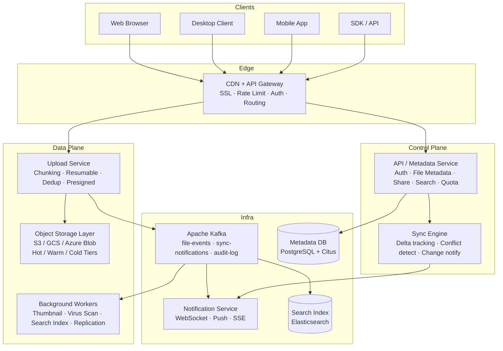

### 3.2 Key Architectural Principles

**1. Separate Control Plane from Data Plane**
The metadata (what files exist, who owns them, sharing ACLs) never flows through the same path as raw bytes. This allows the metadata service to be a strongly-consistent relational system while the object storage layer optimizes purely for throughput and durability.

**2. Client-Side Chunking Before Upload**
Files are split into fixed-size chunks (4 MB default) on the client before transmission. Each chunk is hashed (SHA-256). The server checks which chunks already exist (deduplication) so only novel chunks are actually transferred — the core of Dropbox's performance advantage.

**3. Asynchronous Processing Pipeline**
Heavy operations (thumbnail generation, virus scanning, content indexing, replication verification) are decoupled from the upload critical path via Kafka. Upload returns success once chunks are durably written; enrichment happens asynchronously.

---

## 4. Data Models & Database Design

The metadata layer is the heart of the system. It must support complex hierarchical queries (folder trees), ACL lookups, version history, and sharing — all with strong consistency. Raw file content lives entirely in the object store, referenced only by content-hash.

### 4.1 Core Entity Schemas

**Users & Accounts**

```sql
TABLE: users
─────────────────────────────────────────────
user_id               UUID PRIMARY KEY
email                 VARCHAR(320) UNIQUE NOT NULL
display_name          VARCHAR(128)
password_hash         VARCHAR(256)          -- Argon2id
storage_used_bytes    BIGINT DEFAULT 0
storage_quota_bytes   BIGINT DEFAULT 15000000000  -- 15 GB
plan                  ENUM  -- FREE, PRO, BUSINESS, ENTERPRISE
created_at            TIMESTAMPTZ
last_login_at         TIMESTAMPTZ
mfa_enabled           BOOLEAN
─────────────────────────────────────────────
INDEX: email (login)
```

**Files & Folders — the Namespace**

```sql
TABLE: nodes  (unified table for both files and folders)
─────────────────────────────────────────────────────────────
node_id          UUID PRIMARY KEY
owner_id         UUID FK -> users.user_id
parent_id        UUID FK -> nodes.node_id   (NULL = root)
name             VARCHAR(1024) NOT NULL
node_type        ENUM  -- FILE | FOLDER
size_bytes       BIGINT                     -- 0 for folders
mime_type        VARCHAR(128)
current_version  INTEGER DEFAULT 1
content_hash     VARCHAR(64)               -- SHA-256 (NULL for folders)
is_deleted       BOOLEAN DEFAULT FALSE     -- soft delete (trash)
deleted_at       TIMESTAMPTZ
created_at       TIMESTAMPTZ DEFAULT NOW()
modified_at      TIMESTAMPTZ DEFAULT NOW()
─────────────────────────────────────────────────────────────
UNIQUE  (owner_id, parent_id, name) WHERE NOT is_deleted
INDEX:  (owner_id, parent_id)    -- list folder contents
INDEX:  (content_hash)           -- dedup / version lookups

NOTE: Uses the Closure Table pattern for deep folder hierarchies
```

**File Versions**

```sql
TABLE: file_versions
─────────────────────────────────────────────────────────────
version_id            UUID PRIMARY KEY
node_id               UUID FK -> nodes.node_id
version_number        INTEGER NOT NULL
size_bytes            BIGINT
content_hash          VARCHAR(64)           -- SHA-256 of full file
storage_path          VARCHAR(512)          -- path in object store
uploader_id           UUID FK -> users
upload_device_id      VARCHAR(64)
created_at            TIMESTAMPTZ
is_current            BOOLEAN DEFAULT TRUE
delta_base_version_id UUID                  -- for delta encoding reference
─────────────────────────────────────────────────────────────
PRIMARY KEY (node_id, version_number)
RETENTION: versions older than 30 days (or > 30 count) are purged
```

**Chunks (Content-Addressable Storage)**

```sql
TABLE: chunks  (global, de-duplicated chunk registry)
─────────────────────────────────────────────────────────────
chunk_hash       VARCHAR(64) PRIMARY KEY   -- SHA-256
size_bytes       INTEGER
storage_key      VARCHAR(512)              -- S3: chunks/{hash[0:2]}/{hash}
reference_count  INTEGER DEFAULT 1         -- # of files using this chunk
compressed_size  INTEGER                   -- after LZ4/Zstd
created_at       TIMESTAMPTZ

TABLE: file_chunk_map  (ordered mapping of file -> chunks)
─────────────────────────────────────────────────────────────
version_id    UUID FK -> file_versions
chunk_index   INTEGER           -- 0-based sequence
chunk_hash    VARCHAR(64) FK -> chunks
byte_offset   BIGINT            -- start byte of this chunk in file
─────────────────────────────────────────────────────────────
PRIMARY KEY (version_id, chunk_index)
```

**Sharing & Permissions**

```sql
TABLE: shares
─────────────────────────────────────────────────────────────
share_id        UUID PRIMARY KEY
node_id         UUID FK -> nodes
shared_by       UUID FK -> users
share_type      ENUM  -- LINK | USER | GROUP
recipient_id    UUID FK -> users   (NULL if LINK share)
permission      ENUM  -- VIEWER | COMMENTER | EDITOR | OWNER
link_token      VARCHAR(64) UNIQUE   -- hashed random token for URL shares
password_hash   VARCHAR(256)         -- optional link password
expires_at      TIMESTAMPTZ          -- NULL = no expiry
download_limit  INTEGER              -- NULL = unlimited
download_count  INTEGER DEFAULT 0
created_at      TIMESTAMPTZ
─────────────────────────────────────────────────────────────
INDEX: (node_id, share_type)   -- ACL checks
INDEX: (link_token)            -- public link resolution
INDEX: (recipient_id)          -- 'shared with me' query
```

### 4.2 Folder Hierarchy: Closure Table Pattern

A naive adjacency list (`parent_id` pointer) requires N recursive queries to traverse a deep folder tree. Google Drive uses a **Closure Table**, which pre-materializes all ancestor-descendant relationships for O(1) subtree queries.

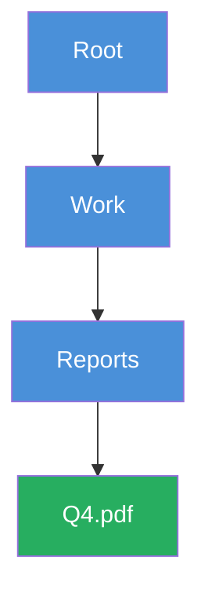

The closure table stores every ancestor → descendant pair at every depth:

```sql
TABLE: node_closure
ancestor_id   UUID FK -> nodes
descendant_id UUID FK -> nodes
depth         INTEGER   -- 0=self, 1=direct child, 2=grandchild ...
PRIMARY KEY (ancestor_id, descendant_id)
```

| ancestor_id | descendant_id | depth |
|-------------|---------------|-------|
| Root | Root | 0 |
| Root | Work | 1 |
| Root | Reports | 2 |
| Root | Q4.pdf | 3 |
| Work | Work | 0 |
| Work | Reports | 1 |
| Work | Q4.pdf | 2 |
| Reports | Reports | 0 |
| Reports | Q4.pdf | 1 |
| Q4.pdf | Q4.pdf | 0 |

```sql
-- All contents of /Root (one query, any depth):
SELECT descendant_id FROM node_closure
WHERE ancestor_id = 'Root' AND depth > 0

-- Full path of Q4.pdf:
SELECT ancestor_id FROM node_closure
WHERE descendant_id = 'Q4.pdf' ORDER BY depth DESC
```

### 4.3 Database Technology Decisions

| Store | Technology | Reason |
|-------|-----------|--------|
| File/Folder Metadata | PostgreSQL + Citus (sharded) | ACID, complex joins, ACL queries; Citus shards by owner_id |
| Chunk Registry | PostgreSQL or DynamoDB | High-frequency dedup lookups by hash; DynamoDB for pure KV speed |
| File Content (blobs) | Amazon S3 / Google GCS | Industry-standard; 11-nines durability; lifecycle rules for tiering |
| Session / Auth Tokens | Redis Cluster | Sub-ms TTL-based token validation |
| Upload State (in-progress) | Redis + PostgreSQL | Track chunk upload progress; persist for resumability |
| Search Index | Elasticsearch | Full-text across filename + content; inverted index |
| Change Feed / Events | Apache Kafka | Async processing pipeline; sync notification backbone |
| Audit Log | Cassandra / ClickHouse | Append-only, high-write, time-series; compliance retention |

---

## 5. API Design

The API surface is split into two groups: the **Metadata API** (control plane, authenticated REST) and the **Transfer API** (data plane, often token-scoped for direct cloud storage access). All requests carry a JWT Bearer token; sharing links use a signed token in the query string.

### 5.1 Authentication API

```
POST   /v1/auth/register          Body: { email, password, display_name }
POST   /v1/auth/login             Body: { email, password } → JWT + refresh
POST   /v1/auth/refresh           Body: { refresh_token } → new JWT
POST   /v1/auth/logout            Invalidates refresh token
POST   /v1/auth/mfa/verify        Body: { totp_code }
GET    /v1/auth/devices           List active sessions
DELETE /v1/auth/devices/{id}      Remote logout
```

### 5.2 File & Folder (Namespace) API

```
-- LISTING
GET    /v1/files                  List root; ?parent_id= for subfolders
GET    /v1/files/{node_id}        Get single node metadata
GET    /v1/files/{node_id}/path   Get full path string

-- FOLDER OPERATIONS
POST   /v1/folders                Body: { name, parent_id }
PUT    /v1/files/{id}             Body: { name?, parent_id? }  (rename/move)
DELETE /v1/files/{id}             Soft-delete (move to Trash)
POST   /v1/files/{id}/restore     Restore from Trash
DELETE /v1/files/{id}/permanent   Hard-delete (irreversible)
POST   /v1/files/{id}/copy        Body: { dest_parent_id, new_name? }

-- VERSIONS
GET    /v1/files/{id}/versions              List all versions
POST   /v1/files/{id}/versions/{v}/restore  Restore to version v
DELETE /v1/files/{id}/versions/{v}          Delete a specific version
```

### 5.3 Upload API — 3-Phase Protocol

Upload uses a two-phase protocol. **Phase 1** is a metadata handshake (what am I about to upload?). **Phase 2** is direct chunk transfer, often bypassing application servers entirely via presigned URLs.

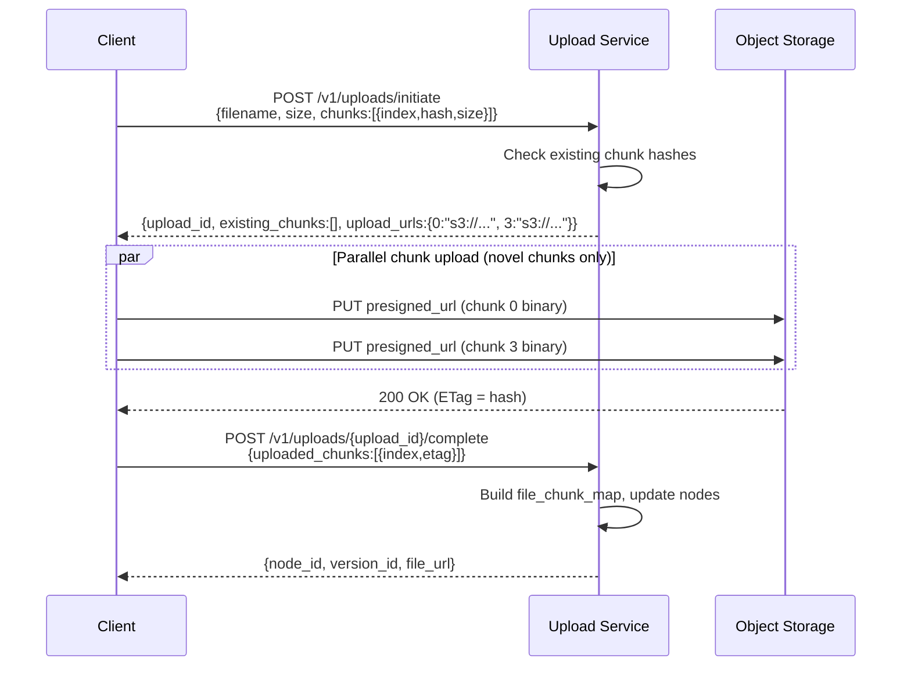

**Resumable Upload:**
```
GET /v1/uploads/{upload_id}/status
→ { received_chunks: [0,1,2,5], missing_chunks: [3,4,6..12] }
```

### 5.4 Download API

```
GET /v1/files/{node_id}/download
    ?version={n}          Optional; defaults to current
    → 302 Redirect → signed CDN URL (1-hour expiry)

GET /v1/files/{node_id}/download?inline=true
    For browser preview (PDF, images)
    → Content-Disposition: inline

GET /v1/share/{link_token}/download
    Public link download (no auth required; token validated)

-- Range download (resumable):
GET /v1/files/{node_id}/download
    Headers: Range: bytes=0-4194303    (chunk 0)
    → 206 Partial Content
```

### 5.5 Sharing API

```
POST   /v1/files/{id}/shares      Body: { share_type, permission, recipient_email?,
                                          expires_at?, password?, download_limit? }
GET    /v1/files/{id}/shares      List shares on a node
PUT    /v1/shares/{share_id}      Update permission or expiry
DELETE /v1/shares/{share_id}      Revoke share
GET    /v1/files/shared-with-me   Files others shared with you
GET    /v1/files/shared-by-me     Files you have shared
```

---

## 6. Component Deep Dives

### 6.1 Chunked Upload & Content-Addressable Storage

Chunking is the single most important design decision in a file storage system. It enables resumability, deduplication, parallel upload, and delta sync — all at once. This is the core innovation behind Dropbox's original architecture.

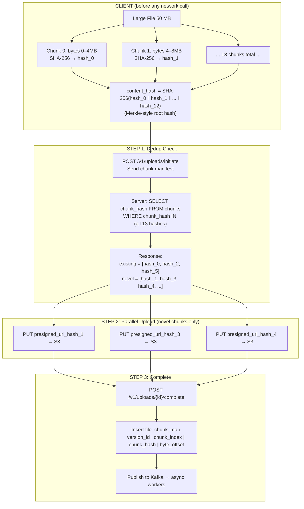

> [!TIP]
> **WHY CONTENT-ADDRESSABLE STORAGE (CAS)?**
>
> 1. **Global Deduplication:** If 10,000 users upload the same PDF, only ONE copy is stored. Dropbox reports 70%+ storage savings.
> 2. **Integrity Checking:** SHA-256 hash validates data correctness — bit rot is instantly detected.
> 3. **Delta Sync:** Modified file reuses unchanged chunks. Only changed chunks are re-uploaded.
> 4. **Immutability:** Chunks are write-once, never mutated. Cache-forever, simplifies replication.
> 5. **Garbage Collection:** Reference counting on chunks enables safe cleanup of unreferenced data.

### 6.2 Resumable Upload State Machine

Network interruptions during large file uploads are inevitable. The system must allow resumption from the last successfully uploaded chunk, not restart from zero.

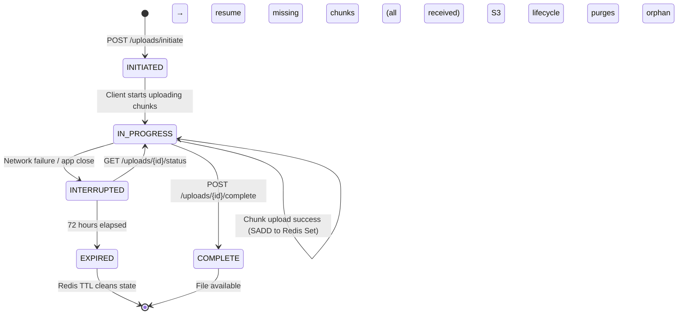

Upload state stored in Redis (`upload:{upload_id}`, TTL 72 hours):

```json
{
  "owner_id": "uuid",
  "node_id": "uuid",
  "filename": "report.pdf",
  "total_chunks": 13,
  "received_chunks": [0, 1, 2, 5],
  "created_at": "2024-01-24T10:00:00Z",
  "status": "IN_PROGRESS"
}
```

> [!WARNING]
> **CHUNK UPLOAD IDEMPOTENCY**
>
> If a chunk PUT times out and is retried:
> - S3 presigned PUT is idempotent (same hash → same object key)
> - Server checks chunk exists before re-registering — no duplicate data
> - `SADD` on Redis Set is idempotent by definition

### 6.3 File Sync Engine

The sync engine is what makes Dropbox feel magical — changes on one device appear on all others within seconds.

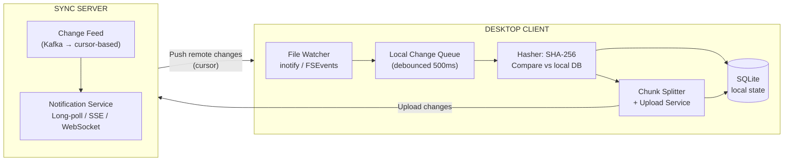

**Conflict Resolution**

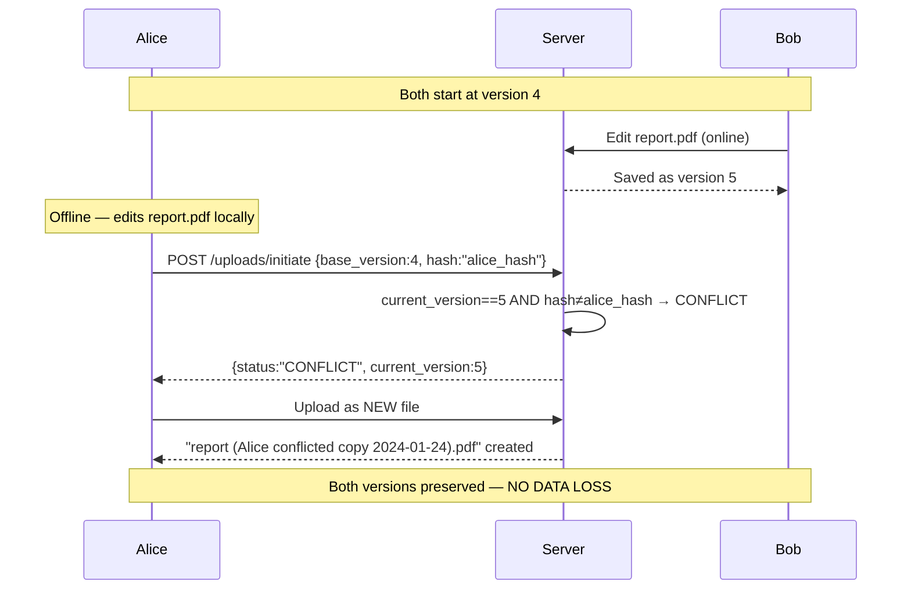

### 6.4 Delta Sync

When a user edits a 500 MB video file by adding a 1-second clip, naive sync re-uploads 500 MB. Delta sync re-uploads only the changed chunks — perhaps 4–8 MB.

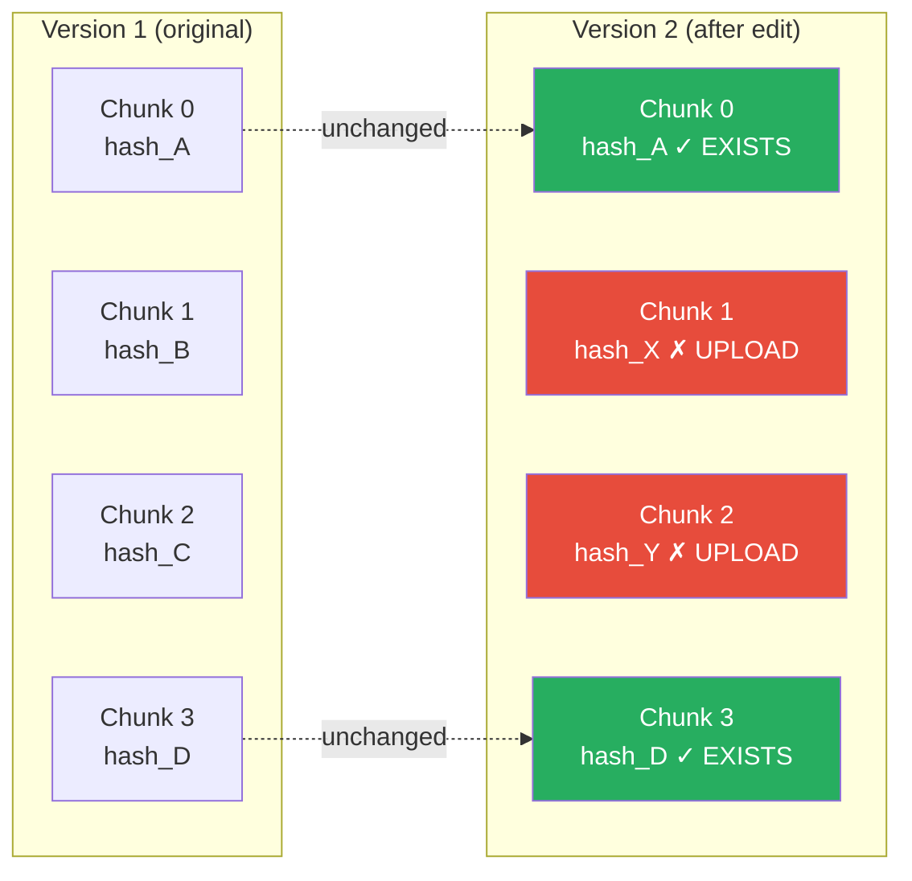

> [!NOTE]
> **SAVINGS CALCULATION**
>
> - 500 MB file with 4 MB chunks = 125 chunks
> - Only 2 chunks changed → 8 MB upload instead of 500 MB = **98.4% bandwidth savings**
>
> **Fixed-size vs Content-Defined Chunking (CDC):**
> Inserting bytes at the start of a file shifts ALL fixed-size chunk boundaries — most "unchanged" content ends up in different chunks, defeating delta sync. CDC (Rabin fingerprinting) sets boundaries by content, not byte offset. Insert 1 byte → only 1–2 boundary chunks change.

### 6.5 Storage Tiering

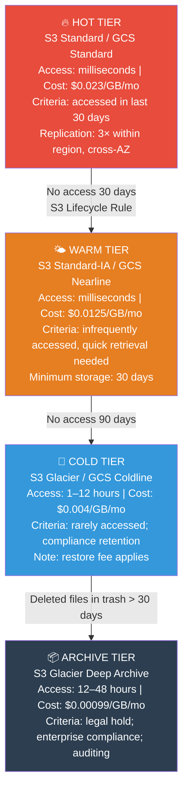

Tier transition runs as a **daily background worker:**

```sql
-- Move to warm tier
SELECT chunk_hash FROM chunks
WHERE last_accessed_at < NOW() - INTERVAL '30 days'
  AND current_tier = 'HOT'
-- → Issue S3 CopyObject to IA storage class
-- → Update chunks.storage_tier in DB

-- When user downloads a cold/archive file:
-- → Issue S3 RestoreObject (async)
-- → Notify user: "File is being prepared (est. 2 hrs)"
```

### 6.6 Access Control & Sharing

The ACL system must answer one question in <10ms at download time: "Does user U have permission P on node N?"

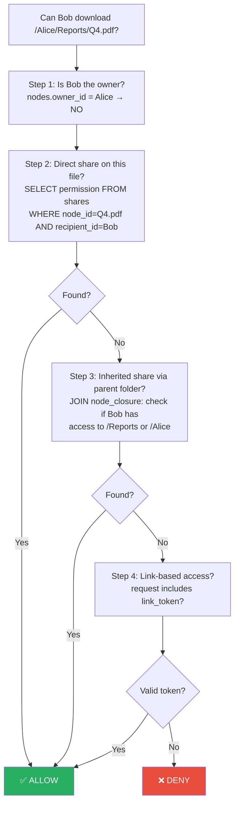

> [!TIP]
> **ACL CACHING**
>
> Redis key: `acl:{user_id}:{node_id}` → permission (TTL 60s)
> Invalidated when: share created/revoked, file moved, owner changed.
> Cache miss rate ~5% for hot files → database read on miss.

### 6.7 Search Service

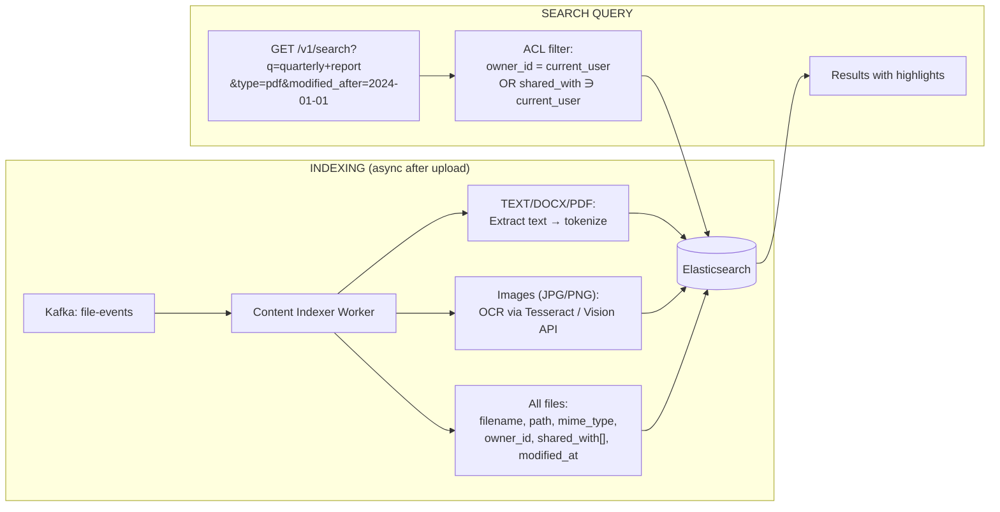

---

## 7. CDN & Download Optimization

### 7.1 CDN Architecture

Files are stored once in origin object storage (S3/GCS) and served globally via CDN edge nodes. The CDN reduces latency from ~200ms (origin) to ~20ms (edge) for popular files, and offloads ~80% of bandwidth from origin.

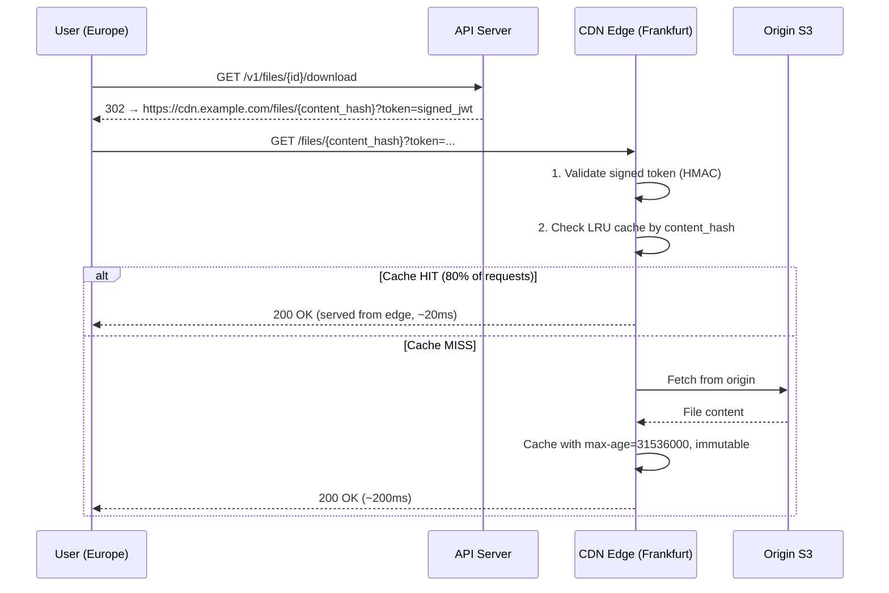

> [!TIP]
> **CACHE KEY = content_hash (not URL)**
>
> The same 10 MB PDF uploaded by 1,000 different users produces 1,000 different download URLs — but all resolve to the **same content_hash**. This means one CDN edge fetch serves all 1,000 users. URL-based cache keys would result in 1,000 separate origin fetches.

### 7.2 Large File Download Optimization

- **Multipart / Range requests:** Client downloads large files in parallel 4 MB chunks
- **Adaptive bitrate for video:** HLS/DASH streaming served from CDN for video files
- **Content-based cache keys:** CDN cache key = content_hash → cache hit across all users with same file
- **Prefetching:** Desktop client prefetches file metadata but defers blob download until needed
- **Compression:** CDN applies Brotli/Gzip for compressible files (text, JSON, HTML) on the fly

---

## 8. Security Design

### 8.1 Encryption Layers

**Encryption in Transit**
- TLS 1.3 mandatory for all client-server communication
- Certificate pinning in desktop and mobile clients
- Presigned S3 URLs use HTTPS — data encrypted during direct upload to S3

**Encryption at Rest**
- S3 Server-Side Encryption: SSE-KMS with per-customer keys (AWS KMS)
- Database encryption: PostgreSQL TDE (Transparent Data Encryption)
- Envelope encryption: DEK (Data Encryption Key) per file, encrypted with KEK in KMS
- Key rotation: KEKs rotated annually; re-encryption of DEKs without touching file blobs

**Envelope Encryption Model**

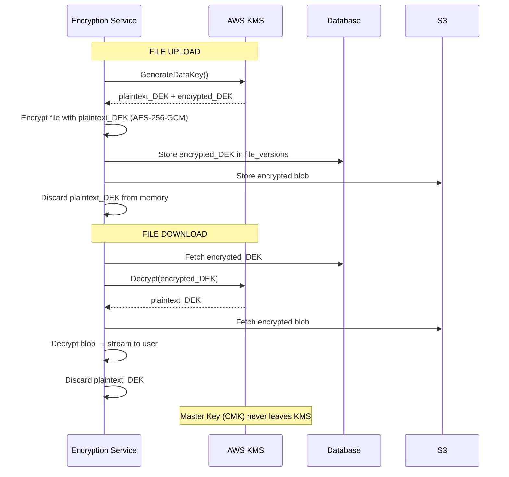

> [!TIP]
> **KEY ISOLATION BENEFIT**
>
> If one file's DEK is compromised, only that file is exposed — not all files. The master key (CMK) never leaves KMS. Re-keying a user rotates only their DEKs; blobs in S3 are untouched.

### 8.2 Content Safety

- **Virus / malware scanning:** ClamAV + commercial scanner on all uploaded files before making available
- **CSAM detection:** PhotoDNA hash matching on image/video uploads
- **Rate limiting:** 100 uploads/min per user; 1000 download requests/min
- **Quota enforcement:** Check storage_used_bytes against quota before accepting upload
- **DDoS protection:** Cloudflare Magic Transit + rate limiting at edge

---

## 9. Design Trade-offs & Justifications

Every architectural decision is a trade-off. Being able to articulate WHY you chose an approach — and what you gave up — is the hallmark of a senior engineer in a FANG interview.

### 9.1 Major Design Decisions

| Decision | Chosen Approach | Alternatives Rejected | Justification & Trade-off |
|----------|----------------|----------------------|--------------------------|
| File storage backend | Object storage (S3/GCS) | HDFS, NFS, custom block store | S3: 11-nines durability, serverless, lifecycle rules, CDN integration. HDFS: operational overhead, not cloud-native |
| Chunk size | 4 MB fixed (with optional CDC) | 1 MB fixed, 64 MB fixed | 4 MB: balance between dedup granularity and request overhead. Too small: many requests. Too large: poor delta savings |
| Deduplication scope | Global (cross-user) | Per-user only | Global dedup maximizes storage savings. Trade-off: hash oracle attack possible. Mitigated by never exposing hashes to users |
| Folder tree storage | Closure Table | Adjacency list, Nested sets, MPTT | Closure Table: O(1) subtree reads. Adjacency list: O(depth) queries. Nested sets: expensive writes on insert |
| Sync notification | Long-poll + SSE (fallback WS) | Pure polling, pure WebSocket | Long-poll: firewall-friendly, simple. SSE: efficient server push. WebSocket: added complexity; sync doesn't need bidirectional |
| Conflict resolution | Conflict copy (Dropbox-style) | Last-write-wins, 3-way merge | Conflict copy: preserves all data, no data loss. LWW: data loss risk. 3-way merge: only works for text |
| CDN cache key | content_hash (not URL) | Full URL per user | Hash-based: cache hit across all users for identical file. URL-based: cache bust on every share |
| Metadata DB | PostgreSQL + Citus | MongoDB, Cassandra, DynamoDB | PostgreSQL: ACID, complex joins (ACL, closure table). MongoDB: weaker consistency. Cassandra: no joins, no transactions |
| Upload path | Client → presigned URL → S3 directly | Client → API server → S3 | Direct: API servers not in data path; no bandwidth bottleneck. Proxy: server becomes throughput bottleneck at scale |

### 9.2 Consistency Analysis

> [!IMPORTANT]
> **STRONG CONSISTENCY REQUIRED**
>
> 1. **File Metadata (create/rename/delete):** ACID transactions — must be atomic. Rename + move must not leave file unreachable if server crashes mid-op.
> 2. **Quota enforcement:** Check + decrement `storage_used_bytes` must be atomic to prevent over-quota uploads.
> 3. **Share permission changes:** Revocation of a share must take effect immediately — not eventually.
> 4. **Version creation:** Assigning version numbers must be strongly ordered — no duplicate versions.

> [!NOTE]
> **EVENTUAL CONSISTENCY ACCEPTABLE**
>
> 1. **Chunk replication:** New chunks replicate to secondary region within seconds — tolerable.
> 2. **Search index:** Elasticsearch updates lag 5–10 seconds — acceptable for search.
> 3. **Thumbnail generation:** Thumbnails appear seconds after upload — acceptable UX.
> 4. **Storage tier migration:** Hot→warm transition may lag hours — no user-visible impact.
> 5. **Sync notifications:** Desktop clients may receive change notification 1–2 seconds late — fine.

### 9.3 Scalability Bottleneck Analysis

| Component | Bottleneck | Detection | Solution |
|-----------|-----------|-----------|----------|
| Metadata DB (PostgreSQL) | Write throughput >50K TPS on single node | Query latency rises, connection pool exhaustion | Citus sharding by owner_id; read replicas; PgBouncer |
| Chunk dedup check | 100K hash lookups/second on chunks table | Slow upload initiate response time | Cache chunk hashes in Redis Bloom filter; DynamoDB for KV lookup |
| Storage quota check | Atomic increment on hot accounts (celebrities) | Quota update contention | Pre-shard user quota counters; optimistic locking; background reconciliation |
| Elasticsearch indexing | Index write throughput ceiling | Indexing lag >60 seconds | Increase shards; index aliases with hot/warm rotation; async bulk indexing |
| CDN origin fetch | Traffic spike causes origin overload | Cache hit rate drops; S3 429 errors | Increase S3 request rate limits; add origin shield; pre-warm cache for popular shares |
| Sync long-poll | 10M concurrent connections on sync servers | Memory exhaustion | Use async event-loop servers (Go/Node.js); limit 30s timeout; shed load gracefully |

---

## 10. Scaling Strategies & Reliability

### 10.1 Multi-Region Architecture

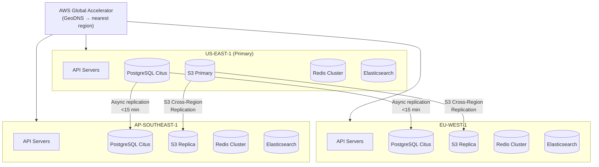

> [!NOTE]
> **FAILOVER TARGETS**
>
> | Metric | Target |
> |--------|--------|
> | RPO (Recovery Point Objective) | < 15 min (S3 replication lag) |
> | RTO (Recovery Time Objective) | < 2 min (DNS TTL + health check) |
> | Single AZ failure recovery | < 2 min (auto-scaling in remaining AZs) |

### 10.2 Reliability Patterns

**Circuit Breakers**
- Wrap all downstream calls (S3, KMS, Elasticsearch) in circuit breakers
- If S3 error rate >5% in 30s window → open circuit → serve from cache or return 503
- Elasticsearch circuit breaker: search degrades gracefully (empty results vs crash)

**Idempotency**
- All upload operations use `upload_id` as idempotency key — safe to retry
- Chunk PUT to S3 is inherently idempotent (same hash → same object)
- POST /complete is idempotent — duplicate calls return same `version_id`

**Graceful Degradation**
- Thumbnail failure → show file icon instead of thumbnail — never block download
- Search failure → show empty results with "search temporarily unavailable" — never block file access
- Quota service failure → fail open (allow upload) with async reconciliation — better than blocking

### 10.3 Disaster Recovery

| Scenario | Impact | Recovery Strategy | RTO | RPO |
|----------|--------|-------------------|-----|-----|
| Single AZ failure | ~30% capacity loss | Auto-scaling in remaining AZs; ALB removes failed AZ | < 2 min | 0 |
| Full region failure | Region unavailable | GeoDNS failover to nearest healthy region | < 5 min | < 15 min |
| Database corruption | Metadata inaccessible | Point-In-Time Recovery (PITR); 5-min window | < 30 min | < 5 min |
| S3 bucket accidental deletion | File blobs inaccessible | Object versioning + MFA delete; restore from replica | < 4 hrs | 0 |
| Ransomware / mass deletion | User files deleted | Object versioning + 30-day delete retention | < 1 hr | 0 |

---

## 11. Interview Strategy & Common Questions

> [!TIP]
> **45-MINUTE INTERVIEW BREAKDOWN**
>
> | Time | Activity |
> |------|---------|
> | 0–5 min | Clarify requirements — ask 4–5 targeted questions (file size, versioning, dedup, E2E?) |
> | 5–10 min | Capacity estimation — DAU, storage/day, upload RPS, bandwidth |
> | 10–20 min | High-level architecture — draw the big picture, name each component clearly |
> | 20–35 min | Deep dives — pick 2–3 of: upload flow, sync engine, dedup, storage tiering, ACL |
> | 35–42 min | Trade-offs — CAP theorem placement, database choices, chunking strategy |
> | 42–45 min | Ask the interviewer thoughtful questions |

### 11.1 Common Follow-Up Questions

**Q: How does deduplication work when two users upload the same file?**

We use content-addressable storage — each chunk is stored once, indexed by its SHA-256 hash. When the upload service receives a manifest of chunk hashes, it queries the `chunks` table for which hashes already exist. Existing chunks are not re-uploaded — the new `file_chunk_map` just references them. We increment `reference_count` on those chunks. The file's metadata (owner, name, path) is separate from the blob — so both users have independent file records pointing to the same physical chunk objects. The reference count ensures chunks are only garbage-collected when no files reference them.

**Q: How do you handle a 10 GB file upload?**

The client splits the file into 4 MB chunks (2,560 chunks for 10 GB). Three-phase upload: (1) manifest submission and dedup check, (2) parallel direct-to-S3 upload of novel chunks via presigned URLs — up to 5 concurrent — and (3) completion where we register the chunk map. If interrupted, the client polls `/uploads/{id}/status` for missing chunks and resumes. The client retains upload state in local SQLite, so even an app restart doesn't require starting over. Total transfer at 100 Mbps ≈ 13 minutes.

**Q: What happens when Alice deletes a shared file?**

Deletion is two-step. First, soft-delete: `is_deleted=true`, file moves to Trash. All existing shares become inaccessible immediately (ACL check fails on `is_deleted=true`). If Alice permanently deletes from Trash, the node record is hard-deleted; all shares cascade-delete. The `file_versions` and `file_chunk_map` records are scheduled for GC. Reference counts on chunks are decremented; if `ref_count` reaches 0, the chunk is scheduled for deletion from S3. Bob receives a notification that the file is no longer available.

**Q: How do you prevent users from exceeding their storage quota?**

Atomic check-and-decrement on upload complete:
```sql
UPDATE users
SET storage_used_bytes = storage_used_bytes + :file_size
WHERE user_id = :uid
  AND storage_used_bytes + :file_size <= storage_quota_bytes
```
If this returns 0 rows updated, the quota was exceeded and we reject the upload. The file bytes already in S3 are purged via lifecycle rule. We cache quota status in Redis (60s TTL) — over-quota users are rejected at cache layer without hitting the DB.

**Q: How would you implement Google Drive's real-time collaborative editing?**

That's fundamentally different from file sync — it requires Operational Transform (OT) or CRDTs. For OT: every user edit is an operation (insert N chars at position P, delete M chars from position Q). The server maintains an operations log; concurrent edits are transformed against each other to produce consistent final state. Newer systems use CRDTs (Yjs, Automerge) which are mathematically guaranteed to converge without server coordination. This is a separate design — flag it as out of scope for file sync.

### 11.2 What Impresses FANG Interviewers

- Proactively mention **content-defined chunking (CDC)** vs fixed-size — shows depth
- Discuss the **reference_count garbage collection** problem — shows full lifecycle thinking
- Bring up the **closure table** for folder hierarchy before being asked — rare knowledge
- Mention **envelope encryption** vs SSE — shows security depth
- Discuss **storage tiering and cost implications** — shows real-world economics thinking
- Address the **hash oracle problem** in global dedup — shows security awareness
- Mention **idempotency keys** on upload operations — shows distributed systems maturity

> [!WARNING]
> **RED FLAGS TO AVOID**
>
> - **Never** store file blobs in a relational database — even for "small" files, it doesn't scale
> - **Never** propose a single database for metadata without discussing sharding at 500M users
> - **Don't** propose "use UUID as folder path" — explain the closure table need
> - **Don't** ignore conflict resolution — it's a core correctness requirement for sync
> - **Don't** say "store everything in S3 directly" without discussing the metadata layer
> - **Don't** forget ACL enforcement on every read path — security is non-negotiable
> - **Don't** use WebSocket for large file transfers — HTTP/S with range requests is correct

---

## 12. Quick Reference

### 12.1 Technology Stack

| Layer | Technology | Purpose |
|-------|-----------|---------|
| API Gateway | Kong / AWS API Gateway | Rate limiting, auth, routing, SSL termination |
| API Servers | Go / Java (Spring Boot) | Business logic, metadata ops, ACL enforcement |
| Upload Service | Go (high concurrency) | Chunk manifest, dedup check, presigned URL generation |
| Sync Engine | Go / Node.js | Long-poll/SSE, cursor-based change feed |
| Object Storage | Amazon S3 / GCS | Raw file blobs; 11-nines durability; lifecycle tiering |
| Metadata DB | PostgreSQL 15 + Citus | File/folder metadata; ACID; sharded by owner_id |
| Cache | Redis Cluster 7.x | Sessions, ACL cache, quota cache, upload state |
| Search | Elasticsearch 8.x | Full-text file name + content search with ACL filtering |
| Message Bus | Apache Kafka | Async processing pipeline; audit log; sync events |
| Background Workers | Kubernetes Jobs | Thumbnail gen, virus scan, content indexing, GC |
| CDN | Cloudflare / CloudFront | Global file delivery; edge caching by content_hash |
| Key Management | AWS KMS / HashiCorp Vault | DEK/KEK management; envelope encryption |
| Monitoring | Prometheus + Grafana + PagerDuty | Metrics, SLO tracking, on-call alerting |
| Tracing | Jaeger / AWS X-Ray | Distributed request tracing across services |

### 12.2 Key Numbers to Memorize

| Metric | Value | Notes |
|--------|-------|-------|
| Registered Users | 500 million | — |
| DAU | 100 million | 20% of registered |
| Uploads per day | 200 million files | 2 per DAU |
| Storage growth | 100 TB/day raw | 500 KB avg file |
| With dedup savings | ~70 TB/day net | ~30% dedup rate |
| Upload RPS (peak) | ~7,000 writes/s | 3× average |
| Download RPS (peak) | ~70,000 reads/s | 10:1 read:write |
| Chunk size | 4 MB (fixed) or CDC | ~25 chunks per 100 MB file |
| Resumable upload TTL | 72 hours | After which upload_id expires |
| Version retention | 30 versions or 30 days | Whichever limit reached first |
| CDN cache hit rate | ~80% | Reduces origin bandwidth by 80% |
| Metadata DB availability | 99.99% | 52 min downtime/year |
| Object storage durability | 99.999999999% | 11 nines |
