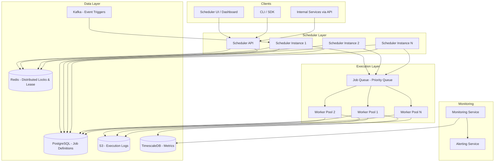
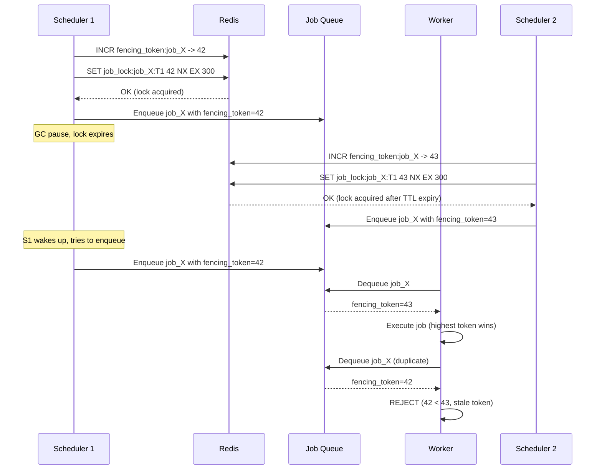
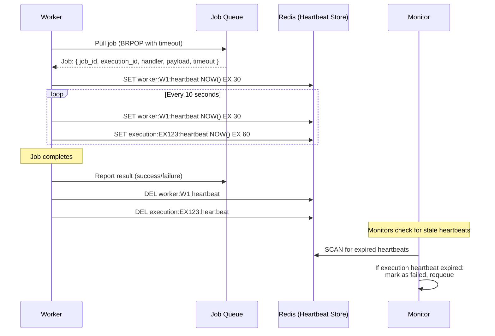
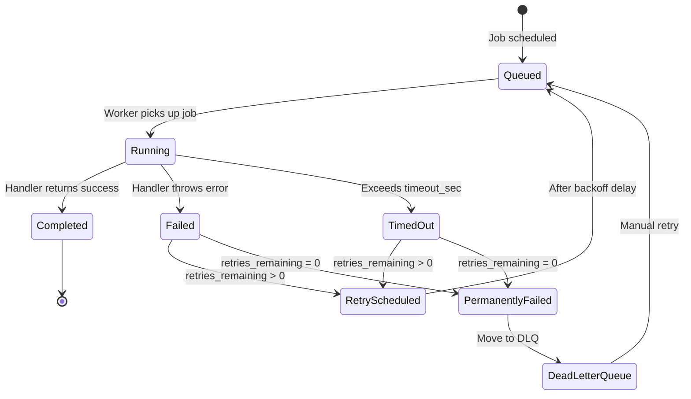
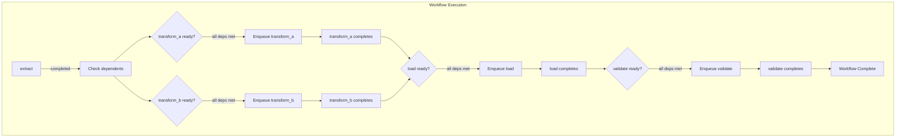

# System Design Interview: Distributed Job Scheduler
### Cron at Scale

> [!NOTE]
> **Staff Engineer Interview Preparation Guide** — High Level Design Round

---

## Table of Contents

1. [Problem Clarification & Requirements](#1-problem-clarification--requirements)
2. [Capacity Estimation & Scale](#2-capacity-estimation--scale)
3. [High-Level Architecture](#3-high-level-architecture)
4. [Core Components Deep Dive](#4-core-components-deep-dive)
5. [Job Types](#5-job-types)
6. [Job Store Design](#6-job-store-design)
7. [Distributed Locking for Job Pickup](#7-distributed-locking-for-job-pickup)
8. [Worker Pool Management](#8-worker-pool-management)
9. [Job Execution Guarantees](#9-job-execution-guarantees)
10. [Retry & Backoff](#10-retry--backoff)
11. [DAG Execution](#11-dag-execution)
12. [Monitoring & Alerting](#12-monitoring--alerting)
13. [Data Models & Storage](#13-data-models--storage)
14. [Scalability Strategies](#14-scalability-strategies)
15. [Design Trade-offs & Justifications](#15-design-trade-offs--justifications)
16. [Interview Cheat Sheet](#16-interview-cheat-sheet)

---

## 1. Problem Clarification & Requirements

> [!TIP]
> **Interview Tip:** A distributed job scheduler is an infrastructure component, not a user-facing product. The "users" are internal engineering teams who submit jobs. The core challenge is executing the right job at the right time exactly once, even when machines fail. Frame your answer around reliability and exactly-once semantics from the beginning.

### Questions to Ask the Interviewer

| Category | Question | Why It Matters |
|----------|----------|----------------|
| **Scale** | How many jobs? What is peak execution rate? | Determines scheduler architecture complexity |
| **Job types** | Only time-triggered, or also event-triggered? | Expands scope to include event bus integration |
| **Execution** | How long do jobs run? Seconds, minutes, or hours? | Worker pool sizing and timeout strategy |
| **Dependencies** | Do jobs have dependencies on other jobs (DAGs)? | Adds DAG orchestration layer |
| **Multi-tenancy** | Single team or shared platform (many teams)? | Fairness, isolation, quota management |
| **Idempotency** | Can jobs be safely retried? | Affects execution guarantee model |
| **Environment** | Kubernetes, bare metal, or cloud functions? | Worker deployment model |
| **Priority** | Are some jobs more important than others? | Priority queue implementation |

---

### Functional Requirements (Agreed Upon)

- Users can schedule one-time delayed jobs (run at a specific time in the future)
- Users can schedule recurring jobs using cron expressions (e.g., "every 5 minutes", "daily at 2 AM")
- Users can define event-triggered jobs (run when a specific event occurs)
- Users can define DAG workflows: jobs with dependencies where job B runs only after job A completes
- Failed jobs are retried with configurable retry count and backoff strategy
- Users can monitor job status, view execution history, and set up alerts
- Users can pause, resume, and cancel scheduled jobs
- Jobs that exceed their timeout are terminated and marked as failed

### Non-Functional Requirements

- **Exactly-once execution:** A job must execute exactly once per scheduled occurrence (no missed executions, no duplicates)
- **Fault tolerance:** The system continues to operate if any single component fails
- **Low scheduling latency:** Time between when a job is due and when it begins executing should be < 5 seconds
- **Scale:** 10 million scheduled job definitions, 100K job executions per minute at peak
- **Isolation:** A misbehaving job from one team must not affect jobs from other teams
- **Observability:** Full audit trail of every job execution (who, when, duration, result)

---

## 2. Capacity Estimation & Scale

> [!TIP]
> **Interview Tip:** The key scaling dimension for a job scheduler is the execution rate, not the number of job definitions. Having 10 million job definitions that each run once a day is very different from 10 million definitions that each run every minute. Clarify the execution frequency distribution early.

### Traffic Estimation

```
Job definitions                = 10 Million
Execution frequency distribution:
  - 40% run daily              = 4M executions/day
  - 30% run hourly             = 3M * 24 = 72M executions/day
  - 20% run every 5 minutes    = 2M * 288 = 576M executions/day
  - 10% run once (delayed)     = 1M one-time executions/day

Total executions/day           = ~653M
Executions per second (avg)    = 653M / 86,400 = ~7,500/sec
Peak (2x): ~15,000/sec

Job scheduling (reads from job store):
  - Scheduler polls for due jobs every 1 second
  - Each poll returns up to 1000 jobs
  - 15 scheduler instances * 1000 jobs/poll = 15,000 jobs/sec capacity

Worker capacity needed:
  - Average job execution time: 30 seconds
  - Peak: 15,000 new jobs/sec
  - Concurrent jobs needed: 15,000 * 30 = 450,000 concurrent workers
  - With worker pods handling 10 concurrent jobs each: 45,000 worker pods
```

### Storage Estimation

```
Job definition:
  - Name, cron expression, handler, config = ~2 KB
  - 10M definitions = 20 GB

Job execution record:
  - job_id, execution_id, status, timestamps, result = ~500 bytes
  - 653M/day = ~326 GB/day
  - With 90-day retention = ~29 TB
  - Compressed: ~6 TB

Job execution logs:
  - Average 5 KB per execution (stdout/stderr capture)
  - 653M * 5 KB/day = 3.2 TB/day
  - Stored in object storage (S3) with 30-day hot, 1-year cold retention
```

---

## 3. High-Level Architecture



### Component Responsibilities

| Component | Responsibility |
|-----------|---------------|
| **Scheduler API** | CRUD for job definitions, manual triggers, pause/resume |
| **Scheduler Instances** | Poll job store for due jobs, enqueue them for execution |
| **Job Queue** | Priority queue holding jobs ready for execution |
| **Worker Pools** | Execute jobs, report results, capture logs |
| **Redis** | Distributed locks for scheduler leader election and job pickup deduplication |
| **PostgreSQL** | Source of truth for job definitions and execution history |
| **Kafka** | Event bus for event-triggered jobs |
| **Monitoring Service** | Track execution metrics, detect stuck jobs, alert on failures |

---

## 4. Core Components Deep Dive

### How the Scheduler Works — The Big Picture

The scheduler's job is deceptively simple: at the right time, run the right code. The complexity comes from doing this reliably across multiple machines without missing or duplicating executions.

```
Scheduler Loop (runs on each scheduler instance):

every 1 second:
  1. Attempt to acquire a partition lock (I am responsible for jobs A-D)
  2. Query job store: SELECT jobs WHERE next_execution_time <= NOW()
                       AND partition IN (my_partitions)
                       AND status = 'scheduled'
  3. For each due job:
     a. Attempt to claim the job (SET status = 'queued' with version check)
     b. If claim successful: enqueue job into the priority queue
     c. If claim fails (another scheduler claimed it): skip
  4. Compute next_execution_time for recurring jobs
```

> [!IMPORTANT]
> Multiple scheduler instances run simultaneously for fault tolerance. The partition-based approach ensures that each job is the responsibility of exactly one scheduler instance at any given time. If a scheduler instance dies, its partitions are redistributed to surviving instances.

---

## 5. Job Types

### One-Time Delayed Jobs

```
Example: "Send a reminder email to user X in 24 hours"

Job definition:
  {
    "job_id": "job_001",
    "type": "one_time",
    "handler": "email.send_reminder",
    "payload": { "user_id": "U123", "template": "reminder_v2" },
    "execute_at": "2026-04-12T14:00:00Z",
    "timeout_sec": 60,
    "max_retries": 3
  }

After execution:
  - Job status changes to "completed" or "failed"
  - No next_execution_time computed
  - Job definition archived after 30 days
```

### Recurring / Cron Jobs

```
Example: "Generate daily sales report at 2 AM UTC every day"

Job definition:
  {
    "job_id": "job_002",
    "type": "recurring",
    "handler": "reports.daily_sales",
    "payload": { "report_type": "sales", "format": "csv" },
    "cron_expression": "0 2 * * *",
    "timezone": "UTC",
    "timeout_sec": 3600,
    "max_retries": 2,
    "next_execution_time": "2026-04-12T02:00:00Z"
  }

After each execution:
  - Compute next_execution_time from cron expression
  - Update job definition with new next_execution_time
  - Keep execution history
```

### Event-Triggered Jobs

```
Example: "When a user signs up, send a welcome email series"

Job definition:
  {
    "job_id": "job_003",
    "type": "event_triggered",
    "handler": "onboarding.welcome_series",
    "trigger_event": "user.signed_up",
    "event_filter": { "plan": "premium" },
    "timeout_sec": 120,
    "max_retries": 3
  }

Flow:
  1. User signs up -> "user.signed_up" event published to Kafka
  2. Scheduler's event consumer receives the event
  3. Matches against registered event-triggered job definitions
  4. Creates a job execution with the event payload
  5. Enqueues for immediate execution by a worker
```

### DAG-Based Workflows

```
Example: "ETL pipeline: Extract -> Transform -> Load -> Validate"

Workflow definition:
  {
    "workflow_id": "wf_001",
    "name": "daily_etl_pipeline",
    "schedule": "0 3 * * *",
    "jobs": [
      { "job_id": "extract", "handler": "etl.extract", "depends_on": [] },
      { "job_id": "transform_a", "handler": "etl.transform_users", "depends_on": ["extract"] },
      { "job_id": "transform_b", "handler": "etl.transform_orders", "depends_on": ["extract"] },
      { "job_id": "load", "handler": "etl.load", "depends_on": ["transform_a", "transform_b"] },
      { "job_id": "validate", "handler": "etl.validate", "depends_on": ["load"] }
    ]
  }

DAG structure:
  extract --> transform_a --> load --> validate
          \-> transform_b --/

  transform_a and transform_b run in parallel after extract completes.
  load runs only after both transforms complete.
```

---

## 6. Job Store Design

### Database Schema for Job Definitions

The job store is the source of truth for all job definitions and their scheduling state.

```sql
CREATE TABLE job_definitions (
    job_id              UUID PRIMARY KEY,
    tenant_id           UUID NOT NULL,           -- multi-tenancy
    name                VARCHAR(255) NOT NULL,
    type                VARCHAR(20) NOT NULL,     -- one_time, recurring, event_triggered
    handler             VARCHAR(500) NOT NULL,    -- fully qualified handler name
    payload             JSONB,                    -- arguments passed to the handler
    cron_expression     VARCHAR(100),             -- for recurring jobs
    timezone            VARCHAR(50) DEFAULT 'UTC',
    trigger_event       VARCHAR(200),             -- for event-triggered jobs
    event_filter        JSONB,                    -- for event-triggered jobs
    next_execution_time TIMESTAMP WITH TIME ZONE, -- computed from cron
    timeout_sec         INTEGER DEFAULT 300,
    max_retries         INTEGER DEFAULT 3,
    retry_backoff       VARCHAR(20) DEFAULT 'exponential', -- linear, exponential, fixed
    priority            SMALLINT DEFAULT 5,       -- 1 (highest) to 10 (lowest)
    partition_key       SMALLINT NOT NULL,        -- for scheduler partitioning
    status              VARCHAR(20) DEFAULT 'scheduled', -- scheduled, paused, disabled
    created_at          TIMESTAMP DEFAULT NOW(),
    updated_at          TIMESTAMP DEFAULT NOW(),
    created_by          VARCHAR(100),

    INDEX idx_due_jobs (partition_key, status, next_execution_time)
        WHERE status = 'scheduled'
);
```

### Cron Expression Parsing and Next Execution Time

```
Cron expression: "*/5 * * * *" (every 5 minutes)

Parsing:
  minute: */5 -> [0, 5, 10, 15, 20, 25, 30, 35, 40, 45, 50, 55]
  hour:   *   -> [0-23]
  day:    *   -> [1-31]
  month:  *   -> [1-12]
  dow:    *   -> [0-6]

Computing next execution:
  current_time = 2026-04-11 14:23:45 UTC
  next_execution = 2026-04-11 14:25:00 UTC

Algorithm:
  1. Start from current_time
  2. Round up to next matching minute
  3. Check if hour, day, month, dow match
  4. If not, advance to next matching combination
  5. Handle timezone correctly (DST transitions)
```

> [!WARNING]
> Daylight Saving Time transitions are a common source of bugs in cron schedulers. When clocks spring forward, the 2 AM hour does not exist. When clocks fall back, the 1 AM hour occurs twice. Your scheduler must handle both cases: skip the non-existent occurrence and avoid duplicate execution during the repeated hour.

### Partition-Based Job Assignment

```
Job Partitioning:
  - Total partitions: 64 (power of 2 for easy rebalancing)
  - Each job is assigned a partition: partition_key = hash(job_id) % 64
  - Each scheduler instance owns a subset of partitions

Example with 4 scheduler instances:
  Scheduler 1: partitions 0-15  (16 partitions)
  Scheduler 2: partitions 16-31 (16 partitions)
  Scheduler 3: partitions 32-47 (16 partitions)
  Scheduler 4: partitions 48-63 (16 partitions)

If Scheduler 3 dies:
  - Its partitions (32-47) are redistributed:
  Scheduler 1: partitions 0-15, 32-37  (22 partitions)
  Scheduler 2: partitions 16-31, 38-42 (21 partitions)
  Scheduler 4: partitions 48-63, 43-47 (21 partitions)

Rebalancing is managed by a coordination service (ZooKeeper or Redis-based leader election).
```

---

## 7. Distributed Locking for Job Pickup

> [!TIP]
> **Interview Tip:** This is the most critical correctness component of the system. If two scheduler instances both pick up the same job, it executes twice. If neither picks it up, it never executes. The distributed lock must guarantee mutual exclusion while being resilient to lock-holder failures.

### The Problem: Duplicate Execution

```
Without locking:
  T=0: Job "daily_report" is due (next_execution_time = NOW)
  T=0: Scheduler 1 reads job from DB -> sees it is due -> enqueues
  T=0: Scheduler 2 reads job from DB -> sees it is due -> enqueues
  T=1: Worker A picks up from queue -> executes
  T=1: Worker B picks up from queue -> executes AGAIN (duplicate!)
```

### Solution 1: Database Row Lock with Lease

```sql
-- Scheduler attempts to claim a job
UPDATE job_definitions
SET status = 'queued',
    claimed_by = 'scheduler-1',
    claimed_at = NOW(),
    version = version + 1
WHERE job_id = ?
  AND status = 'scheduled'
  AND next_execution_time <= NOW()
  AND version = ?;

-- If rows_affected = 1: we got it. Enqueue for execution.
-- If rows_affected = 0: someone else got it, or it's not due. Skip.
```

**Pros:** Simple, uses existing PostgreSQL, no additional infrastructure.
**Cons:** Database becomes the bottleneck under high throughput. Every job pickup requires a write to the DB.

### Solution 2: Redis Distributed Lock with Fencing Token

```
Lock acquisition:
  lock_key = "job_lock:{job_id}:{execution_time}"
  fencing_token = Redis.INCR("fencing_token:{job_id}")
  result = Redis.SET(lock_key, fencing_token, NX, EX, 300)

  if result == OK:
    // We hold the lock with fencing token N
    // Enqueue job with fencing_token = N
    return ACQUIRED(fencing_token)
  else:
    return ALREADY_LOCKED
```

**Fencing Tokens Explained:**

```
Why fencing tokens are needed:

  T=0: Scheduler 1 acquires lock, fencing_token = 42
  T=1: Scheduler 1 becomes slow (GC pause, network delay)
  T=5: Lock expires (TTL)
  T=6: Scheduler 2 acquires lock, fencing_token = 43
  T=6: Scheduler 2 enqueues job with fencing_token = 43
  T=7: Scheduler 1 "wakes up" and tries to enqueue with fencing_token = 42

  Worker receives two enqueue requests:
    - fencing_token = 43 (from Scheduler 2) -> ACCEPT (highest token)
    - fencing_token = 42 (from Scheduler 1) -> REJECT (stale token)

  The fencing token establishes a total order. Only the highest token is valid.
```



> [!IMPORTANT]
> **Recommended approach:** Use Redis locks for the fast path (low latency, high throughput) with the database version check as a safety net. The Redis lock prevents most duplicates. The fencing token catches the edge cases where locks expire due to GC pauses or network partitions.

### Comparison

| Criteria | DB Row Lock | Redis Lock | Redis Lock + Fencing |
|----------|-----------|-----------|---------------------|
| **Latency** | ~5ms | ~1ms | ~2ms |
| **Throughput** | ~5K/sec | ~50K/sec | ~40K/sec |
| **Correctness** | Strong (ACID) | Weak (lock expiry race) | Strong (fencing token) |
| **Failure mode** | DB down = no scheduling | Redis down = fallback to DB | Same as Redis lock |
| **Complexity** | Low | Medium | Medium-High |

---

## 8. Worker Pool Management

> [!TIP]
> **Interview Tip:** The worker pool is where jobs actually execute. The two main architectural choices are push-based (scheduler assigns jobs to specific workers) and pull-based (workers poll a queue for available jobs). Be prepared to discuss both and justify your choice.

### Pull-Based vs Push-Based

| Aspect | Pull-Based (Workers Poll Queue) | Push-Based (Scheduler Assigns) |
|--------|-------------------------------|-------------------------------|
| **Load balancing** | Natural — idle workers pick up jobs | Scheduler must track worker load |
| **Worker failures** | Job returns to queue, another worker picks it up | Scheduler must detect failure and reassign |
| **Scaling** | Add more workers, they start pulling | Scheduler must know about new workers |
| **Complexity** | Simpler (stateless scheduler) | More complex (stateful scheduler) |
| **Latency** | Slight polling delay | Immediate dispatch |

**Chosen: Pull-based** — Workers pull from a priority queue. This is simpler, more resilient to worker failures, and naturally load-balances.

### Worker Heartbeat Mechanism



### Worker Lifecycle

```
Worker Startup:
  1. Register with the worker registry (Redis SET)
  2. Report capabilities: { "queues": ["default", "reports"], "concurrency": 10 }
  3. Start heartbeat loop (every 10 seconds)
  4. Start polling job queue

Job Execution:
  1. Pull job from priority queue
  2. Set execution heartbeat
  3. Invoke handler with payload
  4. Capture stdout/stderr, upload to S3
  5. Report result to job store (PostgreSQL)
  6. Update execution record with status, duration, result
  7. Clear execution heartbeat
  8. Pull next job

Worker Shutdown (graceful):
  1. Stop pulling new jobs
  2. Wait for in-progress jobs to complete (with timeout)
  3. Deregister from worker registry
  4. Stop heartbeat

Worker Crash (ungraceful):
  1. Heartbeat stops
  2. After 60 seconds, monitor detects stale heartbeat
  3. In-progress jobs are marked as "timed_out"
  4. Jobs are requeued for retry (if retries remain)
```

### Resource Isolation

```
Worker Pool Segregation:

Pool: "default"
  - Handles: standard jobs (email sending, data sync)
  - Workers: 100 pods, 10 concurrent jobs each
  - Max job duration: 5 minutes

Pool: "reports"
  - Handles: report generation, data export
  - Workers: 20 pods, 2 concurrent jobs each (CPU-intensive)
  - Max job duration: 1 hour

Pool: "critical"
  - Handles: payment processing, billing
  - Workers: 50 pods, 5 concurrent jobs each
  - Max job duration: 2 minutes
  - Dedicated infrastructure (no resource contention)

Jobs specify their target pool:
  { "handler": "reports.daily_sales", "queue": "reports" }
```

> [!NOTE]
> Pool segregation prevents a flood of low-priority jobs from starving high-priority ones. Even if the "default" pool is completely saturated, "critical" jobs execute on their dedicated pool without delay.

---

## 9. Job Execution Guarantees

### At-Least-Once with Idempotent Workers

```
The system guarantees at-least-once execution:
  - Every scheduled occurrence will be executed AT LEAST once
  - In rare failure scenarios (lock expiry race, worker crash after partial completion),
    a job may execute more than once

To achieve effectively-once behavior:
  - Workers must be idempotent
  - Each execution has a unique execution_id
  - The worker checks: "Has execution_id X already been processed?"

Example: Payment processing job
  BAD (not idempotent):
    def process_payment(user_id, amount):
      charge_credit_card(user_id, amount)  // duplicate execution = double charge!

  GOOD (idempotent):
    def process_payment(user_id, amount, execution_id):
      if already_processed(execution_id):
        return previous_result(execution_id)
      result = charge_credit_card(user_id, amount, idempotency_key=execution_id)
      mark_processed(execution_id, result)
      return result
```

### Deduplication via Execution ID

```
Execution ID generation:
  execution_id = "{job_id}_{scheduled_time_epoch}"

  Example:
    job_id = "daily_report"
    scheduled_time = 2026-04-12T02:00:00Z (epoch: 1776139200)
    execution_id = "daily_report_1776139200"

  This ID is deterministic: the same scheduled occurrence always produces
  the same execution_id, regardless of which scheduler instance processes it.

  Worker-side deduplication:
    - Before executing, check: does execution "daily_report_1776139200" already exist
      in the executions table with status "completed"?
    - If yes: skip (already done by another worker)
    - If no: execute and record
```

> [!WARNING]
> Execution ID deduplication has a race condition: two workers might both check the table, both see "not completed," and both execute. To prevent this, use a unique constraint on execution_id in the database and catch the constraint violation. The second INSERT fails, and that worker skips execution.

---

## 10. Retry & Backoff

### Configurable Retry Strategy

```
Job definition includes:
  {
    "max_retries": 5,
    "retry_backoff": "exponential",
    "retry_initial_delay_sec": 10,
    "retry_max_delay_sec": 3600,
    "retry_on": ["timeout", "handler_error"],  -- which failures trigger retry
    "no_retry_on": ["invalid_payload"]          -- which failures are permanent
  }
```

### Backoff Strategies

```
Fixed backoff:
  Retry 1: wait 60s
  Retry 2: wait 60s
  Retry 3: wait 60s
  Use when: job failure is likely transient and delay does not help

Exponential backoff:
  Retry 1: wait 10s
  Retry 2: wait 20s
  Retry 3: wait 40s
  Retry 4: wait 80s
  Retry 5: wait 160s (capped at max_delay)
  Use when: failure might be caused by downstream overload

Exponential backoff with jitter:
  Retry 1: wait random(0, 10s)
  Retry 2: wait random(0, 20s)
  Retry 3: wait random(0, 40s)
  Use when: many jobs might fail simultaneously and retry at the same time (thundering herd)
  The jitter spreads retries across time to avoid synchronized load spikes
```

### Dead Letter Queue

```
After max_retries exhausted:
  1. Job execution marked as "permanently_failed"
  2. Job moved to Dead Letter Queue (DLQ)
  3. Alert sent to job owner (team Slack channel, PagerDuty)
  4. Job remains in DLQ for manual investigation

DLQ operations:
  - View: list all permanently failed jobs with failure reasons
  - Retry: manually resubmit a DLQ job after fixing the root cause
  - Discard: acknowledge and remove from DLQ
  - Bulk retry: resubmit all DLQ jobs (after a dependency is fixed)
```

### Retry State Machine



---

## 11. DAG Execution

> [!TIP]
> **Interview Tip:** DAG (Directed Acyclic Graph) execution is what transforms a simple job scheduler into a workflow orchestration engine. The key challenges are: (1) detecting when all dependencies of a job are satisfied, (2) handling partial failures (one branch fails, other branches succeed), and (3) maximizing parallelism.

### DAG Representation

```
Workflow: ETL Pipeline

     extract
      / \
     /   \
transform_a  transform_b
     \   /
      \ /
     load
      |
   validate

Stored as:
  job_dependencies table:
    | job_id       | depends_on_job_id |
    |-------------|-------------------|
    | transform_a | extract           |
    | transform_b | extract           |
    | load        | transform_a       |
    | load        | transform_b       |
    | validate    | load              |
```

### DAG Execution Flow



### Dependency Resolution Algorithm

```
When a job in a DAG completes:

def on_job_completed(workflow_id, completed_job_id):
    # Find all jobs that depend on the completed job
    dependents = get_dependents(workflow_id, completed_job_id)

    for dependent in dependents:
        # Check if ALL dependencies of this dependent are completed
        all_deps = get_dependencies(workflow_id, dependent.job_id)
        all_completed = all(
            get_execution_status(workflow_id, dep.job_id) == 'completed'
            for dep in all_deps
        )

        if all_completed:
            enqueue_job(workflow_id, dependent.job_id)

Implementation detail:
  - Use a database query to check dependency status
  - Protected by a distributed lock on the workflow_id
    (prevents race condition when two dependencies complete simultaneously)
```

### Failure Propagation in DAGs

```
Scenario: transform_a fails in the ETL pipeline

Options:
  1. Fail the entire workflow immediately
     - load and validate are cancelled
     - transform_b may still be running -> cancel it too
     - Simplest approach, but wastes completed work

  2. Fail only downstream jobs, let parallel branches continue
     - transform_b continues to completion
     - load is blocked (one dependency failed)
     - validate is blocked (transitive dependency failed)
     - Workflow status: "partially_failed"
     - User can fix transform_a and retry just the failed branch

  3. Retry the failed job before failing downstream
     - transform_a retried according to its retry policy
     - If retry succeeds, pipeline continues normally
     - If all retries exhausted, fall back to option 2

Recommended: Option 3 (retry first), then option 2 (partial failure with retry of branch).
This maximizes the chance of completion while preserving completed work.
```

### Topological Sort for Execution Planning

```
Before executing a DAG, validate it:
  1. Perform topological sort to detect cycles
     - If a cycle exists (A -> B -> C -> A), reject the workflow definition
  2. Identify root nodes (no dependencies) -> these execute first
  3. Identify leaf nodes (no dependents) -> workflow is complete when all leaves complete
  4. Compute the critical path (longest chain) -> minimum possible execution time

Topological order for ETL pipeline:
  Level 0: [extract]
  Level 1: [transform_a, transform_b]  -- parallel
  Level 2: [load]
  Level 3: [validate]

  Minimum execution time = sum of critical path durations
  = extract_time + max(transform_a_time, transform_b_time) + load_time + validate_time
```

---

## 12. Monitoring & Alerting

### Key Metrics

```
Job-level metrics:
  - Execution count (total, success, failure) per job per time window
  - Execution duration (p50, p95, p99) per job
  - Retry count distribution
  - Time-in-queue (scheduling latency): time between due and start

System-level metrics:
  - Queue depth (total, per priority, per pool)
  - Worker utilization (busy workers / total workers)
  - Scheduler lag (max age of unprocessed due jobs)
  - Lock contention rate
  - DLQ size

Tenant-level metrics:
  - Execution count per tenant
  - Resource consumption per tenant
  - Failure rate per tenant
```

### Stuck Job Detection

```
A stuck job is one that started executing but never completed:

Detection:
  - Worker heartbeat for execution has expired (no heartbeat for 60 seconds)
  - But execution record still shows status = "running"
  - This means the worker crashed or became unresponsive

Resolution:
  1. Monitor queries: SELECT * FROM executions
     WHERE status = 'running' AND started_at < NOW() - timeout_sec * interval '1 second'
  2. For each stuck job:
     a. Mark as "timed_out"
     b. If retries remaining: requeue
     c. If no retries: move to DLQ, alert
  3. Check if the worker is still alive (heartbeat)
  4. If worker is dead: remove from registry, requeue all its jobs
```

### Alert Rules

| Alert | Condition | Severity | Action |
|-------|-----------|----------|--------|
| **Job failure rate spike** | Failure rate > 20% in last 5 min | Warning | Investigate handler errors |
| **Scheduler lag** | Oldest due job > 30 seconds old | Critical | Scale up schedulers |
| **Queue depth growing** | Queue size increasing for 10 min | Warning | Scale up workers |
| **DLQ growth** | New DLQ entries > 10 in last hour | Warning | Investigate root cause |
| **Worker pool exhaustion** | Worker utilization > 90% for 5 min | Critical | Auto-scale workers |
| **Stuck job detected** | Execution running > 2x timeout | Critical | Kill and requeue |

---

## 13. Data Models & Storage

### Complete Database Schema

```
Table: job_definitions
  - job_id              UUID PRIMARY KEY
  - tenant_id           UUID NOT NULL
  - name                VARCHAR(255) NOT NULL
  - type                VARCHAR(20)       -- one_time, recurring, event_triggered
  - handler             VARCHAR(500)
  - payload             JSONB
  - cron_expression     VARCHAR(100)
  - timezone            VARCHAR(50) DEFAULT 'UTC'
  - trigger_event       VARCHAR(200)
  - event_filter        JSONB
  - next_execution_time TIMESTAMP WITH TIME ZONE
  - timeout_sec         INTEGER DEFAULT 300
  - max_retries         INTEGER DEFAULT 3
  - retry_backoff       VARCHAR(20) DEFAULT 'exponential'
  - retry_initial_delay INTEGER DEFAULT 10
  - retry_max_delay     INTEGER DEFAULT 3600
  - priority            SMALLINT DEFAULT 5
  - queue               VARCHAR(50) DEFAULT 'default'
  - partition_key       SMALLINT
  - status              VARCHAR(20) DEFAULT 'scheduled'
  - version             INTEGER DEFAULT 0
  - created_by          VARCHAR(100)
  - created_at          TIMESTAMP DEFAULT NOW()
  - updated_at          TIMESTAMP DEFAULT NOW()
  - INDEX idx_due_jobs (partition_key, status, next_execution_time)

Table: job_executions
  - execution_id        VARCHAR(200) PRIMARY KEY  -- "{job_id}_{scheduled_epoch}"
  - job_id              UUID REFERENCES job_definitions
  - tenant_id           UUID
  - workflow_run_id     UUID                      -- for DAG executions
  - status              VARCHAR(20)               -- queued, running, completed, failed, timed_out, cancelled
  - attempt_number      SMALLINT DEFAULT 1
  - fencing_token       BIGINT
  - scheduled_at        TIMESTAMP WITH TIME ZONE
  - queued_at           TIMESTAMP
  - started_at          TIMESTAMP
  - completed_at        TIMESTAMP
  - duration_ms         INTEGER
  - worker_id           VARCHAR(100)
  - result              JSONB                     -- handler return value or error
  - error_message       TEXT
  - log_url             VARCHAR(500)              -- S3 URL for execution logs
  - INDEX idx_job_executions (job_id, scheduled_at DESC)
  - INDEX idx_execution_status (status, queued_at)
  - INDEX idx_tenant_executions (tenant_id, scheduled_at DESC)

Table: job_dependencies
  - workflow_id         UUID
  - job_id              VARCHAR(100)
  - depends_on_job_id   VARCHAR(100)
  - PRIMARY KEY (workflow_id, job_id, depends_on_job_id)
  - INDEX idx_dependents (workflow_id, depends_on_job_id)

Table: workflow_definitions
  - workflow_id         UUID PRIMARY KEY
  - tenant_id           UUID
  - name                VARCHAR(255)
  - cron_expression     VARCHAR(100)
  - status              VARCHAR(20)
  - created_at          TIMESTAMP

Table: workflow_runs
  - run_id              UUID PRIMARY KEY
  - workflow_id         UUID REFERENCES workflow_definitions
  - status              VARCHAR(20)  -- running, completed, partially_failed, failed
  - started_at          TIMESTAMP
  - completed_at        TIMESTAMP

Table: dead_letter_queue
  - dlq_id              UUID PRIMARY KEY
  - execution_id        VARCHAR(200)
  - job_id              UUID
  - tenant_id           UUID
  - failure_reason      TEXT
  - last_attempt_at     TIMESTAMP
  - retry_count         INTEGER
  - acknowledged        BOOLEAN DEFAULT FALSE
  - acknowledged_by     VARCHAR(100)
  - created_at          TIMESTAMP
```

### Database Choice Justification

| Data | Database | Rationale |
|------|----------|-----------|
| **Job definitions** | PostgreSQL | ACID for status transitions, version-based optimistic locking, complex queries for scheduling |
| **Job executions** | PostgreSQL (partitioned by month) | Relational queries for monitoring, audit trail. Partitioned for efficient cleanup of old data. |
| **Distributed locks** | Redis | Sub-ms lock acquisition, TTL-based expiry, fencing token support |
| **Job queue** | Redis (sorted set by priority) or Kafka | Priority ordering, fast dequeue, at-least-once delivery |
| **Event triggers** | Kafka | Durable event stream, consumer groups for parallel processing, replay capability |
| **Execution logs** | S3 | Cheap, durable object storage for large text blobs |
| **Metrics** | TimescaleDB | Time-series optimized for metrics aggregation and dashboards |

### Comparison with Existing Systems

| System | Strengths | Limitations |
|--------|-----------|-------------|
| **Airflow** | Rich DAG support, extensive operator library, large community | Single scheduler bottleneck (pre-2.x), heavyweight Python processes |
| **Temporal** | Durable execution, strong consistency, workflow-as-code | Complex to operate, steep learning curve |
| **Kubernetes CronJob** | Native K8s integration, simple for cron workloads | No DAG support, limited retry control, no priority queues |
| **Celery** | Simple Python task queue, widely adopted | No native cron scheduling, limited monitoring, Redis/RabbitMQ dependent |
| **Our design** | Scalable scheduling, DAG support, multi-tenant, priority queues | More infrastructure to operate than any single system above |

> [!NOTE]
> In a real-world scenario, you would likely build on top of an existing system rather than building from scratch. The value of this design exercise is understanding the underlying distributed systems principles, which apply regardless of which specific tool you use.

---

## 14. Scalability Strategies

### Scaling the Scheduler

```
Scaling dimensions:
  1. More job definitions -> more partitions, more scheduler instances
  2. Higher execution rate -> more workers, larger queues
  3. Longer-running jobs -> more concurrent worker capacity
  4. More tenants -> better isolation, per-tenant quotas

Scheduler scaling:
  - Each scheduler instance handles a subset of partitions
  - Adding a scheduler instance triggers partition rebalancing
  - Target: each scheduler polls ~1000 jobs per second
  - 15 scheduler instances * 1000 = 15K jobs/sec capacity
  - Scale by adding instances (linear scaling)
```

### Worker Auto-Scaling

```
Auto-scaling rules:
  - Queue depth > 10,000 for 2 minutes -> scale up workers by 50%
  - Worker utilization < 30% for 10 minutes -> scale down workers by 25%
  - Minimum workers: 20 (always ready for burst)
  - Maximum workers: 5000 (cost cap)

Scaling speed:
  - Kubernetes HPA with custom metrics (queue depth, worker utilization)
  - Pod startup time: ~30 seconds (pre-warmed container images)
  - KEDA for event-driven scaling (scale to zero during off-hours)
```

### Job Priority and Fair Scheduling

```
Priority Queue Implementation (Redis Sorted Set):
  Key: job_queue:{pool_name}
  Score: priority * 1_000_000_000 + enqueue_timestamp
  Member: serialized job payload

  Lower score = higher priority (processed first)
  Within same priority, earlier enqueue time wins (FIFO within priority)

  Example scores:
    Priority 1 job enqueued at T=100: score = 1_000_000_100
    Priority 5 job enqueued at T=50:  score = 5_000_000_050
    Priority 1 job dequeued first (lower score)

Tenant-level fairness:
  - Each tenant has a quota: max N concurrent executions
  - Before enqueuing, check: current_running(tenant) < quota
  - If over quota, job waits in a per-tenant overflow queue
  - Prevents one tenant from consuming all worker capacity
```

### Execution History Retention

```
Data lifecycle:
  - Hot (last 7 days): PostgreSQL primary, fast queries
  - Warm (7-90 days): PostgreSQL partitioned tables, queryable but slower
  - Cold (90-365 days): Exported to S3 as Parquet files
  - Archive (365+ days): Deleted or moved to Glacier

Partitioning strategy:
  - job_executions table partitioned by month
  - DROP PARTITION for old months (instant, no row-by-row delete)
  - Each month's partition: ~30 * 653M * 500B = ~9.8 TB (compressed ~2 TB)
```

---

## 15. Design Trade-offs & Justifications

### Trade-off 1: Exactly-Once vs At-Least-Once Execution

| Exactly-Once | At-Least-Once |
|-------------|--------------|
| No duplicate executions ever | Rare duplicates possible |
| Requires distributed consensus (expensive) | Simple lock + deduplication |
| Higher latency (consensus round-trip) | Lower latency |
| Single point of failure risk | More resilient |

**Chosen:** At-least-once execution with idempotent workers and fencing tokens. True exactly-once in a distributed system requires consensus protocols (Paxos/Raft) which add latency and operational complexity. The combination of Redis locks + fencing tokens + execution ID deduplication achieves effectively-once in practice.

### Trade-off 2: Pull vs Push Worker Model

**Chosen: Pull-based.** Workers pull jobs from a shared queue. This naturally load-balances (idle workers pull first), handles worker failures gracefully (job returns to queue), and allows workers to control their own concurrency. The trade-off is slightly higher latency (polling interval) compared to push, but this is negligible (< 100ms).

### Trade-off 3: Database vs Queue for Job Store

| Jobs in Database | Jobs in Message Queue (Kafka) |
|-----------------|------------------------------|
| Rich querying (find all failed jobs for tenant X) | Limited query capability |
| Complex scheduling logic (cron, priority) | Simple FIFO |
| Higher latency per operation | Lower latency |
| ACID guarantees on state transitions | At-least-once delivery |

**Chosen:** Database (PostgreSQL) as the source of truth for job definitions and execution state. Redis Sorted Set or Kafka as the execution queue. The database provides the queryability needed for monitoring, debugging, and complex scheduling. The queue provides the throughput needed for execution dispatch.

### Trade-off 4: Partition-Based vs Polling-All Scheduler

| Partition-Based | All Schedulers Poll All Jobs |
|----------------|---------------------------|
| Each job checked by one scheduler | All schedulers check all jobs |
| Requires partition management | Simpler, no coordination |
| Scales linearly | Quadratic load (N schedulers * M jobs) |
| Partition rebalancing on failure | Natural redundancy |

**Chosen:** Partition-based. With 10M job definitions, having every scheduler instance scan all jobs every second is not feasible. Partitioning divides the work linearly.

### Trade-off 5: Centralized vs Decentralized DAG Orchestration

| Centralized DAG Orchestrator | Decentralized (each worker checks deps) |
|-----------------------------|---------------------------------------|
| Single point of coordination | No single point of failure |
| Clear view of workflow state | State scattered across workers |
| Easier to implement correctly | Race conditions on dependency checks |
| Bottleneck under high workflow count | Scales with workers |

**Chosen:** Centralized DAG orchestrator (a dedicated service or scheduler responsibility). The correctness guarantees (checking all dependencies atomically) are much easier to implement centrally. The orchestrator uses a distributed lock per workflow to prevent race conditions.

---

## 16. Interview Cheat Sheet

> [!TIP]
> **Use this as a quick reference before your interview. The key differentiators for a Staff-level answer are: (1) explaining the distributed locking mechanism with fencing tokens, (2) the partition-based scheduler design, (3) at-least-once execution with idempotent workers, and (4) DAG execution with failure propagation strategies.**

### 30-Second Pitch

"A distributed job scheduler must execute the right job at the right time exactly once, even when machines fail. I would partition job definitions across multiple scheduler instances, each polling its partition for due jobs. Jobs are enqueued into a priority queue (Redis Sorted Set) and pulled by worker pods. Duplicate execution is prevented by Redis distributed locks with fencing tokens and execution ID-based deduplication in the database. Failed jobs are retried with exponential backoff, and permanently failed jobs go to a dead letter queue. For DAG workflows, a centralized orchestrator tracks dependency completion and triggers downstream jobs when all dependencies are met."

### Key Numbers to Remember

| Metric | Value |
|--------|-------|
| Job definitions | 10M |
| Peak execution rate | 15K/sec |
| Scheduling latency target | < 5 seconds |
| Worker heartbeat interval | 10 seconds |
| Heartbeat expiry | 60 seconds |
| Default job timeout | 5 minutes |
| Lock TTL | 300 seconds |
| Partitions | 64 |
| Execution history retention | 90 days hot, 1 year cold |

### Common Follow-Up Questions

**Q: How do you handle time zones and DST in cron scheduling?**
A: Store the timezone with each job definition. When computing next_execution_time, use a timezone-aware library. For DST spring-forward, skip the non-existent time. For fall-back, execute once (using UTC internally to avoid ambiguity).

**Q: What happens if the Redis lock service goes down?**
A: Fall back to PostgreSQL-based locking (SELECT FOR UPDATE with version check). Higher latency but still correct. Redis Cluster with replicas makes full outage unlikely.

**Q: How do you prevent a single tenant from monopolizing resources?**
A: Per-tenant concurrent execution quotas. Jobs exceeding the quota wait in a per-tenant overflow queue. Fair scheduler round-robins across tenants when dequeuing from overflow.

**Q: How would you handle a job that runs for 12 hours?**
A: Long-running jobs need periodic checkpointing. The worker saves intermediate state to a durable store. On failure, the retried execution resumes from the last checkpoint rather than restarting. Heartbeat interval must be shorter than the execution timeout.

**Q: How do you handle clock skew across scheduler instances?**
A: Use NTP for clock synchronization (drift < 50ms). Scheduling tolerance is 1 second, so sub-100ms skew is acceptable. For the distributed lock, use Redis server time (not client time) for TTL enforcement.

**Q: How would this system handle 100x growth?**
A: Increase partitions from 64 to 256. Add more scheduler instances. Auto-scale worker pools. Shard the PostgreSQL job store by tenant_id. Separate hot execution data from cold history. All components are designed to scale horizontally.

### Architecture Summary

```
Users (UI/CLI/API)
  -> Scheduler API -> PostgreSQL (job definitions)
  -> Scheduler Instances (partitioned) poll DB for due jobs
  -> Redis (distributed locks + fencing tokens)
  -> Priority Queue (Redis Sorted Set)
  -> Worker Pools (pull-based, heartbeat-monitored)
  -> Execution results -> PostgreSQL + S3 (logs)
  -> Kafka (event triggers) -> Scheduler (creates executions)
  -> DAG Orchestrator (dependency resolution)
  -> Monitoring -> TimescaleDB -> Alerting
```

### The Three Guarantees

1. **No missed executions:** Partition-based scheduling with health checks; if a scheduler dies, its partitions are redistributed
2. **No duplicate executions:** Redis locks with fencing tokens + execution ID deduplication in the database
3. **No stuck jobs:** Worker heartbeat monitoring + automatic timeout and requeue

---

> [!NOTE]
> **Final thought for the interview:** A distributed job scheduler is a foundational piece of infrastructure that every large-scale system needs. The design challenge is not in the happy path (scheduling and running a job) but in the failure modes: what happens when a scheduler crashes mid-poll, a worker dies mid-execution, a lock expires during a GC pause, or a DAG job fails midway through a pipeline. A Staff-level answer demonstrates mastery of these failure modes and the mechanisms (fencing tokens, heartbeats, compensating transactions, idempotent execution) that handle them correctly.
