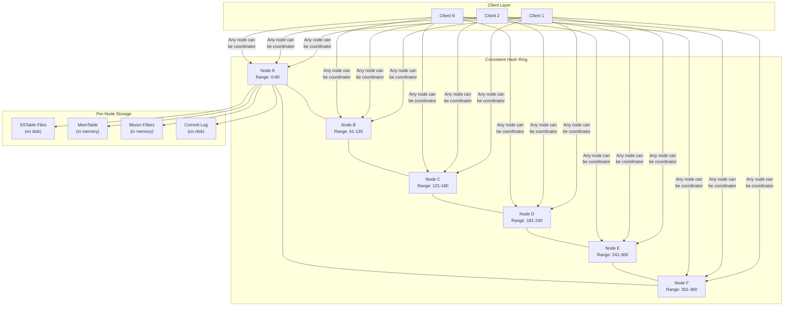
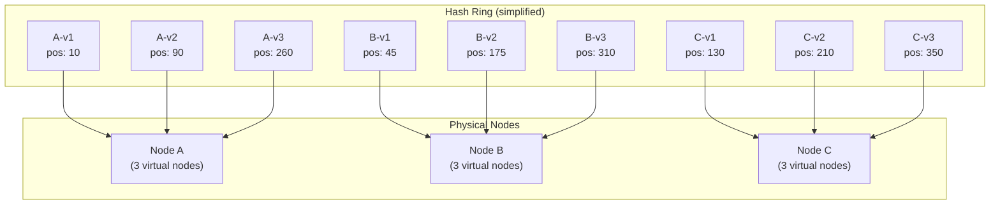
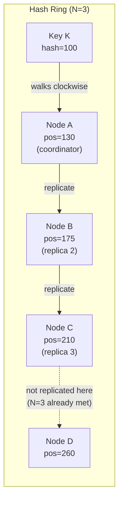
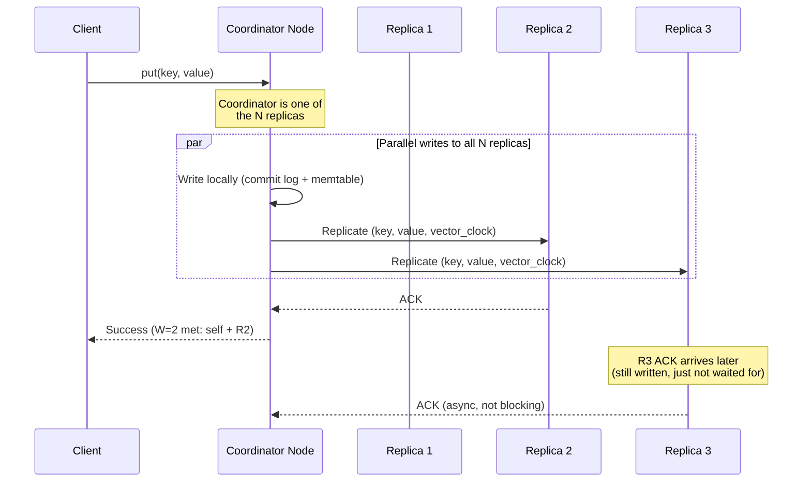
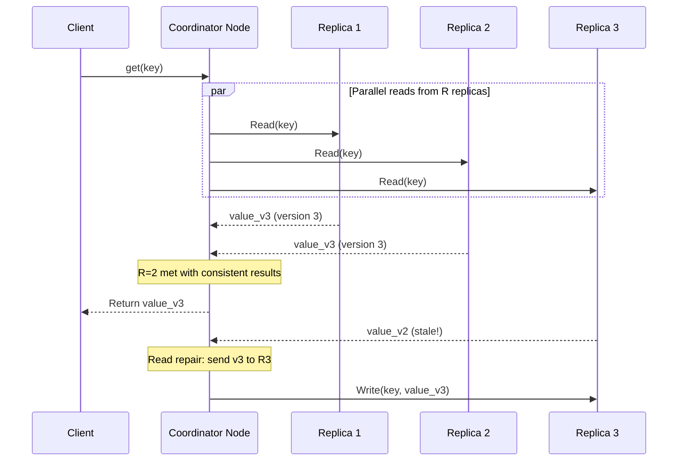
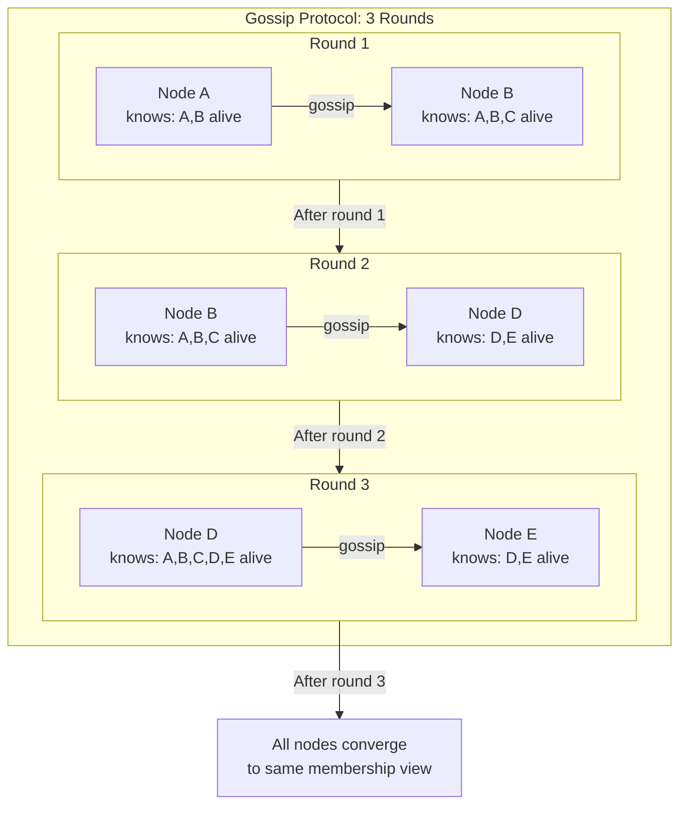
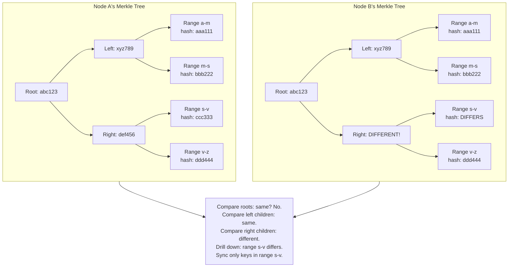

# Design a Distributed Key-Value Store

## Introduction

A distributed key-value store is one of the most fundamental building blocks in modern infrastructure. Systems like Amazon DynamoDB, Apache Cassandra, and Riak power everything from user sessions to shopping carts to time-series data. The core challenge is deceptively simple: store and retrieve values by key. The complexity arises when you need to do this across hundreds of machines while handling network partitions, server failures, and concurrent writes, all with predictable low latency.

This topic is a favorite in Staff/Senior-level interviews because it touches on nearly every distributed systems concept: consistent hashing, replication, quorum protocols, conflict resolution, failure detection, and the fundamental tension between consistency and availability described by the CAP theorem.

---

## Requirements

### Functional Requirements

1. **put(key, value)**: Store a value associated with a key.
2. **get(key)**: Retrieve the value associated with a key.
3. **delete(key)**: Remove a key-value pair.
4. **Tunable consistency**: Allow callers to choose consistency level per operation.

### Non-Functional Requirements

1. **High availability**: The system remains operational even when individual nodes fail.
2. **Partition tolerance**: The system continues to function during network partitions.
3. **Horizontal scalability**: Add nodes to increase capacity without downtime.
4. **Low latency**: Single-digit millisecond reads and writes for typical operations.
5. **Tunable trade-offs**: Operators can choose where to sit on the consistency-availability spectrum.

---

## Capacity Estimation

For a large-scale deployment (e.g., supporting a major e-commerce platform):

| Metric | Value |
|--------|-------|
| Total data stored | 100 TB |
| Read QPS (average) | 500,000 |
| Write QPS (average) | 100,000 |
| Peak read QPS | 2,000,000 |
| Average value size | 1 KB |
| Number of nodes | 500-1,000 |
| Replication factor (N) | 3 |
| Raw storage needed | 100 TB x 3 = 300 TB |

> [!NOTE]
> The replication factor triples storage requirements. With 500 nodes, each node stores about 600 GB, which easily fits on a modern SSD. This gives comfortable headroom for the storage layer.

---

## High-Level Architecture



---

## Core Components Deep Dive

### 1. Data Partitioning: Consistent Hashing with Virtual Nodes

Data is distributed across nodes using consistent hashing. Each key is hashed to a position on a circular ring (typically 0 to 2^128 or 0 to 2^64). Each node is assigned a position on the ring, and a key is stored on the first node encountered when walking clockwise from the key's position.

**The problem with basic consistent hashing**: If nodes are placed at single positions, the key distribution can be uneven, especially when nodes have different capacities or when nodes join/leave.

**Virtual nodes**: Each physical node is represented by multiple virtual nodes (e.g., 150-250 virtual nodes per physical node) spread across the ring. This provides:

1. **Even distribution**: More virtual nodes mean a more uniform spread of keys.
2. **Heterogeneous hardware**: A more powerful machine gets more virtual nodes, so it handles more keys proportionally.
3. **Smoother rebalancing**: When a node joins or leaves, only a small fraction of keys move, and the load shift is distributed across many other nodes.



**Key assignment example**: A key hashing to position 100 walks clockwise and lands on C-v1 at position 130, so it is stored on physical Node C (and replicated to the next N-1 distinct physical nodes on the ring).

### 2. Data Replication

For durability and availability, each key is replicated to N nodes (typically N=3). The node responsible for a key (the one it hashes to on the ring) is the **coordinator** for that key. The key is also stored on the next N-1 distinct physical nodes walking clockwise on the ring.

**Preference list**: The ordered list of nodes responsible for a key. If virtual nodes v1, v2, v3 map to physical nodes A, A, B respectively, the preference list skips duplicates and might be [A, B, C] -- always N distinct physical nodes.



### 3. Consistency vs Availability: Tunable Quorums

The system uses quorum-based reads and writes with configurable parameters:

- **N**: Number of replicas (typically 3).
- **W**: Number of replicas that must acknowledge a write for it to succeed.
- **R**: Number of replicas that must respond to a read for it to succeed.

| Configuration | W | R | Guarantee | Use Case |
|--------------|---|---|-----------|----------|
| Strong consistency | 2 | 2 | R + W > N (2+2=4 > 3): guaranteed overlap | Financial data, inventory counts |
| Favor write availability | 1 | 3 | Fast writes, slow reads | Logging, event ingestion |
| Favor read availability | 3 | 1 | Slow writes, fast reads | User profile reads |
| Eventual consistency | 1 | 1 | Fastest, but may read stale data | Shopping cart, session data |

**The key insight**: When R + W > N, at least one node in the read quorum must have the latest write. This guarantees the read returns the most recent data (assuming the client picks the response with the highest version/timestamp).

> [!TIP]
> In an interview, draw the Venn diagram of R and W overlapping within N. This visual makes the quorum guarantee immediately intuitive. When R + W > N, the read set and write set must overlap, so you are guaranteed to see the latest write.

### 4. Write Path



**Write process on each node**:

1. **Append to commit log**: Durable write to disk. This survives crashes.
2. **Write to memtable**: In-memory sorted data structure (e.g., red-black tree or skip list). Fast to read and write.
3. **Flush to SSTable**: When the memtable exceeds a size threshold, it is flushed to disk as an immutable Sorted String Table (SSTable).
4. **Compaction**: Background process merges multiple SSTables, removing deleted entries and duplicates.

This is the LSM-tree (Log-Structured Merge Tree) storage engine design, used by Cassandra, RocksDB, LevelDB, and HBase.

### 5. Read Path



**Read process on each node**:

1. **Check memtable**: If the key is in the current memtable, return immediately.
2. **Check Bloom filters**: Each SSTable has an associated Bloom filter. Check these to skip SSTables that definitely do not contain the key.
3. **Search SSTables**: Check SSTables from newest to oldest. Return the first (most recent) match.

**Read repair**: If the coordinator detects that some replicas returned stale data (older version), it asynchronously sends the latest value to those replicas. This is a passive anti-entropy mechanism that gradually heals inconsistencies during normal read traffic.

### 6. Conflict Resolution: Vector Clocks

When multiple clients write to the same key concurrently (especially during network partitions), the system must detect and resolve conflicts.

**Vector clocks** track causality. Each node maintains a vector of (node_id, counter) pairs for each key.

**Example**:

```
Initial state: key="cart", value="[item_A]", clock=[(A,1)]

Client 1 (via Node A): add item_B
  clock becomes [(A,2)]
  value = "[item_A, item_B]"

Client 2 (via Node B): add item_C (concurrent, based on (A,1))
  clock becomes [(A,1), (B,1)]
  value = "[item_A, item_C]"

These clocks are not comparable (neither dominates the other).
This is a CONFLICT that must be resolved.
```

**Resolution strategies**:

| Strategy | How It Works | Pros | Cons |
|----------|-------------|------|------|
| Last-Write-Wins (LWW) | Use wall-clock timestamp, latest wins | Simple, no client logic | Data loss (losing write is silently discarded) |
| Application-level merge | Return both versions to client, client merges | No data loss | Complex client logic |
| CRDTs | Use conflict-free data types | Automatic merge, no data loss | Limited data type support |

**DynamoDB approach**: Uses LWW by default but supports conditional writes (optimistic locking with version numbers) for stronger guarantees.

**Cassandra approach**: Uses LWW with timestamps. Requires NTP-synchronized clocks across all nodes.

> [!WARNING]
> Vector clocks can grow unbounded if many nodes coordinate writes to the same key. In practice, systems truncate vector clocks by removing the oldest entries when the clock exceeds a size threshold. This can occasionally cause false conflicts, which is acceptable.

### 7. Failure Detection: Gossip Protocol

Nodes must detect when other nodes have failed so they can reroute requests and trigger recovery mechanisms.

**Gossip protocol**:

1. Every second, each node picks a random other node and sends its membership list (which nodes it considers alive, with timestamps).
2. The receiving node merges the incoming list with its own.
3. If a node has not been heard from in T seconds (e.g., 30 seconds), it is suspected failed.
4. If the suspicion persists for another T seconds without any node contradicting it, the node is marked as permanently failed.

**Why gossip?** It is decentralized (no single failure detector that is itself a single point of failure), eventually consistent, and scales well. Each node communicates with O(log N) other nodes per gossip round, so information propagates through the entire cluster in O(log N) rounds.



### 8. Handling Temporary Failures: Hinted Handoff

When a node in the preference list is temporarily unavailable (e.g., being restarted), the system uses hinted handoff to maintain write availability.

**How it works**:

1. A write is destined for Node A, which is temporarily down.
2. The coordinator sends the write to the next healthy node on the ring (e.g., Node D), along with a "hint" indicating that this data belongs to Node A.
3. Node D stores the data in a separate hints partition.
4. When Node A comes back online, Node D replays all hinted data to Node A.
5. After successful replay, Node D deletes the hints.

This allows the system to maintain its W quorum even when a replica is down, as long as enough other nodes are available.

> [!IMPORTANT]
> Hinted handoff is a temporary measure. If hints accumulate for too long (e.g., a node is down for hours), the system should fall back to full repair mechanisms (anti-entropy with Merkle trees) rather than relying on an ever-growing hint queue.

### 9. Handling Permanent Failures: Anti-Entropy with Merkle Trees

When a node has been down for an extended period or has experienced data corruption, it needs to synchronize its data with other replicas. Comparing every key between two nodes would be extremely expensive. Merkle trees make this efficient.

**How Merkle trees work for replica synchronization**:

1. Each node builds a Merkle tree (hash tree) over its key ranges.
2. Leaf nodes contain the hash of a key range (e.g., keys from "a" to "azzz").
3. Parent nodes contain the hash of their children's hashes.
4. The root hash summarizes the entire dataset.

**Comparison process**:



**Efficiency**: By comparing root hashes first and drilling down only where differences exist, Merkle trees reduce the amount of data transferred to just the divergent ranges. If two replicas are 99.99% identical (common case), only a tiny fraction of keys need to be compared and synced.

---

## Data Models & Storage

### On-Disk Storage: LSM Tree

| Component | Description |
|-----------|------------|
| Commit log | Append-only file for durability. Every write is logged before being applied to the memtable. |
| Memtable | In-memory sorted structure. Serves recent reads and accumulates writes. |
| SSTables | Immutable sorted files on disk. Created when memtable flushes. |
| Bloom filters | Per-SSTable probabilistic structure. Quickly rules out SSTables that do not contain a key. |
| Index files | Sparse index into each SSTable for binary search. |

### Key-Value Record Format

| Field | Type | Size | Description |
|-------|------|------|-------------|
| key | bytes | Variable (max 256 B) | The lookup key |
| value | bytes | Variable (max 1 MB) | The stored value |
| version | vector_clock | Variable | Causality tracking |
| timestamp | int64 | 8 bytes | Wall-clock time for LWW |
| tombstone | bool | 1 byte | True if deleted (soft delete) |
| checksum | uint32 | 4 bytes | CRC32 for data integrity |

> [!NOTE]
> Deletes are handled via tombstones (soft deletes). The key is marked as deleted but not physically removed. Tombstones are cleaned up during compaction after a grace period (e.g., 10 days) to ensure the delete propagates to all replicas.

### Metadata Store (per cluster)

| Data | Storage | Description |
|------|---------|-------------|
| Ring topology | Each node (gossip) | Which virtual nodes map to which physical nodes |
| Node health | Each node (gossip) | Alive/dead status, suspicion timestamps |
| Cluster config | ZooKeeper or etcd | Replication factor, consistency defaults, schema |

---

## System Comparison

| Feature | DynamoDB | Cassandra | Riak |
|---------|---------|-----------|------|
| **Data model** | Key-value + document (JSON) | Wide-column (row key + column families) | Key-value + CRDTs |
| **Partitioning** | Consistent hashing (managed) | Consistent hashing (virtual nodes) | Consistent hashing (virtual nodes) |
| **Replication** | Synchronous within region, async cross-region | Tunable (NetworkTopologyStrategy) | Tunable (N, R, W) |
| **Consistency** | Strong or eventual (per-request) | Tunable (ONE, QUORUM, ALL) | Tunable (N, R, W) |
| **Conflict resolution** | LWW or conditional writes | LWW (timestamp-based) | Vector clocks + CRDT merge |
| **Failure detection** | Managed (AWS) | Gossip protocol | Gossip protocol |
| **Anti-entropy** | Managed (AWS) | Merkle tree repair | Merkle tree + active anti-entropy |
| **Hinted handoff** | Yes (managed) | Yes | Yes |
| **Transactions** | Single-item ACID; TransactWriteItems for multi-item | Lightweight transactions (Paxos) | No transactions |
| **Deployment** | Fully managed (AWS) | Self-hosted or managed (DataStax) | Self-hosted |
| **Sweet spot** | Serverless, variable workloads | Time-series, high-write workloads | High availability, conflict-heavy writes |

---

## Scalability Strategies

### Adding Nodes (Scale Out)

1. New node joins the ring and is assigned virtual nodes.
2. Gossip protocol propagates the membership change.
3. Keys that now belong to the new node are streamed from existing nodes.
4. During streaming, reads for affected keys are forwarded to the old owner.
5. Once streaming completes, the new node serves traffic for its ranges.

### Handling Hot Keys

Some keys receive disproportionate traffic (e.g., a viral post, a celebrity's profile).

**Strategies**:
- **Read replicas**: For read-heavy hot keys, replicate to additional nodes beyond the standard N.
- **Client-side caching**: Cache hot keys at the application layer with short TTLs.
- **Key splitting**: Append a random suffix to the hot key (e.g., `hot_key_1`, `hot_key_2`, ... `hot_key_10`) to spread reads across 10 partitions. The client reads from a random suffix.

### Compaction Strategy

| Strategy | Description | Use Case |
|----------|------------|----------|
| Size-tiered | Merge SSTables of similar sizes | Write-heavy workloads |
| Leveled | Organize SSTables into levels with size limits | Read-heavy workloads (fewer SSTables to search) |
| Time-window | Compact within time windows | Time-series data (easy to drop old data) |

---

## Design Trade-offs

### Consistency vs Availability (CAP)

The CAP theorem states that during a network partition, you must choose between consistency and availability. This system lets the operator choose:

| Choice | Behavior During Partition | Trade-off |
|--------|--------------------------|-----------|
| Choose consistency (CP) | Reject writes that cannot reach W replicas | Writes may fail, but no stale reads |
| Choose availability (AP) | Accept writes at any reachable node | All writes succeed, but reads may be stale |

**Decision**: Default to AP with tunable consistency per operation. For most use cases (shopping carts, sessions), availability is more important. For specific operations (inventory decrements), use stronger consistency settings.

### LSM Tree vs B-Tree

| LSM Tree | B-Tree |
|----------|--------|
| Write-optimized (sequential writes) | Read-optimized (in-place updates) |
| Higher write throughput | Lower write throughput |
| Read amplification (multiple SSTables) | Single lookup path |
| Space amplification (dead entries until compaction) | No space amplification |
| Used by Cassandra, RocksDB | Used by PostgreSQL, MySQL InnoDB |

**Decision**: LSM tree for write-heavy key-value workloads. The write amplification of B-trees (random I/O for every write) is a bottleneck at high write volumes.

### Vector Clocks vs Last-Write-Wins

| Vector Clocks | Last-Write-Wins |
|---------------|----------------|
| Detects true conflicts | Silently drops concurrent writes |
| Requires application-level merge logic | No merge logic needed |
| Vector grows with number of coordinators | Constant overhead (single timestamp) |
| No data loss | Potential data loss |

> [!WARNING]
> LWW depends on synchronized clocks. Even with NTP, clock skew between machines can be tens of milliseconds. In extreme cases, a write with a "later" timestamp might actually be an earlier write. Google's TrueTime (used in Spanner) addresses this with bounded clock uncertainty, but it requires specialized hardware.

---

## Interview Cheat Sheet

### Key Points to Mention

1. **Consistent hashing with virtual nodes**: Even data distribution, smooth rebalancing.
2. **Replication to N successor nodes**: Preference list with N distinct physical nodes.
3. **Quorum reads/writes (R + W > N)**: Guarantees overlap between read and write sets.
4. **Vector clocks**: Detect concurrent writes and true conflicts.
5. **Gossip protocol**: Decentralized failure detection and membership management.
6. **Hinted handoff**: Maintain availability during temporary node failures.
7. **Merkle trees**: Efficient anti-entropy repair for permanent failures.
8. **LSM tree storage**: Write-optimized on-disk storage with memtable, SSTables, and compaction.

### Common Interview Questions and Answers

**Q: How does the system handle a network partition between two data centers?**
A: Both sides continue to accept writes independently (AP mode). When the partition heals, Merkle tree-based anti-entropy identifies divergent keys. Vector clocks detect conflicts, which are resolved either by LWW or application-level merge, depending on configuration.

**Q: What happens when a coordinator node fails mid-write?**
A: The client times out and retries. The retry may hit a different coordinator. Since the write is idempotent (same key, value, and version), the new coordinator processes it correctly. Any partial writes on the failed node are reconciled when it recovers via hinted handoff or anti-entropy.

**Q: How do you handle range queries?**
A: Basic consistent hashing does not support range queries efficiently because adjacent keys hash to random ring positions. To support range queries, use order-preserving partitioning (keys are assigned to ranges in sorted order). However, this can cause hot spots. Cassandra handles this with compound partition keys where the partition key determines the node and the clustering key determines sort order within a partition.

**Q: Why not just use a relational database?**
A: Relational databases struggle at this scale because: (1) sharding is complex and often requires application-level logic, (2) cross-shard joins are expensive, (3) schema changes on billions of rows are disruptive, and (4) the ACID guarantees of a relational DB are stronger (and more expensive) than what most key-value workloads need.

> [!TIP]
> The core narrative of this design is the tension between consistency, availability, and partition tolerance. Frame every design decision as a trade-off on this spectrum. The interviewer wants to see that you understand there is no "right" answer -- only trade-offs appropriate for specific use cases.
