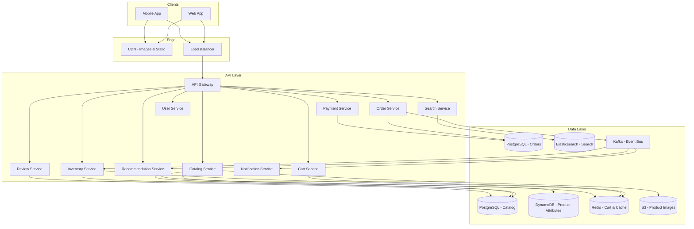
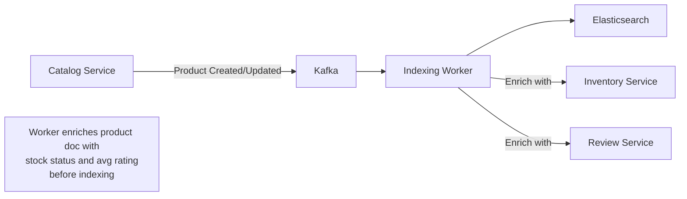
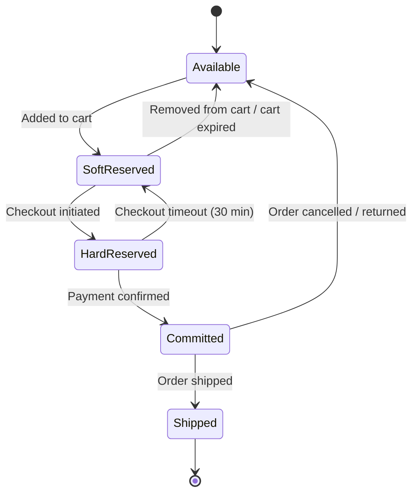
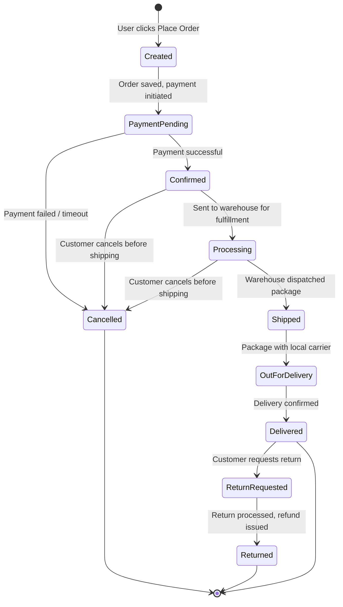
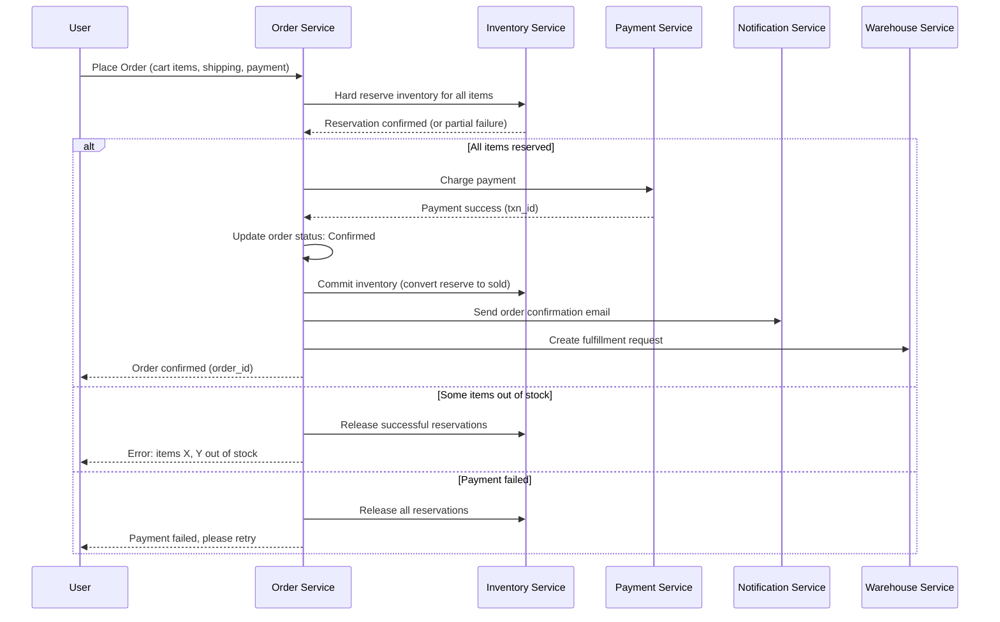
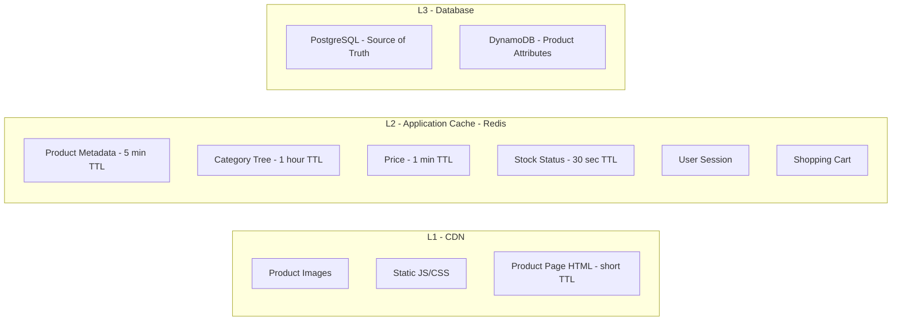

# System Design Interview: E-Commerce Platform
### Amazon / Shopify Scale

> [!NOTE]
> **Staff Engineer Interview Preparation Guide** — High Level Design Round

---

## Table of Contents

1. [Problem Clarification & Requirements](#1-problem-clarification--requirements)
2. [Capacity Estimation & Scale](#2-capacity-estimation--scale)
3. [High-Level Architecture](#3-high-level-architecture)
4. [Core Components Deep Dive](#4-core-components-deep-dive)
5. [Product Catalog Service](#5-product-catalog-service)
6. [Search Service](#6-search-service)
7. [Shopping Cart](#7-shopping-cart)
8. [Inventory Management](#8-inventory-management)
9. [Checkout & Order Service](#9-checkout--order-service)
10. [Payment Processing](#10-payment-processing)
11. [Recommendation Engine](#11-recommendation-engine)
12. [Data Models & Storage](#12-data-models--storage)
13. [Scalability Strategies](#13-scalability-strategies)
14. [Design Trade-offs & Justifications](#14-design-trade-offs--justifications)
15. [Interview Cheat Sheet](#15-interview-cheat-sheet)

---

## 1. Problem Clarification & Requirements

> [!TIP]
> **Interview Tip:** E-commerce is a breadth question. The interviewer wants to see that you can identify the critical subsystems and go deep on the ones that matter most. Do not try to design everything in equal depth. After listing the components, ask which area the interviewer wants you to focus on. If they say "your choice," go deep on inventory management and checkout — that is where the interesting distributed systems challenges live.

### Questions to Ask the Interviewer

| Category | Question | Why It Matters |
|----------|----------|----------------|
| **Scale** | How many products? How many daily active users? | Catalog storage, search index size |
| **Catalog** | Single seller or marketplace (multiple sellers)? | Multi-tenancy, seller isolation |
| **Inventory** | Single warehouse or distributed fulfillment? | Inventory partitioning strategy |
| **Search** | How critical is search relevance? Autocomplete? | Search infrastructure complexity |
| **Checkout** | Synchronous or async order confirmation? | Consistency model |
| **Payment** | Multiple payment methods? International currencies? | Payment routing complexity |
| **Delivery** | In-house logistics or third-party carriers? | Integration scope |
| **Peak events** | Black Friday / Prime Day scale? | Capacity planning and queue-based processing |

---

### Functional Requirements (Agreed Upon)

- Sellers can list products with descriptions, images, pricing, and inventory counts
- Users can search and browse products by category, filters, and keywords
- Users can add products to a shopping cart (persistent across sessions)
- Users can check out: select shipping, enter payment, and place an order
- Order tracking: users see order status from placement through delivery
- Users can leave reviews and ratings on purchased products
- Users receive product recommendations based on browsing and purchase history
- Sellers can manage orders and update fulfillment status

### Non-Functional Requirements

- **Availability:** 99.99% uptime — revenue loss during downtime is substantial
- **Latency:** Product page load < 200ms, search results < 300ms, checkout < 2s
- **Scale:** 500 million products, 100 million DAU, 5 million orders/day
- **Consistency:** Inventory must be accurate — never sell a product that is out of stock
- **Durability:** Orders and payments must never be lost
- **Eventual consistency acceptable for:** Catalog updates, reviews, recommendations

---

## 2. Capacity Estimation & Scale

> [!TIP]
> **Interview Tip:** E-commerce has extremely high read-to-write ratios. For every order placed, there are hundreds of product page views and search queries. Your architecture should be optimized for reads, with writes handled carefully for correctness.

### Traffic Estimation

```
Daily Active Users (DAU)    = 100 Million
Products in catalog         = 500 Million
Orders per day              = 5 Million
Average items per order     = 3

Page views per user per day = 20
Total page views/day        = 100M * 20 = 2 Billion

Read QPS:
  2B / 86,400 = ~23,000 reads/sec
  Peak (3x): ~70,000 reads/sec

Search queries:
  ~40% of page views involve search = 800M/day
  Search QPS: ~9,200/sec, peak ~28,000/sec

Order QPS:
  5M / 86,400 = ~58 orders/sec
  Peak (5x for flash sales): ~290 orders/sec

Cart operations:
  Average 5 cart actions per order = 25M/day
  Cart QPS: ~290/sec, peak ~1,500/sec

Read:Write ratio = ~400:1 (views to orders)
```

### Storage Estimation

```
Product record:
  - Metadata (title, description, attributes) = ~5 KB
  - Images (stored in object storage, DB has URLs) = ~200 bytes of URLs
  - 500M products = ~2.5 TB metadata

Product images:
  - 5 images per product, avg 500 KB each
  - 500M * 5 * 500 KB = 1.25 PB in object storage (S3)

Orders:
  - Order + items = ~2 KB per order
  - 5M/day = 10 GB/day = ~3.6 TB/year

User data:
  - Profile + preferences = ~1 KB per user
  - 500M total users = 500 GB

Reviews:
  - Average 200 bytes per review
  - 2M new reviews/day = 400 MB/day = ~146 GB/year

Shopping cart (active):
  - ~10M active carts at any time
  - ~500 bytes per cart = 5 GB (fits comfortably in Redis)
```

---

## 3. High-Level Architecture

> [!TIP]
> **Interview Tip:** E-commerce platforms are the canonical example of microservices architecture. Each bounded context (catalog, cart, order, payment, inventory) is a separate service with its own database. This allows independent scaling, deployment, and technology choices. Call this out explicitly when drawing the architecture.



### Service Responsibilities

| Service | Owns | Database |
|---------|------|----------|
| **Catalog Service** | Product CRUD, categories, images | PostgreSQL + DynamoDB + S3 |
| **Search Service** | Full-text search, autocomplete, facets | Elasticsearch |
| **Cart Service** | Cart CRUD, cart persistence | Redis (active) + DynamoDB (abandoned) |
| **Order Service** | Order lifecycle, state management | PostgreSQL |
| **Payment Service** | Charge, refund, payment methods | PostgreSQL |
| **Inventory Service** | Stock levels, reservations | PostgreSQL + Redis cache |
| **Recommendation Service** | Personalized suggestions | Redis + precomputed models |
| **User Service** | Auth, profiles, addresses | PostgreSQL |
| **Review Service** | Reviews, ratings, moderation | PostgreSQL |
| **Notification Service** | Email, push, SMS | Kafka consumer |

---

## 4. Core Components Deep Dive

### API Gateway

The API gateway is the single entry point for all client requests. It handles:

- **Authentication:** Validates JWT tokens, attaches user context
- **Rate limiting:** Per-user and per-IP limits to prevent abuse
- **Request routing:** Routes to the appropriate microservice
- **Response aggregation:** For pages that need data from multiple services (e.g., product page needs catalog + reviews + recommendations)
- **Circuit breaking:** Prevents cascade failures when a downstream service is unhealthy

> [!NOTE]
> For the product detail page, the API gateway makes parallel calls to Catalog Service (product info), Review Service (ratings), Recommendation Service (similar products), and Inventory Service (stock status). If any non-critical call fails (e.g., recommendations), the page still loads with the critical data.

---

## 5. Product Catalog Service

### Hierarchical Categories

Products are organized in a tree structure:

```
Electronics
  -> Phones
    -> Smartphones
      -> Android Phones
      -> iPhones
    -> Feature Phones
  -> Laptops
    -> Gaming Laptops
    -> Ultrabooks
  -> Accessories
```

**Implementation:** Each category has a `parent_id` reference. For efficient tree queries (find all products under "Electronics" including subcategories), use a materialized path or nested set model.

```
Materialized Path approach:
  Category: "iPhones"
  Path: "/electronics/phones/smartphones/iphones"

  Query: Find all products in Electronics and below:
  SELECT * FROM products WHERE category_path LIKE '/electronics/%'
```

### Product Variants and SKUs

A single product (e.g., "iPhone 15") has multiple variants (128GB Black, 256GB Blue, etc.). Each variant is a separate SKU with its own price, inventory count, and attributes.

```
Product: iPhone 15
  |
  |-- SKU: IPH15-128-BLK (128GB, Black, $799)
  |-- SKU: IPH15-128-BLU (128GB, Blue, $799)
  |-- SKU: IPH15-256-BLK (256GB, Black, $899)
  |-- SKU: IPH15-256-BLU (256GB, Blue, $899)

Attributes are key-value pairs:
  { "storage": "128GB", "color": "Black", "display": "6.1 inch" }
```

### Why DynamoDB for Product Attributes

Products across categories have wildly different attributes (a laptop has RAM and screen size; a shirt has size and fabric). A rigid SQL schema cannot accommodate this without hundreds of nullable columns or an EAV pattern that performs poorly.

DynamoDB's schemaless design stores each product's attributes as a JSON document:

```json
{
  "product_id": "PROD-123",
  "title": "iPhone 15",
  "category_path": "/electronics/phones/smartphones/iphones",
  "base_price_cents": 79900,
  "attributes": {
    "brand": "Apple",
    "display_size": "6.1 inches",
    "chip": "A16 Bionic",
    "water_resistant": true
  },
  "variants": [
    {
      "sku": "IPH15-128-BLK",
      "price_cents": 79900,
      "attributes": { "storage": "128GB", "color": "Black" }
    }
  ]
}
```

> [!IMPORTANT]
> PostgreSQL stores the relational data (product ID, seller ID, category, status, timestamps). DynamoDB stores the flexible attribute data. The product ID is the join key between them. This is a polyglot persistence pattern.

---

## 6. Search Service

> [!TIP]
> **Interview Tip:** Search is often the primary way users find products. A poor search experience directly impacts revenue. When discussing search, cover three layers: indexing (how data gets into the search engine), querying (how search requests are processed), and ranking (how results are ordered).

### Elasticsearch Architecture

```
Index: products
  Document fields:
    - title (text, analyzed)
    - description (text, analyzed)
    - category (keyword, not analyzed)
    - brand (keyword)
    - price (float)
    - rating (float)
    - sales_count (integer)
    - attributes.* (dynamic mapping)
    - in_stock (boolean)
```

### Indexing Pipeline



When a seller updates a product, the Catalog Service publishes a `product.updated` event to Kafka. An indexing worker consumes the event, enriches the document with stock status and average rating, and upserts it into Elasticsearch.

### Faceted Search

Faceted search allows users to filter results by attributes (brand, price range, color, rating). Elasticsearch aggregations power this:

```
User searches: "laptop"
Response includes:
  - Results: [MacBook Air, ThinkPad X1, Dell XPS, ...]
  - Facets:
    - Brand: [Apple (42), Lenovo (38), Dell (35), HP (29)]
    - Price: [$0-500 (15), $500-1000 (67), $1000-2000 (45), $2000+ (17)]
    - RAM: [8GB (30), 16GB (55), 32GB (40), 64GB (19)]
    - Screen: [13" (35), 14" (40), 15" (50), 16"+ (19)]

When user selects "Brand: Apple" + "RAM: 16GB":
  - Results are filtered to Apple laptops with 16GB RAM
  - Other facets update to reflect the filtered set
```

### Autocomplete

Autocomplete suggestions appear as the user types. This requires a different data structure than full-text search:

```
Approach: Edge N-gram tokenizer + Completion Suggester

When user types "lap":
  -> Suggestions: "laptop", "laptop stand", "laptop bag", "laptop sleeve"

Implementation:
  - Separate "suggestions" index with completion suggester field
  - Populated from: popular search terms, product titles, category names
  - Updated daily from search analytics
  - Weighted by search frequency (popular terms rank higher)

Latency requirement: < 50ms (user expects instant response while typing)
```

### Ranking Algorithm

Results are ranked by a weighted combination of factors:

```
Score = w1 * text_relevance
      + w2 * sales_velocity
      + w3 * avg_rating
      + w4 * conversion_rate
      + w5 * recency
      + w6 * seller_quality_score
      - penalty_if_out_of_stock

Elasticsearch function_score query combines these signals.
Text relevance comes from BM25 scoring on title and description.
Business metrics (sales, rating) are stored as document fields and updated periodically.
```

> [!WARNING]
> Do not update Elasticsearch in real-time for every sale or rating change. Batch-update these fields every 15-30 minutes. Real-time updates at scale would overwhelm the indexing pipeline and degrade search latency.

---

## 7. Shopping Cart

### Guest Cart vs Logged-In Cart

| Aspect | Guest Cart | Logged-In Cart |
|--------|-----------|---------------|
| **Storage** | Browser localStorage + server-side Redis keyed by session ID | Redis keyed by user ID |
| **Persistence** | Lost if cookies/session cleared | Persistent across devices |
| **Merge on login** | Guest cart items are merged into logged-in cart | N/A |
| **Expiry** | 7-day TTL in Redis | 30-day TTL in Redis, then archived to DynamoDB |

### Cart Merge Strategy

When a guest user logs in and has items in both their guest cart and their persistent cart:

```
Merge Rules:
  1. If an item exists in both carts, keep the higher quantity
  2. If an item exists only in one cart, add it to the merged cart
  3. Re-validate all items: check price changes, stock availability
  4. Notify user of any changes: "Price of Item X changed from $29 to $34"
```

### Cart Data Structure in Redis

```
Key: cart:{user_id} or cart:session:{session_id}
Type: Hash

Fields:
  item:{sku_id} -> JSON { "sku_id": "IPH15-128-BLK", "quantity": 2, "added_at": "...", "price_at_add": 79900 }

Operations:
  HSET cart:user123 item:IPH15-128-BLK '{"quantity": 2, ...}'   -- Add/update item
  HDEL cart:user123 item:IPH15-128-BLK                          -- Remove item
  HGETALL cart:user123                                            -- Get full cart
  HLEN cart:user123                                               -- Item count

TTL: 30 days, refreshed on every cart operation
```

> [!NOTE]
> We store `price_at_add` in the cart to detect price changes. When the user views their cart or proceeds to checkout, we compare `price_at_add` with the current price and alert them if it changed. We always charge the current price, not the price at the time of adding.

### Cart to Checkout Transition

When the user clicks "Proceed to Checkout," the cart is frozen:

```
1. Read all items from Redis cart
2. For each item:
   a. Verify product still exists and is active
   b. Check current price (may differ from price_at_add)
   c. Check stock availability
   d. Apply any promotions or coupons
3. Create a checkout session with the validated cart snapshot
4. If any item is out of stock: inform user, do NOT block checkout for remaining items
5. Checkout session has a 30-minute expiry
```

---

## 8. Inventory Management

> [!TIP]
> **Interview Tip:** Inventory management is the hardest consistency problem in e-commerce. The challenge is preventing overselling (selling more units than you have in stock) while minimizing the chance of false stock-outs (showing "out of stock" when stock actually exists). This is a tension between consistency and availability.

### Reservation Pattern

Inventory goes through a three-phase lifecycle during the purchase flow:



**Soft Reserve (Add to Cart):**

```
When user adds 2 units of SKU-123 to cart:
  - Decrement "available_for_display" counter in Redis
  - This is a hint counter — it may be slightly inaccurate
  - Purpose: show realistic stock levels to other users
  - NOT a hard guarantee — multiple users may soft-reserve the same unit
  - If total soft reserves > actual stock, some users will see "out of stock" at checkout

Soft reserve is intentionally loose. It's a UX optimization, not a correctness guarantee.
```

**Hard Reserve (Checkout):**

```
When user clicks "Place Order":
  - Database transaction:
    BEGIN;
    SELECT stock_count FROM inventory WHERE sku_id = ? FOR UPDATE;
    -- If stock_count >= requested_quantity:
    UPDATE inventory SET stock_count = stock_count - ?, reserved_count = reserved_count + ?
    WHERE sku_id = ? AND stock_count >= ?;
    -- If rows_affected = 0: out of stock
    COMMIT;

  - Hard reserve has a 30-minute timeout
  - If payment is not confirmed within 30 minutes, a background job releases the reservation
```

**Committed (Payment Confirmed):**

```
After successful payment:
  - UPDATE inventory SET reserved_count = reserved_count - ?
    WHERE sku_id = ?;
  - The stock_count was already decremented during hard reserve
  - This is now a permanent deduction
```

### Distributed Inventory (Multiple Warehouses)

```
Scenario: Product available in 3 warehouses
  - Warehouse NYC: 50 units
  - Warehouse LAX: 30 units
  - Warehouse CHI: 20 units
  - Total available: 100 units

Fulfillment routing:
  1. Determine customer's shipping address
  2. Find nearest warehouse with stock
  3. Reserve from that warehouse
  4. If nearest warehouse is out of stock, try next-nearest

Display to customer:
  - Show aggregate availability: "In Stock (100 units)"
  - Do NOT show per-warehouse breakdown
  - Shipping estimate based on nearest warehouse with stock
```

> [!WARNING]
> When inventory is distributed, you must be careful about the aggregation. If you cache the aggregate count and two warehouses sell their last units simultaneously, the aggregate cache may still show "in stock." Always check the actual warehouse inventory during hard reserve.

---

## 9. Checkout & Order Service

### Order State Machine



### Checkout Flow



### Event-Driven Order Processing

After the synchronous checkout completes, the remaining order lifecycle is event-driven:

```
Order Confirmed event -> Kafka

Consumers:
  1. Warehouse Service: Creates pick-pack-ship order
  2. Notification Service: Sends confirmation email
  3. Analytics Service: Records sale for reporting
  4. Recommendation Service: Updates purchase history
  5. Inventory Service: Updates search index (stock status)

Each consumer processes independently. If one fails, others are unaffected.
Kafka guarantees at-least-once delivery. Each consumer must be idempotent.
```

### Pricing, Coupons, and Promotions

The pricing engine calculates the final price during checkout:

```
Price Calculation Pipeline:
  1. Base price (from catalog)
  2. - Seller discount (if any active sale)
  3. - Coupon discount (user-applied coupon code)
  4. - Promotion discount (buy 2 get 1 free, bundle deals)
  5. + Tax (based on shipping address and product category)
  6. + Shipping fee (based on weight, distance, speed)
  7. = Final price

Rules:
  - Coupons and promotions do not stack (use the better discount)
  - Minimum order value for free shipping
  - Maximum discount cap per coupon
  - Coupon usage limits (per user, total uses)
```

> [!NOTE]
> The pricing engine must be deterministic. Given the same inputs (cart items, coupon, shipping address), it must always produce the same total. This is critical for auditing and dispute resolution. Store the full price breakdown with each order.

---

## 10. Payment Processing

### Idempotency

Every payment operation must be idempotent. The order ID serves as the natural idempotency key:

```
POST /api/payments/charge
{
  "idempotency_key": "order_ORD789_charge_1",
  "amount_cents": 15997,
  "currency": "USD",
  "payment_method_id": "pm_visa_4242",
  "order_id": "ORD789"
}

If this request is sent twice (network retry, user double-click):
  - Payment gateway recognizes the idempotency key
  - Returns the same result without charging again
```

### Multi-Method Payment

Some orders may be paid with multiple methods (e.g., gift card + credit card):

```
Order total: $150.00
  - Gift card balance: $50.00 -> Charge $50 to gift card
  - Credit card: -> Charge $100 to credit card

If credit card charge fails:
  - Reverse the gift card charge
  - Inform user: "Payment failed"

This is a distributed transaction across two payment methods.
Use the Saga pattern: charge gift card first (reversible), then credit card.
If credit card fails, compensate by reversing the gift card charge.
```

### Refund Handling

```
Refund scenarios:
  1. Full cancellation before shipping -> Full refund
  2. Partial cancellation (some items) -> Partial refund
  3. Return after delivery -> Refund after return received
  4. Damaged item -> Immediate refund or replacement

Refund to original payment method:
  - Credit card: 5-10 business days
  - Gift card: Instant
  - Store credit: Instant (offered as faster alternative)
```

---

## 11. Recommendation Engine

### Collaborative Filtering

```
"Customers who bought X also bought Y"

Implementation:
  1. Build a user-item interaction matrix
     - Rows: users, Columns: products
     - Values: purchase count (or implicit signals: view, add-to-cart, buy)

  2. For product X, find users who bought X
  3. Find other products those users commonly bought
  4. Rank by co-purchase frequency
  5. Filter out products the current user already bought

Precomputed daily:
  - For each product, store top 20 "also bought" product IDs
  - Store in Redis: reco:also_bought:{product_id} -> [product_ids]
  - Serve from Redis at request time (sub-ms latency)
```

### Personalized Recommendations

```
User's home page recommendations:

Signals:
  - Recent browsing history (last 50 products viewed)
  - Purchase history (all time)
  - Cart contents (current)
  - Category affinity (weighted by recency)
  - Collaborative filtering (users similar to you)

Pipeline:
  1. Candidate generation: Pull 500 candidates from multiple sources
  2. Filtering: Remove already purchased, out-of-stock, irrelevant
  3. Ranking: ML model scores each candidate (CTR prediction)
  4. Diversification: Ensure mix of categories (not all phones)
  5. Return top 20

This pipeline is computed:
  - Real-time for logged-in users (using cached user features)
  - Precomputed for popular segments (new users, category browsers)
```

> [!TIP]
> **Interview Tip:** You do not need to design a full ML recommendation system. Mention collaborative filtering and content-based filtering at a high level. What matters is the system design: how recommendations are precomputed, cached, and served at low latency.

---

## 12. Data Models & Storage

### Database Schema

```
Table: products
  - product_id          UUID PRIMARY KEY
  - seller_id           UUID REFERENCES sellers
  - title               VARCHAR(500)
  - description         TEXT
  - category_path       VARCHAR(500)  -- "/electronics/phones/smartphones"
  - brand               VARCHAR(100)
  - base_price_cents    INTEGER
  - status              VARCHAR(20)  -- active, inactive, deleted
  - created_at          TIMESTAMP
  - updated_at          TIMESTAMP

Table: product_skus
  - sku_id              VARCHAR(50) PRIMARY KEY
  - product_id          UUID REFERENCES products
  - price_cents         INTEGER
  - attributes          JSONB  -- {"color": "Black", "storage": "128GB"}
  - weight_grams        INTEGER
  - dimensions_cm       JSONB  -- {"l": 15, "w": 7, "h": 1}
  - status              VARCHAR(20)

Table: inventory
  - sku_id              VARCHAR(50) REFERENCES product_skus
  - warehouse_id        UUID REFERENCES warehouses
  - stock_count         INTEGER
  - reserved_count      INTEGER
  - PRIMARY KEY (sku_id, warehouse_id)
  - CHECK (stock_count >= 0)
  - CHECK (reserved_count >= 0)
  - CHECK (reserved_count <= stock_count)

Table: orders
  - order_id            UUID PRIMARY KEY
  - user_id             UUID REFERENCES users
  - status              VARCHAR(20)  -- created, confirmed, processing, shipped, delivered, cancelled, returned
  - subtotal_cents      INTEGER
  - tax_cents           INTEGER
  - shipping_cents      INTEGER
  - discount_cents      INTEGER
  - total_cents         INTEGER
  - currency            VARCHAR(3)
  - shipping_address_id UUID
  - coupon_code         VARCHAR(50)
  - created_at          TIMESTAMP
  - confirmed_at        TIMESTAMP
  - shipped_at          TIMESTAMP
  - delivered_at        TIMESTAMP

Table: order_items
  - order_id            UUID REFERENCES orders
  - sku_id              VARCHAR(50)
  - quantity            INTEGER
  - unit_price_cents    INTEGER  -- price at time of purchase
  - discount_cents      INTEGER
  - PRIMARY KEY (order_id, sku_id)

Table: payments
  - payment_id          UUID PRIMARY KEY
  - order_id            UUID REFERENCES orders
  - amount_cents        INTEGER
  - currency            VARCHAR(3)
  - method              VARCHAR(50)  -- credit_card, gift_card, store_credit
  - gateway_txn_id      VARCHAR(100)
  - idempotency_key     VARCHAR(100) UNIQUE
  - status              VARCHAR(20)  -- pending, succeeded, failed, refunded
  - created_at          TIMESTAMP

Table: reviews
  - review_id           UUID PRIMARY KEY
  - product_id          UUID REFERENCES products
  - user_id             UUID REFERENCES users
  - order_id            UUID REFERENCES orders  -- must have purchased to review
  - rating              SMALLINT CHECK (rating BETWEEN 1 AND 5)
  - title               VARCHAR(200)
  - body                TEXT
  - helpful_count       INTEGER DEFAULT 0
  - status              VARCHAR(20)  -- pending_moderation, approved, rejected
  - created_at          TIMESTAMP
  - UNIQUE (user_id, product_id)  -- one review per product per user

Table: categories
  - category_id         UUID PRIMARY KEY
  - name                VARCHAR(100)
  - parent_id           UUID REFERENCES categories
  - path                VARCHAR(500)  -- materialized path
  - depth               SMALLINT
  - display_order       INTEGER

Table: users
  - user_id             UUID PRIMARY KEY
  - email               VARCHAR(255) UNIQUE
  - name                VARCHAR(100)
  - created_at          TIMESTAMP

Table: addresses
  - address_id          UUID PRIMARY KEY
  - user_id             UUID REFERENCES users
  - line1               VARCHAR(200)
  - line2               VARCHAR(200)
  - city                VARCHAR(100)
  - state               VARCHAR(50)
  - zip                 VARCHAR(20)
  - country             VARCHAR(2)
  - is_default          BOOLEAN
```

### Database Choice Justification

| Data | Database | Rationale |
|------|----------|-----------|
| **Orders, Payments** | PostgreSQL | ACID transactions for order placement and payment. Strong consistency required. |
| **Product Catalog (relational)** | PostgreSQL | Relational data (product-seller, product-category relationships). |
| **Product Attributes** | DynamoDB | Schemaless storage for heterogeneous product attributes across categories. Single-digit ms reads at any scale. |
| **Search Index** | Elasticsearch | Full-text search, faceted filtering, autocomplete. Inverted index optimized for text matching. |
| **Shopping Cart** | Redis | Low-latency reads/writes for active carts. Hash data structure maps naturally to cart items. TTL for automatic expiry. |
| **Sessions** | Redis | Ephemeral, low-latency. |
| **Product Images** | S3 + CDN | Object storage for binary assets. CDN for global distribution. |
| **Event Bus** | Kafka | Decoupled inter-service communication. At-least-once delivery. Partitioned for parallel consumption. |
| **Recommendations** | Redis | Precomputed recommendation lists served at sub-ms latency. |

---

## 13. Scalability Strategies

### Sharding

**Orders: Shard by user_id**

```
Rationale:
  - User views their own orders (most common query)
  - All of a user's orders are on the same shard -> single-shard query
  - Order placement writes go to one shard (the user's shard)

Cross-shard queries:
  - Seller views their orders -> fan out across shards (seller dashboard is less latency-sensitive)
  - Analytics/reporting -> use a separate OLAP replica
```

**Product catalog: Shard by product_id**

```
Rationale:
  - Product page reads are by product_id
  - Seller's product list can fan out (acceptable for management UI)
  - Category browse uses Elasticsearch, not PostgreSQL
```

### Caching Strategy



### Event-Driven Architecture

```
Key Events in the System:

product.created       -> Index in Elasticsearch, generate recommendations
product.updated       -> Re-index in Elasticsearch, invalidate cache
product.price_changed -> Update search index, notify wishlisted users
order.placed          -> Reserve inventory, charge payment
order.confirmed       -> Notify user, create fulfillment request, update analytics
order.shipped         -> Notify user, update tracking
order.delivered       -> Enable review, update delivery metrics
order.cancelled       -> Release inventory, process refund, notify user
inventory.low         -> Alert seller, update search index (boost in-stock alternatives)
review.submitted      -> Moderate, update product rating aggregate
```

> [!IMPORTANT]
> Every consumer of Kafka events must be idempotent. Kafka guarantees at-least-once delivery, meaning a consumer may receive the same event twice (e.g., after a rebalance). Use the event ID as a deduplication key.

### Read Replicas

```
PostgreSQL:
  - 1 primary (writes)
  - 3 read replicas (reads)
  - Replication lag: < 100ms under normal load

Read routing:
  - Order placement, payment -> Primary
  - Product browsing, order history -> Read replica
  - Seller dashboard -> Read replica (stale-by-100ms is acceptable)
  - Analytics -> Dedicated analytics replica (can be minutes behind)
```

---

## 14. Design Trade-offs & Justifications

### Trade-off 1: Strong vs Eventual Consistency

| Data | Consistency Level | Justification |
|------|------------------|---------------|
| **Inventory (hard reserve)** | Strong | Must prevent overselling |
| **Inventory (display count)** | Eventual | "Only 3 left!" can be stale by a few seconds |
| **Product catalog** | Eventual | Seller updates a price; 30-second propagation delay is acceptable |
| **Search index** | Eventual | 15-30 minute lag for search ranking updates is fine |
| **Order status** | Strong | Customer must see accurate order state |
| **Reviews** | Eventual | New review appearing a few minutes later is acceptable |

### Trade-off 2: Monolith vs Microservices

We chose microservices because:

- **Independent scaling:** Search traffic is 100x order traffic. Scaling them independently saves infrastructure cost.
- **Independent deployment:** Catalog team can deploy without affecting checkout.
- **Technology fit:** Different databases for different services (PostgreSQL vs DynamoDB vs Elasticsearch).

The cost is operational complexity: service discovery, distributed tracing, eventual consistency between services.

### Trade-off 3: Cart in Redis vs Database

| Redis Cart | Database Cart |
|-----------|--------------|
| Sub-ms latency | 5-10ms latency |
| Data loss on Redis failure | Durable |
| TTL-based expiry (simple) | Needs cleanup job |
| Cannot run complex queries | Full SQL power |

**Chosen:** Redis for active carts (last 30 days), DynamoDB for abandoned cart recovery (marketing emails). On Redis failure, cart is reconstructed from DynamoDB backup (updated every 5 minutes).

### Trade-off 4: Synchronous vs Async Checkout

| Synchronous | Asynchronous |
|-------------|-------------|
| User gets immediate order confirmation | User gets "order received, confirming..." |
| Simpler UX flow | Better for high-traffic spikes |
| Fails if any downstream service is slow | Degrades gracefully |

**Chosen:** Synchronous for the critical path (inventory reserve + payment charge). Async for everything after confirmation (notification, fulfillment, analytics).

### Trade-off 5: Inventory Accuracy vs Performance

| Strict Accuracy | Relaxed Accuracy |
|----------------|-----------------|
| Check DB on every add-to-cart | Use cached counts for display |
| Higher latency, more DB load | Fast, but may show "in stock" when out |
| No overselling risk | Rare overselling possible at checkout |

**Chosen:** Relaxed for display (cached stock counts), strict at checkout (DB transaction with row lock). The worst case is a user adds an out-of-stock item to cart and finds out at checkout. This is an acceptable trade-off for 100x reduction in DB load.

---

## 15. Interview Cheat Sheet

> [!TIP]
> **Use this as a quick reference before your interview. The key differentiators for a Staff-level answer are: (1) articulating the inventory reservation pattern clearly, (2) explaining the event-driven architecture for order processing, (3) discussing the polyglot persistence strategy, and (4) handling the checkout flow with compensating transactions.**

### 30-Second Pitch

"An e-commerce platform is a read-heavy, eventually-consistent system with a critical strongly-consistent core: the checkout path. I would use microservices with polyglot persistence: PostgreSQL for orders and payments (ACID), DynamoDB for flexible product attributes, Elasticsearch for search, and Redis for carts and caching. The checkout flow uses the reservation pattern (soft reserve on add-to-cart, hard reserve on checkout) with compensating transactions via the Saga pattern. Everything after order confirmation is event-driven via Kafka."

### Key Numbers to Remember

| Metric | Value |
|--------|-------|
| Products in catalog | 500M |
| DAU | 100M |
| Orders/day | 5M |
| Read:Write ratio | 400:1 |
| Product page load target | < 200ms |
| Search latency target | < 300ms |
| Checkout latency target | < 2s |
| Cart Redis memory | ~5 GB for 10M active carts |

### Common Follow-Up Questions

**Q: How do you handle Black Friday traffic (10x normal)?**
A: Pre-scale infrastructure based on historical data. Use queue-based checkout for overflow. Cart and browse paths are cache-heavy and scale horizontally. Rate limit checkout attempts per user.

**Q: How do you prevent overselling during flash sales?**
A: Hard inventory reservation in PostgreSQL with row-level locking at checkout. The soft reserve on add-to-cart is best-effort. At checkout, the DB transaction is the source of truth.

**Q: How do you handle a seller updating price while a user is checking out?**
A: Cart stores `price_at_add`. Checkout re-fetches current price. If price changed, inform user before charging. Always charge the current price, never the stale cart price.

**Q: How do you handle partial fulfillment (one item out of stock after order)?**
A: Ship available items, refund unavailable ones. Notify user. This is why order_items has independent status tracking.

**Q: How does search handle 500M products?**
A: Elasticsearch cluster with multiple shards. Only index active, in-stock products (reduces to ~200M). Shard by category hash for even distribution. Use routing to direct category-specific queries to relevant shards.

**Q: How do you handle product reviews at scale?**
A: Average rating and review count are denormalized onto the product record (updated async when new reviews arrive). Individual reviews are paginated. Moderation pipeline filters spam before publishing.

### Architecture Summary

```
User -> CDN (images, static) -> LB -> API Gateway
  -> Catalog Service -> PostgreSQL + DynamoDB + S3
  -> Search Service -> Elasticsearch
  -> Cart Service -> Redis
  -> Order Service -> PostgreSQL
  -> Payment Service -> Payment Gateway
  -> Inventory Service -> PostgreSQL + Redis cache
  -> Notification Service <- Kafka <- Order/Inventory events
  -> Recommendation Service -> Redis (precomputed)
```

### The Three Invariants

1. **No overselling:** Hard reserve with DB row lock at checkout
2. **No lost orders:** PostgreSQL durability + payment idempotency keys
3. **No double charges:** Idempotency key on every payment request

---

> [!NOTE]
> **Final thought for the interview:** E-commerce is a system where "good enough" consistency wins over "perfect" consistency for 99% of operations. The art is knowing which 1% requires strong consistency (inventory reservation, payment) and designing the system so that the strongly-consistent path is as narrow and fast as possible, while everything else is eventually consistent and heavily cached.
