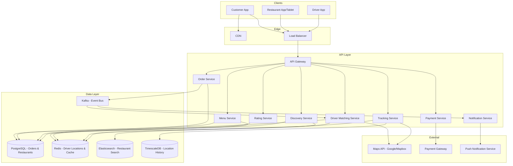
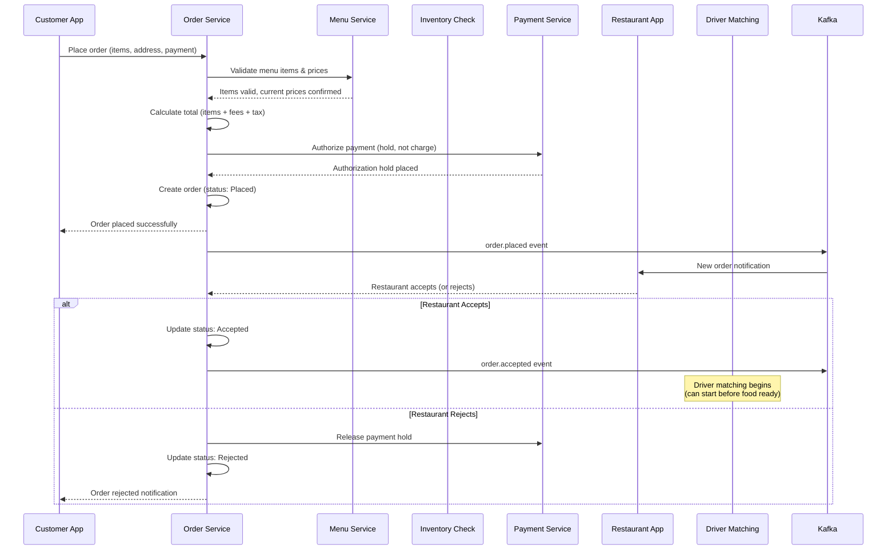
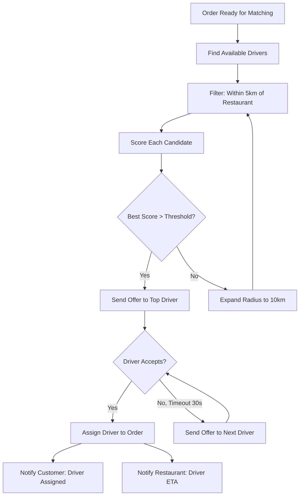

# System Design Interview: Food Delivery Service
### DoorDash / Uber Eats Scale

> [!NOTE]
> **Staff Engineer Interview Preparation Guide** — High Level Design Round

---

## Table of Contents

1. [Problem Clarification & Requirements](#1-problem-clarification--requirements)
2. [Capacity Estimation & Scale](#2-capacity-estimation--scale)
3. [High-Level Architecture](#3-high-level-architecture)
4. [Core Components Deep Dive](#4-core-components-deep-dive)
5. [Restaurant Discovery](#5-restaurant-discovery)
6. [Menu & Pricing Service](#6-menu--pricing-service)
7. [Order Management](#7-order-management)
8. [Delivery Driver Matching](#8-delivery-driver-matching)
9. [Real-Time Tracking](#9-real-time-tracking)
10. [Payment & Settlement](#10-payment--settlement)
11. [Rating System](#11-rating-system)
12. [Data Models & Storage](#12-data-models--storage)
13. [Scalability Strategies](#13-scalability-strategies)
14. [Design Trade-offs & Justifications](#14-design-trade-offs--justifications)
15. [Interview Cheat Sheet](#15-interview-cheat-sheet)

---

## 1. Problem Clarification & Requirements

> [!TIP]
> **Interview Tip:** Food delivery is a three-sided marketplace: customers, restaurants, and drivers. The core system design challenge is real-time coordination between these three parties under tight time constraints. Unlike e-commerce where delivery takes days, food delivery has a 30-45 minute window from order to doorstep. Frame your answer around this real-time coordination challenge.

### Questions to Ask the Interviewer

| Category | Question | Why It Matters |
|----------|----------|----------------|
| **Scale** | How many orders per day? How many cities? | Infrastructure sizing, geo-distribution |
| **Delivery model** | Own drivers or marketplace (Uber model) or both? | Driver management complexity |
| **Restaurant types** | Restaurants only, or also grocery/convenience stores? | Menu complexity, item size variability |
| **Batching** | Can one driver carry orders from multiple restaurants? | Matching algorithm complexity |
| **Payment** | Who pays the driver — platform or customer tip? | Settlement flow |
| **ETA** | How accurate does ETA need to be? | ML model requirements |
| **Scheduling** | Immediate delivery only, or scheduled orders too? | Order queue management |
| **Geography** | Single country or international? | Regulatory, currency, map provider |

---

### Functional Requirements (Agreed Upon)

- Customers can browse restaurants near their location, filtered by cuisine, rating, delivery time, and price range
- Customers can view a restaurant's menu with item availability and pricing
- Customers can place an order with one or more items from a single restaurant
- Restaurant receives the order and can accept or reject it
- System assigns a nearby available delivery driver to the order
- Customer can track the driver's location in real-time from pickup to delivery
- Customer pays for food + delivery fee + optional tip through the app
- Two-way rating: customer rates restaurant and driver; driver rates customer
- Customer can view order history and reorder previous meals

### Non-Functional Requirements

- **Latency:** Order placement must complete in < 2 seconds
- **Real-time:** Driver location updates every 3-5 seconds during active delivery
- **Availability:** 99.99% uptime during peak dinner hours (6-9 PM)
- **Scale:** 50 million orders/month, 500K restaurants, 2 million registered drivers
- **Geo-awareness:** Restaurant and driver search scoped to customer's delivery radius (typically 5-10 km)
- **Freshness:** Menu availability must reflect current restaurant status (open/closed, item available/sold out)
- **Consistency:** An order must be assigned to exactly one driver (no duplicate assignment)

---

## 2. Capacity Estimation & Scale

> [!TIP]
> **Interview Tip:** Food delivery has extreme peak-to-trough variation within a single day. Dinner hours (6-9 PM) see 5-10x the traffic of mid-afternoon. Your system must handle the dinner rush without over-provisioning for the entire day. This is a classic auto-scaling use case.

### Traffic Estimation

```
Orders per month        = 50 Million
Orders per day          = 50M / 30 = ~1.7 Million
Active restaurants      = 500,000
Active drivers (peak)   = 200,000 (online during dinner hours)

Order QPS:
  1.7M / 86,400 = ~20 orders/sec (daily average)
  Peak dinner hours (3 hours = 10,800 sec, 60% of daily orders):
  1.7M * 0.6 / 10,800 = ~94 orders/sec
  Burst peak: ~300 orders/sec

Restaurant discovery (search/browse):
  Average 10 browse sessions per order
  Peak: 940 search queries/sec

Driver location updates:
  200K active drivers * 1 update every 4 seconds
  = 50,000 location updates/sec (during peak)
  This is the dominant write workload.

Menu views:
  Average 3 menu views per order
  Peak: ~280 menu reads/sec
```

### Storage Estimation

```
Restaurant data:
  - Restaurant profile    = ~2 KB
  - 500K restaurants      = 1 GB

Menu data:
  - Average 50 items per restaurant = ~5 KB per restaurant
  - 500K * 5 KB = 2.5 GB

Orders:
  - Order record + items  = ~2 KB
  - 1.7M/day = 3.4 GB/day = ~1.2 TB/year

Driver location (hot data):
  - Latest location per driver = 50 bytes
  - 200K drivers = 10 MB (fits entirely in Redis)

Driver location (historical, for ETA model):
  - Each delivery: ~100 location points * 50 bytes = 5 KB
  - 1.7M deliveries/day * 5 KB = 8.5 GB/day
  - Stored in time-series DB, aged out after 90 days
```

---

## 3. High-Level Architecture



### Three-App Architecture

Unlike most systems with a single client, food delivery has three distinct clients:

| App | Users | Key Features |
|-----|-------|-------------|
| **Customer App** | End consumers | Browse, order, track, pay, rate |
| **Restaurant App** | Restaurant staff | Receive orders, accept/reject, mark ready |
| **Driver App** | Delivery drivers | Go online, accept delivery, navigate, confirm delivery |

Each app has different latency requirements, different push notification patterns, and different interaction frequencies.

---

## 4. Core Components Deep Dive

### Order Lifecycle Overview

Before diving into individual components, here is the complete lifecycle of an order through the system:

```mermaid
stateDiagram-v2
    [*] --> Placed: Customer submits order
    Placed --> RestaurantReceived: Order sent to restaurant
    RestaurantReceived --> Accepted: Restaurant accepts
    RestaurantReceived --> Rejected: Restaurant rejects
    Rejected --> Refunded: Full refund to customer
    Refunded --> [*]

    Accepted --> Preparing: Restaurant starts cooking
    Preparing --> ReadyForPickup: Food is ready
    ReadyForPickup --> DriverAssigned: Driver matched
    DriverAssigned --> DriverAtRestaurant: Driver arrives at restaurant
    DriverAtRestaurant --> PickedUp: Driver picks up food
    PickedUp --> Delivering: Driver en route to customer
    Delivering --> Delivered: Driver confirms delivery
    Delivered --> [*]

    Note right of Placed: Timeout: 5 min
    Note right of Accepted: Timeout: estimated prep time + 10 min
    Note right of DriverAssigned: Timeout: 15 min to arrive at restaurant
```

### Timeout Handling at Each Stage

> [!WARNING]
> Every stage in the order lifecycle must have a timeout. Without timeouts, an order can get stuck indefinitely (e.g., restaurant never responds, driver never picks up). Each timeout triggers a compensating action.

| Stage | Timeout | Action on Timeout |
|-------|---------|-------------------|
| **Restaurant received** | 5 minutes | Auto-reject, refund customer, mark restaurant as unresponsive |
| **Preparing** | Estimated prep time + 10 min | Alert restaurant, notify customer of delay |
| **Ready for pickup** | 15 minutes (no driver assigned) | Expand driver search radius, increase driver incentive |
| **Driver assigned** | 15 minutes (driver not at restaurant) | Reassign to different driver, penalize original driver |
| **Delivering** | Estimated delivery time + 20 min | Contact driver, alert support team |

---

## 5. Restaurant Discovery

> [!TIP]
> **Interview Tip:** Restaurant discovery is a geospatial search problem. You need to find restaurants within a delivery radius of the customer, ranked by relevance. This is where geohashing and Elasticsearch shine. Be prepared to explain how geohash-based proximity search works.

### Geospatial Search with Geohash

```
Geohash Concept:
  - Divide the Earth's surface into a grid
  - Each cell gets a base-32 encoded string
  - Longer strings = more precise (smaller area)
  - "9q8y" covers a ~20km x 20km area
  - "9q8yy" covers a ~5km x 5km area
  - "9q8yyk" covers a ~1km x 1km area

  Key property: Nearby locations share the same geohash prefix
  -> Prefix matching gives you approximate proximity search

Restaurant Search:
  1. Compute customer's geohash at precision 5 (5km cell)
  2. Query Elasticsearch for restaurants with matching geohash prefix
  3. Also query the 8 neighboring geohash cells (edge-of-cell problem)
  4. Post-filter: compute actual distance, discard restaurants beyond delivery radius
  5. Rank remaining results
```

### Elasticsearch Restaurant Index

```
Index: restaurants
Fields:
  - name (text, analyzed)
  - cuisine_types (keyword[])  -- ["Italian", "Pizza", "Pasta"]
  - location (geo_point)       -- { "lat": 40.7128, "lon": -74.0060 }
  - geohash (keyword)          -- "dr5ru"
  - avg_rating (float)
  - total_ratings (integer)
  - avg_delivery_time_min (integer)  -- historical average
  - price_level (integer)      -- 1-4 ($ to $$$$)
  - is_open (boolean)
  - promoted (boolean)         -- paid placement
  - tags (keyword[])           -- ["Popular", "New", "Free Delivery"]
```

### Ranking Algorithm

```
Restaurant ranking for a given customer location:

Score = w1 * relevance_score          -- text match on search query
      + w2 * proximity_score          -- closer is better (inverse distance)
      + w3 * rating_score             -- higher rating, weighted by count
      + w4 * delivery_time_score      -- faster estimated delivery
      + w5 * conversion_score         -- historical order rate from search
      + w6 * promotion_boost          -- paid placement bonus
      - w7 * price_mismatch_penalty   -- if user prefers $ but restaurant is $$$$

Proximity score:
  proximity_score = max(0, 1 - (distance_km / max_radius_km))

Delivery time estimation:
  estimated_delivery = avg_prep_time + driving_time(restaurant, customer)
  driving_time is computed using precomputed distance matrices (not real-time Maps API)
```

### Filtering

```
User request: "Show me Italian restaurants within 5km, rating 4+, delivery under 30 min"

Elasticsearch query:
  - geo_distance filter: 5km from customer location
  - term filter: cuisine_types = "Italian"
  - range filter: avg_rating >= 4.0
  - range filter: avg_delivery_time_min <= 30
  - sort: by composite score (ranking algorithm above)

Facets returned:
  - Cuisine: [Italian (42), Pizza (35), Pasta (28)]
  - Delivery time: [< 20 min (15), 20-30 min (18), 30-45 min (9)]
  - Price: [$ (12), $$ (20), $$$ (8), $$$$ (2)]
```

> [!NOTE]
> The `is_open` field must be updated frequently. Use a background job that checks restaurant operating hours every minute and updates the Elasticsearch index. During menu updates, the restaurant can also toggle their open/closed status in real-time.

---

## 6. Menu & Pricing Service

### Restaurant-Managed Menus

Each restaurant manages its own menu through the Restaurant App. The menu is a hierarchical structure:

```
Restaurant: "Joe's Pizza"
  |
  |-- Category: "Appetizers"
  |   |-- Item: "Garlic Knots" ($5.99) [Available]
  |   |-- Item: "Mozzarella Sticks" ($7.99) [Available]
  |
  |-- Category: "Pizzas"
  |   |-- Item: "Margherita" ($12.99) [Available]
  |   |   |-- Modifier Group: "Size" (required, pick 1)
  |   |       |-- "Small" (+$0), "Medium" (+$3), "Large" (+$5)
  |   |   |-- Modifier Group: "Extra Toppings" (optional, pick up to 5)
  |   |       |-- "Pepperoni" (+$2), "Mushrooms" (+$1.50), ...
  |   |-- Item: "Buffalo Chicken" ($15.99) [Sold Out]
  |
  |-- Category: "Drinks"
      |-- Item: "Coke" ($2.99) [Available]
      |-- Item: "Lemonade" ($3.99) [Available]
```

### Item Availability

Restaurants can mark items as sold out in real-time through their app:

```
Availability Update Flow:
  1. Restaurant marks "Buffalo Chicken" as sold out
  2. Menu Service updates PostgreSQL
  3. Event published to Kafka: menu_item.availability_changed
  4. Redis cache invalidated for this restaurant's menu
  5. Customer app shows item as "Sold Out" (grayed out, unselectable)

Staleness tolerance: Up to 30 seconds
  - If a customer orders an item that just sold out, the restaurant rejects
    that specific item and the order proceeds without it (partial fulfillment)
    or the customer is notified and can modify the order
```

### Dynamic Pricing for Delivery Fees

The delivery fee is not fixed. It varies based on:

```
Delivery Fee Calculation:
  base_fee = $2.99
  distance_fee = max(0, (distance_km - 3) * $0.50)  -- free for first 3km
  demand_multiplier = current_demand / baseline_demand  -- surge pricing
  small_order_fee = order_total < $15 ? $3.00 : $0    -- minimum order surcharge

  delivery_fee = (base_fee + distance_fee) * demand_multiplier + small_order_fee
  delivery_fee = min(delivery_fee, $12.99)  -- cap at max

Demand multiplier:
  - Computed per delivery zone (geohash region)
  - Based on: pending orders / available drivers in that zone
  - Updated every 60 seconds
  - Typical range: 1.0x (normal) to 2.5x (extreme demand)
```

> [!TIP]
> **Interview Tip:** Mention that surge pricing for delivery is analogous to ride-sharing surge pricing. The signal is the same — demand/supply imbalance in a geographic area. But unlike ride-sharing, the customer is more price-sensitive because they can also just cook at home. So the surge multiplier is typically capped lower.

---

## 7. Order Management

### Order Placement Flow



### Pre-Dispatch: Matching Driver Before Food Is Ready

> [!IMPORTANT]
> A key optimization in food delivery is dispatching a driver before the food is ready. If you wait until the food is ready to find a driver, the food gets cold while the driver travels to the restaurant. Instead, estimate when the food will be ready and dispatch a driver so they arrive at the restaurant just as the food is done.

```
Pre-dispatch timing:
  1. Restaurant accepts order at T=0
  2. Estimated prep time: 15 minutes (food ready at T=15)
  3. Nearest available driver is 8 minutes away from restaurant
  4. Dispatch driver at T=7 (15 - 8 = 7 minutes from now)
  5. Driver arrives at restaurant at T=15 (just as food is ready)

If prep time estimate is wrong:
  - Food ready early: driver hasn't been dispatched yet -> dispatch immediately
  - Food ready late: driver waits at restaurant (driver is compensated for wait time > 5 min)
  - Dynamic adjustment: restaurant's actual prep times are tracked and used to improve estimates
```

### Restaurant-Side Order Rejection

Restaurants may reject orders for various reasons:

```
Rejection reasons:
  - Too busy (kitchen overwhelmed)
  - Item unavailable (ran out of ingredient)
  - Restaurant closing soon
  - Technical issue (printer/tablet malfunction)

System response to rejection:
  1. Release payment authorization
  2. Notify customer: "Your order was declined by the restaurant"
  3. Offer alternatives: "Similar restaurants nearby" or "Reorder from another restaurant"
  4. Track rejection rate per restaurant

High rejection rate consequences:
  - Restaurant receives warning
  - Search ranking penalty (lower visibility)
  - Temporary suspension if rejection rate > 30% over 24 hours
```

---

## 8. Delivery Driver Matching

> [!TIP]
> **Interview Tip:** Driver matching in food delivery is similar to ride-sharing, but with a crucial difference: the driver is going to a fixed pickup point (restaurant) and then to the customer. In ride-sharing, both pickup and dropoff are dynamic. This simplifies the matching problem somewhat but adds the restaurant as an intermediate waypoint.

### Matching Algorithm



### Driver Scoring

```
For each candidate driver, compute a composite score:

score = w1 * proximity_score
      + w2 * heading_score
      + w3 * acceptance_rate_score
      + w4 * current_load_score
      + w5 * driver_rating_score

proximity_score:
  - Straight-line distance from driver to restaurant
  - Converted to estimated driving time using Maps API
  - Closer = higher score

heading_score:
  - Is the driver already heading toward the restaurant?
  - A driver 3km away but driving toward the restaurant is better than
    a driver 2km away driving in the opposite direction

acceptance_rate_score:
  - Drivers who accept most offers get priority
  - Prevents wasted offer-timeout cycles

current_load_score:
  - Drivers carrying 0 orders get priority over drivers carrying 1 order
  - Drivers carrying 2 orders are deprioritized (food quality degrades with long carry time)

driver_rating_score:
  - Higher-rated drivers get slight priority for better customer experience
```

### Order Batching

A single driver can carry multiple orders simultaneously to improve efficiency:

```
Batching rules:
  1. Orders must be from the same restaurant (or restaurants within 500m of each other)
  2. Delivery addresses must be within 2km of each other
  3. The additional delay for the second customer must be < 10 minutes
  4. Maximum 2 orders per driver per batch (food quality concern)

Batching flow:
  1. Driver picks up Order A from Restaurant X
  2. System detects Order B from Restaurant X (or nearby Restaurant Y) with nearby delivery
  3. Offer batch to driver: "Pick up Order B on your way"
  4. If accepted: navigate to Restaurant Y (if different), then deliver in optimal order
  5. Customer B sees slightly longer ETA and gets a small discount
```

### Driver Location Storage (Redis)

```
Data structure: Redis Geospatial Index (GEOADD)

Key: driver_locations:{city_id}
Members: driver_id
Coordinates: (longitude, latitude)

Operations:
  GEOADD driver_locations:NYC -73.935242 40.730610 driver_456
  -- Add/update driver location

  GEORADIUS driver_locations:NYC -73.990 40.735 5 km ASC COUNT 20
  -- Find 20 nearest drivers within 5km of restaurant

  GEODIST driver_locations:NYC driver_456 driver_789 km
  -- Distance between two drivers

Update frequency: Every 4 seconds from each active driver
  200K active drivers / 4 seconds = 50K GEOADD/sec
  Redis handles this comfortably (100K+ ops/sec single instance)
```

> [!NOTE]
> We use a separate Redis geospatial index per city. This keeps each index small and allows independent scaling. A global index would work but adds unnecessary overhead for queries that are always city-scoped.

---

## 9. Real-Time Tracking

### Driver Location via WebSocket

```
Customer App <-- WebSocket --> Tracking Service <-- Redis Pub/Sub --> Driver App

Flow:
  1. Customer opens order tracking screen
  2. Customer App opens WebSocket to Tracking Service
  3. Tracking Service subscribes to Redis channel: "order:{order_id}:location"
  4. Driver App sends GPS coordinates every 4 seconds to Tracking Service
  5. Tracking Service:
     a. Updates Redis GEOADD (for matching service)
     b. Publishes to Redis channel "order:{order_id}:location"
     c. Stores in TimescaleDB (for ETA model training)
  6. Tracking Service forwards location to Customer App via WebSocket
  7. Customer App renders driver's position on the map
```

### ETA Updates

```
ETA Calculation:

Initial ETA (at order placement):
  ETA = restaurant_prep_time + driver_to_restaurant_time + restaurant_to_customer_time

Dynamic ETA (during delivery):
  - Recalculated every 30 seconds using actual driver position
  - restaurant_to_customer_time = Maps API driving time from current position to customer
  - Adjusted for:
    - Current traffic conditions
    - Historical delivery data for this route
    - Time of day patterns
    - Weather conditions (rain slows deliveries)

ETA Model Training:
  - Every completed delivery is a training sample:
    Input: (distance, time_of_day, day_of_week, weather, traffic_level, restaurant_category)
    Output: actual_delivery_time
  - Model retrained weekly
  - Per-city models (traffic patterns vary by city)
```

### Tracking Screen States

```
Order tracking shows different information at each stage:

1. Order Placed:
   "Your order has been sent to the restaurant"
   [Map shows restaurant location]

2. Preparing:
   "Restaurant is preparing your order"
   [Animated cooking icon, estimated ready time countdown]

3. Driver Assigned:
   "Your driver Alex is heading to the restaurant"
   [Map shows driver moving toward restaurant, ETA to restaurant]

4. Picked Up:
   "Alex picked up your order and is on the way!"
   [Map shows driver moving toward customer, ETA to customer]
   [Driver location updates in real-time]

5. Arriving:
   "Alex is almost there!"
   [Map zoomed in, driver very close to customer]

6. Delivered:
   "Your order has been delivered. Enjoy!"
   [Rate driver and restaurant prompt]
```

---

## 10. Payment & Settlement

> [!TIP]
> **Interview Tip:** Food delivery payment is more complex than simple e-commerce because the money is split among multiple parties. The platform takes a commission, the restaurant gets the food cost, the driver gets a delivery payout, and tips go directly to the driver. This multi-party settlement makes accounting and reconciliation challenging.

### Payment Flow

```
Customer pays: $35.00

Breakdown:
  Food subtotal:          $25.00
  Delivery fee:           $4.99
  Service fee (15%):      $3.75
  Tax:                    $2.26
  Tip:                    $5.00
  ────────────────────────
  Total charged:          $41.00

Settlement:
  Restaurant receives:    $25.00 - 20% commission = $20.00
  Driver receives:        $8.00 base payout + $5.00 tip = $13.00
  Platform revenue:       $5.00 (commission) + $4.99 (delivery fee) + $3.75 (service fee) = $13.74
  Tax remitted:           $2.26

  Total out: $20.00 + $13.00 + $13.74 + $2.26 = $49.00
  Wait, that does not balance. Let me recalculate.

  Customer pays: $41.00
  Restaurant: $20.00
  Driver: $13.00 ($8 base + $5 tip)
  Tax authority: $2.26
  Platform keeps: $41.00 - $20.00 - $13.00 - $2.26 = $5.74
  Platform revenue breakdown: $5.00 commission + $0.74 net from fees
```

### Authorization Hold Pattern

```
Payment timeline:
  1. Order placed -> Authorization hold for estimated total ($41.00)
  2. Restaurant may modify order (item unavailable -> removes item)
  3. New total: $35.50 (less than authorized)
  4. On delivery confirmation -> Capture actual amount ($35.50)
  5. If customer adds post-delivery tip -> Separate charge for tip

Why hold instead of charge immediately?
  - Final total may differ (items removed, weight-based pricing for grocery)
  - Prevents double-charge scenario if we need to adjust
  - Hold expires after 7 days if never captured (edge case safety net)
```

### Settlement Frequency

```
Restaurant settlement:
  - Daily batch settlement
  - All completed orders from yesterday
  - Net amount after commission deduction
  - Transferred via ACH/bank transfer

Driver settlement:
  - Instant payout available (with small fee)
  - Or weekly batch settlement (free)
  - Tips are settled separately (often instant)
```

---

## 11. Rating System

### Two-Way Rating

After every delivery, multiple ratings are collected:

```
Customer rates:
  - Restaurant: 1-5 stars + optional text review
    (food quality, portion size, accuracy)
  - Driver: 1-5 stars + optional feedback
    (speed, communication, food condition on arrival)

Driver rates:
  - Customer: thumbs up / thumbs down
    (was the address accurate? was customer responsive? safe location?)

Restaurant rates:
  - Driver: thumbs up / thumbs down (via tablet)
    (did driver arrive on time? was driver professional?)
```

### Rating Impact

| Rating Target | Impact of Low Ratings |
|---------------|----------------------|
| **Restaurant** | Lower search ranking, warning labels, potential suspension below 3.5 stars |
| **Driver** | Fewer delivery offers, lower priority in matching, deactivation below 4.2 stars |
| **Customer** | Drivers may decline deliveries (shown customer rating before accepting) |

### Preventing Rating Manipulation

```
Anti-manipulation measures:
  1. Ratings are anonymous (restaurant cannot see which customer rated them)
  2. Rating window: 24 hours after delivery (prevents emotional immediate ratings)
  3. Outlier detection: if a restaurant suddenly gets 50 five-star ratings, investigate
  4. Review moderation: text reviews checked for spam, fake content, personal attacks
  5. Rating weight: frequent orderers' ratings weighted higher than one-time users
```

> [!NOTE]
> The restaurant's displayed rating is a weighted rolling average of the last 500 ratings, with more recent ratings weighted higher. This prevents very old ratings from defining a restaurant's current quality and makes the rating responsive to recent changes (new chef, menu overhaul).

---

## 12. Data Models & Storage

### Database Schema

```
Table: restaurants
  - restaurant_id       UUID PRIMARY KEY
  - name                VARCHAR(255)
  - description         TEXT
  - address             TEXT
  - latitude            DOUBLE PRECISION
  - longitude           DOUBLE PRECISION
  - geohash             VARCHAR(12)
  - cuisine_types       TEXT[]  -- PostgreSQL array
  - price_level         SMALLINT  -- 1-4
  - avg_rating          NUMERIC(3,2)
  - total_ratings       INTEGER
  - avg_prep_time_min   INTEGER
  - is_open             BOOLEAN
  - operating_hours     JSONB
  - commission_rate     NUMERIC(4,2)  -- e.g., 0.20 for 20%
  - status              VARCHAR(20)  -- active, suspended, closed
  - created_at          TIMESTAMP

Table: menu_categories
  - category_id         UUID PRIMARY KEY
  - restaurant_id       UUID REFERENCES restaurants
  - name                VARCHAR(100)
  - display_order       INTEGER

Table: menu_items
  - item_id             UUID PRIMARY KEY
  - category_id         UUID REFERENCES menu_categories
  - restaurant_id       UUID REFERENCES restaurants
  - name                VARCHAR(200)
  - description         TEXT
  - base_price_cents    INTEGER
  - image_url           VARCHAR(500)
  - is_available        BOOLEAN DEFAULT TRUE
  - calories            INTEGER
  - dietary_tags        TEXT[]  -- ["vegetarian", "gluten-free"]
  - display_order       INTEGER

Table: modifier_groups
  - group_id            UUID PRIMARY KEY
  - item_id             UUID REFERENCES menu_items
  - name                VARCHAR(100)  -- "Size", "Extra Toppings"
  - is_required         BOOLEAN
  - min_selections      SMALLINT DEFAULT 0
  - max_selections      SMALLINT DEFAULT 1

Table: modifiers
  - modifier_id         UUID PRIMARY KEY
  - group_id            UUID REFERENCES modifier_groups
  - name                VARCHAR(100)  -- "Large", "Pepperoni"
  - price_delta_cents   INTEGER  -- +300 means +$3.00

Table: orders
  - order_id            UUID PRIMARY KEY
  - customer_id         UUID REFERENCES users
  - restaurant_id       UUID REFERENCES restaurants
  - driver_id           UUID REFERENCES drivers
  - status              VARCHAR(30)
  - subtotal_cents       INTEGER
  - delivery_fee_cents  INTEGER
  - service_fee_cents   INTEGER
  - tax_cents           INTEGER
  - tip_cents           INTEGER
  - total_cents         INTEGER
  - delivery_address    TEXT
  - delivery_lat        DOUBLE PRECISION
  - delivery_lon        DOUBLE PRECISION
  - placed_at           TIMESTAMP
  - accepted_at         TIMESTAMP
  - ready_at            TIMESTAMP
  - picked_up_at        TIMESTAMP
  - delivered_at        TIMESTAMP
  - cancelled_at        TIMESTAMP
  - cancellation_reason VARCHAR(200)
  - estimated_delivery  TIMESTAMP
  - INDEX (customer_id, placed_at DESC)
  - INDEX (restaurant_id, status)
  - INDEX (driver_id, status)

Table: order_items
  - order_id            UUID REFERENCES orders
  - item_id             UUID REFERENCES menu_items
  - quantity            SMALLINT
  - unit_price_cents    INTEGER
  - special_instructions TEXT
  - PRIMARY KEY (order_id, item_id)

Table: order_item_modifiers
  - order_id            UUID
  - item_id             UUID
  - modifier_id         UUID REFERENCES modifiers
  - price_delta_cents   INTEGER
  - PRIMARY KEY (order_id, item_id, modifier_id)
  - FOREIGN KEY (order_id, item_id) REFERENCES order_items

Table: drivers
  - driver_id           UUID PRIMARY KEY
  - name                VARCHAR(100)
  - phone               VARCHAR(20)
  - vehicle_type        VARCHAR(20)  -- car, bike, scooter
  - license_plate       VARCHAR(20)
  - avg_rating          NUMERIC(3,2)
  - total_deliveries    INTEGER
  - acceptance_rate     NUMERIC(4,2)
  - is_online           BOOLEAN DEFAULT FALSE
  - current_lat         DOUBLE PRECISION
  - current_lon         DOUBLE PRECISION
  - status              VARCHAR(20)  -- available, en_route_to_restaurant, delivering
  - active_order_count  SMALLINT DEFAULT 0

Table: ratings
  - rating_id           UUID PRIMARY KEY
  - order_id            UUID REFERENCES orders
  - rater_type          VARCHAR(20)  -- customer, driver, restaurant
  - target_type         VARCHAR(20)  -- restaurant, driver, customer
  - target_id           UUID
  - score               SMALLINT CHECK (score BETWEEN 1 AND 5)
  - comment             TEXT
  - created_at          TIMESTAMP
  - UNIQUE (order_id, rater_type, target_type)
```

### Database Choice Justification

| Data | Database | Rationale |
|------|----------|-----------|
| **Orders, Restaurants, Menus** | PostgreSQL | Relational data with ACID requirements for order state transitions |
| **Driver Locations (real-time)** | Redis (GEOADD) | Sub-ms geospatial queries for finding nearby drivers. 50K writes/sec. |
| **Restaurant Search** | Elasticsearch | Full-text search with geospatial filtering and faceted results |
| **Driver Location History** | TimescaleDB | Time-series optimized for append-heavy location data. Efficient range queries for ETA model training. |
| **Menu Cache** | Redis | Fast menu reads for customer app. Invalidated on menu update. |
| **Event Bus** | Kafka | Decoupled order lifecycle events. Consumed by matching, notification, analytics services. |

---

## 13. Scalability Strategies

### Geographic Sharding

```
Shard by city/region:
  - Each city has its own set of service instances + databases
  - NYC orders never touch LAX infrastructure
  - Orders do not cross city boundaries (customer and restaurant are always in same city)

Benefits:
  - Zero cross-shard queries during normal operation
  - Independent scaling per city (NYC needs more capacity than a small city)
  - Reduced blast radius (NYC outage does not affect LAX)
  - Data locality (comply with regional data regulations)

Implementation:
  - API Gateway routes requests based on user's city (from their profile or GPS)
  - Each city deployment is a full microservices stack
  - Shared services: user auth, payment processing (centralized)
```

### Scaling the Driver Location Pipeline

```
Driver location is the highest-throughput write path:
  50K GEOADD/sec during peak hours

Scaling approach:
  1. Partition drivers by city -> separate Redis instances per city
  2. Each city's Redis instance handles ~5K updates/sec (manageable)
  3. For the largest cities (NYC, LA), further partition by zone
  4. Driver App sends location to a city-specific endpoint
  5. Load balancer routes based on city header

If even this is not enough:
  - Buffer location updates in a local queue on the API server
  - Batch-write to Redis every 1 second (reduces 5K individual writes to ~500 batch writes)
  - Acceptable trade-off: location data is 1 second stale
```

### Handling Dinner Rush (Peak Hours)

```
Peak traffic strategy:

1. Pre-scale: Scale up infrastructure at 5:30 PM based on historical patterns
   - Add 3x API server capacity
   - Warm up additional Redis read replicas
   - Pre-compute popular restaurant search results

2. During peak:
   - Shorter cache TTLs on restaurant availability (freshness matters more)
   - Increase driver matching radius (fewer available drivers per area)
   - Enable surge pricing to balance demand/supply
   - Queue non-critical operations (analytics, ML model updates)

3. Post-peak (10 PM):
   - Scale down to baseline
   - Run batch jobs: settlement calculations, ETA model retraining, analytics
```

### Caching Strategy

| Data | Cache Location | TTL | Invalidation |
|------|---------------|-----|-------------|
| Restaurant list per geohash | Redis | 60s | On restaurant open/close |
| Restaurant menu | Redis | 5 min | On menu update event |
| Restaurant images | CDN | 24 hours | On image change |
| Driver locations | Redis GEOADD | Overwritten every 4s | Implicit |
| User's recent orders | Redis | 10 min | On new order |
| Popular search results | Redis | 30s | Time-based |

---

## 14. Design Trade-offs & Justifications

### Trade-off 1: Pre-dispatch vs Wait-for-Ready

| Pre-dispatch (send driver early) | Wait for food to be ready |
|----------------------------------|--------------------------|
| Food stays hot (driver arrives as food finishes) | No driver waiting time at restaurant |
| Requires accurate prep time estimation | Simpler to implement |
| Driver may wait if prep runs long (costly) | Longer total delivery time |

**Chosen:** Pre-dispatch with dynamic adjustment. Track actual vs estimated prep times per restaurant to improve predictions over time. Compensate drivers for waits exceeding 5 minutes.

### Trade-off 2: Driver Assignment Model

| Offer-based (Uber model) | Dispatch-based (DoorDash model) |
|--------------------------|--------------------------------|
| Driver can accept or decline | Driver is assigned, expected to complete |
| Higher driver satisfaction (autonomy) | More predictable assignment times |
| Risk of offer cycling (multiple declines) | Risk of driver dissatisfaction |
| Need incentives for unattractive orders | Guaranteed assignment |

**Chosen:** Hybrid approach. Top-rated drivers get offers (can decline). New or lower-rated drivers receive dispatches. High-urgency orders (food getting cold) are dispatched directly.

### Trade-off 3: Order Batching

| Single order per driver | Multi-order batching |
|------------------------|---------------------|
| Fastest delivery for each customer | Lower delivery cost per order |
| Simpler routing | Better driver utilization |
| Higher delivery cost (more driver-miles) | Slightly longer wait for second customer |

**Chosen:** Batching enabled with strict constraints: same restaurant (or very nearby), delivery addresses within 2km, second customer delay < 10 minutes. Second customer gets a delivery fee discount.

### Trade-off 4: Real-time vs Polling for Location Updates

| WebSocket (real-time) | HTTP Polling (every 5s) |
|----------------------|------------------------|
| True real-time updates | Simpler infrastructure |
| Connection management overhead | Higher total request count |
| Requires sticky sessions or pub/sub | Stateless, easy to scale |

**Chosen:** WebSocket for the active tracking screen (customer watching driver). HTTP polling for the driver app sending location (simpler, reconnects naturally). Redis Pub/Sub bridges the two.

### Trade-off 5: ETA Accuracy vs Computational Cost

| Simple distance-based ETA | ML-based ETA |
|--------------------------|-------------|
| Fast to compute | More accurate (factors in traffic, time of day, restaurant speed) |
| Inaccurate in traffic | Requires training data, model serving infrastructure |
| No historical learning | Improves over time |

**Chosen:** ML-based ETA for customer-facing estimates (worth the investment for user trust). Simple distance-based ETA for internal matching decisions (speed matters more than precision there).

---

## 15. Interview Cheat Sheet

> [!TIP]
> **Use this as a quick reference before your interview. The key differentiators for a Staff-level answer are: (1) explaining the three-sided marketplace coordination, (2) the pre-dispatch optimization, (3) geospatial driver matching with Redis GEOADD, and (4) the multi-party payment settlement.**

### 30-Second Pitch

"A food delivery service is a real-time three-sided marketplace coordinating customers, restaurants, and drivers under tight time constraints. The core challenge is matching a delivery driver who arrives at the restaurant just as the food is ready, then delivering to the customer within the ETA promise. I would use Redis geospatial indexes for real-time driver location and proximity search, Elasticsearch for restaurant discovery, PostgreSQL for order management with a state machine tracking the order lifecycle, WebSockets for real-time delivery tracking, and Kafka for event-driven coordination between services."

### Key Numbers to Remember

| Metric | Value |
|--------|-------|
| Orders/month | 50M |
| Peak dinner QPS | ~300 orders/sec |
| Driver location updates | 50K/sec during peak |
| Active drivers (peak) | 200K |
| Location update interval | Every 4 seconds |
| Restaurant response timeout | 5 minutes |
| Delivery ETA accuracy target | Within 5 minutes of actual |
| Driver search radius (initial) | 5 km |

### Common Follow-Up Questions

**Q: How do you handle a driver who goes offline mid-delivery?**
A: Detect via heartbeat timeout (no location update for 2 minutes). Attempt to contact driver. If unreachable for 5 minutes, reassign order to new driver. Notify customer with updated ETA. Last known location helps the new driver find the order if driver left it somewhere.

**Q: What if the restaurant is very slow and the food is not ready when the driver arrives?**
A: Track driver wait time. If exceeding estimated prep time by more than 10 minutes, notify customer with updated ETA. Compensate driver for wait time. Update restaurant's average prep time estimate. Chronic slow restaurants get a warning and reduced visibility.

**Q: How do you handle peak hour in a new city with few drivers?**
A: Increase surge pricing to attract more drivers. Expand delivery radius. Temporarily disable order batching (prioritize speed). Cap new order acceptance if driver availability drops below threshold (waitlist new orders).

**Q: How do you prevent order fraud?**
A: Track patterns: same address ordering from many accounts, new accounts with high-value orders, disputes filed on every order. Require phone verification. Limit promotions for new accounts. Flag suspicious patterns for manual review.

**Q: How would you add grocery delivery alongside restaurant delivery?**
A: Grocery delivery uses the same infrastructure but with key differences: longer prep time (picking items), weight-based pricing, item substitution flow (item out of stock, suggest alternative), multi-bag orders requiring vehicle delivery (not bike). Add a new order type that flows through the same order service but with a different fulfillment path.

### Architecture Summary

```
Customer App -> CDN + LB -> API Gateway
  -> Discovery Service -> Elasticsearch (restaurants) + Redis (cache)
  -> Menu Service -> PostgreSQL + Redis cache
  -> Order Service -> PostgreSQL + Kafka (events)
  -> Driver Matching Service -> Redis GEOADD (locations) + Maps API
  -> Tracking Service -> Redis Pub/Sub + WebSocket -> Customer App
  -> Payment Service -> Payment Gateway -> Settlement Batch Job
  -> Rating Service -> PostgreSQL
  -> Notification Service <- Kafka <- all services

Driver App -> Tracking Service -> Redis GEOADD (location updates)
Restaurant App -> Order Service (accept/reject/ready)
```

### The Three Coordination Challenges

1. **Restaurant coordination:** Accept/reject flow with timeouts, prep time estimation, menu availability sync
2. **Driver coordination:** Proximity-based matching, pre-dispatch timing, multi-order batching, real-time tracking
3. **Customer coordination:** Accurate ETA, real-time status updates, payment with dynamic pricing, rating loop

---

> [!NOTE]
> **Final thought for the interview:** Food delivery is not just a logistics problem — it is a time-sensitive marketplace where a few minutes of delay can ruin the product (cold food). The system design must optimize for the tightest constraint: the window between food being ready and food arriving at the customer's door. Every architectural decision — pre-dispatch, driver matching, ETA calculation — serves this single goal.
