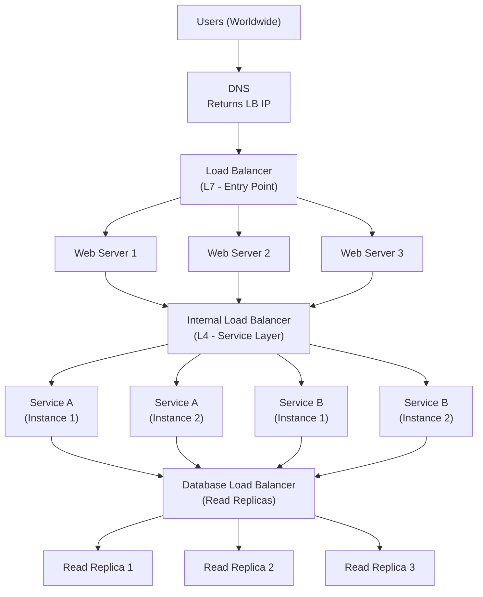
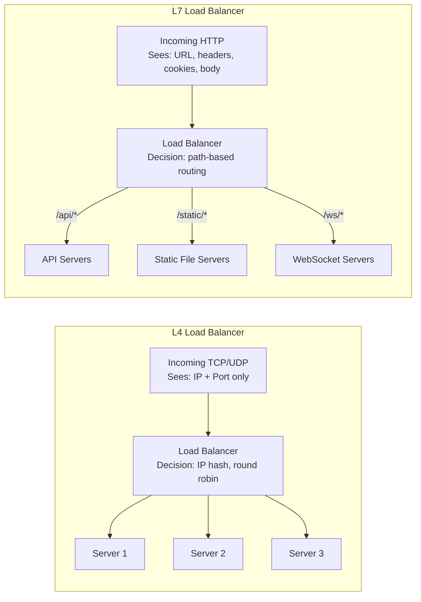
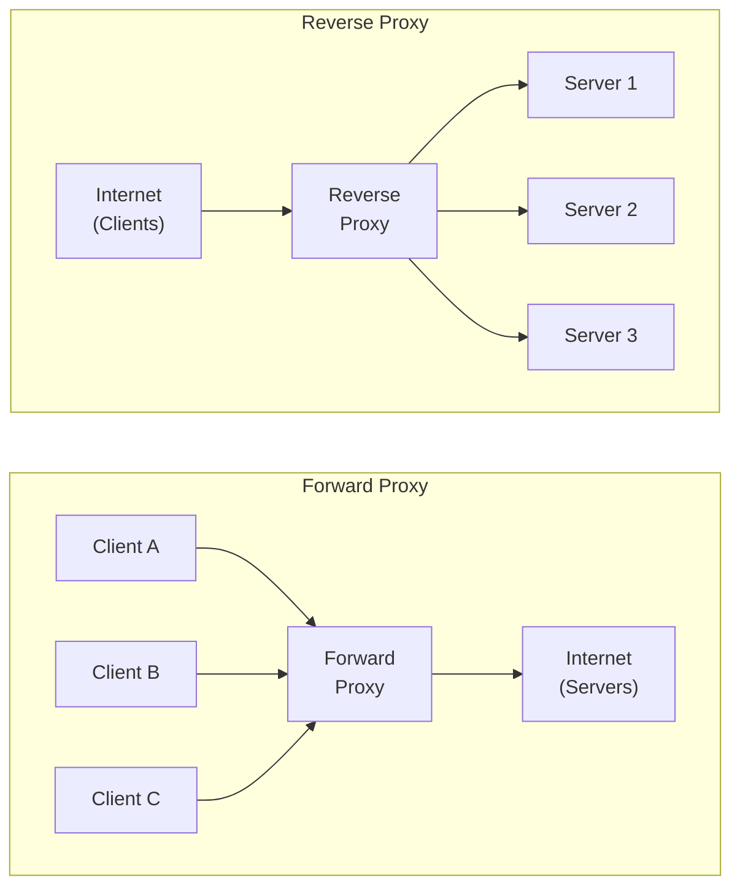
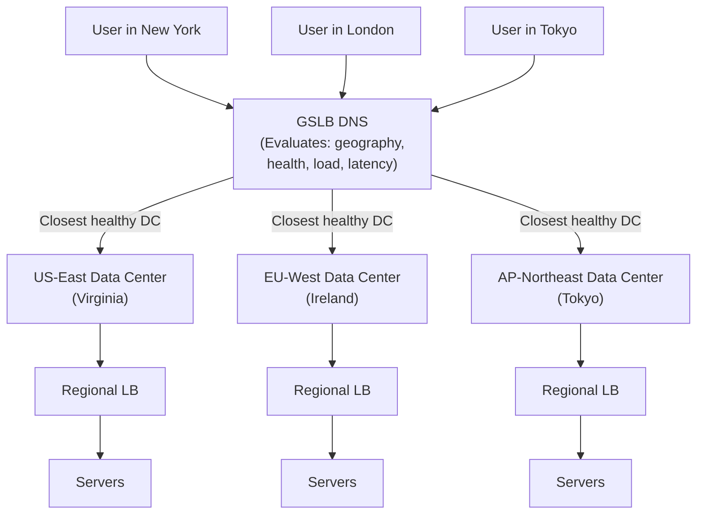

# Load Balancing and Proxies — Complete System Design Reference
### Staff Engineer Interview Preparation Guide

> [!TIP]
> Load balancing appears in virtually every system design interview. The difference between a junior and senior answer is knowing *which type* of load balancer to use, *why*, and how it interacts with your overall architecture. This guide covers everything you need.

---

## Table of Contents

1. [What Load Balancers Do](#1-what-load-balancers-do)
2. [L4 vs L7 Load Balancing](#2-l4-vs-l7-load-balancing)
3. [Hardware vs Software Load Balancers](#3-hardware-vs-software-load-balancers)
4. [Load Balancing Algorithms](#4-load-balancing-algorithms)
5. [Health Checks and Failover](#5-health-checks-and-failover)
6. [Forward Proxy vs Reverse Proxy](#6-forward-proxy-vs-reverse-proxy)
7. [Reverse Proxy Deep Dive](#7-reverse-proxy-deep-dive)
8. [Global Server Load Balancing (GSLB)](#8-global-server-load-balancing-gslb)
9. [Session Persistence (Sticky Sessions)](#9-session-persistence-sticky-sessions)
10. [Load Balancing at Scale](#10-load-balancing-at-scale)
11. [Interview Cheat Sheet](#11-interview-cheat-sheet)

---

## 1. What Load Balancers Do

A load balancer distributes incoming network traffic across multiple backend servers. It sits between clients and your server fleet, serving as the single entry point.

### Core Functions

| Function | Description |
|----------|-------------|
| Traffic distribution | Spread requests across servers to prevent any single server from being overwhelmed |
| High availability | Route around failed servers automatically |
| Horizontal scaling | Add or remove servers without clients knowing |
| SSL termination | Handle TLS encryption/decryption to offload backend servers |
| Health monitoring | Continuously check server status and remove unhealthy ones from rotation |
| Connection management | Pool and reuse backend connections, manage client connection limits |

### Where Load Balancers Sit in Architecture



> [!NOTE]
> Production systems typically have multiple layers of load balancing. The entry point is usually an L7 load balancer (for HTTP routing), internal services use L4 load balancers (for speed), and database read replicas have their own distribution layer. Mentioning this layered approach in interviews shows architectural maturity.

---

## 2. L4 vs L7 Load Balancing

This is one of the most important distinctions in load balancing. The "layer" refers to the OSI model layer at which the load balancer operates.

### Layer 4 (Transport Layer)

An L4 load balancer makes routing decisions based on information available in the TCP/UDP headers: source IP, destination IP, source port, and destination port. It does not inspect the payload.

**How it works:** The load balancer receives a TCP connection, picks a backend server, and establishes a separate connection to it. It then relays packets between the two connections. Some L4 load balancers use DSR (Direct Server Return), where response traffic goes directly from the backend to the client, bypassing the load balancer.

**Key characteristic:** The load balancer does not understand HTTP, gRPC, or any application protocol. It simply shuffles bytes.

### Layer 7 (Application Layer)

An L7 load balancer reads and understands the application-layer protocol (typically HTTP). It can make routing decisions based on the full request content: URL path, headers, cookies, query parameters, and even the request body.

**How it works:** The load balancer terminates the client's HTTP connection, inspects the request, decides which backend should handle it, and creates a new HTTP connection to that backend. The response travels back through the load balancer.

### L4 vs L7 Comparison



| Dimension | L4 Load Balancer | L7 Load Balancer |
|-----------|-----------------|-----------------|
| Operates on | TCP/UDP packets | HTTP requests |
| Inspects | IP addresses, ports | URLs, headers, cookies, body |
| Routing intelligence | Basic (IP hash, round robin) | Content-based (/api to API servers, /static to CDN) |
| SSL termination | No (passes encrypted traffic through) | Yes (decrypts, inspects, re-encrypts or passes plain) |
| Performance | Very fast (minimal processing) | Slower (must parse HTTP) |
| Connection handling | Passes through or NATs | Terminates and re-establishes |
| WebSocket support | Yes (it is just TCP) | Yes (with upgrade handling) |
| Throughput | Higher (less overhead) | Lower (more processing per request) |
| Visibility | No request-level metrics | Full request-level logging and metrics |
| Examples | AWS NLB, IPVS, LVS | AWS ALB, Nginx, HAProxy (L7 mode), Envoy |
| Cost | Lower | Higher |

> [!TIP]
> Interview rule of thumb: Use L7 for your public-facing edge (need content routing, SSL termination, HTTP features). Use L4 for internal service-to-service traffic (need raw speed, simpler config). If asked "which type?", always explain *why* based on the requirements.

---

## 3. Hardware vs Software Load Balancers

### Hardware Load Balancers

Hardware load balancers are dedicated physical appliances (like F5 BIG-IP or Citrix ADC) with custom ASICs optimized for packet processing. They were the standard choice for decades.

| Pros | Cons |
|------|------|
| Extremely high throughput (millions of connections) | Very expensive ($50K–$500K+) |
| Dedicated hardware, no resource contention | Vendor lock-in |
| Built-in features (SSL offload, DDoS protection) | Long procurement cycles |
| Vendor support and SLAs | Capacity is fixed (scaling means buying more) |
| Battle-tested reliability | Configuration is often proprietary |

### Software Load Balancers

Software load balancers run on commodity hardware or virtual machines. They have largely replaced hardware load balancers in modern architectures.

| Name | Type | Key Strengths |
|------|------|--------------|
| Nginx | L7 (also L4) | Most popular web server/reverse proxy, excellent HTTP handling |
| HAProxy | L4 and L7 | High-performance, rich health checking, widely used |
| Envoy | L7 | Modern, designed for microservices, gRPC-native, used in service meshes |
| Traefik | L7 | Auto-discovery of services, integrates with Docker/Kubernetes |
| AWS ALB | L7 (managed) | Fully managed, integrates with AWS ecosystem |
| AWS NLB | L4 (managed) | Ultra-low latency, millions of connections, static IP |
| Google Cloud LB | L4 and L7 (managed) | Global anycast, integrated with GCP services |

> [!NOTE]
> In system design interviews, always choose software load balancers unless there is a specific reason for hardware. Cloud-managed load balancers (ALB, NLB, Google Cloud LB) are the most common answer because they eliminate operational overhead. If asked about on-premises, mention Nginx or HAProxy.

---

## 4. Load Balancing Algorithms

### Round Robin

The simplest algorithm. Requests are distributed to servers sequentially: Server 1, Server 2, Server 3, Server 1, Server 2, Server 3, and so on.

**Pros:** Dead simple, fair distribution when servers are identical, no state to maintain.

**Cons:** Ignores server capacity differences. Ignores current load. A server processing a slow request gets the next one anyway.

**Best for:** Homogeneous server fleets with similar request processing times.

### Weighted Round Robin

Like round robin, but each server has a weight proportional to its capacity. A server with weight 3 receives three times as many requests as a server with weight 1.

| Server | Weight | Requests (out of 10) |
|--------|--------|---------------------|
| Server A (8 CPU) | 3 | 5 |
| Server B (4 CPU) | 2 | 3 |
| Server C (2 CPU) | 1 | 2 |

**Best for:** Heterogeneous fleets where servers have different hardware specs. Common during rolling deployments where old and new hardware coexist.

### Least Connections

Routes new requests to the server with the fewest active connections. This naturally adapts to server processing speed — faster servers complete requests sooner, have fewer active connections, and receive more new requests.

**Pros:** Adapts to variable request processing times. Handles slow requests gracefully.

**Cons:** Requires tracking connection count per server (state). Does not account for connection weight (a connection streaming a video is heavier than one serving a small JSON response).

**Best for:** Workloads with highly variable request processing times (e.g., some requests take 10ms, others take 10 seconds).

### Weighted Least Connections

Combines least connections with server weights. The routing formula considers both active connections and server capacity:

```
score = active_connections / weight
Route to the server with the lowest score.
```

A server with weight 4 and 20 active connections (score = 5) is preferred over a server with weight 2 and 12 active connections (score = 6).

### IP Hash

The client's IP address is hashed to determine which server handles the request. The same IP always goes to the same server (as long as the server pool does not change).

**Pros:** Natural session affinity without cookies. Predictable routing.

**Cons:** Uneven distribution if some IP ranges generate more traffic. Adding/removing servers remaps many clients (can be improved with consistent hashing). Does not account for load.

**Best for:** When you need session affinity but cannot use cookies (e.g., UDP-based protocols, non-HTTP traffic).

### Consistent Hashing

An evolution of IP hash that minimizes disruption when servers are added or removed. Servers and request keys are mapped onto a hash ring. A request is routed to the next server clockwise on the ring from its hash position.

When a server is added, only requests that hash between the new server and its predecessor are remapped. When a server is removed, only its requests are redistributed to the next server. In contrast, regular hashing remaps a large fraction of requests on any pool change.

> [!IMPORTANT]
> Consistent hashing is crucial for caching layers. If your load balancer sits in front of cache servers, regular hashing causes massive cache misses when the pool changes (all keys remap). Consistent hashing limits the blast radius to ~1/N of the keys, where N is the number of servers.

### Random

Requests are assigned to a randomly selected server. Surprisingly effective with a large number of servers due to the law of large numbers — distribution approaches uniform.

**Power of Two Random Choices:** A refinement where the load balancer picks two servers at random and sends the request to whichever has fewer active connections. This dramatically reduces the maximum load on any server compared to pure random, with minimal overhead.

### Algorithm Comparison

| Algorithm | Load Awareness | Session Affinity | State Required | Complexity | Best For |
|-----------|:-:|:-:|:-:|:-:|-----------|
| Round Robin | No | No | None | Very Low | Homogeneous, stateless |
| Weighted Round Robin | No | No | Weight config | Low | Mixed hardware |
| Least Connections | Yes | No | Connection counts | Medium | Variable latency workloads |
| Weighted Least Conn | Yes | No | Counts + weights | Medium | Variable latency + mixed HW |
| IP Hash | No | Yes | None | Low | UDP, non-HTTP sticky |
| Consistent Hashing | No | Yes | Hash ring | Medium | Cache servers |
| Random (Power of 2) | Yes | No | Minimal | Low | Large pools, simplicity |

> [!TIP]
> In interviews, start with the simplest algorithm that meets requirements. If all servers are identical and requests are stateless, round robin is fine. Add complexity only when needed: weighted for mixed hardware, least connections for variable latency, consistent hashing for caches. Explain your reasoning.

---

## 5. Health Checks and Failover

### Types of Health Checks

**Passive health checks:** The load balancer monitors responses from backend servers during normal traffic. If a server returns too many errors (e.g., 5xx status codes) or times out repeatedly, it is marked unhealthy and removed from rotation.

**Active health checks:** The load balancer proactively sends periodic probe requests to each backend server (e.g., `GET /health` every 10 seconds). The server's response determines its health status.

| Health Check Type | Pros | Cons |
|------------------|------|------|
| Passive | No extra traffic, detects issues that affect real requests | Slow detection (must wait for real traffic to fail) |
| Active (HTTP) | Fast detection, catches issues before users see them | Extra load on servers, probe may pass but real requests fail |
| Active (TCP) | Very lightweight, confirms server is accepting connections | Does not verify application logic |
| Active (Script) | Custom logic (check DB connection, disk space, etc.) | Complex to maintain, slower |

### Health Check Configuration

A typical active health check configuration:

| Parameter | Typical Value | Purpose |
|-----------|--------------|---------|
| Interval | 5-30 seconds | How often to probe |
| Timeout | 2-5 seconds | How long to wait for a response |
| Healthy threshold | 2-3 consecutive successes | How many passes before marking healthy |
| Unhealthy threshold | 2-3 consecutive failures | How many failures before marking unhealthy |
| Path | `/health` or `/healthz` | Endpoint to probe |

### Designing Health Check Endpoints

A good health check endpoint should:

1. **Check critical dependencies:** Database connectivity, cache reachability, essential external services
2. **Be fast:** Should respond within 100ms. Do not run expensive queries.
3. **Distinguish deep from shallow checks:**
   - **Shallow (`/health`):** Am I running and accepting connections? (Always fast)
   - **Deep (`/health/ready`):** Can I actually serve traffic? (Checks DB, cache, etc.)

> [!WARNING]
> A common failure pattern: the health check endpoint queries the database on every probe. If the database has a brief latency spike, all servers fail their health checks simultaneously, and the load balancer removes all backends. Sudden total outage. Use cached health status with a reasonable staleness window (e.g., check DB once per minute, cache the result, report that cached result on every probe).

### Failover Patterns

**Active-passive failover:** A primary load balancer handles all traffic. A standby (passive) monitors the primary via heartbeat. If the primary fails, the standby takes over (typically using a floating IP or DNS update). Downtime during failover is typically 10-30 seconds.

**Active-active failover:** Multiple load balancers handle traffic simultaneously. If one fails, DNS or an upstream router removes it. No failover delay since others are already serving. More complex to configure but provides zero-downtime failover.

### Graceful Server Removal (Draining)

When removing a server (for deployment, maintenance, etc.), you do not want to abruptly kill active connections:

1. Mark the server as "draining" — no new connections are sent to it
2. Existing connections continue until they complete naturally
3. After a timeout (e.g., 30 seconds), force-close any remaining connections
4. Remove the server from the pool

---

## 6. Forward Proxy vs Reverse Proxy

### Forward Proxy

A forward proxy sits in front of clients and makes requests to servers on their behalf. The server does not know the client's real identity — it sees the proxy's IP address.

### Reverse Proxy

A reverse proxy sits in front of servers and receives requests from clients on behalf of the servers. The client does not know which backend server handles their request — it sees only the proxy.



### Comparison

| Aspect | Forward Proxy | Reverse Proxy |
|--------|--------------|---------------|
| Sits in front of | Clients | Servers |
| Hides identity of | Clients (from servers) | Servers (from clients) |
| Deployed by | Client organization (corporate IT) | Server organization (engineering team) |
| Client awareness | Clients must be configured to use it | Clients are unaware (transparent) |
| Primary purpose | Access control, privacy, caching for clients | Load balancing, security, caching for servers |

### Forward Proxy Use Cases

| Use Case | How |
|----------|-----|
| Corporate internet access control | Proxy blocks banned sites, logs browsing |
| Privacy / anonymity | Client IP is hidden from destination servers |
| Content filtering | Proxy inspects and filters response content |
| Client-side caching | Proxy caches frequently accessed resources for all clients |
| Bypassing geo-restrictions | Proxy in another region accesses region-locked content |

### Reverse Proxy Use Cases

| Use Case | How |
|----------|-----|
| Load balancing | Distributes requests across backend servers |
| SSL termination | Handles TLS, sends plain HTTP to backends |
| Caching | Caches responses to reduce backend load |
| Compression | Compresses responses (gzip, Brotli) before sending to client |
| Security | Hides backend topology, provides DDoS protection, WAF |
| Request routing | Routes /api to API servers, /static to file servers |
| Rate limiting | Enforces request rate limits per client/API key |
| A/B testing | Routes percentage of traffic to canary servers |

> [!TIP]
> In interviews, when you say "we'll put a reverse proxy in front," be specific about what it does for your design. Is it for SSL termination? Content-based routing? Caching? Rate limiting? Specificity demonstrates that you understand the tool, not just the buzzword.

---

## 7. Reverse Proxy Deep Dive

### Nginx

Nginx is the most widely deployed reverse proxy and web server. It uses an event-driven, asynchronous, non-blocking architecture that handles thousands of concurrent connections with a small memory footprint.

**Key capabilities as a reverse proxy:**
- HTTP and HTTPS reverse proxying with keep-alive to backends
- Load balancing (round robin, least connections, IP hash, consistent hash)
- Static file serving (often serves static assets directly while proxying dynamic requests)
- Response caching with configurable TTL and cache invalidation
- Request rate limiting per client IP or custom key
- SSL termination with OCSP stapling and HTTP/2 support
- gzip and Brotli compression
- WebSocket proxying (with `Upgrade` header handling)

**Architecture:** Nginx uses a master process that manages worker processes. Each worker handles thousands of connections using an event loop (epoll on Linux). There is no thread-per-connection overhead. This is why Nginx can handle 10,000+ concurrent connections with minimal memory.

### HAProxy

HAProxy (High Availability Proxy) is purpose-built for load balancing and proxying. It can operate at both L4 and L7 and is known for extreme performance and reliability.

**Key capabilities:**
- L4 (TCP) and L7 (HTTP) load balancing in a single binary
- Advanced health checking with custom scripts and multi-step probes
- Connection draining for zero-downtime deployments
- Detailed real-time statistics dashboard
- Stick tables for session persistence with peer synchronization
- ACL-based routing with complex matching rules
- SSL termination with SNI-based routing

### Envoy

Envoy is a modern L7 proxy designed for cloud-native architectures. Originally built at Lyft, it is now the data plane for major service meshes (Istio, AWS App Mesh).

**Key differentiators:**
- First-class gRPC support (not an afterthought)
- Dynamic configuration via xDS APIs (no restart needed to update routing)
- Distributed tracing integration (Zipkin, Jaeger, OpenTelemetry)
- Circuit breaking per upstream cluster
- Automatic retries with configurable budgets
- Request shadowing (mirror traffic to a test cluster)
- Hot restart (reload configuration without dropping connections)

### Comparison

| Feature | Nginx | HAProxy | Envoy |
|---------|-------|---------|-------|
| Primary use | Web server + reverse proxy | Load balancer | Service mesh data plane |
| L4 support | Limited | Excellent | Good |
| L7 support | Excellent | Excellent | Excellent |
| gRPC | Supported (newer versions) | Supported | Native |
| Dynamic config | Requires reload (or Nginx Plus API) | Requires reload | xDS API (live updates) |
| Service discovery | Manual or scripted | Manual or DNS | Native (EDS) |
| Observability | Access logs, basic metrics | Rich stats, dashboard | Deep metrics, tracing, logging |
| Config style | Declarative (nginx.conf) | Declarative (haproxy.cfg) | YAML/JSON + xDS APIs |
| Learning curve | Low | Medium | High |
| Memory footprint | Very low | Low | Medium |
| Best for | Edge proxy, static serving | High-performance LB | Microservice architectures |

---

## 8. Global Server Load Balancing (GSLB)

### The Problem

A single load balancer in one region cannot serve a global user base efficiently. Users in Tokyo connecting to servers in Virginia experience 150ms+ round-trip latency on every request. GSLB distributes traffic across multiple geographic regions.

### How GSLB Works

GSLB operates at the DNS layer. When a user resolves your domain, the GSLB-enabled DNS returns the IP address of the nearest (or best) data center based on various signals.



### GSLB Routing Methods

| Method | How It Works | Best For |
|--------|-------------|----------|
| Geographic | Route based on client's geographic location (via IP geolocation) | Content localization, data sovereignty compliance |
| Latency-based | Route to the region with lowest measured latency from the client's resolver | Performance optimization |
| Weighted | Distribute percentage of traffic across regions (e.g., 60% US, 40% EU) | Gradual regional rollouts |
| Failover | Primary region serves all traffic; DNS switches to backup on failure | Active-passive multi-region |

### Anycast

Anycast is a network routing technique where the same IP address is announced by multiple data centers worldwide. The network's BGP routing naturally directs each client to the nearest data center.

**How it differs from DNS-based GSLB:**
- DNS GSLB returns different IPs based on geography → the client connects to a region-specific IP
- Anycast returns the same IP everywhere → the network routes to the nearest instance of that IP

**Advantages of Anycast:**
- No DNS TTL delay — routing changes are immediate (BGP convergence)
- Works for UDP protocols (DNS uses anycast extensively)
- Simple client config (one IP address for the whole world)

**Limitations:**
- TCP connections can break if BGP routes shift mid-connection (rare but possible)
- Requires significant network infrastructure (announcing IP prefixes via BGP)
- Most commonly used for DNS services and CDN edge nodes

> [!NOTE]
> Cloudflare, Google Public DNS (8.8.8.8), and most major CDNs use Anycast. When a system design question involves global DNS or CDN, mention anycast as the mechanism that makes "the nearest edge server" possible.

---

## 9. Session Persistence (Sticky Sessions)

### What Sticky Sessions Are

Sticky sessions (also called session affinity) ensure that all requests from a specific client are routed to the same backend server for the duration of their session.

### How Sticky Sessions Work

| Method | Mechanism | Pros | Cons |
|--------|-----------|------|------|
| Cookie-based | LB inserts a cookie (e.g., `SERVERID=server2`) in the first response | Works across NATs, most reliable | Requires L7 LB, cookie overhead |
| IP-based | Route by client IP hash | Simple, works at L4 | Breaks with NAT (many users share one IP) |
| URL/header-based | Route by session ID in URL or custom header | Flexible | Requires application cooperation |

### When You Need Sticky Sessions

- **In-memory session state:** If your application stores session data in server memory (not recommended at scale, but common in legacy systems)
- **WebSocket connections:** After the handshake, the connection is tied to a specific server by nature
- **Long-running operations:** Multi-step processes where intermediate state is held server-side
- **File uploads:** Chunked uploads where the server assembles chunks in local storage

### When to Avoid Sticky Sessions

> [!WARNING]
> Sticky sessions are an anti-pattern for most modern architectures. They create uneven load distribution (one server might get all the heavy users), complicate horizontal scaling (cannot freely move users between servers), and make server failures disruptive (sticky users lose their session state when their server dies).

**Better alternatives:**

| Instead of Sticky Sessions | Use |
|---------------------------|-----|
| In-memory sessions | External session store (Redis, Memcached) |
| Server-local cache | Distributed cache with consistent hashing |
| Server-local file assembly | Object storage (S3) for upload chunks |
| Stateful WebSockets | Pub/Sub backbone (Redis, Kafka) for cross-server messaging |

The general principle: **externalize state.** Move session data, cache data, and any mutable state out of individual servers and into shared stores. This makes your servers stateless and interchangeable, which is the foundation of elastic horizontal scaling.

> [!TIP]
> In interviews, if your design uses sticky sessions, the interviewer will likely probe: "What happens when that server goes down?" Have the answer ready: either you externalize the state (preferred) or you accept session loss on failure (sometimes acceptable for non-critical state).

---

## 10. Load Balancing at Scale

### The Load Balancer as a Bottleneck

If all traffic flows through a single load balancer, that load balancer becomes a single point of failure and a throughput bottleneck. At scale, this is addressed through multiple strategies.

### Multi-Tier Load Balancing

Large-scale systems use multiple layers of load balancing:

**Tier 1 — DNS / GSLB:** Distributes traffic across data centers globally. No single point of failure because DNS itself is distributed.

**Tier 2 — L4 Load Balancer (e.g., NLB, IPVS):** Within each data center, an L4 load balancer handles raw TCP/UDP distribution. These are extremely fast (millions of connections) because they do not inspect payloads.

**Tier 3 — L7 Load Balancer (e.g., Nginx, Envoy):** Behind the L4 layer, L7 load balancers handle HTTP routing, SSL termination, and content-based routing. These are more resource-intensive but provide rich features.

**Tier 4 — Service Mesh Sidecar (e.g., Envoy as sidecar):** In microservice architectures, each service instance has a sidecar proxy that handles service-to-service load balancing, retries, circuit breaking, and observability.

### Load Balancer High Availability

**Active-Passive with Floating IP:**
- Two LB instances share a virtual IP (VIP) via VRRP (Virtual Router Redundancy Protocol)
- The active LB owns the VIP and handles all traffic
- The passive LB monitors the active via heartbeat
- On active failure, the passive claims the VIP (typically within seconds)

**Active-Active with ECMP:**
- Multiple LB instances announce the same IP via BGP
- Upstream routers use ECMP (Equal-Cost Multi-Path) to distribute packets across all LBs
- Any LB can fail without traffic disruption
- More efficient (all LBs are utilized) but more complex

### Connection Draining at Scale

During deployments, you rotate servers in and out. Connection draining ensures zero dropped requests:

1. Signal the LB to stop sending new requests to the target server
2. The server continues processing in-flight requests
3. After a configurable drain timeout (e.g., 30s), remaining connections are force-closed
4. The server is removed and can be updated or terminated

### Auto-Scaling Integration

Modern cloud load balancers integrate with auto-scaling groups:

1. **Scale out:** Metric (CPU, request count) exceeds threshold. Auto-scaler launches new instances. New instances register with the LB after passing health checks. LB starts routing traffic to them.

2. **Scale in:** Metric drops below threshold. Auto-scaler marks instances for termination. LB drains connections from marked instances. After draining completes, instances are terminated.

The key challenge is the lag between detection and readiness. Launching a new VM takes 1-3 minutes. If traffic spikes faster than instances can launch, requests queue or fail. Solutions include:

- **Pre-warming:** Keep a minimum number of instances running (over-provisioning slightly)
- **Predictive scaling:** Use historical patterns to pre-scale before expected spikes
- **Serverless overflow:** Route excess traffic to serverless functions (Lambda, Cloud Functions) that scale instantly

### Rate Limiting at the Load Balancer

Load balancers are the ideal point to enforce rate limits because they see all traffic before it reaches your application servers:

| Rate Limit Type | Scope | Use Case |
|----------------|-------|----------|
| Per IP | Requests per second per client IP | Prevent individual client abuse |
| Per API key | Requests per minute per authenticated client | Tiered API plans |
| Global | Total requests per second across all clients | Protect backend capacity |
| Per endpoint | Requests per second to a specific path | Protect expensive operations |

> [!NOTE]
> Distributed rate limiting (across multiple LB instances) requires a shared counter store (Redis is common). Each LB instance checks and increments the counter before allowing or rejecting the request. This adds a Redis lookup to every request, so some implementations use local approximate counters synchronized periodically.

---

## 11. Interview Cheat Sheet

### Quick Reference: When to Use What

| Scenario | Solution |
|----------|----------|
| Single-region web app | L7 LB (ALB or Nginx) with round robin |
| Microservices with gRPC | L7 LB with least connections (gRPC-aware: Envoy) |
| Global user base | GSLB (DNS-based) + regional L7 LBs |
| Cache server fleet | Consistent hashing to minimize cache misses |
| Legacy app with server sessions | Sticky sessions (cookie-based) — but externalize state if possible |
| TCP/UDP non-HTTP protocol | L4 LB (NLB or HAProxy L4 mode) |
| Extremely high throughput (millions CPS) | L4 LB with DSR (Direct Server Return) |
| Service mesh | Envoy sidecars with xDS control plane |

### Algorithm Selection Flowchart

```
Are all servers identical?
├── No → Use Weighted variant of whatever algorithm you pick
└── Yes → Do requests have highly variable processing time?
         ├── Yes → Least Connections
         └── No → Do you need session affinity?
                  ├── Yes → IP Hash (L4) or Cookie-based (L7)
                  │         └── Is this a cache layer? → Consistent Hashing
                  └── No → Round Robin (simple) or Power of Two Random Choices (large fleet)
```

### Numbers You Should Know

| Metric | Value |
|--------|-------|
| L4 LB throughput (NLB) | Millions of new connections/sec |
| L7 LB throughput (ALB) | Tens of thousands of new connections/sec |
| Nginx concurrent connections | 10,000+ per worker (event-driven) |
| HAProxy concurrent connections | 1,000,000+ (optimized configs) |
| Health check interval | 5-30 seconds typical |
| Connection drain timeout | 15-60 seconds typical |
| GSLB DNS failover time | 30s-5min (depends on TTL) |
| Anycast failover time | ~30 seconds (BGP convergence) |
| Auto-scale lag (new VM ready) | 1-3 minutes |

### Common Interview Mistakes

| Mistake | Better Answer |
|---------|--------------|
| "Just add a load balancer" without specifying type | Specify L4 or L7 and explain why |
| Using sticky sessions as default | Externalize state (Redis), make servers stateless |
| Forgetting LB is a single point of failure | Discuss active-passive or active-active HA for the LB itself |
| Not mentioning health checks | Always discuss how failed servers are detected and removed |
| "DNS for failover" without mentioning TTL lag | DNS failover is not instant — explain TTL and its implications |
| Ignoring gRPC load balancing challenges | gRPC multiplexes on one connection; L7 LB or client-side LB needed |
| Picking consistent hashing everywhere | Only needed for cache layers; overkill for stateless application servers |

### Key Relationships to Articulate

1. **L4 is fast but dumb; L7 is smart but slower.** Use L4 for raw throughput and L7 for intelligent routing. Layer them: L4 in front, L7 behind.

2. **Stateless servers are the goal.** Load balancing works best when any server can handle any request. Externalize session state to make this possible.

3. **Health checks prevent cascading failure.** Without them, the LB sends traffic to dead servers and users see errors. With overly aggressive checks, transient issues cause all servers to be removed simultaneously.

4. **GSLB solves the latency problem that no single-region optimization can.** The speed of light is a hard limit. The only answer is to move servers closer to users.

5. **Consistent hashing is specifically for stateful routing (caches).** For stateless application servers, simpler algorithms work fine and are easier to reason about.

6. **The load balancer itself needs high availability.** It is the entry point for all traffic — if it goes down, everything goes down. Always discuss LB redundancy.

7. **Auto-scaling and load balancing are complementary.** The LB distributes traffic; auto-scaling ensures there are enough servers to handle it. They work together through health check registration.

---

> [!TIP]
> When discussing load balancing in interviews, always start with the requirements: What protocol? How much traffic? How many regions? Stateful or stateless? The algorithm and LB type flow naturally from the answers. Starting with requirements instead of jumping to a solution is what distinguishes Staff-level thinking from memorized answers.
