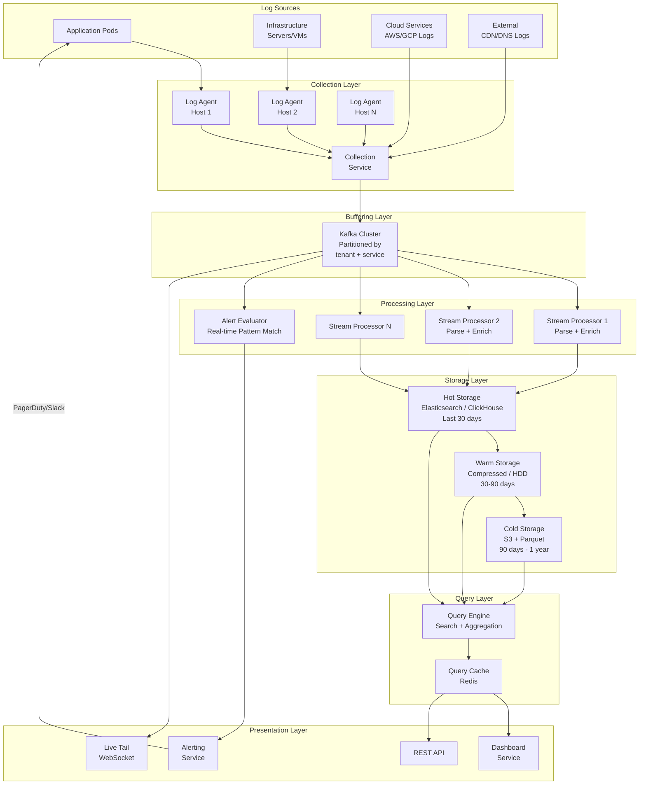
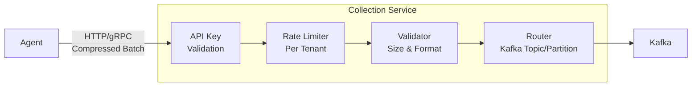
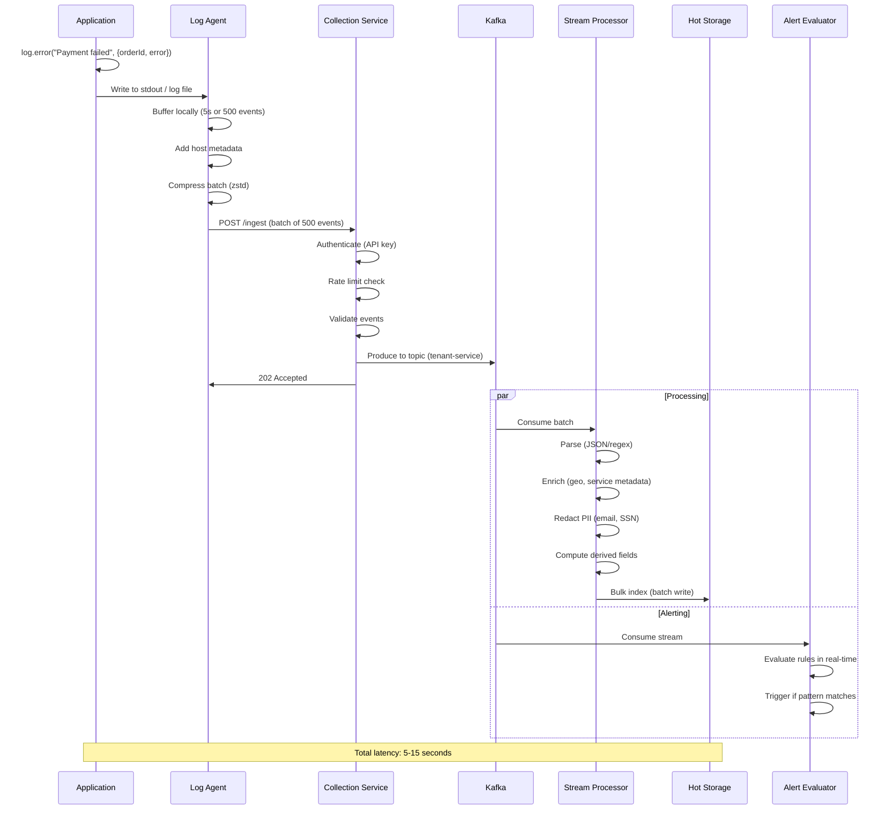
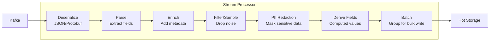
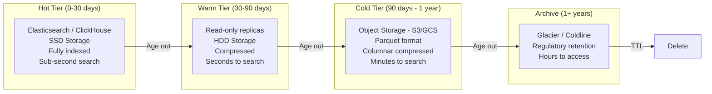
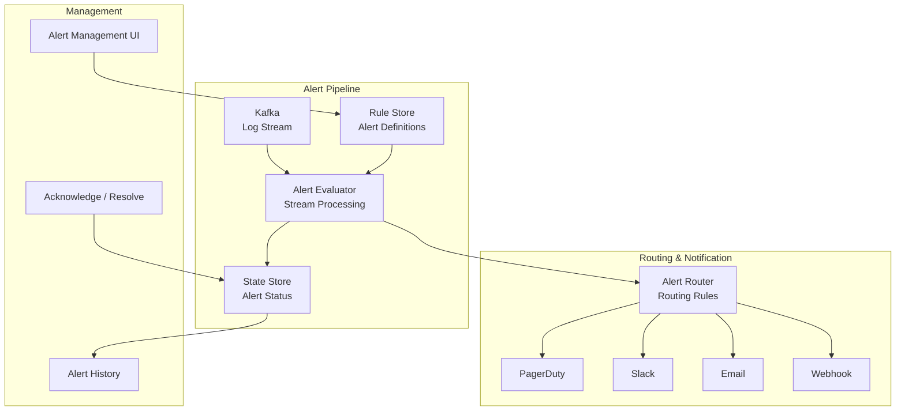
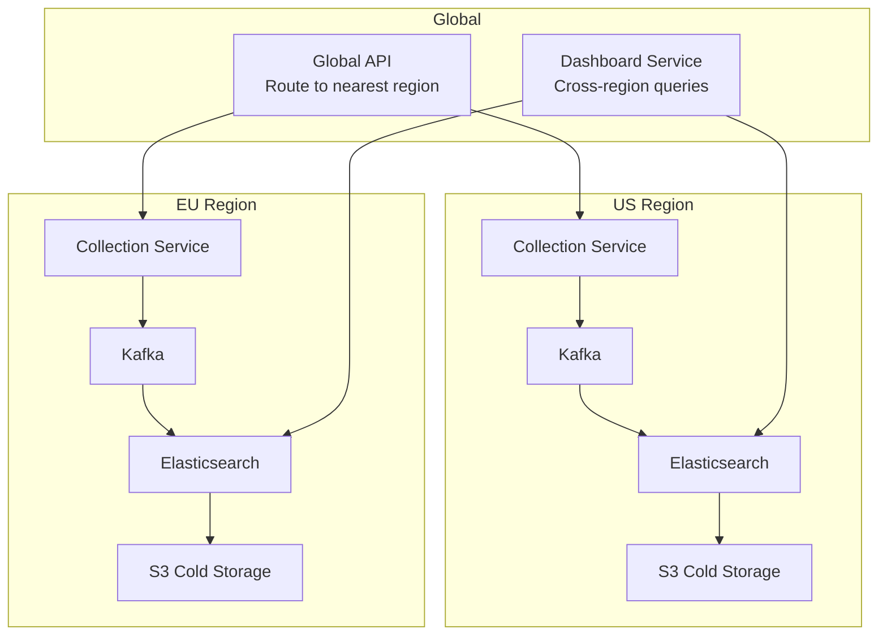

# System Design Interview: Logging & Analytics Platform
### Datadog / Splunk / ELK Scale
> [!NOTE]
> **Staff Engineer Interview Preparation Guide** -- High Level Design Round

---

## Table of Contents

1. [Requirements](#1-requirements)
2. [Capacity Estimation](#2-capacity-estimation)
3. [High-Level Architecture](#3-high-level-architecture)
4. [Core Components Deep Dive](#4-core-components-deep-dive)
5. [Log Ingestion Pipeline](#5-log-ingestion-pipeline)
6. [Log Format & Structuring](#6-log-format--structuring)
7. [Message Queue as Buffer](#7-message-queue-as-buffer)
8. [Log Processing](#8-log-processing)
9. [Storage Tiers](#9-storage-tiers)
10. [Search & Query Engine](#10-search--query-engine)
11. [Dashboards & Visualization](#11-dashboards--visualization)
12. [Alerting Engine](#12-alerting-engine)
13. [Log Retention & Lifecycle](#13-log-retention--lifecycle)
14. [Multi-Tenancy](#14-multi-tenancy)
15. [Data Models & Storage](#15-data-models--storage)
16. [Scalability Strategies](#16-scalability-strategies)
17. [Design Trade-offs](#17-design-trade-offs)
18. [Platform Comparison](#18-platform-comparison)
19. [Interview Cheat Sheet](#19-interview-cheat-sheet)

---

## 1. Requirements

> [!TIP]
> **Interview Tip:** Logging platform design is deceptively complex. It looks like "just store and search text," but the scale (millions of events per second) and the diverse query patterns (full-text search, aggregation, time-series analysis) make it one of the hardest storage system design problems. Clarify whether the interviewer wants log management, metrics, traces, or all three (observability platform).

### Questions to Ask the Interviewer

| Category | Question | Why It Matters |
|----------|----------|----------------|
| **Scale** | How many log events per second at peak? | Drives ingestion pipeline and storage architecture |
| **Scope** | Logs only, or also metrics and traces? | Full observability vs log management |
| **Search** | What search latency is acceptable? | Real-time search vs batch analytics |
| **Retention** | How long must logs be retained? | Hot vs cold storage design |
| **Tenancy** | Single organization or multi-tenant SaaS? | Isolation, quotas, billing complexity |
| **Compliance** | Any data residency or audit requirements? | Affects storage regions and retention policy |
| **Format** | Structured JSON or unstructured text? | Schema-on-read vs schema-on-write |
| **Alerting** | Real-time alerting on log patterns? | Streaming processing requirements |

---

### Functional Requirements

- Ingest logs from thousands of services and hosts
- Full-text search across log messages with filtering by service, level, time range
- Structured field search (e.g., `service:api-gateway AND status_code:500`)
- Pre-built and custom dashboards for log analytics
- Alerting on log patterns, error rates, and anomalies
- Log retention with configurable policies per service/team
- Correlation of logs across services using trace IDs
- Live tail: real-time streaming view of incoming logs

### Non-Functional Requirements

- **Write throughput:** 1 million log events per second sustained, 5M peak
- **Search latency:** < 5 seconds for queries over the last 24 hours
- **Search latency (recent):** < 1 second for the last 15 minutes
- **Ingestion latency:** < 10 seconds from log generation to searchability
- **Availability:** 99.9% for ingestion (logs must not be lost), 99.5% for search
- **Durability:** Zero log loss after acknowledgment
- **Cost efficiency:** Storage cost must decrease as logs age
- **Multi-tenant:** Complete isolation between tenants with per-tenant quotas

---

## 2. Capacity Estimation

> [!TIP]
> **Interview Tip:** Logging platforms are dominated by write-heavy workloads. The read:write ratio might be 1:100 or even 1:1000 (logs are written constantly but searched occasionally). This is the opposite of most web applications and drives very different architectural choices.

### Traffic Estimation

```
Number of services: 5,000
Average hosts per service: 20
Total hosts: 100,000

Average log lines per host per second: 10
Peak log lines per host per second: 50

Sustained ingestion rate: 100,000 hosts x 10 lines/sec = 1,000,000 events/sec
Peak ingestion rate: 100,000 hosts x 50 lines/sec = 5,000,000 events/sec

Average log event size: 500 bytes (structured JSON)
Metadata overhead: 200 bytes (timestamps, indexes, etc.)
Total per event: 700 bytes
```

### Storage Estimation

```
Daily raw log volume:
  1M events/sec x 86,400 sec x 500 bytes = ~43 TB/day (raw)
  With metadata and indexing overhead (~2x): ~86 TB/day

Storage by tier (30-day hot, 90-day warm, 1-year cold):
  Hot (Elasticsearch/ClickHouse, SSD):
    86 TB/day x 30 days = 2.58 PB
    With replication factor 2: ~5.16 PB SSD storage

  Warm (compressed, HDD):
    86 TB/day x 60 days x 0.3 (compression) = 1.55 PB

  Cold (S3, Parquet):
    43 TB/day x 275 days x 0.2 (columnar compression) = 2.37 PB

  Total: ~9 PB across all tiers
```

### Bandwidth Estimation

```
Ingestion bandwidth:
  1M events/sec x 700 bytes = 700 MB/sec = ~5.6 Gbps sustained
  Peak (5x): ~28 Gbps

Internal bandwidth (Kafka replication, index building):
  ~3x ingestion = ~2.1 GB/sec sustained

Search query bandwidth:
  Average query scans 1 GB of data, 100 concurrent queries
  = 100 GB/sec read throughput needed from storage
```

### Compute Estimation

```
Kafka brokers: ~30 (handling 700 MB/sec with replication)
Log processors: ~200 (parsing, enrichment, PII redaction)
Elasticsearch/ClickHouse nodes: ~500 (hot tier, serving search)
Warm storage nodes: ~100
Cold storage: S3 (managed)
```

> [!NOTE]
> These numbers illustrate why logging is one of the most expensive infrastructure components at scale. Many organizations spend more on observability than on the applications being observed. Cost optimization is a first-class design concern, not an afterthought.

---

## 3. High-Level Architecture



### Architecture Principles

**Decouple ingestion from processing.** Kafka sits between log collection and processing. This means bursts of logs do not overwhelm the processing pipeline -- Kafka absorbs the burst and processors consume at their own pace.

**Schema-on-read over schema-on-write.** Logs arrive in diverse formats. Rather than forcing all services to emit logs in a rigid schema, we store semi-structured data (JSON) and apply schema at query time. This makes onboarding new services trivial.

**Tiered storage by age.** Recent logs are queried frequently and need fast access. Older logs are queried rarely and can tolerate slower access in exchange for dramatically lower storage costs.

**Separate write and read paths.** Ingestion and search have very different performance characteristics. The write path is optimized for throughput (batch writes, append-only). The read path is optimized for latency (indexes, caches, query optimization).

> [!IMPORTANT]
> The single most important architectural decision is the choice of storage engine for the hot tier. Elasticsearch (inverted index) excels at full-text search. ClickHouse (columnar) excels at analytical queries (aggregation, group-by). Many modern platforms use both: Elasticsearch for log search, ClickHouse or a time-series database for metrics derived from logs.

---

## 4. Core Components Deep Dive

### Log Agent

The log agent runs on every host (server, VM, container) and is responsible for collecting logs and shipping them to the collection service.

**Functions:**
- **File tailing:** Monitor log files (e.g., `/var/log/app.log`) and read new lines as they are appended
- **Container log collection:** Read from Docker/Kubernetes log drivers (stdout/stderr)
- **Syslog/journald integration:** Collect system-level logs
- **Buffering:** Store logs locally if the collection service is unavailable (local disk buffer)
- **Batching:** Group log lines into batches (e.g., 100 lines or 100KB, whichever comes first) to reduce network overhead
- **Compression:** Compress batches (gzip/zstd) before sending to reduce bandwidth
- **Metadata enrichment:** Add host-level metadata (hostname, IP, OS, container ID, pod name)
- **Basic parsing:** Extract structured fields from common log formats (Apache, nginx, JSON)

**Popular agents:** Fluentd, Fluent Bit, Vector, Datadog Agent, Filebeat

```
Agent Configuration Example:
  - Source: /var/log/myapp/*.log
  - Parser: JSON
  - Tags: service=api-gateway, env=production, region=us-east-1
  - Buffer: 100MB local disk
  - Batch: 500 events or 1MB, whichever first
  - Flush interval: 5 seconds
  - Compression: zstd
  - Destination: collection-service.internal:8443
```

### Collection Service

The collection service is the centralized entry point for all log data. It receives log batches from agents, validates them, applies tenant-level rate limiting, and publishes to Kafka.

**Why a collection service instead of agents writing directly to Kafka?**
- **Protocol abstraction:** Agents speak HTTP/gRPC; the collection service translates to Kafka's protocol
- **Authentication:** The collection service validates API keys and assigns logs to tenants
- **Rate limiting:** Enforces per-tenant ingestion quotas before data enters the pipeline
- **Routing:** Determines which Kafka topic/partition based on tenant and service
- **Validation:** Rejects malformed or oversized log events



> [!TIP]
> **Interview Tip:** The collection service is a critical chokepoint. It must be horizontally scalable and highly available. Deploy it behind a load balancer with health checks. If the collection service is down, agents buffer locally. If Kafka is down, the collection service buffers in memory (bounded) and applies backpressure to agents.

---

## 5. Log Ingestion Pipeline

### End-to-End Flow



### Ingestion Guarantees

| Guarantee Level | Description | Implementation |
|----------------|-------------|----------------|
| **At-most-once** | Logs may be lost but never duplicated | Agent fires and forgets, no retry |
| **At-least-once** | Logs are never lost but may be duplicated | Agent retries on failure, Kafka acks, deduplication at storage |
| **Exactly-once** | Logs are neither lost nor duplicated | Kafka transactions + idempotent writes (expensive) |

Most logging platforms choose **at-least-once** delivery. Duplicate logs are tolerable (and can be deduplicated at query time using event IDs). Lost logs are not acceptable -- they could mean missing the evidence of a critical production incident.

### Backpressure Handling

When the system is overwhelmed, backpressure propagates backwards:

```
Storage full → Processor backs up → Kafka lag increases → Collection service
slows acks → Agent buffer fills → Agent applies sampling or drops oldest logs

Graceful degradation strategy:
1. First: Increase Kafka consumer parallelism (add processors)
2. Second: Reduce processing (skip enrichment, store raw)
3. Third: Apply sampling at collection service (keep 1 in N events)
4. Fourth: Agent drops DEBUG/TRACE level logs (keep ERROR/WARN)
5. Last resort: Agent drops oldest buffered logs
```

> [!WARNING]
> Losing logs during an incident is the worst possible outcome -- that is exactly when you need them most. Design the backpressure strategy to preferentially drop low-severity logs (DEBUG, TRACE) and always retain high-severity logs (ERROR, FATAL). Some systems have a "fast path" for ERROR+ logs that bypasses the normal pipeline.

---

## 6. Log Format & Structuring

### Structured vs Unstructured Logs

**Unstructured (traditional):**
```
2024-03-15 14:23:45.123 ERROR [api-gateway] [req-abc123] Payment processing failed for order 12345: timeout after 30s
```

**Structured (JSON):**
```json
{
  "timestamp": "2024-03-15T14:23:45.123Z",
  "level": "ERROR",
  "service": "api-gateway",
  "request_id": "req-abc123",
  "trace_id": "trace-xyz789",
  "span_id": "span-456",
  "message": "Payment processing failed",
  "order_id": 12345,
  "error_type": "TimeoutException",
  "timeout_ms": 30000,
  "host": "api-gw-pod-7d8f9",
  "region": "us-east-1",
  "environment": "production"
}
```

Structured logging is strictly superior for a logging platform because:
- Fields can be indexed and searched independently (`order_id:12345`)
- Aggregation queries work on typed fields (`count by error_type where level=ERROR`)
- No regex parsing needed at query time
- Consistent field names enable cross-service correlation

### Schema-on-Read vs Schema-on-Write

| Approach | Description | Pros | Cons |
|----------|-------------|------|------|
| **Schema-on-write** | Define schema before ingestion; reject non-conforming logs | Fast queries, optimized storage | Rigid, hard to onboard new services, schema evolution is painful |
| **Schema-on-read** | Store raw/semi-structured data; apply schema at query time | Flexible, easy onboarding, handles any format | Slower queries, more storage, type conflicts possible |

Most logging platforms use schema-on-read with some schema-on-write optimizations:
- Core fields (timestamp, level, service, host) are enforced at ingestion
- Application-specific fields are stored as dynamic JSON and indexed on first occurrence
- High-cardinality fields (request IDs, user IDs) are indexed but not aggregated
- Low-cardinality fields (service, level, region) are optimized for filtering and aggregation

### Correlation IDs

For distributed systems, a single user request may generate logs across dozens of services. Correlation IDs link these logs together:

**Request ID:** Unique per user request, propagated via HTTP headers (`X-Request-ID`). All logs generated while handling this request include the same request ID.

**Trace ID:** Part of distributed tracing (OpenTelemetry). Identifies the entire distributed transaction across services. Trace IDs connect logs to traces.

**Span ID:** Identifies a specific operation within a trace. A trace contains multiple spans (one per service hop). Logs within a span share the span ID.

```
User Request → API Gateway → Auth Service → Order Service → Payment Service

All services log with:
  trace_id: "trace-xyz789"  (same across all services)
  span_id:  "span-001" (API Gateway), "span-002" (Auth), etc.
  request_id: "req-abc123"  (same across all services)

Querying trace_id:"trace-xyz789" returns ALL logs for this request,
across ALL services, in chronological order.
```

---

## 7. Message Queue as Buffer

### Why Kafka?

Kafka sits between log collection and processing, serving as a durable buffer that decouples producers from consumers. Here is why Kafka is the standard choice for log pipelines:

**Durability:** Messages are written to disk and replicated across brokers. Even if all consumers are down, logs are not lost.

**High throughput:** Kafka achieves millions of messages per second per cluster through sequential disk writes, zero-copy transfer, and batching.

**Consumer groups:** Multiple consumer groups can independently read the same data. The processing pipeline, alerting engine, and live tail feature all consume from the same Kafka topics without interfering with each other.

**Retention:** Kafka can retain data for days or weeks, acting as a replay buffer. If you need to re-process logs (e.g., after fixing a parsing bug), you can reset the consumer offset and replay.

**Ordering:** Within a partition, messages are strictly ordered. Partitioning by service or host ensures logs from the same source are processed in order.

### Topic and Partition Design

```
Topic structure:
  logs.{tenant_id}.raw
    - Partition 0: service-A, service-B (hashed by service name)
    - Partition 1: service-C, service-D
    - ...
    - Partition N: (total partitions = desired parallelism)

  logs.{tenant_id}.processed
    - Same partition count as raw
    - Processor writes enriched events here

  logs.alerts
    - Alert evaluator consumes from all tenant topics
    - Partitioned by alert rule ID
```

**Partition count:** The number of partitions determines the maximum consumer parallelism. If you have 100 partitions, you can have at most 100 consumer instances in a consumer group. For 1M events/sec with each consumer handling 10K events/sec, you need ~100 partitions.

**Partition key:** Hash of `tenant_id + service_name`. This ensures all logs from the same service within a tenant go to the same partition, preserving order. It also ensures even distribution across partitions.

### Kafka Sizing

```
Cluster sizing for 1M events/sec:

Event size (average): 700 bytes (with Kafka overhead)
Throughput: 700 MB/sec ingestion
Replication factor: 3
Total write throughput: 2.1 GB/sec across cluster

Per broker (assuming 10 Gbps NIC, 60% utilization):
  Effective throughput per broker: ~600 MB/sec
  Brokers needed: 2.1 GB / 0.6 GB = 4 (minimum)
  With headroom and read traffic: ~20-30 brokers

Retention: 72 hours
Storage per broker: 700 MB/sec x 72h x 3600 / 30 brokers = ~6 TB
```

> [!NOTE]
> Kafka's storage is temporary -- it is a buffer, not the final destination. The 72-hour retention provides enough time to recover from processing failures and replay data if needed. The actual long-term storage is in Elasticsearch/ClickHouse/S3.

---

## 8. Log Processing

### Processing Pipeline

The stream processor (Kafka consumer) transforms raw log events into indexed, searchable documents:



### Parsing

**JSON logs:** Already structured, minimal parsing needed. Validate types, flatten nested objects.

**Unstructured logs:** Use regex patterns (grok patterns) to extract fields:

```
Input:  "2024-03-15 14:23:45 ERROR [api-gw] Request /api/orders failed: 500"
Pattern: %{TIMESTAMP:timestamp} %{LOGLEVEL:level} \[%{WORD:service}\] %{GREEDYDATA:message}
Output: {
  "timestamp": "2024-03-15 14:23:45",
  "level": "ERROR",
  "service": "api-gw",
  "message": "Request /api/orders failed: 500"
}
```

### Enrichment

The enrichment step adds contextual metadata that was not present in the original log:

| Enrichment | Source | Example |
|------------|--------|---------|
| Host metadata | CMDB / cloud API | OS, instance type, availability zone |
| Service metadata | Service catalog | Team, owner, tier, on-call rotation |
| Geo IP | MaxMind database | Country, city from IP address |
| Kubernetes metadata | K8s API / labels | Namespace, deployment, replica set |
| Previous context | State store | Related error count in last 5 minutes |

### PII Redaction

Logs frequently contain personally identifiable information that must be removed or masked before storage:

```
Redaction rules:
  - Email: user@example.com → u***@example.com
  - SSN: 123-45-6789 → ***-**-6789
  - Credit card: 4111-1111-1111-1111 → ****-****-****-1111
  - IP address: 192.168.1.100 → 192.168.1.xxx (optional)
  - Custom patterns: defined per tenant

Implementation:
  - Regex-based pattern matching (fast, catches known patterns)
  - ML-based NER (Named Entity Recognition) for unstructured text (slower, catches more)
  - Field-level redaction rules (always redact field "password", "secret_key")
```

> [!IMPORTANT]
> PII redaction must happen BEFORE logs are written to the hot storage. Once PII is indexed, it is very difficult to remove it from all replicas and backups. This is a compliance requirement (GDPR, CCPA) and a security best practice.

### Sampling and Filtering

Not all logs are equally valuable. Processing and storing every DEBUG log from every service is wasteful:

| Strategy | Description | Use Case |
|----------|-------------|----------|
| Level-based filtering | Drop DEBUG/TRACE in production | Reduce volume by 50-80% |
| Sampling | Keep 1 in N events for high-volume services | Control cost for noisy services |
| Head-based sampling | Keep all logs for sampled requests (by trace ID) | Preserve complete request flows |
| Dynamic sampling | Increase sampling rate when errors spike | Capture more detail during incidents |
| Deduplication | Collapse repeated identical messages | "Connection refused" appearing 10,000 times becomes 1 event with count=10000 |

---

## 9. Storage Tiers

### Three-Tier Storage Architecture



### Hot Tier: Elasticsearch

Elasticsearch is the most popular choice for the hot tier because of its full-text search capabilities:

**Inverted Index:** For every word in every log message, Elasticsearch maintains a mapping from word to document IDs. Searching for "payment failed" finds all documents containing both words in milliseconds, even across billions of documents.

**Index per time period:** Logs are stored in time-based indices (e.g., `logs-2024.03.15`). This makes time-range queries efficient and enables easy retention (delete old indices).

**Shard architecture:** Each index is split into shards distributed across nodes. Queries run in parallel across all shards.

```
Elasticsearch Index Strategy:

Index pattern: logs-{tenant}-{YYYY.MM.dd}
  - logs-acme-2024.03.15
  - logs-acme-2024.03.16
  - logs-widgetcorp-2024.03.15

Shard count per index: 5 (for medium-volume tenants)
Replica count: 1 (each shard has one replica for availability)

Index Lifecycle Management (ILM):
  Hot phase (0-7 days): Primary shards on SSD, writable
  Warm phase (7-30 days): Force merge, move to HDD, read-only
  Delete trigger: 30 days (moved to warm tier before deletion)
```

### Hot Tier: ClickHouse (Alternative)

ClickHouse is a columnar database that excels at analytical queries:

**Columnar storage:** Data is stored by column rather than by row. A query like `SELECT count(*) WHERE level='ERROR' GROUP BY service` only reads the `level` and `service` columns, skipping the large `message` column entirely. This provides 10-100x compression and 10-100x faster analytical queries compared to row-based storage.

**MergeTree engine:** ClickHouse's native table engine uses a log-structured merge tree with sorted data. Primary key (typically `timestamp, service`) enables fast range scans. Data is automatically partitioned by time.

**When to choose ClickHouse over Elasticsearch:**
- Primary use case is analytics/aggregation, not full-text search
- Cost sensitivity (ClickHouse is 3-5x cheaper per GB for similar query performance)
- Very high cardinality dimensions (ClickHouse handles this better)
- SQL is preferred over Elasticsearch's query DSL

**When to choose Elasticsearch over ClickHouse:**
- Primary use case is full-text search across log messages
- Need fuzzy matching, stemming, or natural language search
- Existing team expertise with Elastic ecosystem
- Need for complex text analysis pipelines

### Warm Tier

Warm storage keeps logs that are still occasionally searched but do not need the performance of hot storage:

```
Warm tier characteristics:
  - Storage: HDD (5-10x cheaper than SSD per TB)
  - Compression: zstd at high level (10:1 compression ratio)
  - Index: Sparse index (one entry per block instead of per document)
  - Replicas: 1 (reduced from hot tier)
  - Query latency: 5-30 seconds (acceptable for older data)

Transition from hot to warm:
  1. Force-merge Elasticsearch shards (reduce segment count)
  2. Shrink index (reduce shard count)
  3. Enable best_compression codec
  4. Move to HDD-backed nodes
  5. Set index to read-only
```

### Cold Tier: Object Storage + Parquet

For logs older than 90 days, store in object storage (S3, GCS) in Parquet format:

**Parquet advantages:**
- Columnar format: excellent compression (20:1 typical for logs)
- Predicate pushdown: only read relevant columns and row groups
- Compatible with analytics engines (Spark, Presto, Athena)
- Extremely cheap storage ($0.023/GB/month on S3 Standard)

**Query pattern:** Cold tier queries use an analytics engine (AWS Athena, Presto, Spark) that reads Parquet files from S3. These queries take minutes, not seconds, but are acceptable for historical investigation.

```
Cold tier organization:
  s3://logs-archive/
    tenant=acme/
      service=api-gateway/
        year=2024/
          month=03/
            day=15/
              hour=14/
                part-00001.parquet (250 MB, ~500K events)
                part-00002.parquet
```

> [!TIP]
> **Interview Tip:** The three-tier storage architecture is the most important design decision in a logging platform. Be prepared to discuss the cost-performance trade-offs at each tier. Hot tier costs ~$0.10/GB/month (SSD + compute + replication). Cold tier costs ~$0.005/GB/month (S3 + compression). That is a 20x cost difference, which is why tiered storage is essential at scale.

---

## 10. Search & Query Engine

### Query Language

Most logging platforms support a structured query language. Common syntaxes include:

**Lucene/KQL (Kibana Query Language):**
```
level:ERROR AND service:api-gateway AND message:"payment failed"
  AND @timestamp:[2024-03-15T14:00:00 TO 2024-03-15T15:00:00]
  AND NOT status_code:200
```

**SQL-like (ClickHouse, Loki with LogQL):**
```sql
SELECT timestamp, service, message
FROM logs
WHERE level = 'ERROR'
  AND service = 'api-gateway'
  AND message LIKE '%payment failed%'
  AND timestamp BETWEEN '2024-03-15 14:00:00' AND '2024-03-15 15:00:00'
ORDER BY timestamp DESC
LIMIT 100
```

### Inverted Index (Full-Text Search)

Elasticsearch builds an inverted index for every field:

```
Inverted Index for field "message":

  "payment"  → [doc1, doc5, doc12, doc89, ...]
  "failed"   → [doc1, doc5, doc23, doc89, ...]
  "timeout"  → [doc5, doc12, doc34, ...]
  "success"  → [doc2, doc3, doc7, ...]

Query: message:"payment failed"
  → Intersect posting lists for "payment" and "failed"
  → Result: [doc1, doc5, doc89, ...]
```

**Advantages:** Full-text search in milliseconds across billions of documents. Supports fuzzy matching, stemming, and relevance scoring.

**Disadvantages:** Index size is 30-50% of the raw data size. Building the index consumes significant CPU. High-cardinality fields (request IDs, UUIDs) create enormous posting lists.

### Columnar Storage (Analytics Queries)

ClickHouse stores data in columns, which is optimal for aggregation queries:

```sql
-- "Show me the error rate per service for the last hour"
SELECT
  service,
  count(*) as total,
  countIf(level = 'ERROR') as errors,
  errors / total * 100 as error_rate
FROM logs
WHERE timestamp > now() - INTERVAL 1 HOUR
GROUP BY service
ORDER BY error_rate DESC
```

This query only reads the `service`, `level`, and `timestamp` columns. In a row-based store, it would read every column of every row. For logs where the `message` column is 10x larger than the other columns, columnar storage provides a 10x speedup.

### Query Optimization

| Technique | Description | Benefit |
|-----------|-------------|---------|
| Time-range pruning | Only search indices/partitions within the query's time range | Skip 90%+ of data |
| Bloom filters | Quick check if a term exists in a shard before scanning | Skip shards that cannot have matches |
| Query caching | Cache results of recent identical queries | Sub-millisecond for repeated queries |
| Scroll/cursor | Return results in pages, fetching only what the user views | Reduce memory for large result sets |
| Pre-aggregation | Pre-compute common aggregations (error count per minute per service) | Instant dashboard rendering |
| Materialized views | Maintain running aggregations as data is ingested | No query-time aggregation needed |

### Live Tail

Live tail shows logs in real-time as they are ingested. Implementation:

```
Live tail architecture:
1. Client opens WebSocket connection to live tail service
2. Client specifies filter: service=api-gateway AND level=ERROR
3. Live tail service subscribes to Kafka topic(s) matching the filter
4. For each consumed event, apply the filter
5. If event matches, forward to client via WebSocket
6. Client renders events in real-time (similar to `tail -f`)

Optimization:
  - If filter is on a Kafka partition key (service), only consume relevant partitions
  - Apply filter server-side to minimize WebSocket bandwidth
  - Buffer and batch (send every 100ms) to avoid overwhelming the client
  - Limit concurrent live tail sessions per user (expensive)
```

---

## 11. Dashboards & Visualization

### Pre-Aggregated Metrics from Logs

Rather than running aggregation queries on raw logs for every dashboard refresh, pre-compute common metrics during ingestion:

```
During log processing, maintain running aggregations:

Metric: error_count
  Dimensions: [tenant, service, level, status_code]
  Granularity: 1 minute
  Storage: Time-series database (InfluxDB, TimescaleDB, or ClickHouse)

Example aggregated row:
  timestamp: 2024-03-15T14:23:00Z
  tenant: acme
  service: api-gateway
  level: ERROR
  status_code: 500
  count: 47
  p50_latency_ms: 230
  p99_latency_ms: 1450
```

**Benefits:**
- Dashboard queries read from small aggregated tables instead of scanning billions of raw logs
- Consistent dashboard load time regardless of log volume
- Historical dashboard data remains fast even when raw logs have aged into cold storage

### Dashboard Types

**Log Explorer:** Interactive search interface. User enters a query, sees matching log events in a table with expandable detail view. Supports time range selection, field filtering, and saved searches.

**Time-Series Charts:** Line charts showing metrics over time. Error count per minute, request rate per second, P99 latency trend. Driven by pre-aggregated data.

**Top-N Tables:** Most common error messages, services with highest error rate, hosts with most warnings. Driven by aggregation queries.

**Log Pattern Detection:** Group similar log messages automatically (e.g., "Connection to X failed" where X varies). Show patterns with their frequency and trend. Useful for identifying new types of errors.

**Correlation View:** Given a trace ID, show all logs from all services in chronological order. Display the request flow across services with latency breakdown.

---

## 12. Alerting Engine

### Alert Architecture



### Alert Rule Types

**Threshold Alerts:** Trigger when a metric crosses a threshold.
```
Rule: "High Error Rate"
  Query: count(level=ERROR AND service=api-gateway) / count(*) > 5%
  Window: 5 minutes
  Severity: Critical
  Route: PagerDuty on-call rotation
```

**Anomaly Detection:** Trigger when behavior deviates from historical baseline.
```
Rule: "Unusual Error Volume"
  Query: count(level=ERROR AND service=api-gateway) per 5min
  Baseline: Rolling 7-day average for same time of day
  Threshold: > 3 standard deviations from baseline
  Severity: Warning
  Route: Slack #api-gateway-alerts
```

**Pattern Matching:** Trigger when a specific log pattern appears.
```
Rule: "Database Connection Pool Exhausted"
  Query: message:"connection pool exhausted" AND service:*
  Window: Any single occurrence
  Severity: Critical
  Route: PagerDuty + Slack #database-team
```

**Composite Alerts:** Combine multiple conditions.
```
Rule: "Cascading Failure"
  Conditions:
    - error_rate(service=api-gateway) > 10% for 5min
    - AND error_rate(service=payment-service) > 10% for 5min
    - AND p99_latency(service=order-service) > 5s for 5min
  Severity: Critical
  Route: PagerDuty engineering-manager
```

### Alert Evaluation

**Stream-based evaluation:** The alert evaluator consumes from Kafka in real-time. For each event, it checks against all matching alert rules. This provides near-real-time alerting (seconds after log generation).

**Window-based evaluation:** Many alert rules operate on time windows ("error count in last 5 minutes"). The evaluator maintains sliding window state for each rule:

```
Sliding Window Implementation:

For rule "error_rate > 5% in last 5min" for service=api-gateway:

State:
  window_buckets: [
    {minute: 14:20, errors: 12, total: 300},
    {minute: 14:21, errors: 15, total: 280},
    {minute: 14:22, errors: 8, total: 310},
    {minute: 14:23, errors: 45, total: 290},  ← spike
    {minute: 14:24, errors: 52, total: 305},  ← spike continues
  ]

  sum_errors = 132, sum_total = 1485
  error_rate = 132/1485 = 8.9% > 5% threshold → ALERT!
```

### Alert Fatigue Mitigation

| Strategy | Description |
|----------|-------------|
| **Deduplication** | Same alert firing repeatedly is collapsed into one notification |
| **Grouping** | Related alerts (same service, same time) are grouped into one notification |
| **Cooldown** | After alerting, wait N minutes before alerting again for the same rule |
| **Escalation** | Start with Slack notification; if not acknowledged in 10 minutes, escalate to PagerDuty |
| **Auto-resolve** | If condition clears, automatically resolve the alert |
| **Severity routing** | Critical → PagerDuty page, Warning → Slack, Info → Email digest |

> [!WARNING]
> Alert fatigue is the number one operational problem with logging platforms. If engineers receive hundreds of alerts per day, they start ignoring them, and real incidents get missed. Design the alerting system with strong deduplication, grouping, and severity routing from the start.

---

## 13. Log Retention & Lifecycle

### Automatic Tier Migration

```
Lifecycle Policy Example (per tenant):

  Service: api-gateway
  Priority: High (critical service)

  Hot tier: 30 days (Elasticsearch, SSD, fully indexed)
    → After 30 days: migrate to warm

  Warm tier: 60 days (Elasticsearch, HDD, compressed, read-only)
    → After 60 days: export to cold

  Cold tier: 275 days (S3, Parquet format)
    → After 275 days: move to archive or delete

  Total retention: 1 year

  ---

  Service: batch-job-runner
  Priority: Low (non-critical)

  Hot tier: 7 days
  Warm tier: 23 days
  Cold tier: None
  Total retention: 30 days
```

### Migration Process

**Hot to Warm:**
1. Elasticsearch Index Lifecycle Management (ILM) triggers the transition
2. Force-merge index segments (reduce from many small segments to 1 per shard)
3. Enable best compression codec
4. Shrink shards (reduce from 5 to 1 shard)
5. Move index to warm-tier nodes (HDD storage, cheaper instances)
6. Mark index as read-only

**Warm to Cold:**
1. Export Elasticsearch index to Parquet files
2. Upload Parquet files to S3 with appropriate partitioning
3. Register files in a metadata catalog (Hive Metastore, AWS Glue)
4. Delete Elasticsearch index
5. Update query engine to route old queries to cold tier

**Cold to Archive/Delete:**
1. Move S3 objects to Glacier storage class (or equivalent)
2. Or delete based on retention policy
3. Update metadata catalog

### Compliance Considerations

| Regulation | Requirement | Impact |
|------------|------------|--------|
| GDPR | Right to erasure | Must be able to delete specific user's logs across all tiers |
| SOC 2 | Audit trail retention | Security-relevant logs must be retained for defined period |
| HIPAA | PHI retention | Health data logs have specific retention requirements |
| PCI DSS | Cardholder data protection | Payment-related logs must be encrypted and access-controlled |
| Industry-specific | Varies | Financial services may require 7-year retention |

> [!NOTE]
> GDPR right-to-erasure is particularly challenging for logging systems. You cannot easily delete one user's logs from a Parquet file containing millions of events. Solutions include: (1) Pseudonymization at ingestion (replace user IDs with tokens, delete the token mapping), (2) Separate storage for PII-containing fields with independent deletion, (3) Acceptance that logs are a "legitimate interest" retention (legal guidance varies).

---

## 14. Multi-Tenancy

### Isolation Requirements

In a multi-tenant logging platform, each tenant (customer organization) must have:

**Data isolation:** Tenant A must never see Tenant B's logs. This is the most critical requirement.

**Performance isolation:** A noisy tenant generating 10x their normal log volume must not degrade search performance for other tenants.

**Cost isolation:** Each tenant's resource consumption must be independently metered for billing.

### Isolation Strategies

| Strategy | Description | Pros | Cons |
|----------|-------------|------|------|
| **Separate clusters** | Each tenant gets their own Elasticsearch cluster | Strongest isolation | Expensive, poor resource utilization |
| **Separate indices** | Shared cluster, tenant-specific indices | Good isolation, easy to manage | Many indices can strain cluster |
| **Shared indices with routing** | Shared indices, tenant ID in routing key | Efficient resource use | Weaker isolation, noisy neighbor risk |
| **Namespace isolation** | Shared everything with tenant ID as a field | Most efficient | Weakest isolation, requires careful access control |

**Recommended hybrid approach:**
- Large tenants: Dedicated indices on dedicated nodes (strong isolation)
- Medium tenants: Dedicated indices on shared nodes
- Small tenants: Shared indices with tenant routing key

### Rate Limiting and Quotas

```
Per-tenant quotas:

  Tenant: Acme Corp
  Plan: Enterprise

  Ingestion:
    - Rate limit: 50,000 events/sec (sustained)
    - Burst limit: 200,000 events/sec (for 60 seconds)
    - Daily volume limit: 2 TB/day
    - Action on limit: Reject with 429, oldest events dropped first

  Storage:
    - Hot tier quota: 50 TB
    - Total retention: 90 days hot, 1 year total
    - Action on limit: Auto-archive oldest data

  Query:
    - Concurrent queries: 20
    - Query timeout: 60 seconds
    - Scan limit: 10 TB per query
    - Action on limit: Query cancelled with explanation
```

### Access Control

```
Role-Based Access Control (RBAC):

  Tenant Admin:
    - Full access to all tenant logs
    - Manage alert rules and dashboards
    - Configure retention policies
    - Manage API keys

  Team Lead (service-scoped):
    - Access logs for assigned services only
    - Create alert rules for assigned services
    - View dashboards

  Developer:
    - Read-only access to assigned service logs
    - Cannot create alert rules
    - Cannot access PII-containing fields

  Security Auditor:
    - Read access to all logs (including PII)
    - Cannot modify anything
    - All queries are audit-logged
```

---

## 15. Data Models & Storage

### Core Data Models

**Log Event (Document)**

| Field | Type | Indexed | Description |
|-------|------|---------|-------------|
| event_id | UUID | Yes | Unique event identifier (for deduplication) |
| tenant_id | String | Yes (routing) | Tenant identifier |
| timestamp | DateTime(ms) | Yes (primary) | Event timestamp |
| ingested_at | DateTime(ms) | Yes | When the platform received the event |
| level | Enum | Yes | DEBUG, INFO, WARN, ERROR, FATAL |
| service | String | Yes | Source service name |
| host | String | Yes | Source hostname/pod |
| message | Text | Yes (full-text) | Log message body |
| trace_id | String | Yes | Distributed trace identifier |
| span_id | String | Yes | Span identifier |
| request_id | String | Yes | Request correlation ID |
| environment | String | Yes | production, staging, development |
| region | String | Yes | Geographic region |
| attributes | JSON | Yes (dynamic) | Additional structured fields |
| tags | Array[String] | Yes | User-defined tags |

**Alert Rule**

| Field | Type | Description |
|-------|------|-------------|
| rule_id | UUID (PK) | Unique rule identifier |
| tenant_id | UUID (FK) | Owning tenant |
| name | String | Human-readable rule name |
| description | Text | What this alert detects |
| query | Text | Log query / filter expression |
| condition | JSON | Threshold, comparison, window |
| window_seconds | Int | Time window for evaluation |
| severity | Enum | INFO, WARNING, CRITICAL |
| routing | JSON | Notification channels and escalation |
| enabled | Boolean | Whether the rule is active |
| cooldown_seconds | Int | Minimum time between notifications |
| created_by | UUID | Creator user |
| created_at | Timestamp | Creation time |
| updated_at | Timestamp | Last modification |

**Dashboard**

| Field | Type | Description |
|-------|------|-------------|
| dashboard_id | UUID (PK) | Unique identifier |
| tenant_id | UUID (FK) | Owning tenant |
| title | String | Dashboard name |
| description | Text | Dashboard purpose |
| layout | JSON | Panel positions and sizes |
| panels | JSON[] | Array of panel definitions |
| variables | JSON | Template variables (service, time range) |
| permissions | JSON | Who can view/edit |
| created_by | UUID | Creator |
| created_at | Timestamp | Creation time |
| updated_at | Timestamp | Last update |

### Storage Technology Summary

| Component | Technology | Purpose |
|-----------|-----------|---------|
| Hot log storage | Elasticsearch or ClickHouse | Full-text search, recent log queries |
| Warm log storage | Elasticsearch (HDD tier) | Compressed, read-only, older logs |
| Cold log storage | S3 + Parquet | Archival, infrequent queries |
| Alert rules & dashboards | PostgreSQL | CRUD operations, relational queries |
| Alert state | Redis | Real-time window state, deduplication |
| Ingestion buffer | Kafka | Durable message queue |
| Pre-aggregated metrics | ClickHouse or TimescaleDB | Dashboard queries |
| Query cache | Redis | Frequently repeated queries |
| User/tenant metadata | PostgreSQL | Account management |
| Metadata catalog | Hive Metastore / AWS Glue | Cold tier Parquet file registry |

---

## 16. Scalability Strategies

### Ingestion Scaling

```
Scale the write path independently of the read path:

Collection Service:
  - Stateless, behind load balancer
  - Add instances to handle more inbound connections
  - Bottleneck: Kafka produce throughput

Kafka:
  - Add brokers for more throughput
  - Increase partitions for more consumer parallelism
  - Each broker handles ~200-500 MB/sec

Stream Processors:
  - One consumer per Kafka partition (maximum parallelism)
  - Add partitions + consumers to scale processing
  - Processing is stateless (enrichment lookups are cached)

Hot Storage (Elasticsearch):
  - Add data nodes for more indexing throughput
  - Each node handles ~10,000-50,000 events/sec indexing
  - Use bulk API (batch 1000-5000 events per request)
```

### Search Scaling

```
Scale the read path:

Elasticsearch:
  - Add coordinating nodes (query routing, result aggregation)
  - Increase replica count (each replica can serve queries)
  - Separate hot and warm nodes (don't let warm queries slow hot)

Query Caching:
  - Cache results of common dashboard queries (Redis, 1-5 min TTL)
  - Pre-compute top-N and aggregation results

Cold Tier:
  - Use serverless query engines (Athena, BigQuery) that scale automatically
  - Partition Parquet files by tenant, service, and time for predicate pushdown
```

### Multi-Region Deployment



**Data residency:** Some tenants require logs to stay in a specific region (GDPR). The collection service routes logs to the correct region based on tenant configuration.

**Cross-region search:** When a tenant's logs span multiple regions, the dashboard service runs the query against each region's storage and merges results. This adds latency but maintains data residency compliance.

---

## 17. Design Trade-offs

### Elasticsearch vs ClickHouse for Hot Tier

| Dimension | Elasticsearch | ClickHouse |
|-----------|--------------|------------|
| **Full-text search** | Excellent (inverted index) | Limited (requires bloom filters or full scan) |
| **Aggregation queries** | Good | Excellent (columnar, vectorized) |
| **Storage efficiency** | 1.5-2x raw data (with index) | 0.3-0.5x raw data (columnar compression) |
| **Write throughput** | 10-50K events/sec/node | 100-500K events/sec/node |
| **Query language** | Lucene/KQL + DSL | SQL |
| **Operational complexity** | High (JVM tuning, shard management) | Medium (simpler architecture) |
| **Ecosystem** | Kibana, Beats, Logstash (ELK) | Grafana, various connectors |
| **Cost at scale** | Higher (storage + compute) | Lower (better compression + throughput) |

**Recommendation:** Use Elasticsearch if full-text search on log messages is the primary use case. Use ClickHouse if analytics/aggregation is the primary use case. Consider using both: Elasticsearch for interactive log search, ClickHouse for dashboard metrics and aggregation.

### Schema-on-Read vs Schema-on-Write

| Approach | When to Choose |
|----------|---------------|
| Schema-on-read | Many diverse log formats, rapid onboarding needed, exploration-heavy use |
| Schema-on-write | Well-defined log schema, performance-critical queries, cost optimization |
| Hybrid | Enforce core fields (timestamp, level, service), allow dynamic application fields |

### Push vs Pull Log Collection

| Approach | Description | Pros | Cons |
|----------|-------------|------|------|
| **Push (agent → server)** | Agent sends logs to collection service | Real-time, guaranteed delivery with retries | Agent must be installed on every host |
| **Pull (server scrapes agent)** | Server periodically pulls logs from agents | Server controls collection rate | Higher latency, misses events between scrapes |
| **Sidecar (Kubernetes)** | Agent runs as a sidecar container alongside app | No host-level agent needed | More containers, more resource overhead |

Most modern platforms use **push-based** collection with agents on every host. Kubernetes environments often use a **DaemonSet** (one agent pod per node) rather than sidecars.

### Cost Optimization Strategies

| Strategy | Savings | Trade-off |
|----------|---------|-----------|
| Aggressive tiering (7-day hot) | 60-70% storage cost | Slower search for 7+ day old logs |
| Sampling DEBUG/TRACE logs (1 in 10) | 40-50% volume reduction | Missing detail for debugging |
| Dropping log body, keeping fields | 50% storage | Cannot search message text |
| Short retention (30 days) | 70% storage | No historical investigation |
| Columnar hot tier (ClickHouse) | 60% vs Elasticsearch | Weaker full-text search |
| Deduplication of repeated messages | 10-30% volume | Slight processing overhead |

> [!TIP]
> **Interview Tip:** Cost is a central concern in logging platform design. At 10 TB/day, even small optimizations save millions of dollars annually. Mention cost trade-offs proactively -- it shows mature engineering judgment. A common pattern is: "We store structured fields in the hot tier for fast search, but we archive the raw log body to cold storage. If a user needs the full message for a specific event, we fetch it from cold storage on demand."

---

## 18. Platform Comparison

| Dimension | ELK Stack | Grafana Loki | ClickHouse | Datadog |
|-----------|----------|-------------|------------|---------|
| **Architecture** | Elasticsearch + Logstash + Kibana | Label-indexed, log chunks in object storage | Columnar OLAP database | Fully managed SaaS |
| **Indexing** | Full inverted index on all fields | Index on labels only, no full-text index | Sparse primary index, optional bloom | Full inverted index |
| **Storage model** | Index per time period, replicated shards | Chunks in S3/GCS, index in BoltDB | MergeTree tables, partitioned by time | Managed, multi-tier |
| **Full-text search** | Excellent | Limited (grep-like on chunks) | Limited | Excellent |
| **Analytics** | Good | Basic | Excellent | Good |
| **Cost efficiency** | Low (indexes are expensive) | High (minimal indexing, cheap storage) | High (columnar compression) | Very high (SaaS pricing) |
| **Operational burden** | High (cluster management) | Medium | Medium | None (managed) |
| **Scale limit** | 100s of TB with effort | PBs (object storage backed) | PBs | Managed, scales |
| **Best for** | Full-featured log search | Cost-sensitive, Kubernetes native | Analytics-heavy workloads | Teams wanting managed solution |

### When to Choose Each

**ELK Stack:** You need powerful full-text search, have ops expertise, and budget for Elasticsearch infrastructure. Good for organizations with dedicated platform teams.

**Grafana Loki:** You want cost-effective logging with Kubernetes, do not need full-text indexing, and are already using Grafana. The "grep for logs" approach works well when you filter by labels first.

**ClickHouse:** Your primary use case is analytics (dashboards, aggregations, time-series analysis) rather than searching through individual log messages. Best bang for buck on compute and storage.

**Datadog:** You want a fully managed solution, have budget for SaaS pricing, and value reduced operational burden over cost optimization. Excellent for fast-moving teams that do not want to operate infrastructure.

---

## 19. Interview Cheat Sheet

### 30-Second Summary

> A logging platform ingests millions of events per second from distributed agents through a Kafka-buffered pipeline. Events are parsed, enriched, and PII-redacted by stream processors before being written to tiered storage: hot tier (Elasticsearch or ClickHouse, 30 days, fast search), warm tier (compressed, HDD, 90 days), and cold tier (S3 + Parquet, 1 year, cheap archival). Full-text search uses inverted indexes; analytics use columnar storage. Alerting evaluates rules against the real-time stream for near-instant detection. Multi-tenancy is enforced through tenant-scoped indices, rate limiting, and RBAC. Cost is managed through aggressive tiering, sampling, and compression.

### Key Numbers to Remember

| Metric | Value |
|--------|-------|
| Ingestion rate (sustained) | 1M events/sec |
| Ingestion rate (peak) | 5M events/sec |
| Average event size | 500 bytes |
| Daily raw volume | ~43 TB/day |
| Search latency (hot, recent) | < 1 second |
| Search latency (hot, 30 days) | < 5 seconds |
| Search latency (cold) | Minutes |
| Ingestion-to-searchable delay | 5-15 seconds |
| Elasticsearch indexing rate/node | 10-50K events/sec |
| ClickHouse ingestion rate/node | 100-500K events/sec |
| Compression ratio (columnar/Parquet) | 5-20x |
| Hot tier cost | ~$0.10/GB/month |
| Cold tier cost (S3) | ~$0.005/GB/month |
| Kafka throughput per broker | 200-500 MB/sec |

### Architecture Decisions to Justify

| Decision | Justification |
|----------|---------------|
| Kafka as ingestion buffer | Decouples collection from processing; absorbs traffic bursts; enables replay |
| Agents on every host | Push-based collection provides lower latency and guaranteed delivery vs pull |
| Three-tier storage | 20x cost difference between hot and cold; most logs are rarely queried after 7 days |
| Elasticsearch for hot tier | Best-in-class full-text search; inverted index enables millisecond queries |
| Parquet for cold tier | Columnar compression reduces storage 5-20x; compatible with analytics engines |
| Per-tenant Kafka topics | Isolation at the queue level; independent scaling and rate limiting |
| Stream-based alerting | Near-real-time alert evaluation; seconds from log generation to alert |
| Pre-aggregated metrics for dashboards | Avoids scanning billions of raw events for every dashboard refresh |
| Schema-on-read with core fields | Flexibility for diverse log formats while maintaining query performance for common fields |

### Common Follow-Up Questions

**Q: How do you handle a sudden 10x spike in log volume?**
A: Kafka absorbs the burst (it is sized for peak, not average). If the spike persists, processors lag behind Kafka but continue processing. Auto-scaling adds more processor instances. If Kafka itself is overwhelmed, the collection service applies backpressure: it returns 429 to agents, which buffer locally. As a last resort, the collection service samples (keep 1 in N events) for low-severity logs while always accepting ERROR and above.

**Q: How do you delete a specific user's logs for GDPR compliance?**
A: At ingestion, we pseudonymize user identifiers: the real user ID is replaced with a token, and the mapping is stored separately. To "delete" a user's logs, we delete the token mapping. The logs remain but are no longer linkable to the individual. For fields that cannot be pseudonymized, we use per-user encryption keys and delete the key on erasure request.

**Q: How do you handle logs from a service that logs too much?**
A: Multiple layers of defense: (1) Per-service rate limiting at the collection service, (2) Dynamic sampling for high-volume services (keep 1 in 100 DEBUG logs), (3) Alerts to the service team when their log volume exceeds budget, (4) Automatic deduplication of repeated messages (collapse 10,000 identical errors into one event with count=10,000), (5) Quota enforcement -- when a tenant exceeds their daily volume limit, lower-priority logs are dropped.

**Q: Why not just use a time-series database for everything?**
A: Time-series databases (InfluxDB, Prometheus) are optimized for numeric metrics with fixed schemas. Logs are unstructured text with variable schemas. A time-series DB cannot efficiently perform full-text search across log messages. The right approach is to derive metrics from logs (error count, latency percentiles) and store those in a time-series DB for dashboards, while keeping the raw logs in a text-search engine for debugging.

**Q: How do you ensure no logs are lost during deployment of the processing pipeline?**
A: Kafka retains messages regardless of consumer state. When we deploy new processors, we gracefully drain the old consumers (they commit their offsets), then start the new consumers which resume from the committed offsets. No messages are skipped. If a consumer crashes before committing, it re-processes the last batch on restart (at-least-once delivery). Idempotent writes to storage handle duplicates.

**Q: How do you search across hot and cold tiers in a single query?**
A: The query engine determines which tiers contain data for the requested time range. For the hot portion, it queries Elasticsearch directly. For the cold portion, it queries an analytics engine (Athena/Presto) over Parquet files in S3. Results are merged by timestamp and returned to the user. The UI shows a warning that the query spans cold storage and may take longer.

### Red Flags to Avoid

- Do NOT propose storing all logs in a single relational database -- it cannot handle the write throughput or search patterns
- Do NOT forget about Kafka (or equivalent buffer) -- without it, burst traffic will overwhelm the storage layer
- Do NOT ignore the cost dimension -- logging at scale is enormously expensive; tiered storage is essential
- Do NOT treat all logs equally -- log levels, sampling, and retention policies must vary by service and severity
- Do NOT forget about PII redaction -- logs frequently contain sensitive data that must be handled before storage
- Do NOT propose synchronous writes from collection to storage -- this creates a brittle pipeline with no burst handling
- Do NOT use a single index for all tenants without discussing isolation trade-offs
- Do NOT assume full-text search is free -- inverted indexes consume significant storage and CPU
- Do NOT forget about alerting -- it is a primary use case, not an afterthought

---

> [!TIP]
> **Final Interview Tip:** The logging platform question tests your ability to reason about write-heavy systems at massive scale. The key differentiators are: (1) understanding the cost-performance trade-off across storage tiers, (2) designing a robust ingestion pipeline with Kafka-based buffering, (3) choosing the right storage engine for the query patterns (inverted index for search, columnar for analytics), and (4) addressing multi-tenancy with proper isolation and rate limiting. Show that you think about cost per GB at each tier -- it demonstrates the operational awareness that distinguishes senior engineers.
