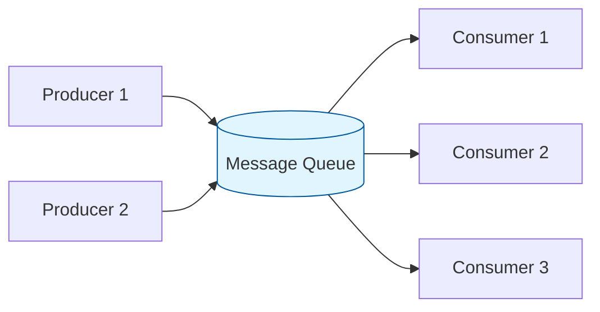
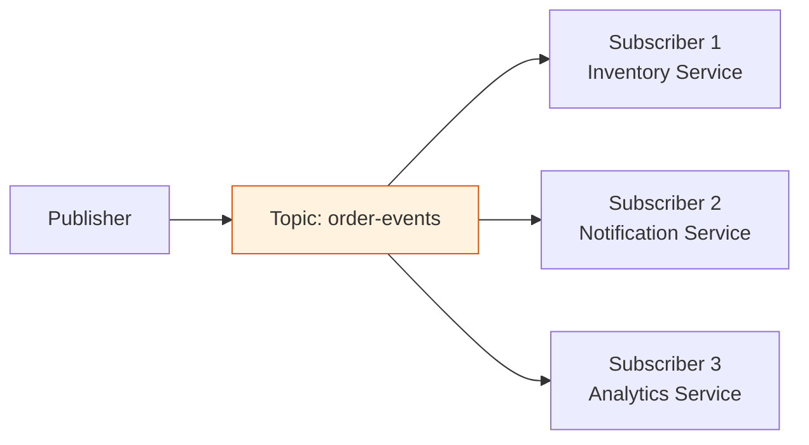
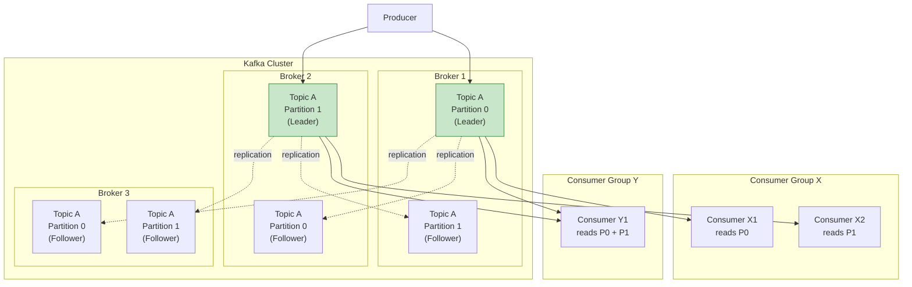
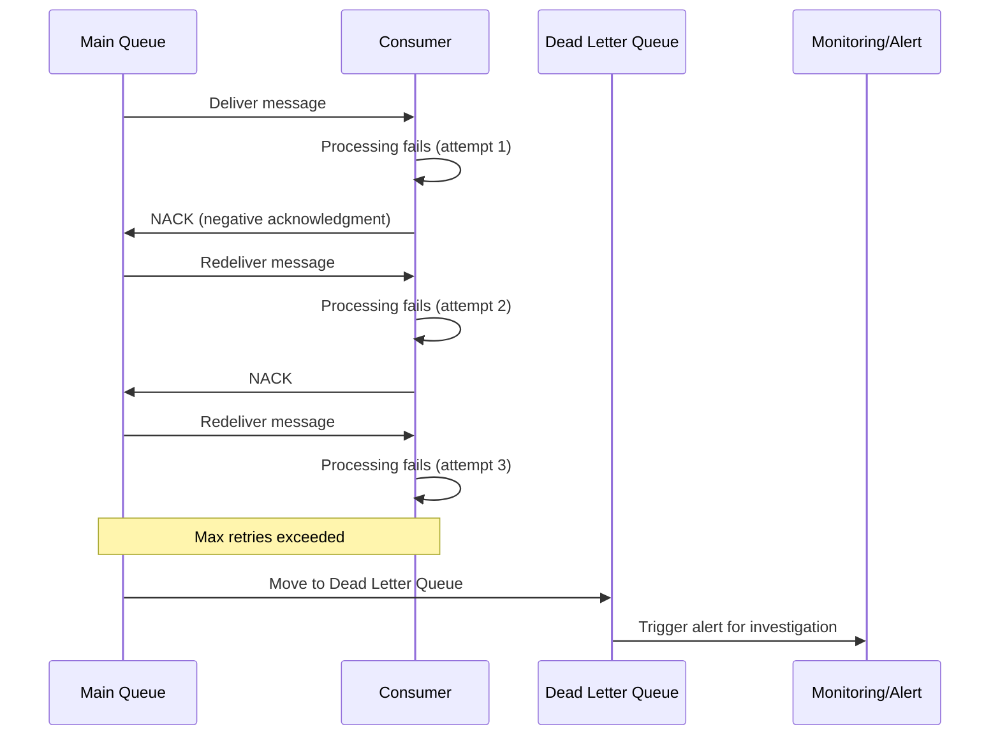
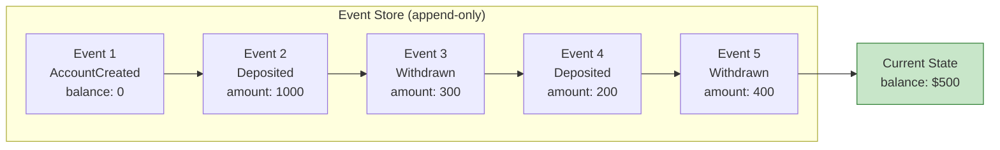
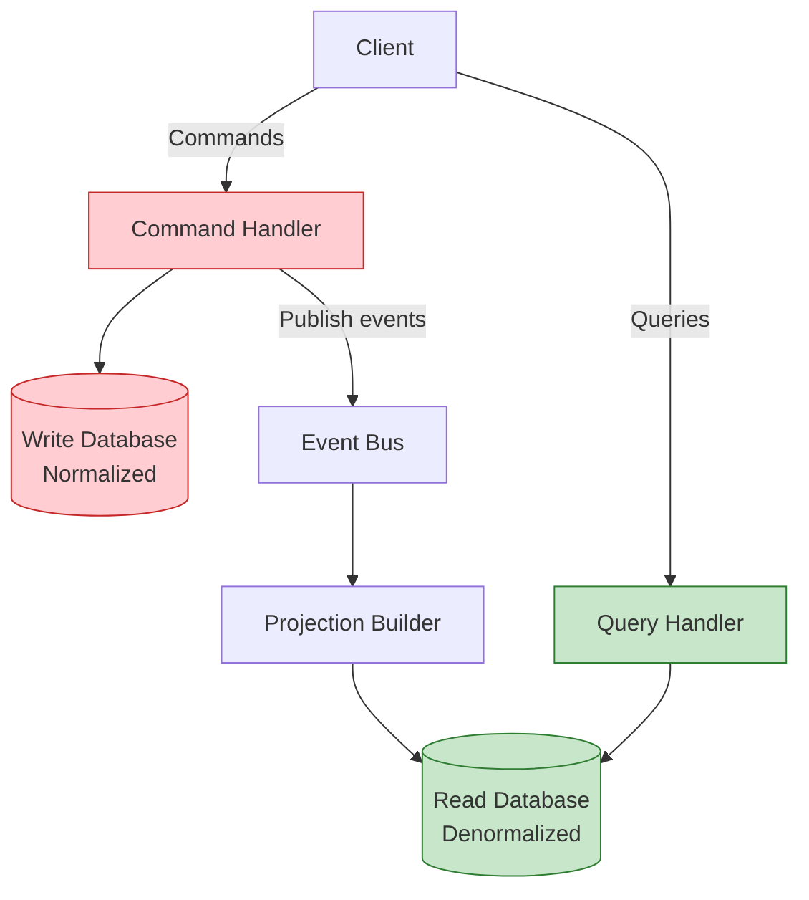
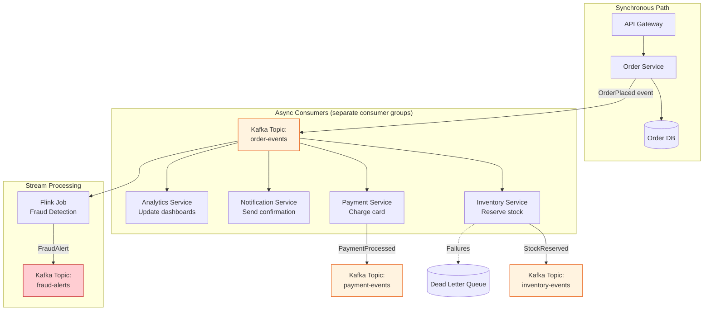
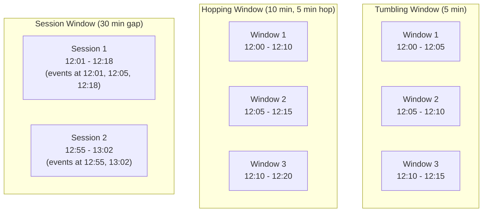

# Message Queues and Streaming

## Introduction

As systems grow beyond a single service, communication between components becomes a first-class design concern. Direct synchronous calls (REST, gRPC) create tight coupling: if the downstream service is slow or down, the caller is stuck. Message queues and streaming platforms decouple producers from consumers, enabling asynchronous communication, load leveling, and fault tolerance.

This article covers the full landscape: from basic message queue patterns to Kafka internals, event sourcing, CQRS, stream processing, and the nuances of delivery guarantees. These topics appear constantly in system design interviews at every level.

## Message Queues: The Fundamentals

### Point-to-Point Model

In the point-to-point model, a message is produced to a queue and consumed by exactly one consumer. Once a consumer processes and acknowledges the message, it is removed from the queue. If multiple consumers listen on the same queue, messages are distributed among them (competing consumers pattern).

**Key behaviors:**
- Each message is delivered to exactly one consumer
- Messages are typically persisted until acknowledged
- Failed messages can be retried or moved to a dead letter queue
- Order is generally FIFO within a single queue (but not guaranteed under high concurrency)

**Use cases:** Task distribution, work queues, order processing, email sending.

### Decoupling Producers and Consumers

The central value of a message queue is decoupling:

| Dimension | Without Queue | With Queue |
|-----------|--------------|------------|
| **Temporal coupling** | Producer waits for consumer | Producer fires and forgets |
| **Rate coupling** | Producer slows to consumer speed | Queue absorbs bursts |
| **Availability coupling** | Consumer down = producer fails | Queue buffers until consumer recovers |
| **Knowledge coupling** | Producer knows consumer address | Producer only knows queue address |

> [!NOTE]
> Queues shift complexity, they do not eliminate it. You now need to monitor queue depth, handle message serialization/deserialization, manage idempotency, and deal with poison messages. The tradeoff is worth it for most distributed systems, but not always for simple synchronous request-response flows.

## Publish-Subscribe Pattern

### Topic-Based Pub/Sub

Unlike point-to-point, publish-subscribe (pub/sub) delivers each message to ALL subscribers. Producers publish to a topic, and every consumer subscribed to that topic receives a copy.

**Fan-out** is the pattern where a single event triggers multiple downstream actions. When an order is placed, the inventory service reserves stock, the notification service sends a confirmation email, and the analytics service logs the event -- all independently, all from the same message.

### Topic vs Queue: When to Use Which

| Criteria | Queue (Point-to-Point) | Topic (Pub/Sub) |
|----------|----------------------|-----------------|
| **Consumer count** | One consumer per message | All subscribers get every message |
| **Use case** | Task distribution, work items | Event broadcasting, notifications |
| **Scaling** | Add consumers to process faster | Add subscribers for new concerns |
| **Replay** | Message gone after ack | Depends on implementation (Kafka: yes, SNS: no) |

## Apache Kafka Deep Dive

### Architecture Overview

Kafka is a distributed, partitioned, replicated commit log. It is not a traditional message queue -- it is a streaming platform that retains messages for a configurable period regardless of whether they have been consumed.

**Core concepts:**

- **Broker:** A Kafka server. A cluster has multiple brokers for fault tolerance.
- **Topic:** A logical channel for messages. An "order-events" topic receives all order-related events.
- **Partition:** A topic is split into partitions. Each partition is an ordered, immutable sequence of messages (a commit log). Partitions enable parallelism -- different consumers read different partitions simultaneously.
- **Offset:** Each message within a partition has a sequential ID (offset). Consumers track their position by offset.
- **Consumer Group:** A group of consumers that collectively consume a topic. Each partition is assigned to exactly one consumer in the group. This provides both pub/sub (different groups each get all messages) and competing consumers (within a group, messages are distributed).
- **Replication Factor:** Each partition is replicated across multiple brokers. One replica is the leader (handles reads/writes), others are followers (replicate the leader's log).

### Why Kafka Is Fast

1. **Sequential I/O:** Kafka appends to the end of log files. Sequential disk writes can be faster than random memory access.
2. **Zero-copy transfer:** Kafka uses the OS `sendfile` system call to transfer data from disk to network socket without copying through application memory.
3. **Batching:** Producers batch messages before sending. Brokers write batches to disk. Consumers fetch batches.
4. **Page cache:** Kafka relies on the OS page cache rather than managing its own cache. The OS is highly optimized for this.

### Exactly-Once Semantics (EOS)

Kafka provides exactly-once semantics through two mechanisms:

**Idempotent Producer:** The producer assigns a sequence number to each message. If the broker receives a duplicate (due to retry after a network timeout), it detects the duplicate sequence number and discards it. This prevents duplicates from a single producer to a single partition.

**Transactional API:** For atomic writes across multiple partitions, Kafka supports transactions. A producer begins a transaction, writes to multiple partitions, and either commits or aborts atomically. Consumers configured with `isolation.level=read_committed` only see committed messages.

> [!IMPORTANT]
> Exactly-once in Kafka means exactly-once within the Kafka ecosystem (producer to broker to consumer). If your consumer writes to an external database, you need additional idempotency logic there. End-to-end exactly-once requires the entire pipeline to be idempotent.

### Log Compaction

By default, Kafka retains messages for a configured duration (e.g., 7 days) and then deletes them. Log compaction is an alternative retention policy: Kafka keeps the latest value for each key and discards older values.

This is useful for changelog topics where you only care about the current state. For example, a topic tracking user preferences: you only need the latest preferences, not the entire history.

**How it works:** A background thread scans the log. For each key, it keeps the most recent entry and marks older entries for deletion. A message with a null value (a "tombstone") indicates the key should be deleted entirely.

### Retention Policies

| Policy | How It Works | Use Case |
|--------|-------------|----------|
| **Time-based** | Delete messages older than N hours/days | Event streams, logs |
| **Size-based** | Delete oldest messages when partition exceeds N bytes | Bounded storage |
| **Compaction** | Keep only latest value per key | State changelogs, KV snapshots |

## RabbitMQ vs Kafka

| Aspect | RabbitMQ | Kafka |
|--------|----------|-------|
| **Model** | Message broker (push-based) | Distributed log (pull-based) |
| **Message lifecycle** | Deleted after acknowledgment | Retained for configurable period |
| **Ordering** | Per-queue FIFO | Per-partition ordering |
| **Replay** | Not possible (message gone) | Any consumer can seek to any offset |
| **Throughput** | ~10K-50K msgs/sec per node | ~100K-1M+ msgs/sec per broker |
| **Routing** | Flexible (direct, fanout, topic, headers) | Partition-based only |
| **Consumer model** | Push (broker sends to consumer) | Pull (consumer fetches from broker) |
| **Best for** | Task queues, complex routing, RPC | Event streaming, log aggregation, replay |
| **Protocol** | AMQP (rich, standardized) | Custom binary protocol |
| **Latency** | Lower per-message latency | Higher throughput, slightly higher latency |

> [!TIP]
> In interviews, when asked "Kafka or RabbitMQ?", do not just pick one. Frame the tradeoff: "RabbitMQ excels at traditional job queues with complex routing and per-message acknowledgment. Kafka excels at high-throughput event streaming where consumers need to replay and the log is the source of truth. I'd choose based on the dominant access pattern."

## Dead Letter Queues

### Handling Poison Messages

A poison message is one that consistently causes consumer failures -- malformed data, a bug triggered by specific input, or a downstream dependency that is permanently broken for that message.

Without intervention, a poison message creates an infinite retry loop: the consumer fails, the message goes back to the queue, the consumer picks it up again, and the cycle repeats.

**Dead Letter Queue (DLQ):** A separate queue where messages are routed after exceeding a retry threshold.

**Best practices for DLQs:**
- Set a reasonable retry count (3-5 attempts)
- Use exponential backoff between retries
- Include the original message metadata (original queue, timestamp, error reason) in the DLQ message
- Monitor DLQ depth -- a growing DLQ indicates a systemic problem
- Build tooling to replay DLQ messages after fixing the root cause

## Back Pressure and Flow Control

### The Problem

If producers generate messages faster than consumers can process them, the queue grows unboundedly. Eventually, the broker runs out of memory or disk, and the system crashes.

### Back Pressure Strategies

| Strategy | How It Works | Tradeoff |
|----------|-------------|----------|
| **Queue size limit** | Reject new messages when queue is full | Producers must handle rejections |
| **Producer throttling** | Slow down producers when queue depth crosses threshold | Reduces overall throughput |
| **Consumer scaling** | Auto-scale consumers based on queue depth | Costs money, takes time to spin up |
| **Rate limiting** | Cap the rate at which producers can submit | Predictable but may drop traffic |
| **Spilling to disk** | When memory is full, overflow to disk | Higher latency for spilled messages |

> [!NOTE]
> Kafka handles back pressure naturally through its pull-based model. Consumers fetch at their own pace. If a consumer falls behind, messages accumulate in the log (which is disk-backed). The consumer catches up when it can. This is fundamentally different from push-based brokers where the broker controls delivery rate.

## Event-Driven Architecture

### Benefits

In an event-driven architecture, services communicate by emitting and reacting to events rather than making direct calls to each other.

1. **Loose coupling:** Services do not need to know about each other. The order service emits an "OrderPlaced" event. It has no idea who consumes it.
2. **Extensibility:** Adding new behavior requires adding a new subscriber, not modifying existing services.
3. **Resilience:** If the notification service is down, the order service is unaffected. Events queue up and are processed when the subscriber recovers.
4. **Audit trail:** Events form a natural log of everything that happened in the system.

### Challenges

1. **Debugging complexity:** Following a request across 10 services through async events is harder than following a synchronous call stack. Correlation IDs are essential.
2. **Eventual consistency:** Services react to events asynchronously, so the system is not immediately consistent.
3. **Event ordering:** Ensuring events are processed in the correct order across partitions and services is non-trivial.
4. **Schema evolution:** As events evolve, consumers must handle old and new formats. Schema registries (like Confluent Schema Registry) help.
5. **Idempotency:** Since events may be delivered more than once, consumers must be idempotent.

## Event Sourcing

### The Core Idea

Instead of storing the current state of an entity (e.g., account balance = $500), you store the sequence of events that led to that state (deposited $1000, withdrew $300, deposited $200, withdrew $400).

The current state is derived by replaying all events from the beginning. This is the same principle behind database write-ahead logs and version control systems like Git.

### Benefits of Event Sourcing

- **Complete audit trail:** Every change is recorded. You can answer "what was the balance at 3pm last Tuesday?"
- **Temporal queries:** Reconstruct the state at any point in time by replaying events up to that moment.
- **Debugging:** When something goes wrong, replay events to see exactly how the system reached the bad state.
- **Event-driven integration:** The event store naturally serves as the source of truth for publishing events to other services.

### Challenges

- **Replay performance:** Replaying millions of events to reconstruct state is slow.
- **Solution: Snapshots.** Periodically save the current state. To reconstruct, load the latest snapshot and replay only events after it.
- **Schema evolution:** Old events must remain readable even as the event schema changes. Upcasting (transforming old event formats to new ones during replay) is a common approach.
- **Complexity:** Event sourcing is significantly more complex than CRUD. Do not adopt it unless you genuinely need the audit trail, temporal queries, or event-driven integration.

> [!WARNING]
> Event sourcing is powerful but not a default choice. Most systems do fine with CRUD + change data capture. Adopt event sourcing when you have a genuine need for complete audit trails (financial systems, healthcare) or when your domain is inherently event-driven (trading systems, booking systems with complex state machines).

### Snapshots

When the event stream for an entity grows long, replaying from the beginning becomes expensive. Snapshots solve this:

1. After every N events (e.g., 100), save the current projected state as a snapshot
2. To reconstruct state: load the most recent snapshot, then replay only events after the snapshot
3. Snapshots are an optimization -- the event stream remains the source of truth

## CQRS: Command Query Responsibility Segregation

### Separating Read and Write Models

CQRS splits your application into two sides:
- **Command side (write):** Handles create, update, delete operations. Optimized for consistency and business rule validation.
- **Query side (read):** Handles read operations. Optimized for query performance with denormalized views.

### When CQRS Makes Sense

- **Read/write ratio is skewed:** If you have 1000 reads per write, optimizing the read model separately provides massive performance gains.
- **Read and write models are fundamentally different:** The write model needs normalization and constraints. The read model needs pre-joined, denormalized views.
- **Combined with event sourcing:** The write side stores events. The read side projects events into queryable views (materialized views, Elasticsearch indices, etc.).

### When CQRS Is Overkill

- Simple CRUD applications where the read model matches the write model
- Low traffic systems where a single database handles both workloads
- Teams without experience managing eventual consistency between read and write models

> [!TIP]
> In interviews, if you propose CQRS, always pair it with the consistency implications. "The read model is eventually consistent with the write model. There's a propagation delay between when a command is processed and when the read view reflects it. For most use cases, this delay of milliseconds to seconds is acceptable."

## Task Queues

### Async Job Processing

Task queues extend the message queue concept specifically for background job processing. Rather than sending arbitrary messages, you send serialized function calls (the task name plus arguments) and a pool of workers executes them.

**Common implementations:**
- **Celery (Python):** Uses RabbitMQ or Redis as the broker. Workers pull tasks and execute them. Supports retry logic, rate limiting, task chains, and periodic tasks (cron-like scheduling).
- **Sidekiq (Ruby):** Uses Redis as the backend. Multi-threaded workers for high throughput. Dashboard for monitoring.
- **Bull (Node.js):** Redis-backed queue with delayed jobs, rate limiting, and repeatable tasks.

**Key features of task queues:**
- **Priority queues:** Urgent tasks are processed before low-priority ones
- **Delayed execution:** Schedule a task to run at a specific time
- **Rate limiting:** Control how many tasks execute per unit of time
- **Retries with backoff:** Automatically retry failed tasks with exponential delays
- **Task chaining:** Chain tasks so the output of one feeds into the next
- **Result storage:** Store the return value of a task for later retrieval

## Delivery Guarantees

### The Three Levels

| Guarantee | Meaning | How It Works | Risk |
|-----------|---------|-------------|------|
| **At-most-once** | Message may be lost, never duplicated | Fire and forget; no ack, no retry | Data loss |
| **At-least-once** | Message is never lost, may be duplicated | Retry until acknowledged; consumer must be idempotent | Duplicate processing |
| **Exactly-once** | Message processed exactly one time | Requires coordination (transactions, deduplication, idempotency) | Complexity, latency |

### At-Most-Once

The producer sends the message and does not wait for acknowledgment. If the message is lost in transit, it is gone.

**Use case:** Metrics, logging where occasional loss is acceptable.

### At-Least-Once

The producer retries until the broker acknowledges receipt. If the acknowledgment is lost (broker received the message but the ack did not reach the producer), the producer retries, creating a duplicate.

**Use case:** Most production workloads. Consumers must be idempotent -- processing the same message twice produces the same result as processing it once.

**Idempotency strategies:**
- Deduplication using a unique message ID (store processed IDs, check before processing)
- Upsert instead of insert (if the record exists, update it rather than creating a duplicate)
- Idempotency keys for payment processing (a retry with the same key is a no-op)

### Exactly-Once

True exactly-once delivery is impossible in a distributed system due to the Two Generals' Problem. What systems provide is **effectively exactly-once** through combinations of:
- Idempotent producers (detect duplicate sends)
- Transactional consumers (process + commit offset atomically)
- Deduplication at the application layer

> [!IMPORTANT]
> In interviews, never claim that exactly-once delivery is simple or universally available. The nuanced answer is: "Exactly-once semantics within a single system (like Kafka) are achievable with idempotent producers and transactions. End-to-end exactly-once across system boundaries requires application-level idempotency. Most production systems are designed for at-least-once with idempotent consumers."

## Stream Processing vs Batch Processing

### Batch Processing

Process a large volume of data that has been collected over a period of time (hours, days). The canonical example is MapReduce.

**MapReduce pipeline:**
1. **Map:** Take input data, transform each record independently, emit key-value pairs
2. **Shuffle:** Group all values by key across all mappers
3. **Reduce:** Aggregate values for each key into a final result

**Example:** Word count across a million documents. Map emits (word, 1) for each word. Shuffle groups by word. Reduce sums the counts.

**Systems:** Hadoop MapReduce, Apache Spark (batch mode).

**Characteristics:**
- High throughput, high latency (minutes to hours)
- Full dataset available for processing
- Results are complete and accurate
- Simple programming model

### Stream Processing

Process data continuously as it arrives, one event at a time or in micro-batches. Results are available in near real-time (milliseconds to seconds).

**Systems:** Kafka Streams, Apache Flink, Apache Spark Streaming.

**Characteristics:**
- Low latency, continuous processing
- Operates on unbounded data (no "end" to the input)
- Must handle out-of-order events and late arrivals
- Results are approximate or eventually correct (windowing helps)

### Comparison

| Aspect | Batch Processing | Stream Processing |
|--------|-----------------|-------------------|
| **Latency** | Minutes to hours | Milliseconds to seconds |
| **Data** | Bounded (finite dataset) | Unbounded (continuous) |
| **Completeness** | All data available | Must handle late/out-of-order data |
| **Throughput** | Very high | High (lower than batch) |
| **Complexity** | Simpler (no timing concerns) | Harder (windowing, watermarks, state) |
| **Use cases** | ETL, reporting, ML training | Real-time dashboards, fraud detection, alerting |
| **Fault tolerance** | Rerun the entire job | Checkpointing and exactly-once semantics |

### Kafka Streams

Kafka Streams is a lightweight stream processing library (not a cluster framework like Flink). It runs as part of your application -- no separate cluster to deploy and manage.

**Key features:**
- Processes data from Kafka topics, writes results back to Kafka topics
- Supports stateful operations (aggregations, joins) with local state stores backed by RocksDB
- Exactly-once semantics using Kafka transactions
- Windowed operations for time-based aggregations (tumbling, hopping, session windows)

### Apache Flink

Flink is a full-featured stream processing framework designed for large-scale, stateful stream processing.

**Key features:**
- True event-time processing (handles out-of-order events with watermarks)
- Exactly-once state consistency via distributed snapshots (Chandy-Lamport algorithm)
- Both stream and batch processing (unified API)
- Complex event processing (CEP) for detecting patterns in event streams
- Savepoints for application upgrades (snapshot state, restart with new code)

> [!TIP]
> When designing a system in an interview that needs "real-time" processing, clarify what "real-time" means. If the interviewer means seconds, Kafka Streams or Flink handles it. If they mean sub-millisecond, you are in a different territory (in-memory processing, no persistence in the hot path). Most "real-time" system design questions mean near-real-time (seconds).

## Putting It All Together

### Architecture Example: E-Commerce Order Processing

## Windowing in Stream Processing

### Why Windowing Matters

Streams are unbounded -- they have no beginning or end. But many computations require aggregation over a finite set of data: "How many orders in the last 5 minutes?" or "What is the average response time per hour?" Windows provide this boundary.

### Window Types

**Tumbling windows:** Fixed-size, non-overlapping time intervals. A 5-minute tumbling window starting at 12:00 covers [12:00-12:05), [12:05-12:10), [12:10-12:15), etc. Each event belongs to exactly one window.

**Hopping (sliding) windows:** Fixed-size windows that advance by a fixed interval. A 10-minute window with a 5-minute hop covers [12:00-12:10), [12:05-12:15), [12:10-12:20), etc. Events can belong to multiple windows.

**Session windows:** Dynamic windows defined by activity. A session starts when an event arrives and closes after a gap of inactivity (e.g., 30 minutes with no events from the same user). Session windows are user-specific and vary in length.

### Event Time vs Processing Time

A critical distinction in stream processing:

- **Event time:** When the event actually occurred (timestamp from the source)
- **Processing time:** When the event is processed by the stream processor

These can differ significantly due to network delays, buffering, or out-of-order delivery. A click at 12:00:01 might not arrive at the processor until 12:00:05.

**Watermarks:** A mechanism for tracking event-time progress. A watermark of T means "I believe all events with event time <= T have arrived." This lets the system know when it is safe to close a window and emit results.

**Late arrivals:** Events that arrive after their window's watermark has passed. Strategies include:
- Drop late events (simple, lossy)
- Allow late events up to a configurable "allowed lateness" (recompute the window result)
- Side-output late events to a separate stream for manual processing

> [!TIP]
> In interviews, if you propose stream processing for aggregations, mention windowing and the event-time vs processing-time distinction. "I'd use tumbling windows of 1 minute for the dashboard metrics, based on event time rather than processing time, so that late-arriving events are attributed to the correct minute."

## Message Ordering Guarantees

### The Ordering Challenge

In a distributed messaging system, guaranteeing global ordering of all messages is expensive (it requires a single partition or coordinator, killing parallelism). Systems offer different levels of ordering.

| Ordering Level | Guarantee | Cost |
|---------------|-----------|------|
| **No ordering** | Messages can arrive in any order | Highest throughput, maximum parallelism |
| **Partition ordering** | Messages within the same partition are ordered | Good throughput with key-based partitioning |
| **Global ordering** | All messages are totally ordered | Single partition, lowest throughput |

**Kafka's approach:** Messages within a partition are strictly ordered by offset. To get ordering for related messages (all events for a specific user), use a partition key (the user ID). Kafka hashes the key to determine the partition, so all events for the same user land in the same partition and are ordered.

**RabbitMQ's approach:** Messages within a single queue are FIFO. But with competing consumers, messages may be processed out of order (consumer A processes message 1, consumer B processes message 2 faster and finishes first).

### Ensuring Order with Competing Consumers

If you need ordering AND parallelism:
1. Partition by entity key (Kafka partitions, or separate queues per entity)
2. Use a single consumer per partition (Kafka does this within a consumer group)
3. Accept per-key ordering rather than global ordering

> [!NOTE]
> Most systems do not actually need global ordering. They need ordering per entity: all events for a specific order should be processed in sequence, but events for different orders can be processed in parallel. This is the sweet spot that Kafka partitions provide.

## Schema Evolution and Compatibility

### The Problem

Producers and consumers evolve independently in a microservices architecture. A producer might add a new field to its events. Consumers deployed last week do not know about this field. Without careful schema management, this breaks the pipeline.

### Compatibility Types

| Type | Rule | Example |
|------|------|---------|
| **Backward compatible** | New schema can read old data | Adding an optional field with a default value |
| **Forward compatible** | Old schema can read new data | Removing an optional field |
| **Full compatible** | Both backward and forward | Adding optional fields with defaults, never removing |
| **Breaking** | Neither direction works | Renaming a required field, changing a field type |

**Schema Registry (Confluent):** A centralized service that stores schemas (Avro, Protobuf, JSON Schema) for Kafka topics. Producers register schemas before publishing. The registry enforces compatibility rules and rejects incompatible schema changes. Consumers fetch schemas from the registry to deserialize messages.

### Decision Framework: Choosing the Right Tool

| Scenario | Recommendation | Why |
|----------|---------------|-----|
| Simple task queue (send emails, resize images) | RabbitMQ or Redis-backed task queue | Low complexity, per-message ack, no replay needed |
| High-throughput event streaming | Kafka | Partitioned log, replay, consumer groups |
| Event sourcing backbone | Kafka with log compaction | Retains latest state per key indefinitely |
| Complex event processing (fraud, anomaly detection) | Apache Flink | Event-time processing, stateful patterns |
| Lightweight stream processing within existing Kafka setup | Kafka Streams | No separate cluster, library in your app |
| Nightly batch ETL | Spark or traditional MapReduce | High throughput, full dataset, simpler model |
| Cross-language microservices communication | Kafka or RabbitMQ | Language-agnostic protocols, broad client support |

## Interview Cheat Sheet

| Concept | One-Liner |
|---------|-----------|
| Message queue | Decouples producers and consumers; buffers messages for asynchronous processing |
| Pub/Sub | One message delivered to all subscribers; fan-out pattern |
| Kafka partition | Unit of parallelism and ordering; messages within a partition are strictly ordered |
| Consumer group | Set of consumers that divide partition consumption; provides both pub/sub and competing consumers |
| Offset | Sequential ID per message within a partition; consumer tracks position by offset |
| Log compaction | Retain only the latest value per key; useful for changelog/state topics |
| Dead letter queue | Destination for messages that repeatedly fail processing; prevents poison message loops |
| Back pressure | Mechanisms to prevent producers from overwhelming consumers; Kafka handles via pull model |
| Event sourcing | Store events, not state; derive current state by replaying events; enables audit and temporal queries |
| CQRS | Separate read and write models; optimize each independently; read model is eventually consistent |
| At-least-once | Default for production; retry until ack; consumers must be idempotent |
| Exactly-once | Achievable within Kafka via idempotent producers + transactions; end-to-end requires app-level idempotency |
| Kafka Streams | Library (not framework) for stream processing within your app; uses Kafka for input/output/state |
| Flink | Distributed stream processing framework; true event-time, exactly-once state, windowing |
| Batch vs stream | Batch: high throughput, high latency, bounded data. Stream: low latency, unbounded data, must handle late arrivals |
| RabbitMQ vs Kafka | RabbitMQ: message broker, push, complex routing, message deleted after ack. Kafka: distributed log, pull, replay, high throughput |
| Idempotency | Processing a message twice produces the same result as once; essential for at-least-once delivery |

> [!TIP]
> In system design interviews, when you add a message queue to your architecture, always address three things: (1) what happens if the consumer crashes mid-processing (at-least-once + idempotency), (2) what happens to poison messages (DLQ), and (3) how you handle queue growth (monitoring, auto-scaling consumers, back pressure). These proactive answers demonstrate production experience.
