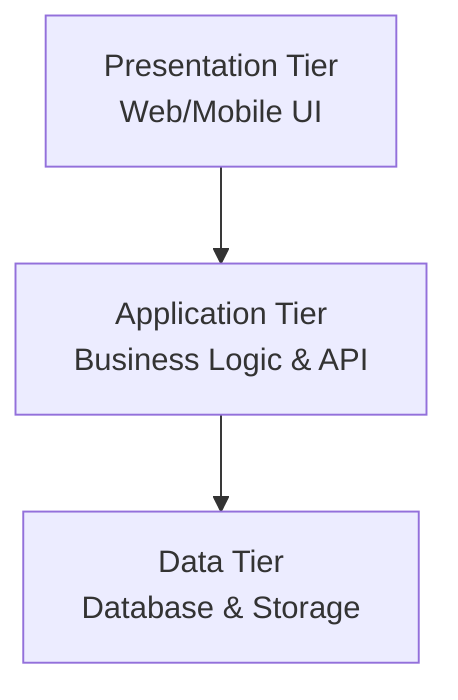
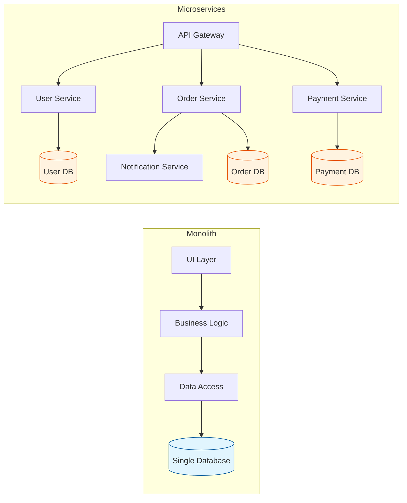
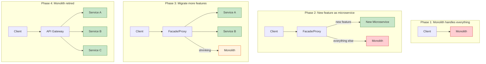
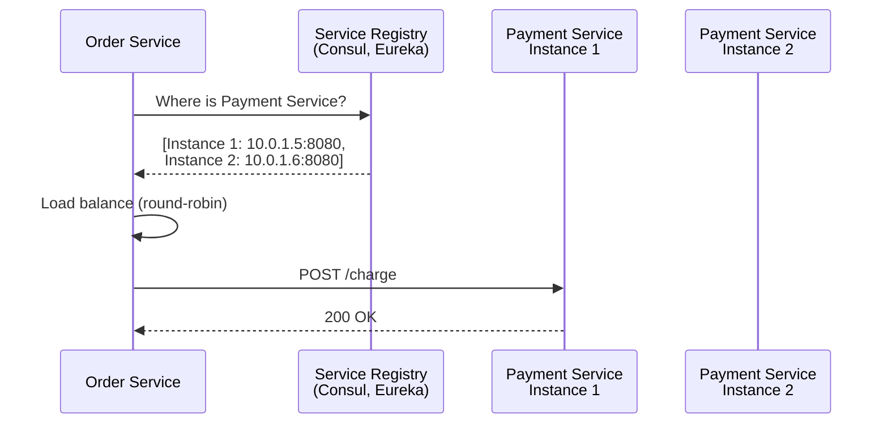
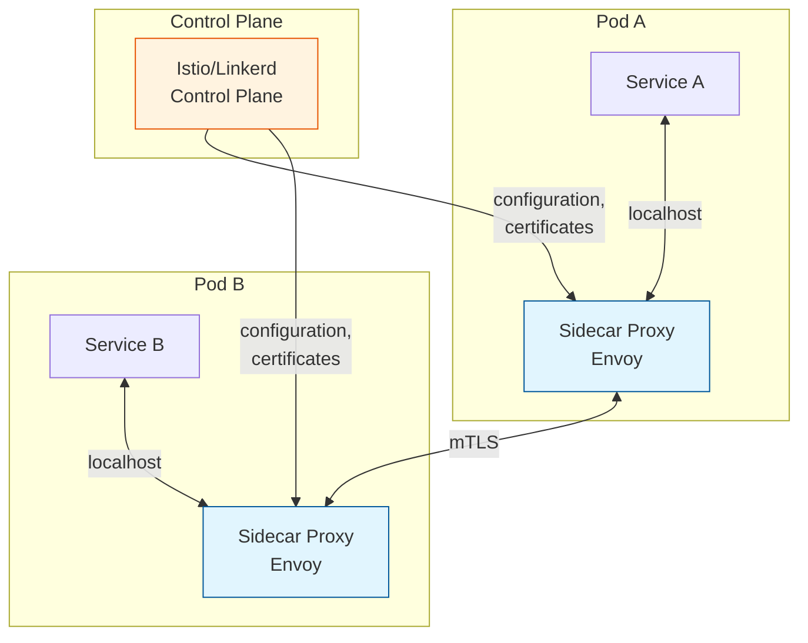
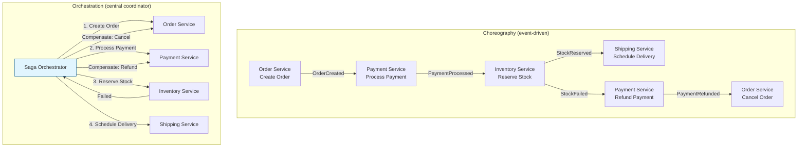
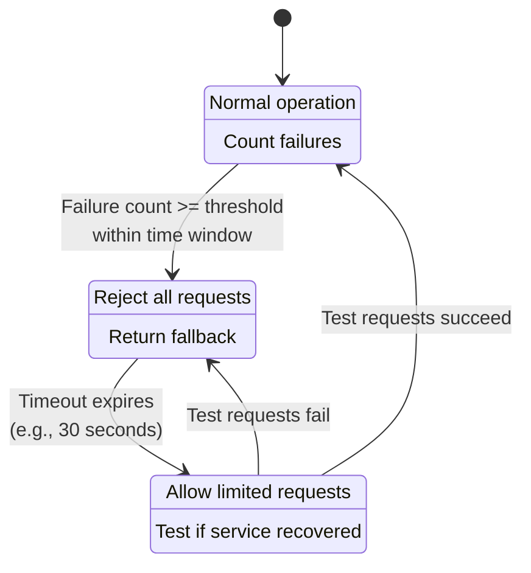

# Microservices Architecture

## Introduction

Microservices architecture structures an application as a collection of small, independently deployable services, each running its own process and communicating via lightweight protocols. Each service is organized around a specific business capability and can be developed, deployed, and scaled independently.

But microservices are not a silver bullet. They trade one set of problems (monolith complexity) for another (distributed systems complexity). This article covers when microservices make sense, how to decompose a monolith, communication patterns between services, data management strategies, and the infrastructure that makes it all work -- from service meshes to container orchestration.

## N-Tier Architecture

Before diving into microservices, it helps to understand the architecture pattern that preceded them.

### What Is N-Tier?

N-tier (or layered) architecture separates an application into logical layers, each with a specific responsibility. The most common is **3-tier**:



| Tier | Responsibility | Examples |
|------|---------------|---------|
| **Presentation** | UI rendering, user interaction | React, iOS app, Angular |
| **Application** | Business logic, API endpoints, validation | Node.js, Spring Boot, Django |
| **Data** | Persistence, queries, caching | PostgreSQL, Redis, S3 |

### N-Tier vs Microservices

N-tier organizes code by **technical layer** (UI, logic, data). Microservices organize by **business domain** (users, orders, payments). In practice, many systems start as n-tier monoliths and later decompose into microservices as they grow.

> [!TIP]
> **Interview framing:** When asked "monolith vs microservices," mention n-tier as the starting point. Most successful systems begin as a well-structured n-tier monolith and evolve into microservices when team/scale demands it. Starting with microservices is premature optimization for most startups.

---

## Monolith vs Microservices

### Honest Tradeoffs

The industry often presents microservices as universally superior to monoliths. This is wrong. Both architectures have legitimate use cases, and choosing the wrong one can cripple a team.

| Dimension | Monolith | Microservices |
|-----------|----------|---------------|
| **Deployment** | Single artifact, atomic deploy | Independent services, complex orchestration |
| **Development speed (small team)** | Faster -- one codebase, one IDE | Slower -- multiple repos, service contracts |
| **Development speed (large team)** | Slower -- merge conflicts, coordination | Faster -- teams own their services |
| **Debugging** | Stack traces, local debugging | Distributed tracing, correlation IDs |
| **Data consistency** | ACID transactions across tables | Saga pattern, eventual consistency |
| **Latency** | Function calls (nanoseconds) | Network calls (milliseconds) |
| **Operational cost** | One server, simple ops | Many servers, monitoring, service mesh |
| **Scaling** | Scale everything together | Scale individual services independently |
| **Technology diversity** | One tech stack | Each service can use different stack |
| **Testing** | Integration tests are straightforward | Contract testing, end-to-end is hard |



### When a Monolith Is Better

- **Early-stage startups:** You do not know your domain well enough to draw service boundaries. Premature decomposition leads to the wrong boundaries, which are expensive to fix.
- **Small teams (fewer than 10 engineers):** The operational overhead of microservices exceeds the organizational benefits.
- **Simple domains:** Not every application is Netflix. A content management system or an internal tool does not need microservices.
- **Prototyping:** Iterate fast, validate the product, then decompose if needed.

> [!IMPORTANT]
> Martin Fowler's advice: "Almost all the successful microservice stories have started with a monolith that got too big and was broken up. Almost all the cases where a system was built as a microservice from scratch, it ended up in serious trouble." Start with a well-structured monolith and decompose when the pain of the monolith exceeds the cost of distribution.

### The Modular Monolith

A middle ground: a single deployable unit with strong internal module boundaries. Each module has its own data, exposes a clear API to other modules, and could be extracted into a service later. Shopify runs a modular monolith at massive scale.

## Service Decomposition Strategies

### By Business Domain (Domain-Driven Design)

The most principled approach. Use bounded contexts from DDD to define service boundaries:

1. **Identify core domains:** What are the fundamental business capabilities? (Orders, Payments, Inventory, Users, Shipping)
2. **Define bounded contexts:** Each domain has its own ubiquitous language and data model. "Product" means different things to the catalog service (name, description, images) and the inventory service (SKU, warehouse location, quantity).
3. **One service per bounded context:** Each service owns its domain logic and data.

> [!TIP]
> In interviews, when decomposing a system into microservices, explicitly mention bounded contexts. Say: "I'd identify bounded contexts -- for example, in an e-commerce system, 'Order' means something different to the fulfillment team versus the billing team. Each bounded context becomes a service with its own data model." This shows DDD awareness.

### By Team (Conway's Law)

Conway's Law states that organizations design systems that mirror their communication structures. Use this intentionally:

- Each team owns one or a few services
- Teams are cross-functional (frontend, backend, ops)
- Service boundaries align with team boundaries
- Services have clear ownership -- no shared ownership across teams

### Strangler Fig Pattern

For migrating from a monolith to microservices incrementally:



**How it works:**
1. Place a routing layer (facade) in front of the monolith
2. Build new features as microservices behind the facade
3. Gradually extract existing features from the monolith into services
4. The monolith "shrinks" over time, like a tree being strangled by a fig vine
5. Eventually, the monolith is small enough to rewrite or retire

> [!NOTE]
> The strangler fig pattern is the safest migration strategy. You never do a "big bang" rewrite. Each extracted service is independently testable and deployable. If something goes wrong, the facade routes back to the monolith.

## Service Discovery

In a microservices environment, services need to find each other. Hardcoded URLs break when services scale horizontally or move across hosts. Service discovery solves this.

### Client-Side Discovery

The client queries a **service registry** (a database of available service instances and their addresses), then selects an instance and makes the request directly.



**Pros:** No intermediate hop, lower latency, client controls load balancing algorithm.
**Cons:** Every client needs discovery logic, language-specific client libraries.
**Examples:** Netflix Eureka, HashiCorp Consul (with client library).

### Server-Side Discovery

The client sends requests to a **load balancer**, which queries the service registry and forwards the request to an available instance.

**Pros:** Client is simple (just knows the load balancer address), language-agnostic.
**Cons:** Extra network hop, load balancer can become a bottleneck.
**Examples:** AWS ALB with ECS, Kubernetes Services (kube-proxy).

### Service Mesh (Sidecar-Based)

A dedicated infrastructure layer that handles service-to-service communication. Each service instance has a sidecar proxy deployed alongside it. The sidecar handles discovery, load balancing, retries, circuit breaking, mTLS, and observability -- transparently to the application.



**How the sidecar works:**
1. Service A wants to call Service B
2. The call goes to A's sidecar proxy (running on localhost)
3. The sidecar resolves B's address via the control plane
4. The sidecar handles load balancing, retry, circuit breaking, and mTLS
5. The call arrives at B's sidecar, which forwards it to Service B
6. Neither service has any networking logic in application code

**Service mesh implementations:**
- **Istio:** Feature-rich, uses Envoy sidecars, complex to operate
- **Linkerd:** Lightweight, Rust-based proxy, easier to operate
- **Consul Connect:** HashiCorp's offering, integrates with Consul service registry

## API Gateway Pattern

### What an API Gateway Does

An API Gateway is a single entry point for all client requests. It handles cross-cutting concerns so that individual services do not have to.

**Responsibilities:**
- **Request routing:** Route `/api/users` to the user service, `/api/orders` to the order service
- **Authentication/Authorization:** Validate JWTs, API keys before requests reach services
- **Rate limiting:** Throttle clients to prevent abuse
- **Response aggregation:** Combine responses from multiple services into a single response
- **Protocol translation:** Accept REST from clients, forward as gRPC to internal services
- **Caching:** Cache common responses at the edge
- **Monitoring:** Log all requests, track latency, error rates

**Examples:** Kong, AWS API Gateway, Nginx, Envoy (as edge proxy).

### API Gateway vs BFF (Backend for Frontend)

The BFF pattern creates a separate backend for each frontend type (web, mobile, IoT). Each BFF is tailored to the needs of its specific client.

| Aspect | Single API Gateway | BFF Pattern |
|--------|-------------------|-------------|
| **Number** | One gateway for all clients | One BFF per client type |
| **Tailoring** | Generic API, all clients get same shape | Each BFF returns exactly what its client needs |
| **Team ownership** | Platform/infra team | Frontend team owns their BFF |
| **Complexity** | Simpler infrastructure | More services to manage |
| **Best for** | Uniform clients, small team | Diverse clients (web, mobile, TV, watch) |

> [!TIP]
> In interviews, if the system has both web and mobile clients with different data needs, propose BFF: "I'd create separate Backend-for-Frontend services. The mobile BFF returns compact payloads optimized for limited bandwidth. The web BFF returns richer data for the desktop experience. Each is owned by the respective frontend team."

## Inter-Service Communication

### Synchronous Communication

**REST (HTTP/JSON):**
- Ubiquitous, well-tooled, human-readable
- Higher overhead (text-based serialization, HTTP headers)
- Good for request-response patterns, external APIs

**gRPC (HTTP/2, Protocol Buffers):**
- Binary serialization (smaller payloads, faster parsing)
- Strong typing with `.proto` files (code generation for client/server)
- Bidirectional streaming
- Better for internal service-to-service communication
- Less human-readable, harder to debug with curl

| Aspect | REST | gRPC |
|--------|------|------|
| **Serialization** | JSON (text) | Protocol Buffers (binary) |
| **Contract** | OpenAPI/Swagger (optional) | .proto files (required) |
| **Streaming** | Limited (SSE, WebSocket separate) | Native bidirectional streaming |
| **Browser support** | Full | Requires grpc-web proxy |
| **Performance** | Good | Better (2-10x for serialization) |
| **Tooling** | Excellent (Postman, curl) | Growing (grpcurl, BloomRPC) |

### Asynchronous Communication

**Message Queues (RabbitMQ, SQS):**
- Fire-and-forget: producer does not wait for response
- Temporal decoupling: consumer processes when ready
- Good for task queues, work distribution

**Event Streams (Kafka):**
- Broadcast events to multiple consumers
- Replay capability
- Good for event-driven architecture, data pipelines

**When to use which:**

| Use Synchronous When | Use Asynchronous When |
|---------------------|----------------------|
| Client needs immediate response | Result is not needed immediately |
| Simple request-response | Multiple services need the same event |
| Low latency required | Need to absorb load spikes |
| Strong consistency needed | Eventual consistency is acceptable |
| Debugging simplicity matters | Resilience to downstream failures matters |

> [!WARNING]
> Synchronous chains are fragile. If Service A calls B, which calls C, which calls D, and D is slow, the entire chain is slow. This is a distributed monolith -- you have all the complexity of microservices with none of the benefits. Prefer asynchronous communication for anything that does not require an immediate response.

## Data Management

### Database Per Service

Each microservice owns its data and exposes it only through its API. No other service can directly access another service's database.

**Why this matters:**
- Services can choose the best database for their needs (SQL, document, graph, time-series)
- Schema changes in one service do not break others
- Services can be deployed independently without database migration coordination
- Data ownership is clear

**The hard part:** Cross-service queries. If the order service needs user details, it cannot just JOIN across databases. It must call the user service API (synchronous) or maintain a local cache of user data (eventually consistent).

### The Shared Database Anti-Pattern

Multiple services reading from and writing to the same database.

**Why it is an anti-pattern:**
- **Tight coupling:** Schema changes require coordinating all services
- **Unclear ownership:** Who is responsible for data integrity?
- **Performance bottleneck:** All services compete for the same database resources
- **Deployment coupling:** Cannot independently deploy services that share a schema

**When it might be acceptable:** During migration from monolith to microservices (as a temporary state), or for read-only reference data that changes infrequently.

## Saga Pattern for Distributed Transactions

### The Problem

In a monolith, you can wrap a multi-step business operation in a single ACID transaction:

```
BEGIN TRANSACTION
  debit account A
  credit account B
  record transfer
COMMIT
```

In microservices, these steps span multiple services with separate databases. There is no distributed transaction coordinator (2PC is too slow and creates availability problems). The saga pattern provides an alternative.

### What Is a Saga?

A saga is a sequence of local transactions. Each local transaction updates a single service's database and publishes an event or message to trigger the next step. If any step fails, compensating transactions undo the preceding steps.

### Choreography vs Orchestration



**Choreography:**
- Each service listens for events and reacts independently
- No central coordinator
- Pros: Loose coupling, simple for small sagas
- Cons: Hard to understand the full flow, difficult to debug, circular dependencies possible

**Orchestration:**
- A central orchestrator directs the saga, telling each service what to do
- The orchestrator maintains saga state
- Pros: Easy to understand, centralized error handling, clear flow
- Cons: Orchestrator can become a single point of failure, slightly more coupling

> [!TIP]
> In interviews, for sagas with 3 or fewer steps, choreography works well. For complex sagas with 4+ steps, branches, or conditional logic, orchestration is safer. Always mention compensating transactions -- the interviewer wants to hear how you handle failures, not just the happy path.

### Compensating Transactions

Every step in a saga must have a compensating transaction that semantically undoes its effect:

| Step | Action | Compensation |
|------|--------|-------------|
| 1. Create order | Insert order record | Cancel order (mark as cancelled) |
| 2. Reserve inventory | Decrement stock | Release inventory (increment stock) |
| 3. Process payment | Charge credit card | Refund credit card |
| 4. Schedule shipping | Create shipment | Cancel shipment |

> [!WARNING]
> Compensating transactions do not "undo" in the database sense (like a rollback). They are new transactions that semantically reverse the effect. A payment refund is a new transaction, not a deletion of the charge. This means sagas require careful design of compensating logic for each step.

## Serverless Architecture

### Function as a Service (FaaS)

Serverless functions (AWS Lambda, Google Cloud Functions, Azure Functions) execute code in response to events without managing servers.

**How it works:**
1. You upload a function (a single unit of business logic)
2. Define a trigger (HTTP request, message queue event, cron schedule, file upload)
3. The cloud provider handles provisioning, scaling, and billing
4. You pay only for execution time (per millisecond)

**Advantages:**
- Zero server management
- Automatic scaling (from 0 to thousands of concurrent executions)
- Pay-per-use pricing (no cost when idle)
- Focus on business logic, not infrastructure

### Cold Starts

When a function has not been invoked recently, the provider must spin up a new container, load the runtime, and initialize the function. This adds latency (100ms to several seconds depending on runtime and package size).

**Mitigation strategies:**
- Keep functions lightweight (small deployment packages)
- Use provisioned concurrency (pre-warmed instances, costs more)
- Choose lightweight runtimes (Go, Rust: ~10ms cold start vs Java: ~1-5s cold start)
- Keep functions warm with periodic pings (hack, not recommended)

### Limitations of Serverless

| Limitation | Impact |
|-----------|--------|
| **Cold starts** | Latency-sensitive paths may be unacceptable |
| **Execution timeout** | AWS Lambda: 15 min max; not for long-running tasks |
| **Stateless** | No local state between invocations; must use external storage |
| **Vendor lock-in** | Each provider's triggers and APIs are different |
| **Debugging** | Cannot attach a debugger to production; reliant on logging |
| **Cost at scale** | At high throughput, dedicated servers can be cheaper |

## Containers and Orchestration

### Docker Basics

A container packages an application with all its dependencies (libraries, runtime, OS utilities) into a single, portable image. Containers are lightweight (share the host OS kernel) compared to VMs (each has its own OS).

**Key concepts:**
- **Image:** A read-only template (blueprint) for creating containers
- **Container:** A running instance of an image
- **Dockerfile:** Instructions for building an image (base image, copy files, install dependencies, set entrypoint)
- **Registry:** Storage for images (Docker Hub, ECR, GCR)

### Kubernetes Overview

Kubernetes (K8s) orchestrates containers at scale: deployment, scaling, networking, and self-healing.

**Core objects:**

| Object | Purpose |
|--------|---------|
| **Pod** | Smallest deployable unit; one or more containers sharing network/storage |
| **Service** | Stable network endpoint for a set of pods; load balances across them |
| **Deployment** | Declares desired state (image version, replica count); handles rolling updates |
| **ReplicaSet** | Ensures a specified number of pod replicas are running |
| **Namespace** | Logical isolation within a cluster (dev, staging, prod) |
| **ConfigMap/Secret** | Externalized configuration and sensitive data |
| **Ingress** | Routes external HTTP traffic to services based on URL paths/hostnames |

**Self-healing:**
- If a pod crashes, Kubernetes restarts it
- If a node dies, Kubernetes reschedules pods to healthy nodes
- Liveness probes detect stuck processes; readiness probes control traffic routing

> [!NOTE]
> Kubernetes is powerful but complex. For small teams or simple deployments, managed container services (AWS ECS, Google Cloud Run, Azure Container Apps) provide 80% of the benefits with 20% of the operational burden. Do not default to Kubernetes without considering simpler alternatives.

## ESB vs Event-Driven Architecture

### Enterprise Service Bus (ESB)

An ESB is a centralized middleware layer that mediates all communication between services. It handles message routing, transformation, protocol translation, and orchestration.

**Why ESB fell out of favor:**
1. **Single point of failure:** All communication flows through the bus. If it goes down, everything stops.
2. **Centralized bottleneck:** The bus becomes a performance bottleneck as traffic grows.
3. **Complexity:** Business logic leaks into the bus (transformation rules, routing logic). The bus becomes a monolith of integration logic.
4. **Vendor lock-in:** ESBs (MuleSoft, IBM Integration Bus, TIBCO) are often expensive proprietary products.
5. **Deployment coupling:** Changing routing rules in the bus requires redeploying the bus, affecting all services.

### Event-Driven Alternative

Instead of a centralized bus, services communicate through a distributed event backbone (Kafka, event mesh). Each service publishes and subscribes to events independently.

| Aspect | ESB | Event-Driven |
|--------|-----|-------------|
| **Topology** | Hub-and-spoke (centralized) | Mesh (decentralized) |
| **Intelligence** | In the bus (smart pipes) | In the services (smart endpoints, dumb pipes) |
| **Coupling** | Services coupled to bus | Services coupled only to event schema |
| **Failure blast radius** | Bus down = everything down | One service down = only that service affected |
| **Scaling** | Scale the bus (hard) | Scale individual services (easy) |

> [!TIP]
> If an interviewer asks about ESB, acknowledge its historical role: "ESBs solved real integration problems in the 2000s -- connecting legacy systems with different protocols. But they centralized too much intelligence in the middleware. The modern approach pushes logic to the edges (services) and uses simple, scalable event backbones like Kafka."

## Cross-Cutting Concerns

### Observability

In a microservices architecture, observability is not optional -- it is survival.

**Three pillars:**
1. **Logging:** Structured logs with correlation IDs that trace a request across all services
2. **Metrics:** Service-level indicators (latency, error rate, throughput) per service, aggregated in dashboards (Grafana, Datadog)
3. **Distributed tracing:** Trace a single request through all services it touches (Jaeger, Zipkin, AWS X-Ray)

### Circuit Breaker Pattern

When a downstream service is failing, continuing to send requests wastes resources and can cascade the failure. A circuit breaker stops calling the failing service and returns a fallback response.

**States:**
1. **Closed (normal):** Requests flow through. Failures are counted.
2. **Open (tripped):** After N failures in a window, the circuit opens. All requests immediately return a fallback (cached data, default response, error).
3. **Half-open (testing):** After a timeout, allow a few test requests through. If they succeed, close the circuit. If they fail, stay open.

### Retry with Exponential Backoff

When a call fails, retry with increasing delays: 100ms, 200ms, 400ms, 800ms, etc. Add jitter (random variation) to prevent thundering herd when many clients retry simultaneously.



### Bulkhead Pattern

Named after ship bulkheads that prevent a single breach from sinking the entire vessel. The pattern isolates failures to prevent cascading.

**Thread pool bulkhead:** Assign separate thread pools to different downstream services. If the payment service is slow and its thread pool is exhausted, the inventory service's thread pool is unaffected. Without bulkheads, all threads would be consumed waiting on the slow payment service, blocking everything.

**Connection pool bulkhead:** Separate connection pools per downstream service. A misbehaving service cannot exhaust connections needed by other services.

**Implementation:** Libraries like Resilience4j (Java) and Polly (.NET) provide bulkhead implementations alongside circuit breakers and retries.

### Health Checks and Graceful Degradation

Every microservice should expose health check endpoints:

- **Liveness probe:** "Is the process alive?" If no, restart it. (Kubernetes liveness probe)
- **Readiness probe:** "Can this instance accept traffic?" If no, remove from load balancer. (Kubernetes readiness probe)
- **Startup probe:** "Has the application finished initializing?" Prevents premature liveness checks during slow startups.

**Graceful degradation:** When a non-critical dependency fails, the service continues with reduced functionality rather than failing entirely. If the recommendation engine is down, the product page still loads -- it just shows popular products instead of personalized recommendations.

> [!NOTE]
> Graceful degradation requires explicitly classifying each dependency as critical or non-critical at design time. If the payment gateway is down, you cannot complete a purchase (critical). If the analytics service is down, you can still complete a purchase and log the analytics event later (non-critical).

### Configuration Management

In a microservices environment, managing configuration across dozens or hundreds of services is a first-class concern.

**Externalized configuration:** Store configuration outside the application code (environment variables, config files, external config services). Never hardcode connection strings, API keys, or feature flags.

**Configuration services:** Centralized systems like Consul KV, Spring Cloud Config, or AWS Parameter Store that services query at startup or periodically. Changes can be pushed without redeploying.

**Feature flags:** Toggle features on/off without deployment. Enables canary releases (enable for 1% of users), A/B testing, and kill switches for problematic features.

| Approach | Pros | Cons |
|----------|------|------|
| Environment variables | Simple, language-agnostic | Requires restart to change |
| Config files (mounted) | Structured, version-controlled | Requires restart or file watcher |
| Config service (Consul, etc.) | Dynamic updates, centralized | Additional infrastructure to manage |
| Feature flag service (LaunchDarkly) | Real-time toggles, targeting | Cost, dependency on external service |

## Interview Cheat Sheet

| Concept | One-Liner |
|---------|-----------|
| Monolith first | Start with a monolith; decompose when organizational pain exceeds distributed systems cost |
| Bounded context | Service boundary = DDD bounded context; each service owns its domain language and data |
| Strangler fig | Incrementally extract services from monolith; facade routes between old and new |
| Service discovery | Clients find service instances via registry (client-side) or load balancer (server-side) |
| Service mesh | Sidecar proxies handle networking (mTLS, retries, load balancing) transparently to app code |
| API Gateway | Single entry point; handles auth, rate limiting, routing, response aggregation |
| BFF | One backend per frontend type; tailored payloads for web, mobile, IoT |
| Database per service | Each service owns its data; no direct cross-service DB access |
| Saga pattern | Distributed transaction via sequence of local transactions + compensating transactions on failure |
| Choreography vs orchestration | Choreography: services react to events. Orchestration: central coordinator directs the saga |
| Serverless | FaaS; auto-scaling, pay-per-use; watch out for cold starts and execution limits |
| Kubernetes | Container orchestration; pods, services, deployments; self-healing and rolling updates |
| Circuit breaker | Stop calling a failing service; return fallback; test periodically to see if it recovered |
| gRPC vs REST | gRPC: binary, fast, streaming, typed contracts. REST: text, ubiquitous, human-readable |
| Distributed monolith | Microservices that are tightly coupled (sync chains, shared DB) = worst of both worlds |
| ESB vs events | ESB centralizes logic in middleware (fell out of favor). Events decentralize to smart endpoints |

> [!TIP]
> The most common microservices interview mistake is jumping straight to microservices without justifying why. Always start with: "For a startup or small team, I'd begin with a modular monolith. As the team and product grow, I'd extract services along bounded context lines using the strangler fig pattern." This shows engineering judgment, not just technical knowledge.
