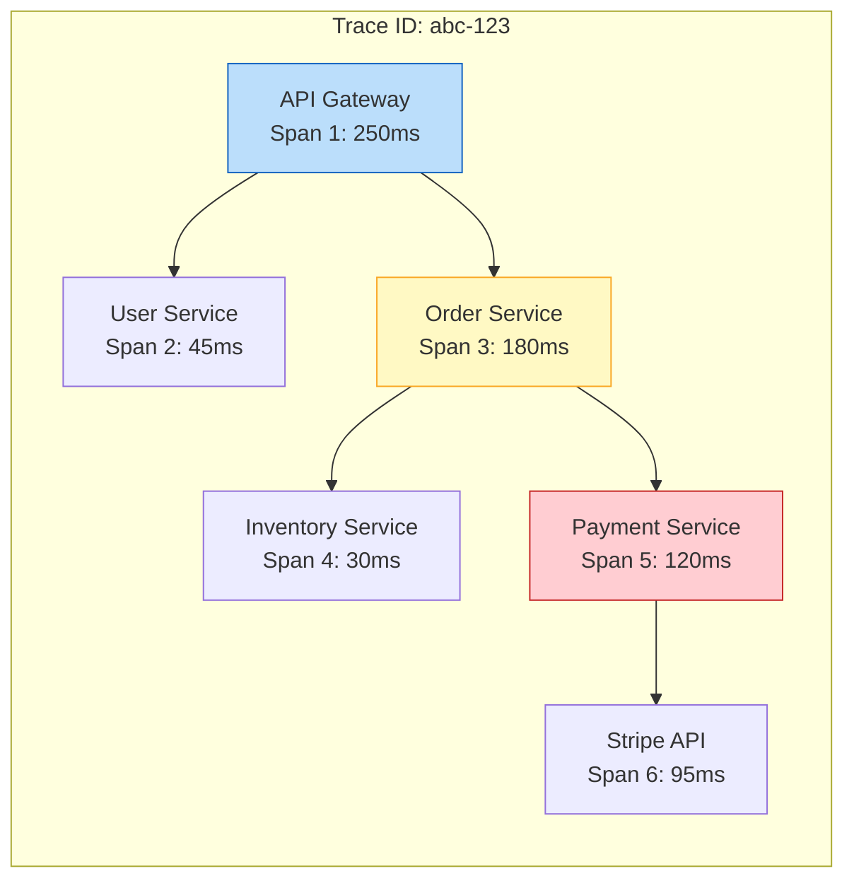
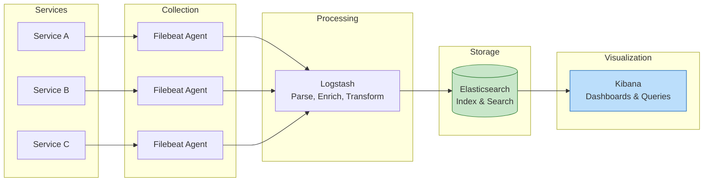
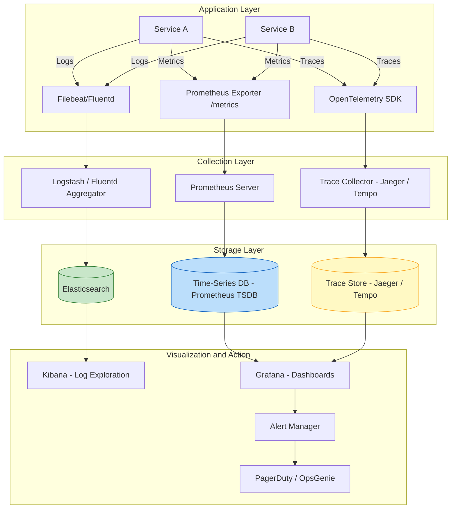

# Monitoring and Observability

## Introduction

You cannot fix what you cannot see. As systems grow from a single application server to hundreds of microservices spread across multiple regions, understanding what is happening inside the system becomes exponentially harder. Monitoring and observability are the practices and tools that give engineering teams visibility into their systems' behavior.

These topics appear in system design interviews in two ways: as direct questions ("how would you monitor this system?") and as implicit expectations when you discuss any architecture ("how do you know when something goes wrong?"). A strong candidate weaves monitoring and observability into their design naturally, not as an afterthought.

> [!NOTE]
> Monitoring and observability are related but different concepts. Monitoring tells you when something is broken (known-unknowns). Observability lets you understand why something is broken, even for failure modes you didn't anticipate (unknown-unknowns). We will clarify this distinction throughout the article.

---

## SLA, SLO, and SLI

These three terms form a hierarchy that connects engineering metrics to business commitments. Getting them confused is a common interview mistake.

### SLI (Service Level Indicator)

An SLI is a specific, measurable metric that quantifies some aspect of your service's performance. It is the raw measurement.

**Examples:**
- Request latency (p50, p95, p99)
- Error rate (percentage of requests returning 5xx)
- Availability (percentage of successful health checks)
- Throughput (requests per second)

### SLO (Service Level Objective)

An SLO is a target value or range for an SLI. It is the internal engineering goal.

**Examples:**
- "99.9% of requests complete in under 200ms" (latency SLO)
- "Less than 0.1% of requests return errors" (error rate SLO)
- "The service is available 99.95% of the time" (availability SLO)

### SLA (Service Level Agreement)

An SLA is a formal contract with customers that specifies SLOs and the consequences of violating them. It is the business commitment.

**Example:** "We guarantee 99.9% uptime. If we fail to meet this, affected customers receive a 10% service credit for that billing period."

| Term | What It Is | Who Cares | Example |
|------|-----------|-----------|---------|
| SLI | A measured metric | Engineers | p99 latency = 180ms |
| SLO | A target for the metric | Engineering + Product | p99 latency < 200ms |
| SLA | A contract with consequences | Business + Legal + Customers | 99.9% uptime or credits |

> [!IMPORTANT]
> SLOs should always be stricter than SLAs. If your SLA promises 99.9% uptime, your internal SLO should target 99.95%. This gives you a buffer -- if you start missing your SLO, you have time to fix the problem before you breach the SLA and owe customers money.

### Practical Example

Consider a payment processing service:

| Layer | Metric | Target |
|-------|--------|--------|
| SLI | Successful transactions / total transactions | Measured: 99.97% |
| SLO | Success rate | Target: 99.95% |
| SLA | Success rate guarantee | Contract: 99.9%, credits if violated |

The SLI (99.97%) exceeds the SLO (99.95%), which exceeds the SLA (99.9%). Everything is healthy. If the SLI drops below the SLO, the team investigates. If it drops below the SLA, the business owes credits.

---

## The Three Pillars of Observability

The three pillars -- logs, metrics, and traces -- provide complementary views into system behavior. Each answers different questions, and a well-instrumented system uses all three.

### Logs

Logs are timestamped records of discrete events. They provide the most detailed view of what happened in a system.

**Unstructured logs:**
```
2024-03-15 14:23:45 ERROR Failed to process payment for user 12345: timeout connecting to stripe
```

**Structured logs (JSON):**
```json
{
  "timestamp": "2024-03-15T14:23:45Z",
  "level": "ERROR",
  "service": "payment-service",
  "trace_id": "abc123",
  "user_id": "12345",
  "message": "Failed to process payment",
  "error": "timeout connecting to stripe",
  "latency_ms": 30000
}
```

Structured logs are far superior because they can be parsed, searched, and aggregated by machines. You can query "show me all errors for user 12345 in the last hour" or "count errors by service in the last 5 minutes."

**Correlation IDs:** Every request gets a unique ID that is passed through all services handling that request. This allows you to find all log entries related to a single user action across dozens of microservices.

### Metrics

Metrics are numerical measurements aggregated over time. They tell you about trends, not individual events.

**Types of metrics:**

| Type | Description | Example |
|------|-------------|---------|
| Counter | Monotonically increasing value | Total requests served, total errors |
| Gauge | Value that goes up and down | Current memory usage, active connections |
| Histogram | Distribution of values in buckets | Request latency distribution |
| Summary | Similar to histogram, calculates percentiles | p50, p95, p99 latency |

**Why metrics over logs for trends:** Logs are high-volume and expensive to store and query. Metrics are pre-aggregated numbers that are cheap to store and fast to query. You use metrics to detect that something is wrong, then use logs to investigate what specifically is wrong.

### Traces

Traces track a single request as it flows through multiple services. They show the complete journey of a request, including which services were called, in what order, and how long each step took.

A trace consists of:
- **Trace ID:** Unique identifier for the entire request journey
- **Spans:** Individual units of work within the trace (one per service call)
- **Parent-child relationships:** Spans form a tree showing the call hierarchy

---

## Distributed Tracing

In a monolithic application, a stack trace shows you the complete call path when something fails. In a microservices architecture, a single user request might touch 10-20 services. Distributed tracing provides the equivalent of a stack trace across service boundaries.

### How Trace IDs Propagate



**Propagation mechanism:**
1. The first service (API gateway) generates a trace ID and creates the root span
2. When calling the next service, it passes the trace ID in an HTTP header (e.g., `X-Trace-Id: abc-123` or W3C Trace Context `traceparent` header)
3. Each downstream service reads the trace ID, creates its own span (with the parent span ID), and passes the trace ID to its own downstream calls
4. All spans are collected asynchronously and assembled into a trace view

### Span Trees

```mermaid
gantt
    title Trace abc-123: Create Order
    dateFormat X
    axisFormat %L ms

    section API Gateway
    Handle Request           :a1, 0, 250

    section User Service
    Validate User            :a2, 10, 55

    section Order Service
    Process Order            :a3, 60, 240

    section Inventory Service
    Check Stock              :a4, 70, 100

    section Payment Service
    Charge Card              :a5, 110, 230

    section Stripe API
    External Call            :a6, 120, 215
```



This view immediately shows that the Payment Service (specifically the Stripe API call) is the bottleneck. Without distributed tracing, you would need to correlate logs across six services manually.

### Tracing Tools

| Tool | Model | Key Feature |
|------|-------|-------------|
| Jaeger | Open source (CNCF) | Native Kubernetes support, adaptive sampling |
| Zipkin | Open source | Mature, simple, good for smaller deployments |
| OpenTelemetry | Open standard | Vendor-neutral, supports all three pillars |
| AWS X-Ray | Managed service | Deep AWS service integration |
| Datadog APM | Commercial | Full-stack observability platform |

> [!TIP]
> In interviews, mention OpenTelemetry as your instrumentation choice. It is the emerging standard that decouples instrumentation from the backend. You instrument your code once with OpenTelemetry, then send data to whichever backend (Jaeger, Datadog, etc.) your team prefers.

---

## Structured Logging and the ELK Stack

### Why Structured Logging Matters

In a system generating millions of log lines per minute, unstructured text logs are nearly useless for automated analysis. Structured logging (JSON format) enables:

- Machine parsing and indexing
- Faceted search (filter by service, user, error type)
- Aggregation (count errors per service per minute)
- Correlation (join log entries by trace_id)
- Alerting rules on specific fields

### The ELK Stack

ELK (Elasticsearch + Logstash + Kibana) is the most widely adopted open-source logging pipeline.



**Component roles:**

| Component | Role | What It Does |
|-----------|------|-------------|
| Filebeat | Shipper | Lightweight agent on each server, tails log files and forwards them |
| Logstash | Processor | Parses, transforms, enriches, and routes log data |
| Elasticsearch | Storage + Search | Indexes logs for fast full-text and structured search |
| Kibana | Visualization | Dashboards, ad-hoc queries, log exploration |

**Alternative: Fluentd** replaces Logstash in many modern stacks (the "EFK" stack). Fluentd is lighter weight, uses less memory, and has a plugin ecosystem for routing logs to multiple destinations.

> [!NOTE]
> At scale, the ELK stack itself becomes a distributed system that needs careful capacity planning. Elasticsearch clusters need proper shard sizing, retention policies, and index lifecycle management. Many teams underestimate the operational cost of running their own logging infrastructure, which is why managed services (Datadog, Splunk Cloud, AWS CloudWatch) are popular alternatives.

---

## Metrics Collection

### Prometheus Pull Model

Prometheus is the de facto standard for metrics collection in cloud-native systems. It uses a pull model: Prometheus scrapes metrics from application endpoints at regular intervals.

**How it works:**
1. Each service exposes a `/metrics` endpoint with current metric values in Prometheus format
2. Prometheus server scrapes these endpoints every 15-30 seconds
3. Metrics are stored in a time-series database optimized for numerical data
4. PromQL (Prometheus Query Language) enables complex queries and aggregations

**Pull vs Push:**

| Factor | Pull (Prometheus) | Push (StatsD, Datadog) |
|--------|-------------------|----------------------|
| Discovery | Prometheus needs to know targets | Agents push to central collector |
| Firewall | Prometheus must reach all targets | Only outbound from agents needed |
| Health detection | Scrape failure = target down | Silence could mean many things |
| Short-lived jobs | May miss them between scrapes | Can push before exiting |

### Grafana Dashboards

Grafana is the standard visualization layer for Prometheus metrics. It provides:
- Real-time dashboards with customizable panels
- Support for multiple data sources (Prometheus, Elasticsearch, CloudWatch, etc.)
- Template variables for switching between services, regions, or environments
- Alert rules based on metric thresholds

### RED Method

The RED method defines the three key metrics for request-driven services:

| Metric | What It Measures | Example |
|--------|-----------------|---------|
| Rate | Requests per second | 1,200 req/s |
| Errors | Failed requests per second | 3 errors/s (0.25% error rate) |
| Duration | Time per request (histogram) | p50=12ms, p95=45ms, p99=120ms |

**Use RED for:** API servers, web servers, microservices -- anything that handles requests.

### USE Method

The USE method defines three key metrics for resource-oriented components:

| Metric | What It Measures | Example |
|--------|-----------------|---------|
| Utilization | Percentage of resource busy | CPU: 75% utilized |
| Saturation | Queue depth / backlog | 12 requests waiting in queue |
| Errors | Error events | 3 disk I/O errors |

**Use USE for:** Infrastructure components -- CPUs, memory, disks, network interfaces, database connections.

> [!TIP]
> In interviews, mentioning RED and USE shows that you think methodically about monitoring. "For our API services, I'd track RED metrics. For the underlying infrastructure, I'd track USE metrics. Together, they cover both the application and infrastructure layers."

---

## Alerting

Monitoring data is only useful if someone acts on it. Alerting bridges the gap between detection and response.

### Alert Fatigue

The single biggest problem with alerting is alert fatigue: when teams receive so many alerts that they start ignoring them. A noisy alerting system is worse than no alerting because it desensitizes responders.

**Causes of alert fatigue:**
- Alerting on raw metrics instead of meaningful symptoms
- Thresholds set too aggressively (alerting on CPU > 50%)
- No deduplication (same issue generates dozens of alerts)
- Alerting on non-actionable conditions
- No severity levels (every alert is treated as critical)

### Actionable Alerts

Every alert should pass the "3 AM test": if this alert wakes someone up at 3 AM, is there something they can and should do right now?

**Good alert:** "Payment success rate dropped below 99% in the last 5 minutes" -- actionable, symptom-based, directly impacts users.

**Bad alert:** "CPU usage on server-42 exceeded 80%" -- not necessarily a problem, not directly tied to user impact, no clear action.

### Alert Design Principles

| Principle | Description |
|-----------|-------------|
| Symptom-based | Alert on user-facing symptoms (error rate, latency), not causes (CPU, memory) |
| Actionable | Every alert has a clear response action |
| Tiered severity | Page for critical, ticket for warning, log for informational |
| Deduplicated | Group related alerts into a single incident |
| Time-windowed | Use sustained conditions, not momentary spikes (e.g., "error rate > 1% for 5 minutes") |

### PagerDuty Integration

PagerDuty (and similar tools like OpsGenie, VictorOps) manage the operational side of alerting:
- On-call schedules and rotation
- Escalation policies (if primary doesn't acknowledge in 5 minutes, escalate to secondary)
- Alert grouping and deduplication
- Incident timeline and communication

---

## Health Checks

Health checks are endpoints that report whether a service is functioning correctly. They are the foundation of automated failure detection and recovery.

### Liveness vs Readiness (Kubernetes Context)

| Check | Question It Answers | Failure Action |
|-------|-------------------|----------------|
| Liveness | "Is the process alive and not stuck?" | Kill and restart the container |
| Readiness | "Can this instance handle traffic?" | Remove from load balancer, stop sending requests |

**Liveness probe:** Checks that the process hasn't deadlocked or entered an unrecoverable state. If a liveness probe fails repeatedly, Kubernetes kills the container and restarts it.

**Readiness probe:** Checks that the service is ready to accept traffic. A service might be alive but not ready if it's still loading a large cache, running database migrations, or warming up. If readiness fails, the service is removed from the Service endpoints -- it stops receiving traffic but isn't killed.

**Example:**
```
GET /healthz       -> Liveness (am I alive?)
GET /readyz        -> Readiness (can I serve traffic?)
```

A readiness probe might check:
- Database connection is established
- Required caches are warmed
- Dependent services are reachable
- Configuration is loaded

> [!WARNING]
> A common mistake is making liveness probes depend on external services. If your liveness probe checks the database and the database goes down, Kubernetes will kill all your application pods. Now you have two problems. Liveness probes should check only the process itself. Readiness probes should check external dependencies.

---

## Heartbeats

In distributed systems, heartbeats are periodic signals sent between nodes to indicate they are alive. When heartbeats stop, the system concludes the node has failed.

**How heartbeats work:**
1. Node A sends a heartbeat message to the coordinator every N seconds
2. The coordinator tracks the last heartbeat time for each node
3. If a node's heartbeat is not received within a timeout period (e.g., 3 missed heartbeats), the coordinator marks it as failed
4. Failover procedures are initiated (reassign work, update routing)

**Challenges:**
- **False positives:** Network congestion can delay heartbeats, causing healthy nodes to be incorrectly marked as failed
- **Timeout tuning:** Too short and you get false positives. Too long and real failures take too long to detect
- **Phi accrual failure detector:** An adaptive approach that calculates a suspicion level based on historical heartbeat intervals, rather than using a fixed timeout. Used by Akka and Cassandra

---

## Error Budgets

Error budgets, a concept from Google's SRE (Site Reliability Engineering) book, bridge the tension between reliability and feature velocity.

### The Concept

If your SLO is 99.9% availability, then you have a 0.1% error budget per period. Over 30 days, that is approximately 43 minutes of allowed downtime or equivalent error volume.

**Error budget = 1 - SLO**

For a 99.9% SLO: error budget = 0.1%

### How Error Budgets Work in Practice

- **Budget remaining:** Ship features, deploy aggressively, run experiments
- **Budget depleted:** Freeze feature deployments, focus on reliability improvements
- **Budget nearly gone:** Slow down deployments, increase testing rigor

This creates a self-regulating system:
- If the service is very reliable, the team has budget to take risks (fast feature development)
- If the service is unreliable, the team must invest in reliability before shipping more features
- Product and engineering teams share a common metric instead of arguing about priorities

### Example Calculation

| Month | SLO | Error Budget | Errors Used | Budget Remaining |
|-------|-----|-------------|-------------|-----------------|
| January | 99.9% | 43.2 min | 10 min (deploy issues) | 33.2 min (76.8%) |
| February | 99.9% | 43.2 min | 38 min (outage) | 5.2 min (12%) |
| March | 99.9% | 43.2 min | Budget exhausted | Feature freeze |

> [!TIP]
> Error budgets are a great topic to bring up in interviews because they show you understand the organizational dynamics of reliability, not just the technical patterns. The key insight is that 100% reliability is the wrong target -- it's infinitely expensive and prevents feature development.

---

## Runbooks and Incident Management

### Runbooks

A runbook is a documented procedure for responding to a specific alert or incident type. It transforms incident response from ad-hoc heroics into a repeatable process.

**A good runbook contains:**
1. **Alert description:** What triggered this alert and what it means
2. **Impact assessment:** What users are affected and how
3. **Diagnostic steps:** How to investigate and confirm the root cause
4. **Remediation steps:** How to fix the issue (step-by-step commands)
5. **Escalation path:** Who to contact if the runbook doesn't resolve the issue
6. **Post-incident:** What to document and follow up on

### On-Call

On-call is the practice of having designated engineers available to respond to incidents outside business hours.

**Healthy on-call practices:**
- Rotation schedules (weekly or daily rotation)
- Primary and secondary on-call
- Compensation for on-call burden
- Maximum alert frequency targets (e.g., fewer than 2 pages per on-call shift)
- Handoff procedures between rotations

### Postmortems

After significant incidents, teams conduct postmortems to understand what happened and prevent recurrence.

**Blameless culture:** The postmortem focuses on systemic causes, not individual blame. "The monitoring gap allowed the issue to go undetected for 30 minutes" rather than "John didn't check the dashboard."

**Postmortem structure:**
1. Timeline of events
2. Root cause analysis
3. Impact assessment (users affected, duration, revenue impact)
4. What went well (detection, response, communication)
5. What could be improved
6. Action items with owners and deadlines

---

## Observability vs Monitoring

This distinction is important and frequently tested in interviews.

### Monitoring

Monitoring is checking predefined metrics against known thresholds. It answers questions you thought to ask in advance.

**Monitoring answers:** "Is the error rate above 1%?" "Is CPU usage above 80%?" "Is the response time above 200ms?"

You set up dashboards and alerts for conditions you anticipate. Monitoring works well for known failure modes.

### Observability

Observability is the ability to understand the internal state of a system by examining its external outputs (logs, metrics, traces). It lets you ask questions you didn't anticipate.

**Observability answers:** "Why are users in Brazil experiencing 3x higher latency than users in the US?" "Why did error rates spike for 2 minutes at 3:47 AM on Tuesday?" "Which specific combination of request parameters triggers this intermittent timeout?"

### The Key Difference

| Aspect | Monitoring | Observability |
|--------|-----------|---------------|
| Question type | Known in advance | Discovered during investigation |
| Setup | Define dashboards and alerts | Instrument code to emit rich telemetry |
| Failure modes | Anticipated | Novel, unexpected |
| Cardinality | Low (predefined dimensions) | High (arbitrary dimensions) |
| Cost | Lower | Higher (more data, more storage) |
| Analogy | Dashboard warning lights | Diagnostic tools for a mechanic |

> [!IMPORTANT]
> A system can be monitored without being observable. If you only track aggregate error rates, you can detect that errors increased, but you can't determine which users, endpoints, or parameters are affected without high-cardinality observability data. In a microservices architecture, observability (especially distributed tracing) is essential, not optional.

### Building Observable Systems

**Key practices:**
- Emit structured logs with high-cardinality fields (user ID, request ID, feature flag state)
- Record metrics with useful labels (endpoint, status code, region, version)
- Implement distributed tracing across all service boundaries
- Use correlation IDs that tie logs, metrics, and traces together
- Make telemetry a first-class concern in code reviews

---

## Designing a Monitoring Stack: End-to-End Example

To tie everything together, here is how a mature monitoring stack looks for a microservices architecture serving millions of users.

### The Full Pipeline



### What Gets Measured

| Signal | Collection Method | Storage | Retention | Cost |
|--------|------------------|---------|-----------|------|
| Application logs | Filebeat -> Logstash -> Elasticsearch | Elasticsearch | 30 days hot, 90 days warm, 1 year cold | High |
| Metrics | Prometheus scrape | Prometheus TSDB / Thanos | 15 days local, 1 year long-term | Low |
| Traces | OpenTelemetry -> Jaeger | Jaeger / Tempo | 7-14 days (sampling) | Medium |
| Access logs | Load balancer -> S3 | S3 / Athena | 1 year | Low |
| Audit logs | Application -> dedicated store | Immutable store | 7 years (compliance) | Low |

### Sampling Strategies for Traces

At high traffic volumes, collecting every trace is prohibitively expensive. Sampling strategies reduce volume while preserving useful data:

| Strategy | Description | Tradeoff |
|----------|-------------|----------|
| Head-based sampling | Decide at the start whether to trace this request (e.g., 1 in 100) | Simple but might miss interesting traces |
| Tail-based sampling | Collect all spans, decide after the request completes whether to keep the trace | Captures errors and slow requests, but requires buffering |
| Error-based sampling | Always keep traces that contain errors | Guarantees visibility into failures |
| Adaptive sampling | Adjust sampling rate based on traffic volume | Consistent cost regardless of load |

> [!NOTE]
> A common production setup uses a combination: 1% head-based sampling for normal traffic, plus 100% sampling for errors and requests exceeding the latency SLO. This captures the interesting traces while keeping costs manageable.

### Dashboards: The Four Golden Signals

Google's SRE book defines four golden signals that every service dashboard should display:

| Signal | What It Measures | Metric Type |
|--------|-----------------|-------------|
| Latency | Time to serve a request | Histogram (p50, p95, p99) |
| Traffic | Demand on the system | Counter (requests/second) |
| Errors | Rate of failed requests | Counter (errors/second, error percentage) |
| Saturation | How "full" the service is | Gauge (CPU, memory, queue depth) |

These four signals cover both the RED method (latency, traffic, errors) and the USE method (saturation), providing a comprehensive view.

### Cost Management

Observability data is expensive at scale. A few strategies to manage costs:

- **Log levels:** Use INFO for production, DEBUG only when investigating. A single service at DEBUG can generate 10x the log volume.
- **Metric cardinality:** Avoid labels with unbounded values (user IDs, request IDs as metric labels). High cardinality explodes storage and query time.
- **Trace sampling:** Sample 1-10% of traces in production. Always sample errors and slow requests at 100%.
- **Retention tiers:** Hot storage (fast queries, expensive) for recent data. Warm/cold storage (slow queries, cheap) for older data.
- **Aggregation:** Pre-aggregate high-volume metrics. Instead of storing every request latency, store 1-minute histograms.

---

## Interview Cheat Sheet

| Concept | One-Liner | When to Mention |
|---------|-----------|-----------------|
| SLI | Measured metric (latency, error rate) | Defining success criteria |
| SLO | Target for the metric (p99 < 200ms) | Setting engineering goals |
| SLA | Contract with penalties | Business requirements |
| Logs | Timestamped event records | Debugging specific issues |
| Metrics | Aggregated numerical measurements | Trend detection, dashboards |
| Traces | Request journey across services | Microservices debugging |
| Distributed tracing | Trace ID propagation through service calls | Any multi-service architecture |
| Structured logging | JSON logs with searchable fields | Log pipeline design |
| ELK stack | Elasticsearch + Logstash + Kibana | Logging infrastructure |
| Prometheus | Pull-based metrics collection | Metrics pipeline |
| RED method | Rate, Errors, Duration for services | Monitoring request-driven services |
| USE method | Utilization, Saturation, Errors for resources | Monitoring infrastructure |
| Alert fatigue | Too many alerts = ignored alerts | Alerting strategy |
| Liveness probe | "Is the process alive?" | Kubernetes health checks |
| Readiness probe | "Can it serve traffic?" | Kubernetes health checks |
| Error budgets | 1 - SLO = room for risk | Reliability vs velocity tradeoff |
| Blameless postmortems | Fix systems, not blame people | Incident management culture |
| Observability | Ask unknown questions about system state | Distinguishing from monitoring |
| OpenTelemetry | Vendor-neutral instrumentation standard | Telemetry strategy |

**Key interview phrases:**
- "I'd define SLIs for latency and error rate, set SLOs at the 99.9th percentile, and build dashboards tracking our error budget."
- "We need the three pillars: structured logs for debugging, Prometheus metrics for dashboards and alerting, and distributed tracing for cross-service investigation."
- "Alerts should be symptom-based and pass the 3 AM test -- if it wakes someone up, there must be a clear action to take."
- "Liveness probes check the process itself; readiness probes check external dependencies. Never make liveness depend on the database."
- "Error budgets give us a shared framework: when the budget is healthy, we ship fast. When it's depleted, we invest in reliability."
- "Monitoring tells you that something is broken. Observability helps you figure out why."
