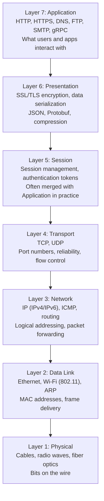
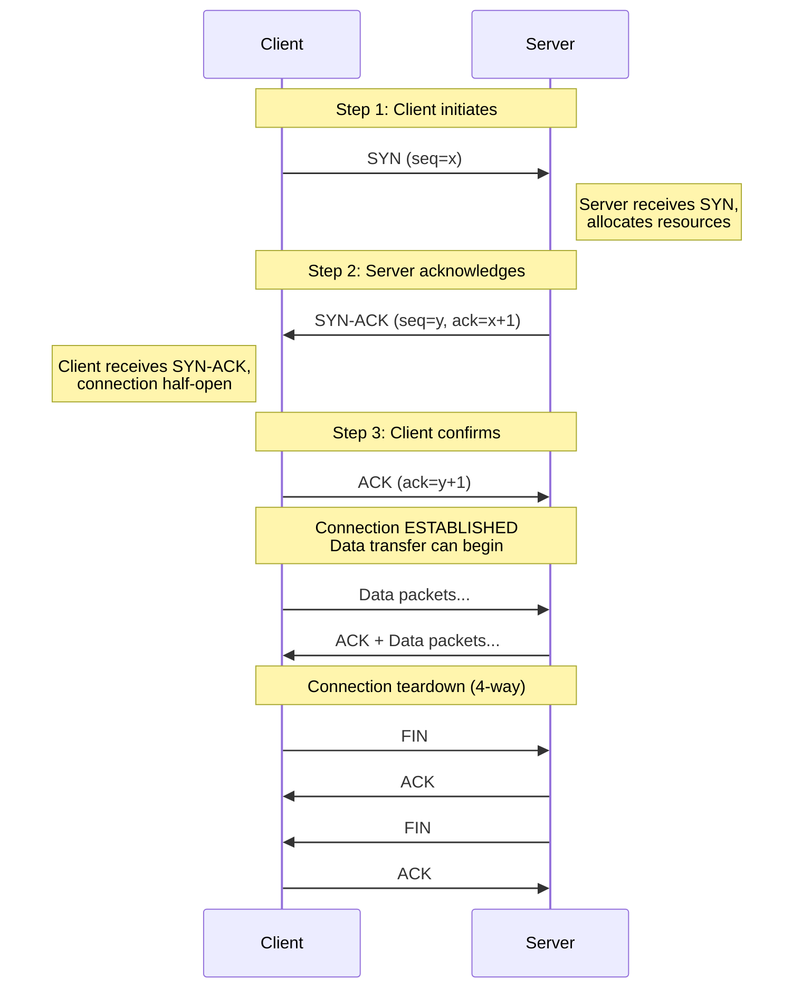
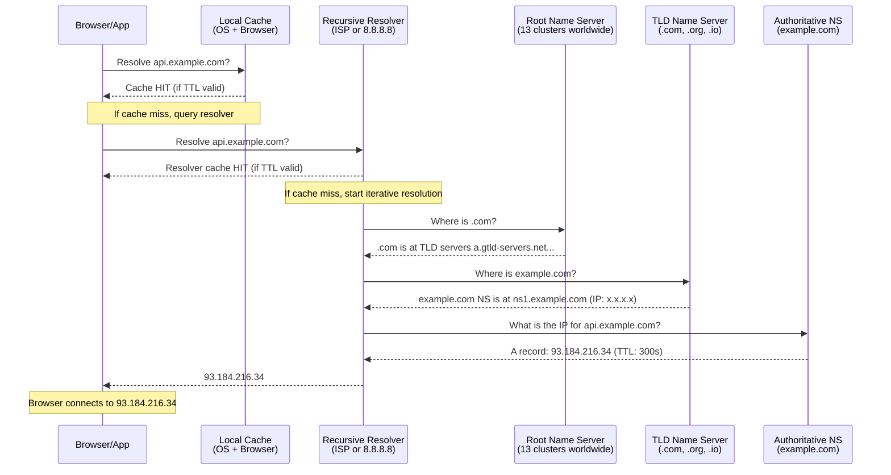
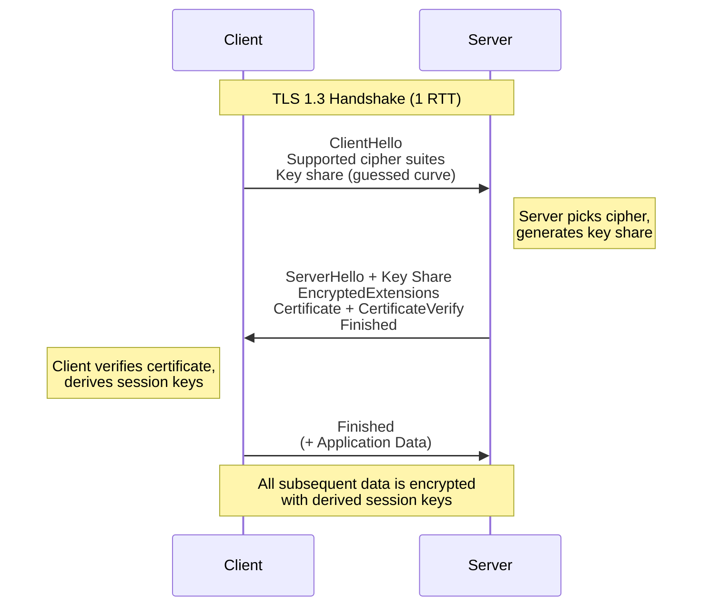

# Networking and Protocols — Complete System Design Reference
### Staff Engineer Interview Preparation Guide

> [!TIP]
> Networking is the invisible backbone of every distributed system. Interviewers at Staff+ levels expect you to reason about latency, protocol trade-offs, and failure modes — not just name layers. This guide gives you the depth to do that confidently.

---

## Table of Contents

1. [IP Addressing](#1-ip-addressing)
2. [The OSI Model — What Actually Matters](#2-the-osi-model--what-actually-matters)
3. [TCP vs UDP](#3-tcp-vs-udp)
4. [DNS — The Internet's Phone Book](#4-dns--the-internets-phone-book)
5. [HTTP Evolution — 1.1, 2, and 3](#5-http-evolution--11-2-and-3)
6. [HTTPS and the TLS Handshake](#6-https-and-the-tls-handshake)
7. [Network Latency and Geographic Considerations](#7-network-latency-and-geographic-considerations)
8. [Interview Cheat Sheet](#8-interview-cheat-sheet)

---

## 1. IP Addressing

### What Is an IP Address?

An IP address is a numerical label assigned to every device on a network. It serves two purposes: identification (which device?) and location addressing (where on the network?). Every packet that travels across the internet carries a source and destination IP address in its header.

### IPv4

IPv4 uses 32-bit addresses written as four octets in dotted-decimal notation (e.g., `192.168.1.1`). This gives a theoretical maximum of roughly 4.3 billion addresses (2^32). That sounded like plenty in the 1980s, but we have long since exhausted the pool.

#### IPv4 Address Classes

| Class | Range | Default Mask | Purpose |
|-------|-------|-------------|---------|
| A | 1.0.0.0 – 126.255.255.255 | /8 | Large organizations |
| B | 128.0.0.0 – 191.255.255.255 | /16 | Medium organizations |
| C | 192.0.0.0 – 223.255.255.255 | /24 | Small networks |
| D | 224.0.0.0 – 239.255.255.255 | N/A | Multicast |
| E | 240.0.0.0 – 255.255.255.255 | N/A | Reserved/experimental |

> [!NOTE]
> Classful addressing is largely historical. Modern networks use CIDR (Classless Inter-Domain Routing) notation like `10.0.0.0/16` to define subnets of arbitrary size. You should still know the classes — interviewers occasionally reference them.

### Private vs Public IP Addresses

Private IP ranges are reserved for internal networks and are not routable on the public internet:

| Range | CIDR | Addresses | Typical Use |
|-------|------|-----------|-------------|
| 10.0.0.0 – 10.255.255.255 | 10.0.0.0/8 | ~16.7 million | Cloud VPCs, large corporate networks |
| 172.16.0.0 – 172.31.255.255 | 172.16.0.0/12 | ~1 million | Medium internal networks |
| 192.168.0.0 – 192.168.255.255 | 192.168.0.0/16 | ~65,000 | Home routers, small offices |

NAT (Network Address Translation) sits at the boundary, mapping many private addresses to a small number of public addresses. This is how billions of devices share 4.3 billion IPv4 addresses.

> [!TIP]
> In system design interviews, mention that services within a VPC communicate over private IPs, which is faster (no NAT, no public routing) and more secure. Cross-region traffic goes over the public internet unless you use dedicated private links like AWS Direct Connect.

### IPv6

IPv6 uses 128-bit addresses, written as eight groups of four hexadecimal digits separated by colons (e.g., `2001:0db8:85a3:0000:0000:8a2e:0370:7334`). This yields approximately 3.4 x 10^38 addresses — enough for every grain of sand on Earth to have trillions.

Key differences from IPv4:

| Feature | IPv4 | IPv6 |
|---------|------|------|
| Address size | 32 bits | 128 bits |
| Address format | Dotted decimal | Hexadecimal with colons |
| Header size | Variable (20–60 bytes) | Fixed 40 bytes |
| NAT | Required (address exhaustion) | Unnecessary (massive space) |
| IPSec | Optional | Built-in |
| Broadcast | Supported | Replaced by multicast |
| Fragmentation | Routers and sender | Sender only (path MTU discovery) |

> [!IMPORTANT]
> Most system design interviews still assume IPv4 since the vast majority of production infrastructure operates in dual-stack or IPv4-only mode. However, mentioning IPv6 awareness — especially for mobile-first systems where carriers deploy IPv6 heavily — shows depth.

---

## 2. The OSI Model — What Actually Matters

### The Seven Layers

The OSI (Open Systems Interconnection) model is a conceptual framework that standardizes how we think about network communication. In practice, the internet uses TCP/IP which collapses some layers, but the OSI model remains the standard vocabulary.

### What Interviewers Actually Care About

In system design interviews, you will primarily reason about three layers:

**Layer 7 (Application):** This is where HTTP, gRPC, WebSockets, and DNS operate. Most design decisions happen here — choosing protocols, designing APIs, handling request routing.

**Layer 4 (Transport):** Understanding TCP vs UDP is critical. Load balancers operate at either L4 or L7, and the choice has major implications for performance and capabilities. TCP's reliability guarantees and UDP's speed trade-offs come up constantly.

**Layer 3 (Network):** IP addressing, routing, and subnet design matter when you are discussing VPC architecture, multi-region deployments, or why geographic distance adds latency.

> [!TIP]
> If an interviewer asks about the OSI model, don't just recite all seven layers. Instead, pick the layers relevant to the design problem and explain what happens at each. For example: "The client's DNS query resolves at L7, the TCP connection establishes at L4 with a three-way handshake, and packets are routed at L3 through multiple autonomous systems."

### The TCP/IP Model vs OSI

The TCP/IP model, which is what the internet actually implements, has four layers:

| TCP/IP Layer | OSI Equivalent | Key Protocols |
|-------------|---------------|---------------|
| Application | Layers 5, 6, 7 | HTTP, DNS, TLS, FTP |
| Transport | Layer 4 | TCP, UDP |
| Internet | Layer 3 | IP, ICMP, ARP |
| Network Access | Layers 1, 2 | Ethernet, Wi-Fi |

The practical takeaway: OSI is for communication and vocabulary. TCP/IP is how real systems work. Know both, but design with TCP/IP in mind.

---

## 3. TCP vs UDP

### TCP (Transmission Control Protocol)

TCP is a connection-oriented, reliable transport protocol. It guarantees that data arrives in order, without duplication, and without corruption. If a packet is lost, TCP detects and retransmits it.

#### The Three-Way Handshake

Every TCP connection begins with a three-way handshake to synchronize sequence numbers and establish the connection:

> [!WARNING]
> The three-way handshake adds one full round-trip time (RTT) before any data is sent. For a cross-continent connection with 100ms RTT, that is 100ms of pure overhead on every new connection. This is why connection pooling and keep-alive are so important at scale.

#### TCP Congestion Control

TCP includes mechanisms to prevent overwhelming the network:

**Slow Start:** A new connection starts with a small congestion window (typically 10 segments since Linux 3.0) and doubles it every RTT until it hits a threshold or experiences loss.

**Congestion Avoidance:** After reaching the threshold, the window grows linearly (additive increase). On packet loss, the window is cut dramatically (multiplicative decrease). This is called AIMD.

**Fast Retransmit:** If the sender receives three duplicate ACKs, it retransmits the missing segment immediately without waiting for a timeout.

**Fast Recovery:** After fast retransmit, TCP does not drop back to slow start. Instead, it halves the congestion window and continues from there.

> [!NOTE]
> Modern TCP variants like BBR (Bottleneck Bandwidth and Round-trip propagation time), developed by Google, take a fundamentally different approach. Instead of using packet loss as a congestion signal, BBR builds a model of the network path's bandwidth and RTT, achieving significantly better throughput on long-distance connections.

#### TCP Features Summary

| Feature | How It Works | Cost |
|---------|-------------|------|
| Ordered delivery | Sequence numbers on every segment | Receiver must buffer out-of-order segments |
| Reliability | ACKs + retransmission on loss | Additional bandwidth, higher latency |
| Flow control | Receiver advertises window size | Sender may be throttled |
| Congestion control | AIMD, slow start | Underutilizes bandwidth initially |
| Connection setup | 3-way handshake | 1 RTT before data flows |
| Connection teardown | 4-way handshake | Lingering TIME_WAIT states |

### UDP (User Datagram Protocol)

UDP is a connectionless, unreliable transport protocol. It sends datagrams with no guarantee of delivery, ordering, or duplicate protection. There is no handshake, no acknowledgment, no congestion control.

This sounds terrible, but the simplicity is the point. UDP adds almost zero overhead, making it ideal for:

- **Real-time media** (voice, video calls): A dropped frame is better than a delayed one
- **Online gaming**: Player position updates need to be fresh, not guaranteed
- **DNS queries**: Single request-response, no need for connection setup
- **IoT telemetry**: High-volume, loss-tolerant sensor data

### TCP vs UDP Comparison

| Dimension | TCP | UDP |
|-----------|-----|-----|
| Connection | Connection-oriented (handshake) | Connectionless (fire-and-forget) |
| Reliability | Guaranteed delivery with retransmission | No guarantees |
| Ordering | In-order delivery via sequence numbers | No ordering |
| Flow control | Yes (sliding window) | No |
| Congestion control | Yes (slow start, AIMD) | No (can flood the network) |
| Header size | 20–60 bytes | 8 bytes |
| Speed | Slower (overhead) | Faster (minimal overhead) |
| Use cases | Web, email, file transfer, APIs | Streaming, gaming, DNS, VoIP |

> [!TIP]
> When an interviewer asks "TCP or UDP?" for a design, the real question is: "Can your application tolerate packet loss?" If yes, and latency matters more than completeness, UDP (or a UDP-based protocol like QUIC) is the answer. If you need every byte to arrive intact and in order, TCP is the answer.

### When Applications Build on UDP

Many modern protocols layer their own reliability mechanisms on top of UDP to get the best of both worlds:

- **QUIC** (used by HTTP/3): Adds reliability, ordering, and encryption on top of UDP, but avoids TCP's head-of-line blocking
- **WebRTC**: Uses UDP with SRTP for media and SCTP (over DTLS over UDP) for data channels
- **DNS over UDP**: Single request/response; the application retries if no response comes back

### TCP Connection Pooling

Establishing a new TCP connection is expensive: one RTT for the handshake, plus TCP slow start means the first few requests on a new connection are throttled. Connection pooling maintains a set of pre-established connections that are reused across requests.

**How it works:** Instead of opening a new TCP connection for each request and closing it afterward, the application keeps a pool of idle connections. When a request needs to be made, it borrows a connection from the pool. When the response is received, the connection is returned to the pool rather than closed.

| Pool Parameter | Typical Value | Purpose |
|---------------|--------------|---------|
| Max connections per host | 10-100 | Prevents overwhelming a single backend |
| Max idle connections | 5-50 | Balances memory usage vs cold-start avoidance |
| Idle timeout | 30-120 seconds | Reclaims connections that sit unused |
| Max lifetime | 5-30 minutes | Prevents stale connections and rebalances after DNS changes |
| Connection timeout | 1-5 seconds | Limits time spent trying to establish new connections |

> [!IMPORTANT]
> Connection pooling interacts with load balancing in subtle ways. If your client pools connections to a load balancer, the LB distributes the connection to a backend at connection time. All subsequent requests on that pooled connection go to the same backend. With HTTP/2 multiplexing over a single connection, this can cause severe load imbalance. The solution is either client-side load balancing or periodic connection recycling (max lifetime).

### TCP in the Real World: TIME_WAIT

When a TCP connection is closed, the side that initiates the close enters a TIME_WAIT state for 2x the Maximum Segment Lifetime (typically 60 seconds total). During this time, the OS holds the socket open to handle late-arriving packets from the now-closed connection.

In high-throughput systems that rapidly open and close connections (e.g., a load balancer handling thousands of short-lived requests per second), TIME_WAIT sockets can accumulate and exhaust the available port space (65,535 ports per IP). Solutions include:

- **Connection pooling** (reuse connections instead of closing them)
- **`SO_REUSEADDR` / `SO_REUSEPORT`** socket options
- **Tuning `tcp_tw_reuse`** (Linux kernel parameter)
- **Using more source IPs** to multiply the available port space

---

## 4. DNS — The Internet's Phone Book

### What DNS Does

The Domain Name System translates human-readable domain names (like `api.example.com`) into IP addresses (like `93.184.216.34`). Without DNS, users would need to memorize IP addresses for every service.

DNS is a globally distributed, hierarchical database. It is one of the most critical pieces of internet infrastructure and one of the most common points of discussion in system design interviews.

### DNS Resolution Flow

### DNS Record Types

| Record Type | Purpose | Example |
|------------|---------|---------|
| A | Maps domain to IPv4 address | `api.example.com -> 93.184.216.34` |
| AAAA | Maps domain to IPv6 address | `api.example.com -> 2606:2800:220:1:248:...` |
| CNAME | Alias one domain to another | `www.example.com -> example.com` |
| MX | Mail exchange server for the domain | `example.com -> mail.example.com (priority 10)` |
| NS | Authoritative name servers for zone | `example.com -> ns1.example.com` |
| TXT | Arbitrary text (SPF, DKIM, verification) | `example.com -> "v=spf1 include:..."` |
| SRV | Service location (host + port) | `_sip._tcp.example.com -> sip.example.com:5060` |
| PTR | Reverse DNS (IP to domain) | `34.216.184.93.in-addr.arpa -> example.com` |
| SOA | Start of Authority (zone metadata) | Serial number, refresh intervals, admin email |

> [!IMPORTANT]
> CNAME records cannot coexist with other record types at the same name. This means you cannot put a CNAME at the zone apex (e.g., `example.com`). Many DNS providers offer proprietary "ALIAS" or "ANAME" records to work around this limitation.

### TTL (Time to Live)

TTL is a value (in seconds) that tells resolvers and caches how long to store a DNS record before querying the authoritative server again.

| TTL Value | Meaning | Use Case |
|-----------|---------|----------|
| 60s | Very short | During migrations, blue-green deployments |
| 300s (5 min) | Short | Services that change IPs occasionally |
| 3600s (1 hour) | Medium | Stable services, common default |
| 86400s (24 hours) | Long | Rarely changing infrastructure |

> [!TIP]
> Before a planned migration, lower TTL to 60s well in advance (at least 2x the current TTL before the change). This ensures caches expire quickly when you flip the DNS record to the new IP. After the migration stabilizes, raise the TTL back up.

### DNS as a Load Balancer

DNS can distribute traffic across multiple servers by returning different IP addresses:

**Round-Robin DNS:** The authoritative server returns multiple A records and rotates their order. Simple but crude — it has no awareness of server health, load, or client geography.

**Weighted DNS:** Services like AWS Route 53 let you assign weights to records. A record with weight 70 gets 70% of responses, weight 30 gets 30%.

**Latency-Based DNS:** The resolver measures latency from the client's resolver to each server region and returns the closest one.

**Geolocation DNS:** Returns different IPs based on the geographic location of the querying resolver.

**Health-Checked DNS (Failover):** The DNS provider actively health-checks your servers and removes unhealthy ones from responses.

> [!WARNING]
> DNS-based load balancing has inherent limitations. DNS responses are cached, so failover is not instant — it takes at least one TTL cycle. Clients may also cache aggressively beyond the TTL. For true real-time failover, you need load balancers in front of your servers, with DNS pointing to the load balancer's stable IP.

### DNS Security Considerations

**DNS Spoofing/Poisoning:** An attacker injects false records into a resolver's cache, redirecting users to malicious servers. DNSSEC (DNS Security Extensions) adds cryptographic signatures to prevent this but is not universally deployed.

**DDoS on DNS:** If your authoritative DNS goes down, your entire service is unreachable. Mitigation: use multiple DNS providers, Anycast-based DNS (like Cloudflare), and long TTLs as a buffer.

**DNS over HTTPS (DoH) and DNS over TLS (DoT):** Traditional DNS queries are sent in plaintext, visible to anyone on the network path. DoH wraps DNS queries inside HTTPS (port 443), making them indistinguishable from normal web traffic. DoT wraps DNS in TLS (port 853), providing encryption without the HTTP overhead. Both prevent ISPs and network operators from snooping on DNS queries.

### DNS Caching Hierarchy

Understanding the caching hierarchy is critical for predicting DNS behavior and debugging issues:

| Layer | TTL Respect | Typical Cache Size | Example |
|-------|:-----------:|-------------------|---------|
| Browser | Yes | Hundreds of entries | Chrome internal cache (1 min default for positive results) |
| Operating system | Yes | Thousands of entries | macOS resolver, Windows DNS Client service |
| Local network (router) | Usually | Varies | Home router, corporate DNS appliance |
| ISP recursive resolver | Yes | Millions of entries | Comcast, AT&T resolvers |
| Public resolver | Yes | Billions of entries | Google (8.8.8.8), Cloudflare (1.1.1.1) |

> [!TIP]
> When debugging DNS propagation after a change, remember that every layer caches independently. Even if you set TTL to 60 seconds, a browser might hold its own cache for longer, or an ISP resolver might serve stale data. For this reason, always lower TTL well before making DNS changes, and test propagation with tools like `dig` directly against authoritative servers.

### DNS in Microservices: Service Discovery

In microservice architectures, DNS often serves as a lightweight service discovery mechanism:

**Internal DNS:** Services register their instances with an internal DNS server (e.g., Consul DNS, CoreDNS in Kubernetes). When Service A needs to call Service B, it resolves `service-b.internal` to get the current IP addresses.

**Kubernetes DNS:** Every Kubernetes Service gets a DNS entry like `my-service.my-namespace.svc.cluster.local`. Pods resolve this to the Service's ClusterIP, which the kube-proxy then load-balances across healthy pods.

**SRV records for service discovery:** SRV records include both the host and port, making them ideal for services that run on non-standard ports. Consul and other service meshes use SRV records extensively.

| Discovery Method | Latency | Freshness | Complexity |
|-----------------|---------|-----------|------------|
| DNS-based | Very low (cached) | TTL-limited (seconds to minutes) | Low |
| Client-side (consul, etcd) | Low | Near real-time (watch/subscribe) | Medium |
| Service mesh (Envoy + xDS) | Minimal | Real-time (push-based) | High |

---

## 5. HTTP Evolution — 1.1, 2, and 3

### HTTP/1.1

HTTP/1.1, standardized in 1997 and refined through 1999, remains widely supported. It is a text-based, request-response protocol over TCP.

#### Key Characteristics

- **Persistent connections (keep-alive):** A single TCP connection can carry multiple sequential requests, avoiding the handshake cost each time. However, only one request can be outstanding per connection at a time.
- **Head-of-line blocking:** If request A is slow, requests B and C queued behind it on the same connection must wait. Browsers work around this by opening 6-8 parallel TCP connections per domain.
- **Chunked transfer encoding:** Allows streaming responses of unknown size.
- **Content negotiation:** Accept headers let clients specify preferred formats (JSON, XML, etc.).

#### The Performance Problem

Loading a modern webpage might require 80+ resources (HTML, CSS, JS, images, fonts). With 6 connections and head-of-line blocking, this creates a waterfall of blocked requests. Developers resorted to hacks: domain sharding (spreading resources across subdomains to get more connections), sprite sheets (combining images), and inlining CSS/JS.

### HTTP/2

HTTP/2, standardized in 2015, was designed to solve HTTP/1.1's performance problems without changing the semantics (methods, headers, status codes all stay the same).

#### Key Features

**Binary framing layer:** HTTP/2 uses a binary protocol instead of text. Requests and responses are broken into small frames, which are multiplexed over a single TCP connection.

**Multiplexing:** Multiple requests and responses can be in flight simultaneously on the same connection. Each has a unique stream ID. No more head-of-line blocking at the HTTP level.

**Header compression (HPACK):** HTTP headers are highly repetitive (same cookies, user-agent, accept headers on every request). HPACK compresses headers using a static table of common headers and a dynamic table of previously sent headers. This reduces header overhead by 85-90%.

**Server push:** The server can proactively send resources to the client before the client requests them. For example, when a client requests `index.html`, the server can push `style.css` and `app.js` that it knows will be needed. In practice, this feature has seen limited adoption and is deprecated in some browsers.

**Stream prioritization:** Clients can assign priority and dependency relationships between streams, hinting to the server which resources to send first.

> [!NOTE]
> HTTP/2 solves head-of-line blocking at the application layer, but TCP itself still has head-of-line blocking. If a single TCP packet is lost, the kernel buffers all subsequent packets until the lost one is retransmitted. This means a loss on one stream blocks ALL streams on that connection. This is the fundamental motivation for HTTP/3.

### HTTP/3 and QUIC

HTTP/3, standardized in 2022, replaces TCP with QUIC as the transport protocol. QUIC runs over UDP and implements its own reliability, ordering, flow control, and encryption.

#### Why QUIC Exists

TCP's head-of-line blocking is baked into the kernel's TCP stack and cannot be fixed without changing the transport layer. QUIC solves this by implementing independent streams at the transport layer — a lost packet on stream 1 only blocks stream 1, not streams 2 and 3.

#### QUIC Features

| Feature | TCP + TLS | QUIC |
|---------|-----------|------|
| Handshake | 1 RTT (TCP) + 1-2 RTT (TLS) = 2-3 RTT | 1 RTT (combined) or 0-RTT (resumed) |
| Head-of-line blocking | All streams blocked by any loss | Only affected stream blocked |
| Connection migration | IP change = broken connection | Connection ID survives IP changes |
| Encryption | TLS is optional, added on top | Always encrypted, integrated into protocol |
| Middlebox ossification | TCP behavior is rigid (middleboxes inspect/modify) | UDP passes through most middleboxes unchanged |

**0-RTT connection resumption:** If a client has connected to a server before, QUIC can send data immediately in the first packet using cached cryptographic parameters. This is transformative for mobile users switching between Wi-Fi and cellular.

**Connection migration:** TCP connections are identified by the 4-tuple (source IP, source port, destination IP, destination port). If any changes (e.g., switching from Wi-Fi to cellular), the connection breaks. QUIC uses a connection ID that survives IP changes, enabling seamless network transitions.

### HTTP Version Comparison

| Feature | HTTP/1.1 | HTTP/2 | HTTP/3 |
|---------|----------|--------|--------|
| Transport | TCP | TCP | QUIC (over UDP) |
| Format | Text | Binary | Binary |
| Multiplexing | No (pipelining exists but broken) | Yes (streams on one connection) | Yes (independent streams) |
| Header compression | None | HPACK | QPACK |
| Head-of-line blocking | Application + transport | Transport only | None |
| Connection setup | 1 RTT (TCP) + 2 RTT (TLS 1.2) | 1 RTT (TCP) + 1 RTT (TLS 1.3) | 1 RTT or 0-RTT |
| Server push | No | Yes (deprecated in practice) | Yes (rarely used) |
| Encryption | Optional | Practically required (TLS) | Always (built into QUIC) |

> [!TIP]
> In an interview, frame the HTTP evolution as solving specific problems: HTTP/2 solved the multiplexing problem but was still limited by TCP; HTTP/3 moved to QUIC/UDP to solve TCP's head-of-line blocking and handshake latency. Showing you understand *why* each version exists is more valuable than listing features.

---

## 6. HTTPS and the TLS Handshake

### Why TLS Matters

TLS (Transport Layer Security) provides three guarantees:

1. **Confidentiality:** Data is encrypted so eavesdroppers cannot read it
2. **Integrity:** Data cannot be tampered with in transit without detection
3. **Authentication:** The client can verify the server's identity via certificates

### The TLS 1.3 Handshake

TLS 1.3 (the current standard, finalized in 2018) reduced the handshake from 2 RTT (TLS 1.2) to 1 RTT:

#### Key TLS Concepts for Interviews

**Certificate chain:** The server presents its certificate, which is signed by an intermediate CA, which is signed by a root CA that the client trusts. The client walks this chain to verify authenticity.

**Cipher suites:** A combination of algorithms for key exchange (e.g., ECDHE), authentication (e.g., RSA), bulk encryption (e.g., AES-256-GCM), and hashing (e.g., SHA-384). TLS 1.3 dramatically reduced the number of supported cipher suites, removing insecure options.

**Perfect forward secrecy (PFS):** TLS 1.3 mandates ephemeral key exchange (ECDHE). Even if the server's long-term private key is compromised, past sessions cannot be decrypted because each session used a unique ephemeral key.

**Certificate pinning:** Mobile apps can "pin" specific certificates or public keys, rejecting any certificate not on the pinned list. This prevents man-in-the-middle attacks even if a CA is compromised, but makes certificate rotation operationally complex.

**SNI (Server Name Indication):** The client includes the target hostname in the ClientHello (in plaintext for TLS 1.2, encrypted via ECH in TLS 1.3+). This allows a single IP address to serve multiple TLS-protected domains. Important for shared hosting and CDNs.

### mTLS (Mutual TLS)

In standard TLS, only the server presents a certificate. In mTLS, the client also presents a certificate, and the server verifies it. This is used for:

- Service-to-service communication in microservice architectures (service mesh)
- Zero-trust network architectures
- API authentication where API keys are insufficient

> [!TIP]
> If designing a microservice architecture and the interviewer asks about inter-service security, mention mTLS. Service meshes like Istio and Linkerd automate mTLS certificate management, making it practical at scale. This demonstrates awareness of real-world infrastructure patterns.

---

## 7. Network Latency and Geographic Considerations

### The Speed of Light Problem

Light in a vacuum travels at ~300,000 km/s. In fiber optic cable, it travels at roughly 200,000 km/s (about 2/3 the speed of light due to refraction). The cable path between two cities is also longer than the straight-line distance.

#### Approximate Round-Trip Times

| Route | Distance (fiber path) | Theoretical min RTT | Typical RTT |
|-------|----------------------|--------------------:|------------:|
| Same data center | < 1 km | < 0.01 ms | 0.1-0.5 ms |
| Same region (e.g., us-east AZs) | 10-100 km | 0.1-1 ms | 1-2 ms |
| Cross-country (NY to LA) | ~5,000 km | ~50 ms | 60-80 ms |
| Transatlantic (NY to London) | ~6,000 km | ~60 ms | 70-90 ms |
| Transpacific (SF to Tokyo) | ~9,000 km | ~90 ms | 100-140 ms |
| Antipodal (NY to Sydney) | ~16,000 km | ~160 ms | 180-250 ms |

> [!IMPORTANT]
> These are round-trip times for a single packet. A full HTTPS request adds TCP handshake (1 RTT) + TLS handshake (1 RTT for TLS 1.3) + HTTP request/response (1 RTT) = at minimum 3 RTT before receiving any data. For NY to Sydney, that is 3 x 200ms = 600ms of pure network latency before any server processing.

### Why This Matters for System Design

**Multi-region deployments:** For a global user base, a single-region deployment means some users experience 300ms+ latency on every API call. Multi-region with read replicas or full active-active architecture brings content closer to users.

**CDN placement:** CDNs work because they cache content at edge locations geographically close to users. Static assets served from a CDN in the same city have ~5ms latency instead of 200ms from a distant origin.

**Database replication lag:** Cross-region database replication is limited by the speed of light. A write in us-east will take at minimum ~60ms to reach eu-west. Design your consistency model accordingly.

**Edge computing:** Running compute at edge locations (Cloudflare Workers, AWS Lambda@Edge) reduces latency for dynamic content by processing it closer to the user.

### Bandwidth vs Latency

A common misconception: more bandwidth does not reduce latency. Bandwidth is how much data you can send per second (the width of the pipe). Latency is how long it takes for a bit to travel from A to B (the length of the pipe).

| Problem | Solution |
|---------|----------|
| Too much data to transfer | Increase bandwidth, compress data |
| Data takes too long to arrive | Move servers closer, reduce round trips |
| Both | CDN (solves both for cacheable content) |

> [!TIP]
> Interviewers love the question: "Your API is slow for users in Asia. How do you fix it?" The answer is NOT "add more servers in us-east" or "increase bandwidth." The answer involves geographic distribution: deploy read replicas or caches in Asia, use a CDN for static content, and potentially deploy compute in the region for dynamic content.

### Tail Latency

At scale, the worst-case latency matters more than the average. If a single user request fans out to 100 backend services, the response time equals the slowest service (the tail).

| Percentile | Single service latency | Fan-out to 100 services |
|-----------|----------------------:|------------------------:|
| p50 | 5 ms | ~10 ms |
| p99 | 50 ms | ~50 ms (one will be slow) |
| p99.9 | 200 ms | ~200 ms (likely one is this slow) |

At 100-service fan-out, the probability that at least one service hits p99 latency is: 1 - (0.99)^100 = 63%. The p99 of a single service becomes the median of the fan-out response.

Mitigation strategies:
- **Hedged requests:** Send the same request to two replicas, take whichever responds first
- **Timeouts with fallbacks:** Set aggressive timeouts and degrade gracefully
- **Reducing fan-out:** Batch or aggregate to hit fewer services per request

---

## 8. Interview Cheat Sheet

### Quick Reference: Protocol Selection

| Scenario | Protocol | Why |
|----------|----------|-----|
| Web API (request-response) | HTTP/2 over TCP | Reliable, multiplexed, well-supported |
| Real-time video/voice | UDP (via WebRTC) | Tolerates loss, minimizes latency |
| Mobile-first global app | HTTP/3 (QUIC) | 0-RTT, connection migration for network switching |
| Internal microservices | gRPC over HTTP/2 | Efficient binary protocol, streaming support |
| DNS queries | UDP (with TCP fallback) | Simple request-response, low overhead |
| File transfer (must be complete) | TCP | Guaranteed delivery, ordered |

### Numbers You Should Know

| Metric | Value |
|--------|-------|
| Speed of light in fiber | ~200,000 km/s (2/3 of vacuum speed) |
| Same-region RTT | 1-2 ms |
| Cross-continent RTT | 60-150 ms |
| TCP handshake cost | 1 RTT |
| TLS 1.3 handshake cost | 1 RTT (0 RTT for resumed) |
| HTTP/1.1 connections per domain | 6-8 (browser limit) |
| IPv4 address space | ~4.3 billion (2^32) |
| DNS TTL common default | 300s (5 minutes) |
| Typical CDN cache-hit latency | 1-10 ms |

### Common Interview Mistakes

| Mistake | Better Answer |
|---------|--------------|
| "Just use TCP for everything" | Explain why UDP suits real-time (loss tolerance vs latency) |
| "DNS is simple lookup" | Discuss caching layers, TTL strategy, DNS as load balancer |
| "More bandwidth fixes latency" | Distinguish bandwidth (throughput) from latency (RTT) |
| "HTTP/2 solves everything" | Note TCP head-of-line blocking motivates HTTP/3 |
| Ignoring geographic latency | Always consider where users are relative to servers |
| "Just add HTTPS" | Discuss TLS handshake overhead and optimization strategies |

### Key Relationships to Articulate

1. **TCP is reliable but slow to start** -- handshake cost, slow start, head-of-line blocking. Great for correctness, has latency costs.

2. **UDP is fast but unreliable** -- no guarantees, but applications can build exactly the reliability they need on top (QUIC does this).

3. **DNS is both critical infrastructure and a design tool** -- use it for geographic routing, load distribution, and failover, but understand its caching means changes are not instantaneous.

4. **HTTP versions solve predecessor problems** -- HTTP/2 fixed HTTP/1.1's multiplexing issue; HTTP/3 fixed HTTP/2's transport-layer head-of-line blocking.

5. **Latency is dominated by physics at global scale** -- no software optimization overcomes the speed of light. The only solution is to move computation and data closer to users.

6. **TLS is not optional** -- modern infrastructure mandates encryption. Know the handshake cost and how TLS 1.3 and 0-RTT reduce it.

---

> [!TIP]
> In a system design interview, networking knowledge is the foundation that makes your other answers credible. When you say "we'll put a CDN in front," the interviewer wants to know you understand DNS resolution, TCP connection overhead, and geographic latency — not just the word "CDN." Ground your high-level designs in these protocol-level realities.
