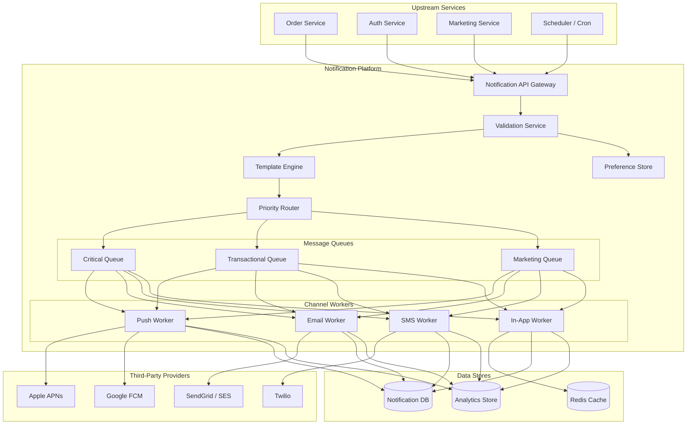
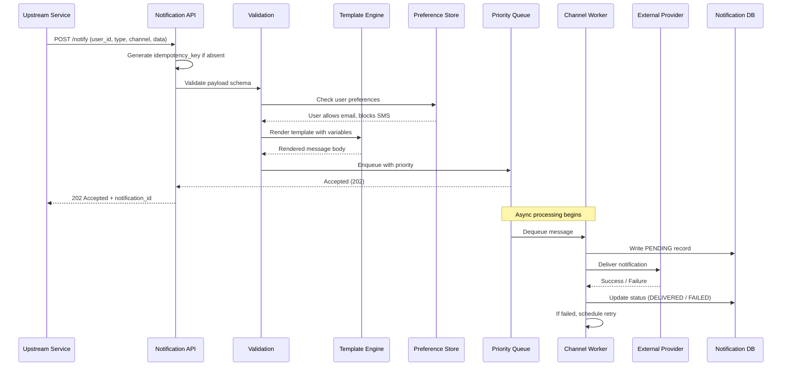
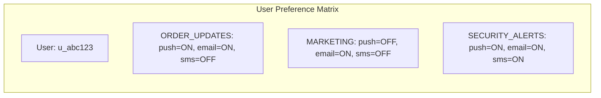
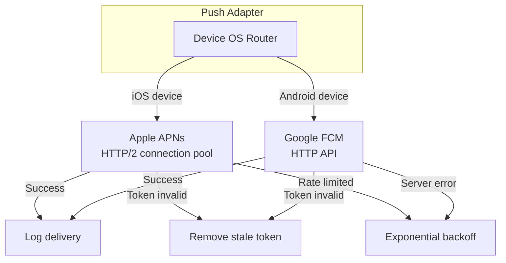
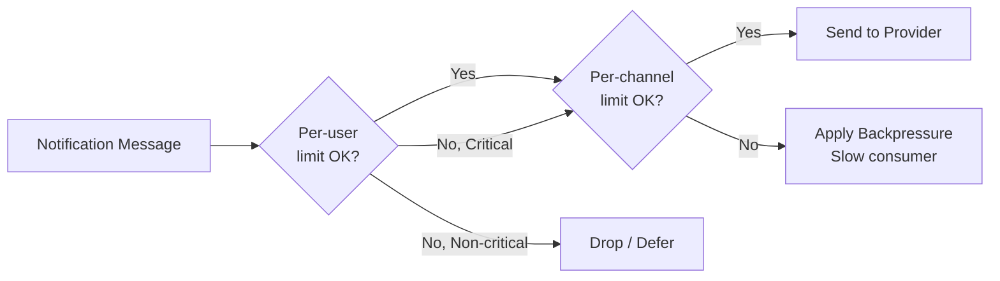
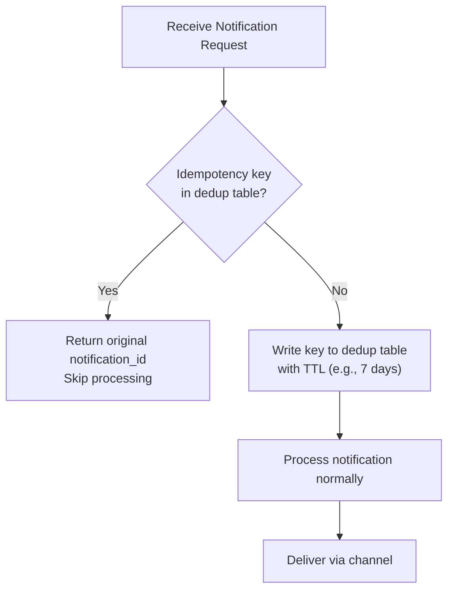

# Design a Notification System

## Introduction

Notifications are the connective tissue of modern applications. Every time a user receives an order confirmation email, a breaking news push alert, or an SMS verification code, a notification system is at work behind the scenes. At scale, this seemingly simple "send a message" operation becomes a deeply challenging distributed systems problem involving millions of messages per second, multiple delivery channels, user preferences, rate limiting, and reliability guarantees.

In a Staff/Senior-level interview, you are expected to design a system that can handle billions of notifications daily while maintaining soft real-time delivery, respecting user preferences, and providing observability into delivery success. This article walks through every layer of that design.

---

## Requirements

### Functional Requirements

1. **Multi-channel delivery**: Send notifications via push (APNs, FCM), SMS, email, and in-app channels.
2. **Template system**: Support reusable notification templates with variable substitution (e.g., "Hello {{user_name}}, your order {{order_id}} has shipped").
3. **User preference management**: Allow users to opt in/out of specific notification types per channel.
4. **Priority levels**: Support at least three priority tiers (critical, transactional, marketing).
5. **Scheduling**: Allow notifications to be scheduled for future delivery.
6. **Analytics**: Track delivery, open, and click-through rates.

### Non-Functional Requirements

1. **Soft real-time**: Critical notifications (e.g., 2FA codes) delivered within seconds; marketing within minutes.
2. **At-least-once delivery**: Every notification must be delivered at least once; duplicates are acceptable over missed messages.
3. **Pluggable channels**: Adding a new delivery channel (e.g., WhatsApp) should not require modifying core logic.
4. **High availability**: The system must remain operational even if individual components fail.
5. **Scalability**: Handle 1 billion notifications per day with room to grow.

---

## Capacity Estimation

Let us work through the numbers for a system handling **1 billion notifications per day**.

| Metric | Calculation | Value |
|--------|------------|-------|
| Notifications/day | Given | 1,000,000,000 |
| Notifications/second (avg) | 1B / 86,400 | ~11,574 QPS |
| Peak QPS (5x average) | 11,574 x 5 | ~58,000 QPS |
| Avg notification payload | Estimated | ~2 KB |
| Daily data ingress | 1B x 2 KB | ~2 TB/day |
| Monthly storage (metadata) | 30 x 2 TB | ~60 TB/month |
| Template storage | 100K templates x 5 KB | ~500 MB |

> [!TIP]
> In an interview, round aggressively. Saying "about 12K QPS average, 60K peak" is sufficient. The interviewer wants to see your reasoning process, not exact arithmetic.

### Channel Breakdown Assumption

| Channel | % of Total | Daily Volume | Avg Latency Target |
|---------|-----------|-------------|-------------------|
| Push (APNs/FCM) | 50% | 500M | < 2 seconds |
| Email | 30% | 300M | < 30 seconds |
| SMS | 10% | 100M | < 5 seconds |
| In-app | 10% | 100M | < 1 second |

---

## High-Level Architecture



### Request Flow



> [!NOTE]
> The API returns 202 Accepted immediately after enqueuing. The caller does not wait for actual delivery. This decoupling is essential for handling bursts and slow downstream providers.

---

## Core Components Deep Dive

### 1. Notification API Gateway

The API gateway is the single entry point for all notification requests. It handles:

- **Authentication**: Validates the calling service's API key or JWT.
- **Schema validation**: Ensures the request contains all required fields.
- **Idempotency**: Checks whether a notification with the same idempotency key has already been processed (more on this later).
- **Rate limiting at the ingress**: Prevents any single upstream service from overwhelming the system.

```
POST /v1/notifications
{
  "idempotency_key": "order-123-shipped-2024",
  "user_id": "u_abc123",
  "notification_type": "ORDER_SHIPPED",
  "channels": ["push", "email"],
  "priority": "transactional",
  "template_id": "tmpl_order_shipped",
  "template_data": {
    "user_name": "Alice",
    "order_id": "ORD-456",
    "tracking_url": "https://example.com/track/789"
  },
  "scheduled_at": null
}
```

### 2. Template Engine

Templates separate content authoring from engineering. A marketing team can update email copy without deploying code.

**Template storage**: Templates are stored in a database and cached in Redis. Each template has a unique ID, a channel variant (push templates are short; email templates are HTML), and placeholder variables.

Example template:

```
Template ID: tmpl_order_shipped
Channel: email
Subject: "Your order {{order_id}} is on its way!"
Body: "Hi {{user_name}}, great news! Your order {{order_id}}
       has shipped. Track it here: {{tracking_url}}"
```

**Variable substitution** is straightforward string interpolation. The engine validates that all required variables are present before rendering. If a variable is missing, the notification is rejected with a clear error rather than sending a broken message.

> [!WARNING]
> Never trust template data blindly. Sanitize all user-provided variables to prevent injection attacks, especially in HTML email templates where XSS is possible.

### 3. User Preference Store

Every user has a preference record that governs which notifications they receive on which channels.



**Implementation**: A preference record is a map of `(notification_type, channel) -> enabled`. The preference store is read on every notification request, so it must be fast. Redis is a natural choice, with the source of truth in a relational database. Preferences are updated infrequently (when a user changes settings), so cache invalidation is manageable.

**Global overrides**: Some notifications cannot be disabled. Security alerts (password reset, suspicious login) bypass user preferences entirely. This is enforced by marking certain notification types as `mandatory` in the system configuration.

### 4. Priority Router and Queues

Not all notifications are equal. A 2FA code must arrive in seconds; a weekly newsletter can wait minutes.

| Priority | SLA | Queue | Consumer Count | Examples |
|----------|-----|-------|----------------|----------|
| Critical | < 2s | Dedicated high-priority queue | High (auto-scaled) | 2FA, security alerts |
| Transactional | < 30s | Standard queue | Medium | Order confirmations, receipts |
| Marketing | < 5 min | Bulk queue with rate control | Low | Promotions, newsletters |

**Why separate queues?** A single queue would allow a marketing blast of 50 million emails to starve critical 2FA codes. Separate queues with independent consumer pools ensure that marketing volume never impacts transactional latency.

**Queue technology**: Kafka is well-suited here. Each priority level maps to a separate Kafka topic. Consumer groups for each channel type read from the appropriate topics. Kafka's ordering guarantees within a partition are useful for deduplication and replay.

### 5. Channel Adapters (Pluggable Delivery)

Each delivery channel is abstracted behind an adapter interface. This is the key to the "pluggable channels" requirement.

```
interface NotificationChannel {
    func send(message: RenderedMessage) -> DeliveryResult
    func checkStatus(deliveryId: String) -> DeliveryStatus
    func getChannelType() -> ChannelType
}
```

Concrete implementations:

- **PushAdapter**: Manages connections to APNs (for iOS) and FCM (for Android). Handles device token management and registration.
- **EmailAdapter**: Integrates with SendGrid or Amazon SES. Manages email-specific concerns like HTML rendering, attachments, and bounce handling.
- **SMSAdapter**: Integrates with Twilio. Handles phone number formatting, country code routing, and carrier-specific limitations.
- **InAppAdapter**: Writes to a per-user notification inbox stored in Redis (for recent) and a database (for history).

> [!IMPORTANT]
> Each adapter handles its own retry logic, circuit breaking, and provider-specific error codes. The core notification service does not know or care about APNs-specific error handling.

**Adding a new channel** (e.g., WhatsApp): Create a new adapter implementing the interface, register it in the channel registry, and add it to the preference store schema. No changes to the core pipeline.

### 6. Third-Party Provider Integration



**Device token management** is critical for push notifications. Users may have multiple devices, and tokens can become stale when a user uninstalls the app. The system must:

1. Store all active device tokens per user.
2. Remove tokens when APNs/FCM reports them as invalid.
3. Handle token refresh events from the mobile app.

**Provider failover**: For email and SMS, maintain integrations with multiple providers (e.g., SendGrid primary, SES secondary). If the primary provider is experiencing an outage, the adapter falls back to the secondary. This is implemented with a circuit breaker pattern.

---

## Rate Limiting

Rate limiting in a notification system serves two purposes: protecting users from notification fatigue and protecting downstream providers from being overwhelmed.

### Per-User Rate Limits

| Limit Type | Threshold | Window | Action When Exceeded |
|-----------|-----------|--------|---------------------|
| Push per user | 10 | 1 hour | Drop and log |
| Email per user | 5 | 1 hour | Queue for next window |
| SMS per user | 3 | 1 hour | Drop and alert |
| Total per user | 30 | 1 day | Drop marketing only |

Critical notifications (security alerts, 2FA) bypass per-user rate limits.

### Per-Channel Rate Limits

Each external provider has its own rate limits. The system must respect these:

- **APNs**: Allows bursts but throttles sustained high volume.
- **Twilio SMS**: Account-level messages-per-second limit.
- **SendGrid**: Daily sending limit based on plan tier.

**Implementation**: Use a token bucket algorithm (covered in detail in the Rate Limiter article) with Redis as the backing store. Each rate limit dimension (user+channel, global channel) has its own bucket.



---

## Retry with Exponential Backoff

When a delivery attempt fails, the system must retry intelligently.

### Retry Strategy

```
Attempt 1: Immediate
Attempt 2: Wait 1 second
Attempt 3: Wait 4 seconds
Attempt 4: Wait 16 seconds
Attempt 5: Wait 64 seconds
Attempt 6: Wait 256 seconds (~4 min)
Max attempts: 6
```

**Jitter**: Add random jitter (0-50% of the delay) to prevent thundering herd problems when many notifications fail simultaneously (e.g., during a provider outage).

**Retry classification**: Not all failures are retryable.

| Error Type | Retryable? | Action |
|-----------|-----------|--------|
| Provider 5xx | Yes | Retry with backoff |
| Network timeout | Yes | Retry with backoff |
| Invalid token (APNs) | No | Remove token, mark failed |
| Invalid phone number | No | Mark failed, alert |
| Provider rate limited (429) | Yes | Retry after Retry-After header |
| Malformed request (4xx) | No | Mark failed, alert engineering |

### Dead Letter Queue

After exhausting all retries, the notification moves to a dead letter queue (DLQ). An operations team monitors the DLQ and can:

1. Investigate the root cause.
2. Fix the issue and replay messages from the DLQ.
3. Mark messages as permanently failed.

> [!TIP]
> In an interview, mentioning the DLQ shows maturity. It demonstrates that you think about what happens when things go wrong at the edges, not just the happy path.

---

## Delivery Guarantees and Deduplication

### At-Least-Once Delivery

The system guarantees at-least-once delivery by:

1. **Persisting before sending**: The notification record is written to the database with status PENDING before any delivery attempt.
2. **Acknowledging after delivery**: The queue message is acknowledged only after successful delivery or permanent failure.
3. **Crash recovery**: If a worker crashes mid-delivery, the unacknowledged message is re-delivered by the queue to another worker.

### Idempotency Keys

At-least-once means duplicates are possible. The idempotency key prevents a user from receiving the same notification twice.

**How it works**:

1. The caller includes an `idempotency_key` in the request (e.g., `order-123-shipped`).
2. Before processing, the system checks a dedup table (Redis with TTL or a database unique constraint).
3. If the key exists, the notification is skipped and the original notification_id is returned.
4. If the key does not exist, it is written atomically and processing continues.



> [!NOTE]
> The TTL on the dedup table is important. Keeping keys forever wastes storage. A 7-day TTL is usually sufficient since upstream services are unlikely to retry the same event after a week.

---

## Analytics

### Delivery Tracking

Every notification generates a lifecycle of events:

| Event | Timestamp | Source |
|-------|-----------|--------|
| CREATED | When request received | Notification API |
| QUEUED | When enqueued | Priority Router |
| SENT | When sent to provider | Channel Worker |
| DELIVERED | When provider confirms | Provider webhook/callback |
| OPENED | When user views | Tracking pixel (email) / app event (push) |
| CLICKED | When user taps link | Redirect URL tracking |
| BOUNCED | When delivery fails permanently | Provider webhook |
| UNSUBSCRIBED | When user opts out via link | Unsubscribe handler |

### Tracking Mechanisms

- **Email opens**: Embed a 1x1 tracking pixel that fires an HTTP request when loaded. Not 100% reliable (images may be blocked), but industry standard.
- **Email clicks**: Wrap URLs in redirect links (e.g., `https://track.example.com/click/abc123?url=...`) to capture click events before redirecting.
- **Push opens**: The mobile app reports to the analytics service when a push notification is tapped.
- **SMS delivery**: Twilio provides delivery status callbacks via webhook.

### Analytics Storage

Raw events are written to a streaming pipeline (Kafka -> analytics consumer -> ClickHouse or BigQuery). Aggregated metrics are precomputed for dashboards:

- Delivery rate by channel, type, priority
- Open rate by template, user segment
- Click-through rate by campaign
- Bounce rate and unsubscribe trends

---

## Data Models & Storage

### Core Tables

**notifications**

| Column | Type | Description |
|--------|------|-------------|
| id | UUID | Primary key |
| idempotency_key | VARCHAR(255) | Unique, for dedup |
| user_id | VARCHAR(128) | Target user |
| notification_type | ENUM | ORDER_SHIPPED, SECURITY_ALERT, etc. |
| channel | ENUM | push, email, sms, in_app |
| priority | ENUM | critical, transactional, marketing |
| template_id | VARCHAR(64) | Reference to template |
| rendered_content | TEXT | Final rendered message |
| status | ENUM | pending, sent, delivered, failed, bounced |
| retry_count | INT | Number of delivery attempts |
| scheduled_at | TIMESTAMP | Null for immediate delivery |
| created_at | TIMESTAMP | When the request was received |
| updated_at | TIMESTAMP | Last status change |

**user_preferences**

| Column | Type | Description |
|--------|------|-------------|
| user_id | VARCHAR(128) | FK to user |
| notification_type | ENUM | Which type |
| channel | ENUM | Which channel |
| enabled | BOOLEAN | Opt-in or opt-out |
| updated_at | TIMESTAMP | Last change |

**device_tokens**

| Column | Type | Description |
|--------|------|-------------|
| id | UUID | Primary key |
| user_id | VARCHAR(128) | FK to user |
| platform | ENUM | ios, android |
| token | VARCHAR(512) | APNs or FCM token |
| is_active | BOOLEAN | Set false on invalid token |
| created_at | TIMESTAMP | When registered |
| last_used_at | TIMESTAMP | Last successful push |

**templates**

| Column | Type | Description |
|--------|------|-------------|
| id | VARCHAR(64) | Primary key (e.g., tmpl_order_shipped) |
| channel | ENUM | Channel-specific variant |
| subject | VARCHAR(255) | For email subject lines |
| body | TEXT | Template body with {{variables}} |
| required_vars | JSON | List of required variable names |
| version | INT | Template version for A/B testing |
| created_at | TIMESTAMP | Creation time |

### Storage Choices

| Component | Technology | Rationale |
|-----------|-----------|-----------|
| Notification records | PostgreSQL (sharded by user_id) | ACID for status tracking, good for queries |
| Preferences cache | Redis | Sub-ms reads on every notification |
| Dedup table | Redis with TTL | Fast existence checks, auto-expiry |
| Templates | PostgreSQL + Redis cache | Infrequent writes, frequent reads |
| Analytics events | Kafka -> ClickHouse | High write throughput, fast aggregation |
| In-app notifications | Redis (recent) + Cassandra (history) | Fast reads for inbox, scalable archive |

---

## Scalability Strategies

### Horizontal Scaling by Channel

Each channel worker pool scales independently. During a marketing email blast, email workers scale up while push workers remain at baseline. This is achieved with separate Kubernetes deployments per channel type, each with its own horizontal pod autoscaler (HPA) based on queue depth.

### Database Sharding

The notifications table grows fast (1B rows/day). Shard by `user_id` so that all notifications for a given user are co-located, enabling efficient query patterns (e.g., "show me my recent notifications").

### Queue Partitioning

Kafka topics are partitioned by `user_id`. This ensures ordering within a user (notifications arrive in the order they were sent) and allows parallel consumption across partitions.

### Caching Strategy

| Data | Cache Layer | TTL | Invalidation |
|------|------------|-----|-------------|
| User preferences | Redis | 1 hour | Write-through on update |
| Templates | Redis | 10 minutes | Invalidate on publish |
| Device tokens | Redis | 24 hours | Invalidate on token refresh |
| Rate limit counters | Redis | Matches rate window | Auto-expire |

### Geographic Distribution

For global users, deploy notification services in multiple regions. User preference and device token data is replicated globally. Channel workers in each region connect to the nearest provider endpoints (e.g., APNs has region-specific endpoints).

---

## Design Trade-offs

### At-Least-Once vs Exactly-Once

| Approach | Pros | Cons |
|----------|------|------|
| At-least-once | Simpler, no delivery gaps | Possible duplicate notifications |
| Exactly-once | No duplicates | Complex, requires distributed transactions, higher latency |

**Decision**: At-least-once with idempotency keys. Exactly-once delivery across distributed systems with third-party providers is practically impossible. The idempotency key handles the dedup at our layer, and users tolerate the occasional duplicate far better than a missed notification.

### Pull vs Push for In-App Notifications

| Approach | Pros | Cons |
|----------|------|------|
| Push (WebSocket) | Real-time, low latency | Connection overhead, complex scaling |
| Pull (polling) | Simple, stateless servers | Higher latency, wasted requests |
| Hybrid (push with pull fallback) | Best of both worlds | Implementation complexity |

**Decision**: WebSocket for active users with polling fallback. When the app is in the foreground, maintain a WebSocket connection for instant in-app notifications. When the app is backgrounded, fall back to push notifications via APNs/FCM.

### Synchronous vs Asynchronous Processing

| Approach | Pros | Cons |
|----------|------|------|
| Sync (request-response) | Simple, immediate feedback | Blocks caller, provider latency visible |
| Async (queue-based) | Decoupled, handles bursts | Delayed feedback, more complex |

**Decision**: Fully asynchronous. The API returns 202 Accepted after enqueuing. Callers check delivery status via a separate endpoint or webhook callback.

> [!WARNING]
> A common interview mistake is designing the notification API as synchronous (caller waits for delivery). This creates tight coupling with third-party providers and makes the system fragile under load. Always decouple ingestion from delivery.

### Single Queue vs Multiple Priority Queues

**Decision**: Multiple queues. The operational cost of managing multiple queues is far outweighed by the risk of a marketing blast delaying a critical 2FA code.

---

## Interview Cheat Sheet

### Key Points to Mention

1. **Decoupled architecture**: Separate ingestion (API) from delivery (workers) with queues in between.
2. **Priority queues**: Critical notifications must never be starved by marketing volume.
3. **Pluggable channel adapters**: Interface-based design makes adding channels trivial.
4. **Idempotency keys**: Prevent duplicate notifications in an at-least-once system.
5. **User preferences**: Always check before sending; some notifications are mandatory.
6. **Rate limiting**: Per-user (prevent fatigue) and per-channel (respect provider limits).
7. **Exponential backoff with jitter**: Smart retry strategy for transient failures.
8. **Analytics pipeline**: Track delivery, open, click rates for operational visibility.

### Common Interview Questions and Answers

**Q: How do you handle a provider outage?**
A: Circuit breaker pattern on each provider adapter. After N consecutive failures, the circuit opens and traffic routes to a secondary provider. The circuit half-opens periodically to test if the primary has recovered.

**Q: How do you prevent a user from getting 100 push notifications in an hour?**
A: Per-user, per-channel rate limits enforced at the worker level before delivery. Exceeded non-critical notifications are dropped or deferred to the next window.

**Q: What happens if the notification database goes down?**
A: The queue acts as a buffer. Workers retry database writes with backoff. Delivery is not blocked since the queue holds the message. Status tracking degrades gracefully but delivery continues.

**Q: How do you handle timezone-aware scheduling?**
A: Store the user's timezone in their profile. The scheduler converts "send at 9 AM user time" to UTC and enqueues at the appropriate time. A cron-like scheduler service polls for due notifications every few seconds.

**Q: How would you add WhatsApp as a new channel?**
A: Implement the NotificationChannel interface with a WhatsApp adapter (using the WhatsApp Business API), register it in the channel registry, add "whatsapp" to the preference store schema, and deploy. No changes to the core pipeline.

### Diagram Shortcuts for Whiteboard

Draw these three things first:
1. **API -> Queue -> Worker -> Provider**: The core flow.
2. **Three queues**: Critical, Transactional, Marketing.
3. **Preference check before enqueuing**: Shows you think about user experience.

> [!TIP]
> When the interviewer asks "how would you handle X at scale," the answer almost always involves: (1) partition/shard by user_id, (2) add a caching layer, (3) make it asynchronous, and (4) scale the workers horizontally. This pattern applies to most components in the notification system.
