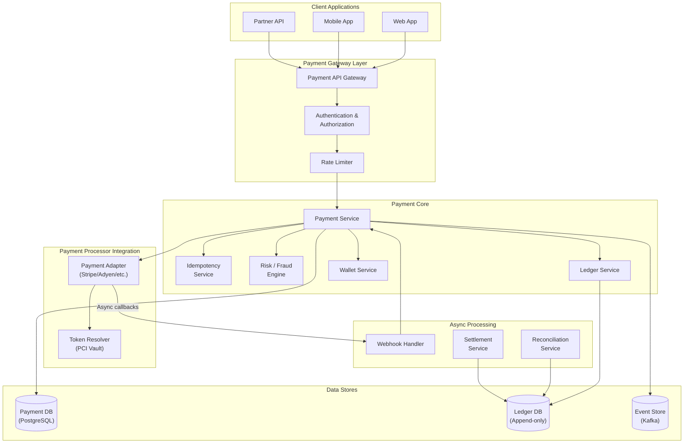
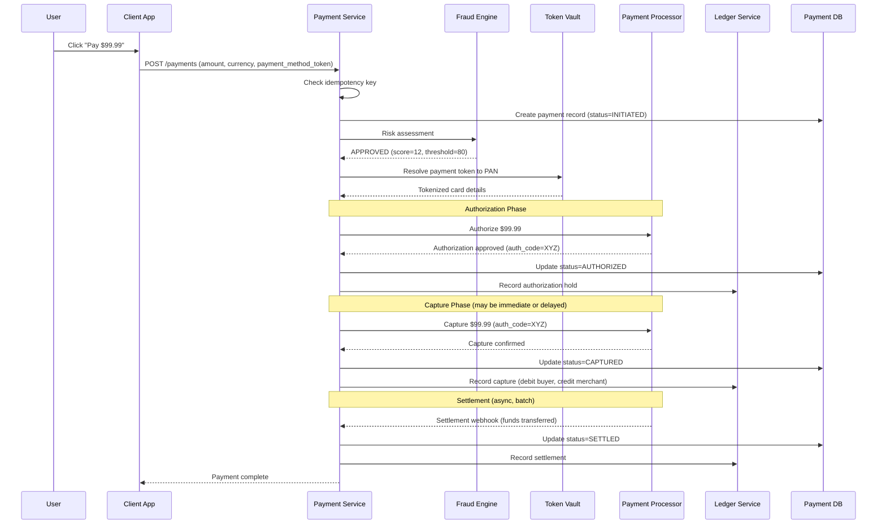
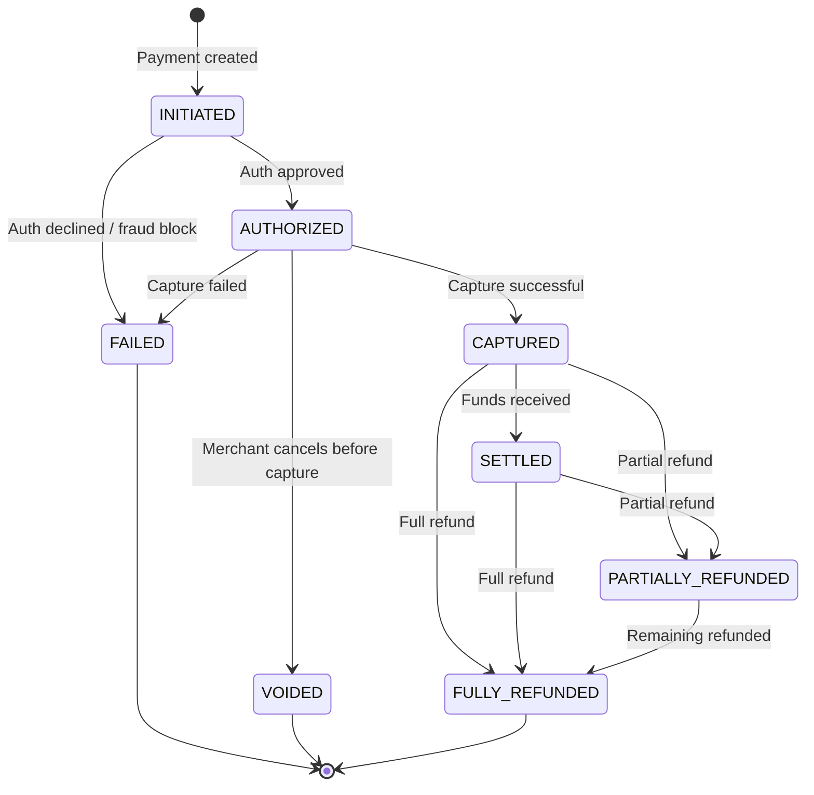
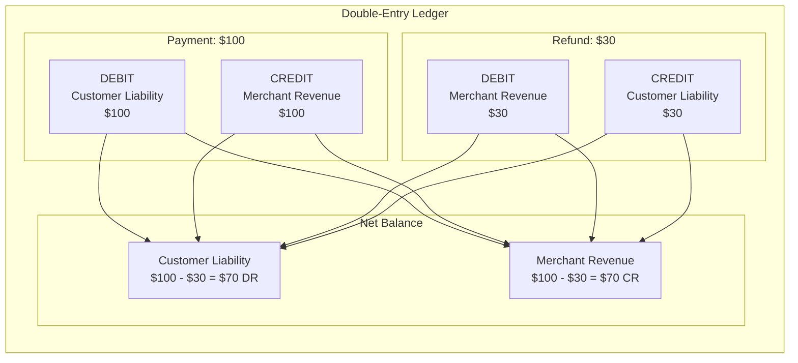
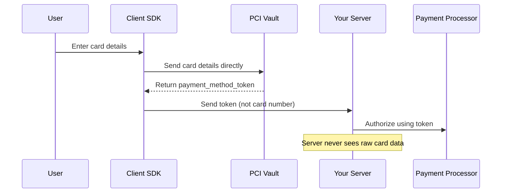
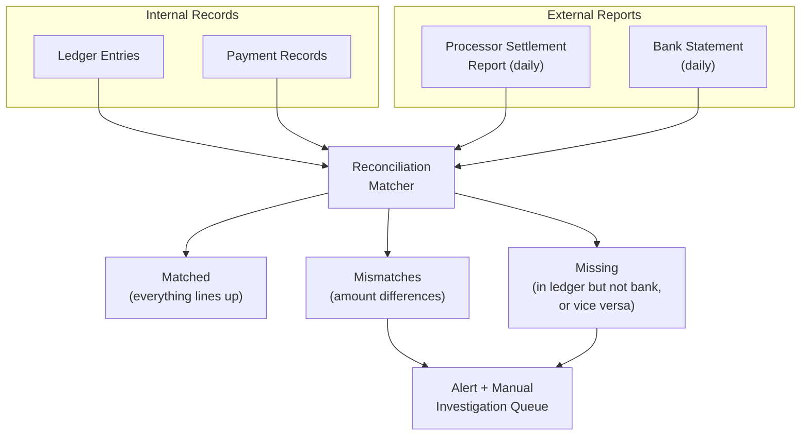

# Design a Payment System

## Introduction

Payment systems sit at the intersection of distributed systems engineering and financial regulation. Unlike most backend services where a brief period of inconsistency is tolerable, a payment system cannot afford to lose money, double-charge a customer, or misreport balances. Every transaction must be accounted for with perfect accuracy, and the system must integrate with a patchwork of banks, card networks, and payment processors, each with their own protocols and failure modes.

In a Staff/Senior-level interview, this topic tests your ability to reason about exactly-once semantics, financial data modeling (double-entry bookkeeping), idempotency, reconciliation, and regulatory compliance. This article walks through the complete design from payment flow to settlement.

---

## Requirements

### Functional Requirements

1. **Process payments**: Accept credit card, debit card, and digital wallet payments.
2. **Refunds**: Support full and partial refunds with proper accounting.
3. **Ledger**: Maintain a complete, auditable financial ledger using double-entry bookkeeping.
4. **Payment status tracking**: Provide real-time status updates (pending, authorized, captured, settled, refunded, failed).
5. **Multi-currency support**: Handle payments in multiple currencies with exchange rate management.
6. **Reconciliation**: Reconcile internal records with bank statements and processor reports.

### Non-Functional Requirements

1. **Exactly-once processing**: A payment must never be processed twice, even under retries or failures.
2. **High reliability**: 99.99% availability for the payment path.
3. **Regulatory compliance**: PCI DSS for card data, SOX for financial reporting.
4. **Auditability**: Every state change must be logged immutably.
5. **Consistency**: Strong consistency for payment state; no eventual consistency for money movement.

---

## Capacity Estimation

| Metric | Calculation | Value |
|--------|------------|-------|
| Transactions/day | Given | 10,000,000 |
| Transactions/second (avg) | 10M / 86,400 | ~116 TPS |
| Peak TPS (10x, e.g., Black Friday) | 116 x 10 | ~1,160 TPS |
| Avg transaction payload | Estimated | ~5 KB |
| Daily data volume | 10M x 5 KB | ~50 GB/day |
| Ledger entries/day | 10M x 2 (debit + credit) | 20M entries |
| Ledger growth/year | 20M x 365 x 0.5 KB | ~3.6 TB/year |

> [!NOTE]
> Payment systems have extreme peak-to-average ratios. Black Friday, Cyber Monday, and flash sales can spike traffic 10-50x above normal. The system must be provisioned for peak, not average.

---

## High-Level Architecture



### Payment Flow: Authorization to Settlement



> [!TIP]
> The authorization-capture two-phase flow is important to explain. Authorization reserves funds on the customer's card (no money moves yet). Capture actually moves the money. Some merchants authorize immediately and capture when the order ships. This distinction shows financial domain knowledge.

---

## Core Components Deep Dive

### 1. Payment Service

The payment service is the orchestrator. It coordinates the flow between fraud checking, processor integration, and ledger recording. Critically, it manages the payment state machine:



Every state transition is:
1. Written to the database within a transaction.
2. Published as an event to Kafka.
3. Recorded in the ledger with corresponding debit/credit entries.

### 2. Idempotency Service

Idempotency is the most critical aspect of payment system design. A network timeout during a payment request must not result in a double charge.

**How it works**:

1. The client sends a unique `idempotency_key` with every payment request (e.g., `checkout-session-abc123`).
2. The payment service checks a dedup table before processing.
3. If the key exists and the payment succeeded, return the original response.
4. If the key exists and the payment is still processing, return a "processing" status.
5. If the key does not exist, insert it atomically and proceed.

**Implementation with database**:

```sql
-- Atomic insert-or-find
INSERT INTO idempotency_keys (key, payment_id, request_hash, response, status)
VALUES ('checkout-abc123', 'pay_xyz', 'sha256_of_request', NULL, 'processing')
ON CONFLICT (key) DO NOTHING
RETURNING *;
```

The `request_hash` ensures that if someone reuses an idempotency key with different parameters, the system detects the mismatch and returns an error.

> [!WARNING]
> Never rely solely on the payment processor for idempotency. Your own system must be idempotent at the API boundary. If the network fails between your system and the processor, you must be able to safely retry without knowing whether the processor received the first attempt.

**Handling the "unknown" state**: The most dangerous scenario is when you send a payment to the processor and never get a response (network partition, timeout). You do not know if the payment went through. The solution:

1. Record the attempt as "pending_confirmation" in your database.
2. Use the processor's API to query the payment status by your reference ID.
3. If the processor has no record, it is safe to retry (with the same idempotency key).
4. If the processor confirms the payment, update your records accordingly.

### 3. Double-Entry Bookkeeping

Every financial transaction creates at least two ledger entries: a debit and a credit. The sum of all debits must always equal the sum of all credits. This invariant is the foundation of financial accounting and makes the system self-auditing.

**Example: Customer pays $100 for an order**

| Entry | Account | Direction | Amount |
|-------|---------|-----------|--------|
| 1 | Customer Liability (what we owe the payment processor) | Debit | $100 |
| 2 | Merchant Revenue (what we owe the merchant) | Credit | $100 |

If the merchant refunds $30:

| Entry | Account | Direction | Amount |
|-------|---------|-----------|--------|
| 3 | Merchant Revenue | Debit | $30 |
| 4 | Customer Liability | Credit | $30 |

**Why double-entry?**
- **Self-auditing**: If debits do not equal credits, there is a bug. This can be checked at any time.
- **Complete history**: Every money movement is traceable to specific entries.
- **Regulatory compliance**: Required for financial reporting (SOX, tax reporting).



> [!IMPORTANT]
> In a payment system, the ledger is the source of truth, not the payment status table. If there is ever a discrepancy between the payment record and the ledger, the ledger is authoritative. Payment records are for operational convenience; the ledger is for financial truth.

### 4. Currency Handling

**Store amounts in minor units** (cents, pence, paisa). Never use floating-point numbers for money.

| Currency | Amount Display | Stored Value | Minor Unit |
|----------|---------------|-------------|------------|
| USD | $99.99 | 9999 | cent (1/100) |
| JPY | 1000 | 1000 | yen (no subdivision) |
| BHD | 1.234 | 1234 | fils (1/1000) |

**Multi-currency considerations**:
- Store the original currency and amount alongside any converted amounts.
- Lock the exchange rate at the time of authorization and record it.
- Never re-convert using a new exchange rate after the fact.
- Use a trusted exchange rate feed (e.g., from your bank or a service like Open Exchange Rates).

### 5. Fraud Detection

The fraud engine evaluates every payment before authorization.

**Layers of fraud detection**:

| Layer | Method | Latency | Examples |
|-------|--------|---------|---------|
| Rules engine | Deterministic rules | < 10 ms | Block transactions > $10K, block cards from sanctioned countries |
| Velocity checks | Rate-based analysis | < 20 ms | More than 5 transactions in 1 minute from same card |
| ML scoring | Feature-based model | < 50 ms | Model trained on historical fraud patterns |
| 3D Secure | Cardholder authentication | Seconds | Redirect to bank for verification |

**Risk score**: The fraud engine returns a risk score (0-100). The payment service uses configurable thresholds:

- Score 0-30: Approve automatically.
- Score 31-70: Approve but flag for review.
- Score 71-100: Decline and alert the fraud team.

### 6. PCI DSS Compliance

PCI DSS (Payment Card Industry Data Security Standard) governs how card data is handled.

**Key rules**:
- **Never store CVV/CVC**: Not even encrypted. Ever. After authorization, it must be discarded.
- **Tokenize PAN**: Replace the Primary Account Number with a token immediately upon receipt. The raw PAN is stored only in a PCI-compliant vault.
- **Encrypt in transit and at rest**: TLS 1.2+ for all network communication. AES-256 for stored data.
- **Network segmentation**: Systems that handle card data must be isolated from the rest of the network.

**Tokenization flow**: The client-side SDK (e.g., Stripe.js) sends card details directly to the PCI vault, which returns a token. Your servers never see the raw card number.



### 7. Webhooks for Async Payment Status

Payment processors communicate asynchronous events (settlement, chargebacks, disputes) via webhooks.

**Webhook handling best practices**:

1. **Signature verification**: Every webhook includes a signature (HMAC-SHA256 of the payload with a shared secret). Verify it before processing. This prevents replay attacks and spoofed webhooks.

2. **Idempotent processing**: Webhooks can be delivered multiple times. Use the event ID from the processor as a dedup key.

3. **Acknowledge quickly**: Return 200 within 5 seconds. If processing takes longer, acknowledge first and process asynchronously. If you return an error or time out, the processor will retry.

4. **Event ordering**: Webhooks may arrive out of order. A settlement event might arrive before a capture confirmation. Handle this with state machine validation -- only process events that are valid transitions from the current state.

### 8. Reconciliation

Reconciliation is the process of matching your internal ledger with external bank statements and processor reports.



**Types of reconciliation**:
- **T+0 reconciliation**: Match your payment records against processor confirmations same-day. Catches authorization/capture mismatches immediately.
- **T+1 reconciliation**: Match your ledger against the processor's settlement file. Catches amount discrepancies, missing settlements, and extra charges.
- **Monthly reconciliation**: Match cumulative balances against bank statements. The final checkpoint.

**Common mismatch causes**:
- Currency conversion rounding differences.
- Processor fees deducted from settlement.
- Chargebacks processed by the bank but not yet received as webhooks.
- Timing differences (payment captured on day 1, settled on day 2).

---

## Data Models & Storage

### Core Tables

**payments**

| Column | Type | Description |
|--------|------|-------------|
| id | UUID | Primary key |
| idempotency_key | VARCHAR(255) | Unique, for dedup |
| merchant_id | UUID | Which merchant |
| customer_id | UUID | Which customer |
| amount | BIGINT | Amount in minor units |
| currency | CHAR(3) | ISO 4217 code (USD, EUR) |
| status | ENUM | See state machine above |
| payment_method_token | VARCHAR(255) | Tokenized card reference |
| processor_reference | VARCHAR(255) | External processor's transaction ID |
| auth_code | VARCHAR(50) | Authorization code from issuer |
| risk_score | INT | Fraud engine score |
| created_at | TIMESTAMP | When payment was initiated |
| updated_at | TIMESTAMP | Last state change |
| version | INT | Optimistic locking |

**ledger_entries**

| Column | Type | Description |
|--------|------|-------------|
| id | BIGINT | Auto-increment, append-only |
| transaction_id | UUID | Groups related debit/credit entries |
| payment_id | UUID | FK to payments |
| account_id | UUID | Which account |
| entry_type | ENUM | debit, credit |
| amount | BIGINT | Amount in minor units |
| currency | CHAR(3) | ISO 4217 |
| description | VARCHAR(500) | Human-readable description |
| created_at | TIMESTAMP | Immutable timestamp |

> [!WARNING]
> Ledger entries are append-only. Never update or delete a ledger entry. To correct a mistake, create a reversal entry. This maintains a complete audit trail.

**refunds**

| Column | Type | Description |
|--------|------|-------------|
| id | UUID | Primary key |
| payment_id | UUID | FK to original payment |
| amount | BIGINT | Refund amount in minor units |
| currency | CHAR(3) | Must match original payment |
| reason | VARCHAR(500) | Refund reason |
| status | ENUM | initiated, processing, completed, failed |
| processor_reference | VARCHAR(255) | External refund reference |
| created_at | TIMESTAMP | When refund was initiated |

### Storage Choices

| Component | Technology | Rationale |
|-----------|-----------|-----------|
| Payment records | PostgreSQL (primary-replica) | ACID transactions, strong consistency |
| Ledger | PostgreSQL (append-only) or purpose-built ledger DB | Immutable, auditable, sequential writes |
| Idempotency keys | PostgreSQL (same DB as payments) | Atomic with payment creation |
| Event log | Kafka | Durable event stream for async processing |
| PCI vault | HSM-backed vault (e.g., Stripe Vault, AWS CloudHSM) | Regulatory requirement for card storage |
| Analytics | ClickHouse / BigQuery | Fast aggregation over transaction data |

---

## Scalability Strategies

### Database Scaling

Payment databases need strong consistency, which limits horizontal scaling options. Strategies:

1. **Vertical scaling first**: PostgreSQL on a large instance handles 1,000+ TPS easily. For 10M transactions/day (~116 TPS average), a single primary with read replicas is sufficient.

2. **Read replicas**: Payment history queries, reporting, and analytics hit read replicas. The primary handles only writes.

3. **Sharding by merchant_id**: When a single database is insufficient, shard by merchant. Each merchant's payments live on a specific shard. Cross-merchant queries (rare in practice) go through an aggregation layer.

4. **Separate ledger database**: The ledger is append-only with sequential writes, which is a different access pattern from the payment table's read-modify-write pattern. Separating them allows independent optimization.

### Payment Processing Scaling

- **Horizontal scaling of payment service**: Stateless payment service instances behind a load balancer. The idempotency key prevents issues with request retries across different instances.
- **Multiple processor integrations**: Route traffic across multiple processors (Stripe, Adyen, Braintree) for redundancy and to negotiate better rates.
- **Queue-based settlement**: Settlement and reconciliation are batch processes that run asynchronously, decoupled from the real-time payment path.

### Handling Peak Traffic

- **Graceful degradation**: During extreme spikes, non-critical features (detailed analytics, recommendation-based upsells) can be disabled to preserve capacity for the payment path.
- **Pre-authorization**: For anticipated events (flash sales), pre-authorize cards before the event starts.
- **Circuit breakers on processors**: If a processor is slow or failing, route traffic to a backup processor immediately.

---

## Design Trade-offs

### Synchronous vs Asynchronous Payment Processing

| Approach | Pros | Cons |
|----------|------|------|
| Synchronous | Immediate result, simpler client logic | Blocks user, processor latency visible |
| Asynchronous | Faster response, handles slow processors | Complex status tracking, polling needed |

**Decision**: Synchronous for authorization (user expects immediate feedback), asynchronous for capture and settlement (no user waiting). The authorization call takes 1-3 seconds and the user is watching a loading spinner, so synchronous is acceptable.

### Single vs Multiple Payment Processors

| Approach | Pros | Cons |
|----------|------|------|
| Single processor | Simple integration, one contract | Single point of failure, no negotiating leverage |
| Multiple processors | Redundancy, cost optimization, geographic routing | Complex routing logic, multiple integrations to maintain |

**Decision**: Multiple processors with intelligent routing. Route based on: card network (Visa routes to processor A, Mastercard to processor B), geography (EU cards to EU processor), cost optimization, and availability (failover when primary is down).

### Strong vs Eventual Consistency

| Approach | Pros | Cons |
|----------|------|------|
| Strong consistency | No stale reads, simpler reasoning | Higher latency, harder to scale |
| Eventual consistency | Better performance, easier scaling | Stale reads, complex conflict resolution |

**Decision**: Strong consistency for the payment path and ledger. Money cannot be eventually consistent. Read replicas may have slight lag for non-critical reads (transaction history), which is acceptable.

> [!IMPORTANT]
> In a payment system interview, always err on the side of consistency over availability. Unlike social media where showing a slightly stale feed is fine, showing a stale payment balance or allowing a double charge is unacceptable.

---

## Interview Cheat Sheet

### Key Points to Mention

1. **Idempotency keys**: The single most important concept. Explain how they prevent double charges.
2. **Double-entry bookkeeping**: Debits always equal credits. This is your audit guarantee.
3. **Authorization vs capture**: Two-phase payment flow. Authorization reserves; capture moves money.
4. **PCI compliance**: Tokenize card data immediately. Your servers never see raw PAN.
5. **Exactly-once via at-most-once + idempotency**: You cannot have true exactly-once in distributed systems. Achieve it through idempotent retries.
6. **Reconciliation**: Three levels (T+0 processor match, T+1 settlement match, monthly bank match).
7. **State machine**: Payments transition through well-defined states. Invalid transitions are rejected.
8. **Minor units for currency**: Store cents, not dollars. Never use floating point.

### Common Interview Questions and Answers

**Q: What happens if the network fails between your service and the payment processor?**
A: The payment is in an "unknown" state. We poll the processor's API using our idempotency key to determine the outcome. If they have no record, we retry. If they confirm the payment, we update our records. We never assume success or failure without confirmation.

**Q: How do you handle a partial refund?**
A: Create a refund record linked to the original payment. Validate that the cumulative refund amount does not exceed the original payment amount. Send the refund request to the processor. Create reversal ledger entries (debit merchant revenue, credit customer liability) for the refund amount.

**Q: How do you prevent a merchant from being paid twice for the same order?**
A: The idempotency key is scoped to the order. The key might be `order-{order_id}-capture`. Any retry with the same key returns the original result without re-processing.

**Q: What if your database goes down during a payment?**
A: The payment fails and the user sees an error. We never guess about money. If the authorization succeeded at the processor but we failed to record it, our reconciliation process will catch the orphaned authorization and void it within 24 hours.

**Q: How do you handle chargebacks?**
A: Chargebacks arrive as async events from the processor. We create reversal ledger entries, debit the merchant's balance, update the payment status, and notify the merchant. We maintain evidence collection workflows for dispute resolution.

> [!TIP]
> The interviewer is looking for you to treat money with extreme care. Phrases like "we never assume success without confirmation," "we reconcile daily," and "the ledger is append-only" signal maturity and domain awareness.
