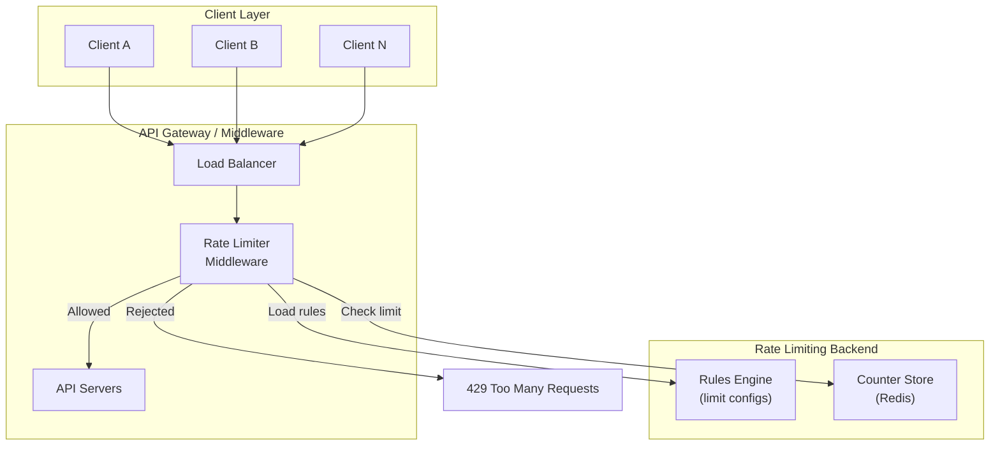
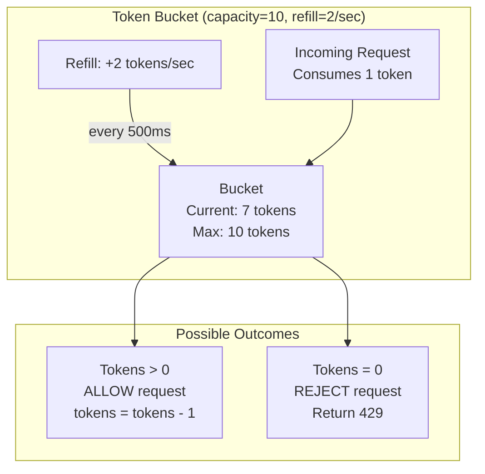
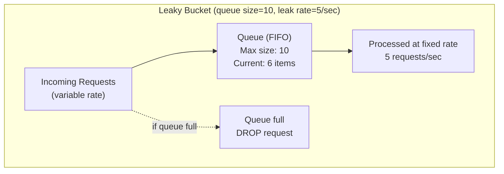
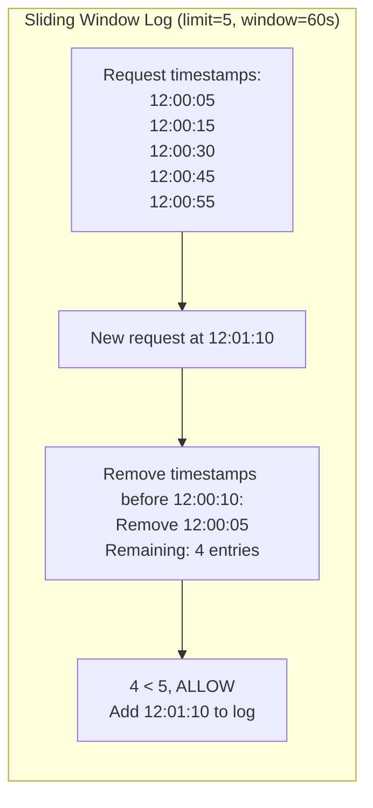
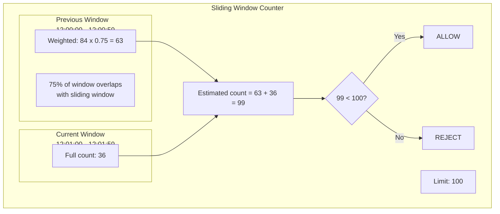
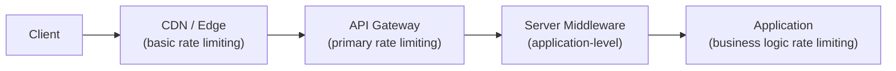
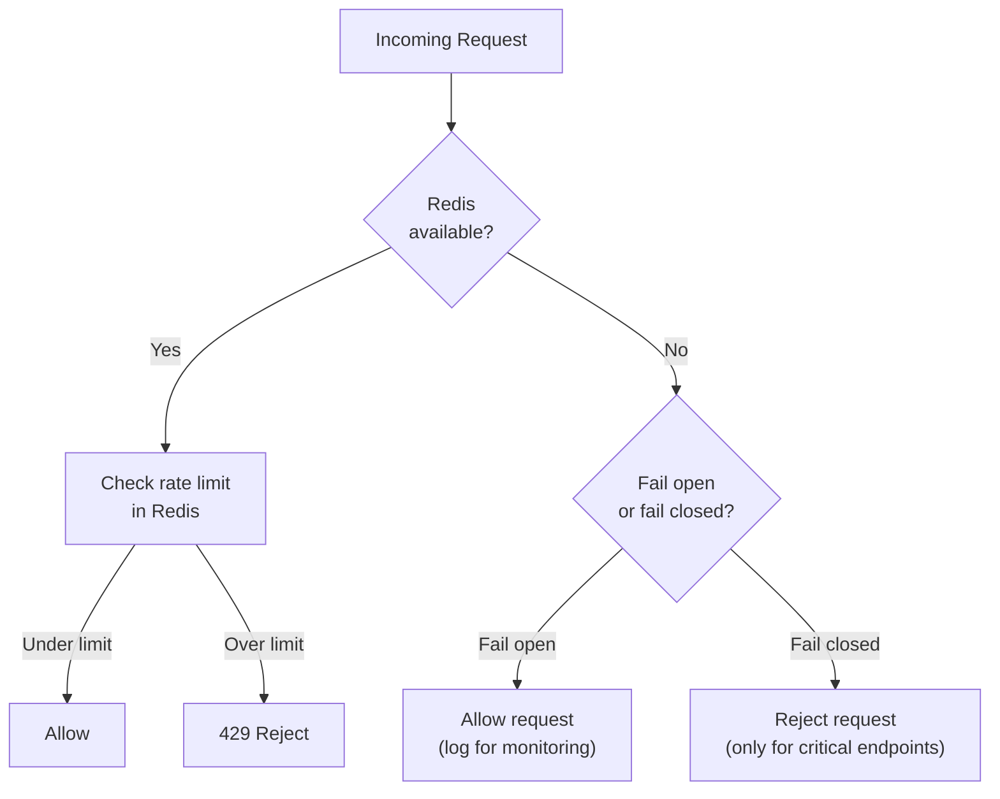

# Design a Rate Limiter

## Introduction

A rate limiter controls how many requests a client can make to a service within a given time window. It is a critical component of any production API: it protects services from being overwhelmed (intentionally or accidentally), ensures fair usage across clients, prevents abuse, and controls cost. Despite its conceptual simplicity, designing a rate limiter that is accurate, low-latency, and works correctly across a distributed fleet of servers is a nuanced engineering challenge.

In a Staff/Senior-level interview, this topic tests your knowledge of specific algorithms (and their trade-offs), distributed state management, and the operational considerations of deploying rate limiting in a real system.

---

## Requirements

### Functional Requirements

1. **Limit requests**: Enforce a maximum number of requests per client per time window.
2. **Multiple dimensions**: Rate limit by user ID, IP address, API key, or API endpoint.
3. **Configurable rules**: Different limits for different API endpoints, user tiers, or clients.
4. **Informative responses**: Return headers telling clients their current limit, remaining quota, and when the limit resets.

### Non-Functional Requirements

1. **Low latency**: The rate limiting check must add minimal overhead (< 1 ms) to each request.
2. **Accurate counting**: Counts should be correct even under high concurrency.
3. **Distributed**: Must work correctly when requests are spread across multiple servers.
4. **Fault tolerant**: If the rate limiting system fails, requests should still be served (fail open), not blocked.
5. **Scalable**: Handle millions of QPS across thousands of rate limit dimensions.

---

## Capacity Estimation

| Metric | Value |
|--------|-------|
| Total API QPS | 1,000,000 |
| Unique rate limit keys (users/IPs) | 10,000,000 |
| Rate limit checks per request | 2-3 (user + IP + endpoint) |
| Total rate limit operations/sec | 3,000,000 |
| Storage per rate limit entry | ~100 bytes |
| Total rate limit state (in memory) | 10M x 100 B = ~1 GB |
| Latency budget for rate check | < 1 ms |

> [!NOTE]
> 1 GB of state fits comfortably in a single Redis instance. For higher cardinality (100M+ keys) or for multi-region deployments, you would shard across multiple Redis instances.

---

## High-Level Architecture



---

## Rate Limiting Algorithms

### 1. Token Bucket

The token bucket is the most widely used rate limiting algorithm. It allows controlled bursts while maintaining a long-term average rate.

**How it works**:
- A bucket holds tokens. Each bucket has a maximum capacity (the burst size).
- Tokens are added to the bucket at a fixed rate (the refill rate).
- Each request consumes one token. If the bucket is empty, the request is rejected.
- If the bucket is full, new tokens overflow (are discarded).



**Example**: Rate limit of 10 requests per second with burst of 20.
- Bucket capacity: 20 tokens (allows burst of 20 requests).
- Refill rate: 10 tokens per second.
- A client that has been idle accumulates up to 20 tokens and can send 20 requests instantly (burst), then is limited to 10/second going forward.

**Implementation** (pseudocode):

```
function allow_request(key):
    bucket = get_or_create_bucket(key)
    now = current_time()

    # Refill tokens based on elapsed time
    elapsed = now - bucket.last_refill_time
    tokens_to_add = elapsed * refill_rate
    bucket.tokens = min(bucket.capacity, bucket.tokens + tokens_to_add)
    bucket.last_refill_time = now

    # Try to consume a token
    if bucket.tokens >= 1:
        bucket.tokens -= 1
        return ALLOW
    else:
        return REJECT
```

| Pros | Cons |
|------|------|
| Allows bursts (good for real traffic patterns) | Requires storage per key (token count + timestamp) |
| Simple to implement | Burst size and refill rate are two parameters to tune |
| Widely understood and battle-tested | |
| Memory efficient | |

### 2. Leaky Bucket

The leaky bucket smooths traffic into a constant rate. It is essentially a FIFO queue with a fixed processing rate.

**How it works**:
- Requests enter a queue (the "bucket").
- The queue is drained at a fixed rate (the "leak rate").
- If the queue is full, new requests are dropped.



| Pros | Cons |
|------|------|
| Smooths traffic perfectly (no bursts) | No burst tolerance (may reject legitimate burst traffic) |
| Fixed outflow rate makes downstream planning easy | Queue adds latency (requests wait in queue) |
| Simple queue semantics | Not suitable when low latency is required |

> [!TIP]
> In an interview, contrast the token bucket and leaky bucket clearly: the token bucket allows bursts up to a maximum, while the leaky bucket enforces a perfectly smooth rate. Most real-world APIs use token bucket because some degree of burst tolerance is desirable.

### 3. Fixed Window Counter

The simplest algorithm. Divide time into fixed windows (e.g., 1-minute windows) and count requests per window.

**How it works**:
- Each time window (e.g., 12:00:00 - 12:00:59) has a counter.
- Each request increments the counter for the current window.
- If the counter exceeds the limit, the request is rejected.
- At the start of each new window, the counter resets.

**The boundary burst problem**:

```
Limit: 100 requests per minute

Window 1: 12:00:00 - 12:00:59
  - Client sends 0 requests from 12:00:00-12:00:30
  - Client sends 100 requests from 12:00:30-12:00:59 (allowed, at limit)

Window 2: 12:01:00 - 12:01:59
  - Client sends 100 requests from 12:01:00-12:01:30 (allowed, new window)
  - Client sends 0 requests from 12:01:30-12:01:59

Result: 200 requests in a 60-second span (12:00:30 to 12:01:30)
         despite a limit of 100 per minute!
```

| Pros | Cons |
|------|------|
| Very simple to implement | Boundary burst problem (2x limit at window edges) |
| Low memory (one counter per key per window) | Not accurate at window boundaries |
| Fast (single atomic increment) | |

### 4. Sliding Window Log

Keeps a log of every request timestamp and counts how many fall within the sliding window.

**How it works**:
- For each client, store the timestamp of every request.
- When a new request arrives, remove all timestamps older than (now - window_size).
- If the remaining count is less than the limit, allow the request and add its timestamp.
- Otherwise, reject.



| Pros | Cons |
|------|------|
| Perfectly accurate (no boundary problem) | High memory usage (store every timestamp) |
| True sliding window | Cleanup cost (remove old entries) |
| | Not practical for high-volume limits (e.g., 10K/min stores 10K timestamps per user) |

### 5. Sliding Window Counter

A hybrid approach that combines the accuracy of the sliding window log with the efficiency of fixed window counters.

**How it works**:
- Maintain counters for the current window and the previous window.
- Estimate the request count in the sliding window using a weighted average:
  `count = previous_window_count * overlap_percentage + current_window_count`

**Example**:

```
Limit: 100 requests per minute
Current time: 12:01:15 (15 seconds into the current window)

Previous window (12:00:00 - 12:00:59): 84 requests
Current window  (12:01:00 - 12:01:59): 36 requests

Sliding window estimate:
  Overlap of previous window = (60 - 15) / 60 = 75%
  Estimated count = 84 * 0.75 + 36 = 63 + 36 = 99

99 < 100, so ALLOW the request.
```



| Pros | Cons |
|------|------|
| Low memory (just two counters per key) | Approximate (not exact count) |
| No boundary burst problem (smoothed by weighting) | Assumes uniform request distribution in previous window |
| Fast (arithmetic + two counter reads) | Slight inaccuracy at edges |

> [!IMPORTANT]
> The sliding window counter is the most practical algorithm for most production rate limiters. It is memory-efficient, fast, and accurate enough. Cloudflare uses this approach for their rate limiting product.

### Algorithm Comparison Summary

| Algorithm | Accuracy | Memory | Burst Handling | Complexity |
|-----------|----------|--------|----------------|-----------|
| Token bucket | Good | Low (2 values/key) | Allows controlled bursts | Low |
| Leaky bucket | Perfect smoothing | Medium (queue) | No bursts | Low |
| Fixed window | Poor at boundaries | Very low (1 counter/key) | 2x burst at boundaries | Very low |
| Sliding window log | Perfect | High (all timestamps) | None | Medium |
| Sliding window counter | Very good | Low (2 counters/key) | Smoothed | Low |

---

## Where to Place the Rate Limiter



| Placement | Pros | Cons | Best For |
|-----------|------|------|----------|
| Client-side | Immediate feedback, reduces traffic | Easily bypassed, untrustworthy | UX (disable button after rapid clicks) |
| CDN / Edge | Lowest latency, blocks DDoS close to source | Limited rule flexibility | IP-based blocking, DDoS mitigation |
| API Gateway | Centralized, all traffic passes through | Gateway becomes bottleneck | Cross-service rate limits, API key limits |
| Server middleware | Application context (user roles, tier) | Each server needs access to shared state | User-tier-based limits |
| Application layer | Full business context | Deepest in the stack, most latency | Business rule limits (e.g., max 3 password resets/hour) |

**Decision**: Layer rate limiting. Use the API gateway as the primary enforcement point (catches most abuse), with application-level limits for business-specific rules. Edge/CDN handles volumetric DDoS.

---

## Core Components Deep Dive

### 1. Distributed Rate Limiting with Redis

In a distributed system with multiple API servers, rate limit state must be shared. Redis is the standard choice because it provides atomic operations and sub-millisecond latency.

**Basic approach: INCR + EXPIRE**

```
# Fixed window counter in Redis
key = "rate_limit:{user_id}:{window_id}"

count = INCR key            # Atomic increment
if count == 1:
    EXPIRE key 60           # Set expiry on first request in window

if count > limit:
    return 429
else:
    return ALLOW
```

**Race condition**: There is a gap between INCR and EXPIRE. If the server crashes after INCR but before EXPIRE, the key lives forever and the counter never resets.

**Fix 1: Use Lua script** (atomic):

```lua
-- Lua script (runs atomically in Redis)
local key = KEYS[1]
local limit = tonumber(ARGV[1])
local window = tonumber(ARGV[2])

local current = redis.call('INCR', key)
if current == 1 then
    redis.call('EXPIRE', key, window)
end

if current > limit then
    return 0  -- REJECTED
else
    return 1  -- ALLOWED
end
```

**Fix 2: Use MULTI/EXEC** (transaction):

```
MULTI
INCR key
EXPIRE key 60
EXEC
```

> [!TIP]
> In an interview, always mention the race condition between INCR and EXPIRE. Then present the Lua script solution. This demonstrates awareness of atomicity issues in distributed systems.

### Sliding Window Counter in Redis

```lua
-- Sliding window counter using two keys
local prev_key = KEYS[1]      -- previous window counter
local curr_key = KEYS[2]      -- current window counter
local limit = tonumber(ARGV[1])
local window_size = tonumber(ARGV[2])
local now = tonumber(ARGV[3])

local curr_window_start = math.floor(now / window_size) * window_size
local elapsed = now - curr_window_start
local weight = (window_size - elapsed) / window_size

local prev_count = tonumber(redis.call('GET', prev_key) or "0")
local curr_count = tonumber(redis.call('GET', curr_key) or "0")

local estimated = math.floor(prev_count * weight) + curr_count

if estimated >= limit then
    return 0  -- REJECTED
end

redis.call('INCR', curr_key)
redis.call('EXPIRE', curr_key, window_size * 2)
return 1  -- ALLOWED
```

### Sliding Window Log in Redis (Sorted Set)

For use cases requiring exact counting:

```lua
-- Sliding window log using Redis Sorted Set
local key = KEYS[1]
local limit = tonumber(ARGV[1])
local window = tonumber(ARGV[2])
local now = tonumber(ARGV[3])
local request_id = ARGV[4]

-- Remove entries outside the window
redis.call('ZREMRANGEBYSCORE', key, 0, now - window)

-- Count remaining entries
local count = redis.call('ZCARD', key)

if count >= limit then
    return 0  -- REJECTED
end

-- Add new entry
redis.call('ZADD', key, now, request_id)
redis.call('EXPIRE', key, window)
return 1  -- ALLOWED
```

> [!WARNING]
> The sorted set approach stores one entry per request. For limits like "1000 requests per minute," this means 1000 entries per user in the sorted set. For 10 million users, that is 10 billion entries at peak. Use the sliding window counter for high-volume limits and reserve the sorted set approach for low-volume, precision-critical limits.

### 2. Rate Limit Rules Engine

Rules define what limits apply to which requests.

```
rules:
  - name: "Default API rate limit"
    match:
      scope: api_key
    limit: 1000
    window: 60s
    algorithm: sliding_window_counter

  - name: "Login endpoint protection"
    match:
      endpoint: "/api/v1/auth/login"
      scope: ip_address
    limit: 5
    window: 300s
    algorithm: sliding_window_log

  - name: "Premium tier override"
    match:
      scope: api_key
      tier: premium
    limit: 10000
    window: 60s
    algorithm: token_bucket
    burst: 500

  - name: "Write endpoint limit"
    match:
      endpoint: "/api/v1/posts"
      method: POST
      scope: user_id
    limit: 10
    window: 60s
    algorithm: fixed_window
```

**Rule evaluation order**: More specific rules take precedence. A premium user hitting the login endpoint matches both "Premium tier override" and "Login endpoint protection." Both limits are applied independently -- the request must pass all applicable limits.

### 3. Rate Limit Response Headers

When a request is rate limited, the response must include standard headers:

| Header | Description | Example |
|--------|------------|---------|
| `X-RateLimit-Limit` | Maximum requests allowed in window | `1000` |
| `X-RateLimit-Remaining` | Requests remaining in current window | `247` |
| `X-RateLimit-Reset` | Unix timestamp when the window resets | `1712847600` |
| `Retry-After` | Seconds until the client should retry (on 429) | `23` |

**HTTP response for a rate-limited request**:

```
HTTP/1.1 429 Too Many Requests
Content-Type: application/json
X-RateLimit-Limit: 1000
X-RateLimit-Remaining: 0
X-RateLimit-Reset: 1712847600
Retry-After: 23

{
  "error": "rate_limit_exceeded",
  "message": "Rate limit of 1000 requests per minute exceeded. Retry after 23 seconds.",
  "retry_after": 23
}
```

> [!NOTE]
> Always return rate limit headers on every response, not just 429 responses. This allows well-behaved clients to self-throttle before hitting the limit. Returning headers on success responses is cheap and prevents many 429 errors.

### 4. Hard vs Soft Rate Limiting

| Type | Behavior | Use Case |
|------|----------|----------|
| Hard limit | Strictly reject requests beyond the limit | Security endpoints (login, password reset) |
| Soft limit | Allow some overflow, log for monitoring | Internal services, trusted partners |
| Throttling | Slow down (add delay) instead of rejecting | Smooth traffic without losing requests |

**Soft limiting example**: Allow 10% over the limit but flag the excess for monitoring. If a client consistently exceeds the soft limit, alert the operations team.

### 5. Handling Rate-Limited Requests on the Client Side

Clients should implement exponential backoff when they receive a 429:

```
Attempt 1: Wait Retry-After seconds (from header)
Attempt 2: Wait 2x the Retry-After value + jitter
Attempt 3: Wait 4x + jitter
Max attempts: 5
```

**Circuit breaker pattern**: If the client receives many consecutive 429 responses, stop sending requests entirely for a cool-down period (circuit open). Periodically send a single probe request to check if the limit has reset (circuit half-open).

---

## Data Models & Storage

### Rate Limit Configuration

| Column | Type | Description |
|--------|------|-------------|
| id | UUID | Primary key |
| name | VARCHAR(255) | Human-readable rule name |
| scope | ENUM | user_id, ip_address, api_key, endpoint |
| match_criteria | JSONB | Endpoint, method, tier filters |
| limit | INT | Max requests |
| window_seconds | INT | Time window in seconds |
| algorithm | ENUM | token_bucket, leaky_bucket, fixed_window, sliding_window_log, sliding_window_counter |
| burst_size | INT | For token bucket: max burst |
| action | ENUM | reject, throttle, log_only |
| priority | INT | Rule evaluation order |
| enabled | BOOLEAN | Active or disabled |

### Rate Limit State (Redis)

| Key Pattern | Value | TTL |
|-------------|-------|-----|
| `rl:{scope}:{id}:{window}` | Counter (integer) | 2x window size |
| `rl:tb:{scope}:{id}` | `{tokens: float, last_refill: timestamp}` | Idle timeout (e.g., 1 hour) |
| `rl:swl:{scope}:{id}` | Sorted set of timestamps | Window size |

### Rate Limit Audit Log

| Column | Type | Description |
|--------|------|-------------|
| timestamp | TIMESTAMP | When the decision was made |
| client_id | VARCHAR(128) | Who was rate limited |
| rule_id | UUID | Which rule triggered |
| action | ENUM | allowed, rejected, throttled |
| request_count | INT | Count at time of decision |
| limit | INT | What the limit was |

### Storage Choices

| Component | Technology | Rationale |
|-----------|-----------|-----------|
| Rate limit counters | Redis | Sub-ms latency, atomic operations, TTL support |
| Rule configuration | PostgreSQL + local cache | Infrequent changes, cached in-memory at API gateway |
| Audit logs | Kafka -> ClickHouse | High write volume, analytics queries |

---

## Scalability Strategies

### Redis Scaling

- **Single Redis instance**: For up to ~10M active rate limit keys, a single Redis instance (with a replica for failover) is sufficient. Rate limit state is small (< 1 GB).
- **Redis Cluster**: For higher cardinality, shard by rate limit key across multiple Redis nodes using consistent hashing.
- **Local + Remote hybrid**: For ultra-low-latency requirements, maintain a local counter (in-memory at each API server) and periodically sync to Redis. Accept minor inaccuracy (each server's local count may be slightly behind the true total).

### Multi-Region Rate Limiting

| Strategy | Description | Accuracy | Latency |
|----------|------------|----------|---------|
| Global centralized | Single Redis cluster, all regions check it | Perfect | High (cross-region round trip) |
| Per-region independent | Each region has its own Redis, limit is per-region | Low (user can get N x limit across regions) | Low |
| Per-region with global sync | Local Redis with periodic sync to global counter | Medium | Low for most requests |
| Token bucket with global budget | Allocate a fraction of global limit to each region | Medium-high | Low |

**Decision**: Per-region with global sync for most use cases. Each region maintains local counters and syncs to a global counter asynchronously (every 5-10 seconds). This provides low-latency checks with reasonable global accuracy.

### Handling Redis Failures



> [!WARNING]
> Failing open (allowing requests when Redis is down) means temporarily losing rate limiting protection. Failing closed (rejecting all requests) means a Redis outage causes a total service outage. For most APIs, failing open is the right choice -- a brief period without rate limiting is better than rejecting all legitimate traffic. For security-critical endpoints (login attempts), consider failing closed.

---

## Rate Limiting Dimensions

| Dimension | Key Example | Use Case |
|-----------|------------|----------|
| User ID | `rl:user:u_abc123` | Per-user API quotas |
| IP address | `rl:ip:192.168.1.1` | DDoS protection, anonymous users |
| API key | `rl:key:ak_xyz789` | Partner/developer quotas |
| Endpoint | `rl:ep:/api/v1/search` | Protect expensive endpoints |
| User + endpoint | `rl:user:u_abc:ep:/api/v1/posts` | Per-user per-endpoint limits |
| Organization | `rl:org:org_123` | Team-wide quotas |

**Layered limiting**: Apply multiple dimensions simultaneously. A request might pass the user-level limit but be rejected by the IP-level limit (e.g., a shared corporate IP with many users behind it).

---

## Design Trade-offs

### Accuracy vs Performance

| Approach | Accuracy | Latency | Complexity |
|----------|----------|---------|-----------|
| Exact counting (sorted set) | Perfect | Higher (~1 ms) | Higher |
| Approximate (sliding window counter) | ~99% accurate | Lower (~0.5 ms) | Lower |
| Local counting (no shared state) | Poor (per-server only) | Lowest (~0.01 ms) | Lowest |

**Decision**: Sliding window counter for most limits. Exact counting for security-critical limits (login attempts).

### Centralized vs Distributed Counters

| Approach | Pros | Cons |
|----------|------|------|
| Centralized (single Redis) | Perfectly accurate | Single point of failure, cross-region latency |
| Distributed (per-server local) | Zero additional latency | Inaccurate (limit x N servers) |
| Hybrid (local + periodic sync) | Good balance | Implementation complexity |

**Decision**: Centralized Redis for same-region deployments. Hybrid with periodic sync for multi-region.

### Granularity of Rate Limit Windows

| Window Size | Pros | Cons |
|-------------|------|------|
| Per-second | Very precise, quick recovery | High counter churn, more Redis operations |
| Per-minute | Balanced | Most common choice |
| Per-hour/day | Smooth long-term limits | Slow recovery after exhaustion |

**Decision**: Use per-minute as the default with per-second for critical endpoints. Some APIs also enforce daily quotas as a separate layer.

> [!IMPORTANT]
> Rate limiting is one of those systems where "good enough" is often better than "perfect." An approximate rate limiter that adds 0.1 ms of latency is far more valuable than a perfectly accurate one that adds 5 ms. The goal is to stop abuse, not to count to the last request.

---

## Interview Cheat Sheet

### Key Points to Mention

1. **Token bucket is the standard**: Allows controlled bursts, memory-efficient, widely used (Amazon, Stripe).
2. **Sliding window counter for precision**: Best balance of accuracy and performance.
3. **Fixed window has boundary burst problem**: Always mention this and explain why it matters.
4. **Redis for shared state**: Atomic INCR + EXPIRE, Lua scripts for race-condition-free operations.
5. **Rate limit headers on every response**: X-RateLimit-Limit, Remaining, Reset. Helps clients self-throttle.
6. **Fail open**: When the rate limiter backend is down, allow requests rather than blocking all traffic.
7. **Multiple dimensions**: User, IP, API key, endpoint. Apply independently.
8. **Layer rate limiting**: Edge/CDN for DDoS, API gateway for API limits, application for business rules.

### Common Interview Questions and Answers

**Q: How do you rate limit in a distributed system where requests hit different servers?**
A: Use a shared counter store (Redis). All API servers check and increment counters in the same Redis instance. Use Lua scripts to make the check-and-increment atomic.

**Q: What if Redis goes down?**
A: Fail open for most endpoints (allow requests, log for monitoring). For security-critical endpoints like login, either fail closed or fall back to per-server local counters (less accurate but better than nothing).

**Q: How do you handle a sudden spike from a single user?**
A: The rate limiter rejects requests beyond the limit immediately. The 429 response includes Retry-After, so well-behaved clients back off. For malicious traffic, add the IP to a blocklist at the edge (CDN/firewall level) to reject requests before they reach the API gateway.

**Q: How do you set the right rate limit values?**
A: Start with traffic analysis -- measure the P95 and P99 request rates per user. Set the limit above P99 (so 99% of users are never affected) but below the level that would impact service stability. Adjust based on monitoring. Offer self-service limit increases for legitimate high-volume users.

**Q: How does rate limiting differ from throttling?**
A: Rate limiting rejects excess requests with a 429 error. Throttling slows down (delays) requests instead of rejecting them. Throttling is useful when you want to smooth traffic without losing requests, but it adds latency and requires queue management.

**Q: Why not just use fixed window counters? They are the simplest.**
A: The boundary burst problem. A client can send 2x the limit in a span of time equal to the window size by clustering requests at the boundary of two adjacent windows. The sliding window counter solves this with minimal additional complexity.

> [!TIP]
> When whiteboarding, draw the token bucket first (it is visual and intuitive), then explain the fixed window boundary burst problem (it shows you know the subtleties), then land on sliding window counter as your recommendation (it shows practical judgment). This narrative arc demonstrates both breadth and depth.
