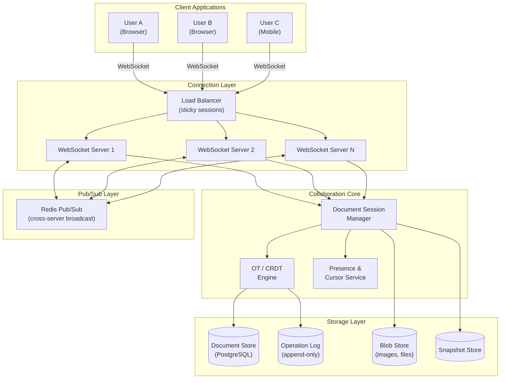
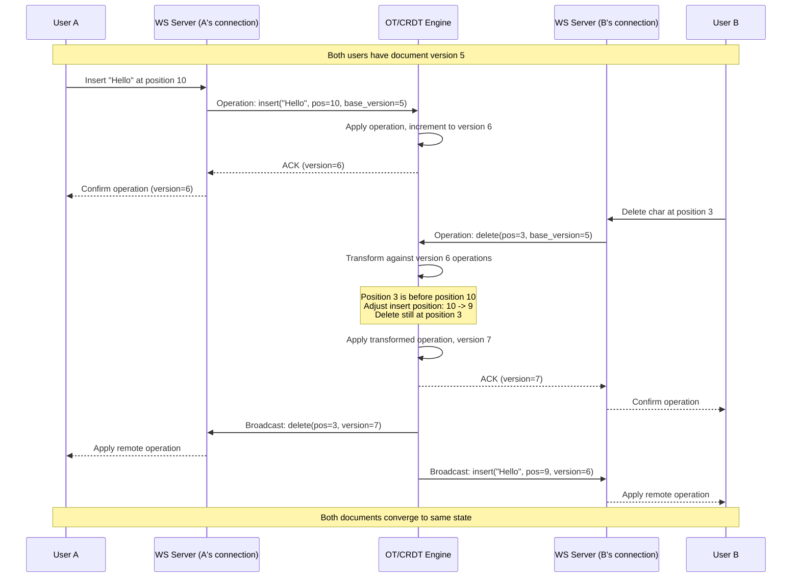
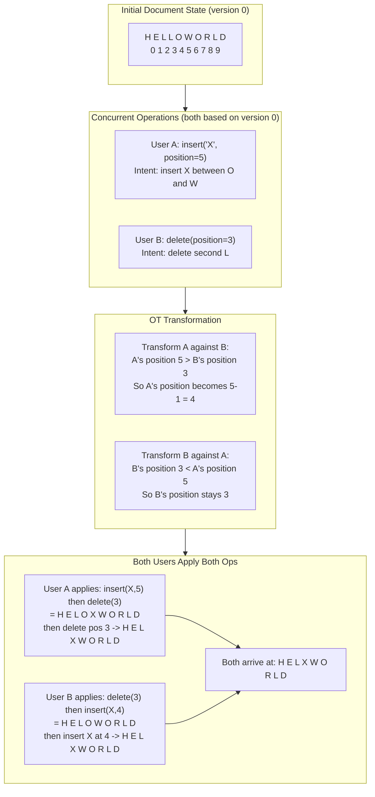
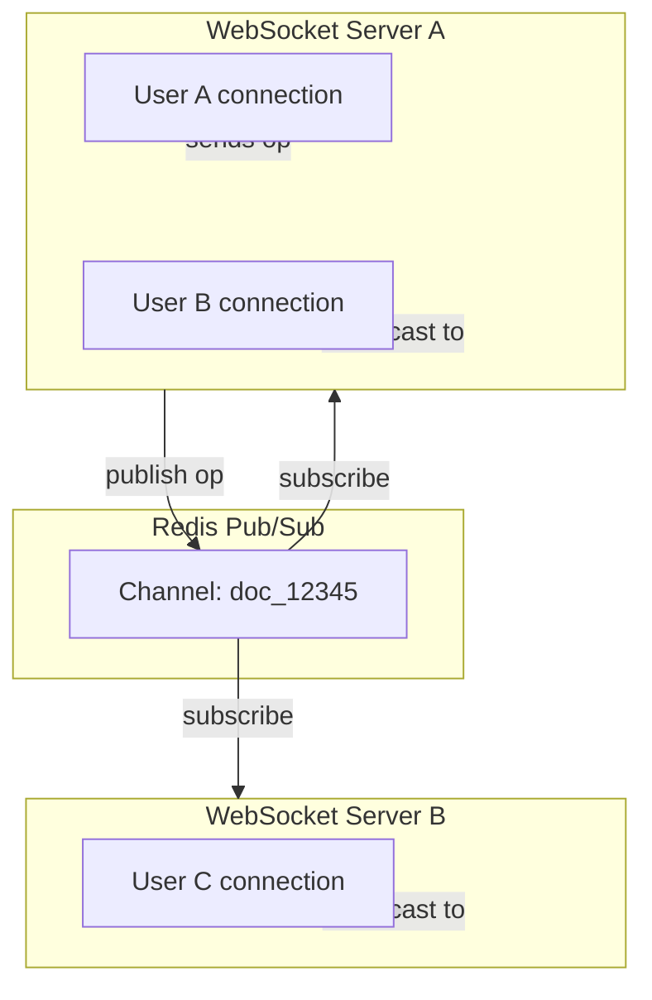
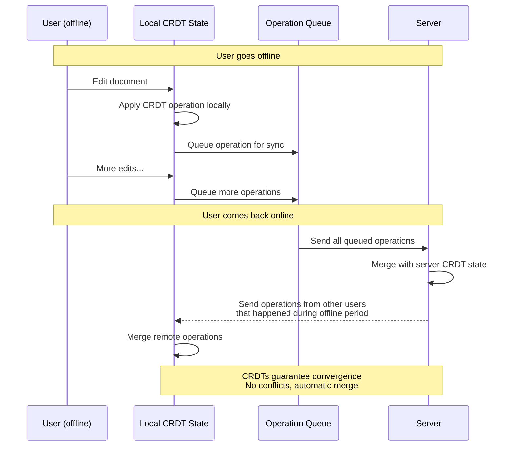

# Design a Real-Time Collaboration System

## Introduction

Real-time collaborative editing, as seen in Google Docs, Figma, and Notion, allows multiple users to simultaneously edit the same document and see each other's changes instantly. What appears seamless to the user is actually one of the hardest problems in distributed systems: maintaining a consistent document state when multiple users make concurrent, potentially conflicting edits across unreliable networks.

In a Staff/Senior-level interview, this topic tests your understanding of concurrency control algorithms (Operational Transformation and CRDTs), real-time communication (WebSockets), conflict resolution, offline support, and the subtlety of making distributed state feel like a single shared document.

---

## Requirements

### Functional Requirements

1. **Concurrent editing**: Multiple users can edit the same document simultaneously.
2. **Real-time sync**: Changes from one user appear on all other users' screens within sub-second latency.
3. **Cursor and presence tracking**: Show where each collaborator's cursor is and who is currently viewing the document.
4. **Version history**: Maintain a complete edit history with the ability to view or restore previous versions.
5. **Sharing and permissions**: Owner can share with specific users as editor or viewer, or via public link.
6. **Rich text support**: Bold, italic, headings, lists, tables, images, and other formatting.

### Non-Functional Requirements

1. **Conflict resolution without data loss**: No user's edits should be silently dropped.
2. **Sub-second sync latency**: In normal network conditions, changes should propagate in under 500 ms.
3. **Offline support**: Users can edit while disconnected and sync when they reconnect.
4. **Convergence**: All users must eventually see the same document state, regardless of the order in which they receive operations.
5. **Scalability**: Support documents with hundreds of concurrent editors and millions of total documents.

---

## Capacity Estimation

| Metric | Value |
|--------|-------|
| Total documents | 500 million |
| Documents actively edited concurrently | 1 million |
| Average concurrent editors per document | 3-5 |
| Total concurrent WebSocket connections | 5 million |
| Operations per second (all users) | 500,000 |
| Average operation size | 100-500 bytes |
| Operation throughput | ~100 MB/s |
| Average document size | 50 KB |
| Total document storage | 500M x 50 KB = ~25 TB |
| Version history storage multiplier | 5x (snapshots + operation logs) | ~125 TB |

> [!NOTE]
> The operations-per-second figure may seem high, but consider that every keystroke, cursor movement, and formatting change generates an operation. A single fast typist produces 5-10 operations per second.

---

## High-Level Architecture



### Collaboration Flow



---

## Core Components Deep Dive

### 1. Operational Transformation (OT)

OT is the algorithm used by Google Docs. Its core idea is: when two users make concurrent edits, transform one operation against the other so that applying both in any order produces the same result.

**The fundamental problem**: User A inserts "X" at position 5, and User B simultaneously deletes the character at position 3. These operations were created independently against the same document state.

If we naively apply both:
- A's view: insert "X" at 5, then delete at 3 -> X is at position 4
- B's view: delete at 3, then insert "X" at 5 -> X is at position 5

The documents have diverged. OT fixes this by transforming operations.

**Transformation example**:



**OT with a central server**: Google Docs uses a server-centric OT model:

1. The server is the single source of truth and assigns sequential version numbers.
2. Each client sends operations to the server along with the version they were based on.
3. The server transforms incoming operations against all operations that have been applied since the client's base version.
4. The server applies the transformed operation and broadcasts it to all other clients.
5. Each client transforms incoming remote operations against any of its own pending (unacknowledged) operations.

**OT operation types**:

| Operation | Parameters | Description |
|-----------|-----------|-------------|
| Insert | position, text | Insert text at a position |
| Delete | position, length | Delete characters starting at position |
| Retain | count | Skip forward (no change) |
| Format | position, length, attributes | Apply formatting (bold, italic, etc.) |

**Composition**: Operations can be composed (combined) for efficiency. Instead of sending 5 individual character insertions, they are composed into a single "insert 5 characters" operation.

### 2. CRDTs (Conflict-free Replicated Data Types)

CRDTs take a fundamentally different approach. Instead of transforming operations, they use data structures that are mathematically guaranteed to converge when merged, regardless of the order of operations.

**How it works for text**:

Each character in the document is assigned a unique, globally ordered identifier. When a user inserts a character, it gets an ID that positions it between its neighbors. Because IDs are unique and the ordering is deterministic, any replica can apply operations in any order and arrive at the same state.

**Popular CRDT approaches**:

- **RGA (Replicated Growable Array)**: Characters have unique timestamps. Insertions reference the character they follow. Concurrent insertions after the same character are ordered by timestamp.
- **Yjs**: A popular open-source CRDT library. Uses a linked list of items with unique IDs. Handles insertions, deletions, and formatting. Used by many collaboration products.
- **Automerge**: Another CRDT library focused on JSON-like data structures. Good for structured documents.

**CRDT character addressing example**:

```
Document: "HELLO"
IDs:       (1,A) (2,A) (3,A) (4,A) (5,A)

User A inserts "X" between position 3 and 4:
  New char: (6,A) placed between (3,A) and (4,A)
  Document: "HELXLO"

User B concurrently inserts "Y" between position 3 and 4:
  New char: (1,B) placed between (3,A) and (4,A)
  Document: "HELYLO"

When merging: both X and Y go between (3,A) and (4,A).
Tie-breaking by user ID: A < B, so X comes before Y.
Final document: "HELXYLO" (deterministic, both users converge)
```

### 3. OT vs CRDT Comparison

| Aspect | OT | CRDT |
|--------|-----|------|
| **Central server required** | Yes (typical) | No (peer-to-peer possible) |
| **Convergence guarantee** | Relies on correct transformation functions | Mathematically guaranteed |
| **Complexity** | Transform functions are tricky to implement correctly | Data structure is complex, but merge is simple |
| **Performance** | Lightweight operations | Higher memory (unique IDs per character) |
| **Offline support** | Difficult (server is authority) | Natural (merge when reconnected) |
| **History/undo** | Invert operations | More complex (need to track causality) |
| **Adopted by** | Google Docs, Microsoft Office Online | Figma, Notion (partially), Yjs-based apps |
| **Scalability** | Server can bottleneck | Each replica independent |
| **Implementation maturity** | Well-understood, many battle-tested implementations | Newer, rapidly improving (Yjs, Automerge) |

> [!TIP]
> In an interview, you do not need to implement OT or CRDT from scratch. What matters is explaining the core idea of each, their trade-offs, and why you would choose one over the other. Saying "OT needs a central server but is lighter weight; CRDTs support peer-to-peer and offline but use more memory" demonstrates solid understanding.

### 4. WebSocket for Real-Time Sync

WebSockets provide the bidirectional, persistent connection needed for real-time collaboration.

**Why not HTTP polling or Server-Sent Events?**

| Transport | Direction | Latency | Connection Overhead | Use Case |
|-----------|-----------|---------|--------------------|---------| 
| HTTP polling | Client -> Server | High (poll interval) | New connection each time | Not suitable for real-time |
| Long polling | Bidirectional (awkward) | Medium | Hold connection open | Acceptable but wasteful |
| SSE | Server -> Client only | Low | One persistent connection | Good for one-way updates |
| WebSocket | Bidirectional | Very low | One persistent connection | Ideal for collaboration |

**WebSocket connection management**:

- **Sticky sessions**: A user's WebSocket connection must stay on the same server for the duration of their editing session. Use consistent hashing on user_id or session_id at the load balancer.
- **Heartbeats**: Send ping/pong frames every 30 seconds to detect dead connections.
- **Reconnection**: When a connection drops, the client reconnects and requests all operations since its last known version. The server replays missed operations.
- **Cross-server communication**: When collaborators are connected to different WebSocket servers, use Redis Pub/Sub or a message bus to broadcast operations across servers.



### 5. Document Model

A collaborative document is not just a string of characters. It is a tree of blocks with rich formatting.

**Block-based structure**:

```
Document
  +-- Paragraph Block
  |     +-- Text Run ("Hello ", bold=false)
  |     +-- Text Run ("world", bold=true)
  |
  +-- Heading Block (level=2)
  |     +-- Text Run ("Introduction")
  |
  +-- List Block (type=ordered)
  |     +-- List Item
  |     |     +-- Text Run ("First point")
  |     +-- List Item
  |           +-- Text Run ("Second point")
  |
  +-- Table Block
  |     +-- Row
  |           +-- Cell +-- Cell +-- Cell
  |
  +-- Image Block (src="...", alt="...")
```

**Why tree structure?**
- Enables block-level operations (move a paragraph, delete a list).
- Formatting is represented as attributes on text runs, not as separate characters.
- Embeds (images, tables, code blocks) are first-class nodes, not hacks.

**Character-level addressing**: For OT/CRDT, each character needs a stable address that survives concurrent edits. In a flat string, positions shift when others insert or delete. In a tree-based model, each block has an ID, and positions are relative to the block. This localizes the impact of concurrent edits.

### 6. Versioning and History

**Operation log**: Every operation is stored in an append-only log with a monotonically increasing version number.

```
Version 1: insert("H", pos=0, user=A, timestamp=T1)
Version 2: insert("e", pos=1, user=A, timestamp=T2)
Version 3: insert("l", pos=2, user=A, timestamp=T3)
...
Version 1000: format(pos=0, len=5, bold=true, user=B, timestamp=T1000)
```

**Snapshots**: Replaying thousands of operations to reconstruct a document is slow. Periodically (e.g., every 100 operations or when a user explicitly creates a version), the system saves a snapshot of the full document state.

**Loading a document**:
1. Find the most recent snapshot before the desired version.
2. Replay operations from that snapshot forward to the target version.
3. This bounds the replay to at most ~100 operations.

**Viewing history**: Users can browse a timeline of changes, see who made each change, and restore to any previous version. Restoring creates a new version (it does not rewrite history).

> [!NOTE]
> The operation log is the source of truth, not the snapshots. Snapshots are an optimization for fast loading. If a snapshot is corrupted, it can be rebuilt from the operation log.

### 7. Cursor and Presence Tracking

Seeing other users' cursors and selections is essential for the "collaborative" feel.

**Implementation**:

1. Each user periodically sends their cursor position and selection range to the server (throttled to every 50-100 ms).
2. The server broadcasts cursor positions to all other users in the same document session.
3. Cursor positions must be transformed when remote operations change the document. If User B inserts text before User A's cursor position, A's cursor display on B's screen must shift accordingly.

**Presence information**:

| Data | Purpose |
|------|---------|
| User ID and name | Show who is editing |
| Avatar/color | Visual identification |
| Cursor position | Show where they are typing |
| Selection range | Show what they have selected |
| Last active timestamp | Show idle/active status |
| Current viewport | Optionally show what part of the document they are viewing |

**Scalability**: For documents with many editors (50+), sending every cursor update to every user creates O(N^2) traffic. Strategies:
- Only send cursor updates for users visible in the recipient's viewport.
- Batch and throttle cursor updates.
- Use a separate, lossy channel for cursor data (missing an update is fine since the next one replaces it).

### 8. Permission and Sharing Model

| Role | Can View | Can Edit | Can Share | Can Delete |
|------|----------|----------|-----------|-----------|
| Owner | Yes | Yes | Yes | Yes |
| Editor | Yes | Yes | No (or limited) | No |
| Commenter | Yes | Comments only | No | No |
| Viewer | Yes | No | No | No |

**Sharing mechanisms**:
- **Direct sharing**: Share with specific users by email. Permission stored in an ACL table.
- **Link sharing**: Generate a shareable link with a specific permission level. Anyone with the link can access at that level.
- **Organization sharing**: Share with all users in a workspace or organization.

**Permission enforcement**: Permissions are checked at:
1. **Document load**: Verify the user has at least view access.
2. **Every operation**: The server validates that the user has edit permissions before applying any operation. This is critical for server-authoritative OT.
3. **WebSocket connection**: Downgrade or terminate connections if permissions change mid-session.

### 9. Offline Editing and Sync

Offline support is one of the strongest arguments for CRDTs over OT.

**CRDT offline flow**:



**OT offline flow** (more complex):

1. While offline, the client records operations against its local document state.
2. On reconnect, the client sends its base version and all pending operations to the server.
3. The server identifies all operations that occurred since the client's base version.
4. The server transforms the client's pending operations against the server's operations.
5. The server applies the transformed operations and broadcasts them.
6. The client receives the server's operations and transforms them against its pending operations.

> [!WARNING]
> OT offline sync is fragile and error-prone. The transformation chain can become very long if the user was offline for an extended period, and bugs in transformation logic compound. This is the primary reason many newer collaboration tools choose CRDTs for their conflict resolution layer.

---

## Data Models & Storage

### Core Tables

**documents**

| Column | Type | Description |
|--------|------|-------------|
| id | UUID | Primary key |
| title | VARCHAR(500) | Document title |
| owner_id | UUID | FK to users |
| current_version | BIGINT | Latest version number |
| current_snapshot_version | BIGINT | Version of most recent snapshot |
| content_type | ENUM | doc, spreadsheet, presentation |
| created_at | TIMESTAMP | Creation time |
| updated_at | TIMESTAMP | Last edit time |

**operations**

| Column | Type | Description |
|--------|------|-------------|
| id | BIGINT | Auto-increment |
| document_id | UUID | FK to documents |
| version | BIGINT | Sequential within document |
| user_id | UUID | Who made the edit |
| operation_data | JSONB | Serialized operation (insert, delete, format) |
| base_version | BIGINT | What version this was based on |
| created_at | TIMESTAMP | When applied |

**snapshots**

| Column | Type | Description |
|--------|------|-------------|
| id | UUID | Primary key |
| document_id | UUID | FK to documents |
| version | BIGINT | Document version at snapshot time |
| content | JSONB or BLOB | Full document state |
| created_at | TIMESTAMP | When snapshot was taken |

**document_permissions**

| Column | Type | Description |
|--------|------|-------------|
| document_id | UUID | FK to documents |
| user_id | UUID | FK to users (null for link-based sharing) |
| role | ENUM | owner, editor, commenter, viewer |
| share_token | VARCHAR(64) | For link-based sharing |
| created_at | TIMESTAMP | When permission was granted |

### Storage Choices

| Component | Technology | Rationale |
|-----------|-----------|-----------|
| Document metadata | PostgreSQL | Relational queries, ACL joins |
| Operation log | PostgreSQL or Cassandra | Append-only writes, sequential reads by doc+version |
| Snapshots | Object storage (S3) | Large blobs, infrequent access |
| Active document state | Redis | In-memory for active editing sessions |
| Presence/cursor data | Redis Pub/Sub | Ephemeral, real-time broadcast |
| Images and attachments | S3 + CDN | Large binary files |

---

## Scalability Strategies

### Document Session Scaling

Each actively edited document runs as a "session" on a server. Scaling strategies:

1. **Session affinity**: All users editing the same document connect to the same WebSocket server (or server group). This avoids cross-server coordination for every operation.
2. **Session migration**: If a server is overloaded, migrate a document session to another server. Pause editing briefly, transfer state, resume.
3. **Horizontal scaling by document**: Different documents live on different servers. The routing layer maps document_id to server.

### Hot Documents

A viral document with 100+ concurrent editors creates load concentration.

**Strategies**:
- **Operation batching**: Batch and compress operations over 50 ms windows before broadcasting.
- **Tiered broadcast**: For very large sessions, use a tree of relay servers. The OT/CRDT engine sends to 3 relay servers, each of which broadcasts to a subset of users.
- **Read-only mode overflow**: If concurrent editors exceed a threshold (e.g., 200), new users join in view-only mode.

### Global Distribution

For users across continents, latency to a single central server can be significant.

- **Regional WebSocket servers**: Users connect to the nearest region.
- **Central OT server per document**: Operations still route through a single authoritative server (for OT). This means users far from the document's home region experience higher operation latency.
- **CRDT advantage**: With CRDTs, there is no central authority. Regional servers can accept and apply operations locally, syncing with other regions asynchronously. This provides much lower latency for geographically distributed teams.

---

## Design Trade-offs

### OT vs CRDT: Which to Choose?

| Scenario | Recommendation | Reason |
|----------|---------------|--------|
| New product, small team | CRDT (Yjs) | Simpler to integrate, offline support built-in |
| Google-scale, server infrastructure | OT | Battle-tested, lower memory overhead |
| Offline-first requirement | CRDT | Natural merge on reconnect |
| Need for central authority (permissions, validation) | OT | Server processes every operation |
| Peer-to-peer architecture | CRDT | No central server needed |

### Consistency Model

| Approach | Latency | Consistency | Complexity |
|----------|---------|-------------|-----------|
| Synchronous OT (server processes every op) | Higher (1 round trip) | Strong (server is authority) | Medium |
| Optimistic local apply + async OT | Lower (instant local) | Eventual (may reorder) | High |
| CRDT (local apply + background sync) | Lowest (instant local) | Eventual (guaranteed convergence) | Medium |

**Decision**: Optimistic local apply with server-authoritative OT. Users see their own edits instantly (applied locally before server confirmation). The server transforms and orders operations, broadcasting the authoritative sequence to all clients. Clients may need to rebase their pending operations, but this is invisible to the user in practice.

### Operation Log: Bounded vs Unbounded

| Approach | Pros | Cons |
|----------|------|------|
| Keep all operations forever | Complete history, any version restorable | Storage grows unbounded |
| Compact old operations into snapshots | Bounded storage | Lose fine-grained history beyond compaction point |

**Decision**: Keep detailed operations for 90 days, then compact into daily snapshots. Users can see detailed edit-by-edit history for recent changes and daily summaries for older history.

> [!IMPORTANT]
> The choice between OT and CRDT is not just technical -- it is architectural. OT assumes a central server (which simplifies permissions and validation but creates a bottleneck). CRDTs assume decentralization (which enables offline and peer-to-peer but makes server-side validation harder). Choose based on your product's requirements, not just the algorithm's properties.

---

## Interview Cheat Sheet

### Key Points to Mention

1. **OT transforms concurrent operations** so they converge regardless of application order. Server is the central authority.
2. **CRDTs guarantee convergence mathematically** without a central server. Better for offline and peer-to-peer.
3. **WebSockets** for bidirectional real-time communication. Use Redis Pub/Sub for cross-server broadcast.
4. **Optimistic local application**: Apply edits locally for instant feedback, reconcile with server asynchronously.
5. **Operation log + periodic snapshots**: Full history via log; fast loading via snapshots.
6. **Cursor positions must be transformed** when remote operations change the document.
7. **Session affinity**: All editors of a document connect to the same server group.
8. **Offline sync**: Queue operations locally, replay on reconnect, resolve conflicts via OT/CRDT.

### Common Interview Questions and Answers

**Q: What happens when two users type at the exact same position?**
A: With OT, the server orders the operations (first-received goes first) and transforms the second against the first. Both users see both insertions in a deterministic order. With CRDTs, unique character IDs and a deterministic tie-breaking rule (e.g., lower user ID goes first) ensure the same ordering on all replicas.

**Q: How do you handle a user who was offline for hours making extensive edits?**
A: With CRDTs, merge their local state with the server state. Convergence is guaranteed. With OT, transform all their offline operations against all server operations since their base version. The transformation chain can be long but is correct if the transformation functions are implemented correctly. Show the user a diff of remote changes after sync.

**Q: How do you prevent a viewer from editing?**
A: In a server-authoritative model, the server rejects any operation from a user without edit permissions. The client UI also disables editing controls for viewers, but the server-side check is the actual enforcement.

**Q: How do you scale to 1000 concurrent editors on one document?**
A: This is unusual and stresses any architecture. Strategies: batch operations in 100ms windows, use relay servers for broadcast (tree topology instead of flat), limit the editor count (new users join as viewers), and consider partitioning the document into sections that can be edited independently.

**Q: What is the biggest risk with OT?**
A: Correctness of transformation functions. OT requires that transformation functions satisfy certain mathematical properties (convergence, or "TP1/TP2" properties). Bugs in these functions cause documents to diverge silently. This is why CRDTs, despite higher memory overhead, are increasingly preferred -- their convergence is guaranteed by construction.

> [!TIP]
> The key insight for the interviewer is that real-time collaboration is fundamentally a distributed consensus problem with a twist: instead of choosing one value (like in Paxos), you need to merge all concurrent values in a way that preserves every user's intent. This is what makes OT and CRDTs so interesting and so hard.
