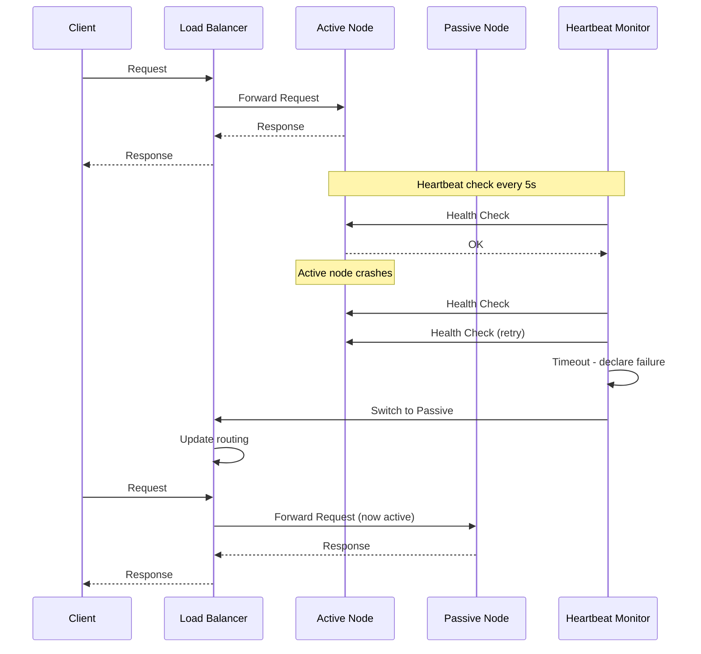
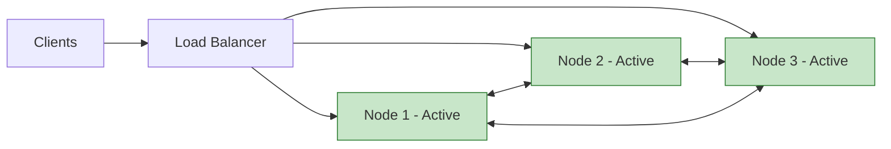
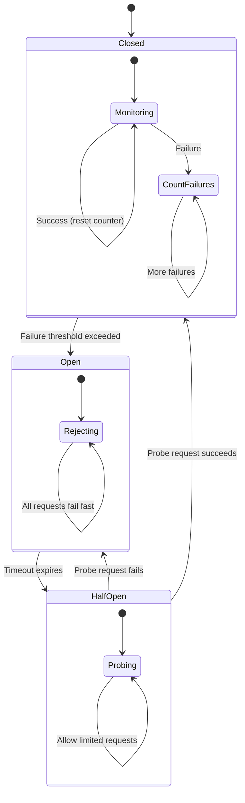
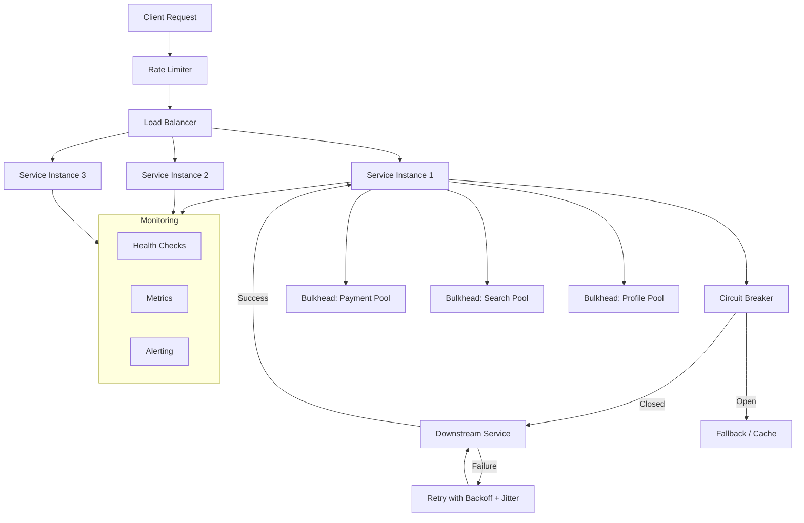

# Reliability and Fault Tolerance

## Introduction

Building systems that survive failure is not optional at scale -- it is the core engineering challenge. Every component in a distributed system will eventually fail: disks corrupt, networks partition, processes crash, and entire data centers lose power. The difference between a well-architected system and a fragile one is not whether failures occur, but how the system responds when they do.

This article covers the foundational concepts, patterns, and strategies that keep large-scale systems running despite the inevitable chaos of the real world. These topics appear constantly in system design interviews, and understanding them deeply will distinguish you from candidates who only know the surface-level definitions.

> [!NOTE]
> Reliability and availability are often used interchangeably in casual conversation, but they mean different things. This article will clarify the distinction and explain why both matter.

---

## Scalability

Scalability is the ability of a system to handle increased load by adding resources. Before diving into fault tolerance, we must understand scalability because it determines the architecture within which failures occur.

### Vertical Scaling (Scale Up)

Vertical scaling means adding more power to an existing machine: more CPU cores, more RAM, faster disks, better network cards. You keep a single machine and make it bigger.

**Advantages:**
- Simpler architecture -- no distributed coordination needed
- No data partitioning or replication complexity
- Lower operational overhead
- Transactions and consistency are straightforward

**Disadvantages:**
- Hardware limits exist -- you cannot buy a machine with 10 TB of RAM forever
- Single point of failure -- one machine means one failure domain
- Expensive at the top end -- high-end hardware costs disproportionately more
- Downtime during upgrades -- swapping hardware often requires shutdown

### Horizontal Scaling (Scale Out)

Horizontal scaling means adding more machines to a pool. Instead of one powerful server, you run many commodity servers working together.

**Advantages:**
- Near-infinite theoretical capacity
- Better fault tolerance -- losing one of 100 machines is manageable
- Cost-effective -- commodity hardware is cheap
- Can scale incrementally

**Disadvantages:**
- Distributed systems complexity (consensus, partitioning, replication)
- Network becomes a bottleneck and failure source
- Data consistency is harder to maintain
- Operational overhead increases significantly

### When to Use Each

| Factor | Vertical | Horizontal |
|--------|----------|------------|
| Current load | Low to moderate | High or rapidly growing |
| Data model | Relational, heavily joined | Partitionable, independent |
| Team size | Small team, limited ops | Dedicated infrastructure team |
| Budget | Moderate, predictable | Variable, scales with usage |
| Consistency needs | Strong ACID required | Eventual consistency acceptable |
| Typical examples | Traditional RDBMS, legacy apps | Web frontends, microservices, caches |

> [!TIP]
> In interviews, the best answer is usually "start vertical, go horizontal when you hit limits." This shows pragmatism. Many candidates jump straight to horizontal scaling for a system that serves 1000 users, which is over-engineering.

---

## Availability

Availability measures the proportion of time a system is operational and accessible. It is expressed as a percentage, commonly referred to as "nines."

### The Nines Table

| Availability | Common Name | Downtime/Year | Downtime/Month | Downtime/Week |
|-------------|-------------|---------------|----------------|---------------|
| 99% | Two nines | 3.65 days | 7.31 hours | 1.68 hours |
| 99.9% | Three nines | 8.76 hours | 43.8 minutes | 10.1 minutes |
| 99.99% | Four nines | 52.6 minutes | 4.38 minutes | 1.01 minutes |
| 99.999% | Five nines | 5.26 minutes | 26.3 seconds | 6.05 seconds |
| 99.9999% | Six nines | 31.5 seconds | 2.63 seconds | 0.60 seconds |

### SLAs (Service Level Agreements)

An SLA is a contractual commitment between a service provider and its customers. It defines what level of availability the provider guarantees and what happens (usually financial credits) when that guarantee is violated.

Key points about SLAs:
- They are business documents, not just engineering targets
- Violating an SLA triggers contractual penalties
- Cloud providers typically offer 99.9% to 99.99% SLAs for individual services
- Composite SLAs for multi-service architectures are calculated by multiplying individual SLAs

**Composite SLA example:** If your system depends on three services each with 99.9% availability, the composite availability is 0.999 x 0.999 x 0.999 = 99.7%. Adding dependencies reduces overall availability unless you add redundancy.

> [!WARNING]
> A common interview mistake is quoting an SLA like "five nines" without understanding the engineering investment required. Five nines means less than 5.26 minutes of downtime per year. That includes planned maintenance, deployments, and unexpected failures. Very few systems truly achieve this.

---

## Reliability vs Availability

These two concepts are related but distinct, and interviewers love to test whether you understand the difference.

**Availability** answers: "Can the system respond to requests?"

**Reliability** answers: "Does the system respond correctly?"

A system can be highly available but unreliable. Imagine a database that responds to every query instantly but occasionally returns wrong data. It is 100% available but not reliable.

Conversely, a system can be reliable but not highly available. A batch processing system that runs once a day, produces perfect results every time, but is offline for 23 hours is reliable but has low availability.

| Property | Definition | Measurement | Example Failure |
|----------|-----------|-------------|-----------------|
| Availability | System responds to requests | Uptime percentage | Server returns HTTP 503 |
| Reliability | System responds correctly | Error rate, data correctness | Server returns wrong balance |
| Durability | Data is not lost | Data loss incidents | Disk failure loses records |

> [!IMPORTANT]
> In interviews, if asked "how would you make this system reliable?", don't just talk about uptime. Discuss data correctness, idempotency, validation, and testing. Reliability is about trust in the output, not just the uptime number.

---

## Failover Patterns

When a component fails, the system needs a strategy to redirect traffic to a healthy component. The two primary patterns are active-passive and active-active failover.

### Active-Passive Failover

In active-passive (also called master-standby), one node handles all traffic while a standby node waits idle. When the active node fails, the passive node takes over.

**How it works:**
1. The active node processes all requests
2. Data is replicated to the passive node (synchronously or asynchronously)
3. A heartbeat monitor checks the active node's health
4. On failure detection, the passive node is promoted to active
5. DNS or load balancer routing is updated

**Tradeoffs:**
- Simpler to implement than active-active
- Wastes resources -- the passive node sits idle during normal operation
- Failover is not instant -- there is a detection delay plus a promotion delay
- Risk of data loss if replication was asynchronous (last few writes may be lost)

### Active-Active Failover

In active-active, all nodes handle traffic simultaneously. If one fails, the remaining nodes absorb its load.

**How it works:**
1. All nodes serve traffic and share state
2. Load balancer distributes requests across all nodes
3. When one node fails, the load balancer removes it from the pool
4. Remaining nodes handle the redistributed load

**Tradeoffs:**
- Better resource utilization -- no idle machines
- Faster failover -- just remove the failed node from the pool
- More complex -- requires state synchronization between all active nodes
- Conflict resolution needed if nodes accept writes to the same data

| Factor | Active-Passive | Active-Active |
|--------|---------------|---------------|
| Resource utilization | Low (standby is idle) | High (all nodes work) |
| Failover speed | Slower (promotion needed) | Faster (just re-route) |
| Complexity | Lower | Higher |
| Data consistency | Easier | Harder (conflict resolution) |
| Cost efficiency | Lower | Higher |
| Best for | Databases, stateful services | Stateless web servers, CDN |

> [!TIP]
> In interviews, mention that the choice depends on whether the service is stateful or stateless. Stateless services (web servers, API gateways) naturally fit active-active. Stateful services (databases) often use active-passive because synchronizing mutable state across active nodes is hard.

---

## Eliminating Single Points of Failure

A single point of failure (SPOF) is any component whose failure brings down the entire system. Eliminating SPOFs is a fundamental principle of reliable system design.

**Common SPOFs and their solutions:**

| Component | SPOF Risk | Redundancy Strategy |
|-----------|----------|-------------------|
| Database | Single DB server | Primary-replica replication, multi-AZ |
| Load balancer | Single LB | Pair of LBs with floating IP (VRRP) |
| DNS | Single DNS provider | Multiple DNS providers, DNS failover |
| Network | Single ISP | Multi-homed networking, multiple ISPs |
| Data center | Single region | Multi-region deployment |
| Application server | Single instance | Auto-scaling group, multiple instances |
| Configuration | Single config server | Replicated config store (etcd, ZooKeeper) |

The principle is: **redundancy at every layer**. If you draw your architecture diagram and any single box, when removed, breaks the system, you have a SPOF.

> [!NOTE]
> Redundancy does not mean just having two of everything. You also need automated failure detection and traffic redirection. Two database servers with no failover mechanism is not true redundancy -- it is just two servers.

---

## Circuit Breaker Pattern

The circuit breaker pattern prevents a failing service from taking down the entire system. It is inspired by electrical circuit breakers that trip to prevent overload.

### The Three States

**Closed State (Normal Operation):**
- All requests pass through to the downstream service
- Failures are counted
- If the failure count exceeds a threshold within a time window, the breaker trips to Open

**Open State (Failing Fast):**
- All requests immediately fail without calling the downstream service
- This gives the failing service time to recover
- After a configurable timeout, the breaker moves to Half-Open

**Half-Open State (Testing Recovery):**
- A limited number of probe requests are allowed through
- If the probe succeeds, the breaker resets to Closed
- If the probe fails, the breaker returns to Open

### Implementation Considerations

- **Failure threshold:** Too low and it trips on transient errors; too high and it doesn't protect fast enough
- **Timeout duration:** How long to keep the circuit open before probing (typically 30-60 seconds)
- **Probe count:** How many test requests to send in half-open state
- **What counts as failure:** HTTP 5xx? Timeouts? Distinguish between server errors and client errors (4xx should not trip the breaker)
- **Fallback behavior:** What to return when the circuit is open (cached data, default response, error message)

> [!TIP]
> When discussing the circuit breaker in interviews, always mention what the fallback behavior is. Simply saying "requests fail fast" is incomplete. Good systems degrade gracefully -- they might return cached data, a default response, or a reduced feature set.

---

## Bulkhead Pattern

The bulkhead pattern isolates components so that a failure in one does not cascade to others. The name comes from the watertight compartments in ship hulls -- if one compartment floods, the others stay dry and the ship stays afloat.

### How It Works

Instead of sharing a single resource pool (thread pool, connection pool, memory) across all features, you partition resources into isolated pools.

**Example without bulkheads:**
- Your service has one thread pool of 200 threads
- The payment service downstream goes slow, causing all 200 threads to block waiting for payment responses
- Now the user profile endpoint, search endpoint, and everything else also fails because there are no threads left
- One slow dependency took down the entire service

**Example with bulkheads:**
- You allocate separate thread pools: 50 for payments, 50 for user profiles, 50 for search, 50 for everything else
- The payment service goes slow, exhausting its 50 threads
- User profiles, search, and other features continue operating normally on their own pools
- The failure is contained to the payment feature

### Bulkhead Strategies

| Strategy | Description | Granularity |
|----------|-------------|-------------|
| Thread pool isolation | Separate thread pools per dependency | Per downstream service |
| Connection pool isolation | Separate DB connection pools per feature | Per feature or tenant |
| Process isolation | Separate processes or containers | Per service |
| Infrastructure isolation | Separate clusters or regions | Per business unit |

> [!NOTE]
> Bulkheads trade efficiency for resilience. Dedicated pools mean some resources sit idle while others are saturated. This is intentional -- the idle resources are your insurance policy against cascading failures.

---

## Retry with Exponential Backoff and Jitter

Retries are essential for handling transient failures (temporary network glitches, brief service restarts), but naive retry strategies can make failures worse.

### The Problem with Immediate Retries

If a service goes down and 10,000 clients all retry immediately, the service faces a thundering herd of 10,000 simultaneous requests the instant it comes back up. This can knock it right back down, creating a vicious cycle.

### Exponential Backoff

Instead of retrying immediately, each retry waits longer than the previous one:

- Attempt 1: wait 1 second
- Attempt 2: wait 2 seconds
- Attempt 3: wait 4 seconds
- Attempt 4: wait 8 seconds
- Attempt 5: wait 16 seconds (with a max cap)

The formula is: `wait_time = min(base * 2^attempt, max_wait)`

### Why Jitter Is Essential

Exponential backoff alone is not enough. If 10,000 clients all start at the same time, they all retry at 1s, then 2s, then 4s -- they remain synchronized in a thundering herd, just at longer intervals.

**Jitter** adds randomness to the wait time, spreading retries out over time:

- **Full jitter:** `wait_time = random(0, base * 2^attempt)`
- **Equal jitter:** `wait_time = (base * 2^attempt) / 2 + random(0, (base * 2^attempt) / 2)`
- **Decorrelated jitter:** `wait_time = min(max_wait, random(base, previous_wait * 3))`

Full jitter provides the best distribution of retry times and is the recommended approach per AWS's analysis.

### Retry Budget

Beyond individual retry policies, consider a global retry budget. If more than (say) 10% of requests are already retries, stop retrying -- the downstream service is clearly struggling, and more retries will only make it worse. This is where retries meet the circuit breaker pattern.

> [!WARNING]
> Never retry non-idempotent operations without careful thought. Retrying a "charge credit card" request could double-charge the customer. This is why idempotency (next section) is a prerequisite for safe retries.

---

## Idempotency

An operation is idempotent if performing it multiple times produces the same result as performing it once. Idempotency is critical for building reliable systems because retries, network duplicates, and at-least-once delivery guarantees all mean that operations may be executed more than once.

### Examples

| Operation | Idempotent? | Why |
|-----------|------------|-----|
| GET /user/123 | Yes | Reading data doesn't change state |
| DELETE /user/123 | Yes | Deleting an already-deleted user is a no-op |
| PUT /user/123 {name: "Alice"} | Yes | Setting a value to the same thing is a no-op |
| POST /orders {item: "book"} | No | Each call creates a new order |
| POST /transfer {amount: 100} | No | Each call transfers money again |

### Idempotency Keys

For operations that are not naturally idempotent (like creating orders or transferring money), use an **idempotency key**:

1. The client generates a unique key (UUID) for each logical operation
2. The client includes this key in the request header (e.g., `Idempotency-Key: abc-123`)
3. The server checks if it has already processed a request with this key
4. If yes, it returns the stored result without re-executing the operation
5. If no, it executes the operation, stores the result keyed by the idempotency key, and returns it

**Implementation details:**
- Store idempotency keys with an expiration (e.g., 24 hours)
- The key-to-result mapping must be stored atomically with the operation itself
- Use database transactions or a compare-and-swap mechanism to prevent race conditions with concurrent requests using the same key

> [!IMPORTANT]
> Idempotency is not just a nice-to-have -- it is a requirement for any system that uses retries, message queues with at-least-once delivery, or webhook callbacks. Without it, you will eventually process duplicate operations with real consequences (double charges, duplicate messages, etc.).

---

## Rate Limiting

Rate limiting controls how many requests a client can make in a given time window. While rate limiting is primarily an API design topic, it plays a role in fault tolerance by protecting services from being overwhelmed.

### Token Bucket Algorithm

The token bucket is the most common rate limiting algorithm:

1. A bucket holds tokens, up to a maximum capacity
2. Tokens are added at a fixed rate (e.g., 10 tokens per second)
3. Each request consumes one token
4. If no tokens are available, the request is rejected (HTTP 429)

**Advantages:** Allows bursts up to the bucket size while enforcing a long-term average rate.

### Sliding Window Algorithm

Maintains a count of requests within a rolling time window:

1. Track timestamps of all requests in the current window
2. For each new request, count how many requests fall within the last N seconds
3. If the count exceeds the limit, reject the request

**Advantages:** Smoother rate enforcement than fixed windows, which can allow 2x the rate at window boundaries.

| Algorithm | Burst Handling | Memory | Precision |
|-----------|---------------|--------|-----------|
| Token bucket | Allows controlled bursts | Low (just a counter) | Good |
| Fixed window | Allows 2x burst at boundary | Low | Moderate |
| Sliding window log | No bursts | High (stores timestamps) | Exact |
| Sliding window counter | Minimal bursts | Low | Approximate |

> [!TIP]
> In interviews, if you mention rate limiting in a fault tolerance context, connect it to the concept of backpressure. Rate limiting is one form of backpressure -- signaling to clients that they need to slow down to prevent system overload.

---

## Disaster Recovery

Disaster recovery (DR) planning ensures that a system can recover from catastrophic events: data center fires, regional outages, widespread hardware failures, or even human error (accidentally deleting a production database).

### RPO and RTO

These two metrics define your DR requirements:

**RPO (Recovery Point Objective):** How much data loss is acceptable. An RPO of 1 hour means you can tolerate losing the last hour of data. This determines your backup frequency.

**RTO (Recovery Time Objective):** How quickly the system must be restored. An RTO of 15 minutes means the system must be back online within 15 minutes of a disaster. This determines your failover strategy.

| RPO | Implication | Strategy |
|-----|------------|----------|
| 0 (zero data loss) | Synchronous replication required | Active-active or synchronous replicas |
| Minutes | Near-real-time replication | Asynchronous replication with short lag |
| Hours | Periodic backups sufficient | Hourly snapshots or WAL shipping |
| Days | Daily backups | Nightly full backups |

### Standby Strategies

| Strategy | Description | RTO | Cost |
|----------|-------------|-----|------|
| Hot standby | Fully running replica, receives live data | Seconds to minutes | High |
| Warm standby | Scaled-down replica, receives data but handles no traffic | Minutes to hours | Medium |
| Cold standby | Infrastructure provisioned but not running, data restored from backups | Hours to days | Low |

### Multi-Region Deployment

For true disaster recovery, your system must run across multiple geographic regions. This is the most expensive and complex approach but provides the highest resilience.

**Active-passive multi-region:** One region handles all traffic, another region has a warm or hot standby. On failure, DNS is updated to point to the standby region.

**Active-active multi-region:** Both regions handle traffic simultaneously. This requires solving data consistency across regions (conflict resolution, CRDTs, or region-pinned data).

> [!WARNING]
> Multi-region active-active is one of the hardest problems in distributed systems. Don't propose it casually in interviews. If you do, be prepared to discuss data consistency, conflict resolution, and cross-region latency tradeoffs.

---

## Chaos Engineering

Chaos engineering is the practice of intentionally injecting failures into a production system to discover weaknesses before they cause real outages.

### The Netflix Philosophy

Netflix pioneered chaos engineering with Chaos Monkey, a tool that randomly terminates production instances during business hours. The reasoning: if your system can't handle a single instance dying at 2 PM on a Tuesday when everyone is awake and available, it certainly can't handle it at 3 AM on a Saturday.

### Principles of Chaos Engineering

1. **Start with a hypothesis:** "If we kill one database replica, the system should failover within 30 seconds with no errors visible to users."
2. **Minimize blast radius:** Start small. Kill one instance, not an entire region.
3. **Run in production:** Testing chaos in staging doesn't validate production resilience. (But start in staging if you're new to chaos engineering.)
4. **Automate:** Chaos experiments should run continuously, not just during special events.
5. **Measure impact:** Track error rates, latency, and user impact during experiments.

### Game Days

Game days are structured chaos engineering exercises where the team deliberately triggers failure scenarios and practices the response:

- Simulate a database failover
- Disconnect a region
- Inject network latency between services
- Exhaust disk space on a critical server
- Revoke permissions on a key credential

The goal is to build muscle memory for incident response and discover gaps in monitoring, alerting, and runbooks.

> [!TIP]
> Mentioning chaos engineering in interviews shows maturity. It signals that you think about reliability proactively, not just reactively. A good line: "I'd want to validate our failover mechanisms with chaos experiments before we need them in a real outage."

---

## Graceful Degradation

Graceful degradation means that when part of the system fails, the system continues to operate with reduced functionality rather than failing completely.

### Strategies

**Serve partial results:** If one of three recommendation engines is down, return recommendations from the two that are working. A 66% quality recommendation feed is better than showing nothing.

**Feature flags for degradation:** Use feature flags to disable non-essential features during incidents. If the review service is overwhelmed, disable the reviews section of the product page while keeping the purchase flow fully operational.

**Static fallbacks:** If the personalization service is down, show a generic "popular items" list instead of personalized recommendations.

**Queue and process later:** If a non-critical downstream service (analytics, notifications) is down, queue the requests and process them when the service recovers.

**Read-only mode:** If the write path is failing, switch to read-only mode so users can still browse and search even if they can't make changes.

### Priority Shedding

Under extreme load, prioritize critical operations over non-critical ones:

| Priority | Operations | Action Under Stress |
|----------|-----------|-------------------|
| Critical | Payments, authentication | Always process |
| High | Core product features | Process if capacity available |
| Medium | Analytics, logging | Queue for later |
| Low | Background jobs, emails | Drop or delay significantly |

> [!NOTE]
> Graceful degradation requires advance planning. You need to identify which features are essential and which can be dropped, implement the circuit breakers and feature flags to control degradation, and test that degraded mode actually works. You can't improvise graceful degradation during an incident.

---

## Putting It All Together

These patterns don't exist in isolation. A well-designed system layers them together:

**Request lifecycle with fault tolerance:**
1. Request arrives, passes rate limiting
2. Load balancer routes to a healthy instance (active-active failover)
3. Service checks circuit breaker state for downstream dependency
4. If circuit is closed, call downstream through a bulkhead-isolated thread pool
5. If the call fails, retry with exponential backoff and jitter
6. Include an idempotency key so retries are safe
7. If failures exceed threshold, circuit breaker opens
8. While open, serve fallback response (graceful degradation)
9. Health checks and metrics feed into alerting for operator awareness

---

## Interview Cheat Sheet

| Concept | One-Liner | When to Mention |
|---------|-----------|-----------------|
| Vertical scaling | Bigger machine, simpler but limited | Early in capacity discussion |
| Horizontal scaling | More machines, complex but unlimited | When load exceeds single machine |
| Availability (nines) | 99.99% = 52 min downtime/year | When discussing SLAs |
| Reliability vs availability | Reliable = correct, available = responsive | When asked about system qualities |
| Active-passive failover | Standby takes over on failure | Stateful services (databases) |
| Active-active failover | All nodes serve traffic | Stateless services (web servers) |
| SPOF elimination | Redundancy at every layer | Architecture review |
| Circuit breaker | Stop calling a failing service | Inter-service communication |
| Bulkhead | Isolate failure domains | Thread/connection pool design |
| Exponential backoff + jitter | Spread retries over time | Any retry discussion |
| Idempotency | Same operation, same result | Payment, order creation, any mutation |
| Rate limiting | Control request volume | API design, overload protection |
| RPO / RTO | Data loss tolerance / recovery speed | Disaster recovery planning |
| Chaos engineering | Break things on purpose | Showing reliability maturity |
| Graceful degradation | Partial service beats no service | Failure handling strategy |

**Key interview phrases:**
- "We need redundancy at every layer to eliminate single points of failure."
- "The circuit breaker prevents cascading failures by failing fast."
- "Retries must use exponential backoff with jitter to avoid thundering herd."
- "Every mutating operation should be idempotent to safely support retries."
- "Our RPO determines backup frequency; our RTO determines failover strategy."
- "I'd validate our failover with chaos engineering before we need it in production."
