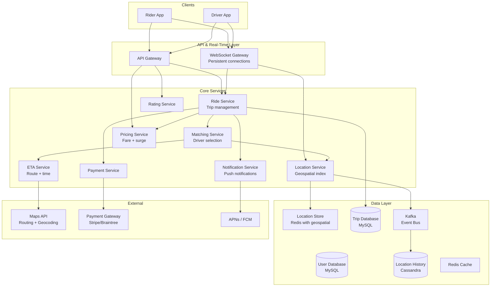
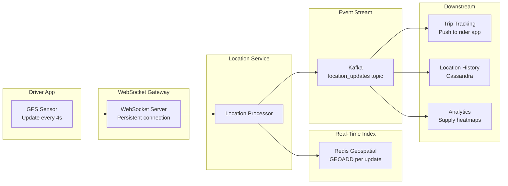
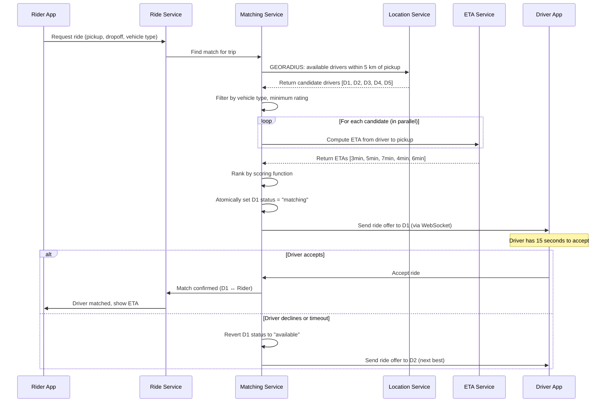
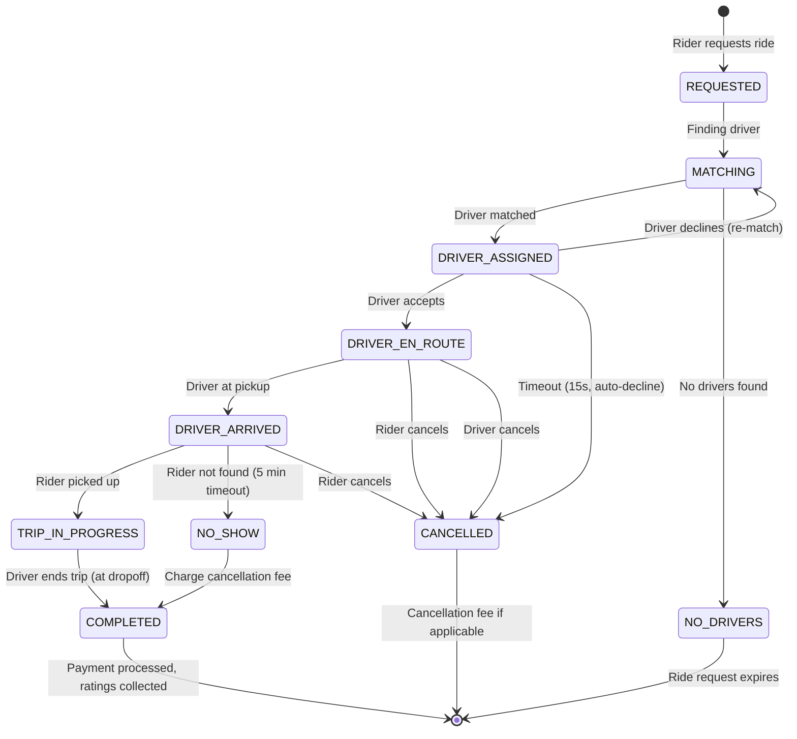
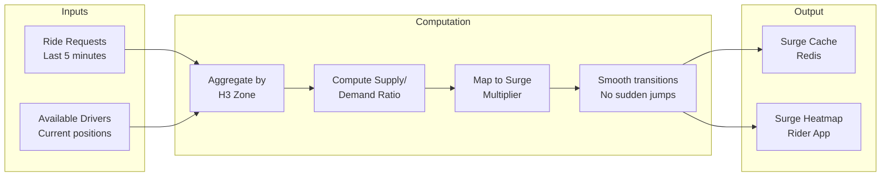
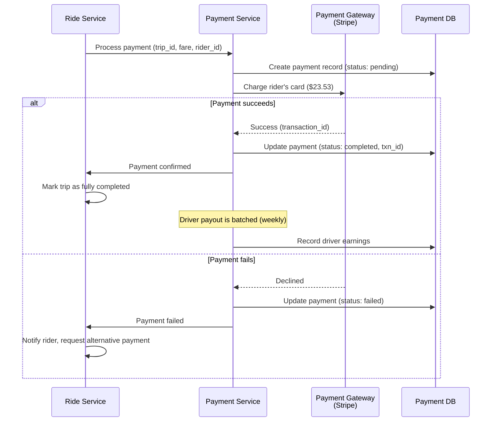
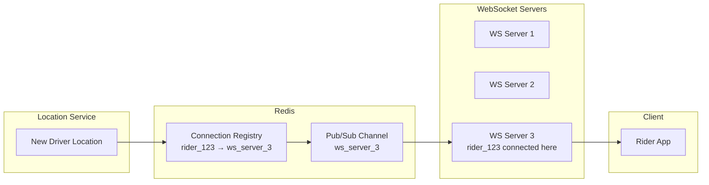

# System Design Interview: Ride-Sharing Service
### Uber / Lyft Scale

> [!NOTE]
> **Staff Engineer Interview Preparation Guide** — High Level Design Round

---

## Table of Contents

1. [Problem Clarification & Requirements](#1-problem-clarification--requirements)
2. [Capacity Estimation & Scale](#2-capacity-estimation--scale)
3. [High-Level Architecture](#3-high-level-architecture)
4. [Core Components Deep Dive](#4-core-components-deep-dive)
5. [Location Tracking & Geospatial Indexing](#5-location-tracking--geospatial-indexing)
6. [Driver Matching Algorithm](#6-driver-matching-algorithm)
7. [ETA Computation](#7-eta-computation)
8. [Trip Lifecycle & State Machine](#8-trip-lifecycle--state-machine)
9. [Surge Pricing](#9-surge-pricing)
10. [Data Models & Storage](#10-data-models--storage)
11. [Payment Processing](#11-payment-processing)
12. [Real-Time Communication](#12-real-time-communication)
13. [Scalability Strategies](#13-scalability-strategies)
14. [Design Trade-offs & Justifications](#14-design-trade-offs--justifications)
15. [Interview Cheat Sheet](#15-interview-cheat-sheet)

---

## 1. Problem Clarification & Requirements

> [!TIP]
> **Interview Tip:** Ride-sharing is a real-time, location-intensive system. The core challenge is matching riders to nearby drivers within seconds while handling millions of continuously moving entities. Lead by framing this as a real-time geospatial matching problem, not just a CRUD application.

### Questions to Ask the Interviewer

| Category | Question | Why It Matters |
|----------|----------|----------------|
| **Scale** | How many rides per day? Which cities? | Determines geospatial indexing strategy |
| **Matching** | Simple nearest driver or multi-factor? | Algorithm complexity |
| **Vehicle types** | Single type or multiple (economy, premium, XL)? | Affects matching and pricing |
| **Real-time** | How frequently do drivers report location? | Write throughput for location service |
| **Payment** | In-app payment only, or cash too? | Payment flow complexity |
| **Surge** | Dynamic pricing based on demand? | Pricing engine complexity |
| **Pooling** | Shared rides (UberPool/Lyft Shared)? | Significantly more complex matching |
| **Global** | Single city, single country, or global? | Multi-region architecture |

---

### Functional Requirements (Agreed Upon)

- Riders can request a ride by specifying pickup and dropoff locations
- System matches the rider with a nearby available driver within 10 seconds
- Real-time tracking of driver location during the trip
- Fare calculation based on distance, time, and demand (surge pricing)
- In-app payment processing at trip completion
- Rating system for both riders and drivers
- Trip history for riders and drivers
- Driver can go online/offline to indicate availability

### Non-Functional Requirements

- **Latency:** Driver matching must complete in < 10 seconds
- **Location freshness:** Driver locations must be updated every 3-5 seconds
- **Availability:** 99.99% uptime — ride requests must always be serviceable
- **Scale:** 20 million rides per day, 5 million active drivers
- **Consistency:** Trip state must be strongly consistent (a driver cannot be matched to two riders simultaneously)
- **Accuracy:** ETA estimates within 20% of actual arrival time

---

## 2. Capacity Estimation & Scale

> [!TIP]
> **Interview Tip:** The unique challenge in ride-sharing is the continuous stream of location updates. Unlike most systems where writes are triggered by user actions, every active driver sends a location update every 4 seconds, 24/7. This creates a sustained, high-throughput write pattern.

### Traffic Estimation

```
Rides per day           = 20 Million
Active drivers          = 5 Million (online at any given time during peak)
Active riders (peak)    = 2 Million concurrent

Ride request QPS:
  20M / 86,400 = ~230 ride requests/sec
  Peak (3x): ~700 requests/sec

Location update frequency:
  Each driver sends GPS every 4 seconds
  Active drivers at peak = 5 Million
  Location updates/sec = 5M / 4 = 1.25 Million updates/sec

This is the dominant write workload.
```

### Storage Estimation

```
Location update record:
  - Driver ID       = 8 bytes
  - Latitude        = 8 bytes (double)
  - Longitude       = 8 bytes (double)
  - Timestamp       = 8 bytes
  - Speed           = 4 bytes
  - Heading         = 4 bytes
  - Trip ID (if on trip) = 8 bytes
  Total             ≈ 50 bytes

Per second:  1.25M × 50 bytes = 62.5 MB/sec
Per day:     62.5 MB × 86,400 = 5.4 TB/day
Per year:    5.4 TB × 365     = ~2 PB/year

We only need recent locations for real-time matching (last 30 seconds).
Historical location data is for analytics and can be stored in cold storage.

Trip record:
  ~500 bytes per trip
  20M × 500 = 10 GB/day → trivial compared to location data
```

### Memory Estimation

```
For real-time driver matching, we need all active driver locations in memory:
  5M drivers × 50 bytes = 250 MB

This fits easily in a single server's RAM, but we shard by geography
for latency and availability reasons.
```

---

## 3. High-Level Architecture

> [!TIP]
> **Interview Tip:** Draw the architecture around three core flows: (1) Driver location updates, (2) Ride matching, (3) Trip tracking. These are the three performance-critical paths.



---

## 4. Core Components Deep Dive

### 4.1 Location Service

The Location Service is the heartbeat of the ride-sharing platform. It ingests 1.25 million GPS updates per second from drivers and maintains a real-time geospatial index for driver matching.

**Responsibilities:**
1. Receive location updates from driver apps via WebSocket
2. Update the driver's position in the geospatial index
3. Publish location updates to Kafka for downstream consumers (trip tracking, analytics, location history)
4. Serve proximity queries: "Find all available drivers within 3 km of this point"

**Why WebSocket?**
Drivers send updates every 4 seconds. Using HTTP for each update would require establishing a new TCP connection each time (or maintaining HTTP keep-alive). WebSocket provides a persistent, bidirectional connection that is ideal for high-frequency location updates. It also allows the server to push real-time information to the driver (new ride requests, route updates) without polling.

### 4.2 Ride Service

Orchestrates the entire trip lifecycle. It is the central coordinator that ties together matching, pricing, payment, and notifications.

**Key Operations:**
- `requestRide(riderId, pickup, dropoff, vehicleType)` — initiates the matching process
- `acceptRide(driverId, tripId)` — driver accepts the match
- `startTrip(tripId)` — driver confirms rider pickup
- `endTrip(tripId)` — driver confirms rider dropoff
- `cancelTrip(tripId, reason)` — rider or driver cancels

The Ride Service maintains a state machine for each trip (detailed in Section 8).

### 4.3 Matching Service

The brain of the system. When a ride request comes in, the Matching Service:
1. Queries the Location Service for nearby available drivers
2. Filters by vehicle type, rating, and availability
3. Computes ETA from each candidate driver to the pickup location
4. Ranks drivers by a scoring function (distance, ETA, rating, acceptance rate)
5. Sends the ride offer to the top-ranked driver
6. If declined or timed out (15 seconds), offers to the next driver

> [!IMPORTANT]
> The matching algorithm must prevent a driver from being matched to two riders simultaneously. This requires a distributed lock on the driver's status. When the Matching Service selects a driver, it atomically sets their status to "matching" in Redis. If the driver declines or the match times out, the status reverts to "available."

### 4.4 Pricing Service

Calculates the fare estimate before the ride and the final fare after the ride.

**Fare Components:**
- Base fare (fixed, varies by vehicle type and city)
- Per-minute rate (time spent in the vehicle)
- Per-mile/km rate (distance traveled)
- Surge multiplier (see Section 9)
- Booking fee (fixed platform fee)
- Tolls and surcharges (if applicable)
- Promotions and discounts (applied at the end)

```
fare = (base_fare + (time_minutes × per_minute_rate) + (distance_km × per_km_rate))
       × surge_multiplier + booking_fee + tolls - discounts
```

---

## 5. Location Tracking & Geospatial Indexing

> [!TIP]
> **Interview Tip:** This is the most technically deep section of the ride-sharing design. The interviewer will probe your understanding of geospatial indexing. Be ready to explain at least two approaches (geohash, quadtree) and their trade-offs.

### The Problem

We need to answer the query: "Find all available drivers within 3 km of latitude 40.7128, longitude -74.0060" — and answer it in under 10 milliseconds, while the driver positions are changing every 4 seconds.

### Approach 1: Geohash

A geohash encodes a latitude/longitude pair into a string where nearby points share a common prefix. The longer the prefix, the smaller the area.

| Geohash Length | Cell Size | Use Case |
|----------------|-----------|----------|
| 4 characters | ~39 km × 20 km | Country-level |
| 5 characters | ~5 km × 5 km | City district |
| 6 characters | ~1.2 km × 0.6 km | Neighborhood |
| 7 characters | ~150 m × 150 m | Block level |
| 8 characters | ~38 m × 19 m | Building level |

**How it works for driver matching:**
1. Each driver's location is geohashed to a 6-character precision (~1 km cells)
2. Store drivers in Redis using `GEOADD drivers {lng} {lat} {driver_id}`
3. To find nearby drivers: `GEORADIUS drivers {lng} {lat} 3 km`
4. Redis's built-in geo commands use a sorted set with geohash-encoded scores, making radius queries efficient

**Edge Case: Geohash Boundary Problem**
Two points that are physically close but on opposite sides of a geohash cell boundary will have completely different geohash prefixes. Solution: when searching, also search the 8 neighboring geohash cells.

```
Target cell: dr5ru7
Neighbors:   dr5ru6, dr5ru8, dr5ru4, dr5rud,
             dr5ru5, dr5ru9, dr5rug, dr5ruf

Search all 9 cells and filter by actual distance.
```

### Approach 2: Quadtree

A quadtree recursively subdivides 2D space into four quadrants. Each leaf node contains a bounded number of drivers (e.g., max 100). When a leaf exceeds this limit, it splits into four children.

**Advantages over geohash:**
- Dynamically adapts to driver density (dense areas have smaller cells, sparse areas have larger cells)
- No boundary problem — the tree structure naturally handles proximity across boundaries
- Efficient range queries without scanning neighbors

**Disadvantages:**
- More complex to implement and maintain
- In-memory data structure — harder to distribute across nodes
- Updates require tree rebalancing

### Approach 3: S2 Cells (Google's Approach)

S2 maps the surface of a sphere onto a cube face and then applies a Hilbert curve to create a 1D ordering of cells. This is what Google uses for Maps and Uber uses for H3 (a similar hexagonal system).

**Advantages:**
- No distortion at poles or cell boundaries (unlike geohash)
- Hierarchical: cells can be at any level from continent to centimeter
- Excellent for covering arbitrary regions (e.g., surge zones)

**For the interview:** Mentioning S2 or H3 shows familiarity with production systems. However, geohash with Redis is simpler to explain and is a perfectly valid answer.

### Recommended Implementation

> [!IMPORTANT]
> Use **Redis GEOADD/GEORADIUS** for the real-time driver index. Redis's geospatial commands are built on sorted sets with geohash encoding and provide O(N+log(M)) radius queries where N is the number of results and M is the total number of entries. At 5M drivers, this performs well.

```
Driver goes online:
  GEOADD drivers:{city_id} -74.0060 40.7128 driver_123
  SADD available_drivers:{city_id} driver_123

Driver location update (every 4 seconds):
  GEOADD drivers:{city_id} -74.0055 40.7130 driver_123

Find drivers within 3 km:
  GEORADIUS drivers:{city_id} -74.0060 40.7128 3 km WITHCOORD WITHDIST COUNT 20 ASC
  → Returns up to 20 drivers, sorted by distance, with coordinates

Driver goes offline or gets matched:
  SREM available_drivers:{city_id} driver_123
```

### Location Update Pipeline



---

## 6. Driver Matching Algorithm

> [!TIP]
> **Interview Tip:** Matching is not simply "find the closest driver." Production systems consider ETA (which accounts for traffic and road topology, not just straight-line distance), driver rating, acceptance rate, and even the direction the driver is heading. Demonstrating awareness of these factors shows senior-level thinking.

### Matching Flow



### Scoring Function

```
score(driver) = w1 × normalize(ETA)
              + w2 × normalize(distance)
              + w3 × normalize(rating)
              + w4 × normalize(acceptance_rate)
              + w5 × direction_bonus

Where:
  ETA             = estimated time for driver to reach pickup (from ETA service)
  distance        = straight-line distance (fast to compute, for initial filtering)
  rating          = driver's average rating (higher is better)
  acceptance_rate = percentage of ride offers the driver accepts (higher is better)
  direction_bonus = +1 if driver is heading toward the pickup location

Weights (example):
  w1 = 0.4 (ETA is most important — riders care about wait time)
  w2 = 0.1 (distance is a proxy for ETA, less weight when ETA is available)
  w3 = 0.2 (rider satisfaction)
  w4 = 0.2 (operational efficiency — high-acceptance drivers reduce matching time)
  w5 = 0.1 (fuel efficiency, reduces empty miles)

Lower score = better match. Select the driver with the lowest score.
```

### Handling No Available Drivers

If no drivers are found within the initial radius (5 km):
1. Expand the search radius to 10 km
2. If still no drivers, show the rider a "no drivers available" message with estimated wait time
3. Optionally, notify nearby drivers who are about to complete a trip (the rider may wait 2-3 minutes)

### Preventing Double-Matching

A critical correctness requirement: a driver must never be matched to two riders simultaneously.

**Solution: Redis atomic operations**

```
-- Lua script executed atomically in Redis:
local status = redis.call('GET', 'driver_status:' .. driver_id)
if status == 'available' then
    redis.call('SET', 'driver_status:' .. driver_id, 'matching')
    redis.call('EXPIRE', 'driver_status:' .. driver_id, 20)  -- 20s timeout
    return 1  -- success
else
    return 0  -- driver already matched or unavailable
end
```

This Lua script runs atomically within Redis, preventing race conditions where two matching requests try to claim the same driver simultaneously.

> [!WARNING]
> Without this atomic check-and-set, two concurrent ride requests could both select the same top-ranked driver, leading to a situation where one rider is told they have a match but the driver never arrives. This is one of the most critical correctness guarantees in the system.

---

## 7. ETA Computation

> [!TIP]
> **Interview Tip:** ETA computation is a rich topic that can fill an entire interview by itself. Cover the basics (graph routing) and mention that production systems use ML-based predictions, but do not go too deep unless the interviewer asks.

### Routing Basics

The road network is modeled as a weighted directed graph:
- **Nodes:** Intersections
- **Edges:** Road segments
- **Weights:** Travel time (not distance — a 1 km highway is faster than a 1 km city street)

**Dijkstra's Algorithm:** Classic shortest-path algorithm. Too slow for real-time queries on a graph with hundreds of millions of nodes (the entire road network of a country).

**A\* Algorithm:** Heuristic-guided Dijkstra. Faster but still too slow for continental-scale graphs.

**Contraction Hierarchies (CH):** Pre-process the graph by adding shortcut edges that bypass unimportant nodes. Queries then run on a much smaller graph. This is what most production routing engines use. Query time: ~1 millisecond for continental-scale graphs.

### ETA Components

```
ETA = route_travel_time + pickup_time + buffer

Where:
  route_travel_time = time to travel from driver's current location to pickup
                      (computed by routing engine with real-time traffic)
  pickup_time       = time for the rider to walk to the pickup point and get in (~2 min avg)
  buffer            = uncertainty factor based on time of day, weather, events
```

### Real-Time Traffic Integration

Static routing (using historical average speeds) gives poor ETAs during rush hour or incidents. Real-time traffic data improves accuracy:

1. **Probe data:** The drivers themselves are traffic probes. Aggregate speed data from driver location updates on each road segment.
2. **Traffic APIs:** Google Maps, HERE, or TomTom provide real-time traffic data.
3. **Edge weight updates:** Periodically (every 1-5 minutes) update edge weights in the routing graph based on current traffic speeds.

### ML-Based ETA Prediction

At Uber's scale, the ETA model uses machine learning trained on historical trip data:

**Features:**
- Route-based travel time (from routing engine)
- Time of day, day of week
- Weather conditions
- Special events (concerts, sports games)
- Historical trip times for similar origin-destination pairs
- Current traffic conditions

**Model:** A gradient-boosted decision tree or neural network that takes these features and outputs a predicted travel time. The model is retrained weekly and serves predictions in <5 milliseconds.

---

## 8. Trip Lifecycle & State Machine

> [!TIP]
> **Interview Tip:** Drawing the trip state machine on the whiteboard is an effective way to show you have thought through all the edge cases (cancellations, timeouts, driver no-shows).

### Trip States



### State Transition Rules

| From | To | Trigger | Side Effects |
|------|----|---------|-------------|
| REQUESTED | MATCHING | System auto-transition | Query Location Service |
| MATCHING | DRIVER_ASSIGNED | Driver found | Reserve driver (atomic lock) |
| MATCHING | NO_DRIVERS | Timeout (60s) or no candidates | Notify rider |
| DRIVER_ASSIGNED | DRIVER_EN_ROUTE | Driver taps "Accept" | Notify rider, show ETA |
| DRIVER_ASSIGNED | MATCHING | Driver declines | Release driver lock, try next |
| DRIVER_EN_ROUTE | DRIVER_ARRIVED | Driver within 50m of pickup | Notify rider, start wait timer |
| DRIVER_ARRIVED | TRIP_IN_PROGRESS | Driver taps "Start Trip" | Begin metering (time + distance) |
| DRIVER_ARRIVED | NO_SHOW | 5 min wait timer expires | Charge rider cancellation fee |
| TRIP_IN_PROGRESS | COMPLETED | Driver taps "End Trip" | Calculate fare, process payment |
| Any active state | CANCELLED | Rider or driver cancels | Release driver, cancellation fee rules |

### Strong Consistency for Trip State

Trip state transitions must be strongly consistent. We cannot have a situation where:
- The rider's app shows "driver en route" but the driver's app shows "waiting for acceptance"
- Two services read the same trip in different states and take conflicting actions

**Implementation:**
- Trip state is stored in MySQL with row-level locking
- State transitions use optimistic concurrency control (version number): `UPDATE trips SET status = 'IN_PROGRESS', version = version + 1 WHERE trip_id = ? AND status = 'DRIVER_ARRIVED' AND version = ?`
- If the update affects 0 rows, the transition was invalid (race condition) and is rejected

> [!NOTE]
> Using a state machine with explicit transitions eliminates an entire class of bugs. Every state change must go through a defined transition. Invalid transitions (e.g., jumping from REQUESTED directly to COMPLETED) are rejected by the system, even if a client sends a malformed request.

---

## 9. Surge Pricing

> [!TIP]
> **Interview Tip:** Surge pricing is controversial but technically interesting. Focus on the mechanism (supply-demand ratio by geographic zone) rather than the ethics. The interviewer wants to see that you can model supply and demand in real-time.

### How Surge Works

Surge pricing increases fares when rider demand exceeds driver supply in a geographic area. The goal is twofold:
1. Incentivize more drivers to enter the high-demand area (increase supply)
2. Discourage price-sensitive riders from requesting rides (decrease demand)

### Supply-Demand Calculation

```
For each surge zone (geofenced area, ~2 km × 2 km):

  supply = number of available drivers in the zone
  demand = number of ride requests in the zone in the last 5 minutes

  supply_demand_ratio = supply / demand

  If supply_demand_ratio > 1.0: surplus of drivers, no surge
  If supply_demand_ratio < 1.0: shortage of drivers, apply surge

Surge multiplier mapping (example):
  ratio >= 1.0  → surge = 1.0x (no surge)
  ratio 0.8-1.0 → surge = 1.2x
  ratio 0.6-0.8 → surge = 1.5x
  ratio 0.4-0.6 → surge = 2.0x
  ratio 0.2-0.4 → surge = 2.5x
  ratio < 0.2   → surge = 3.0x (cap)
```

### Surge Zone Management

Cities are divided into hexagonal zones (using H3 or similar). Each zone independently calculates its surge multiplier.

**Why hexagons?**
- Unlike squares, hexagonal grids have uniform distance from center to all neighbors
- No ambiguity about which zone a point belongs to (no corner effects)
- Uber uses H3 (Hexagonal Hierarchical Spatial Index) for exactly this purpose

**Surge Computation Pipeline:**



### Surge Smoothing

Abrupt surge changes create a poor user experience (the fare jumps 2x while the rider is looking at the screen). We apply temporal smoothing:

- Surge multiplier changes by at most 0.1x per minute
- When surge is increasing, the multiplier ramps up gradually
- When surge is decreasing, the multiplier ramps down gradually
- This prevents "whiplash" where surge oscillates rapidly

### Surge Transparency

The rider is shown the surge multiplier before confirming the ride request. They must explicitly acknowledge the higher fare. If they choose to wait, the app shows the current surge level on a map so they can see when it subsides.

---

## 10. Data Models & Storage

> [!TIP]
> **Interview Tip:** The key insight for ride-sharing data models is that different data has radically different access patterns. Trip data needs strong consistency. Location data needs high write throughput. Analytics needs time-series queries. Use a different database for each.

### Core Data Models

**Rider Table (MySQL)**

| Column | Type | Description |
|--------|------|-------------|
| rider_id | BIGINT PK | Unique rider ID |
| name | VARCHAR(100) | Full name |
| email | VARCHAR(255) | Email address |
| phone | VARCHAR(20) | Phone number |
| rating | DECIMAL(2,1) | Average rating (e.g., 4.8) |
| total_rides | INT | Total completed rides |
| payment_method_id | VARCHAR(64) | Default payment method |
| created_at | TIMESTAMP | Account creation |

**Driver Table (MySQL)**

| Column | Type | Description |
|--------|------|-------------|
| driver_id | BIGINT PK | Unique driver ID |
| name | VARCHAR(100) | Full name |
| email | VARCHAR(255) | Email address |
| phone | VARCHAR(20) | Phone number |
| rating | DECIMAL(2,1) | Average rating |
| total_rides | INT | Total completed rides |
| vehicle_type | ENUM | economy, premium, xl, black |
| vehicle_make | VARCHAR(50) | e.g., "Toyota" |
| vehicle_model | VARCHAR(50) | e.g., "Camry" |
| license_plate | VARCHAR(15) | License plate number |
| is_online | BOOLEAN | Currently accepting rides |
| status | ENUM | available, matching, on_trip, offline |
| current_trip_id | BIGINT | FK to current trip (if on trip) |
| city_id | INT | Operating city |
| created_at | TIMESTAMP | Account creation |

**Trip Table (MySQL, sharded by city_id)**

| Column | Type | Description |
|--------|------|-------------|
| trip_id | BIGINT PK | Unique trip ID |
| rider_id | BIGINT | FK to Rider |
| driver_id | BIGINT | FK to Driver |
| city_id | INT | City where the trip occurs |
| status | ENUM | requested, matching, driver_assigned, en_route, arrived, in_progress, completed, cancelled |
| vehicle_type | ENUM | Requested vehicle type |
| pickup_lat | DOUBLE | Pickup latitude |
| pickup_lng | DOUBLE | Pickup longitude |
| pickup_address | VARCHAR(255) | Human-readable pickup address |
| dropoff_lat | DOUBLE | Dropoff latitude |
| dropoff_lng | DOUBLE | Dropoff longitude |
| dropoff_address | VARCHAR(255) | Human-readable dropoff address |
| requested_at | TIMESTAMP | When the rider requested |
| matched_at | TIMESTAMP | When a driver was matched |
| pickup_at | TIMESTAMP | When the rider was picked up |
| dropoff_at | TIMESTAMP | When the rider was dropped off |
| distance_km | DECIMAL(6,2) | Actual trip distance |
| duration_minutes | DECIMAL(5,1) | Actual trip duration |
| fare_amount | DECIMAL(8,2) | Total fare |
| surge_multiplier | DECIMAL(3,1) | Surge at time of request |
| rider_rating | TINYINT | Rating rider gave driver (1-5) |
| driver_rating | TINYINT | Rating driver gave rider (1-5) |
| cancellation_reason | VARCHAR(255) | If cancelled, why |
| version | INT | Optimistic concurrency version |

**Location Update Table (Cassandra)**

| Column | Type | Description |
|--------|------|-------------|
| driver_id | BIGINT | Partition key |
| timestamp | TIMESTAMP | Clustering key (DESC) |
| latitude | DOUBLE | GPS latitude |
| longitude | DOUBLE | GPS longitude |
| speed_kmh | FLOAT | Current speed |
| heading | FLOAT | Compass heading |
| trip_id | BIGINT | Associated trip (if on trip) |

### Database Choice Summary

| Data | Storage | Reasoning |
|------|---------|-----------|
| Riders, Drivers | MySQL | Structured, moderate volume, ACID needed |
| Trips | MySQL (sharded by city_id) | Strong consistency required for state machine |
| Real-time locations | Redis (GEOADD) | Sub-millisecond geospatial queries |
| Location history | Cassandra | 1.25M writes/sec, append-only, time-series |
| Surge cache | Redis | Fast reads, updated every 30 seconds |
| Payment records | MySQL | ACID compliance for financial data |
| Analytics | ClickHouse | Aggregation queries over trip and location data |

> [!WARNING]
> Do not store trip data in a NoSQL database. Trip state transitions require ACID properties — specifically, atomic compare-and-swap on the status field. A driver being double-matched due to an eventual consistency window is a critical bug with real-world consequences (two riders waiting for the same driver).

---

## 11. Payment Processing

### Fare Calculation

When a trip completes, the fare is calculated based on actual trip data:

```
Final fare calculation:
  base_fare = city_base_fares[city_id][vehicle_type]   // e.g., $2.50
  time_fare = trip.duration_minutes × per_minute_rate   // e.g., 15 min × $0.35 = $5.25
  distance_fare = trip.distance_km × per_km_rate        // e.g., 8 km × $1.20 = $9.60
  subtotal = base_fare + time_fare + distance_fare      // $17.35
  surged = subtotal × trip.surge_multiplier             // $17.35 × 1.5 = $26.03
  + booking_fee                                         // + $2.50
  + tolls                                               // + $0.00
  - promotions                                          // - $5.00
  = final_fare                                          // = $23.53
```

### Payment Flow



### Pre-Authorization

Before confirming the ride, we place a hold (pre-authorization) on the rider's card for the estimated fare + 20% buffer. This ensures the rider can pay before the driver starts driving. The pre-auth is released after the actual charge is processed.

### Driver Payouts

Drivers are not paid per-trip in real-time. Instead:
- Each completed trip credits the driver's earnings balance
- Payouts are processed weekly (or on-demand for eligible drivers)
- The platform takes a commission (typically 20-25%)
- Payouts go via ACH transfer, direct deposit, or instant payment (Visa Direct / Mastercard Send)

### Split Payments

Some rides allow splitting the fare between multiple riders:
1. Rider A requests a split with Rider B
2. Rider B approves the split in their app
3. Each rider's card is pre-authorized for their share
4. At trip completion, each card is charged proportionally

---

## 12. Real-Time Communication

### WebSocket Architecture

Both rider and driver apps maintain persistent WebSocket connections to the server. This enables:

**Server → Driver:**
- New ride offers (match notifications)
- Route updates during trips
- Surge notifications when in a surge zone
- System messages (policy updates, promotions)

**Server → Rider:**
- Driver location updates during en-route and trip (every 2 seconds)
- ETA updates
- Trip status changes (driver assigned, driver arrived, trip started, trip completed)
- Fare update at trip completion

**Driver → Server:**
- GPS location updates (every 4 seconds)
- Trip status changes (accept, start, end, cancel)
- Availability status (online/offline)

### Connection Management

With 5 million active drivers and potentially 10 million active riders, we have up to 15 million concurrent WebSocket connections.

**Scaling WebSocket Servers:**
- Each WebSocket server handles ~100K concurrent connections
- 15M connections / 100K = 150 WebSocket servers
- Load balancer distributes connections across servers using consistent hashing on user_id
- If a server goes down, clients reconnect to another server (within 3-5 seconds)

**Message Routing:**
When the Location Service needs to push a driver's location to the rider's app:
1. Look up which WebSocket server the rider is connected to (stored in Redis: `ws_connection:{rider_id} → ws_server_3`)
2. Publish the message to that server via an internal message bus (Redis Pub/Sub or Kafka)
3. The WebSocket server delivers the message to the rider's connection



### Fallback: Push Notifications

If the WebSocket connection is temporarily unavailable (app in background, poor network):
1. Attempt WebSocket delivery
2. If undeliverable within 2 seconds, fall back to push notification (APNs/FCM)
3. When the app returns to foreground and re-establishes the WebSocket, send any missed updates

---

## 13. Scalability Strategies

> [!TIP]
> **Interview Tip:** Ride-sharing has a natural sharding axis: geography. Cities are independent operational units with minimal cross-city interaction. This is the key insight for scalability.

### City-Based Sharding

Unlike social media or messaging systems where users interact globally, ride-sharing is inherently local. A driver in New York never matches with a rider in San Francisco. This gives us a natural sharding key: `city_id`.

**What is sharded by city:**
- Trip database (trips in NYC are on a different shard than trips in SF)
- Location index (each city has its own Redis instance for driver locations)
- Surge computation (each city computes surge independently)
- Matching service (each city can have dedicated matching workers)

**Benefits:**
- Zero cross-shard queries for the core ride flow
- Each city can be scaled independently based on local demand
- A failure in one city's infrastructure does not affect other cities
- New cities can be launched by provisioning a new set of shards

### Scaling the Location Service

The Location Service handles 1.25M writes/sec globally. Sharded by city:
- Assuming 100 active cities
- ~12,500 location updates/sec per city on average
- Top cities (NYC, London, Mumbai) might see 100K updates/sec

A single Redis instance handles ~100K writes/sec, so each city's location index fits on a single Redis node (with a replica for failover).

### Scaling the Matching Service

The Matching Service's workload is proportional to ride requests, not driver count:
- 230 requests/sec globally
- ~2-3 requests/sec per city on average
- Top cities: ~20-30 requests/sec

This is modest compute. The bottleneck is the ETA computation (routing queries), which we handle by:
1. Caching ETA results for popular routes
2. Using pre-computed contraction hierarchies for fast routing
3. Batching ETA requests (compute ETAs for 5 candidate drivers in parallel)

### Peak Load Handling

Ride-sharing has predictable peak patterns:
- **Daily:** Morning and evening commute hours (2x average)
- **Weekly:** Friday and Saturday nights (3x average)
- **Events:** New Year's Eve, major concerts, sports finals (10x+ average)

**Strategy:**
- Auto-scale matching workers and WebSocket servers based on ride request rate
- Pre-scale before known events (New Year's Eve infrastructure is provisioned days in advance)
- Surge pricing naturally reduces demand during unexpected peaks, preventing system overload

### Multi-Region Architecture

For global deployment:
- Each region (US, EU, Asia) has a complete stack: API servers, databases, Redis, Kafka
- No cross-region dependencies for the ride flow
- User accounts and payment data are replicated globally (for riders who travel)
- A centralized analytics cluster ingests data from all regions for global reporting

---

## 14. Design Trade-offs & Justifications

### Trade-off 1: Push (WebSocket) vs Pull (Polling) for Location

| Consideration | Our Decision | Alternative |
|--------------|-------------|-------------|
| Driver → Server | WebSocket (persistent) | HTTP polling every 4 seconds |
| Battery impact | Lower (single persistent connection) | Higher (new connection every 4s) |
| Server resources | 15M persistent connections | No persistent connections, but higher request volume |
| Network efficiency | Binary frames, minimal overhead | Full HTTP headers per request |
| Complexity | Higher (connection management, reconnection) | Lower (stateless HTTP) |

**Justification:** At 1.25M location updates/sec, HTTP polling would require establishing and tearing down millions of connections per second. WebSocket provides a persistent channel with minimal per-message overhead, reducing server load and mobile battery consumption.

### Trade-off 2: Redis Geospatial vs Custom Geospatial Index

| Consideration | Our Decision | Alternative |
|--------------|-------------|-------------|
| Technology | Redis GEOADD/GEORADIUS | Custom quadtree or R-tree |
| Performance | ~1ms for radius query | Potentially faster for complex queries |
| Operational cost | Managed Redis available on all clouds | Must build, deploy, and maintain |
| Features | Limited to radius/box queries | Arbitrary shape queries, k-NN |
| Scalability | Scales per city shard | Custom sharding required |

**Justification:** Redis geospatial commands handle our access patterns (radius queries for driver matching) with sub-millisecond latency. Building a custom geospatial index would provide marginal performance gains at significant development and operational cost.

### Trade-off 3: City-Based Sharding vs Global Hash-Based Sharding

| Consideration | Our Decision | Alternative |
|--------------|-------------|-------------|
| Sharding key | city_id | hash(user_id) |
| Cross-shard queries | Zero for core ride flow | Some for ride flow (rider in city A, trip shard might differ) |
| Operational independence | Each city is independent | All cities coupled |
| Data locality | All city data co-located | Data distributed randomly |
| Scaling | Scale hot cities independently | Uniform scaling |

**Justification:** Ride-sharing is inherently local. City-based sharding aligns the data model with the business model, eliminating cross-shard queries entirely for the core ride flow. This is the single most impactful architectural decision for simplifying the system.

### Trade-off 4: Strong Consistency for Trips vs Eventual Consistency

| Consideration | Our Decision | Alternative |
|--------------|-------------|-------------|
| Trip state | Strong consistency (MySQL with row locks) | Eventual consistency (DynamoDB) |
| Double-matching risk | Eliminated (atomic state transitions) | Possible during consistency window |
| Write throughput | Lower (row locking contention) | Higher |
| Complexity | Simpler reasoning about state | Must handle conflict resolution |

**Justification:** A driver being matched to two riders simultaneously is a critical failure. The cost of resolving this (cancelling one rider's trip, damaging trust) far exceeds the cost of slightly lower write throughput. At 230 ride requests/sec globally, MySQL with row-level locking handles the load comfortably.

---

## 15. Interview Cheat Sheet

> [!IMPORTANT]
> Use this as a quick reference. The key differentiators for a Staff-level answer are: understanding geospatial indexing, the trip state machine, and city-based sharding.

### Key Numbers to Remember

| Metric | Value |
|--------|-------|
| Rides per day | 20 Million |
| Active drivers (peak) | 5 Million |
| Location updates/sec | 1.25 Million |
| Ride request QPS | ~230/sec |
| Location update size | ~50 bytes |
| Location data per day | ~5.4 TB |
| Driver matching target | < 10 seconds |
| Location update interval | Every 4 seconds |
| WebSocket connections (peak) | ~15 Million |

### Decision Summary

| Decision Point | Choice | Key Reason |
|----------------|--------|------------|
| Location updates | WebSocket (persistent) | High frequency, low overhead |
| Geospatial index | Redis GEOADD/GEORADIUS | Built-in, sub-ms queries |
| Trip database | MySQL (sharded by city) | Strong consistency for state machine |
| Location history | Cassandra | 1.25M writes/sec, time-series |
| Sharding strategy | By city_id | Zero cross-shard queries for rides |
| Driver matching | Score-based ranking | Multi-factor: ETA, rating, acceptance rate |
| Surge pricing | H3 zones, 30s refresh | Supply-demand ratio per zone |
| Payments | Pre-auth + charge at completion | Guarantees rider can pay |
| Consistency | Strong for trips, eventual for locations | Double-matching prevention |

### Common Follow-Up Questions

**Q: How do you handle a driver's phone losing GPS signal during a trip?**
A: The rider app also sends location data, which serves as a fallback for trip tracking and fare calculation. If both lose signal (e.g., in a tunnel), we interpolate the route based on the last known position and the expected route. The fare is calculated using the interpolated distance, which is fair in most cases.

**Q: How do you handle riders requesting rides in areas with very few drivers?**
A: Expand the search radius incrementally (5 km → 10 km → 15 km). If no drivers are found, show estimated wait time based on drivers completing nearby trips. Optionally, offer a scheduled ride (book a ride for 30 minutes from now, giving drivers time to position themselves).

**Q: What happens if the payment gateway is down when a trip completes?**
A: The trip is marked as completed with payment pending. The Payment Service retries with exponential backoff. The rider's card is already pre-authorized, so the charge will succeed when the gateway recovers. The driver's earnings are credited immediately regardless of payment processing status (the platform absorbs the risk).

**Q: How do you prevent fraudulent rides (fake GPS, fake drivers)?**
A: Multiple signals: (1) GPS consistency checks (impossible speed/teleportation detection), (2) Device fingerprinting, (3) Accelerometer data correlation with GPS movement, (4) Photo verification for drivers (periodic selfie check), (5) ML-based fraud scoring on ride patterns.

**Q: How do you implement ride sharing (UberPool/Lyft Shared)?**
A: Shared rides add significant complexity: (1) The matching algorithm must consider detour tolerance for existing passengers, (2) Route optimization becomes a variant of the traveling salesman problem, (3) Dynamic pricing splits the fare based on each rider's share of the route, (4) The state machine gains additional states (waiting for second rider, multi-stop pickup, multi-stop dropoff).

### Whiteboard Summary

If you have limited time, draw these three things:

```
1. LOCATION PIPELINE:
   Driver GPS → WebSocket → Location Service → Redis (GEOADD) + Kafka → Cassandra

2. MATCHING FLOW:
   Ride Request → GEORADIUS nearby drivers → Filter → ETA computation → Score → Offer

3. TRIP STATE MACHINE:
   REQUESTED → MATCHING → ASSIGNED → EN_ROUTE → ARRIVED → IN_PROGRESS → COMPLETED
                                ↗ (decline/timeout)         ↗ (no-show)
                             re-match                    cancel + fee
```

Key insight: City-based sharding means the entire ride flow stays within a single shard.

---

> [!NOTE]
> **Final Thought:** Ride-sharing is a compelling interview topic because it combines real-time systems (location tracking), geospatial algorithms (driver matching), distributed systems (consistency for trip state), and economics (surge pricing) in a single design. The city-based sharding insight simplifies the entire architecture and is the one idea that demonstrates the most senior-level thinking.
