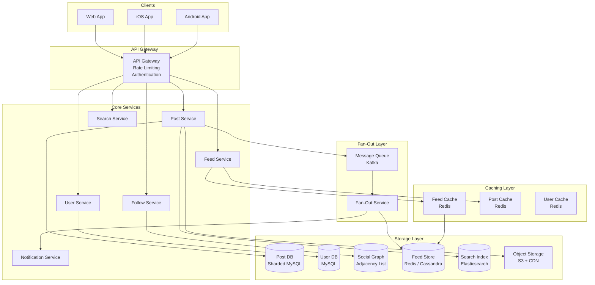
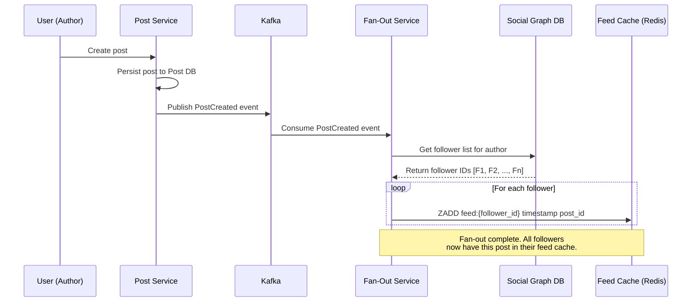
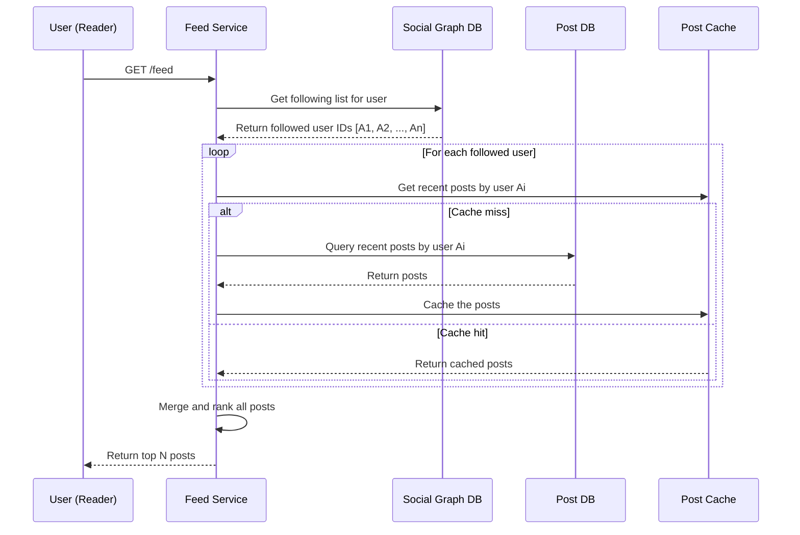
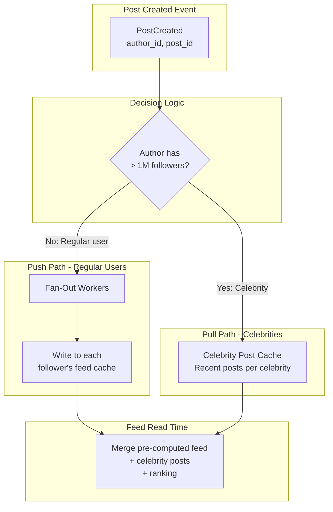
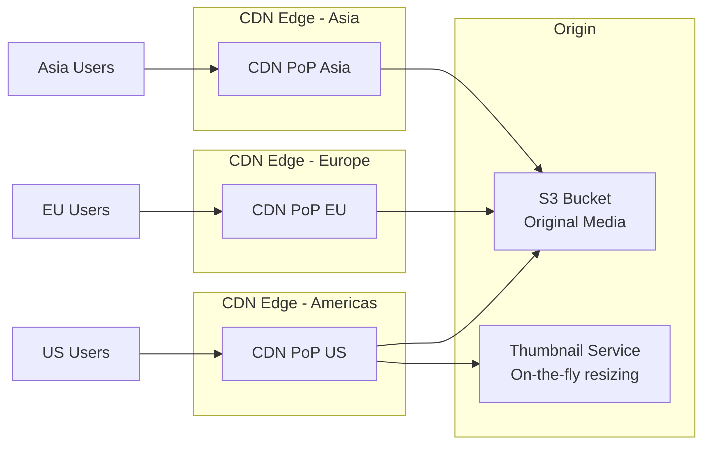
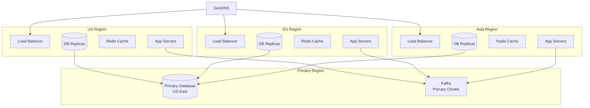

# System Design Interview: Social Media Feed
### Twitter / Instagram Scale

> [!NOTE]
> **Staff Engineer Interview Preparation Guide** — High Level Design Round

---

## Table of Contents

1. [Problem Clarification & Requirements](#1-problem-clarification--requirements)
2. [Capacity Estimation & Scale](#2-capacity-estimation--scale)
3. [High-Level Architecture](#3-high-level-architecture)
4. [Core Components Deep Dive](#4-core-components-deep-dive)
5. [Fan-Out Strategies](#5-fan-out-strategies)
6. [Feed Ranking & Generation](#6-feed-ranking--generation)
7. [Data Models & Storage](#7-data-models--storage)
8. [Media Storage & Delivery](#8-media-storage--delivery)
9. [Search & Trending Topics](#9-search--trending-topics)
10. [Notification Integration](#10-notification-integration)
11. [Scalability Strategies](#11-scalability-strategies)
12. [Design Trade-offs & Justifications](#12-design-trade-offs--justifications)
13. [Interview Cheat Sheet](#13-interview-cheat-sheet)

---

## 1. Problem Clarification & Requirements

> [!TIP]
> **Interview Tip:** Social media feed design is deceptively complex. The core challenge is not storing posts — it is generating personalized feeds for hundreds of millions of users in under 200ms. Lead with this insight to show you understand the problem deeply.

### Questions to Ask the Interviewer

| Category | Question | Why It Matters |
|----------|----------|----------------|
| **Scale** | How many daily active users? | Determines fan-out strategy |
| **Content** | Text only, or text + images + video? | Affects storage and CDN requirements |
| **Feed type** | Chronological or ranked? | Changes the feed generation pipeline entirely |
| **Social graph** | Follower model (Twitter) or friend model (Facebook)? | Follower model is asymmetric, more complex fan-out |
| **Celebrities** | Are there users with millions of followers? | Drives the hybrid fan-out decision |
| **Real-time** | Must new posts appear in followers' feeds instantly? | Latency vs throughput trade-off |
| **Features** | Likes, comments, retweets, stories? | Scope affects system complexity |
| **Consistency** | Is eventual consistency acceptable for feeds? | Simplifies the architecture significantly |

---

### Functional Requirements (Agreed Upon)

- Users can create posts (text, images, video)
- Users can follow/unfollow other users (asymmetric follow model)
- Users see a feed of posts from people they follow
- Posts can be liked, commented on, and reshared
- Users can search for posts and other users
- Trending topics based on hashtags and engagement

### Non-Functional Requirements

- **Latency:** Feed generation must complete in < 200ms P99
- **Availability:** 99.99% uptime
- **Scale:** 500 million DAU, 300 million posts per day
- **Consistency:** Eventual consistency is acceptable for feeds (a post appearing in a follower's feed 5-10 seconds after creation is fine)
- **Ordering:** Feed should be roughly ordered by relevance or recency
- **Durability:** Posts must never be lost once persisted

---

## 2. Capacity Estimation & Scale

> [!TIP]
> **Interview Tip:** For a social media feed, the most important number is not storage — it is the fan-out factor. A single post by a user with 10M followers generates 10M feed entries. This is the number that drives architectural decisions.

### Traffic Estimation

```
DAU                     = 500 Million
Posts per day           = 300 Million
Average follows per user = 200
Average followers per user = 200 (symmetric in aggregate)

Feed generation reads per day:
  Each user opens the app ~10 times/day
  Feed reads = 500M × 10 = 5 Billion reads/day

Write QPS (new posts):
  300M / 86,400 = ~3,500 posts/sec

Read QPS (feed requests):
  5B / 86,400 = ~58,000 feed requests/sec

Peak (3x average):
  Write QPS: ~10,500 posts/sec
  Read QPS:  ~174,000 feed requests/sec
```

### Fan-Out Estimation

```
When a user with N followers posts:
  Fan-out writes = N feed entries created

Average fan-out per post = 200 followers
Total fan-out writes/day = 300M × 200 = 60 Billion feed entries/day
Fan-out write QPS = 60B / 86,400 = ~694,000 writes/sec to feed tables

Celebrity problem:
  A user with 50M followers posts → 50M fan-out writes
  If they post 10 times/day → 500M fan-out writes from ONE user
```

### Storage Estimation

```
Post record:
  - Post ID         = 8 bytes
  - Author ID       = 8 bytes
  - Text (280 chars) = 560 bytes (UTF-8)
  - Media URLs      = 200 bytes
  - Timestamps      = 16 bytes
  - Metadata        = 100 bytes
  Total per post    ≈ 900 bytes

Posts per day: 300M × 900 bytes = 270 GB/day
Posts per year: 270 GB × 365 = ~100 TB/year

Feed entry (pre-computed feed):
  - User ID (whose feed) = 8 bytes
  - Post ID              = 8 bytes
  - Score/timestamp      = 8 bytes
  Total per feed entry   ≈ 24 bytes

Feed entries per day: 60B × 24 bytes = 1.44 TB/day (for fan-out-on-write)
```

### Media Storage

```
Assume 30% of posts have images, 5% have video:
  Images: 90M × 500 KB avg = 45 TB/day
  Videos: 15M × 10 MB avg  = 150 TB/day
  Total media per day       ≈ 195 TB/day

Media is stored on object storage (S3) and served via CDN.
This is separate from the feed database.
```

---

## 3. High-Level Architecture

> [!TIP]
> **Interview Tip:** Draw the architecture as two separate flows: the post creation flow (write path) and the feed generation flow (read path). This makes the fan-out strategy easy to explain.



---

## 4. Core Components Deep Dive

### 4.1 Post Service

Responsible for creating, reading, updating, and deleting posts.

**Create Post Flow:**
1. Client sends post content (text + media references) to the API Gateway
2. Post Service validates the content (length limits, profanity filter, spam detection)
3. If media is attached, upload to S3 via a pre-signed URL (media upload happens client-side in parallel)
4. Persist the post to the Post DB (sharded by author_id)
5. Publish a `PostCreated` event to Kafka with the post ID and author ID
6. Return the created post to the client

The Post Service does NOT fan out the post to followers. That responsibility belongs to the Fan-Out Service, which consumes the Kafka event asynchronously.

### 4.2 Follow Service

Manages the social graph — who follows whom.

**Data Structure:**
The social graph is stored as an adjacency list. For each user, we maintain two lists:
- **Following:** Users that this user follows (used to generate their feed)
- **Followers:** Users that follow this user (used for fan-out when they post)

**Storage:**
For 500M users with an average of 200 follows each, the graph has ~100 billion edges. This is too large for a single database. We use a sharded key-value store (Redis or Cassandra) where:
- Key: `followers:{user_id}` → Set of follower IDs
- Key: `following:{user_id}` → Set of followed user IDs

### 4.3 Feed Service

The Feed Service is responsible for returning a user's personalized feed. It retrieves pre-computed feed entries from the Feed Cache and hydrates them with full post data.

**Feed Retrieval Flow:**
1. Client requests feed for user X
2. Feed Service reads the pre-computed feed entries from Redis (a sorted set of post IDs, ordered by score/timestamp)
3. For each post ID, fetch the full post data from the Post Cache (or Post DB on cache miss)
4. For celebrity posts (pull model), merge in recent posts from celebrities that user X follows
5. Rank the merged results (see Section 6)
6. Return the top N posts (paginated)

### 4.4 Fan-Out Service

This is the most architecturally significant component. It receives `PostCreated` events from Kafka and distributes posts to followers' feeds. The strategy depends on the author's follower count (see Section 5).

---

## 5. Fan-Out Strategies

> [!TIP]
> **Interview Tip:** The fan-out strategy is the single most important design decision in a social media feed system. It is the question the interviewer is waiting for. Lead with the problem statement: "The fundamental challenge is distributing 300M posts to 500M users' feeds efficiently."

### Fan-Out on Write (Push Model)

When a user creates a post, immediately write the post reference to every follower's feed.



**How it works:**
1. Post is created and persisted
2. Fan-Out Service retrieves the author's follower list
3. For each follower, append the post ID to their pre-computed feed (a Redis sorted set, scored by timestamp or ranking score)
4. Each user's feed is capped at the most recent 800 entries (older entries are evicted)

**Pros:**
- Feed reads are extremely fast — just read a pre-computed sorted set from Redis
- Read latency is O(1) — no computation at read time
- Works perfectly for users with moderate follower counts

**Cons:**
- Celebrity problem: a user with 50M followers causes 50M writes per post
- Write amplification is enormous at scale
- A post might take minutes to fan out to all 50M followers
- Wastes resources: many followers may never open the app

### Fan-Out on Read (Pull Model)

Do NOT pre-compute feeds. When a user opens their feed, query for recent posts from all users they follow.



**Pros:**
- No write amplification — posting is instant regardless of follower count
- No wasted computation for inactive users
- Always shows the freshest content

**Cons:**
- Feed reads are slow — must query N sources (where N = number of followed users)
- If a user follows 500 people, the feed requires 500 cache/DB lookups
- Read latency can easily exceed 200ms under load
- Puts heavy load on the Post DB/Cache during peak hours

### Hybrid Approach (Recommended)

> [!IMPORTANT]
> The hybrid approach is the correct answer for the interview. Both Twitter and Instagram use variations of this strategy. The key insight is: use push for regular users and pull for celebrities.



**How the hybrid approach works:**

1. **Post creation time:**
   - If the author has < 1 million followers: use fan-out-on-write (push the post to all followers' feeds)
   - If the author has >= 1 million followers: store the post in a "celebrity posts" cache, but do NOT fan out

2. **Feed read time:**
   - Read the user's pre-computed feed from Redis (contains posts from regular users they follow)
   - Check if the user follows any celebrities
   - If yes, fetch recent posts from each celebrity's post cache
   - Merge the pre-computed feed with celebrity posts
   - Rank the merged results
   - Return the top N posts

**Why the threshold is ~1 million:**
- A fan-out of 1M writes takes approximately 1-2 seconds with a fleet of workers
- Beyond that, the latency and resource cost become prohibitive
- The number of celebrities (users with >1M followers) is small (~0.01% of all users), so the pull at read time only adds a few extra lookups

### Fan-Out Worker Design

The Fan-Out Service runs as a fleet of Kafka consumers, each processing `PostCreated` events:

```
Worker receives PostCreated event:
  1. Fetch follower list for author (paginated, 5000 per page)
  2. For each page of followers:
     a. Pipeline ZADD commands to Redis (batch for efficiency)
     b. ZADD feed:{follower_id} {timestamp} {post_id}
  3. Trim each feed to max 800 entries: ZREMRANGEBYRANK feed:{follower_id} 0 -801
  4. Acknowledge the Kafka offset after all followers are processed
```

> [!WARNING]
> If a fan-out worker crashes mid-processing, the Kafka offset is not committed, so the event will be reprocessed. This means some followers may receive duplicate feed entries. This is acceptable — duplicates are idempotent (same post_id with same score in a sorted set is a no-op in Redis).

---

## 6. Feed Ranking & Generation

> [!TIP]
> **Interview Tip:** Most candidates only discuss chronological feeds. Showing you understand ranking signals and ML-based feed algorithms demonstrates Staff-level depth.

### Chronological Feed (Simple)

The simplest approach: sort posts by creation timestamp. The pre-computed feed in Redis is a sorted set with timestamps as scores.

**Pros:** Easy to implement, users understand the ordering, no algorithmic bias
**Cons:** Spam and low-quality content rises to the top if posted frequently; users miss important posts from accounts they care about

### Ranked Feed (ML-Based)

Modern social media platforms use machine learning to rank feed items based on predicted engagement.

**Ranking Signals:**

| Signal Category | Examples | Weight |
|----------------|----------|--------|
| **Engagement prediction** | P(like), P(comment), P(share), P(click) | High |
| **Recency** | Post age, time since last session | High |
| **Relationship strength** | How often the reader interacts with the author | High |
| **Content type** | Image vs text vs video (user preference) | Medium |
| **Author signals** | Author's overall engagement rate, verified status | Medium |
| **Diversity** | Avoid showing 10 posts from the same author in a row | Medium |
| **Negative signals** | P(hide), P(report), P(unfollow after seeing) | High (negative) |

**Ranking Formula (Simplified EdgeRank Concept):**

```
Score = Σ (Affinity × Weight × Decay)

Where:
  Affinity = Strength of relationship between reader and author
             (based on historical interactions: likes, comments, profile views, DMs)
  Weight   = Type of content (video > image > link > text, varies by user)
  Decay    = Time decay function (posts lose relevance over time)
```

**Implementation at Scale:**

The ranking model runs at feed read time, not at fan-out time. This is because:
1. Ranking signals change frequently (the user may have interacted with the author since the last fan-out)
2. Ranking is personalized to the reader, not the author
3. The model can be updated without re-fanning-out posts

The pipeline:
1. Retrieve candidate posts (pre-computed feed + celebrity posts) — ~800 candidates
2. Fetch features for each candidate (author-reader affinity, post engagement stats, content type)
3. Run the ranking model on all candidates (batch inference, <50ms)
4. Return the top 20 posts (first page)

### Pagination

**Cursor-based pagination** is essential for social media feeds. Offset-based pagination breaks when new posts are inserted (posts shift, causing duplicates or missed posts).

```
First request:  GET /feed?limit=20
Response:       {posts: [...], cursor: "post_id_of_last_post"}

Next request:   GET /feed?limit=20&cursor=post_id_of_last_post
Response:       {posts: [...], cursor: "post_id_of_next_last_post"}
```

The cursor is the post_id (or timestamp) of the last post returned. The next page returns posts scored below that cursor.

---

## 7. Data Models & Storage

> [!TIP]
> **Interview Tip:** Be deliberate about which database you choose for each data model. The social graph, the post store, the feed cache, and the search index all have different access patterns and deserve different storage engines.

### Core Data Models

**User Table (MySQL, sharded by user_id)**

| Column | Type | Description |
|--------|------|-------------|
| user_id | BIGINT PK | Snowflake-style unique ID |
| username | VARCHAR(30) | Unique handle |
| display_name | VARCHAR(50) | Display name |
| bio | VARCHAR(160) | User biography |
| profile_image_url | VARCHAR(512) | S3 URL |
| follower_count | INT | Denormalized count |
| following_count | INT | Denormalized count |
| is_celebrity | BOOLEAN | True if follower_count > 1M |
| created_at | TIMESTAMP | Account creation |
| updated_at | TIMESTAMP | Last profile update |

**Post Table (MySQL, sharded by author_id)**

| Column | Type | Description |
|--------|------|-------------|
| post_id | BIGINT PK | Snowflake-style unique ID |
| author_id | BIGINT | Foreign key to User |
| content | VARCHAR(280) | Text content |
| media_urls | JSON | Array of S3 media URLs |
| media_type | ENUM | text, image, video, mixed |
| like_count | INT | Denormalized (updated via counter service) |
| comment_count | INT | Denormalized |
| reshare_count | INT | Denormalized |
| is_reshare | BOOLEAN | Is this a reshare of another post? |
| original_post_id | BIGINT | If reshare, reference to original |
| created_at | TIMESTAMP | Post creation timestamp |

**Follow Table (Social Graph - Redis or Cassandra)**

| Column | Type | Description |
|--------|------|-------------|
| follower_id | BIGINT | The user who follows |
| followee_id | BIGINT | The user being followed |
| followed_at | TIMESTAMP | When the follow happened |

Access patterns:
- `followers:{user_id}` → Set of user IDs who follow this user (for fan-out)
- `following:{user_id}` → Set of user IDs this user follows (for feed generation)

**Feed Entry (Redis Sorted Set)**

```
Key:    feed:{user_id}
Member: post_id
Score:  timestamp (or ranking score)

Example:
  ZADD feed:12345 1680000000 98765
  ZADD feed:12345 1680000060 98766
  ZADD feed:12345 1680000120 98767
```

Each user's feed is a sorted set of at most 800 post IDs. To read the feed:
```
ZREVRANGE feed:12345 0 19  → Returns the 20 most recent post IDs
```

**Like Table (Cassandra)**

| Column | Type | Description |
|--------|------|-------------|
| post_id | BIGINT | Partition key |
| user_id | BIGINT | Clustering key |
| liked_at | TIMESTAMP | When the like was created |

**Comment Table (MySQL, sharded by post_id)**

| Column | Type | Description |
|--------|------|-------------|
| comment_id | BIGINT PK | Unique comment ID |
| post_id | BIGINT | Foreign key to Post |
| author_id | BIGINT | Foreign key to User |
| content | VARCHAR(280) | Comment text |
| created_at | TIMESTAMP | Comment creation |

### Database Choice Summary

| Data | Storage | Reasoning |
|------|---------|-----------|
| Users | MySQL (sharded) | Structured data, moderate write volume |
| Posts | MySQL (sharded by author_id) | Structured, need range queries by author |
| Social Graph | Redis or Cassandra | High-throughput set operations |
| Pre-computed Feeds | Redis (sorted sets) | Sub-millisecond reads, natural TTL |
| Likes | Cassandra | High write throughput, simple key-value |
| Comments | MySQL (sharded by post_id) | Need ordered retrieval per post |
| Media | S3 + CDN | Blob storage, globally distributed |
| Search | Elasticsearch | Full-text search, inverted index |

> [!WARNING]
> Sharding the Post table by `author_id` means reading a single user's posts is fast (single shard), but reading posts across many authors (for feed generation) requires scatter-gather. This is fine because the feed is pre-computed — we only scatter-gather during fan-out (write path), not during feed reads.

---

## 8. Media Storage & Delivery

### Upload Flow

Media uploads are handled separately from post creation to avoid blocking the API:

1. Client requests a pre-signed S3 URL from the Media Service
2. Client uploads the media file directly to S3 using the pre-signed URL
3. S3 triggers a Lambda function (or notification) that:
   - Generates thumbnails (multiple sizes)
   - Transcodes video if applicable
   - Runs content moderation (NSFW detection, copyright check)
   - Updates the post record with the final media URLs
4. The CDN is configured to serve from the S3 bucket as origin

### CDN Strategy



**Image Optimization:**
- Store original images on S3
- Generate responsive variants (thumbnail, small, medium, large) on upload
- Serve WebP format to supported clients (30% smaller than JPEG)
- Use progressive JPEG for slow connections
- Set long cache TTL on CDN (images are immutable once uploaded)

**Video Delivery:**
- Transcode to multiple resolutions (360p, 480p, 720p, 1080p)
- Use HLS (HTTP Live Streaming) for adaptive bitrate streaming
- Store video segments on S3, serve via CDN
- Auto-play previews use low-resolution, short-duration clips

---

## 9. Search & Trending Topics

> [!TIP]
> **Interview Tip:** Search and trending are often treated as follow-up questions. Having a prepared answer shows you have thought about the full product, not just the core feed.

### Post Search

We use **Elasticsearch** with an inverted index on post content. When a post is created, it is indexed asynchronously (via the same Kafka pipeline used for fan-out).

**Search Index Fields:**
- Post content (full-text, analyzed)
- Hashtags (keyword, exact match)
- Author username (keyword)
- Author display name (full-text)
- Created timestamp (date, for recency boost)
- Engagement score (numeric, for popularity boost)

**Search Query Flow:**
1. User submits search query
2. Search Service sends query to Elasticsearch
3. Elasticsearch returns matching post IDs, ranked by relevance + recency + engagement
4. Hydrate post IDs with full post data from Post Cache / Post DB
5. Return results to client

### Hashtag Tracking

Every post is parsed for hashtags at creation time. Hashtags are stored as a separate field in the post record and in Elasticsearch for exact-match filtering.

### Trending Topics

Trending topics are computed using a **sliding window counter**:

1. Each hashtag mention is published to a Kafka topic
2. A Flink streaming job maintains a sliding window (e.g., last 5 minutes, last 1 hour, last 24 hours)
3. For each window, count hashtag occurrences
4. Rank by velocity (rate of increase, not just absolute count) — this surfaces emerging trends, not perpetually popular topics
5. Store the top 50 trending topics in Redis, refreshed every 30 seconds
6. Trending topics are personalized by region (GeoDNS-based or user locale)

**Velocity Formula:**

```
trend_score = (count_last_5min / count_last_1hour) × log(count_last_1hour)

This rewards hashtags with:
  - High recent activity relative to their historical baseline (the ratio)
  - Sufficient overall volume (the log term prevents tiny spikes from trending)
```

### Autocomplete

For search-as-you-type, we maintain a prefix trie in Redis (or use Elasticsearch's completion suggester):
- Top searched queries of the last 24 hours
- Usernames matching the prefix
- Hashtags matching the prefix

---

## 10. Notification Integration

When a post is created and fanned out, the Fan-Out Service also triggers notifications:

**Notification Types:**
- "User X posted for the first time in a while" (re-engagement)
- "User X who you have notifications enabled for just posted" (per-user notification setting)
- Mentions: "@username" in post content triggers a push notification to that user
- Likes/comments on your post (batched: "User X and 5 others liked your post")

**Architecture:**
Notifications are handled by a separate Notification Service that:
1. Consumes events from Kafka (PostCreated, PostLiked, CommentCreated, UserMentioned)
2. Checks user notification preferences (push enabled? Email digest? In-app only?)
3. Batches rapid-fire notifications (e.g., 100 likes in 1 minute become a single notification)
4. Sends push notifications via APNs (iOS) and FCM (Android)
5. Stores notification history in a per-user sorted set in Redis (for the in-app notification tab)

> [!NOTE]
> Notification fanout is different from feed fanout. Feed fanout targets all followers (potentially millions). Notification fanout is targeted — only users who have explicitly opted into notifications for a specific author, or users who are mentioned.

---

## 11. Scalability Strategies

> [!TIP]
> **Interview Tip:** At Staff level, you should be able to discuss not just "add more servers" but specific bottlenecks and their targeted solutions.

### Bottleneck Analysis

| Component | Bottleneck | Solution |
|-----------|-----------|----------|
| Fan-Out Workers | Celebrity posts cause massive write spikes | Hybrid fan-out (pull for celebrities) |
| Redis Feed Cache | Memory for 500M users × 800 entries | Evict feeds for inactive users; only cache active users |
| Post DB | 3,500 writes/sec across shards | Shard by author_id; each shard handles ~100 writes/sec |
| Social Graph | Large follower lists (50M entries) | Paginate follower reads; pre-partition large lists |
| Search Index | Indexing 300M posts/day | Multiple Elasticsearch clusters; time-based indices |

### Sharding Strategy

**Posts: Shard by author_id**
- All posts by the same author are on the same shard
- Querying "all posts by user X" hits a single shard
- Trade-off: celebrity accounts create hot shards (mitigate with dedicated shards for top 1000 accounts)

**Users: Shard by user_id**
- Even distribution since user IDs are random

**Social Graph: Shard by user_id**
- `followers:{user_id}` and `following:{user_id}` are co-located on the same shard
- This is critical because fan-out reads the full follower list — it must be a single-shard read

**Feed Cache: Shard by user_id**
- Redis Cluster handles this automatically via hash slots

### Feed Cache Memory Optimization

Not all 500M users need a cached feed. Many users are inactive (haven't opened the app in weeks). We only maintain cached feeds for active users:

```
Active users (opened app in last 7 days) ≈ 200M
Feed entries per user = 800
Bytes per entry = 24

Memory = 200M × 800 × 24 = 3.84 TB

With a Redis cluster of 128 nodes, each with 32 GB:
Total capacity = 4 TB → fits.
```

For inactive users, the feed is computed on-demand when they return (fan-out-on-read for their first session, then switched to push model).

### Geographic Distribution



Writes always go to the primary region. Cross-region replication ensures read replicas are available in each region. Feed caches are populated locally in each region via the fan-out pipeline (Kafka events are replicated cross-region).

---

## 12. Design Trade-offs & Justifications

> [!TIP]
> **Interview Tip:** The hybrid fan-out approach is the signature trade-off of this design. Be ready to explain the threshold (1M followers) and how you would tune it in production.

### Trade-off 1: Fan-Out Strategy

| Consideration | Our Decision | Alternative |
|--------------|-------------|-------------|
| Regular users (<1M followers) | Push (fan-out on write) | Pull (too slow at read time) |
| Celebrities (>1M followers) | Pull (fan-out on read) | Push (too expensive to write 50M entries) |
| Threshold | 1M followers | Could be 500K or 5M — tunable |
| Feed freshness | Near-real-time for push, eventual for pull | Full push would be fresher but unscalable |

**Justification:** The hybrid approach limits the maximum fan-out per post to ~1M writes while ensuring 99.99% of posts are pre-computed in followers' feeds. The small number of celebrities (perhaps 50,000 users globally) adds only 5-10 pull lookups per feed read, well within the 200ms latency budget.

### Trade-off 2: Chronological vs Ranked Feed

| Consideration | Our Decision | Alternative |
|--------------|-------------|-------------|
| User experience | Ranked (higher engagement) | Chronological (simpler, more transparent) |
| Implementation complexity | Higher (ML model) | Lower (sort by timestamp) |
| Infrastructure cost | Higher (feature store, model serving) | Lower |
| User trust | Lower (algorithmic bias concerns) | Higher (deterministic ordering) |

**Justification:** Ranked feeds significantly improve engagement metrics (time spent, interactions) because users see the most relevant content first. We offer chronological as an opt-in setting for users who prefer it.

### Trade-off 3: Eventual Consistency for Feeds

| Consideration | Our Decision | Alternative |
|--------------|-------------|-------------|
| Consistency | Eventual (5-10 second delay OK) | Strong (post appears instantly in all feeds) |
| Complexity | Simpler (async fan-out via Kafka) | Harder (synchronous fan-out, distributed transactions) |
| Latency | Post creation is fast (no fan-out in the request path) | Post creation blocks until fan-out completes |
| User perception | Acceptable (users rarely notice a few seconds delay) | Slightly better but not worth the cost |

**Justification:** Social media feeds are inherently eventually consistent. Users do not expect a post to appear in every follower's feed within milliseconds. The async pipeline via Kafka provides durability (events are not lost) and scalability (fan-out workers scale independently of the API servers).

### Trade-off 4: Feed Cache Size (800 entries per user)

| Consideration | Our Decision | Alternative |
|--------------|-------------|-------------|
| Entries per feed | 800 | 200 (less memory) or 5000 (more history) |
| Memory per user | 19.2 KB | 4.8 KB or 120 KB |
| Total memory (200M users) | 3.84 TB | 960 GB or 24 TB |
| User experience | Covers ~3 days of content for active users | Depends on how far back users scroll |

**Justification:** 800 entries covers approximately 3-4 days of content for a user following 200 accounts that each post once per day. Most users do not scroll beyond 1-2 days, so this provides ample buffer. The 3.84 TB fits within our Redis cluster budget.

---

## 13. Interview Cheat Sheet

> [!IMPORTANT]
> Use this as a quick reference during your interview preparation. Memorize the key numbers, the hybrid fan-out approach, and the three main trade-offs.

### Key Numbers to Remember

| Metric | Value |
|--------|-------|
| DAU | 500 Million |
| Posts per day | 300 Million |
| Feed reads per day | 5 Billion |
| Post write QPS | ~3,500/sec |
| Feed read QPS | ~58,000/sec |
| Fan-out writes/day | 60 Billion |
| Average followers per user | 200 |
| Celebrity threshold | 1 Million followers |
| Feed cache size per user | 800 entries (~19 KB) |
| Total feed cache | ~3.84 TB (200M active users) |
| Post storage per year | ~100 TB |
| Media storage per day | ~195 TB |

### Decision Summary

| Decision Point | Choice | Key Reason |
|----------------|--------|------------|
| Fan-out strategy | Hybrid (push + pull) | Handles both regular users and celebrities |
| Celebrity threshold | 1M followers | Limits max fan-out per post |
| Feed ordering | ML-ranked with chronological opt-in | Higher engagement |
| Post DB sharding | By author_id | All posts by one user on same shard |
| Feed storage | Redis sorted sets | Sub-millisecond reads |
| Media storage | S3 + CDN | Globally distributed, cost-effective |
| Search | Elasticsearch | Full-text + hashtag indexing |
| Consistency model | Eventual | Acceptable for feeds |
| Pagination | Cursor-based | Handles real-time feed insertions |

### Common Follow-Up Questions

**Q: How do you handle a user unfollowing someone? Their posts are already in the feed.**
A: We do NOT retroactively remove posts from the feed cache. The unfollowed user's posts naturally age out (they are no longer replenished). For immediate effect, the Feed Service can filter out posts from unfollowed users at read time — this is a lightweight in-memory filter on ~20 posts per page.

**Q: How do you handle post deletions?**
A: The post is soft-deleted in the Post DB (marked as deleted, not physically removed). When the Feed Service hydrates post IDs from the feed cache, it skips deleted posts. Periodically, a cleanup job removes deleted post IDs from feed caches. The CDN cache for media is invalidated.

**Q: What if a user follows 10,000 accounts?**
A: The pull portion of the feed (celebrity posts) is capped at following a maximum of ~50 celebrities. For the push portion, following 10,000 accounts means their feed receives more updates, but the fan-out cost is on the followed accounts, not on the follower. The feed cache (800 entries) naturally caps the visible content.

**Q: How do you prevent spam accounts from polluting feeds?**
A: Multiple layers: (1) Rate limit post creation per account, (2) ML-based spam detection on post content before persisting, (3) Account-level spam scoring based on behavior patterns (mass following/unfollowing, identical content posting), (4) User reports trigger manual review.

**Q: How do you handle a flash mob — millions of users posting at the same time (e.g., New Year's)?**
A: Kafka absorbs the write spike as a buffer. Fan-out workers scale horizontally based on Kafka consumer lag. The key insight is that feed reads (which are latency-sensitive) are served from cache and are unaffected by the write spike. The fan-out pipeline may fall behind by a few minutes during extreme spikes, but it catches up as the spike subsides.

### Whiteboard Summary

If you have limited whiteboard space, draw this:

```
Post → Kafka → Fan-Out Workers → Redis Feed Cache (push for <1M followers)
                                → Celebrity Post Cache (pull for >1M followers)

Feed Read → Merge(Redis feed + Celebrity posts) → Rank → Return top 20

Key insight: Hybrid fan-out solves the celebrity problem.
```

---

> [!NOTE]
> **Final Thought:** The social media feed is arguably the most important system design question because it forces you to reason about asymmetric fan-out, read/write trade-offs, and ranking algorithms simultaneously. Master the hybrid approach and you will handle this question confidently at any level.
