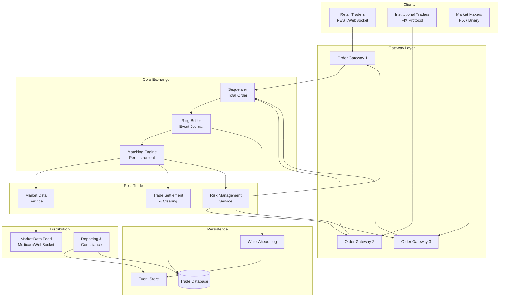
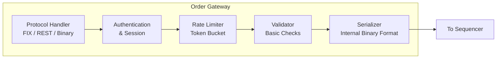
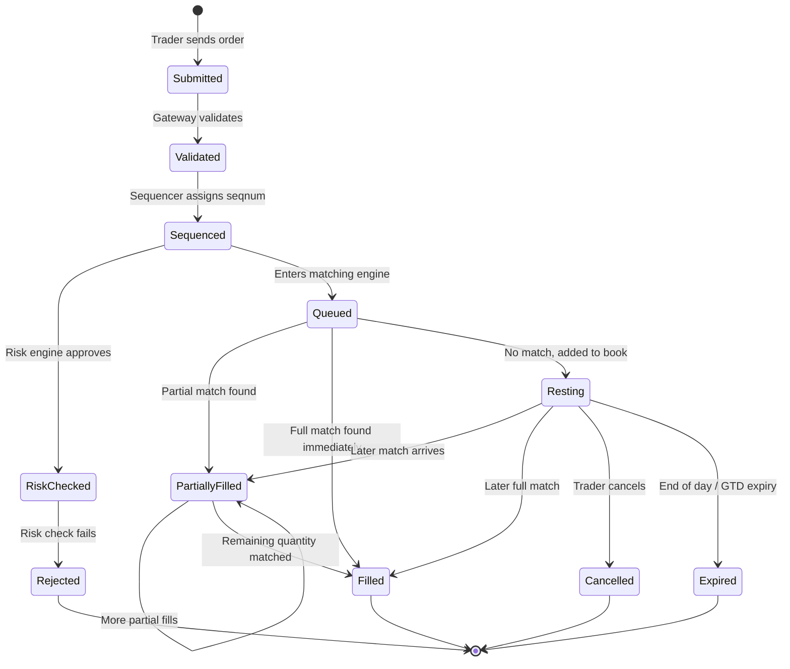
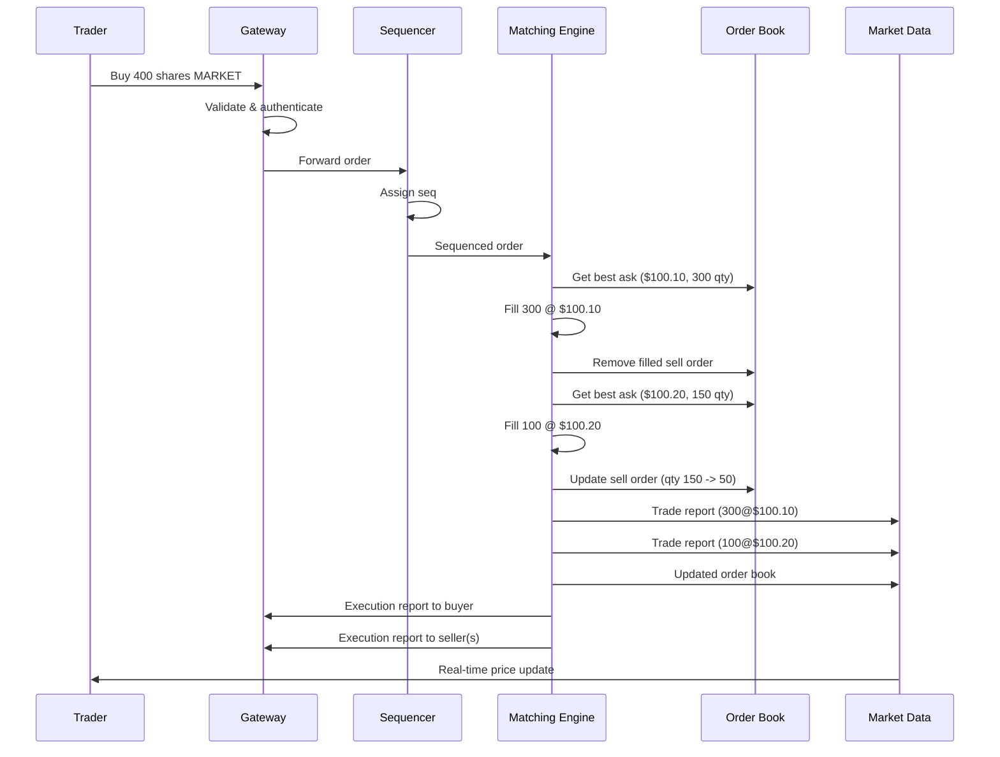
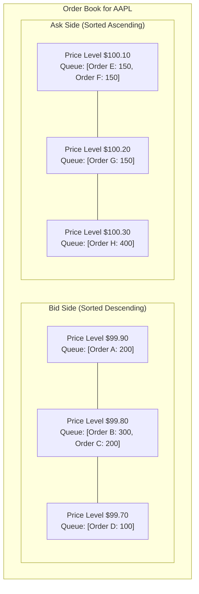
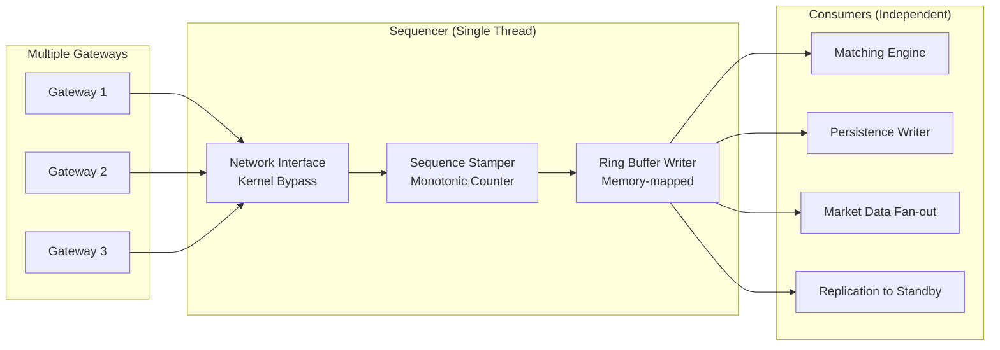
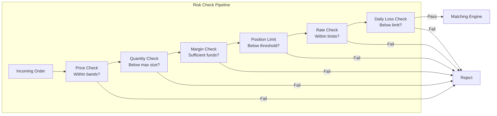
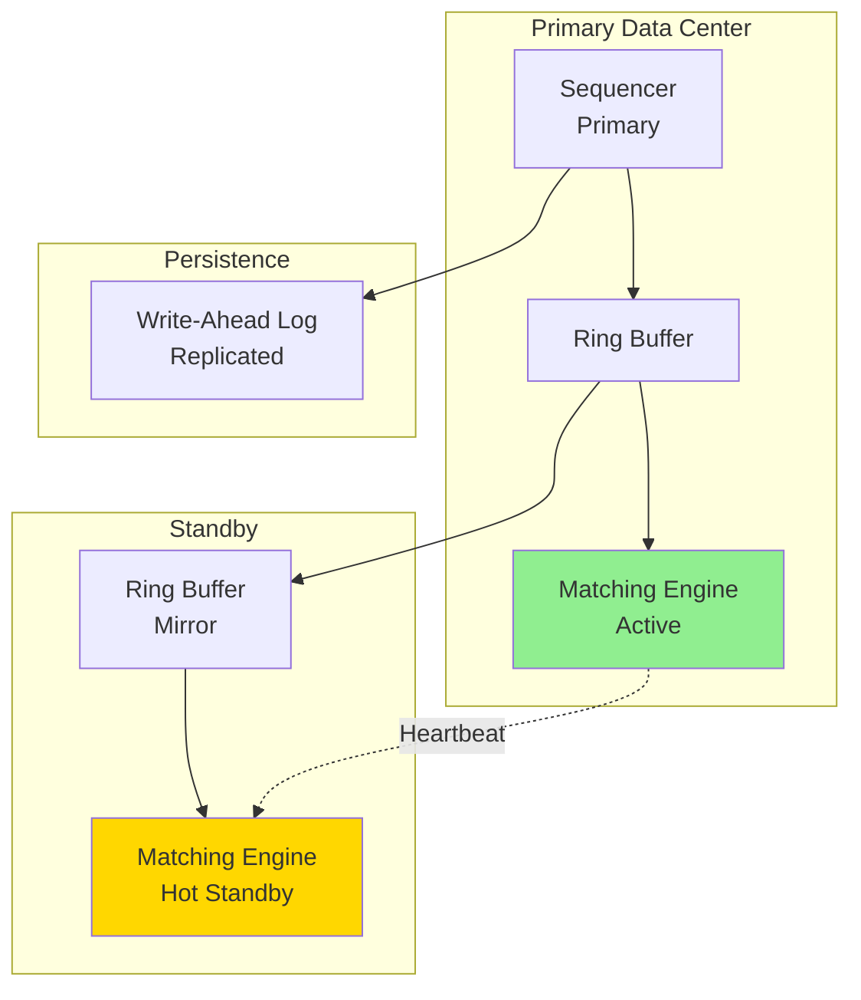

# System Design Interview: Stock Exchange & Order Matching Engine
### NASDAQ / NYSE Scale Trading Platform
> [!NOTE]
> **Staff Engineer Interview Preparation Guide** -- High Level Design Round

---

## Table of Contents

1. [Requirements](#1-requirements)
2. [Capacity Estimation](#2-capacity-estimation)
3. [High-Level Architecture](#3-high-level-architecture)
4. [Core Components Deep Dive](#4-core-components-deep-dive)
5. [Order Types & Lifecycle](#5-order-types--lifecycle)
6. [Order Matching Engine](#6-order-matching-engine)
7. [Order Book Data Structure](#7-order-book-data-structure)
8. [Sequencer & Deterministic Processing](#8-sequencer--deterministic-processing)
9. [Market Data Service](#9-market-data-service)
10. [Trade Settlement & Clearing](#10-trade-settlement--clearing)
11. [Risk Management](#11-risk-management)
12. [Data Models & Storage](#12-data-models--storage)
13. [Persistence & Event Sourcing](#13-persistence--event-sourcing)
14. [Failover & Disaster Recovery](#14-failover--disaster-recovery)
15. [Scalability Strategies](#15-scalability-strategies)
16. [Design Trade-offs](#16-design-trade-offs)
17. [Centralized vs Decentralized Exchanges](#17-centralized-vs-decentralized-exchanges)
18. [Interview Cheat Sheet](#18-interview-cheat-sheet)

---

## 1. Requirements

> [!TIP]
> **Interview Tip:** Stock exchange design is one of the most technically demanding system design questions. Begin by clarifying whether the interviewer wants the full exchange (matching engine, market data, settlement) or just the matching engine. The scope difference is enormous.

### Questions to Ask the Interviewer

| Category | Question | Why It Matters |
|----------|----------|----------------|
| **Scope** | Full exchange or just matching engine? | Determines whether settlement/clearing is in scope |
| **Assets** | Equities only, or also options/futures? | Derivatives add complexity to margin calculations |
| **Participants** | Retail traders, institutional, or both? | Institutional requires FIX protocol, co-location |
| **Latency** | What is acceptable matching latency? | Sub-millisecond requires specialized architecture |
| **Throughput** | Peak orders per second? | Drives single-threaded vs partitioned design |
| **Market Hours** | Continuous trading or auction-based? | Opening/closing auctions have different matching rules |
| **Regulation** | Audit trail requirements? | Every order event must be persisted with nanosecond timestamps |
| **Geography** | Single data center or multi-region? | Exchanges typically run in a single data center for consistency |

---

### Functional Requirements

- Place buy and sell orders (market, limit, stop, cancel)
- Match orders using price-time priority (FIFO)
- Maintain a real-time order book per instrument
- Broadcast real-time market data (price feeds, trade reports)
- Provide trade history and confirmations to participants
- Support order amendments and cancellations
- Execute opening and closing auctions
- Settle trades through a clearing house

### Non-Functional Requirements

- **Latency:** < 1ms for order matching (median), < 5ms P99
- **Throughput:** 100,000 orders per second per instrument during peak
- **Consistency:** Strong consistency for all trade executions -- no phantom fills
- **Availability:** 99.99% during market hours (planned downtime only outside hours)
- **Durability:** Zero data loss -- every order event must be persisted before acknowledgment
- **Determinism:** Given the same input sequence, the system must produce identical outputs
- **Fairness:** Orders at the same price must be filled in strict arrival order
- **Auditability:** Complete audit trail with nanosecond-precision timestamps

---

## 2. Capacity Estimation

> [!TIP]
> **Interview Tip:** Stock exchange capacity estimation is different from typical web systems. The focus is on throughput (orders/sec) and latency (microseconds), not storage or bandwidth. Show you understand this distinction.

### Traffic Estimation

```
Active traders (daily) = 1,000,000
Listed instruments (stocks) = 10,000
Peak orders per second (total) = 100,000
Average orders per second = 20,000
Orders per instrument per second (popular stock) = 5,000 - 10,000

Average order message size = 200 bytes
Market data update size = 100 bytes
```

### Throughput Analysis

```
Incoming order throughput:
  100,000 orders/sec x 200 bytes = 20 MB/sec inbound

Market data outbound (per instrument, all levels):
  10,000 updates/sec x 100 bytes = 1 MB/sec per instrument
  Top 100 instruments = 100 MB/sec total market data output

Trade confirmations:
  Assuming 30% fill rate = 30,000 trades/sec
  30,000 x 300 bytes = 9 MB/sec outbound
```

### Storage Estimation

```
Orders per trading day:
  100,000 orders/sec x 6.5 hours x 3600 sec = 2.34 billion orders/day
  2.34B x 200 bytes = ~470 GB/day (raw order data)

Trades per day:
  ~700 million trades/day
  700M x 300 bytes = ~210 GB/day

Event log (all events including modifications):
  ~5 billion events/day x 250 bytes = ~1.25 TB/day

Annual storage (252 trading days):
  Orders: ~118 TB/year
  Event log: ~315 TB/year
```

### Latency Budget

```
Network ingress (gateway to sequencer): < 10 us
Sequencing (assign global sequence number): < 5 us
Matching engine processing: < 100 us
Persistence (write-ahead log): < 50 us (async)
Market data dissemination: < 100 us
Total end-to-end: < 500 us target, < 1ms P99
```

> [!NOTE]
> Real exchanges like NASDAQ report median latencies around 50-100 microseconds. The 1ms target is a reasonable interview-level constraint. If the interviewer pushes for tighter numbers, discuss kernel bypass (DPDK), FPGA-based matching, and custom network stacks.

---

## 3. High-Level Architecture



### Architecture Principles

The exchange architecture follows several principles that differ sharply from typical web systems:

**Single-threaded matching per instrument.** This is not a limitation -- it is a deliberate design choice. A single thread eliminates all locking overhead, ensures deterministic behavior, and makes the system trivially reproducible from an event log. Modern CPUs can process millions of operations per second on a single core.

**Separation of sequencing and matching.** The sequencer assigns a global sequence number to every incoming order before it reaches the matching engine. This creates a total ordering that enables deterministic replay and simplifies failover.

**Event-sourced everything.** Every state change is recorded as an immutable event. The order book is never persisted directly -- it is always derived by replaying events. This provides a complete audit trail and enables point-in-time recovery.

> [!IMPORTANT]
> Unlike web services where you scale horizontally with load balancers, an exchange scales by partitioning instruments across matching engine instances. Each instrument has exactly one matching engine -- there is no replication for the active book. This is a fundamental constraint of strong consistency in order matching.

---

## 4. Core Components Deep Dive

### Order Gateway

The gateway is the entry point for all client connections. It handles:

**Protocol Translation:** Clients connect via FIX (Financial Information eXchange) protocol for institutional traders or REST/WebSocket for retail. The gateway normalizes all incoming orders into an internal binary format optimized for low-latency processing.

**Authentication & Session Management:** Each client establishes a session with a unique session ID. The gateway validates API keys, checks IP whitelists, and manages connection state. FIX sessions use sequence numbers to detect and recover from message gaps.

**Throttling & Rate Limiting:** Each participant has a configurable rate limit (e.g., 1,000 orders/second for retail, 50,000/second for market makers). The gateway enforces these limits using token bucket algorithms. Exceeding the limit results in order rejection, not queuing.

**Pre-validation:** Basic validation happens at the gateway: valid instrument symbol, valid order type, correct field formats, account exists. This prevents obviously invalid orders from consuming matching engine capacity.



### Sequencer

The sequencer is the most critical component for correctness. It assigns a monotonically increasing sequence number to every incoming order event. This number establishes the total ordering that the matching engine relies on for price-time priority.

**Why a separate sequencer?** Without total ordering, two orders arriving at "the same time" could be processed in different orders by different components, leading to inconsistent state. The sequencer serializes all events through a single point.

**Implementation:** The sequencer is typically a single-threaded process that reads from a network buffer, stamps each message with a sequence number and nanosecond timestamp, writes it to a ring buffer (journal), and forwards it to the matching engine. The entire operation takes 1-5 microseconds per message.

**Ring Buffer Design (LMAX Disruptor Pattern):**

```
Ring Buffer (pre-allocated, fixed size):
+----+----+----+----+----+----+----+----+
| E1 | E2 | E3 | E4 |    |    |    |    |
+----+----+----+----+----+----+----+----+
                      ^write
  ^read (matching engine)
       ^read (market data)
            ^read (persistence)
```

The ring buffer is a lock-free, pre-allocated circular array. The sequencer is the sole writer. Multiple consumers (matching engine, market data, persistence) read independently at their own pace using memory barriers instead of locks.

> [!TIP]
> **Interview Tip:** If the interviewer asks "what happens if the sequencer is a bottleneck?", explain that at 200 bytes per order and 5 microseconds per sequencing operation, a single sequencer can handle 200,000 orders/second. For higher throughput, you partition by instrument family (e.g., tech stocks on sequencer A, financial stocks on sequencer B), with each partition having its own sequencer and matching engine.

### Risk Management Engine

Pre-trade risk checks run before orders reach the matching engine. These checks must be fast (< 50 microseconds) to avoid adding latency:

**Margin Check:** Does the trader have sufficient margin/buying power for this order? For a buy order of 1,000 shares at $150, verify the account has at least $150,000 in available margin (or the margin requirement percentage thereof).

**Position Limits:** Has the trader exceeded their maximum position size for this instrument? Regulators and the exchange set limits to prevent market manipulation.

**Fat Finger Protection:** Is the order price within a reasonable range of the current market price? An order to buy at $1,500 when the stock trades at $150 is likely an error. The exchange defines "price bands" (e.g., +/- 10% of last trade) and rejects orders outside them.

**Order Rate Check:** Is this participant sending orders at an abnormal rate? Sudden bursts may indicate a malfunctioning algorithm.

| Risk Check | Typical Limit | Action on Breach |
|------------|--------------|------------------|
| Margin | Account-specific | Reject order |
| Position limit | 5% of outstanding shares | Reject order |
| Price band | +/- 10% of last trade | Reject order |
| Order rate | 50,000/sec for market makers | Throttle / disconnect |
| Maximum order size | 25,000 shares | Reject order |
| Daily loss limit | Account-specific | Disable trading |

> [!WARNING]
> Risk checks are a double-edged sword. Too strict and you reject legitimate orders. Too lenient and you allow potentially market-disrupting trades. In an interview, acknowledge this tension and propose configurable, per-participant risk parameters.

---

## 5. Order Types & Lifecycle

### Order Types

**Market Order:** Execute immediately at the best available price. The trader prioritizes execution certainty over price. A market buy order will match against the lowest-priced sell orders in the book until the order is fully filled. The execution price is not guaranteed -- in a fast-moving market, the trader may get a worse price than expected (slippage).

**Limit Order:** Execute at the specified price or better. A limit buy at $100 will only execute at $100 or lower. If no matching sell orders exist at $100 or below, the order sits in the order book until a matching order arrives or the trader cancels it. Limit orders provide price certainty but not execution certainty.

**Stop Order (Stop-Loss):** Becomes a market order when the instrument's price crosses a specified trigger price. A stop sell at $95 means: "If the price drops to $95 or below, sell at market price." Stop orders are used for risk management -- they limit downside exposure. Internally, the exchange maintains a list of stop orders and monitors the last trade price. When triggered, the stop order converts to a market order and enters the matching queue.

**Stop-Limit Order:** Like a stop order, but converts to a limit order instead of a market order when triggered. This gives the trader both a trigger condition and a price floor/ceiling.

**Cancel Order:** Removes a previously submitted order from the book. The exchange must verify that the order belongs to the requesting participant and that it has not already been filled.

**Cancel-Replace (Amend) Order:** Atomically cancels an existing order and places a new one. This is used to adjust price or quantity without losing queue position (if the price remains the same and only quantity decreases).

### Order Lifecycle



### Time-In-Force Options

| TIF Code | Name | Behavior |
|----------|------|----------|
| DAY | Day Order | Expires at market close |
| GTC | Good Till Cancelled | Stays until filled or cancelled (up to 90 days) |
| IOC | Immediate or Cancel | Fill as much as possible immediately, cancel remainder |
| FOK | Fill or Kill | Fill entirely or reject completely -- no partial fills |
| GTD | Good Till Date | Stays until specified date |

> [!NOTE]
> IOC and FOK orders never rest in the order book. They are either executed immediately or rejected. Market makers use IOC orders extensively because they want immediate execution without the risk of leaving stale orders in the book.

---

## 6. Order Matching Engine

The matching engine is the heart of the exchange. It receives sequenced orders and executes matching logic using price-time priority (the most common algorithm used by major exchanges).

### Price-Time Priority (FIFO Matching)

The matching algorithm follows two simple rules:

1. **Price Priority:** The best-priced orders execute first. For buy orders, higher prices have higher priority. For sell orders, lower prices have higher priority.
2. **Time Priority:** Among orders at the same price, the order that arrived first executes first (FIFO).

### Matching Algorithm

When a new buy order arrives:

```
function matchBuyOrder(incomingBuy):
    while incomingBuy.remainingQty > 0:
        bestAsk = orderBook.getBestAsk()  // lowest sell price

        if bestAsk is null:
            break  // no sell orders in book

        if incomingBuy is LimitOrder AND incomingBuy.price < bestAsk.price:
            break  // buy price too low, no match possible

        // Match against orders at the best ask price level
        while incomingBuy.remainingQty > 0 AND bestAsk has orders:
            restingSell = bestAsk.getFirstOrder()  // FIFO
            fillQty = min(incomingBuy.remainingQty, restingSell.remainingQty)
            fillPrice = restingSell.price  // price of resting order

            executeTrade(incomingBuy, restingSell, fillQty, fillPrice)

            incomingBuy.remainingQty -= fillQty
            restingSell.remainingQty -= fillQty

            if restingSell.remainingQty == 0:
                bestAsk.removeFirstOrder()

        if bestAsk has no orders:
            orderBook.removeAskLevel(bestAsk.price)

    if incomingBuy.remainingQty > 0:
        if incomingBuy is LimitOrder:
            orderBook.addToBids(incomingBuy)  // rest in book
        // else: market order, remaining is cancelled (or rejected if FOK)
```

### Matching Example

Initial order book state:

```
         BID (Buy)                    ASK (Sell)
    Qty    Price                  Price    Qty
    200    $99.90                $100.10    300
    500    $99.80                $100.20    150
    100    $99.70                $100.30    400
```

A new market buy order arrives for 400 shares:

**Step 1:** Match against best ask ($100.10, 300 shares available)
- Fill 300 shares at $100.10
- Remaining: 400 - 300 = 100 shares

**Step 2:** Best ask level exhausted. Move to next level ($100.20, 150 shares)
- Fill 100 shares at $100.20
- Remaining: 100 - 100 = 0 shares

**Result:** Two trades executed:
- Trade 1: 300 shares @ $100.10
- Trade 2: 100 shares @ $100.20
- Average fill price: (300 x 100.10 + 100 x 100.20) / 400 = $100.125

```
         BID (Buy)                    ASK (Sell)
    Qty    Price                  Price    Qty
    200    $99.90                $100.20     50  <-- reduced
    500    $99.80                $100.30    400
    100    $99.70
```



> [!TIP]
> **Interview Tip:** Walk through a concrete matching example with actual numbers. This demonstrates you truly understand the algorithm, not just the abstract description. Draw the order book before and after on the whiteboard.

---

## 7. Order Book Data Structure

The order book is the most performance-critical data structure in the exchange. It must support these operations efficiently:

| Operation | Frequency | Target Latency |
|-----------|-----------|----------------|
| Add order to book | Very high | O(log N) or O(1) |
| Cancel order from book | Very high | O(1) |
| Get best bid/ask | Every match | O(1) |
| Match and remove from front of price level | High | O(1) |
| Get full book depth (for market data) | Moderate | O(N) acceptable |

### Data Structure Design



### Implementation Approaches

**Approach 1: Sorted TreeMap (Red-Black Tree)**

Each side of the book (bids, asks) is a red-black tree keyed by price. Each node contains a doubly-linked list (FIFO queue) of orders at that price level.

```
BidSide: TreeMap<Price, OrderQueue>  // sorted descending
AskSide: TreeMap<Price, OrderQueue>  // sorted ascending

OrderQueue: DoublyLinkedList<Order>  // FIFO within price level

OrderIndex: HashMap<OrderID, Order>  // O(1) lookup for cancellations
```

- Insert order: O(log P) where P is number of distinct price levels (typically < 1000)
- Cancel order: O(1) via order index + doubly-linked list removal
- Best bid/ask: O(1) -- cache the best price level
- Match at best price: O(1) -- dequeue from front of linked list

**Approach 2: Array-Based (for instruments with tick-based pricing)**

Many instruments have a minimum price increment (tick). For an instrument with a tick size of $0.01 and a typical price range of $50-$200, there are only 15,000 possible price levels. Use a fixed-size array indexed by price (converted to tick offset).

```
const TICK_SIZE = 0.01
const MIN_PRICE = 0.00
const MAX_PRICE = 10000.00
const NUM_LEVELS = (MAX_PRICE - MIN_PRICE) / TICK_SIZE = 1,000,000

bidLevels: Array<OrderQueue>[NUM_LEVELS]
askLevels: Array<OrderQueue>[NUM_LEVELS]
bestBidIndex: int  // maintained on insert/remove
bestAskIndex: int
```

- Insert order: O(1) -- direct array access by price index
- Cancel order: O(1) -- same as TreeMap approach
- Best bid/ask: O(1) -- maintained as a variable
- Match at best price: O(1)

The array approach wastes memory on empty price levels but provides O(1) access for everything, which is preferred in ultra-low-latency environments.

> [!IMPORTANT]
> The order book MUST be entirely in-memory. Disk access during order matching would add milliseconds of latency. The entire book for one instrument rarely exceeds 100 MB of memory, so this is easily feasible.

### Memory Layout Considerations

For ultra-low-latency, memory layout matters enormously:

- **Pre-allocate all memory** at startup. No dynamic allocation during trading hours (malloc/new causes unpredictable GC pauses).
- **Use object pools** for order objects. When an order is filled or cancelled, return it to the pool.
- **Pack data tightly** to maximize CPU cache hits. An order should fit in 1-2 cache lines (64-128 bytes).
- **Avoid pointers across memory pages.** Use array indices instead of pointers for linked list nodes.

```
Optimized Order Layout (64 bytes, 1 cache line):
+--------+--------+--------+--------+
| OrderID (8B)    | Price (8B)      |
+--------+--------+--------+--------+
| Quantity (4B)   | Remaining (4B)  |
+--------+--------+--------+--------+
| Timestamp (8B)  | AccountID (8B)  |
+--------+--------+--------+--------+
| InstrumentID(4B)| Side (1B)       |
| OrderType (1B)  | TIF (1B)        |
| Status (1B)     | Flags (4B)      |
| PrevIdx (4B)    | NextIdx (4B)    |
+--------+--------+--------+--------+
```

---

## 8. Sequencer & Deterministic Processing

### Why Determinism Matters

A stock exchange must be deterministic: given the same sequence of input events, it must always produce the same sequence of output events. This property is critical for:

1. **Failover:** A hot standby matching engine replays the same event log and arrives at identical state.
2. **Regulatory audit:** Regulators can replay the event log and verify that the exchange operated correctly.
3. **Debugging:** Production issues can be reproduced by replaying the event log in a test environment.
4. **Reconciliation:** Multiple downstream systems (clearing, settlement, reporting) can independently derive consistent state from the same event log.

### Sequencer Design



**Single-threaded event loop:**

```
function sequencerLoop():
    sequenceNumber = loadLastSequenceNumber()
    while running:
        message = networkBuffer.poll()  // non-blocking
        if message is not null:
            sequenceNumber++
            message.sequenceNumber = sequenceNumber
            message.timestamp = nanoTime()
            ringBuffer.write(message)
            // Consumers read from ring buffer asynchronously
```

The sequencer does minimal work: stamp a sequence number and timestamp, then write to the ring buffer. No validation, no matching, no persistence -- all of that happens downstream. This keeps the sequencer blazingly fast.

### LMAX Disruptor Pattern

The ring buffer follows the LMAX Disruptor pattern, which achieves lock-free communication between the sequencer (producer) and multiple consumers:

**Pre-allocated fixed-size ring:** The buffer is allocated once at startup. Each slot is a fixed-size byte array large enough for any message type. No memory allocation occurs during operation.

**Single producer, multiple consumers:** The sequencer is the sole writer. Each consumer (matching engine, persistence, market data) maintains its own read cursor. Consumers can be at different positions in the buffer.

**Memory barriers instead of locks:** The producer publishes by advancing its write cursor using a memory barrier (store-release). Consumers detect new messages by checking the write cursor using a load-acquire barrier. No mutexes, no condition variables, no context switches.

**Batching:** When a consumer falls behind, it can process multiple messages in a single batch when it catches up. This provides natural back-pressure handling.

```
Ring Buffer State:
Position:  0    1    2    3    4    5    6    7
          [E1] [E2] [E3] [E4] [E5] [  ] [  ] [  ]
                                     ^Writer cursor (5)
                               ^Matching Engine cursor (4)
                          ^Persistence cursor (3)
                     ^Market Data cursor (3)
```

> [!NOTE]
> The LMAX Disruptor can achieve throughput of over 100 million messages per second on commodity hardware. This is far more than any exchange needs, which is why a single sequencer is sufficient.

---

## 9. Market Data Service

The market data service receives trade and order book updates from the matching engine and distributes them to market participants.

### Market Data Levels

**Level 1 (L1) -- Top of Book:**
- Best bid price and quantity
- Best ask price and quantity
- Last trade price, quantity, and time
- Daily high, low, open, close, volume

This is what most retail traders see. Updated on every trade and every change to the best bid/ask.

**Level 2 (L2) -- Full Order Book Depth:**
- All price levels with aggregated quantity at each level
- Typically shows 10-20 levels on each side
- Updated on every order book change (new order, cancel, fill)

This is what professional traders use to gauge market depth and anticipate price movements.

**Level 3 (L3) -- Full Order Book with Individual Orders:**
- Every individual order in the book (not just aggregated by price level)
- Includes order IDs for tracking specific orders
- Only available to exchange members and market makers

### Market Data Distribution

**Multicast (for co-located participants):** UDP multicast provides the lowest latency. The exchange publishes updates to a multicast group, and all subscribers on the same network segment receive them simultaneously. This eliminates the per-subscriber overhead of TCP connections. Reliability is handled via a separate retransmission channel.

**WebSocket (for remote participants):** Clients maintain persistent WebSocket connections to market data servers. The exchange publishes updates through a topic-based pub/sub system. Clients subscribe to specific instruments.

**Snapshot + Incremental Updates:** Clients first request a full snapshot of the order book, then apply incremental updates (deltas). This reduces bandwidth and allows clients to maintain a local copy of the book.

### Candlestick Aggregation

The market data service also computes OHLCV (Open, High, Low, Close, Volume) candles at various time intervals:

```
Candlestick for AAPL, 1-minute interval, 10:30-10:31:
  Open:   $150.25 (first trade in interval)
  High:   $150.80 (highest trade price)
  Low:    $150.10 (lowest trade price)
  Close:  $150.50 (last trade in interval)
  Volume: 45,000 shares (total shares traded)
```

Standard intervals: 1 second, 1 minute, 5 minutes, 15 minutes, 1 hour, 1 day.

The service maintains running OHLCV state for each instrument and interval, updating on each trade. At the end of each interval, it publishes the completed candle and resets.

> [!TIP]
> **Interview Tip:** If the interviewer asks about market data at scale, discuss the fan-out problem. With 10,000 instruments and 100,000 subscribers, you cannot send every update to every subscriber. Use topic-based routing where each subscriber only receives updates for instruments they are subscribed to. The exchange typically distributes via a tier of feed handler servers that aggregate and fan out.

---

## 10. Trade Settlement & Clearing

### What is Settlement?

Settlement is the actual transfer of securities and cash between the buyer and seller. In most equity markets, settlement occurs on T+2 (two business days after the trade date). During the settlement window:

1. **Trade Capture:** The matching engine records the trade details.
2. **Clearing:** The clearing house (e.g., DTCC in the US) becomes the counterparty to both sides. Buyer owes cash to the clearing house; clearing house owes securities. Seller owes securities; clearing house owes cash. This is called novation and eliminates counterparty risk.
3. **Netting:** Rather than settling each trade individually, the clearing house nets all trades for each participant. If a broker bought 10,000 shares and sold 8,000 shares of the same stock, they only need to receive 2,000 shares net.
4. **Settlement:** On T+2, the actual transfer occurs. Securities move from seller's custodian to buyer's custodian. Cash moves in the opposite direction.

### Position Management

The exchange and each broker maintain real-time position tracking:

```
Position for Broker A, AAPL:
  Start of Day (SOD) position: +5,000 shares
  Buys today: +3,000 shares
  Sells today: -2,000 shares
  Current position: +6,000 shares
  Pending settlement (T+1): +500 shares
  Pending settlement (T+2): -200 shares
```

Positions are updated in real-time as trades execute. They feed into risk calculations (margin requirements, position limits) and regulatory reporting.

### Margin and Collateral

Traders must maintain margin (collateral) to cover potential losses. The exchange calculates margin requirements using models like SPAN or VaR:

| Account Type | Margin Requirement |
|-------------|-------------------|
| Cash account | 100% of purchase price |
| Margin account (Reg T) | 50% initial, 25% maintenance |
| Portfolio margin | Risk-based, typically 15-20% |
| Market maker | Reduced requirements |

When a trader's margin falls below the maintenance level, the exchange issues a margin call. If not met within the deadline, the exchange liquidates positions to cover the shortfall.

---

## 11. Risk Management

### Pre-Trade Risk Checks

Every order passes through risk checks before entering the matching engine. These checks must complete in microseconds to avoid adding latency.



### Circuit Breakers

When a stock's price moves too rapidly, the exchange halts trading to prevent panic-driven crashes:

**Single-Stock Circuit Breaker (Limit Up/Limit Down):**
- Calculate a reference price (typically the average of the last 5 minutes)
- Define bands: +/- 5% for large-cap stocks, +/- 10% for small-cap
- If the best bid/ask hits the band, enter a "Limit State" (15-second pause)
- If no recovery, halt trading for 5 minutes

**Market-Wide Circuit Breaker:**
- Level 1: S&P 500 drops 7% from previous close -- halt for 15 minutes
- Level 2: S&P 500 drops 13% -- halt for 15 minutes
- Level 3: S&P 500 drops 20% -- halt for remainder of day

### Kill Switch

The exchange provides each participant with a "kill switch" that instantly cancels all open orders and prevents new orders. This is used when:
- A trading algorithm malfunctions (runaway orders)
- A participant detects a security breach
- The exchange detects abnormal behavior from a participant

> [!WARNING]
> The Knight Capital incident (2012) is a cautionary tale: a software deployment error caused their trading system to send millions of erroneous orders in 45 minutes, resulting in $440 million in losses. Modern exchanges require kill switches and provide automatic "heartbeat" monitoring -- if a participant stops sending heartbeats, all their orders are automatically cancelled.

---

## 12. Data Models & Storage

### Core Data Models

**Order Table**

| Column | Type | Description |
|--------|------|-------------|
| order_id | BIGINT (PK) | Unique order identifier |
| sequence_number | BIGINT (Unique) | Global sequence from sequencer |
| instrument_id | INT | Symbol/instrument being traded |
| account_id | INT | Trading account |
| side | ENUM | BUY, SELL |
| order_type | ENUM | MARKET, LIMIT, STOP, STOP_LIMIT |
| time_in_force | ENUM | DAY, GTC, IOC, FOK, GTD |
| price | DECIMAL(18,8) | Limit price (null for market orders) |
| stop_price | DECIMAL(18,8) | Stop trigger price |
| quantity | INT | Original order quantity |
| remaining_qty | INT | Unfilled quantity |
| status | ENUM | NEW, PARTIALLY_FILLED, FILLED, CANCELLED, REJECTED, EXPIRED |
| created_at | TIMESTAMP(ns) | Nanosecond-precision creation time |
| updated_at | TIMESTAMP(ns) | Last update time |
| expiry_date | DATE | For GTD orders |

**Trade (Execution) Table**

| Column | Type | Description |
|--------|------|-------------|
| trade_id | BIGINT (PK) | Unique trade identifier |
| sequence_number | BIGINT | Sequence of the event that caused this trade |
| instrument_id | INT | Traded instrument |
| buy_order_id | BIGINT (FK) | Buy side order |
| sell_order_id | BIGINT (FK) | Sell side order |
| buyer_account_id | INT | Buyer account |
| seller_account_id | INT | Seller account |
| price | DECIMAL(18,8) | Execution price |
| quantity | INT | Number of shares traded |
| executed_at | TIMESTAMP(ns) | Nanosecond-precision execution time |
| settlement_date | DATE | Expected settlement date (T+2) |
| settlement_status | ENUM | PENDING, SETTLED, FAILED |

**Position Table**

| Column | Type | Description |
|--------|------|-------------|
| account_id | INT (PK) | Trading account |
| instrument_id | INT (PK) | Instrument held |
| sod_quantity | INT | Start-of-day position |
| current_quantity | INT | Real-time position |
| avg_cost | DECIMAL(18,8) | Average cost basis |
| realized_pnl | DECIMAL(18,8) | Realized profit/loss today |
| unrealized_pnl | DECIMAL(18,8) | Unrealized P&L based on mark price |
| updated_at | TIMESTAMP(ns) | Last update time |

**Account Table**

| Column | Type | Description |
|--------|------|-------------|
| account_id | INT (PK) | Account identifier |
| participant_id | INT | Broker/firm identifier |
| account_type | ENUM | CASH, MARGIN, MARKET_MAKER |
| cash_balance | DECIMAL(18,8) | Available cash |
| margin_used | DECIMAL(18,8) | Margin currently in use |
| margin_available | DECIMAL(18,8) | Available margin for new orders |
| status | ENUM | ACTIVE, SUSPENDED, CLOSED |
| max_order_rate | INT | Orders per second limit |
| created_at | TIMESTAMP | Account creation date |

### Storage Architecture

The exchange uses different storage systems for different purposes:

| Storage Layer | Technology | Purpose | Latency |
|---------------|-----------|---------|---------|
| In-memory order book | Custom data structure | Active matching | < 1 us |
| Write-ahead log | Memory-mapped file | Durability before ack | < 50 us |
| Event store | Append-only log (Kafka) | Full event history | < 1 ms |
| Trade database | PostgreSQL / TimeScaleDB | Post-trade queries | < 10 ms |
| Archive | S3 / Parquet | Regulatory retention | < 1 sec |

---

## 13. Persistence & Event Sourcing

### Write-Ahead Log (WAL)

Before the matching engine processes an order, the sequencer writes it to a write-ahead log. This ensures that even if the matching engine crashes, no acknowledged orders are lost.

The WAL is a memory-mapped file that uses sequential writes (append-only). On modern NVMe SSDs, sequential write latency is 10-50 microseconds. The sequencer uses `fsync` or `O_DIRECT` to ensure data reaches persistent storage.

```
WAL Entry Format:
+----------+--------+-----------+--------+----------+
| SeqNum   | Len    | Timestamp | Type   | Payload  |
| (8 bytes)| (4 B)  | (8 bytes) | (1 B)  | (var)    |
+----------+--------+-----------+--------+----------+
```

### Event Sourcing

The exchange is a natural fit for event sourcing. Instead of storing the current state (order book), we store the sequence of events that produced that state:

**Event Types:**
- `OrderAccepted` -- new order entered the book
- `OrderRejected` -- order failed validation/risk checks
- `OrderCancelled` -- order removed from book by trader
- `OrderExpired` -- order expired (end of day, GTD)
- `TradeExecuted` -- two orders matched, trade occurred
- `OrderAmended` -- order price/quantity modified

**Deriving State from Events:**

The current order book at any point in time can be reconstructed by replaying events from the beginning (or from a recent snapshot):

```
function rebuildOrderBook(events, upToSequence):
    orderBook = new OrderBook()
    for event in events where event.seq <= upToSequence:
        switch event.type:
            case OrderAccepted:
                orderBook.addOrder(event.order)
            case TradeExecuted:
                orderBook.fillOrder(event.buyOrderId, event.qty)
                orderBook.fillOrder(event.sellOrderId, event.qty)
            case OrderCancelled:
                orderBook.removeOrder(event.orderId)
            case OrderExpired:
                orderBook.removeOrder(event.orderId)
    return orderBook
```

**Snapshots:** Replaying millions of events from scratch is slow. Periodically (e.g., every hour or every million events), the system takes a snapshot of the current order book state. Recovery then requires loading the latest snapshot and replaying only events after the snapshot.

> [!TIP]
> **Interview Tip:** Event sourcing is a powerful concept to discuss in any system design interview. Emphasize that it provides: (1) complete audit trail, (2) point-in-time recovery, (3) deterministic replay for testing and debugging, (4) ability to add new downstream consumers without modifying the core system.

---

## 14. Failover & Disaster Recovery

### Hot Standby Architecture

The matching engine runs as a single active instance per instrument (for consistency). A hot standby runs in parallel, consuming the same event stream from the sequencer:



**Failover Process:**

1. The standby continuously replays events and maintains its own order book state
2. It does NOT produce outputs (trade reports, market data) -- only the active instance does
3. If the active instance fails (detected via heartbeat timeout, typically 100ms):
   a. The standby verifies its state is up-to-date (last processed sequence number matches the WAL)
   b. The standby promotes itself to active and begins producing outputs
   c. The gateway layer is notified to route responses from the new active instance
4. Failover time target: < 1 second

**Deterministic Replay Guarantee:** Because the sequencer establishes total ordering and the matching algorithm is deterministic, the standby's order book state is guaranteed to be identical to the primary's. This is the key property that enables seamless failover.

### Disaster Recovery

For catastrophic data center failure:

- **Event log replication:** The WAL is synchronously replicated to a secondary data center. Recovery involves replaying the log on fresh matching engine instances.
- **Recovery Time Objective (RTO):** < 30 minutes for full exchange recovery
- **Recovery Point Objective (RPO):** Zero data loss (synchronous replication)
- **End-of-day backup:** Complete snapshot of all order books, positions, and account states

> [!WARNING]
> Synchronous replication to a remote data center adds latency (typically 1-5ms for cross-region). Most exchanges accept this trade-off for the RPO=0 guarantee, but some ultra-low-latency venues use asynchronous replication and accept a small RPO window (a few milliseconds of potential data loss).

---

## 15. Scalability Strategies

### Instrument-Based Partitioning

The primary scaling strategy is partitioning by instrument. Each matching engine instance handles a subset of instruments:

```
Matching Engine Cluster:
  ME-1: AAPL, MSFT, GOOGL, AMZN (high-volume tech)
  ME-2: JPM, BAC, GS, MS (financials)
  ME-3: XOM, CVX, COP (energy)
  ME-4: All remaining instruments (1000+)
```

Each partition has its own:
- Sequencer (or a shared sequencer that routes to the correct partition)
- Matching engine instance
- Order book (in-memory)
- Hot standby

### Gateway Scaling

Gateways are stateless and horizontally scalable. Add more gateway servers to handle more client connections. Load balancing can be round-robin or sticky (keeping a client on the same gateway for session affinity).

### Market Data Scaling

Market data distribution is the most bandwidth-intensive component. Scale with:

**Fan-out tiers:** A tree of market data servers. The matching engine publishes to tier-1 servers, which fan out to tier-2, which fan out to clients. This reduces the load on the matching engine.

**Conflation:** For slower consumers, combine multiple updates into one. Instead of sending 1,000 order book updates per second, send 10 snapshots per second. This reduces bandwidth at the cost of update frequency.

**Filtering:** Each client subscribes to specific instruments. The market data infrastructure routes updates only to interested clients.

### What You Cannot Scale Horizontally

| Component | Why Not Horizontal | Mitigation |
|-----------|-------------------|------------|
| Sequencer (per partition) | Must maintain total ordering | Vertical scaling, partition by instrument |
| Matching engine (per instrument) | Must maintain consistent order book | Vertical scaling, fast single-thread |
| Risk checks (per account) | Must have consistent account state | Cache account state per gateway |

> [!NOTE]
> This is a key insight for the interview: an exchange is one of the few systems where horizontal scaling of the core component (matching) is fundamentally impossible without partitioning by business key (instrument). This is in stark contrast to stateless web services.

---

## 16. Design Trade-offs

### Latency vs Durability

| Approach | Latency | Durability |
|----------|---------|------------|
| Match first, persist async | < 100 us | Risk of data loss on crash |
| Persist to WAL first, then match | < 500 us | Zero data loss |
| Persist to replicated WAL first | < 5 ms | Zero data loss, survives DC failure |

Most exchanges choose option 2: persist to local WAL before matching. The 400 microseconds of additional latency is acceptable, and the zero-data-loss guarantee is essential.

### Single-Threaded vs Multi-Threaded Matching

| Approach | Pros | Cons |
|----------|------|------|
| Single-threaded per instrument | Deterministic, no locking, simple, reproducible | Limited to one core's throughput |
| Multi-threaded with locking | Can use multiple cores | Lock contention, non-deterministic, complex |
| Lock-free multi-threaded | Low contention | Extremely complex, still not fully deterministic |

The industry consensus is single-threaded per instrument. A modern CPU core can process 1-10 million matching operations per second, which exceeds the throughput requirements of any single instrument.

### In-Memory vs Persistent Order Book

| Approach | Pros | Cons |
|----------|------|------|
| In-memory only | Fastest matching | State lost on crash |
| In-memory with WAL recovery | Fast matching, recoverable | Recovery takes time (seconds to minutes) |
| Persistent (database-backed) | Always recoverable | Too slow for matching (ms latency per operation) |

The standard approach is in-memory with WAL recovery. The order book lives only in memory during operation. If the matching engine restarts, it rebuilds the book by replaying the event log (or loading a snapshot + replaying recent events).

### Fairness: Co-location vs Equal Access

Major exchanges offer co-location: participants can place their servers in the same data center as the exchange, reducing network latency to microseconds. This gives co-located participants a speed advantage over remote participants.

| Perspective | Argument |
|-------------|----------|
| Pro co-location | Market makers provide liquidity; faster access helps them quote tighter spreads, benefiting all participants |
| Anti co-location | Creates an uneven playing field; high-frequency traders can front-run slower participants |
| Compromise (IEX) | Add a 350-microsecond "speed bump" to all orders, neutralizing the co-location advantage |

> [!TIP]
> **Interview Tip:** Discussing IEX's speed bump (the "magic shoebox" -- a 38-mile coil of fiber optic cable that delays all orders by 350 microseconds) shows that you understand the nuances of exchange design beyond just the technical architecture.

---

## 17. Centralized vs Decentralized Exchanges

| Dimension | Centralized Exchange (NYSE/NASDAQ) | Decentralized Exchange (Uniswap/dYdX) |
|-----------|-----------------------------------|---------------------------------------|
| **Matching** | Off-chain, in-memory matching engine | On-chain AMM (Automated Market Maker) or on-chain order book |
| **Latency** | Microseconds | Seconds to minutes (block confirmation) |
| **Throughput** | 100K+ orders/sec | 10-100 transactions/sec (L1), higher on L2 |
| **Custody** | Exchange holds assets (counterparty risk) | Self-custody via smart contracts |
| **Transparency** | Order book visible to exchange operator | Fully transparent on blockchain |
| **Regulation** | Heavily regulated (SEC, FINRA) | Largely unregulated (evolving) |
| **Settlement** | T+2 days | Atomic (trade = settlement) |
| **Fees** | Exchange fees + clearing fees | Gas fees + protocol fees |
| **Manipulation Risk** | Regulated, but insider access possible | MEV (Miner Extractable Value), sandwich attacks |
| **User Experience** | Mature, reliable | Improving, but more complex (wallets, gas) |

### AMM (Automated Market Maker) Model

DEXs like Uniswap replace the order book with liquidity pools and a mathematical pricing formula:

```
Constant Product Formula: x * y = k

Where:
  x = quantity of token A in the pool
  y = quantity of token B in the pool
  k = constant (invariant)

To buy dy of token B, you must supply dx of token A such that:
  (x + dx) * (y - dy) = k
  dx = (x * dy) / (y - dy)
```

This eliminates the need for a matching engine entirely. The price is determined by the ratio of tokens in the pool, and it adjusts automatically as trades occur.

| Feature | Order Book | AMM |
|---------|-----------|-----|
| Price discovery | Buy/sell orders set prices | Formula determines price |
| Liquidity provision | Market makers place orders | Anyone deposits to pool |
| Slippage | Depends on order book depth | Depends on pool size and trade size |
| Capital efficiency | High (orders placed at specific prices) | Low (liquidity spread across all prices) |
| Impermanent loss | N/A | Risk for liquidity providers |

---

## 18. Interview Cheat Sheet

### 30-Second Summary

> A stock exchange is a deterministic event-processing system. Orders flow through a gateway (validation, rate limiting) to a sequencer (total ordering) to a matching engine (price-time priority FIFO). The order book is an in-memory data structure with sorted price levels and FIFO queues at each level. Market data is distributed via multicast/WebSocket. Trades settle T+2 through a clearing house. The system achieves sub-millisecond latency through single-threaded processing, pre-allocated memory, and kernel bypass networking.

### Key Numbers to Remember

| Metric | Value |
|--------|-------|
| Matching latency (median) | 50-100 microseconds |
| Matching latency (P99) | < 1 millisecond |
| Orders per second (per instrument) | 10,000 - 100,000 |
| Total exchange throughput | 1,000,000+ messages/sec |
| Order book depth (typical) | 100-1000 price levels per side |
| Settlement cycle | T+2 (two business days) |
| Market hours | 6.5 hours (9:30 AM - 4:00 PM ET) |
| WAL write latency (NVMe) | 10-50 microseconds |
| Ring buffer throughput | 100M+ messages/sec |
| Failover time | < 1 second |

### Architecture Decisions to Justify

| Decision | Justification |
|----------|---------------|
| Single-threaded matching | Determinism, no locking, reproducible from event log |
| Separate sequencer | Total ordering enables failover, audit, and deterministic replay |
| In-memory order book | Disk access latency (ms) is 1000x too slow for matching |
| Event sourcing | Complete audit trail, point-in-time recovery, regulatory compliance |
| Instrument-based partitioning | Only viable way to scale matching -- each instrument needs a single consistent book |
| WAL before matching | Zero data loss guarantee with minimal latency overhead |
| Multicast for market data | Equal latency to all co-located participants |

### Common Follow-Up Questions

**Q: How do you handle a market maker that suddenly disconnects?**
A: Their orders remain in the book until they reconnect and cancel them, or until end of day when all orders expire. The exchange monitors heartbeats and may cancel orders after a configurable timeout to prevent stale liquidity.

**Q: What happens during a flash crash?**
A: Circuit breakers halt trading. The Limit Up/Limit Down mechanism pauses trading when prices move beyond defined bands. Market-wide circuit breakers halt all trading if broad indices drop significantly.

**Q: How do you ensure fairness among participants?**
A: Price-time priority ensures the first order at a given price is filled first. The sequencer provides a single source of truth for arrival order. Some exchanges (IEX) add speed bumps to reduce high-frequency trading advantages.

**Q: Can you run the matching engine on multiple cores?**
A: Not for the same instrument without sacrificing determinism. You can run different instruments on different cores (partitioning). Within a single instrument, single-threaded processing is both sufficient and necessary for correctness.

**Q: How do you test the matching engine?**
A: Replay production event logs through the test environment and verify output matches. Property-based testing: generate random order sequences and verify invariants (no negative quantities, all fills at valid prices, FIFO ordering preserved).

**Q: What programming language would you choose?**
A: C++ or Java (with GC-tuning and off-heap memory) are the most common. C++ avoids GC pauses entirely. Java with the LMAX Disruptor pattern (Azul Zing JVM or tuned OpenJDK) can achieve comparable latency. Avoid languages with mandatory GC pauses (Python, Go with stop-the-world GC) for the matching engine hot path.

**Q: How do opening/closing auctions differ from continuous matching?**
A: During auctions, orders accumulate without matching. At the auction time, the exchange calculates a single price that maximizes the number of shares traded (the equilibrium price) and executes all matchable orders at that single price. This differs from continuous matching where each order is matched immediately upon arrival.

### Red Flags to Avoid

- Do NOT propose a database for the order book (too slow)
- Do NOT use distributed consensus (Paxos/Raft) for the matching engine (latency too high)
- Do NOT suggest microservices for the matching hot path (inter-service communication latency)
- Do NOT forget about determinism (it is the defining property of a correct exchange)
- Do NOT assume horizontal scaling of matching (it requires partitioning, not replication)
- Do NOT overlook the sequencer (it is what makes everything else possible)
- Do NOT ignore regulatory requirements (audit trail, circuit breakers, fair access)

---

> [!TIP]
> **Final Interview Tip:** The stock exchange question tests your ability to reason about extreme performance constraints. Unlike most system design questions where "add more servers" is a valid answer, here you must demonstrate understanding of single-threaded performance, memory layout, deterministic processing, and event sourcing. Show that you know WHY these architectural choices are made, not just WHAT they are.
