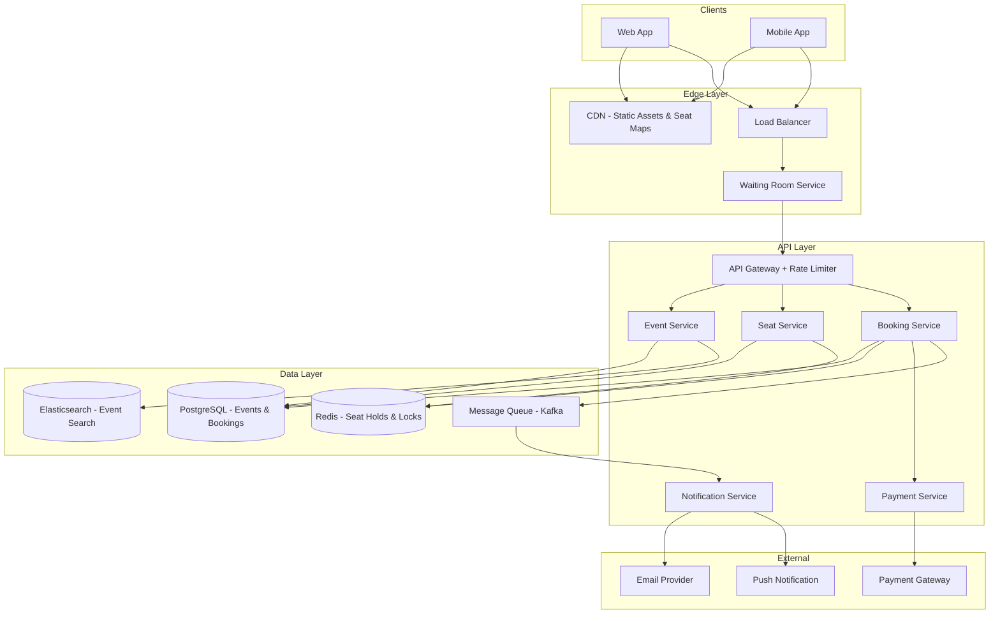
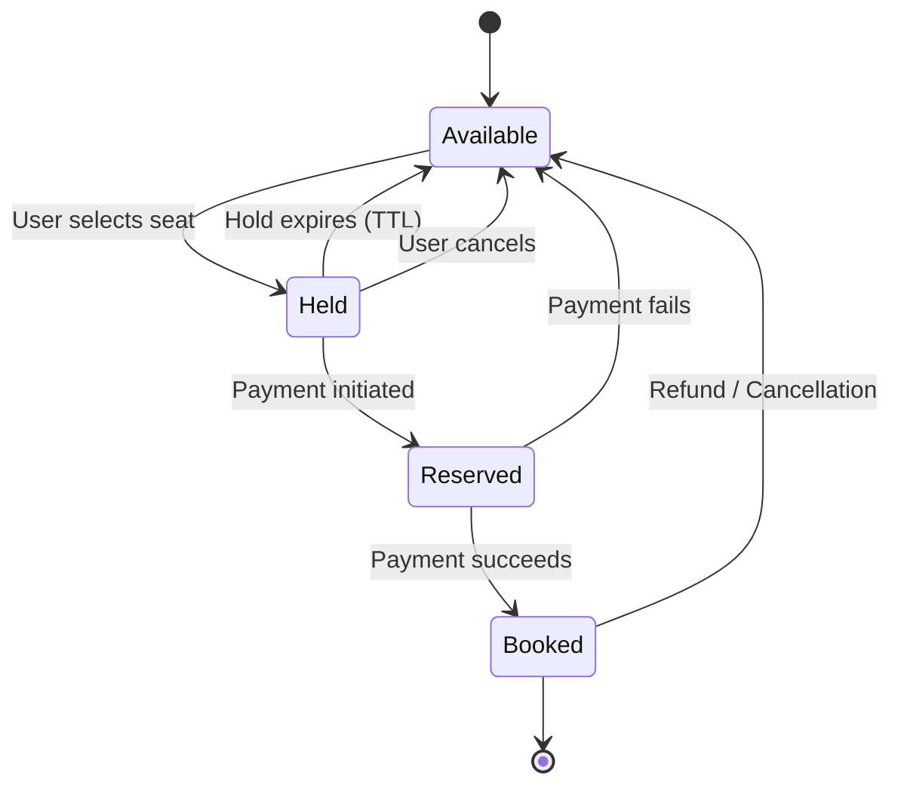
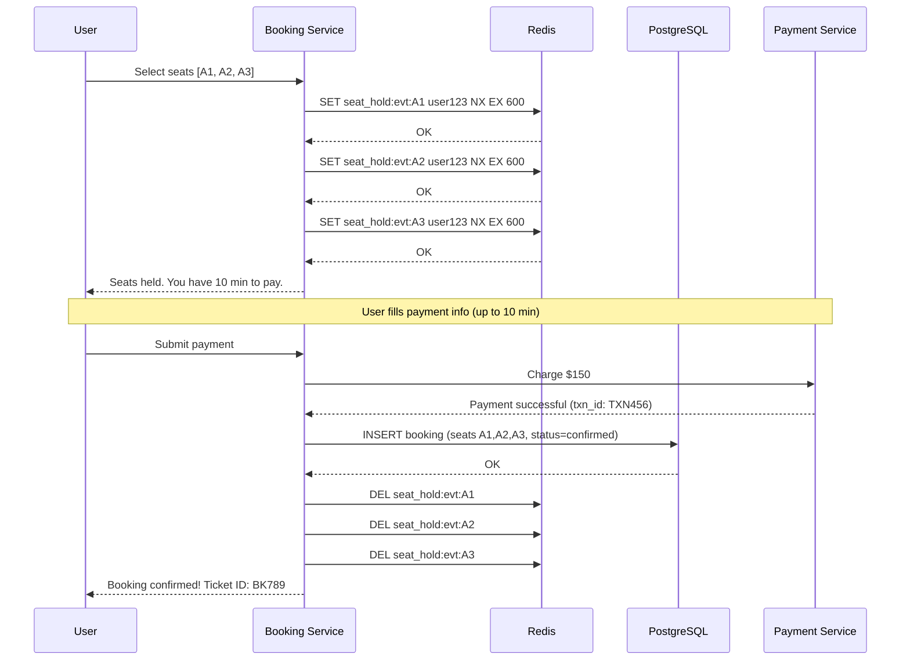
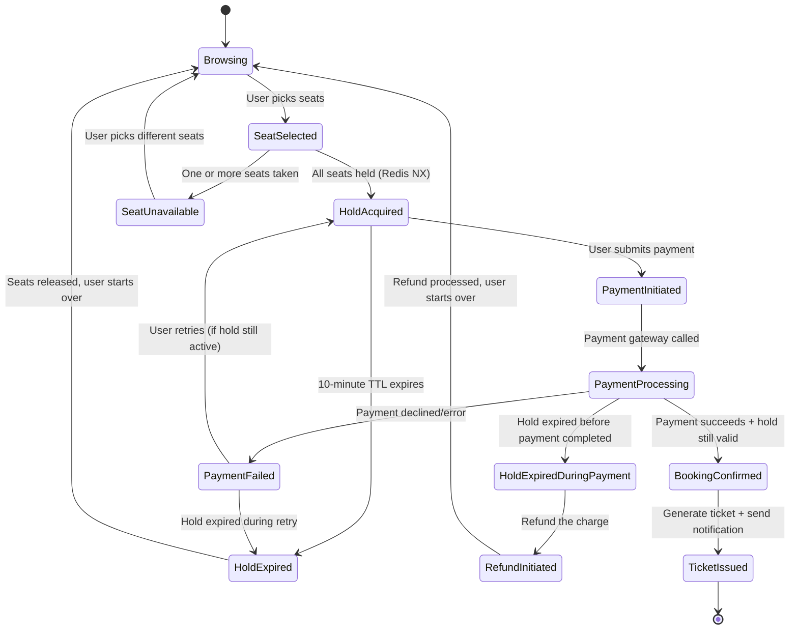
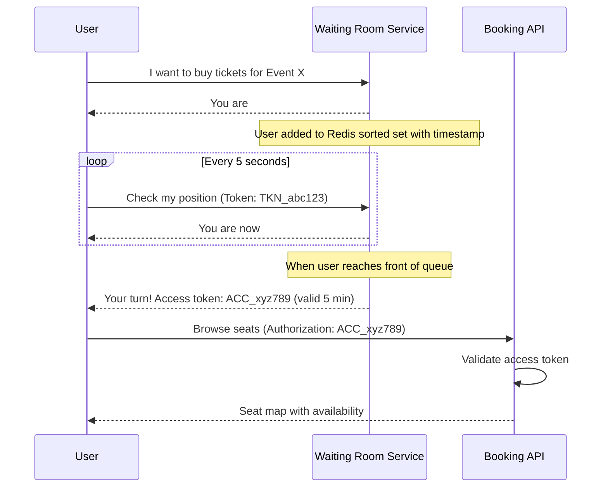
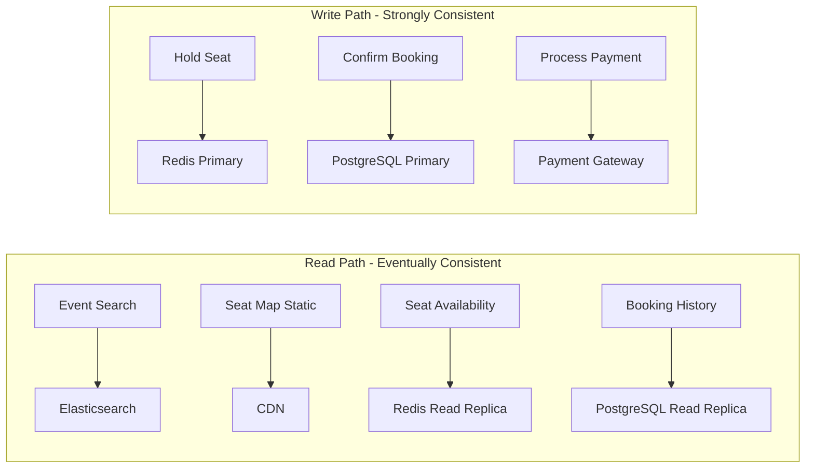

# System Design Interview: Ticket Booking System
### BookMyShow / Ticketmaster Scale

> [!NOTE]
> **Staff Engineer Interview Preparation Guide** — High Level Design Round

---

## Table of Contents

1. [Problem Clarification & Requirements](#1-problem-clarification--requirements)
2. [Capacity Estimation & Scale](#2-capacity-estimation--scale)
3. [High-Level Architecture](#3-high-level-architecture)
4. [Core Components Deep Dive](#4-core-components-deep-dive)
5. [Seat Inventory Management](#5-seat-inventory-management)
6. [Concurrency Control](#6-concurrency-control)
7. [Temporary Hold Pattern](#7-temporary-hold-pattern)
8. [Booking Flow & State Machine](#8-booking-flow--state-machine)
9. [Payment Integration](#9-payment-integration)
10. [Virtual Queue & Waiting Room](#10-virtual-queue--waiting-room)
11. [Flash Sale Handling](#11-flash-sale-handling)
12. [Data Models & Storage](#12-data-models--storage)
13. [Scalability Strategies](#13-scalability-strategies)
14. [Design Trade-offs & Justifications](#14-design-trade-offs--justifications)
15. [Interview Cheat Sheet](#15-interview-cheat-sheet)

---

## 1. Problem Clarification & Requirements

> [!TIP]
> **Interview Tip:** Ticket booking is fundamentally a resource contention problem. The core engineering challenge is not building a CRUD app for events — it is preventing two people from buying the same seat while keeping the system responsive under extreme demand spikes. Frame your answer around concurrency and inventory management from the very beginning.

### Questions to Ask the Interviewer

| Category | Question | Why It Matters |
|----------|----------|----------------|
| **Scale** | How many events per day? What is the largest venue capacity? | Determines seat inventory size and write throughput |
| **Concurrency** | Do we need assigned seating or general admission? | Assigned seating drastically increases contention complexity |
| **Flash sales** | Are there Taylor-Swift-scale events where millions try to buy at once? | Requires virtual queue / waiting room architecture |
| **Hold time** | How long do we hold seats during the payment window? | Impacts seat turnover and user experience |
| **Payment** | Single payment provider or multiple? Refunds? | Payment failure handling complexity |
| **Geography** | Single country or global events? | Multi-region deployment, currency handling |
| **Resale** | Do we support ticket transfers or a secondary market? | Adds ownership transfer logic |
| **Notifications** | Real-time availability updates? Waitlist? | Push notification infrastructure |

---

### Functional Requirements (Agreed Upon)

- Users can browse and search events by location, date, category, and artist
- Users can view a venue's seat map with real-time availability
- Users can select one or more seats and initiate a booking
- Selected seats are temporarily held (10 minutes) while the user completes payment
- On successful payment, the booking is confirmed and tickets are issued
- On payment failure or timeout, the held seats are released back to the pool
- Users receive booking confirmation via email and push notification
- Event organizers can create events, define venue layouts, and set pricing tiers
- Users can view their booking history and download tickets

### Non-Functional Requirements

- **Consistency:** No double-booking — a seat must never be sold to two users simultaneously
- **Availability:** 99.99% uptime; the system must remain responsive during high-demand events
- **Latency:** Seat selection and hold acquisition must complete in < 500ms
- **Scale:** Handle 50K concurrent users competing for seats during flash sales
- **Throughput:** Handle up to 100K seat hold requests per second during peak events
- **Durability:** Once a booking is confirmed, it must never be lost (zero data loss)
- **Fairness:** Users who arrive first should have priority access during high-demand events

---

## 2. Capacity Estimation & Scale

> [!TIP]
> **Interview Tip:** Ticket booking has an extremely spiky traffic pattern. Average throughput might be modest, but a single popular event announcement can spike traffic 1000x. Your capacity estimates must address both steady-state and flash-sale scenarios separately.

### Traffic Estimation

```
Events per year           = 10 Million
Average seats per event   = 5,000
Total seats per year      = 50 Billion seat-slots

Daily bookings (avg)      = 10M events * avg 0.5 booking days each / 365
                          ~ 500K bookings/day (steady state)

Steady-state QPS:
  500K / 86,400 = ~6 bookings/sec
  With browsing + seat map views: ~600 reads/sec

Flash sale scenario (single popular event):
  50,000 concurrent users
  Each user loads seat map + selects seats within first 60 seconds
  Seat map requests: 50K / 60 = ~833/sec
  Seat hold requests: 50K / 120 = ~417/sec (staggered over 2 min)
  Peak burst: 5,000 hold requests/sec (first few seconds)
```

### Storage Estimation

```
Event record:
  - Event metadata     = ~2 KB (name, description, date, venue, artist)
  - 10M events/year    = 20 GB/year

Seat inventory:
  - Seat record        = ~200 bytes (seat_id, section, row, number, price_tier, status)
  - 50 Billion seats   = 10 TB/year (but most are ephemeral)
  - Active inventory   = ~500M seats at any time = 100 GB

Booking records:
  - Booking + payment  = ~1 KB
  - 500K/day           = 500 MB/day = ~180 GB/year

Seat holds (Redis):
  - Hold entry         = ~100 bytes (seat_id, user_id, expiry)
  - Peak active holds  = 500K = 50 MB (easily fits in memory)
```

### Bandwidth

```
Seat map payload:
  - Large venue (50K seats) = ~500 KB (compressed SVG + seat status JSON)
  - 50K concurrent users loading seat map = 25 GB burst
  - CDN absorbs most of this; dynamic seat status is ~50 KB per request

API traffic:
  - Steady state: ~10 MB/sec
  - Flash sale peak: ~500 MB/sec
```

---

## 3. High-Level Architecture

> [!TIP]
> **Interview Tip:** Draw the architecture with clear separation between the read path (browsing events, viewing seat maps) and the write path (holding seats, processing payments). The read path can be heavily cached; the write path requires strong consistency. This separation is what allows you to handle flash sale spikes.



### Component Responsibilities

| Component | Responsibility | Scaling Strategy |
|-----------|---------------|-----------------|
| **Event Service** | CRUD for events, search, browse | Horizontal scaling, Elasticsearch for search |
| **Seat Service** | Seat map rendering, real-time availability | Read replicas + Redis cache for availability |
| **Booking Service** | Orchestrates hold -> pay -> confirm flow | Stateless, horizontally scaled |
| **Payment Service** | Integrates with payment gateway, handles idempotency | Isolated to contain blast radius of payment failures |
| **Waiting Room** | Virtual queue for high-demand events | Separate infra to absorb traffic spikes |
| **Notification Service** | Async booking confirmations, reminders | Consumer-based scaling off Kafka |

---

## 4. Core Components Deep Dive

### Event Service

The event service is the read-heavy component of the system. It serves event browsing, searching, and detail pages.

```
Event Search Flow:
  1. User types "Taylor Swift NYC"
  2. API Gateway routes to Event Service
  3. Event Service queries Elasticsearch with:
     - Full-text match on event name / artist
     - Geo filter on user's city
     - Date range filter
     - Availability filter (events with remaining seats)
  4. Results are ranked by relevance + date proximity
  5. Response includes event metadata + venue summary + price range
```

> [!NOTE]
> Event data changes infrequently (organizer creates event once, updates rarely). This makes it an excellent candidate for aggressive caching. Use a CDN for event detail pages with a 5-minute TTL, and invalidate on update.

### Venue and Seat Map Service

The seat map is the most visually complex part of the system. It must show real-time seat availability while handling thousands of concurrent viewers.

**Architecture Decision: Static Map + Dynamic Overlay**

The seat map is split into two layers:

1. **Static layer** — The venue layout (sections, rows, seat positions) is rendered as an SVG and served via CDN. This never changes for a given venue.
2. **Dynamic layer** — Seat availability status (available, held, sold) is fetched as a lightweight JSON overlay and merged client-side.

```
Static SVG (CDN-cached):
  - Section boundaries, row labels, seat positions
  - Served once, cached indefinitely per venue
  - Size: 200-500 KB compressed

Dynamic status JSON (real-time):
  - Array of seat_id -> status mappings
  - Only includes non-available seats (held + sold)
  - Much smaller: 5-50 KB for a 50K-seat venue
  - TTL: 2-5 seconds, fetched via polling or SSE
```

> [!TIP]
> **Interview Tip:** Mention the static + dynamic split. It shows you understand that serving a full seat map with real-time status to 50K concurrent users is not feasible as a single monolithic API call. The static portion is cacheable; only the small dynamic portion needs real-time updates.

---

## 5. Seat Inventory Management

> [!WARNING]
> **The Double-Booking Problem** is the single most critical correctness requirement in this system. If two users can purchase the same seat, the system has fundamentally failed. Every design decision in this section is driven by preventing this scenario.

### Seat States

A seat transitions through a well-defined set of states:



### Seat Status Storage

We maintain seat status in two places, each serving a different purpose:

| Storage | What it holds | Why |
|---------|--------------|-----|
| **Redis** | Active holds (seat_id -> user_id with TTL) | Sub-millisecond reads for availability checks, automatic expiry |
| **PostgreSQL** | Confirmed bookings (seat_id, booking_id, status) | ACID guarantees, permanent record, source of truth |

**Key insight:** Redis is the first line of defense for concurrency. When a user tries to hold a seat, we first check Redis. Only after payment succeeds do we write the confirmed booking to PostgreSQL.

### Real-Time Availability

```
Availability Check Flow:
  1. Client requests seat status for event E, section S
  2. Seat Service checks Redis for held seats in (E, S)
  3. Seat Service queries PostgreSQL for booked seats in (E, S)
  4. Combine: available = all_seats - held - booked
  5. Return status array to client
  6. Client merges with static SVG map

Optimization: Cache the combined result with 2-second TTL
  - During flash sales, stale-by-2-seconds is acceptable
  - Dramatically reduces PostgreSQL load
```

---

## 6. Concurrency Control

> [!TIP]
> **Interview Tip:** This is the section that separates a good answer from a great one. Be prepared to discuss three approaches — optimistic locking, pessimistic locking, and distributed locks — and explain why you chose one over the others for this specific use case.

### Approach 1: Pessimistic Locking (Database Row Lock)

```sql
BEGIN;
SELECT * FROM seats
WHERE event_id = ? AND seat_id = ? AND status = 'available'
FOR UPDATE;

-- If row returned, seat is available. Lock held until commit.
UPDATE seats SET status = 'held', held_by = ?, held_until = NOW() + INTERVAL '10 minutes'
WHERE event_id = ? AND seat_id = ?;
COMMIT;
```

**Pros:**
- Simple to implement and reason about
- Strong consistency — no race conditions possible
- Database handles all locking semantics

**Cons:**
- Locks are held for the duration of the transaction
- Under high contention (1000 users clicking the same seat), connections pile up waiting for locks
- Database becomes the bottleneck — cannot scale horizontally
- Risk of deadlocks when users select multiple seats

### Approach 2: Optimistic Locking (Version-Based)

```sql
-- Read current version
SELECT seat_id, status, version FROM seats
WHERE event_id = ? AND seat_id = ?;

-- Attempt update with version check
UPDATE seats
SET status = 'held', held_by = ?, held_until = NOW() + INTERVAL '10 minutes', version = version + 1
WHERE event_id = ? AND seat_id = ? AND status = 'available' AND version = ?;

-- If rows_affected = 0, someone else got it first -> retry or show "seat taken"
```

**Pros:**
- No long-held locks — reads are non-blocking
- Works well when contention is moderate
- Simple implementation

**Cons:**
- Under extreme contention (flash sales), almost every attempt fails and retries
- Retry storms can actually increase load on the database
- Multiple seat selection requires careful handling (all-or-nothing)

### Approach 3: Distributed Lock (Redis) -- Recommended

```
HOLD_SEAT(event_id, seat_id, user_id):
  lock_key = "seat_hold:{event_id}:{seat_id}"

  result = Redis.SET(lock_key, user_id, NX, EX, 600)
  // NX = only set if not exists
  // EX 600 = expire in 600 seconds (10 min)

  if result == OK:
    return SUCCESS  // Seat held for this user
  else:
    return ALREADY_HELD  // Another user has this seat
```

**Pros:**
- Sub-millisecond operation — Redis SET with NX is O(1)
- Automatic expiry via TTL — no background cleanup needed
- No database contention for the hold phase
- Horizontally scalable (Redis Cluster)
- Atomic — SET NX guarantees exactly one winner

**Cons:**
- Redis is not the permanent source of truth — need PostgreSQL for confirmed bookings
- Redis failure could cause temporary inability to hold seats (mitigated by Redis Cluster)
- Need careful handling of the Redis -> PostgreSQL transition during payment confirmation

> [!IMPORTANT]
> **Recommended approach:** Use Redis distributed locks for the hold phase, then PostgreSQL for the final booking confirmation. This gives you the speed of Redis for the high-contention seat selection phase and the durability of PostgreSQL for the permanent booking record.

### Comparison Summary

| Criteria | Pessimistic Lock | Optimistic Lock | Redis Distributed Lock |
|----------|-----------------|----------------|----------------------|
| **Latency** | High (lock wait) | Low (no locks) | Very low (sub-ms) |
| **Contention handling** | Queues waiters | Fails fast + retry | Fails fast, no retry needed |
| **Flash sale performance** | Poor (connection exhaustion) | Moderate (retry storms) | Excellent |
| **Complexity** | Low | Medium | Medium |
| **Data durability** | Built-in (RDBMS) | Built-in (RDBMS) | Needs separate confirmation step |
| **Scalability** | Limited by DB | Limited by DB | Redis Cluster scales horizontally |

---

## 7. Temporary Hold Pattern

> [!NOTE]
> The temporary hold is the bridge between "I want this seat" and "I have paid for this seat." It must be long enough for the user to complete payment (typically 10 minutes) but short enough that unsold seats are not locked up indefinitely. The design must handle the case where a user abandons the booking mid-flow.

### Redis TTL-Based Hold Design



### Multi-Seat Atomicity

When a user selects multiple seats, we need all-or-nothing semantics. If seat A1 is available but A2 is already held, we should not hold A1 alone.

```
HOLD_MULTIPLE_SEATS(event_id, seat_ids, user_id):
  held = []
  for seat_id in seat_ids:
    result = Redis.SET("seat_hold:{event_id}:{seat_id}", user_id, NX, EX, 600)
    if result == OK:
      held.append(seat_id)
    else:
      // Rollback: release all seats we already held
      for held_seat in held:
        Redis.DEL("seat_hold:{event_id}:{held_seat}")
      return FAILURE("Seat {seat_id} is no longer available")

  return SUCCESS(held)
```

> [!WARNING]
> **Race condition alert:** The loop above is not fully atomic. Between holding seat A1 and attempting seat A2, another user could grab A1. For truly atomic multi-seat holds, use a Redis Lua script that executes all SET NX operations in a single atomic block.

**Lua Script for Atomic Multi-Seat Hold:**

```lua
-- KEYS: list of seat hold keys
-- ARGV[1]: user_id, ARGV[2]: TTL in seconds

-- First, check all seats are available
for i, key in ipairs(KEYS) do
  if redis.call('EXISTS', key) == 1 then
    return 0  -- At least one seat is taken
  end
end

-- All available, hold them all
for i, key in ipairs(KEYS) do
  redis.call('SET', key, ARGV[1], 'EX', ARGV[2])
end

return 1  -- All seats held successfully
```

### Hold Expiry and Cleanup

Redis TTL handles expiry automatically. When a hold expires:

1. The Redis key disappears — seat becomes available for others
2. No explicit cleanup needed
3. The booking service should also track holds in a `pending_bookings` table for audit purposes

**Edge case — Payment completes after hold expires:**

```
Scenario:
  1. User holds seat at T=0, TTL=600s
  2. User's payment is slow, completes at T=620s
  3. Meanwhile, at T=601s, another user holds the same seat
  4. Original user's payment confirmation arrives

Solution:
  - Before confirming booking, re-verify the hold:
    if Redis.GET("seat_hold:evt:A1") != user_id:
      REFUND payment
      return "Sorry, your seat hold expired and the seat was taken"
  - This is the safety check that prevents double-booking
```

---

## 8. Booking Flow & State Machine

### Complete Booking Lifecycle



### Compensating Transactions

> [!IMPORTANT]
> In a distributed system, you cannot rely on a single database transaction spanning seat hold, payment, and booking confirmation. Instead, use compensating transactions (the Saga pattern) to handle failures at each step.

| Step | Action | Compensation on Failure |
|------|--------|------------------------|
| 1 | Hold seats in Redis | Release holds (DEL keys) |
| 2 | Create pending booking in DB | Mark booking as cancelled |
| 3 | Charge payment | Initiate refund via payment gateway |
| 4 | Confirm booking in DB | (Cannot fail if step 3 succeeded — use retries) |
| 5 | Release holds in Redis | (Cleanup — holds are no longer needed) |
| 6 | Send confirmation notification | Retry async via message queue |

**Failure at each step:**

- **Step 1 fails:** Seat is taken. Inform user immediately. No compensation needed.
- **Step 2 fails:** Database error. Release Redis holds. Retry or inform user.
- **Step 3 fails:** Payment declined. Release Redis holds. Mark pending booking as cancelled.
- **Step 4 fails:** Booking confirmation write fails. This is critical — payment was already charged. Retry with exponential backoff. If all retries fail, alert operations team and queue for manual resolution. Never refund automatically at this stage without human review.
- **Step 5 fails:** Redis DEL fails. Not critical — TTL will expire the holds anyway.
- **Step 6 fails:** Notification failure. Retry via dead letter queue. Booking is still valid.

---

## 9. Payment Integration

> [!TIP]
> **Interview Tip:** Payment integration in a booking system has a unique challenge: the thing being purchased (a seat) has a time-limited hold. If the payment takes too long, the hold expires and we must refund. This time-pressure makes idempotency and timeout handling especially critical.

### Idempotency

Every payment request must include an idempotency key to prevent double charges:

```
Payment Request:
  POST /api/payment/charge
  {
    "idempotency_key": "booking_BK789_attempt_1",
    "amount": 15000,        // cents
    "currency": "USD",
    "payment_method": "pm_card_visa_123",
    "booking_id": "BK789"
  }
```

The idempotency key is derived from the booking ID + attempt number. If the same request is sent twice (due to network retry, user double-click, etc.), the payment gateway returns the same result without charging again.

### Timeout Handling

```
Payment Timeout Strategy:

1. Set a payment gateway timeout of 30 seconds
2. If timeout occurs:
   a. Do NOT assume payment failed
   b. Query the payment gateway for transaction status
   c. If confirmed: proceed with booking
   d. If not found: safe to retry with same idempotency key
   e. If pending: wait and poll (up to 3 retries, 10s apart)
   f. If still pending after all retries: hold the booking in "payment_pending" state
      and resolve asynchronously via webhook from payment gateway
```

### Payment Gateway Webhook

```
Payment Gateway -> Our System:
  POST /webhooks/payment
  {
    "event": "payment.completed",
    "transaction_id": "TXN456",
    "idempotency_key": "booking_BK789_attempt_1",
    "status": "succeeded",
    "amount": 15000
  }

On receiving webhook:
  1. Verify webhook signature (HMAC)
  2. Look up booking by idempotency_key
  3. If booking is in "payment_pending" state, confirm it
  4. If booking is already confirmed, ignore (idempotent)
  5. If booking was cancelled (hold expired), initiate refund
```

---

## 10. Virtual Queue & Waiting Room

> [!TIP]
> **Interview Tip:** The waiting room is what separates a system that crashes during Taylor Swift ticket sales from one that handles them gracefully. This is a load-shedding mechanism that protects your backend by controlling the rate at which users reach the booking flow.

### Why a Waiting Room?

When a high-demand event goes on sale:

- 500K users hit the site simultaneously
- The booking system can handle ~5K concurrent seat selection flows
- Without a queue: the system is overwhelmed, everyone gets errors, and the experience is terrible
- With a queue: users wait in an orderly line, and the system processes them at a sustainable rate

### Token-Based Queue Design



### Queue Implementation

```
Data Structure: Redis Sorted Set
  Key: "waiting_room:{event_id}"
  Score: timestamp of join (for FIFO ordering)
  Member: user_token

Admission Rate:
  - Configurable per event (default: 500 users/minute)
  - Background job runs every second:
    1. Pop N users from the sorted set (ZPOPMIN)
    2. Generate access tokens for them (JWT with 5-min expiry)
    3. Push access tokens to a notification channel (SSE/WebSocket)
    4. Users receive their access token and can proceed to booking

Token Validation:
  - Access tokens are JWTs signed by the waiting room service
  - Booking API validates the JWT on every request
  - Token includes: user_id, event_id, issued_at, expires_at
  - If token is expired or invalid, redirect user back to waiting room
```

### Fairness Guarantees

| Mechanism | How It Ensures Fairness |
|-----------|------------------------|
| **Sorted set with timestamp** | First-come-first-served ordering |
| **One token per user per event** | Prevents a user from joining the queue multiple times |
| **Device fingerprinting** | Detects the same person using multiple browsers/devices |
| **CAPTCHA before joining queue** | Blocks simple bots from taking queue positions |
| **Rate limiting on join** | Prevents scripted mass-joins from a single IP |

> [!WARNING]
> Sophisticated scalpers use residential proxy networks and headless browsers to bypass simple bot detection. For truly high-value events, consider integrating with dedicated bot-detection services (e.g., Cloudflare Turnstile, Akamai Bot Manager) that use behavioral analysis.

---

## 11. Flash Sale Handling

Flash sales introduce load patterns that are fundamentally different from normal operations. The traffic is not just high — it is concentrated in a very short window (often the first 30 seconds).

### Rate Limiting Strategy

```
Rate Limiting Layers:

Layer 1 — CDN/Edge (Cloudflare, AWS CloudFront)
  - IP-based rate limiting: max 100 requests/min per IP
  - Drops obvious DDoS traffic before it reaches your infrastructure

Layer 2 — API Gateway
  - Token bucket per user: max 10 requests/sec
  - Adaptive throttling: if backend latency > 500ms, reduce admitted rate
  - Returns 429 Too Many Requests with Retry-After header

Layer 3 — Waiting Room (described above)
  - Controls the flow of users into the booking system
  - Admission rate tuned to backend capacity

Layer 4 — Seat Service
  - Per-event concurrency limit: max 5K concurrent hold attempts per event
  - Overflow goes to waiting room or receives "try again in X seconds"
```

### Queue-Based Processing for Holds

During flash sales, instead of processing seat holds synchronously, switch to an asynchronous queue-based model:

```
Normal mode (low traffic):
  User -> API -> Redis (hold seat) -> Response
  Latency: ~50ms

Flash sale mode (high traffic):
  User -> API -> Kafka (enqueue hold request) -> Response("processing")
  Background: Kafka Consumer -> Redis (hold seat) -> Notify user via SSE

Switching criteria:
  - When event is flagged as "high demand" by organizer
  - Or when concurrent hold requests exceed 1K/sec for an event
  - System automatically switches to queue mode
```

> [!NOTE]
> The queue-based approach introduces latency (user waits for async processing) but prevents system overload. Combined with the waiting room, it ensures that the system remains stable even under extreme load.

### Inventory Pre-partitioning

For very large venues, partition the seat inventory across multiple Redis instances to distribute the write load:

```
Partitioning Strategy:
  - Venue has 50K seats across 20 sections
  - Each section's seats are managed by a dedicated Redis shard
  - Section A-E -> Redis shard 1
  - Section F-J -> Redis shard 2
  - Section K-O -> Redis shard 3
  - Section P-T -> Redis shard 4

  This distributes the SET NX load across 4 Redis instances
  Each shard handles ~12.5K seats, reducing contention
```

---

## 12. Data Models & Storage

### Database Schema

```
Table: events
  - event_id          UUID PRIMARY KEY
  - name              VARCHAR(255)
  - description       TEXT
  - venue_id          UUID REFERENCES venues
  - event_date        TIMESTAMP WITH TIME ZONE
  - sale_start_date   TIMESTAMP WITH TIME ZONE
  - category          VARCHAR(50)  -- concert, sports, theater
  - artist_name       VARCHAR(255)
  - status            VARCHAR(20)  -- draft, on_sale, sold_out, completed, cancelled
  - is_high_demand    BOOLEAN DEFAULT FALSE
  - created_at        TIMESTAMP
  - updated_at        TIMESTAMP

Table: venues
  - venue_id          UUID PRIMARY KEY
  - name              VARCHAR(255)
  - city              VARCHAR(100)
  - country           VARCHAR(50)
  - total_capacity    INTEGER
  - seat_map_svg_url  VARCHAR(500)
  - created_at        TIMESTAMP

Table: sections
  - section_id        UUID PRIMARY KEY
  - venue_id          UUID REFERENCES venues
  - name              VARCHAR(50)  -- "Orchestra", "Balcony", "GA Floor"
  - price_tier_id     UUID REFERENCES price_tiers
  - total_seats       INTEGER
  - section_type      VARCHAR(20)  -- assigned, general_admission

Table: seats
  - seat_id           UUID PRIMARY KEY
  - section_id        UUID REFERENCES sections
  - event_id          UUID REFERENCES events
  - row_label         VARCHAR(10)  -- "A", "B", "AA"
  - seat_number       INTEGER
  - status            VARCHAR(20)  -- available, held, reserved, booked
  - price_cents       INTEGER
  - version           INTEGER DEFAULT 0  -- for optimistic locking fallback
  - INDEX (event_id, section_id, status)
  - UNIQUE (event_id, section_id, row_label, seat_number)

Table: bookings
  - booking_id        UUID PRIMARY KEY
  - user_id           UUID REFERENCES users
  - event_id          UUID REFERENCES events
  - status            VARCHAR(20)  -- pending, confirmed, cancelled, refunded
  - total_amount      INTEGER  -- in cents
  - currency          VARCHAR(3)
  - payment_id        UUID
  - created_at        TIMESTAMP
  - confirmed_at      TIMESTAMP
  - cancelled_at      TIMESTAMP

Table: booking_seats
  - booking_id        UUID REFERENCES bookings
  - seat_id           UUID REFERENCES seats
  - price_cents       INTEGER  -- price at time of booking
  - PRIMARY KEY (booking_id, seat_id)

Table: payments
  - payment_id        UUID PRIMARY KEY
  - booking_id        UUID REFERENCES bookings
  - amount_cents      INTEGER
  - currency          VARCHAR(3)
  - payment_method    VARCHAR(50)
  - gateway_txn_id    VARCHAR(100)
  - idempotency_key   VARCHAR(100) UNIQUE
  - status            VARCHAR(20)  -- pending, succeeded, failed, refunded
  - created_at        TIMESTAMP
  - completed_at      TIMESTAMP

Table: users
  - user_id           UUID PRIMARY KEY
  - email             VARCHAR(255) UNIQUE
  - name              VARCHAR(100)
  - phone             VARCHAR(20)
  - created_at        TIMESTAMP
```

### Database Choice Justification

| Data | Database | Rationale |
|------|----------|-----------|
| **Events, Bookings, Payments, Seats** | PostgreSQL | ACID transactions are critical for booking correctness. No double-booking guarantee requires serializable transactions for the final confirmation step. |
| **Seat Holds** | Redis | Sub-millisecond SET NX for hold acquisition. TTL for automatic expiry. No need for durability — holds are temporary by definition. |
| **Event Search** | Elasticsearch | Full-text search on event names, artists, descriptions. Faceted filtering by category, date, city. |
| **Waiting Room Queue** | Redis (Sorted Set) | O(log N) insertion and O(1) pop for FIFO queue. Built-in sorted set is perfect for timestamp-ordered queues. |
| **Notifications** | Kafka | Decouples booking confirmation from notification delivery. Guarantees at-least-once delivery. |

### Indexing Strategy

```sql
-- Fast seat availability lookups
CREATE INDEX idx_seats_event_status ON seats(event_id, status);

-- Booking lookups by user
CREATE INDEX idx_bookings_user ON bookings(user_id, created_at DESC);

-- Payment idempotency
CREATE UNIQUE INDEX idx_payments_idempotency ON payments(idempotency_key);

-- Event search by date and status
CREATE INDEX idx_events_date_status ON events(event_date, status);
```

---

## 13. Scalability Strategies

### Sharding Strategy

> [!TIP]
> **Interview Tip:** Ticket booking is one of the clearest use cases for sharding by event_id. Bookings for different events are completely independent of each other, making event_id a natural shard key with zero cross-shard queries during the booking flow.

**Shard key: event_id**

```
Shard routing:
  shard_number = hash(event_id) % num_shards

Benefits:
  - All data for an event (seats, bookings, payments) lives on the same shard
  - The booking transaction (hold verification + booking insert) never crosses shards
  - Popular events can be assigned to dedicated shards (hot-shard mitigation)
  - Independent events do not contend with each other

Drawback:
  - User's booking history spans multiple shards
  - Solution: Maintain a lightweight user_bookings lookup table in a separate DB
    or use eventual consistency (query all shards, merge results)
```

### Horizontal Scaling

| Component | Scaling Approach |
|-----------|-----------------|
| **API Gateway** | Auto-scale pods behind load balancer based on request rate |
| **Booking Service** | Stateless — scale to any number of instances |
| **Redis (Seat Holds)** | Redis Cluster with hash slots; shard by event_id prefix |
| **PostgreSQL** | Read replicas for seat availability reads; primary for writes |
| **Elasticsearch** | Multi-node cluster with sharding by event category |
| **Kafka** | Partition by event_id; add partitions as throughput grows |

### Caching Strategy

```
Caching Layers:

1. CDN (Cloudflare/CloudFront)
   - Static venue maps (SVG): Cache indefinitely, versioned URL
   - Event detail pages: Cache 5 min, purge on update

2. Application Cache (Redis)
   - Event metadata: 5-min TTL
   - Section-level availability summary: 2-sec TTL (high-demand events)
   - Seat-level availability: Not cached — always check Redis holds + DB

3. Client-Side Cache
   - Event list/search results: 30-sec cache
   - Seat map SVG: Cached until venue changes
   - Seat status: Polled every 2-5 seconds (no caching)
```

### Read vs Write Path Separation



---

## 14. Design Trade-offs & Justifications

### Trade-off 1: Consistency vs Availability for Seat Status

| Option | Description | Chosen? |
|--------|-------------|---------|
| **Strong consistency** | Every seat status read reflects the latest state | For writes (booking confirmation) |
| **Eventual consistency** | Seat status may be stale by a few seconds | For reads (seat map display) |

**Justification:** We accept eventual consistency for displaying seat availability (a seat might show as available when it was just held 1 second ago). But we enforce strong consistency for the actual hold operation (Redis SET NX is atomic) and booking confirmation (PostgreSQL transaction).

### Trade-off 2: Optimistic vs Pessimistic Locking

We chose **Redis distributed locks** over database-level locking because the hold phase has extremely high contention during flash sales. Database locks would become the bottleneck. Redis SET NX provides the same mutual-exclusion guarantee with sub-millisecond latency.

### Trade-off 3: Hold Duration

| Shorter Hold (5 min) | Longer Hold (15 min) |
|----------------------|---------------------|
| Seats return to pool faster | Users have more time to pay |
| Higher seat turnover during flash sales | Less pressure on users |
| More "seat expired" errors for slow users | More "phantom holds" blocking seats |

**Chosen: 10 minutes** as a balanced default, configurable per event. High-demand events may use 5-minute holds.

### Trade-off 4: Synchronous vs Async Booking

| Synchronous | Asynchronous (Queue-based) |
|-------------|---------------------------|
| User gets immediate confirmation | User gets "processing" then notification |
| Simpler implementation | Better load handling during spikes |
| Can fail under extreme load | Degrades gracefully |

**Chosen:** Synchronous for normal load, automatic switch to async during flash sales (detected by monitoring concurrent hold requests per event).

### Trade-off 5: Seat-Level vs Section-Level Inventory

| Seat-Level (Assigned Seating) | Section-Level (General Admission) |
|------------------------------|----------------------------------|
| Each individual seat is tracked | Only total count per section matters |
| Higher storage and contention | Simple counter decrement |
| Better user experience for concerts, theaters | Sufficient for GA events, festivals |

**Chosen:** Support both. Assigned seating uses the full seat hold mechanism. General admission uses atomic counter decrements in Redis (DECR with LUA script to prevent going below zero).

---

## 15. Interview Cheat Sheet

> [!TIP]
> **Use this as a quick reference before your interview. The key differentiators for a Staff-level answer are: (1) articulating the concurrency control approach clearly, (2) explaining the temporary hold pattern with TTL-based expiry, (3) discussing the waiting room for flash sales, and (4) handling payment edge cases (timeout, double-charge, hold expiry during payment).**

### 30-Second Pitch

"A ticket booking system is a resource contention problem. The core challenge is preventing double-booking while maintaining sub-second latency for seat selection under extreme concurrency. I would use a Redis-based distributed lock with TTL for temporary seat holds, PostgreSQL for confirmed bookings with ACID guarantees, a virtual queue/waiting room to absorb flash sale spikes, and the Saga pattern for coordinating the hold-pay-confirm flow with compensating transactions on failure."

### Key Numbers to Remember

| Metric | Value |
|--------|-------|
| Steady-state booking QPS | ~6/sec |
| Flash sale peak seat holds | 5,000/sec |
| Seat hold TTL | 10 minutes |
| Seat availability cache TTL | 2 seconds |
| Waiting room admission rate | 500 users/min (configurable) |
| Payment timeout | 30 seconds |
| Target booking latency | < 500ms (non-flash-sale) |

### Common Follow-Up Questions

**Q: How do you handle a user who selects 4 seats and 2 are taken?**
A: Atomic multi-seat hold via Redis Lua script. All-or-nothing semantics. If any seat is taken, none are held — user must re-select.

**Q: What happens if Redis goes down?**
A: Fall back to PostgreSQL pessimistic locking (SELECT FOR UPDATE). Higher latency but still correct. Redis Cluster with replicas makes full outage unlikely.

**Q: How do you prevent scalpers/bots?**
A: Multi-layered: CAPTCHA before entering queue, rate limiting per user/IP, device fingerprinting, one-booking-per-user-per-event limit, identity verification for high-value events.

**Q: How do you handle partial refunds?**
A: Each seat in a booking can be individually cancelled. Payment service issues partial refund for cancelled seats. Booking status changes to "partially_cancelled."

**Q: How would you handle a venue layout change after some seats are sold?**
A: Never modify existing seat records that have bookings. Create a new section/seat mapping and migrate unsold seats. Sold seats retain their original mapping.

**Q: How do you detect and handle stuck holds (Redis TTL failed to expire)?**
A: Background sweeper job runs every minute, queries Redis for holds older than TTL + buffer. In practice, Redis TTL is extremely reliable — this is a defense-in-depth measure.

### Architecture Diagram (Simplified)

```
User -> CDN (static maps) -> LB -> Waiting Room -> API Gateway
  -> Event Service (search/browse) -> Elasticsearch, PostgreSQL
  -> Seat Service (availability) -> Redis (holds), PostgreSQL (booked)
  -> Booking Service (hold/pay/confirm) -> Redis + PostgreSQL + Payment Gateway
  -> Notification Service (async) <- Kafka <- Booking Service
```

### The Three Guarantees

1. **No double-booking:** Redis SET NX for holds + PostgreSQL UNIQUE constraint on (event_id, seat_id) for confirmed bookings
2. **No lost bookings:** PostgreSQL durability + synchronous replication + payment idempotency keys
3. **No permanent seat locks:** Redis TTL auto-expires holds + background sweeper as safety net

---

> [!NOTE]
> **Final thought for the interview:** The ticket booking system is deceptively simple on the surface but reveals deep distributed systems challenges when you consider flash sale concurrency, payment failure modes, and fairness. The key architectural insight is separating the high-contention hold phase (Redis) from the durable confirmation phase (PostgreSQL), and using the waiting room as a load-shedding mechanism to protect the entire system during demand spikes.
