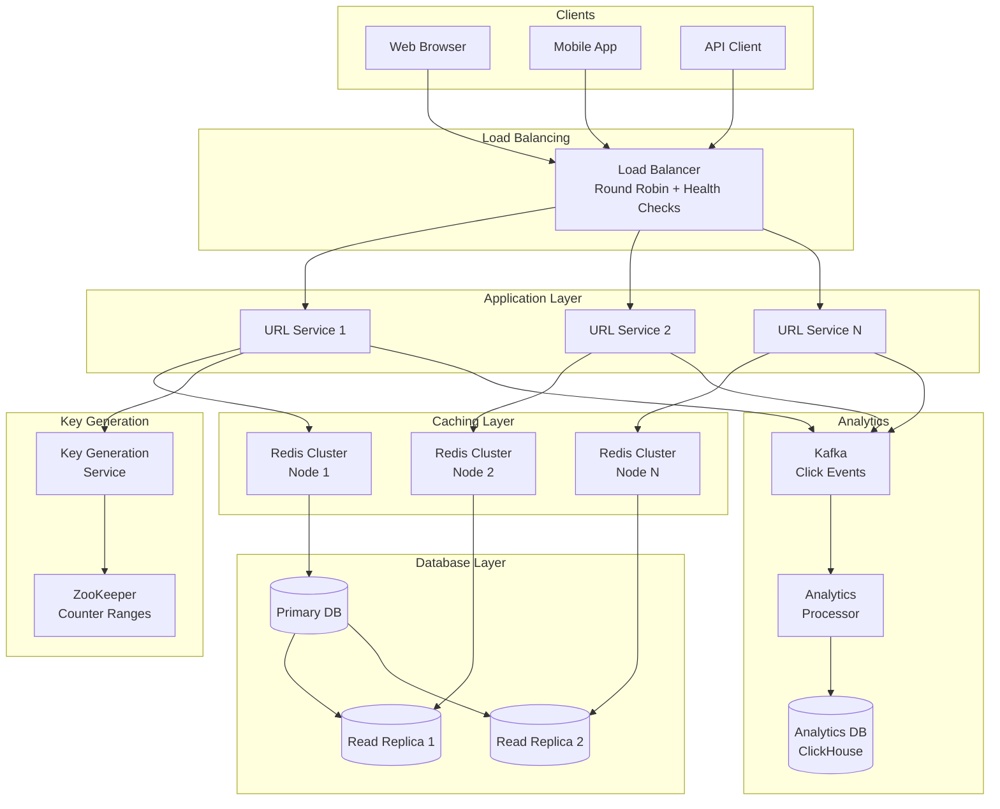
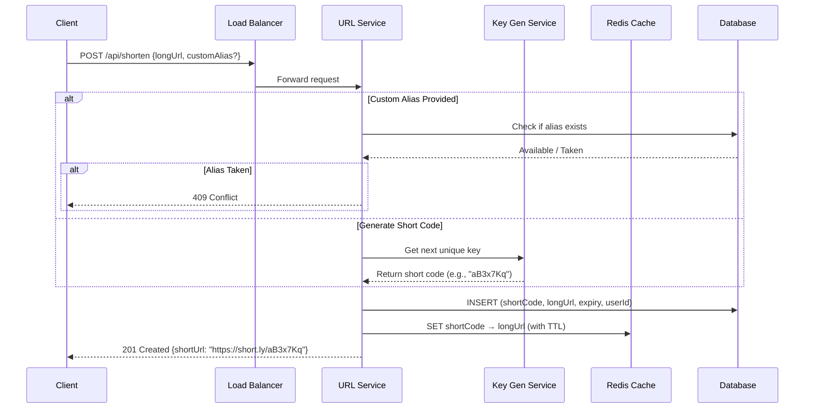
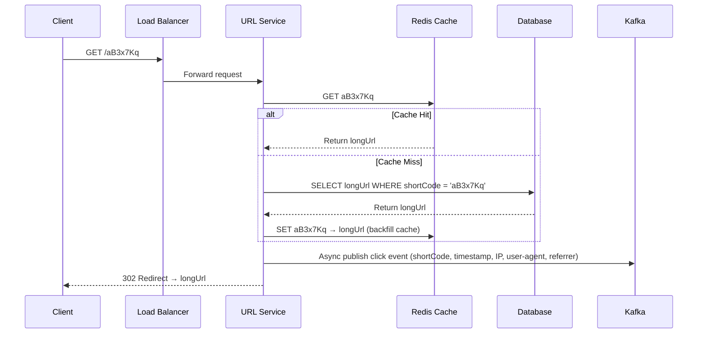
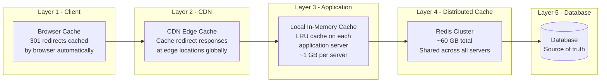
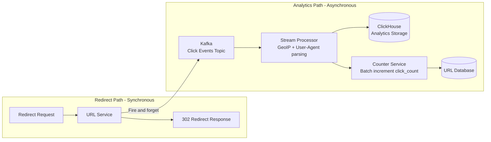
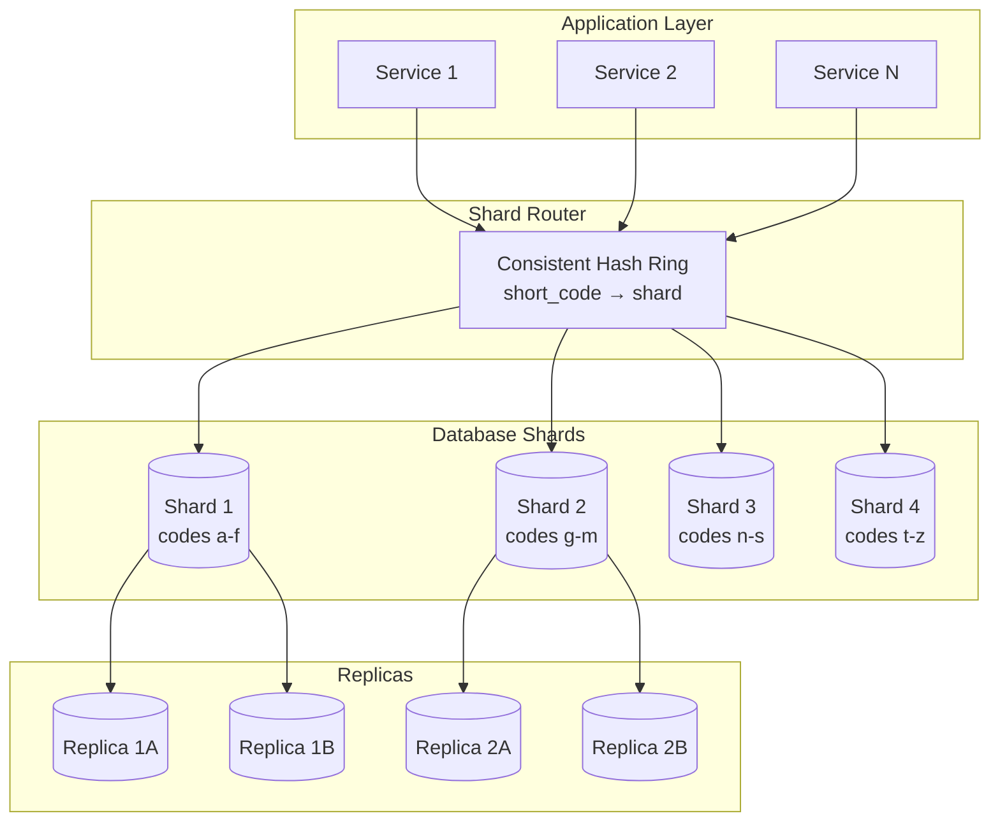

# System Design Interview: URL Shortener
### TinyURL / Bit.ly Scale

> [!NOTE]
> **Staff Engineer Interview Preparation Guide** — High Level Design Round

---

## Table of Contents

1. [Problem Clarification & Requirements](#1-problem-clarification--requirements)
2. [Capacity Estimation & Scale](#2-capacity-estimation--scale)
3. [High-Level Architecture](#3-high-level-architecture)
4. [Core Components Deep Dive](#4-core-components-deep-dive)
5. [URL Encoding Strategies](#5-url-encoding-strategies)
6. [Data Models & Storage](#6-data-models--storage)
7. [Read-Heavy Optimization](#7-read-heavy-optimization)
8. [Redirect Strategy: 301 vs 302](#8-redirect-strategy-301-vs-302)
9. [Analytics & Tracking](#9-analytics--tracking)
10. [URL Expiration & Cleanup](#10-url-expiration--cleanup)
11. [Scalability Strategies](#11-scalability-strategies)
12. [Design Trade-offs & Justifications](#12-design-trade-offs--justifications)
13. [Interview Cheat Sheet](#13-interview-cheat-sheet)

---

## 1. Problem Clarification & Requirements

> [!TIP]
> **Interview Tip:** A URL shortener sounds simple, but it has surprising depth. Start by clarifying the exact scope. Many candidates jump into encoding schemes without understanding the full picture.

### Questions to Ask the Interviewer

| Category | Question | Why It Matters |
|----------|----------|----------------|
| **Scale** | How many URLs shortened per day? | Drives database and caching choices |
| **Read:Write** | What is the read-to-write ratio? | Determines caching strategy |
| **Length** | How short should the URLs be? | Constrains the encoding space |
| **Custom Aliases** | Can users pick their own short codes? | Adds uniqueness checking complexity |
| **Expiration** | Do URLs expire? Default TTL? | Storage reclamation, cleanup jobs |
| **Analytics** | Do we track clicks, referrers, geography? | Adds write amplification per redirect |
| **Authentication** | Do users need accounts to create URLs? | Affects rate limiting approach |
| **Availability** | What availability target? | Drives replication strategy |

---

### Functional Requirements (Agreed Upon)

- Given a long URL, generate a unique short URL
- When a user hits the short URL, redirect them to the original long URL
- Users can optionally pick a custom alias for the short URL
- URLs have a configurable expiration (default: 5 years)
- Basic analytics: click count, geographic breakdown, referrer info
- API access for programmatic URL shortening

### Non-Functional Requirements

- **Availability:** 99.99% uptime — redirects must always work
- **Latency:** Redirect latency < 10ms P99 (excluding network round-trip)
- **Scale:** 100 million new URLs per day, 10 billion redirects per day
- **Durability:** Once a short URL is created, it must never be lost within its TTL
- **Consistency:** No two long URLs should map to the same short code (uniqueness guarantee)

---

## 2. Capacity Estimation & Scale

> [!TIP]
> **Interview Tip:** Show your math step by step. Round numbers aggressively to keep the arithmetic clean. The point is demonstrating you can reason about scale, not that you can multiply precisely.

### Traffic Estimation

```
New URLs per day    = 100 Million
Read:Write ratio    = 100:1
Redirects per day   = 100M × 100 = 10 Billion

Write QPS = 100M / 86,400 ≈ 1,160 URLs/sec
Read QPS  = 10B / 86,400  ≈ 116,000 redirects/sec

Peak (2x average):
Write QPS = ~2,300/sec
Read QPS  = ~232,000/sec
```

### Storage Estimation

```
Each URL record:
  - Short code (7 chars)     = 7 bytes
  - Long URL (avg 200 chars) = 200 bytes
  - Created timestamp        = 8 bytes
  - Expiry timestamp         = 8 bytes
  - User ID (optional)       = 16 bytes
  - Click count              = 8 bytes
  - Overhead / padding       = ~60 bytes
  Total per record           ≈ 300 bytes

Per day:  100M × 300 bytes = 30 GB/day
Per year: 30 GB × 365      = ~11 TB/year
5 years:                    = ~55 TB

With replication (3x):      = ~165 TB
```

### Memory Estimation (Cache)

```
If we cache 20% of URLs (hot set, 80/20 rule):
Daily redirects = 10 Billion
Unique URLs accessed per day ≈ 1 Billion (many URLs accessed repeatedly)
20% of 1B = 200 Million URLs to cache

Cache memory = 200M × 300 bytes = 60 GB

This fits comfortably in a modern Redis cluster.
```

### Bandwidth Estimation

```
Incoming (writes): 1,160 × 300 bytes = ~350 KB/sec (negligible)
Outgoing (reads):  116,000 × 300 bytes = ~35 MB/sec

Including HTTP headers + redirect response (~500 bytes each):
116,000 × 500 = ~58 MB/sec outgoing

This is well within the capacity of modern load balancers.
```

---

## 3. High-Level Architecture

> [!TIP]
> **Interview Tip:** Draw the high-level architecture first, then go deep on each component. This shows you can think top-down before diving into details.



### URL Shortening Flow



### Redirect Flow



---

## 4. Core Components Deep Dive

> [!TIP]
> **Interview Tip:** The URL shortening service looks simple, but the key generation strategy is where senior engineers differentiate themselves. Be ready to compare at least 3 approaches with their trade-offs.

### 4.1 URL Service

The URL Service is a stateless HTTP server responsible for two operations:

1. **Shorten:** Accept a long URL, generate or accept a short code, persist the mapping, and return the short URL.
2. **Redirect:** Look up a short code, return the corresponding long URL as a redirect response.

Because the service is stateless, it scales horizontally by adding more instances behind the load balancer.

**Rate Limiting:** Each service instance enforces rate limits per API key or IP address. For anonymous users, we allow 10 URL creations per minute. For authenticated API users, limits are configurable per plan. We use a sliding window rate limiter backed by Redis.

**Input Validation:** The service validates incoming URLs:
- Must be a valid URL format (scheme + host at minimum)
- Must not exceed 2,048 characters
- Must not redirect to our own domain (prevents redirect loops)
- Custom aliases: 4-16 characters, alphanumeric and hyphens only

### 4.2 Load Balancer

We use a Layer 7 load balancer for several reasons:
- **Path-based routing:** Write requests (`POST /api/shorten`) can be routed differently from read requests (`GET /<code>`) if needed
- **Health checks:** Remove unhealthy service instances from the pool
- **SSL termination:** Handle TLS at the edge to reduce CPU load on application servers
- **Connection pooling:** Multiplex client connections to reduce backend load

The load balancer uses weighted round-robin, allowing us to gradually shift traffic to new deployments (canary releases).

### 4.3 Key Generation Service (KGS)

This is the most critical component for correctness. It must guarantee globally unique short codes with high throughput and no coordination overhead at request time.

We explore encoding strategies in detail in Section 5, but at the architectural level, the KGS works as follows:

1. On startup, each KGS instance requests a **range** of counter values from ZooKeeper (e.g., 1,000,000 to 1,999,999).
2. It converts each counter to a base62 string to produce a short code.
3. When a URL Service instance needs a key, it calls its local KGS, which returns the next counter from its range and increments.
4. When a range is exhausted, the KGS requests a new range from ZooKeeper.

> [!IMPORTANT]
> The KGS must pre-fetch ranges before the current range is exhausted. If it waits until the range runs out, there is a brief period where URL creation will block. A good implementation starts fetching the next range when the current range is 80% consumed.

### 4.4 Cache Layer (Redis)

We deploy a Redis cluster to cache short-code-to-long-URL mappings. Given our calculation of ~60 GB for the hot set, a 3-node Redis cluster with 32 GB per node (with replication) handles this comfortably.

**Cache Strategy:**
- **Read path:** Check cache first. On cache miss, read from the database and backfill the cache.
- **Write path:** After inserting into the database, also write to the cache (write-through).
- **Eviction:** LRU eviction policy. The 80/20 rule means 20% of URLs generate 80% of traffic, so the cache hit rate should be very high (>90%).
- **TTL:** Cache entries have a TTL matching the URL's expiration date. This prevents serving expired URLs from cache.

---

## 5. URL Encoding Strategies

> [!TIP]
> **Interview Tip:** This is the core algorithmic decision in a URL shortener design. Be prepared to discuss at least 3 approaches and clearly articulate the trade-offs of each. Senior candidates are expected to recommend a strategy and defend it.

### How Long Should the Short Code Be?

With base62 encoding (a-z, A-Z, 0-9):

| Length | Possible Codes | Duration at 100M/day |
|--------|----------------|----------------------|
| 5 | 916 million | ~9 days |
| 6 | 56.8 billion | ~1.5 years |
| 7 | 3.52 trillion | ~96 years |
| 8 | 218 trillion | ~5,900 years |

**Decision:** 7 characters gives us runway for nearly a century at our target rate. This is the sweet spot between URL shortness and address space.

---

### Strategy 1: Hash-Based (MD5 / SHA-256 Truncation)

**How it works:**
1. Hash the long URL using MD5 (128 bits) or SHA-256 (256 bits)
2. Take the first 43 bits (enough for 7 base62 characters)
3. Encode those bits as base62

```
Long URL:  "https://example.com/very/long/path?query=params"
MD5 Hash:  "e4d909c290d0fb1ca068ffaddf22cbd0"
First 43 bits → base62 → "aB3x7Kq"
```

**Collision Handling:**
Since we are truncating a hash, collisions will occur. When a collision is detected (the generated code already exists in the database), we can:
1. Append an incrementing counter to the URL before re-hashing
2. Try the next 43 bits from the hash
3. Prepend a timestamp to the input

**Pros:**
- Same long URL always generates the same short code (deduplication is free)
- No coordination needed between servers

**Cons:**
- Collisions require database lookups to detect, adding latency
- As the keyspace fills up, collision rate increases
- Collision resolution adds complexity

---

### Strategy 2: Counter-Based with ZooKeeper

**How it works:**
1. Maintain a global counter using ZooKeeper (or etcd)
2. Each application server requests a **range** of counter values (e.g., server A gets 1M-2M, server B gets 2M-3M)
3. Convert each counter value to base62

```
Counter:   1000000
Base62:    "4c92"  (padded to 7 chars: "004c92x")

Counter:   1000001
Base62:    "004c92y"
```

> [!WARNING]
> Counter-based approaches make the short codes predictable. An attacker could enumerate recently created URLs by incrementing. Mitigate this by either: (a) shuffling the counter bits before encoding, or (b) using a reversible scrambling function like a Feistel cipher on the counter value.

**Pros:**
- Zero collisions by design — every counter value is unique
- Very fast — no database check needed for uniqueness
- Predictable capacity planning

**Cons:**
- ZooKeeper is a single point of coordination (mitigated by range allocation)
- Short codes are sequential unless scrambled
- Different long URLs always produce different short codes (no deduplication)

---

### Strategy 3: Pre-Generated Key Table

**How it works:**
1. Offline, generate all possible 7-character base62 strings and store them in a database table
2. Mark each key as "available" or "used"
3. When a URL needs shortening, grab an available key and mark it used
4. Use two tables: `keys_available` and `keys_used` to avoid row-level locking

**Pros:**
- No collision possible
- Very simple at request time — just read a pre-generated key
- Keys are random-looking (no sequential patterns)

**Cons:**
- 3.52 trillion possible keys is too many to pre-generate and store
- Practical variant: pre-generate a smaller pool (e.g., 100M keys) and refill
- Requires a concurrency-safe mechanism to prevent two servers from taking the same key

---

### Strategy 4: Snowflake-Style ID Generation

**How it works:**
Similar to Twitter's Snowflake ID generator:
- 41 bits: timestamp (milliseconds since epoch) — ~69 years
- 10 bits: machine/worker ID (1024 workers)
- 12 bits: sequence number within the same millisecond (4096 per ms per worker)

Total: 63 bits, converted to base62 gives 10-11 characters. To get 7 characters, we use fewer bits for each component.

**Pros:**
- Completely distributed, no coordination after initial worker ID assignment
- Roughly time-ordered, which can be useful for analytics
- Very high throughput (4096 per millisecond per worker)

**Cons:**
- Depends on clock synchronization (NTP)
- Slightly longer than pure counter-based approach

---

### Recommended Approach

> [!IMPORTANT]
> For the interview, recommend the **counter-based approach with ZooKeeper range allocation** combined with a **bit-scrambling function**. This gives you zero collisions, high throughput, no coordination at request time, and non-sequential codes. It is the most practical approach for production systems at scale.

```
Counter: 1000000
Scramble: feistel_cipher(1000000) → 738291456
Base62:  738291456 → "kP4mNx2"
```

---

## 6. Data Models & Storage

> [!TIP]
> **Interview Tip:** Database choice is a common follow-up question. Be ready to justify SQL vs NoSQL and explain your sharding strategy.

### Core Data Models

**URL Mapping Table**

| Column | Type | Description |
|--------|------|-------------|
| id | BIGINT (PK) | Auto-incrementing primary key |
| short_code | VARCHAR(7) | The generated short code (unique index) |
| long_url | VARCHAR(2048) | The original long URL |
| user_id | VARCHAR(36) | Creator's user ID (nullable for anonymous) |
| created_at | TIMESTAMP | Creation timestamp |
| expires_at | TIMESTAMP | Expiration timestamp |
| is_custom | BOOLEAN | Whether this was a custom alias |
| click_count | BIGINT | Total redirect count (denormalized) |

**User Table (if authentication is required)**

| Column | Type | Description |
|--------|------|-------------|
| user_id | VARCHAR(36) PK | UUID |
| email | VARCHAR(255) | User email |
| api_key | VARCHAR(64) | API key for programmatic access |
| tier | ENUM | free, pro, enterprise |
| created_at | TIMESTAMP | Account creation date |

**Click Analytics Table**

| Column | Type | Description |
|--------|------|-------------|
| click_id | BIGINT PK | Auto-incrementing ID |
| short_code | VARCHAR(7) | Foreign key to URL table |
| clicked_at | TIMESTAMP | When the redirect happened |
| ip_address | VARCHAR(45) | Client IP (IPv4 or IPv6) |
| user_agent | VARCHAR(512) | Browser/client info |
| referrer | VARCHAR(2048) | HTTP Referer header |
| country | VARCHAR(2) | Derived from IP (GeoIP lookup) |
| city | VARCHAR(128) | Derived from IP |
| device_type | VARCHAR(20) | mobile, desktop, tablet, bot |

### Database Choice: SQL vs NoSQL

| Factor | SQL (MySQL/PostgreSQL) | NoSQL (DynamoDB/Cassandra) |
|--------|------------------------|---------------------------|
| **Schema** | Fixed schema, ACID transactions | Flexible schema, eventual consistency |
| **Reads** | Fast with proper indexing | Very fast key-value lookups |
| **Writes** | Good, but row locking can bottleneck | Excellent write throughput |
| **Sharding** | Manual sharding required | Built-in horizontal scaling |
| **Joins** | Supported (useful for analytics) | Not supported natively |
| **Consistency** | Strong consistency by default | Tunable (eventual to strong) |

**Recommendation:** Use **NoSQL (DynamoDB or Cassandra)** for the URL mapping table because:
1. The access pattern is simple: key-value lookup by short_code
2. We need horizontal scalability for 100M writes/day
3. We do not need joins for the core redirect path
4. DynamoDB provides single-digit millisecond reads at any scale

Use a **columnar analytics database (ClickHouse)** for the click analytics table because:
1. Click events are append-only (write-optimized)
2. Analytics queries aggregate over time ranges (ClickHouse excels at this)
3. We can tolerate eventual consistency for analytics data

### Sharding Strategy

For DynamoDB/Cassandra, the **partition key** is `short_code`. Since our base62 encoding produces well-distributed keys, the data distributes evenly across partitions without hot spots.

If using SQL, shard by the **hash of the short_code** across N database instances. Consistent hashing ensures minimal data movement when adding or removing shards.

> [!WARNING]
> Do not shard by `user_id` for the URL table. The redirect path looks up by `short_code`, not by user. Sharding by user would require a scatter-gather query for every redirect, which destroys performance.

---

## 7. Read-Heavy Optimization

> [!TIP]
> **Interview Tip:** With a 100:1 read:write ratio, caching is not optional — it is a fundamental part of the design. Interviewers will probe whether you understand cache invalidation, eviction policies, and hot key handling.

### The 80/20 Rule

In URL shortening services, traffic follows a power-law distribution. A small fraction of URLs receive the vast majority of traffic. Consider:
- A viral tweet with a shortened link might get millions of clicks in hours
- Most URLs created today will receive fewer than 10 clicks ever

This means caching the top 20% of URLs by popularity will serve over 80% of redirect requests from cache.

### Multi-Layer Caching Architecture



### Cache Population Strategy

**Write-Through on Creation:**
When a new short URL is created, immediately write it to Redis. This ensures that the very first redirect hits the cache.

**Read-Through on Miss:**
If a redirect request misses the cache (the URL was evicted or created before caching was in place), read from the database and backfill the cache.

**Cache Warming:**
On service startup or after a cache flush, pre-load the top N most popular URLs from the database into cache. This prevents a "thundering herd" of database queries.

### Handling Hot Keys

Some URLs go viral and receive millions of requests per second. Even Redis can struggle if a single key receives disproportionate traffic (all requests hash to the same Redis node).

**Mitigation Strategies:**
1. **Replicate hot keys:** Detect hot keys (>10K QPS) and replicate them across multiple Redis nodes with a suffix (e.g., `aB3x7Kq:1`, `aB3x7Kq:2`, ...). The application randomly picks a replica.
2. **Local caching:** Each application server maintains a small local LRU cache. Hot URLs naturally stay in the local cache, reducing Redis load.
3. **CDN caching:** For extremely popular URLs, cache the redirect response at the CDN edge. This is the most effective layer because it prevents traffic from reaching our infrastructure entirely.

---

## 8. Redirect Strategy: 301 vs 302

> [!TIP]
> **Interview Tip:** This is a classic trade-off question. Interviewers want to see that you understand the implications of HTTP status codes beyond just "it redirects."

### 301 Permanent Redirect

The browser caches the redirect permanently. Subsequent visits to the short URL skip our servers entirely — the browser goes directly to the long URL.

**Pros:**
- Dramatically reduces server load
- Faster experience for returning users
- Better for SEO — search engines transfer link juice to the destination

**Cons:**
- We lose visibility into click analytics (the browser never calls us again)
- We cannot change the destination URL after the first visit
- If the URL expires, browsers with cached 301s will still redirect to the old destination

### 302 Temporary Redirect

The browser does NOT cache the redirect. Every visit goes through our servers.

**Pros:**
- Full analytics on every click
- We can change the destination URL at any time
- URL expiration works correctly — we can return 404 after expiry

**Cons:**
- Higher server load (every click hits our infrastructure)
- Slightly slower for users (extra round-trip through our servers)
- Search engines may not transfer SEO value to the destination

### Recommendation

> [!IMPORTANT]
> Use **302 Temporary Redirect** as the default. Analytics is a core feature, and we need visibility into every click. The additional server load is handled by our caching layers. For enterprise customers who explicitly opt for SEO benefits and do not need analytics, offer 301 as an option.

---

## 9. Analytics & Tracking

> [!TIP]
> **Interview Tip:** Analytics adds significant write amplification — every redirect now generates an analytics event. Show that you understand this overhead and have a plan to handle it asynchronously.

### Click Event Pipeline

Every redirect generates a click event containing:
- Short code
- Timestamp
- Client IP address
- User-Agent header
- HTTP Referer header
- Derived fields: country, city, device type, OS, browser

### Asynchronous Processing

We must NOT let analytics slow down the redirect response. The redirect should complete in <10ms. Analytics processing happens asynchronously:

1. The URL Service publishes a click event to **Kafka** immediately after sending the redirect response.
2. A **Stream Processor** (Kafka Streams or Flink) consumes events and:
   - Enriches them with GeoIP data (MaxMind database)
   - Parses User-Agent strings into device/browser/OS
   - Deduplicates (optional: count unique visitors vs total clicks)
3. Enriched events are written to **ClickHouse** for analytical queries.
4. A **Counter Service** atomically increments the `click_count` in the URL mapping table (batched updates, not per-click).



### Analytics Queries Supported

| Query | Example | Storage |
|-------|---------|---------|
| Total clicks | "How many clicks did this URL get?" | URL table (denormalized click_count) |
| Clicks over time | "Clicks per hour for the last 7 days" | ClickHouse (time-series aggregation) |
| Geographic breakdown | "Top 10 countries by clicks" | ClickHouse (GROUP BY country) |
| Referrer analysis | "Where is the traffic coming from?" | ClickHouse (GROUP BY referrer domain) |
| Device breakdown | "Mobile vs Desktop split" | ClickHouse (GROUP BY device_type) |
| Unique visitors | "How many unique IPs clicked?" | ClickHouse (COUNT DISTINCT ip_address) |

### Real-Time vs Batch Analytics

For dashboards that show real-time click counts, we maintain an approximate counter using Redis `INCR`. This is updated synchronously during the redirect (a single Redis INCR adds < 1ms latency). The precise analytics in ClickHouse may lag by a few seconds but provides richer data.

---

## 10. URL Expiration & Cleanup

### Expiration Strategies

**Lazy Deletion (Recommended Primary Strategy):**
- When a redirect request comes in, check the `expires_at` timestamp
- If the URL has expired, return 410 Gone instead of redirecting
- Remove the expired entry from cache
- Do NOT delete from the database immediately (the record serves as an audit trail)

**Active Cleanup (Background Job):**
- A scheduled job runs periodically (e.g., every hour) and scans for expired URLs
- Expired URLs older than a grace period (e.g., 30 days past expiration) are moved to a cold storage archive, then deleted from the primary database
- This reclaims storage space and keeps the primary database lean

**TTL in Cache:**
- When writing to Redis, set the TTL to match the URL's expiration date
- Redis automatically evicts expired entries, so no cleanup job is needed for the cache layer

> [!NOTE]
> Lazy deletion alone is insufficient. Without active cleanup, the database will grow indefinitely with expired URLs. However, lazy deletion ensures correctness — we never serve an expired URL — while active cleanup handles storage efficiency.

### Short Code Recycling

After a URL expires and is cleaned up, should we recycle the short code?

**Arguments for recycling:**
- Prevents keyspace exhaustion over very long time horizons
- With 7-character base62, we have 3.52 trillion codes, so exhaustion is unlikely within decades

**Arguments against recycling:**
- A recycled code might be cached by browsers or CDNs pointing to the old destination
- Users who bookmarked the old URL would be surprised to land on a different page
- Adds complexity to the key generation system

**Recommendation:** Do not recycle short codes. The 7-character keyspace is large enough that exhaustion is not a practical concern. If it ever becomes one, extend to 8 characters.

---

## 11. Scalability Strategies

> [!TIP]
> **Interview Tip:** Scalability is not just about adding more servers. Talk about what bottlenecks exist at each layer and how you would address them specifically.

### Application Layer Scaling

The URL Service is stateless, so horizontal scaling is straightforward. Add more instances behind the load balancer. Auto-scaling based on CPU utilization or request rate.

### Database Scaling

**Read Replicas:**
Since reads dominate (100:1), add read replicas. Redirect queries go to replicas. Write queries go to the primary.

**Sharding:**
Partition the URL table by short_code hash. With consistent hashing, adding a new shard requires migrating only 1/N of the data. Each shard handles ~100M/N writes per day.



### Cache Scaling

Redis Cluster automatically partitions keys across nodes using hash slots. To scale:
- Add more nodes to the cluster
- Redis migrates hash slots automatically
- No application-level sharding logic needed

### Multi-Region Deployment

For global low-latency redirects:
1. Deploy URL Services in multiple regions (US, EU, Asia)
2. Use GeoDNS to route users to the nearest region
3. Each region has its own Redis cache cluster
4. Database replication across regions with eventual consistency (acceptable for reads; writes always go to the primary region)

> [!WARNING]
> Multi-region writes create conflict resolution complexity. For a URL shortener, the simplest approach is single-region writes with multi-region read replicas. The write latency increase for users far from the primary region is acceptable because URL creation is infrequent and not latency-sensitive (unlike redirects).

---

## 12. Design Trade-offs & Justifications

> [!TIP]
> **Interview Tip:** The best candidates proactively discuss trade-offs. Do not wait for the interviewer to ask — call out the decisions you made and why.

### Trade-off 1: NoSQL vs SQL for URL Storage

| Consideration | Our Decision | Alternative |
|--------------|-------------|-------------|
| Access pattern is key-value | DynamoDB (NoSQL) | PostgreSQL with index on short_code |
| Scalability | DynamoDB scales automatically | PostgreSQL requires manual sharding |
| Analytics joins | Separate ClickHouse for analytics | PostgreSQL with JOIN to analytics table |
| Consistency | Eventual (acceptable) | Strong (not needed for reads) |

**Justification:** The redirect path is a pure key-value lookup. NoSQL databases are purpose-built for this pattern and eliminate the operational overhead of managing shards, replicas, and failover manually.

### Trade-off 2: Counter-Based vs Hash-Based Key Generation

| Consideration | Our Decision | Alternative |
|--------------|-------------|-------------|
| Uniqueness | Counter (guaranteed unique) | MD5 truncation (collision possible) |
| Deduplication | Not built-in (same URL gets different codes) | Hash gives same code for same URL |
| Coordination | ZooKeeper for range allocation | No coordination needed for hashing |
| Predictability | Scrambled counter (non-sequential) | Hash output is unpredictable |

**Justification:** Collision-free generation eliminates an entire class of failure modes. The lack of deduplication is acceptable — if a user shortens the same URL twice, they get two short codes, each with independent analytics.

### Trade-off 3: 302 vs 301 Redirects

| Consideration | Our Decision | Alternative |
|--------------|-------------|-------------|
| Analytics | 302 (full visibility) | 301 (lose click data after first visit) |
| Server load | Higher (every click hits us) | Lower (browser caches the redirect) |
| Flexibility | Can change destination anytime | Destination is "permanent" |
| SEO | Weaker link juice transfer | Stronger SEO benefit |

**Justification:** Analytics is a core value proposition. The additional server load is manageable with our caching strategy. We achieve sub-10ms redirect latency even with 302.

### Trade-off 4: Synchronous vs Asynchronous Analytics

| Consideration | Our Decision | Alternative |
|--------------|-------------|-------------|
| Redirect latency | Async (no impact on redirect) | Sync (adds ~5-10ms per redirect) |
| Data loss risk | Kafka provides durability | Direct DB write is simpler |
| Complexity | Higher (Kafka + stream processor) | Lower (single DB write) |
| Throughput | Handles 116K redirects/sec easily | DB writes would bottleneck |

**Justification:** At 116K redirects/sec, synchronous writes to an analytics database would create severe contention. Kafka decouples the redirect path from analytics processing, ensuring redirect latency is unaffected by analytics load.

---

## 13. Interview Cheat Sheet

> [!IMPORTANT]
> Use this as a quick reference during your interview preparation. Memorize the key numbers and decision points.

### Key Numbers to Remember

| Metric | Value |
|--------|-------|
| New URLs per day | 100 Million |
| Redirects per day | 10 Billion |
| Write QPS | ~1,200/sec |
| Read QPS | ~120,000/sec |
| Storage per URL | ~300 bytes |
| Storage per year | ~11 TB |
| Cache size (20% hot set) | ~60 GB |
| Short code length | 7 characters (base62) |
| Keyspace | 3.52 trillion unique codes |

### Decision Summary

| Decision Point | Choice | Key Reason |
|----------------|--------|------------|
| Short code generation | Counter + ZooKeeper + scramble | Zero collisions |
| Database | DynamoDB (NoSQL) | Key-value access pattern |
| Cache | Redis Cluster | 90%+ hit rate with 80/20 rule |
| Redirect type | 302 Temporary | Analytics visibility |
| Analytics pipeline | Kafka + ClickHouse | Async, no redirect latency impact |
| Consistency model | Eventual for reads | Acceptable for redirects |

### Common Follow-Up Questions

**Q: How do you prevent abuse (spam/phishing URLs)?**
A: Check submitted URLs against Google Safe Browsing API before shortening. Rate limit URL creation per IP/API key. Implement a reporting mechanism for users to flag malicious URLs.

**Q: How do you handle a URL that gets 10M clicks in one minute?**
A: The multi-layer caching (local cache + Redis + CDN) handles this. CDN edge caching is the most effective — the viral URL is served from edge nodes globally without hitting our origin servers.

**Q: What if ZooKeeper goes down?**
A: Each KGS instance pre-fetches counter ranges, so it can continue generating keys for thousands or millions of URLs without ZooKeeper. ZooKeeper is only needed when a range is exhausted. We also run ZooKeeper as a 3 or 5 node ensemble for fault tolerance.

**Q: How would you implement custom domains (e.g., user wants links under their own domain)?**
A: Users configure a CNAME DNS record pointing their domain to our service. Our load balancer accepts traffic for any configured domain. The URL Service resolves the domain to the user's account and looks up the short code within that account's namespace.

**Q: How do you handle URL encoding for international characters?**
A: We accept and store URLs in their encoded form (percent-encoding for non-ASCII characters). The short code itself is always ASCII base62. We validate that the URL is well-formed after encoding.

### Diagram to Draw on the Whiteboard

If you have limited time, draw this simplified architecture:

```
Client → Load Balancer → URL Service → Redis Cache → Database
                              ↓
                         Key Gen Service (ZooKeeper)
                              ↓
                         Kafka → Analytics (ClickHouse)
```

The five key components to emphasize:
1. **Key Generation** — how you produce unique, short, non-sequential codes
2. **Cache** — why it matters with 100:1 read:write ratio
3. **302 vs 301** — trade-off between analytics and performance
4. **Async analytics** — Kafka decouples redirects from analytics
5. **Database choice** — NoSQL for the key-value access pattern

---

> [!NOTE]
> **Final Thought:** The URL shortener is often the first system design question candidates encounter. Despite its apparent simplicity, it tests fundamental concepts: hashing, caching, database selection, consistency models, and scalability. Master this design and the patterns transfer directly to more complex systems.
