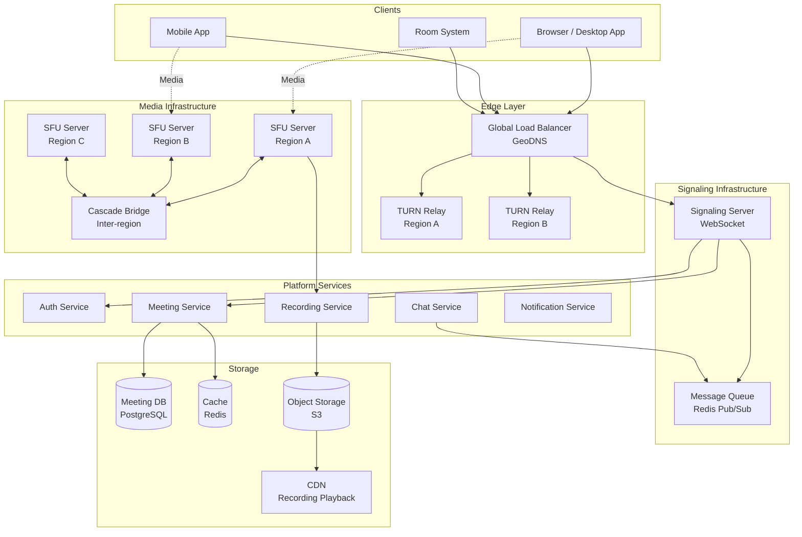
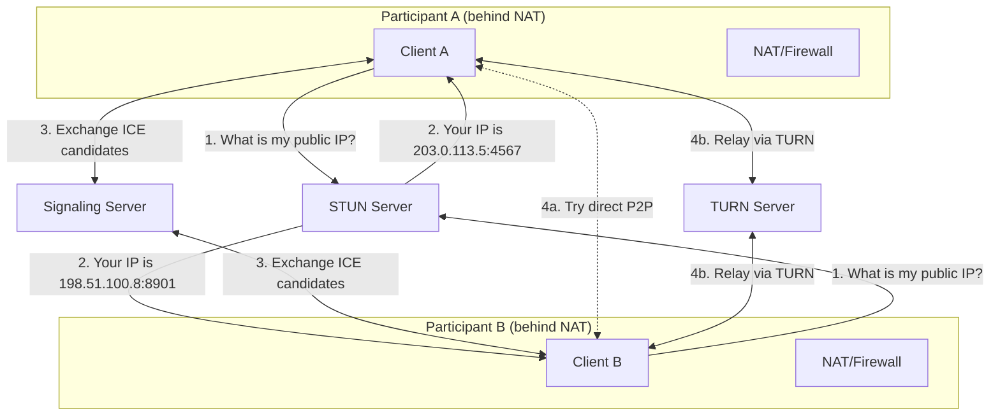
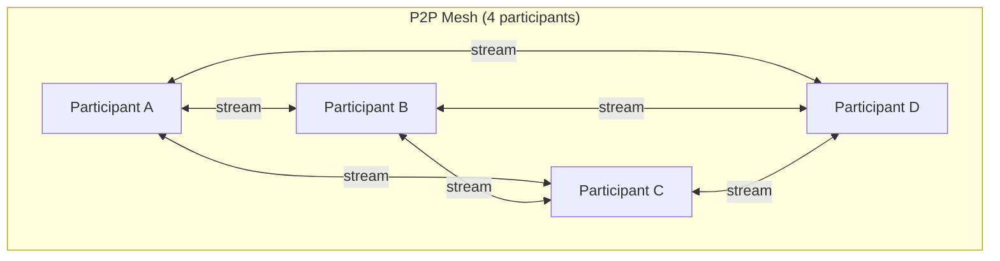
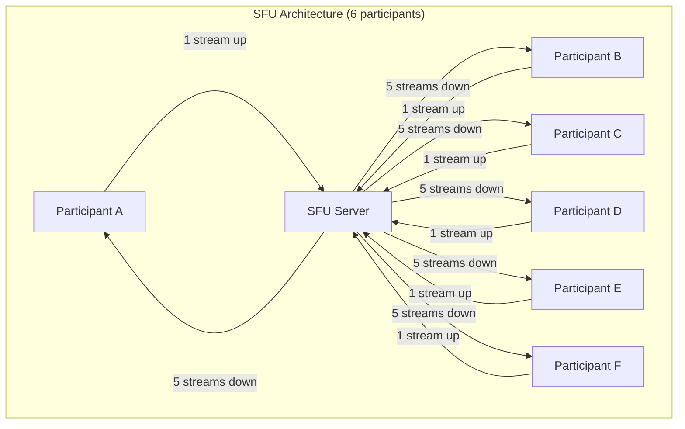
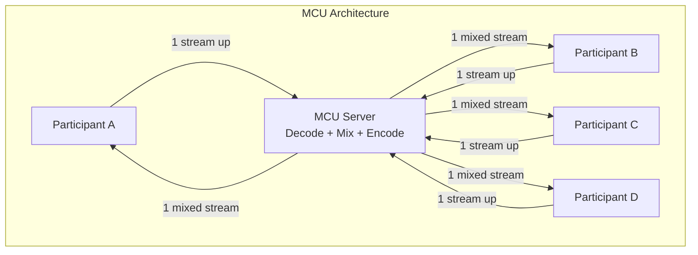
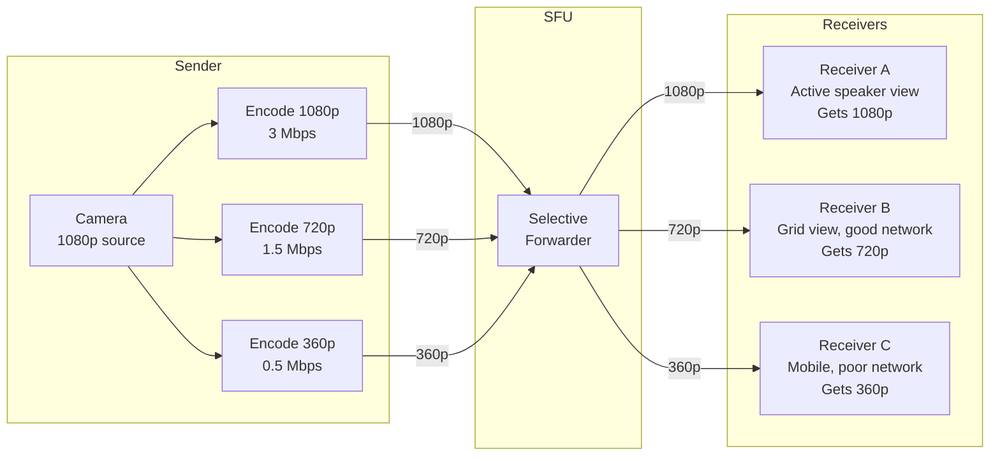
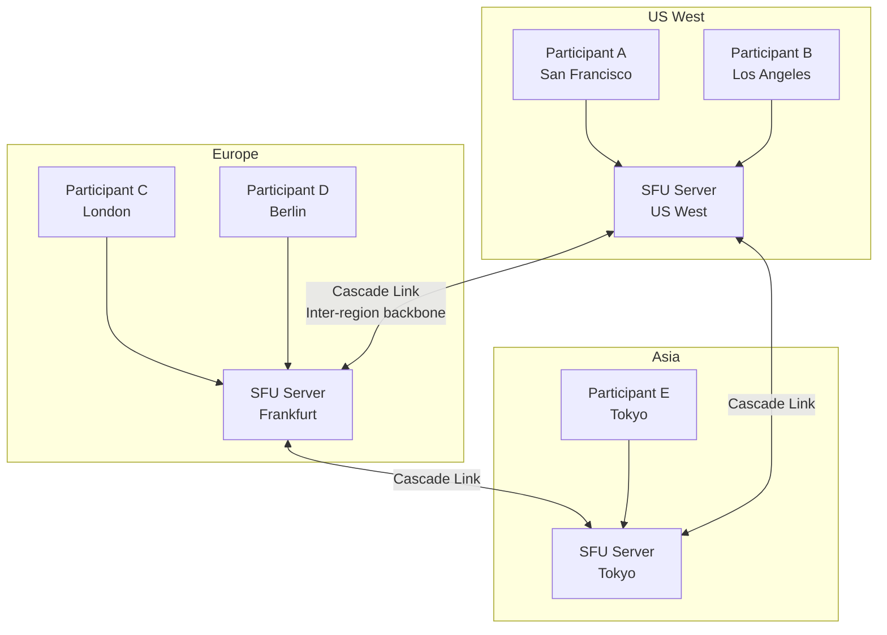
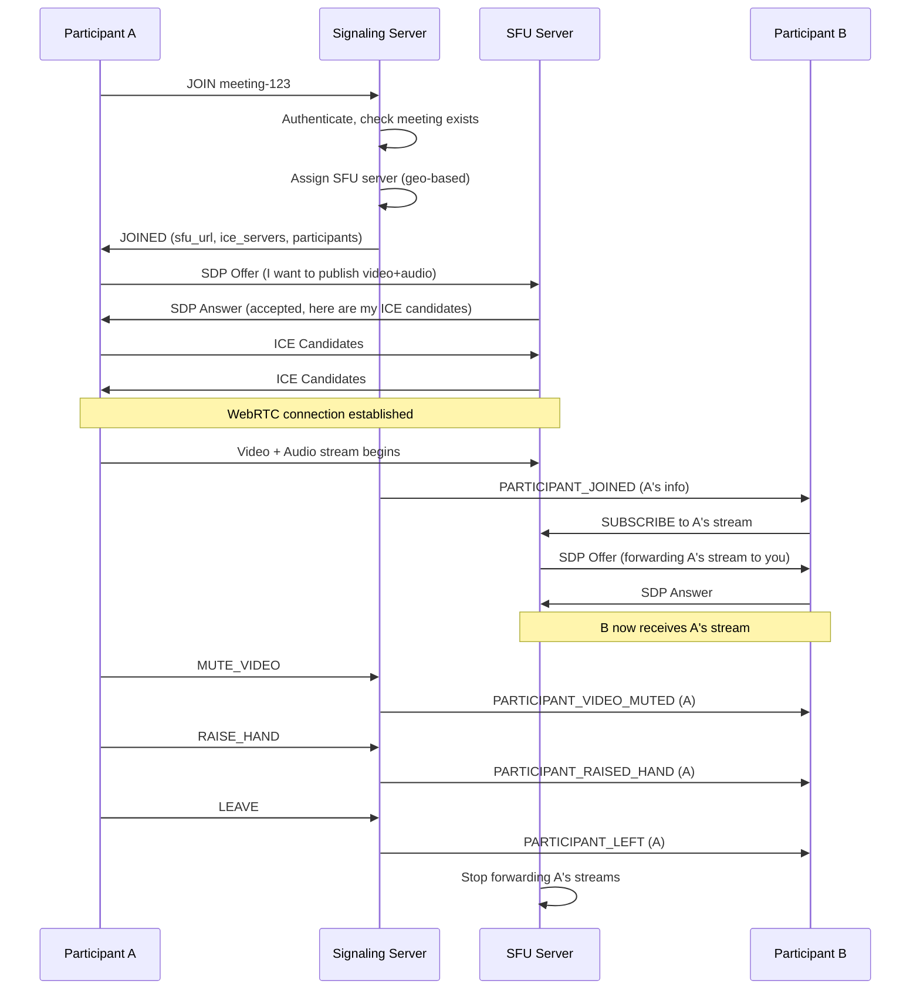
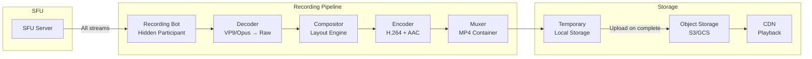
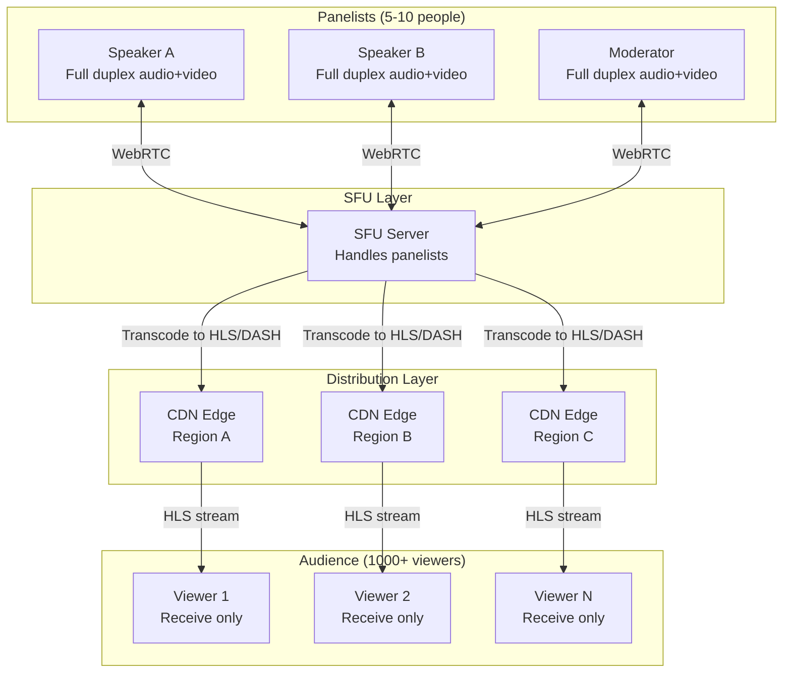

# System Design Interview: Video Conferencing System
### Zoom / Google Meet Scale
> [!NOTE]
> **Staff Engineer Interview Preparation Guide** -- High Level Design Round

---

## Table of Contents

1. [Requirements](#1-requirements)
2. [Capacity Estimation](#2-capacity-estimation)
3. [High-Level Architecture](#3-high-level-architecture)
4. [Core Components Deep Dive](#4-core-components-deep-dive)
5. [Real-Time Communication Fundamentals](#5-real-time-communication-fundamentals)
6. [Media Architecture Patterns](#6-media-architecture-patterns)
7. [SFU Deep Dive](#7-sfu-deep-dive)
8. [Signaling Server](#8-signaling-server)
9. [Adaptive Bitrate & Congestion Control](#9-adaptive-bitrate--congestion-control)
10. [Recording Service](#10-recording-service)
11. [Chat & Reactions](#11-chat--reactions)
12. [Screen Sharing](#12-screen-sharing)
13. [Large Meetings & Webinars](#13-large-meetings--webinars)
14. [Breakout Rooms](#14-breakout-rooms)
15. [Security](#15-security)
16. [Data Models & Storage](#16-data-models--storage)
17. [Scalability Strategies](#17-scalability-strategies)
18. [Design Trade-offs](#18-design-trade-offs)
19. [Interview Cheat Sheet](#19-interview-cheat-sheet)

---

## 1. Requirements

> [!TIP]
> **Interview Tip:** Video conferencing is a rich system design topic because it spans real-time communication, distributed systems, and media engineering. Start by clarifying whether the interviewer wants depth on the media pipeline (WebRTC, codecs, SFU) or breadth on the platform (scheduling, recording, chat, integrations).

### Questions to Ask the Interviewer

| Category | Question | Why It Matters |
|----------|----------|----------------|
| **Scale** | How many concurrent participants per meeting? | Determines P2P vs SFU vs MCU architecture |
| **Quality** | HD video required? 4K? | Bandwidth and encoding requirements |
| **Features** | Screen share, recording, chat? | Scope of services to design |
| **Latency** | What is acceptable end-to-end delay? | < 150ms for conversation, < 400ms still usable |
| **Geography** | Global users or single region? | Media server placement strategy |
| **Platform** | Web browser, native app, or both? | WebRTC compatibility considerations |
| **Security** | End-to-end encryption required? | E2E encryption prevents server-side processing |
| **Recording** | Server-side or client-side recording? | Architecture for recording pipeline |

---

### Functional Requirements

- Create a meeting with a unique link/code
- Join a meeting via link, code, or calendar integration
- Real-time video and audio for all participants
- Screen sharing (full screen, application window, or browser tab)
- In-meeting text chat with message history
- Meeting recording with playback
- Mute/unmute audio and video controls
- Participant management (host can mute, remove, admit from waiting room)
- Virtual backgrounds and noise suppression
- Raise hand and emoji reactions

### Non-Functional Requirements

- **Latency:** < 150ms end-to-end (glass-to-glass) for interactive conversation
- **Scale:** Support 1,000 participants per meeting, 100 with video enabled
- **Availability:** 99.99% uptime (< 52 minutes downtime/year)
- **Quality:** Adaptive quality from 360p to 1080p based on network conditions
- **Bandwidth:** Minimize bandwidth usage through adaptive bitrate and simulcast
- **Global:** Low latency for participants across different continents
- **Security:** Encrypted media streams, optional end-to-end encryption

---

## 2. Capacity Estimation

> [!TIP]
> **Interview Tip:** Video conferencing bandwidth math is unique because it involves upstream AND downstream per participant, and the numbers scale very differently based on the media architecture (P2P, SFU, MCU). Walk through the math for each architecture to show you understand the trade-offs.

### Traffic Estimation

```
Daily active users: 300 million
Average meetings per user per day: 2
Average meeting duration: 40 minutes
Average participants per meeting: 6
Concurrent meetings (peak): 15 million
Concurrent participants (peak): 90 million
```

### Bandwidth Per Participant

```
Video streams:
  720p @ 30fps: ~1.5 Mbps
  1080p @ 30fps: ~3.0 Mbps
  360p @ 30fps: ~0.5 Mbps
  Screen share (1080p, low motion): ~1.0 Mbps

Audio stream:
  Opus codec: ~50 kbps (mono), ~80 kbps (stereo)

Per participant in a 6-person SFU meeting:
  Upload: 1 video (1.5 Mbps) + 1 audio (0.05 Mbps) = ~1.55 Mbps
  Download: 5 videos (7.5 Mbps) + 5 audio (0.25 Mbps) = ~7.75 Mbps
  Total per participant: ~9.3 Mbps
```

### Server Bandwidth

```
SFU server handling one 6-person meeting:
  Inbound: 6 x 1.55 Mbps = ~9.3 Mbps
  Outbound: 6 x 7.75 Mbps = ~46.5 Mbps
  Total: ~55.8 Mbps per meeting

Single SFU server (10 Gbps NIC):
  Can handle ~180 meetings of 6 people
  Or ~1,080 participants

For 90 million concurrent participants:
  90M / 1,080 = ~83,000 SFU servers needed at peak
```

### Storage Estimation

```
Recorded meetings:
  Assume 10% of meetings are recorded
  15M concurrent meetings x 40 min avg x 10% = 1.5M recorded meetings/day
  Average recording size (720p, 40 min): ~400 MB
  Daily recording storage: 1.5M x 400 MB = ~600 TB/day
  30-day retention: ~18 PB
```

> [!NOTE]
> These numbers illustrate why video conferencing companies are among the largest consumers of bandwidth and cloud infrastructure. The key optimization is NOT sending video streams that nobody is watching (e.g., participants not visible in the current layout).

---

## 3. High-Level Architecture



### Architecture Overview

The system has three distinct communication planes:

**Signaling Plane (WebSocket):** Handles meeting creation, participant join/leave, offer/answer exchange, ICE candidate exchange, and control messages (mute, raise hand). This is low-bandwidth, high-reliability communication over WebSocket with fallback to HTTP long-polling.

**Media Plane (UDP/RTP):** Carries the actual audio and video data. Uses UDP for lowest latency (dropped packets are preferable to delayed packets for real-time media). WebRTC establishes peer-to-peer connections where possible, or routes through SFU/TURN servers.

**Data Plane (HTTP/REST):** Handles meeting scheduling, user management, recording access, and chat history retrieval. Standard REST APIs with a traditional web architecture.

> [!IMPORTANT]
> These three planes must be designed independently. The signaling plane needs high availability and low latency. The media plane needs massive bandwidth and geographic proximity to users. The data plane needs standard web-scale architecture. Conflating them is a common interview mistake.

---

## 4. Core Components Deep Dive

### Meeting Service

The meeting service manages the lifecycle of meetings: creation, scheduling, participant management, and cleanup.

**Meeting Creation Flow:**
1. User requests to create a meeting
2. Service generates a unique meeting ID (UUID) and a human-readable join code (e.g., "abc-defg-hij")
3. Meeting metadata is stored in the database
4. A meeting link is generated and returned to the host
5. Calendar integration (optional) sends invites with the link

**Meeting Join Flow:**
1. Participant opens the meeting link or enters the join code
2. Client authenticates and connects to the signaling server via WebSocket
3. Signaling server looks up the meeting and verifies access (password, waiting room)
4. If approved, the signaling server assigns an SFU server (based on participant location)
5. Client establishes WebRTC connection to the assigned SFU
6. SFU begins forwarding media streams from existing participants

**SFU Assignment:** The meeting service uses a geo-aware assignment algorithm. It considers the participant's location (from IP geolocation), the locations of existing participants, and current SFU server load. For meetings with participants in multiple regions, it may assign different SFUs and connect them via cascading.

### STUN/TURN Infrastructure

**STUN (Session Traversal Utilities for NAT):** A lightweight server that helps clients discover their public IP address and port mapping. When a client behind a NAT sends a STUN request, the STUN server responds with the client's public-facing IP:port. This information is used in ICE candidates for establishing direct peer-to-peer connections.

**TURN (Traversal Using Relays around NAT):** When direct P2P connection fails (symmetric NAT, corporate firewalls), media is relayed through a TURN server. The TURN server receives media from the sender and forwards it to the receiver. This adds latency (one extra hop) but works through almost any network configuration.

**ICE (Interactive Connectivity Establishment):** The framework that coordinates STUN and TURN to find the best possible connection path:

1. Gather candidates: local addresses, STUN-discovered addresses, TURN relay addresses
2. Exchange candidates with the remote peer via the signaling server
3. Try all candidate pairs in parallel (connectivity checks)
4. Select the best working pair (prefer direct > STUN > TURN)



> [!NOTE]
> In practice, about 85% of WebRTC connections succeed with direct P2P or STUN. The remaining 15% require TURN relay, mostly from corporate networks with restrictive firewalls. TURN servers are bandwidth-intensive and expensive, so minimizing TURN usage is a key optimization.

---

## 5. Real-Time Communication Fundamentals

### WebRTC Protocol Stack

WebRTC (Web Real-Time Communication) is an open standard that provides peer-to-peer audio, video, and data communication directly in web browsers and native apps.

```
Application Layer:
  Video: VP8 / VP9 / H.264 / AV1 codecs
  Audio: Opus codec
  Data:  SCTP (DataChannel)

Security Layer:
  DTLS (Datagram Transport Layer Security)
  SRTP (Secure Real-time Transport Protocol)

Transport Layer:
  ICE / STUN / TURN (NAT traversal)
  UDP (preferred) / TCP (fallback)

Network Layer:
  IP
```

**Why UDP and not TCP?** TCP guarantees ordered, reliable delivery. If a packet is lost, TCP retransmits it and blocks all subsequent packets until the retransmission arrives (head-of-line blocking). For real-time video, a 200ms old frame is useless -- you would rather skip it and show the next frame. UDP allows the application to decide what to do about lost packets (typically: skip them).

### SDP (Session Description Protocol)

Before two WebRTC peers can exchange media, they must agree on:
- What codecs they both support (e.g., VP9 and Opus)
- What media streams they will send/receive
- Network transport parameters

This negotiation happens via SDP (Session Description Protocol) messages exchanged through the signaling server:

```
SDP Offer/Answer Exchange:

1. Caller creates an SDP "offer" describing their capabilities
2. Offer is sent to callee via signaling server
3. Callee creates an SDP "answer" with compatible parameters
4. Answer is sent back to caller via signaling server
5. Both sides now know the agreed-upon media parameters
6. ICE connectivity checks begin
7. Media flows once connectivity is established
```

### Audio Processing Pipeline

Raw audio from the microphone goes through several processing steps before encoding:

```
Microphone → AEC → NS → AGC → Opus Encoder → Network

AEC: Acoustic Echo Cancellation
  Removes the echo of the remote participant's audio playing through speakers

NS: Noise Suppression
  Removes background noise (keyboard typing, fan noise, traffic)

AGC: Automatic Gain Control
  Normalizes volume so quiet speakers are boosted and loud speakers are reduced

Opus Encoder:
  Encodes processed audio at 48 kHz, typically 50 kbps
  Opus is the standard WebRTC audio codec (low latency, high quality)
```

### Video Processing Pipeline

```
Camera → Preprocessing → Encoder → Packetizer → Network

Preprocessing:
  - Virtual background (requires segmentation ML model)
  - Face framing / auto-zoom
  - Beauty filters

Encoder (VP9 or H.264):
  - Keyframes (I-frames): Full image, sent periodically or on demand
  - Delta frames (P-frames): Only the difference from previous frame
  - Typical keyframe interval: 2-3 seconds

Packetizer:
  - Splits encoded frame into MTU-sized RTP packets (typically 1200 bytes)
  - Adds sequence numbers for reassembly
  - A 720p keyframe might be 30-50 KB = 25-40 RTP packets
```

---

## 6. Media Architecture Patterns

### P2P Mesh

In a mesh topology, every participant connects directly to every other participant. Each participant sends their video/audio stream to every other participant individually.



**Upload per participant:** (N-1) copies of your stream
**Download per participant:** (N-1) streams from others
**Total connections:** N x (N-1) / 2

| Participants | Upload Streams | Download Streams | Connections |
|-------------|---------------|-----------------|-------------|
| 2 | 1 | 1 | 1 |
| 3 | 2 | 2 | 3 |
| 4 | 3 | 3 | 6 |
| 5 | 4 | 4 | 10 |
| 10 | 9 | 9 | 45 |

**Practical limit: 4-5 participants.** Beyond that, the upload bandwidth requirement becomes prohibitive for most consumer internet connections. At 1.5 Mbps per stream, 5 participants need 6 Mbps upload each.

**Advantages:** No server infrastructure needed, lowest possible latency (direct connection), no single point of failure, true end-to-end encryption is natural.

**Disadvantages:** Upload bandwidth scales linearly with participants, CPU load for encoding scales linearly, not practical beyond 4-5 people.

### SFU (Selective Forwarding Unit)

In an SFU architecture, each participant sends their stream once to the SFU server. The SFU then forwards (selects and relays) streams to each participant based on what they need to see.



**Upload per participant:** 1 stream (always)
**Download per participant:** Up to (N-1) streams
**Server bandwidth:** N uploads + N x (N-1) downloads

**Practical limit: 50-100 participants** with video, thousands with most participants audio-only.

**Advantages:** Low upload requirement for clients (just one stream), server can make intelligent forwarding decisions, no transcoding needed (forwarding is cheap), scalable to dozens of participants.

**Disadvantages:** Requires server infrastructure, server bandwidth is substantial, download bandwidth still scales with participants.

### MCU (Multipoint Control Unit)

In an MCU architecture, the server receives all streams, decodes them, composes them into a single mixed stream (like a TV broadcast with a grid layout), re-encodes, and sends one combined stream to each participant.



**Upload per participant:** 1 stream
**Download per participant:** 1 mixed stream (always)
**Server CPU:** Must decode ALL streams + encode N output streams

**Advantages:** Minimal client bandwidth (1 up, 1 down regardless of participants), works even on very low-bandwidth connections, simple client implementation.

**Disadvantages:** Enormous server CPU cost (decode + composite + encode for every participant), higher latency (transcoding adds 50-200ms), fixed layout (server decides the grid), difficult to scale, loss of individual stream quality.

### Comparison Summary

| Dimension | P2P Mesh | SFU | MCU |
|-----------|---------|-----|-----|
| Client upload | High (N-1 streams) | Low (1 stream) | Low (1 stream) |
| Client download | High (N-1 streams) | Medium (N-1 streams) | Low (1 stream) |
| Server CPU | None | Low (forwarding only) | Very high (transcode) |
| Server bandwidth | None | High | Medium |
| Latency | Lowest | Low | Higher (+50-200ms) |
| Max participants | 4-5 | 50-100 | Hundreds |
| Flexibility | High | High | Low (fixed layout) |
| E2E encryption | Easy | Possible | Not possible |
| Cost | Zero server cost | Moderate | Very expensive |

> [!TIP]
> **Interview Tip:** Most modern video conferencing systems (Zoom, Google Meet, Microsoft Teams) use SFU as the primary architecture. Mention that real systems often use a hybrid approach: P2P for 1-on-1 calls, SFU for small-medium meetings, and SFU + CDN/HLS for large webinars.

---

## 7. SFU Deep Dive

The SFU is the workhorse of modern video conferencing. Let us explore it in detail.

### Simulcast

The key to making SFU efficient is simulcast. Instead of the sender encoding video at a single quality level, the sender encodes at multiple quality levels simultaneously (e.g., 1080p, 720p, 360p). The SFU then selects the appropriate quality for each receiver based on:

- **Receiver's available bandwidth:** A receiver on a slow connection gets 360p
- **Receiver's viewport size:** A small thumbnail in a grid layout gets 360p; the active speaker gets 720p or 1080p
- **Receiver's device capabilities:** Mobile devices may prefer lower resolution



**CPU cost for sender:** Encoding three streams is roughly 2x the cost of encoding one (encoders share motion estimation). Modern CPUs and hardware encoders (NVENC, Quick Sync) handle this efficiently.

**Bandwidth savings:** In a 6-person meeting with grid view, each participant receives five 360p streams instead of five 720p/1080p streams. That is 5 x 0.5 = 2.5 Mbps down instead of 5 x 1.5 = 7.5 Mbps. A 3x bandwidth reduction.

### SFU Forwarding Logic

The SFU's forwarding decision for each subscriber happens on every video frame:

```
function selectLayer(subscriber, publisher):
    // Determine what quality this subscriber needs for this publisher
    if subscriber.layout == ACTIVE_SPEAKER and publisher == activeSpeaker:
        desiredLayer = HIGH  // active speaker gets highest quality
    else if subscriber.layout == GRID:
        if gridSize <= 4:
            desiredLayer = MEDIUM
        else:
            desiredLayer = LOW
    else if publisher is screensharing:
        desiredLayer = HIGH  // screen share always high quality
    else:
        desiredLayer = LOW  // thumbnails, non-visible

    // Constrain by subscriber's available bandwidth
    available = subscriber.estimatedBandwidth - subscriber.currentUsage
    if desiredLayer == HIGH and available < 3.0 Mbps:
        desiredLayer = MEDIUM
    if desiredLayer == MEDIUM and available < 1.5 Mbps:
        desiredLayer = LOW

    return desiredLayer
```

### Active Speaker Detection

The SFU detects which participant is currently speaking by analyzing the audio levels in incoming RTP packets. WebRTC RTP packets include an "audio level" header extension (RFC 6464) that indicates the volume of the audio in each packet.

```
Active Speaker Algorithm:
1. For each participant, compute a running average of audio levels
   over the last 1-2 seconds
2. Apply a smoothing function to avoid rapid switching
   (hysteresis: require 500ms of continuous speech to switch)
3. The participant with the highest smoothed audio level is the
   active speaker
4. Notify all subscribers of speaker changes via a data channel message
5. Subscribers can then request the high-quality layer for the
   active speaker
```

### SFU Cascading (Multi-Region)

When meeting participants are in different geographic regions, using a single SFU server means some participants will have high latency. Cascading connects SFU servers across regions:



Each SFU sends one copy of each participant's stream to every other SFU in the cascade. This is more efficient than having each remote participant connect individually to a distant SFU.

**Optimization: Only cascade active streams.** If the meeting has 50 participants but only 5 have video enabled, only cascade those 5 video streams. Audio is always cascaded (it is low bandwidth).

> [!IMPORTANT]
> Cascading adds one extra hop of latency (the inter-region link, typically 50-150ms depending on distance). This is still better than the alternative of all participants connecting to a single distant SFU, which would add the full round-trip latency for every packet.

---

## 8. Signaling Server

The signaling server coordinates the establishment and management of media connections. It does NOT carry any media data -- only control messages.

### Signaling Protocol



### Signaling Message Types

| Category | Messages | Description |
|----------|----------|-------------|
| **Session** | JOIN, LEAVE, KICK | Meeting room management |
| **Media** | SDP_OFFER, SDP_ANSWER, ICE_CANDIDATE | WebRTC negotiation |
| **Control** | MUTE_AUDIO, MUTE_VIDEO, UNMUTE | Media control |
| **Interaction** | RAISE_HAND, REACTION, CHAT_MESSAGE | User interactions |
| **Layout** | SPEAKER_CHANGED, PIN_PARTICIPANT | View management |
| **Admin** | ADMIT_FROM_WAITING_ROOM, LOCK_MEETING | Host controls |
| **Recording** | START_RECORDING, STOP_RECORDING | Recording control |

### WebSocket Connection Management

Each participant maintains a single WebSocket connection to the signaling server. The server must handle:

**Connection multiplexing:** Many participants in the same meeting connect to the same signaling server (or a cluster). Use Redis Pub/Sub or a similar system to broadcast messages within a meeting room across server instances.

**Heartbeat:** Clients send periodic pings (every 5-10 seconds). If the server does not receive a heartbeat within the timeout (30 seconds), it considers the participant disconnected and notifies others.

**Reconnection:** If the WebSocket disconnects, the client automatically reconnects and sends a REJOIN message with its previous session token. The server restores the participant's state without requiring a full rejoin flow.

```
Signaling Server Cluster:

Participant A ──WebSocket──> Sig Server 1 ──Redis Pub/Sub──> Sig Server 2 <──WebSocket── Participant B
                                    |                              |
                                    └──── Meeting State Store (Redis) ────┘
```

> [!TIP]
> **Interview Tip:** Emphasize that the signaling server is NOT on the media path. It only handles setup and control. This means it has modest bandwidth requirements (kilobytes per second per participant) and can be a standard horizontally-scaled web service with WebSocket support.

---

## 9. Adaptive Bitrate & Congestion Control

### The Problem

Internet connections are unreliable. Bandwidth fluctuates, packets get lost, and jitter varies. A video conferencing system must adapt in real-time to deliver the best possible quality given current network conditions.

### Bandwidth Estimation

WebRTC uses two main mechanisms for bandwidth estimation:

**REMB (Receiver Estimated Maximum Bitrate):** The receiver estimates the available bandwidth based on packet arrival times and loss rates, then sends a REMB message back to the sender. The sender adjusts its encoding bitrate accordingly.

**Transport-CC (Transport-Wide Congestion Control):** The receiver sends detailed transport feedback (arrival times of every received packet) to the sender. The sender runs a congestion control algorithm (GCC - Google Congestion Control) that is more sophisticated than REMB, using both delay-based and loss-based signals.

### Degradation Strategy

When bandwidth drops, the system degrades quality in a specific order to minimize the impact on communication:

```
Best quality                                    Worst quality
|                                                          |
1080p@30fps → 720p@30fps → 720p@15fps → 360p@15fps → Audio-only
     3 Mbps      1.5 Mbps     0.8 Mbps     0.3 Mbps    0.05 Mbps
```

**Degradation priority (what to sacrifice first):**

1. **Resolution first:** Drop from 1080p to 720p to 360p. Viewers notice resolution loss less than they notice stuttering.
2. **Frame rate second:** Drop from 30fps to 15fps. Motion becomes slightly jerky but is still usable for conversation.
3. **Video last resort:** Disable video entirely and go audio-only. Audio is far more important for communication than video.
4. **Audio quality never sacrificed.** Opus codec at 50kbps is highly robust and very low bandwidth. Audio must always work.

### Jitter Buffer

Network jitter (variation in packet arrival times) causes choppy audio/video even when no packets are lost. The jitter buffer smooths this out:

```
Without jitter buffer:
Packets arrive: |P1|  |P2|    |P3||P4|     |P5|
Playback:       |P1|  |P2|    |P3||P4|     |P5|  ← choppy

With jitter buffer (50ms buffer):
Packets arrive: |P1|  |P2|    |P3||P4|     |P5|
Buffer fills:   [P1, P2]
Playback:            |P1| |P2| |P3| |P4| |P5|  ← smooth
                     ^---- 50ms delay, but smooth
```

The jitter buffer size is adaptive:
- Low jitter (stable network): Small buffer (20-50ms), low latency
- High jitter (unstable network): Large buffer (100-200ms), higher latency but smooth

> [!WARNING]
> The jitter buffer adds latency. A 100ms jitter buffer means the audio/video is 100ms behind real-time. For an interactive conversation, this is noticeable but acceptable. The system must balance smoothness (larger buffer) against responsiveness (smaller buffer).

---

## 10. Recording Service

### Server-Side Recording

The recording service joins the meeting as a hidden participant. It subscribes to all audio and video streams from the SFU, then composes and encodes them into a recording file.



**Layout composition:** The compositor arranges participant video streams into a grid or active-speaker layout, similar to what participants see in the meeting. It re-renders this layout at 30fps, mixing in screen share content when active.

**Audio mixing:** All audio streams are decoded, mixed into a single audio track (with normalization to prevent loud participants from dominating), and encoded as AAC or Opus.

**Output format:** MP4 (H.264 video + AAC audio) for broad compatibility. Some systems also produce WebM (VP9 + Opus) for web playback.

### Individual Track Recording

An alternative approach records each participant's audio and video as separate tracks:

**Advantages:** Enables post-meeting editing (e.g., different layouts, highlighting specific speakers), transcription from individual audio tracks is more accurate, and individual tracks can be stored as-is without compositing CPU cost.

**Disadvantages:** Requires post-processing to produce a viewable recording, more complex storage management, larger total storage size.

### Recording Storage and Access

```
Recording lifecycle:
1. During meeting: Write chunks to local SSD (fast, temporary)
2. Meeting ends: Upload complete recording to object storage (S3)
3. Post-processing: Generate thumbnails, extract transcript
4. Access: Serve via CDN with signed URLs (time-limited access)
5. Retention: Configurable per organization (30 days to forever)
6. Archival: Move to cheaper storage tier (Glacier) after retention period
```

---

## 11. Chat & Reactions

### In-Meeting Chat

Chat messages are delivered through the signaling WebSocket connection. They do not use the media path.

```
Chat message flow:
1. Sender types message and presses send
2. Client sends CHAT_MESSAGE to signaling server via WebSocket
3. Signaling server broadcasts to all participants in the meeting
4. Signaling server persists message to chat history store
5. All connected clients display the message in real-time
6. Late joiners retrieve chat history via REST API on join
```

**Message types:** Text messages, file links (files uploaded to object storage), reactions (emoji sent to all participants, displayed as floating overlay), and polls.

**Persistence:** Chat messages are stored in a database associated with the meeting ID. They are available during the meeting via the signaling server and after the meeting via REST API, subject to the meeting's retention policy.

### Reactions and Non-Verbal Feedback

Reactions (thumbs up, applause, raise hand) are ephemeral signaling messages:

```
Reaction message:
{
  "type": "REACTION",
  "participant_id": "user-123",
  "reaction": "thumbs_up",
  "timestamp": 1680000000000
}
```

The signaling server broadcasts reactions to all participants. Clients display them as animated overlays that fade after 3-5 seconds. Reactions are NOT persisted (they are ephemeral).

**Raise hand** is different -- it is a persistent state (raised until lowered). The signaling server maintains a list of raised hands and includes it in the participant state for late joiners.

---

## 12. Screen Sharing

### Capture and Encoding

Screen sharing is treated as an additional video track in the WebRTC connection:

1. **Capture:** The browser's `getDisplayMedia()` API or the native OS screen capture API captures the screen content (entire screen, application window, or browser tab).

2. **Encoding differences from webcam video:**
   - Higher resolution (typically 1080p or even 1440p for text readability)
   - Lower frame rate (5-15 fps for static content like slides, higher for demos/videos)
   - Different codec parameters: prioritize sharpness over smoothness (screen content has sharp text and edges)
   - Content-adaptive: detect whether content is mostly static (slides) or dynamic (video playback) and adjust accordingly

3. **Transmission:** Sent as a separate video track through the same WebRTC connection. The SFU forwards it as a high-priority stream to all subscribers.

### Optimization for Screen Content

```
Screen share optimization:
- Use VP9 "screen content coding" mode or H.264 "screen" profile
  - Better compression for text and sharp edges
  - Can detect repeated patterns (code editors, spreadsheets)
- Adaptive frame rate:
  - Static slide deck: 2-5 fps (saves bandwidth)
  - Scrolling/typing: 10-15 fps
  - Video playback: 30 fps
- Region of interest:
  - Only encode the changed region of the screen
  - If only a cursor moves, only transmit cursor-area updates
```

> [!NOTE]
> Screen sharing with computer audio (e.g., sharing a video with sound) requires capturing the system audio output and mixing it into the audio track. This is OS-dependent and has varying levels of browser support.

---

## 13. Large Meetings & Webinars

### The Scale Challenge

A standard SFU meeting with 50 participants where everyone can share video works fine. But what about 1,000 participants? Or 10,000 viewers in a webinar?

### Tiered Participant Model



**Panelists** (speakers, hosts) connect via WebRTC to the SFU for low-latency bidirectional communication. This is the standard SFU model.

**Viewers** (audience) receive a composed stream via HLS (HTTP Live Streaming) or DASH through a CDN. This adds 5-30 seconds of latency but scales to millions of viewers using standard CDN infrastructure.

**Promotion:** A viewer can be "promoted" to panelist (e.g., for Q&A). The system establishes a WebRTC connection for the promoted viewer and tears down their HLS stream.

### Low-Latency Large Meetings (WebRTC-Based)

For meetings where viewer interaction latency matters (e.g., interactive townhalls), some systems support receive-only WebRTC connections for viewers:

- Viewers establish a WebRTC connection but only subscribe (no publish)
- The SFU only forwards the active speaker's stream(s) to viewers
- With simulcast, viewers receive low-quality streams
- This can scale to 1,000-3,000 viewers per SFU server
- Beyond that, use SFU cascading: multiple SFU servers connected in a tree

> [!TIP]
> **Interview Tip:** The key insight for large meetings is the asymmetry between panelists and viewers. Panelists need low-latency bidirectional communication (WebRTC + SFU). Viewers need scalable unidirectional streaming (CDN + HLS). Design for both in the same meeting.

---

## 14. Breakout Rooms

### Architecture

Breakout rooms are sub-meetings within a main meeting. The host assigns participants to rooms, and each room operates as a mini-meeting.

```
Main Meeting (20 participants)
  ├── Breakout Room 1 (5 participants) → SFU session 1a
  ├── Breakout Room 2 (5 participants) → SFU session 1b
  ├── Breakout Room 3 (5 participants) → SFU session 1c
  └── Breakout Room 4 (5 participants) → SFU session 1d

Host can:
  - Broadcast message to all rooms
  - Join any room temporarily
  - Move participants between rooms
  - Close breakout rooms (everyone returns to main)
```

**Implementation:** Each breakout room is a separate SFU routing context. When breakout rooms are created:

1. The signaling server creates sub-sessions for each room
2. Participants are instructed (via signaling) to unsubscribe from the main meeting streams and subscribe to their room's streams
3. The SFU reconfigures its forwarding tables: participants in Room 1 only receive media from other Room 1 participants
4. When breakout rooms close, all participants re-subscribe to the main meeting streams

**Key optimization:** Participants do not need to establish new WebRTC connections for breakout rooms. The SFU simply changes which streams it forwards to each participant. This makes room transitions near-instant.

---

## 15. Security

### Encryption Layers

**SRTP (Secure Real-time Transport Protocol):** All WebRTC media is encrypted with SRTP by default. The encryption keys are exchanged during the DTLS handshake between the client and the SFU. This provides hop-by-hop encryption: the media is encrypted between the client and the SFU, but the SFU can decrypt it (it needs to in order to forward/select streams).

**End-to-End Encryption (E2EE):** For highest security, the media is encrypted at the sender before it reaches the SFU, and only decrypted at the receiver. The SFU forwards encrypted packets it cannot read.

```
Without E2EE:
  Sender → [encrypt] → SFU [decrypt, forward, encrypt] → Receiver → [decrypt]
  SFU can see media content

With E2EE:
  Sender → [E2EE encrypt] → [SRTP encrypt] → SFU [SRTP decrypt, forward, SRTP encrypt] → [SRTP decrypt] → Receiver → [E2EE decrypt]
  SFU only sees E2EE-encrypted payload, cannot read content
```

**E2EE trade-offs:**

| Feature | Without E2EE | With E2EE |
|---------|-------------|-----------|
| Server-side recording | Possible | Not possible (server cannot decode) |
| Server-side transcription | Possible | Not possible |
| Simulcast SFU selection | Works normally | Requires "envelope" encryption per layer |
| Key management | Simple (DTLS) | Complex (group key distribution) |
| Trust model | Trust the server operator | Trust only participants |

### Meeting Security Features

**Waiting Room:** Participants join a holding area and must be explicitly admitted by the host. The signaling server holds JOIN requests in a queue and notifies the host.

**Meeting Password:** Required for joining. Validated at the signaling server before allowing the participant to connect to the SFU.

**Meeting Lock:** Once all participants have joined, the host can lock the meeting. No new participants can join, even with the correct password.

**Participant Authentication:** Verified participants show their authenticated identity (name, email, organization). Guest/anonymous participants are clearly marked.

---

## 16. Data Models & Storage

### Core Data Models

**Meeting Table**

| Column | Type | Description |
|--------|------|-------------|
| meeting_id | UUID (PK) | Unique meeting identifier |
| meeting_code | VARCHAR(12) | Human-readable join code |
| host_user_id | UUID (FK) | Meeting creator/host |
| title | VARCHAR(255) | Meeting title |
| scheduled_start | TIMESTAMP | Scheduled start time (null for instant meetings) |
| scheduled_end | TIMESTAMP | Scheduled end time |
| actual_start | TIMESTAMP | When the first participant joined |
| actual_end | TIMESTAMP | When the last participant left |
| status | ENUM | SCHEDULED, ACTIVE, ENDED |
| password_hash | VARCHAR(255) | Optional meeting password |
| waiting_room_enabled | BOOLEAN | Whether waiting room is active |
| recording_enabled | BOOLEAN | Whether recording is allowed |
| e2ee_enabled | BOOLEAN | Whether E2EE is enforced |
| max_participants | INT | Maximum allowed participants |
| created_at | TIMESTAMP | Creation time |

**Participant Table**

| Column | Type | Description |
|--------|------|-------------|
| participant_id | UUID (PK) | Unique session identifier |
| meeting_id | UUID (FK) | Which meeting |
| user_id | UUID (FK) | Authenticated user (null for guests) |
| display_name | VARCHAR(100) | Name shown in meeting |
| role | ENUM | HOST, CO_HOST, PANELIST, PARTICIPANT, VIEWER |
| joined_at | TIMESTAMP | When they joined |
| left_at | TIMESTAMP | When they left |
| duration_seconds | INT | Total time in meeting |
| audio_enabled | BOOLEAN | Audio state at departure |
| video_enabled | BOOLEAN | Video state at departure |
| sfu_server_id | VARCHAR(50) | Assigned SFU server |
| region | VARCHAR(20) | Geographic region |
| connection_quality | ENUM | GOOD, FAIR, POOR |

**Recording Table**

| Column | Type | Description |
|--------|------|-------------|
| recording_id | UUID (PK) | Unique recording identifier |
| meeting_id | UUID (FK) | Associated meeting |
| started_by | UUID (FK) | Who started the recording |
| started_at | TIMESTAMP | Recording start time |
| ended_at | TIMESTAMP | Recording end time |
| duration_seconds | INT | Recording duration |
| file_size_bytes | BIGINT | Size of recording file |
| storage_url | VARCHAR(500) | Object storage path |
| cdn_url | VARCHAR(500) | CDN playback URL |
| format | ENUM | MP4, WEBM |
| resolution | VARCHAR(10) | Recording resolution |
| status | ENUM | RECORDING, PROCESSING, READY, FAILED, DELETED |
| transcript_url | VARCHAR(500) | Associated transcript file |
| retention_until | TIMESTAMP | When to auto-delete |

### Storage Technologies

| Data | Storage | Rationale |
|------|---------|-----------|
| Meeting metadata | PostgreSQL | Relational queries, transactional |
| Active meeting state | Redis | Low-latency, ephemeral, pub/sub |
| Chat messages | PostgreSQL + Redis | Persist + real-time delivery |
| Recordings | S3/GCS | Large files, durable, CDN-compatible |
| User accounts | PostgreSQL | Standard CRUD |
| Analytics/metrics | ClickHouse/BigQuery | Time-series, aggregation queries |
| SFU routing state | In-memory (SFU process) | Ultra-low latency, ephemeral |

---

## 17. Scalability Strategies

### Media Server Scaling

**Horizontal scaling of SFU servers:** Each SFU server handles a fixed number of participants (typically 500-2,000 depending on server size and video usage). Add more servers to handle more concurrent meetings.

**Geographic distribution:** Deploy SFU servers in every major region. Assign participants to the closest SFU. For cross-region meetings, use SFU cascading.

```
SFU Server Regions:
  US East (Virginia): 500 servers
  US West (Oregon): 300 servers
  Europe (Frankfurt): 400 servers
  Asia Pacific (Tokyo): 200 servers
  Asia Pacific (Singapore): 200 servers
  South America (Sao Paulo): 100 servers

Total: 1,700 SFU servers
Capacity: ~2M concurrent participants
```

**Auto-scaling:** Monitor SFU server CPU, bandwidth, and participant count. Scale up by provisioning new servers when utilization exceeds 70%. Scale down by draining meetings (wait for them to end naturally) before decommissioning servers.

### Signaling Server Scaling

Signaling servers are stateless (meeting state is in Redis). Scale horizontally behind a load balancer with sticky sessions (WebSocket connections must stay on the same server for their lifetime).

```
Signaling infrastructure:
  Load Balancer (Layer 7, WebSocket-aware)
    ├── Sig Server 1 (5,000 WebSocket connections)
    ├── Sig Server 2 (5,000 WebSocket connections)
    ├── ...
    └── Sig Server N
  Redis Cluster (pub/sub for cross-server messaging)
```

### TURN Server Scaling

TURN servers are bandwidth-intensive. Each TURN relay consumes bandwidth equal to the media streams it relays. Scale by adding more TURN servers in each region.

**Cost optimization:** TURN is expensive (server bandwidth costs). Minimize TURN usage by:
- Using STUN first (works for most connections)
- Trying ICE TCP before falling back to TURN (TCP works through more firewalls than UDP)
- Using TURN only as a last resort

### Recording Service Scaling

Recording is CPU-intensive (decode + composite + encode). Scale recording workers independently from SFU servers. Use a task queue to distribute recording jobs across workers.

> [!NOTE]
> A single recording worker can handle 2-4 concurrent recordings (limited by CPU for video encoding). For 1.5M concurrent recorded meetings, you would need 375K-750K recording workers. In practice, recording is much less common (perhaps 5-10% of meetings), bringing this to a manageable 18K-37K workers.

---

## 18. Design Trade-offs

### SFU vs MCU

| Consideration | Choose SFU When | Choose MCU When |
|---------------|----------------|-----------------|
| Client capability | Clients have decent bandwidth | Clients have very limited bandwidth |
| Server cost | Want to minimize server CPU cost | CPU cost is acceptable |
| Flexibility | Need per-participant quality control | Fixed layout is acceptable |
| Latency | Lowest latency is critical | Extra 50-200ms is acceptable |
| E2EE | End-to-end encryption is needed | E2EE is not needed |
| Scale | Medium meetings (5-100 people) | Very large meetings where MCU reduces client bandwidth |

**Modern consensus:** SFU with simulcast is the standard choice. MCU is mostly used for interoperability with legacy video conferencing systems (SIP/H.323 room systems).

### WebRTC vs HLS/DASH for Viewers

| Consideration | WebRTC | HLS/DASH |
|---------------|--------|----------|
| Latency | < 500ms | 5-30 seconds |
| Scale | Hundreds-thousands | Millions (CDN) |
| Interactivity | Full (can be promoted to speaker) | Limited (chat only) |
| Infrastructure | SFU servers (expensive) | CDN (commodity) |
| Browser support | All modern browsers | All browsers |
| Cost per viewer | High (SFU resources) | Low (CDN) |

### Recording: Server-Side vs Client-Side

| Approach | Pros | Cons |
|----------|------|------|
| Server-side | Centralized, consistent quality, works for all clients | CPU-intensive, requires server infrastructure |
| Client-side | No server cost, works with E2EE | Depends on client device capability, inconsistent quality |
| Individual tracks | Enables post-editing, better transcription | Requires post-processing, more storage |

### Consistency vs Availability for Meeting State

Meeting state (who is in the meeting, who is muted, who is sharing) needs to be consistent but also highly available. The system uses eventual consistency with a short convergence window:

- Signaling server broadcasts state changes to all participants
- If a participant misses an update (WebSocket reconnection), they request full state on rejoin
- The SFU maintains its own routing state independently of the signaling server
- In the rare case of signaling server failure, the SFU continues forwarding media (participants can still see and hear each other, but cannot mute/unmute via UI)

> [!TIP]
> **Interview Tip:** When discussing trade-offs, frame them as "for our requirements, X is better because..." rather than stating absolutes. For example: "For meetings up to 100 participants, SFU is clearly the right choice because it balances latency, cost, and flexibility. For webinars with 10,000 viewers, we switch to CDN-based distribution because SFU server costs would be prohibitive."

---

## 19. Interview Cheat Sheet

### 30-Second Summary

> A video conferencing system has three planes: signaling (WebSocket for setup and control), media (WebRTC/UDP for audio and video), and data (REST for scheduling and history). The core media architecture uses an SFU (Selective Forwarding Unit) where each participant uploads one stream and the SFU selectively forwards streams to each subscriber. Simulcast (encoding at multiple qualities) lets the SFU adapt per-receiver. For cross-region meetings, SFU cascading connects servers via backbone links. Large meetings use a hybrid model: panelists on WebRTC/SFU, viewers on HLS/CDN. NAT traversal uses ICE (STUN for discovery, TURN for relay). Adaptive bitrate degrades gracefully: resolution first, then frame rate, then video off, audio always preserved.

### Key Numbers to Remember

| Metric | Value |
|--------|-------|
| Target end-to-end latency | < 150ms |
| 720p video bitrate | ~1.5 Mbps |
| 1080p video bitrate | ~3.0 Mbps |
| Opus audio bitrate | ~50 kbps |
| SFU participants per server | 500-2,000 |
| P2P practical limit | 4-5 participants |
| SFU practical limit | 50-100 with video |
| TURN relay usage | ~15% of connections |
| HLS latency | 5-30 seconds |
| WebRTC connection setup | 1-3 seconds |
| Jitter buffer typical size | 20-100ms |
| Recording size (720p, 1hr) | ~600 MB |

### Architecture Decisions to Justify

| Decision | Justification |
|----------|---------------|
| SFU over P2P | P2P does not scale beyond 4-5 participants due to upload bandwidth |
| SFU over MCU | SFU avoids expensive server-side transcoding; simulcast provides per-receiver quality |
| Simulcast (3 quality layers) | Allows SFU to select optimal quality per subscriber without transcoding |
| Separate signaling and media planes | Different scaling characteristics; signaling is cheap, media is expensive |
| UDP for media transport | Dropped packets are better than delayed packets for real-time communication |
| Geographic SFU distribution | Media latency is dominated by physical distance; servers must be close to users |
| SFU cascading for multi-region | Better than all participants connecting to one distant SFU |
| CDN/HLS for large audiences | WebRTC does not scale to thousands of viewers cost-effectively |
| Redis for signaling state | Low-latency pub/sub for cross-server messaging in signaling cluster |

### Common Follow-Up Questions

**Q: How do you handle a participant with a very poor network connection?**
A: The adaptive bitrate system detects high packet loss and jitter via Transport-CC feedback. It progressively degrades quality: lower resolution, lower frame rate, eventually audio-only. The jitter buffer increases to smooth out irregular packet arrival. If the connection is truly unusable, the client shows a "reconnecting" state and attempts to re-establish the WebRTC connection.

**Q: How do you ensure low latency for global meetings?**
A: Deploy SFU servers in every major region. Use geo-aware assignment to connect each participant to the closest SFU. For cross-region meetings, cascade SFU servers via dedicated backbone links (lower latency and jitter than public internet). The cascade adds one hop of latency (50-150ms depending on distance) but is still better than all participants connecting to a distant single SFU.

**Q: What happens if an SFU server crashes mid-meeting?**
A: Participants detect the failure within seconds (WebRTC ICE connection timeout). The signaling server detects the SFU heartbeat failure and reassigns affected participants to a backup SFU server. Participants automatically reconnect and re-establish media streams. There is a brief interruption (5-10 seconds) during failover.

**Q: How does virtual background work?**
A: A machine learning model (body segmentation) runs on the client device. It classifies each pixel as "person" or "background" in real-time. Background pixels are replaced with the chosen virtual background image or blur effect. This is done before video encoding, so the SFU and other participants receive the processed video. The ML model runs at 30fps on the client's GPU.

**Q: Why not use TCP for media?**
A: TCP provides reliable, ordered delivery. If a packet is lost, TCP retransmits it and blocks all subsequent data (head-of-line blocking). For a 30fps video stream, a single lost packet could delay the next 100-200ms of video while waiting for retransmission. UDP allows the application to skip lost packets and continue with the next frame, which is the correct behavior for real-time media.

**Q: How do you handle 1,000 participants in a single meeting?**
A: Use a tiered model. A small number (10-20) are active panelists connected via WebRTC to the SFU. The remaining 980+ are viewers who either receive a low-latency WebRTC receive-only stream (for interactive meetings) or an HLS stream via CDN (for webinars). Only the active speaker's video is forwarded to viewers, minimizing bandwidth. Viewers can interact via chat (signaling plane) and can be promoted to panelist for Q&A.

### Red Flags to Avoid

- Do NOT propose a centralized media server (MCU) as the default architecture -- SFU is the modern standard
- Do NOT forget about NAT traversal (STUN/TURN) -- most clients are behind NATs
- Do NOT use TCP for media transport -- explain why UDP is necessary
- Do NOT ignore the bandwidth math -- show you understand upload vs download asymmetry
- Do NOT treat recording as trivial -- it requires a full pipeline (decode, composite, encode, store)
- Do NOT propose P2P for meetings with more than 5 participants
- Do NOT forget simulcast when discussing SFU -- it is the key to SFU efficiency
- Do NOT confuse signaling with media -- they are separate planes with different requirements
- Do NOT ignore geographic distribution -- media latency is dominated by physical distance

---

> [!TIP]
> **Final Interview Tip:** The video conferencing question tests your understanding of real-time systems, networking fundamentals, and scalable media distribution. The key differentiator is depth on the media architecture: P2P vs SFU vs MCU trade-offs, simulcast, adaptive bitrate, and the hybrid approach for large meetings. Practice drawing the SFU architecture with simulcast and cascading -- it is the centerpiece of the design.
