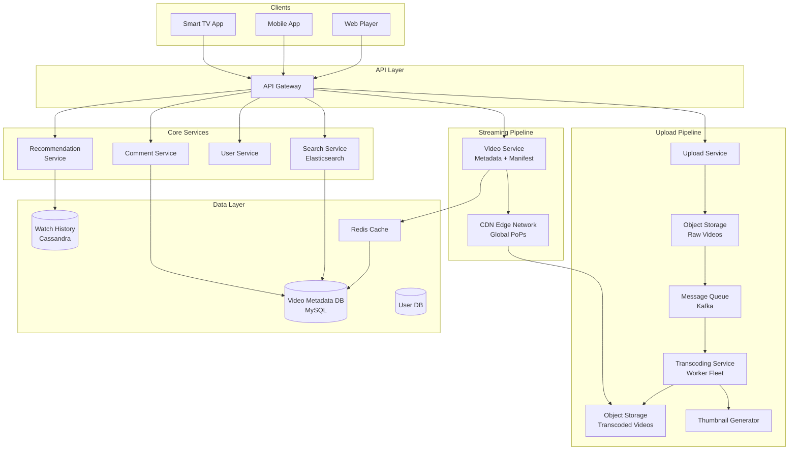
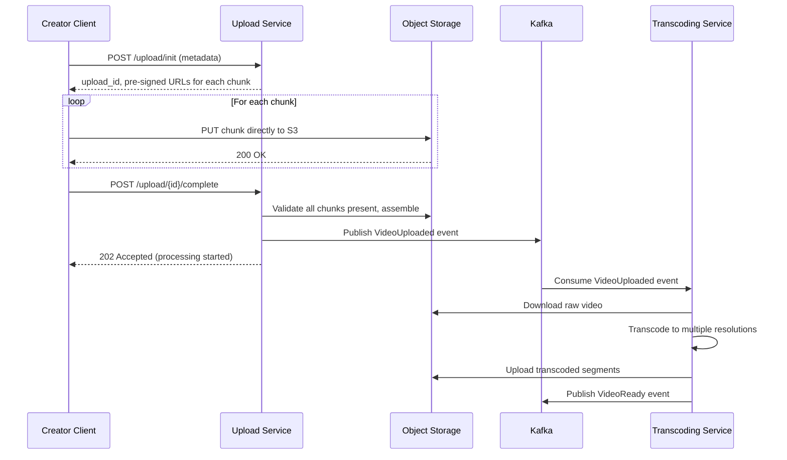
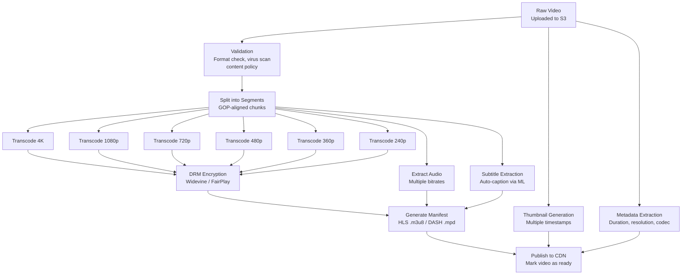
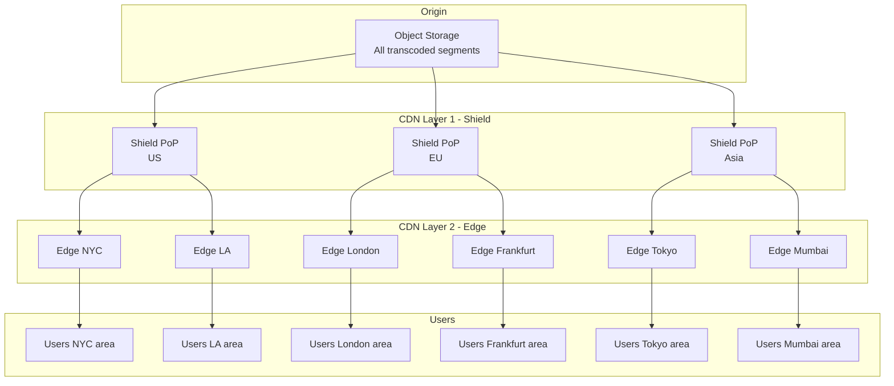
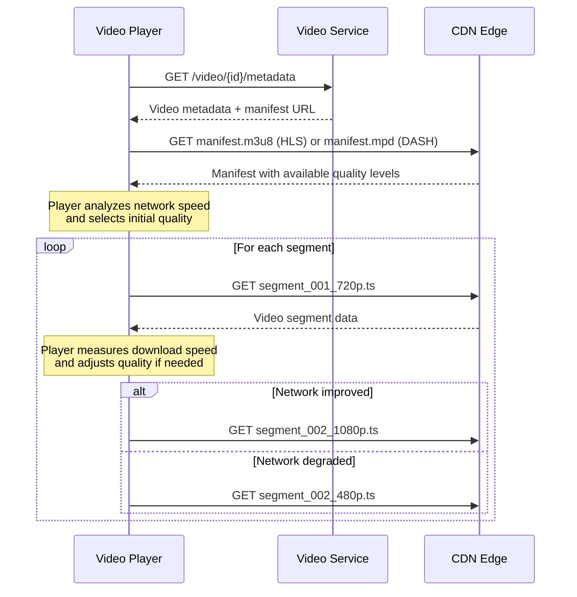
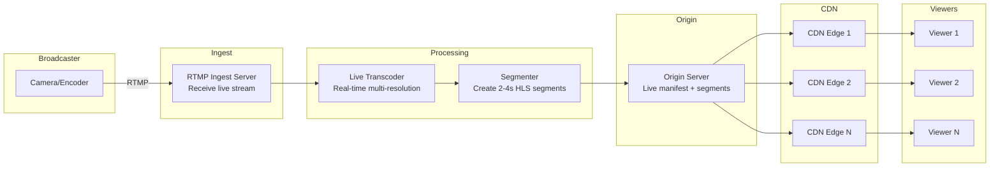

# System Design Interview: Video Streaming Platform
### Netflix / YouTube Scale

> [!NOTE]
> **Staff Engineer Interview Preparation Guide** — High Level Design Round

---

## Table of Contents

1. [Problem Clarification & Requirements](#1-problem-clarification--requirements)
2. [Capacity Estimation & Scale](#2-capacity-estimation--scale)
3. [High-Level Architecture](#3-high-level-architecture)
4. [Core Components Deep Dive](#4-core-components-deep-dive)
5. [Video Upload Pipeline](#5-video-upload-pipeline)
6. [Transcoding Service](#6-transcoding-service)
7. [CDN Strategy & Video Delivery](#7-cdn-strategy--video-delivery)
8. [Data Models & Storage](#8-data-models--storage)
9. [Search & Discovery](#9-search--discovery)
10. [Recommendation Engine](#10-recommendation-engine)
11. [Live Streaming](#11-live-streaming)
12. [DRM & Content Protection](#12-drm--content-protection)
13. [Scalability Strategies](#13-scalability-strategies)
14. [Design Trade-offs & Justifications](#14-design-trade-offs--justifications)
15. [Interview Cheat Sheet](#15-interview-cheat-sheet)

---

## 1. Problem Clarification & Requirements

> [!TIP]
> **Interview Tip:** Video streaming is one of the most infrastructure-heavy system design questions. The key insight to lead with is that video storage and bandwidth dwarf all other concerns by orders of magnitude. A single hour of 4K video is ~7 GB. Everything in this design flows from that reality.

### Questions to Ask the Interviewer

| Category | Question | Why It Matters |
|----------|----------|----------------|
| **Scale** | YouTube scale (billions DAU) or Netflix scale (hundreds of millions)? | YouTube is UGC + massive, Netflix is curated + smaller |
| **Content type** | User-generated content or licensed/curated? | Affects upload pipeline and content moderation |
| **Live streaming** | Do we need live streaming support? | Entirely different pipeline from VOD |
| **Devices** | TV, mobile, web, gaming consoles? | Adaptive bitrate and codec support varies |
| **Global** | Global audience or single region? | CDN and multi-region architecture |
| **Quality** | Up to 4K? HDR? Dolby Atmos? | Storage and transcoding complexity |
| **Offline** | Support offline downloads? | DRM and licensing constraints |
| **Interactions** | Comments, likes, subscriptions? | Social features add complexity |

---

### Functional Requirements (Agreed Upon)

- Users can upload videos (up to 4 hours, up to 4K resolution)
- Users can stream videos on any device with adaptive quality
- Search for videos by title, description, tags
- Video recommendations based on watch history
- Subscriptions/follows to content creators
- Comments and likes on videos
- Watch history and resume-from-where-you-left-off

### Non-Functional Requirements

- **Latency:** Video playback must start within 2 seconds of pressing play
- **Buffering:** Less than 1% of watch time should be spent buffering
- **Availability:** 99.99% uptime for the streaming service
- **Scale:** 1 billion DAU (YouTube scale), 500 hours of video uploaded per minute
- **Durability:** Uploaded videos must never be lost
- **Global reach:** Low latency streaming from any continent

---

## 2. Capacity Estimation & Scale

> [!TIP]
> **Interview Tip:** Video streaming numbers are massive. Do not try to be precise — round aggressively. The point is to demonstrate that you understand the order of magnitude of storage and bandwidth, which is what drives every architectural decision.

### Traffic Estimation

```
DAU                      = 1 Billion
Average watch time/day   = 30 minutes per user
Average video length     = 5 minutes
Videos watched per user  = 6 per day

Total video views/day    = 1B × 6 = 6 Billion views/day
View QPS                 = 6B / 86,400 ≈ 70,000 views/sec

Uploads:
  500 hours of video uploaded per minute
  = 30,000 hours/day
  = 360,000 videos/day (avg 5 min each)
  Upload QPS = 360,000 / 86,400 ≈ 4 uploads/sec

Read:Write ratio ≈ 17,000:1 (extremely read-heavy)
```

### Storage Estimation

```
Video Storage (after transcoding):
  Each video is transcoded to multiple resolutions:
    - 240p, 360p, 480p, 720p, 1080p, 1440p, 4K
  
  Average original video: 5 min × 500 MB = 500 MB
  After transcoding all resolutions: ~3x original = 1.5 GB per video
  
  Daily uploads: 360,000 × 1.5 GB = 540 TB/day
  Annual:        540 TB × 365      = ~197 PB/year
  
  With 3x replication across data centers: ~600 PB/year

Metadata Storage (negligible by comparison):
  Video metadata per video ≈ 2 KB
  360,000 × 2 KB = 720 MB/day → trivial
```

### Bandwidth Estimation

```
Streaming bandwidth:
  Average bitrate across all viewers ≈ 5 Mbps (mix of resolutions)
  Concurrent viewers (peak) = 200M (20% of DAU at peak)
  
  Peak bandwidth = 200M × 5 Mbps = 1,000 Petabits/sec = 1 Exabit/sec
  
  This is distributed across thousands of CDN edge nodes globally.
  Per edge node (assuming 10,000 nodes): 100 Gbps per node
  
Upload bandwidth:
  4 uploads/sec × 500 MB average = 2 GB/sec = 16 Gbps ingest
  Much smaller than streaming — upload is not the bottleneck.
```

### Cost Perspective

```
Storage cost (S3): ~$20/TB/month
  600 PB = 600,000 TB × $20 = $12M/month for storage alone
  
Bandwidth cost: ~$0.05/GB (CDN)
  Daily streaming: 200M concurrent × 5 Mbps × 8 hours peak × 3600 sec
                 = ~450 PB/day
  450,000 TB × $0.05/GB × 1000 = $22.5M/day → $8B/year bandwidth
  
This is why Netflix and YouTube operate their own CDN infrastructure
(Netflix Open Connect, Google's edge network).
```

> [!WARNING]
> These bandwidth numbers explain why no company other than the largest tech giants can build a YouTube competitor from scratch. The CDN infrastructure cost alone is in the billions per year. In an interview, mentioning this shows you understand real-world economics, not just architecture.

---

## 3. High-Level Architecture

> [!TIP]
> **Interview Tip:** Split the architecture into two separate systems: the Upload/Processing pipeline and the Streaming/Playback pipeline. These have completely different characteristics and constraints.



---

## 4. Core Components Deep Dive

### 4.1 Upload Service

The Upload Service handles ingesting raw video files from creators. At 500 hours per minute, this is not trivial — large files on unreliable network connections require special handling.

**Chunked Upload Protocol:**
1. Client sends a `POST /upload/init` request with video metadata (title, description, file size, content type)
2. Server responds with an `upload_id` and chunk size (e.g., 5 MB per chunk)
3. Client splits the file into chunks and uploads each chunk with `PUT /upload/{upload_id}/chunk/{chunk_number}`
4. Each chunk is acknowledged individually
5. Client sends `POST /upload/{upload_id}/complete` when all chunks are uploaded
6. Server reassembles chunks and validates integrity (checksum)

**Resumable Uploads:**
If the connection drops mid-upload, the client can query `GET /upload/{upload_id}/status` to determine which chunks have been received, then resume from the first missing chunk. The server stores chunk metadata in Redis with a 24-hour TTL.

**Pre-Signed URLs:**
For efficiency, the Upload Service generates pre-signed S3 URLs for each chunk. The client uploads directly to S3 (bypassing our servers), which dramatically reduces bandwidth costs and server load.



### 4.2 Video Service (Metadata + Manifest)

When a user clicks play on a video, the Video Service:
1. Returns the video metadata (title, description, view count, etc.)
2. Returns the **manifest file** (HLS `.m3u8` or DASH `.mpd`) that tells the video player which segments are available and at what resolutions
3. The player then fetches video segments directly from the CDN

The Video Service itself does NOT stream video data. It only serves metadata and the manifest. All actual video bytes flow through the CDN.

### 4.3 User Service

Manages user accounts, subscriptions, and preferences. Notable features:
- **Subscription management:** When user A subscribes to creator B, store this relationship (similar to the social graph in the feed design)
- **Watch history:** Record every video the user watches, including the timestamp where they stopped (for "continue watching")
- **Preferences:** Language, preferred quality, autoplay settings

---

## 5. Video Upload Pipeline

> [!TIP]
> **Interview Tip:** The upload pipeline is where you demonstrate understanding of distributed processing. The key insight is that video processing is a DAG (Directed Acyclic Graph) of tasks, not a linear pipeline.

### Processing DAG

When a raw video is uploaded, it must go through multiple processing stages. Some stages depend on others, and some can run in parallel:



### Why DAG-Based Processing?

A linear pipeline (validate → transcode 4K → transcode 1080p → ...) would be extremely slow because each transcoding step is sequential. A video that takes 10 minutes to transcode at one resolution would take 60+ minutes total for all resolutions.

With a DAG:
- All resolutions transcode in parallel (6 workers simultaneously)
- Thumbnail generation runs in parallel with transcoding
- Subtitle extraction runs in parallel
- Only DRM encryption and manifest generation wait for transcoding to complete

**Result:** A 10-minute video can be fully processed in ~15-20 minutes instead of 60+ minutes.

### DAG Orchestration

We use a task orchestration system (similar to Apache Airflow or a custom solution) to manage the DAG:

1. Each node in the DAG is a task with defined inputs, outputs, and dependencies
2. When a task completes, the orchestrator checks if any dependent tasks now have all their inputs satisfied
3. Satisfied tasks are dispatched to worker queues
4. Workers pull tasks from queues, process them, and report completion
5. The orchestrator tracks the overall progress and marks the video as "ready" when the final task completes

> [!NOTE]
> Failure handling is critical in the DAG. If a single transcoding task fails (e.g., worker crashes), only that task needs to be retried — not the entire pipeline. The orchestrator maintains a retry count per task and alerts on repeated failures.

### Content Moderation

Before making a video publicly available, automated content moderation runs:
- **Visual analysis:** Frame sampling + ML model to detect nudity, violence, copyrighted content
- **Audio analysis:** Copyright detection (similar to YouTube's Content ID)
- **Metadata analysis:** Title and description checked against policy violations

If automated moderation flags the video, it is queued for human review. The video remains in "processing" state until cleared.

---

## 6. Transcoding Service

> [!TIP]
> **Interview Tip:** Transcoding is computationally expensive and is the bottleneck of the upload pipeline. Understanding adaptive bitrate streaming is essential for this question.

### Why Transcode?

The raw uploaded video might be a 4K ProRes file that only works on one specific device. We transcode to ensure:
1. **Multiple resolutions:** Users on different devices and network speeds get appropriate quality
2. **Standard codecs:** Convert to widely supported codecs (H.264, H.265/HEVC, VP9, AV1)
3. **Segment alignment:** Break videos into small segments (2-10 seconds each) for adaptive streaming
4. **Consistent format:** Normalize frame rate, pixel aspect ratio, color space

### Adaptive Bitrate Streaming

The core concept: instead of streaming a single continuous video file, we break the video into small segments (typically 4-6 seconds each), each available at multiple quality levels. The video player dynamically selects the appropriate quality for each segment based on current network conditions.

**HLS (HTTP Live Streaming) — Apple's Protocol:**
- Master playlist (`.m3u8`) lists available quality levels
- Each quality level has its own playlist listing segments
- Segments are `.ts` (Transport Stream) files
- Widely supported on iOS, macOS, most browsers

**DASH (Dynamic Adaptive Streaming over HTTP) — Industry Standard:**
- MPD (Media Presentation Description) file lists available representations
- Segments are `.m4s` files
- More flexible than HLS (supports more codecs)
- Better suited for Android and web

### Transcoding Output Matrix

| Resolution | Bitrate (H.264) | Bitrate (H.265) | Segment Size (6s) |
|-----------|-----------------|-----------------|-------------------|
| 240p | 400 Kbps | 250 Kbps | 300 KB |
| 360p | 800 Kbps | 500 Kbps | 600 KB |
| 480p | 1.5 Mbps | 1 Mbps | 1.1 MB |
| 720p | 3 Mbps | 2 Mbps | 2.3 MB |
| 1080p | 6 Mbps | 4 Mbps | 4.5 MB |
| 1440p | 12 Mbps | 8 Mbps | 9 MB |
| 4K | 25 Mbps | 16 Mbps | 18.8 MB |

### Transcoding Worker Architecture

```
Worker Fleet:
  - GPU-accelerated instances (NVIDIA T4 or A10G) for hardware-accelerated encoding
  - Each worker handles one transcoding job at a time (single segment, single resolution)
  - Workers pull jobs from SQS/Kafka queues
  - Auto-scaling based on queue depth

Processing one video (5 min, 50 segments):
  - 50 segments × 7 resolutions = 350 transcoding tasks
  - With 350 parallel workers: all tasks complete in ~1 task duration
  - Typical task duration: 10-30 seconds
  - Total wall-clock time: ~30 seconds (massively parallel)
  
  Without parallelism: 350 × 20 seconds = ~2 hours
```

> [!IMPORTANT]
> The key to fast transcoding is parallelism at the segment level. Each segment of each resolution is an independent task. This is why we split the video into segments before transcoding, not after.

### Codec Selection Strategy

| Codec | Pro | Con | When to Use |
|-------|-----|-----|------------|
| H.264 (AVC) | Universal support | Larger file sizes | Default fallback, legacy devices |
| H.265 (HEVC) | 50% smaller than H.264 at same quality | Patent licensing costs, limited browser support | iOS, smart TVs, Apple devices |
| VP9 | Royalty-free, good quality | Slower encoding | Android, Chrome, YouTube default |
| AV1 | Best compression, royalty-free | Very slow encoding, limited hardware decode support | Future default, used for popular content |

**Strategy:** Encode in H.264 (universal) and one advanced codec (H.265 for Apple ecosystem, VP9 for Android/Chrome). For the most popular videos (top 1%), also encode in AV1 — the encoding cost is justified by bandwidth savings.

---

## 7. CDN Strategy & Video Delivery

> [!TIP]
> **Interview Tip:** The CDN is not an optimization — it IS the streaming infrastructure. Without a CDN, a centralized origin serving 200M concurrent viewers at 5 Mbps each is physically impossible. Make sure the interviewer understands this.

### CDN Architecture for Video



### Push vs Pull CDN Strategy

**Popular Content (Push):**
- When a video is newly released by a major creator or is trending, proactively push it to edge nodes
- Pre-warm the CDN before a scheduled release (e.g., new Netflix show dropping at midnight)
- Reduces first-viewer latency (the content is already at the edge)

**Long-Tail Content (Pull):**
- Most videos are rarely watched. Pre-populating them on all edge nodes would waste storage.
- Use pull-through caching: the first viewer triggers a cache miss, the edge node fetches from the origin (via the shield), and subsequent viewers are served from the edge cache
- TTL-based eviction ensures infrequently accessed content does not consume edge storage

### Video Playback Flow



### Multi-CDN Strategy

At YouTube/Netflix scale, relying on a single CDN provider is risky and expensive. A multi-CDN strategy uses multiple providers simultaneously:

- **Performance-based routing:** Measure latency and throughput from each CDN provider in each region. Route traffic to the best-performing CDN.
- **Failover:** If one CDN has an outage, automatically route traffic to alternatives.
- **Cost optimization:** Negotiate volume discounts with multiple providers and shift traffic based on pricing tiers.
- **Netflix approach:** Netflix operates its own CDN (Open Connect) with appliances co-located in ISP data centers. This eliminates transit costs and provides the best possible latency.

---

## 8. Data Models & Storage

> [!TIP]
> **Interview Tip:** The video metadata is tiny compared to the video itself, but it is accessed orders of magnitude more frequently. Treat metadata storage as a separate concern from video storage.

### Core Data Models

**Video Table (MySQL, sharded by creator_id)**

| Column | Type | Description |
|--------|------|-------------|
| video_id | BIGINT PK | Snowflake-style unique ID |
| creator_id | BIGINT | FK to User table |
| title | VARCHAR(100) | Video title |
| description | TEXT | Video description |
| tags | JSON | Array of tags |
| duration_seconds | INT | Video duration |
| original_resolution | VARCHAR(10) | e.g., "3840x2160" |
| thumbnail_url | VARCHAR(512) | Default thumbnail S3 URL |
| manifest_url | VARCHAR(512) | HLS/DASH manifest URL |
| status | ENUM | uploading, processing, ready, failed, removed |
| visibility | ENUM | public, unlisted, private |
| view_count | BIGINT | Denormalized view count |
| like_count | BIGINT | Denormalized like count |
| comment_count | BIGINT | Denormalized comment count |
| created_at | TIMESTAMP | Upload timestamp |
| published_at | TIMESTAMP | When the video became public |

**User Table (MySQL)**

| Column | Type | Description |
|--------|------|-------------|
| user_id | BIGINT PK | Unique user ID |
| username | VARCHAR(30) | Display name |
| email | VARCHAR(255) | Email address |
| subscriber_count | BIGINT | Number of subscribers |
| total_views | BIGINT | Total views across all videos |
| channel_description | TEXT | Channel about text |
| created_at | TIMESTAMP | Account creation |

**Watch History Table (Cassandra)**

| Column | Type | Description |
|--------|------|-------------|
| user_id | BIGINT | Partition key |
| video_id | BIGINT | Clustering key |
| watch_timestamp | TIMESTAMP | When the user last watched |
| progress_seconds | INT | Where the user stopped |
| completed | BOOLEAN | Did they watch >90%? |

Cassandra is ideal here because:
- Write-heavy (every play/pause/stop generates a write)
- Partition by user_id enables fast "continue watching" queries
- No need for complex queries or joins

**Subscription Table (Cassandra)**

| Column | Type | Description |
|--------|------|-------------|
| subscriber_id | BIGINT | Partition key |
| creator_id | BIGINT | Clustering key |
| subscribed_at | TIMESTAMP | When the subscription started |

### Storage Architecture Summary

| Data | Storage | Volume | Access Pattern |
|------|---------|--------|----------------|
| Raw videos | S3 (cold tier) | ~500 MB each | Rarely accessed after processing |
| Transcoded segments | S3 (standard) + CDN | ~1.5 GB per video | Very frequent, served via CDN |
| Video metadata | MySQL + Redis cache | ~2 KB per video | Every video view reads this |
| Watch history | Cassandra | ~50 bytes per entry | Write on every play event |
| View counts | Redis (real-time) + MySQL (persistent) | 8 bytes per video | Increment on every view |
| Comments | MySQL (sharded by video_id) | ~500 bytes each | Read-heavy per video page |
| Search index | Elasticsearch | ~1 KB per video | Every search query |

---

## 9. Search & Discovery

### Video Search

Search is powered by Elasticsearch with an inverted index on video metadata:

**Indexed Fields:**
- Title (full-text, boosted 3x)
- Description (full-text, boosted 1x)
- Tags (keyword, exact match, boosted 2x)
- Creator username (keyword)
- Auto-generated captions (full-text, boosted 0.5x)
- Category (keyword, for filtering)

**Ranking Factors:**
- Text relevance score (from Elasticsearch BM25)
- Video freshness (recent videos boosted)
- Engagement rate (views, likes, watch-through rate)
- Creator authority (subscriber count, verification status)
- User personalization (boost results from creators the user subscribes to)

### Autocomplete

As the user types, we provide suggestions:
1. **Popular searches:** Maintained in Redis as a sorted set (score = search frequency in last 24 hours)
2. **Prefix matching:** Elasticsearch completion suggester with fuzzy matching
3. **Personalized suggestions:** Recently searched terms by this user (stored client-side or in Redis)

The autocomplete endpoint must return results in <50ms. We pre-compute the top 10,000 search suggestions and cache them in Redis, updating every 5 minutes.

### Content Discovery

Beyond search, users discover content through:
- **Home page recommendations** (see Section 10)
- **Related videos** (shown in the sidebar while watching a video)
- **Trending** (computed similarly to the social media feed trending system: velocity-based ranking)
- **Subscriptions feed** (chronological list of new videos from subscribed creators)

---

## 10. Recommendation Engine

> [!TIP]
> **Interview Tip:** You are not expected to design a full ML recommendation system. Show that you understand the high-level approaches (collaborative filtering, content-based, hybrid) and the data pipeline that feeds them.

### Recommendation Approaches

**Collaborative Filtering:**
"Users who watched videos A and B also watched video C."

This approach finds users with similar watch histories and recommends videos that similar users enjoyed but the current user has not seen.

- Build a user-video interaction matrix (implicit feedback: watch time, likes, saves)
- Use matrix factorization (ALS or SVD) to find latent factors
- Compute similarity between users or between items
- Recommend items similar to what the user has engaged with

**Content-Based Filtering:**
"This video has similar tags, category, and audio features to videos you have enjoyed."

- Extract features from each video: category, tags, audio analysis, visual features (thumbnail CNN embeddings), transcript topic modeling
- Build a user preference profile from their watch history
- Recommend videos whose features match the user's profile

**Hybrid Approach (Recommended):**
Combine both methods. Collaborative filtering discovers unexpected interests (serendipity). Content-based filtering provides relevant results even for new users with limited history (cold start).

### Recommendation Pipeline

```
Offline Pipeline (runs daily or hourly):
  1. Collect all user-video interactions from the last 30 days
  2. Train collaborative filtering model (matrix factorization)
  3. For each user, generate top-500 candidate videos
  4. Store candidates in a key-value store (Redis or DynamoDB)

Online Pipeline (at request time):
  1. Fetch pre-computed candidates for the user (top 500)
  2. Apply real-time signals (trending boost, freshness boost, diversity rules)
  3. Re-rank candidates using a lightweight model (logistic regression or small neural net)
  4. Filter out videos the user has already watched (check watch history)
  5. Return top 20 recommendations
```

### Cold Start Problem

New users have no watch history, so collaborative filtering fails. Solutions:
- Ask for interests during onboarding (select categories you like)
- Show globally popular content initially
- Use demographic signals (age, country) to bootstrap recommendations from similar demographics
- Switch to collaborative filtering after 10-20 videos watched

New videos have no engagement data. Solutions:
- Use content-based features (tags, category, creator history) for initial placement
- Give new videos from popular creators a boost
- A/B test new videos on a small percentage of users to collect initial engagement data

---

## 11. Live Streaming

> [!TIP]
> **Interview Tip:** Live streaming is often a follow-up question. The key difference from VOD is that content does not exist yet — you are processing and distributing a real-time stream. This changes everything about the pipeline.

### Live Streaming Architecture



### VOD vs Live: Key Differences

| Aspect | VOD (Video on Demand) | Live Streaming |
|--------|----------------------|----------------|
| Content availability | Pre-existing, fully processed | Generated in real-time |
| Transcoding | Offline, can take hours | Must be real-time (faster than real-time) |
| Latency tolerance | Seconds of startup OK | 5-30 seconds glass-to-glass |
| Segment duration | 4-10 seconds (larger = more efficient) | 2-4 seconds (smaller = lower latency) |
| CDN caching | Long TTL, content is immutable | Very short TTL, manifest updates constantly |
| Error tolerance | Can retry segment fetches | Segment is gone if missed |
| Seek/rewind | Full support | Limited (DVR window) |

### Latency Spectrum for Live Streaming

| Protocol | Latency | Use Case |
|----------|---------|----------|
| HLS (standard) | 15-30 seconds | Most live streams |
| Low-Latency HLS (LL-HLS) | 2-5 seconds | Interactive streams |
| DASH Low Latency | 2-5 seconds | Alternative to LL-HLS |
| WebRTC | <1 second | Video calls, auctions |
| RTMP (ingest only) | 1-3 seconds | Broadcaster to server |

**Trade-off:** Lower latency requires smaller segments, more frequent manifest updates, and more CDN origin load. For most use cases (watching a sports event, a concert), 15-30 seconds of latency is acceptable. For interactive streams (Q&A, auctions), sub-5-second latency is required.

### Live-to-VOD

After a live stream ends, the recorded segments are assembled into a VOD asset:
1. Concatenate all segments into a continuous video
2. Generate a static HLS/DASH manifest (no longer updating)
3. Optionally re-transcode for better quality (live transcoding prioritizes speed over quality)
4. Index the VOD for search and recommendations

---

## 12. DRM & Content Protection

### Why DRM?

Content owners (studios, record labels) require DRM as a contractual obligation before licensing their content for streaming. Without DRM, content would be easily downloadable and redistributable.

### DRM Systems

| DRM | Platform | Encryption |
|-----|----------|------------|
| Widevine (Google) | Android, Chrome, Firefox, Smart TVs | CENC (AES-128 CTR) |
| FairPlay (Apple) | iOS, macOS, Safari, Apple TV | Sample AES-128 |
| PlayReady (Microsoft) | Windows, Xbox, Edge | CENC (AES-128 CTR) |

### DRM Flow

1. **Encryption:** During transcoding, encrypt each video segment using AES-128. The encryption key is stored in a License Server, not alongside the content.
2. **License acquisition:** When a user presses play, the video player contacts the License Server to obtain a decryption license. The License Server verifies the user's subscription, device, and content access rights before issuing a time-limited license.
3. **Playback:** The player uses the license to decrypt segments on-the-fly. The decrypted content is rendered in a secure pipeline (hardware-protected on supported devices) to prevent screen capture.

> [!NOTE]
> DRM is not foolproof — a determined attacker can capture the analog output (the "analog hole"). The goal is to make mass redistribution difficult enough that casual piracy is deterred. No DRM system is unbreakable, but they are a contractual requirement.

### Multi-DRM Strategy

Since different platforms require different DRM systems, we use **CENC (Common Encryption)** to encrypt content once and serve it with multiple DRM license servers. The same encrypted segments work with Widevine, FairPlay (with a minor header difference), and PlayReady, reducing storage overhead.

---

## 13. Scalability Strategies

> [!TIP]
> **Interview Tip:** At video streaming scale, the scalability challenges are primarily about bandwidth and storage, not compute. Every architectural decision should be viewed through the lens of "does this reduce bandwidth or storage costs?"

### Scaling the Upload Pipeline

| Bottleneck | Strategy |
|-----------|----------|
| Upload bandwidth | Pre-signed URLs let clients upload directly to S3, bypassing our servers |
| Transcoding compute | Auto-scale GPU worker fleet based on job queue depth |
| Transcoding time | Segment-level parallelism: 350 parallel tasks per video |
| Storage cost | Tiered storage: hot (S3 Standard) for popular content, cold (S3 Glacier) for old/unpopular |

### Scaling the Streaming Pipeline

| Bottleneck | Strategy |
|-----------|----------|
| CDN bandwidth | Multi-CDN, own CDN (Netflix Open Connect), ISP co-location |
| CDN cache hit rate | Push popular content to edges proactively, long TTLs for VOD segments |
| Origin load | Shield/mid-tier CDN layer absorbs edge cache misses before hitting origin |
| Manifest requests | Cache manifests aggressively (for VOD, they are immutable) |

### View Count Scaling

At 70,000 views/sec, incrementing a counter in a relational database for every view would create extreme contention. Instead:

1. Increment a Redis counter (`INCR video:{id}:views`) — O(1), no contention
2. A background job flushes Redis counters to MySQL every 5 minutes (batch update)
3. The view count displayed to users is eventually consistent (accurate within 5 minutes)
4. For trending calculations, use the real-time Redis counter

### Geographic Scaling

Deploy the API and metadata services in multiple regions (US, EU, Asia). Each region has:
- Read replicas of the video metadata database
- A Redis cache cluster
- Local CDN edge nodes

All writes (uploads, comments, likes) go to the primary region. Cross-region replication ensures metadata is available everywhere within seconds.

---

## 14. Design Trade-offs & Justifications

### Trade-off 1: HLS vs DASH

| Consideration | Our Decision | Alternative |
|--------------|-------------|-------------|
| Protocol | HLS primary, DASH for Android/Chrome | DASH only |
| Apple device support | Native HLS support | DASH requires third-party player on iOS |
| Segment format | fMP4 (works with both HLS and DASH) | MPEG-TS for HLS (larger files) |
| DRM | Multi-DRM (Widevine + FairPlay) | Single DRM (limited platform support) |

**Justification:** Apple devices (iOS, Apple TV, Mac) represent a significant portion of premium subscribers. HLS is the only natively supported streaming protocol on these devices. By using fMP4 segments (supported by both HLS and DASH), we avoid storing duplicate segment formats.

### Trade-off 2: Pre-transcode All Resolutions vs On-Demand Transcoding

| Consideration | Our Decision | Alternative |
|--------------|-------------|-------------|
| Approach | Pre-transcode all resolutions for all videos | Transcode on-demand for rarely-watched resolutions |
| Storage cost | Higher (7 resolutions per video) | Lower (only transcode what is requested) |
| First-view latency | Instant (all resolutions ready) | Minutes of delay for first viewer at a new resolution |
| Complexity | Lower (simple pipeline) | Higher (on-demand transcoding infrastructure) |

**Justification:** Storage is cheap ($20/TB/month). On-demand transcoding requires maintaining always-ready GPU workers and introduces unpredictable latency for viewers. The storage cost of pre-transcoding all resolutions is negligible compared to the CDN bandwidth cost.

### Trade-off 3: Segment Duration

| Consideration | Our Decision | Alternative |
|--------------|-------------|-------------|
| VOD segment duration | 6 seconds | 2 seconds or 10 seconds |
| Live segment duration | 2-4 seconds | 6 seconds |
| Startup latency | 1-2 segments before playback (~6-12s buffer) | Smaller segments = faster startup |
| Encoding efficiency | Better (larger segments encode more efficiently) | Worse (smaller segments have more overhead) |
| Adaptation speed | Slower (quality change every 6 seconds) | Faster (quality change every 2 seconds) |

**Justification:** 6-second segments for VOD provide good encoding efficiency and acceptable adaptation speed. For live streaming, 2-4 second segments reduce latency at the cost of slightly lower encoding efficiency and higher CDN request rate.

### Trade-off 4: Own CDN vs Third-Party CDN

| Consideration | Our Decision | Alternative |
|--------------|-------------|-------------|
| Approach | Multi-CDN with own edge appliances for top ISPs | Single third-party CDN (e.g., Akamai, CloudFront) |
| Cost | Lower at scale (amortize hardware over years) | Higher per-GB cost but no hardware investment |
| Control | Full control over caching, routing, failover | Limited to CDN provider's features |
| Operational complexity | Very high (hardware deployment, ISP relationships) | Low (managed service) |

**Justification:** At YouTube/Netflix scale (exabytes of monthly bandwidth), third-party CDN costs are prohibitive. Deploying your own CDN hardware in ISP data centers (Netflix Open Connect model) reduces bandwidth costs by 10-100x and provides the best possible streaming quality.

---

## 15. Interview Cheat Sheet

> [!IMPORTANT]
> Use this as a quick reference. The key differentiators for a Staff-level answer are: understanding the DAG-based transcoding pipeline, adaptive bitrate streaming, and CDN architecture.

### Key Numbers to Remember

| Metric | Value |
|--------|-------|
| DAU | 1 Billion |
| Videos uploaded per minute | 500 hours |
| View QPS | ~70,000/sec |
| Upload QPS | ~4/sec |
| Read:Write ratio | 17,000:1 |
| Storage per video (all resolutions) | ~1.5 GB |
| Daily storage growth | ~540 TB |
| Annual storage growth | ~200 PB |
| Peak concurrent viewers | 200 Million |
| Peak bandwidth | ~1 Exabit/sec (across CDN) |
| Transcoding parallelism | 350 tasks per video |

### Decision Summary

| Decision Point | Choice | Key Reason |
|----------------|--------|------------|
| Upload method | Chunked, resumable, pre-signed URLs | Large files, unreliable networks |
| Transcoding | DAG-based, segment-level parallelism | 10x faster than sequential |
| Streaming protocol | HLS + DASH | Apple requires HLS, Android/Chrome prefer DASH |
| Segment format | fMP4 | Compatible with both HLS and DASH |
| Segment duration | 6s (VOD), 2-4s (live) | Balance efficiency and adaptation speed |
| CDN | Multi-CDN + own edge (at scale) | Cost, control, quality |
| Video metadata DB | MySQL + Redis cache | Structured data, read-heavy |
| Watch history | Cassandra | Write-heavy, simple access pattern |
| Search | Elasticsearch | Full-text + autocomplete |
| DRM | Multi-DRM (Widevine + FairPlay + PlayReady) | Cross-platform support |

### Common Follow-Up Questions

**Q: How do you handle a video with 1 billion views — does the view counter bottleneck?**
A: Redis `INCR` for real-time counting (O(1), handles millions of increments/sec). Flush to MySQL in batches every 5 minutes. The displayed count is eventually consistent.

**Q: How do you handle copyright claims?**
A: At upload time, run audio fingerprinting (similar to Shazam) and visual fingerprinting against a database of copyrighted content. If a match is found, apply the rights holder's policy (block, monetize via ads, or allow). This is similar to YouTube's Content ID system.

**Q: How would you implement "continue watching" (resume from where you left off)?**
A: The video player sends a progress event every 10 seconds to the Watch History service, recording `(user_id, video_id, progress_seconds)` in Cassandra. When the user returns to the video, fetch the last recorded progress and seek to that position.

**Q: How would you reduce storage costs for old, rarely-watched videos?**
A: Tiered storage strategy. Videos not watched in 90 days: move to S3 Infrequent Access (50% cheaper). Not watched in 1 year: move to S3 Glacier (90% cheaper). If a viewer requests a Glacier video, serve a lower-resolution cached version while restoring the full-quality version (takes 1-5 minutes).

**Q: How do you prevent buffering on slow networks?**
A: Adaptive bitrate streaming automatically drops to a lower resolution. Additionally: (1) Pre-buffer 30 seconds of video before starting playback, (2) Use a lower initial bitrate and ramp up (fast start), (3) Edge servers close to the user reduce round-trip time, (4) Use HTTP/2 or HTTP/3 (QUIC) for faster segment downloads.

### Whiteboard Summary

If you have limited time, draw these two pipelines:

```
UPLOAD PIPELINE:
Client → S3 (chunked) → Kafka → Transcode Workers (parallel per segment per resolution)
  → Encrypt (DRM) → Generate Manifest → CDN

STREAMING PIPELINE:
Player → Video Service (metadata + manifest URL)
Player → CDN Edge → Shield → Origin (S3)
Player adapts quality per segment based on bandwidth
```

---

> [!NOTE]
> **Final Thought:** Video streaming is the largest consumer of internet bandwidth globally (Netflix + YouTube account for over 50% of downstream traffic in many markets). Understanding this system means understanding the backbone of the modern internet. The key takeaway: at this scale, bandwidth economics drive every decision, from codec selection to CDN architecture to storage tiering.
