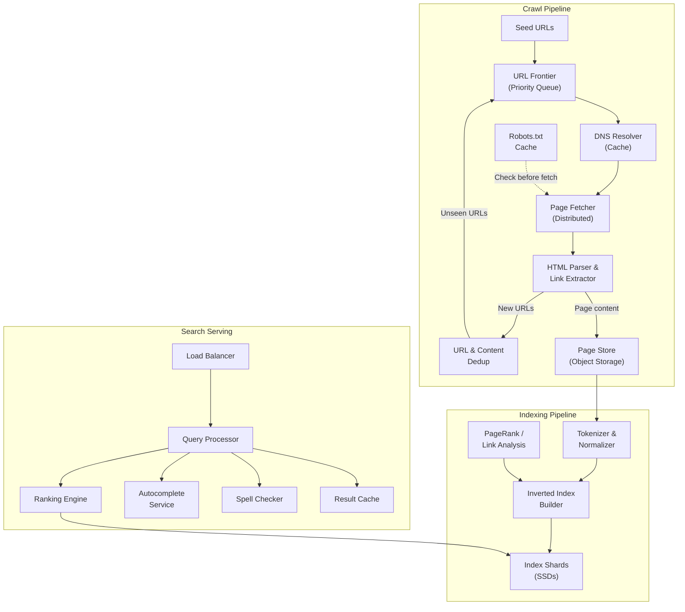
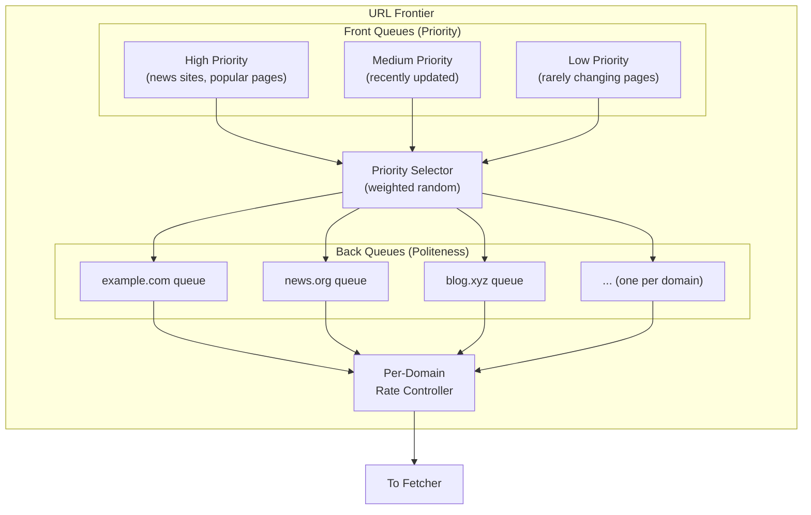
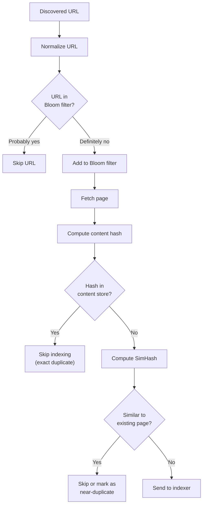
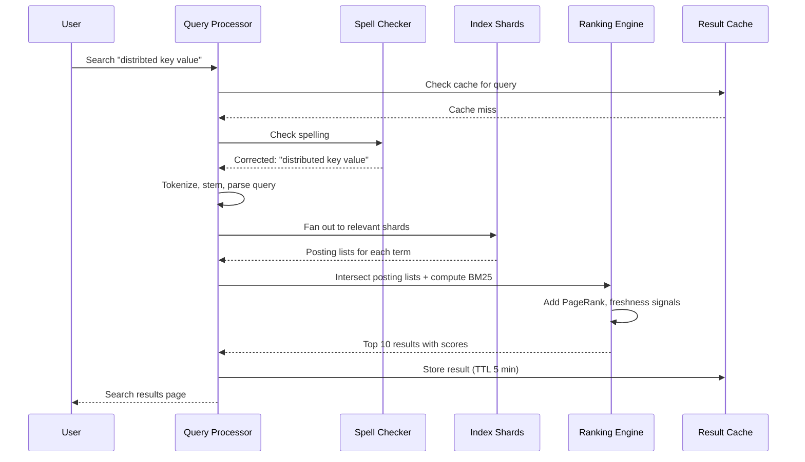
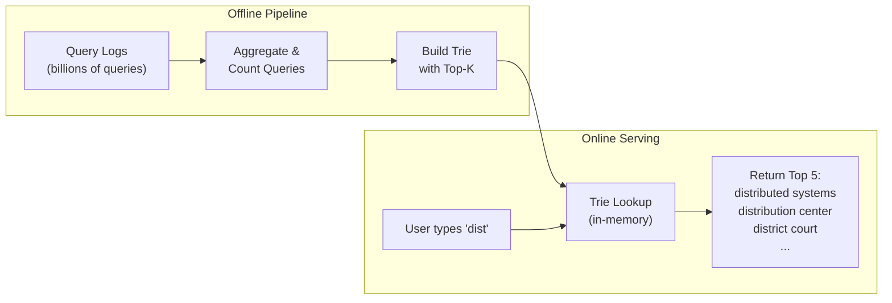
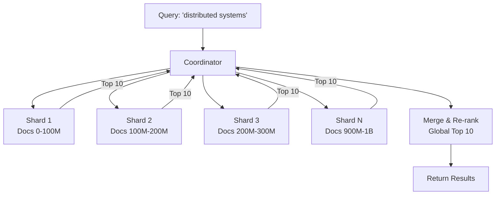

# Design a Web Crawler and Search Engine

## Introduction

A search engine is one of the most complex distributed systems ever built. It involves crawling billions of web pages, building a searchable index, ranking results by relevance, and serving queries with sub-second latency. The two halves of this system -- crawling and searching -- each present unique challenges at scale.

In a system design interview, this topic tests your understanding of distributed computing, data processing pipelines, storage systems, and information retrieval algorithms. This article covers both the crawler and the search engine as a unified system.

---

## Requirements

### Functional Requirements

1. **Web crawling**: Discover and download web pages starting from a set of seed URLs.
2. **Index construction**: Build a searchable inverted index from crawled content.
3. **Search queries**: Accept keyword queries and return ranked results.
4. **Autocomplete**: Provide real-time query suggestions as the user types.
5. **Freshness**: Re-crawl pages to keep the index up to date.

### Non-Functional Requirements

1. **Scale**: Crawl 1 billion pages per month.
2. **Search latency**: P99 under 200 ms for search queries.
3. **Index freshness**: Popular pages re-crawled within 24 hours; others within 1-2 weeks.
4. **Politeness**: Respect robots.txt, crawl delays, and per-domain rate limits.
5. **Fault tolerance**: No single point of failure in the crawling or serving pipeline.

---

## Capacity Estimation

### Crawl Side

| Metric | Calculation | Value |
|--------|------------|-------|
| Pages/month | Given | 1,000,000,000 |
| Pages/day | 1B / 30 | ~33,000,000 |
| Pages/second | 33M / 86,400 | ~382 pages/sec |
| Avg page size (compressed) | Estimated | ~100 KB |
| Daily raw download | 33M x 100 KB | ~3.3 TB/day |
| Monthly raw storage | 3.3 TB x 30 | ~100 TB/month |
| Avg links per page | Estimated | ~50 |
| New URLs discovered/day | 33M x 50 | ~1.65 billion/day (many duplicates) |

### Search Side

| Metric | Calculation | Value |
|--------|------------|-------|
| Index size (compressed) | ~30% of raw content | ~30 TB |
| Search QPS (average) | Estimated for medium scale | ~10,000 QPS |
| Peak QPS (3x) | 10K x 3 | ~30,000 QPS |
| Avg query latency target | Given | < 200 ms (P99) |
| Autocomplete QPS | ~3x search (per keystroke) | ~30,000 QPS avg |

> [!TIP]
> In an interview, separate the crawl-side and search-side estimations. They have very different resource profiles: the crawler is I/O and bandwidth heavy, while search is compute and memory heavy.

---

## High-Level Architecture



---

## Core Components Deep Dive

### 1. URL Frontier (Priority Queue)

The URL frontier is the brain of the crawler. It decides what to crawl next and enforces politeness.

**Two-level architecture**:



**Front queues (priority)**: URLs are classified by importance. Factors include: page popularity (from previous crawls), how recently the page changed, the domain authority, and whether the page was explicitly submitted. A priority selector picks from higher-priority queues more often but does not starve lower ones.

**Back queues (politeness)**: One queue per domain. A per-domain rate controller ensures we never send more than one request per N seconds to any single domain. This prevents overwhelming small websites and respects `Crawl-Delay` directives in robots.txt.

> [!IMPORTANT]
> Politeness is not optional. An impolite crawler can bring down small websites, get your IP addresses banned, and potentially violate laws. The back-queue architecture ensures politeness is structural, not an afterthought.

### 2. Robots.txt Handling

Before crawling any page on a domain, the crawler fetches and caches the domain's `robots.txt` file.

- **Cache TTL**: robots.txt is cached for 24 hours per domain.
- **Parsing**: The crawler respects `Disallow` directives, `Crawl-Delay`, and `Sitemap` hints.
- **Failure handling**: If robots.txt returns a 5xx error, the crawler waits and retries. If it returns 404, the crawler assumes all pages are allowed.

### 3. Page Fetcher

The fetcher is the most I/O-intensive component. It makes HTTP requests to download pages.

**Design considerations**:

- **Distributed**: Run hundreds of fetcher instances across multiple machines and IP addresses.
- **Async I/O**: Use non-blocking HTTP clients to maximize throughput per instance. A single fetcher instance should handle thousands of concurrent connections.
- **Timeout handling**: Set aggressive timeouts (10-15 seconds). Slow sites should not block the crawler.
- **Redirect following**: Follow up to 5 redirects, then abort.
- **Content type filtering**: Only process HTML/text. Skip images, videos, and binary files.

### 4. URL and Content Deduplication

At 1.65 billion URLs discovered per day, deduplication is critical.

**URL deduplication**:
- Normalize URLs: lowercase the hostname, remove fragments (#), sort query parameters, remove tracking parameters.
- Use a Bloom filter for fast membership testing. A Bloom filter with 10 billion entries and a 1% false positive rate requires about 12 GB of memory. False positives mean we skip some valid URLs, which is acceptable.
- For exact dedup, maintain a hash set of all seen URL hashes in a distributed key-value store.

**Content deduplication**:
- Exact duplicates: Compute a hash (e.g., SHA-256) of the page body. If the hash exists, skip indexing.
- Near duplicates: Use SimHash or MinHash to compute a fingerprint. Pages with fingerprint similarity above a threshold (e.g., 90%) are considered duplicates. This catches mirror sites, syndicated content, and pages that differ only in headers/footers.



### 5. HTML Parser and Link Extractor

After downloading a page, the parser:

1. **Extracts text content**: Strips HTML tags, scripts, styles, and navigation elements. Identifies the main content area (using heuristics or a library like readability).
2. **Extracts metadata**: Title, meta description, Open Graph tags, structured data (JSON-LD).
3. **Extracts links**: All `<a href>` links are normalized and sent to the dedup module, which feeds new URLs back to the frontier.
4. **Detects language**: Classify the page language for language-specific indexing.

### 6. Inverted Index Construction

The inverted index is the core data structure that powers search. It maps every word to the list of documents containing that word.

**Tokenization pipeline**:

```
Raw text -> Lowercase -> Remove punctuation -> Tokenize (split on whitespace)
-> Remove stop words ("the", "a", "is") -> Stemming ("running" -> "run")
-> Store in posting list
```

**Posting list structure**:

```
"distributed" -> [(doc_1, freq=3, positions=[5,42,108]),
                  (doc_7, freq=1, positions=[22]),
                  (doc_15, freq=5, positions=[1,8,30,55,99]),
                  ...]
```

Each posting list entry contains:
- **Document ID**: Internal ID for the page.
- **Term frequency**: How many times the term appears in the document.
- **Positions**: Where the term appears (enables phrase queries like "distributed systems").

**Index compression**: Posting lists are sorted by document ID. The differences between consecutive document IDs (delta encoding) are typically small and compress well with variable-byte encoding or Simple9/PForDelta encoding. This reduces index size by 3-5x.

> [!NOTE]
> The inverted index is conceptually simple -- it is just a dictionary mapping words to documents. The challenge is building and serving it at scale: the index for 1 billion pages might be 30+ TB.

### 7. Search Ranking

When a user searches for "distributed key value store," the system must return the most relevant results out of potentially millions of matching documents.

**Ranking signals**:

| Signal | Description | Weight |
|--------|------------|--------|
| BM25 score | Term frequency adjusted for document length | High |
| PageRank | Authority based on incoming links | Medium |
| Freshness | How recently the page was updated | Medium |
| Title match | Query terms appear in page title | High |
| URL match | Query terms appear in URL path | Low-Medium |
| Domain authority | Overall trust of the domain | Medium |
| Click-through rate | Historical user clicks for this query | High (if available) |

**BM25** is the industry standard for text relevance scoring. It improves on basic TF-IDF by:
- Saturating term frequency (the 10th occurrence of a word adds less relevance than the 2nd).
- Normalizing for document length (a 100-word page mentioning "database" 5 times is more relevant than a 10,000-word page mentioning it 5 times).

**PageRank** models the web as a directed graph. A page's rank is proportional to the sum of the ranks of pages linking to it, divided by their outgoing link counts. Intuitively, a page is important if important pages link to it. In practice, PageRank is computed offline as a batch job over the entire link graph.



### 8. Autocomplete / Typeahead

Autocomplete suggests queries as the user types. This is a separate system from search, optimized for extreme low latency (< 50 ms).

**Architecture**:



**Trie data structure**: Each node in the trie represents a character. At each node, store the top-K most popular queries that share this prefix. This pre-computation means serving is a single trie traversal, which takes microseconds.

**Updates**: The trie is rebuilt periodically (e.g., every few hours) from aggregated query logs. Trending queries can be boosted by maintaining a short-term frequency counter alongside the long-term trie.

**Sharding**: For a large query corpus, shard the trie by the first two characters. "di" queries go to one shard, "do" queries to another. Each shard fits in memory on a single server.

### 9. Spell Correction

When a user types "distribted systms," the search engine should suggest "distributed systems."

**Approaches**:

| Method | How It Works | Pros | Cons |
|--------|-------------|------|------|
| Edit distance (Levenshtein) | Find dictionary words within 1-2 edits | Accurate | Slow for large dictionaries |
| Phonetic matching (Soundex, Metaphone) | Map words to phonetic codes | Catches phonetic errors | Misses non-phonetic typos |
| Query log mining | Find the most common correction for a misspelling | Learns real user behavior | Requires large query logs |
| N-gram similarity | Compare character n-grams between query and dictionary | Fast, fuzzy | Less precise |

**In practice**: Use a combination. First, check if the query matches any popular query exactly. If not, generate candidate corrections using edit distance and rank them by popularity from query logs.

---

## Data Models & Storage

### Crawl Storage

**URL Frontier** (Redis / RocksDB):

| Field | Type | Description |
|-------|------|-------------|
| url_hash | CHAR(64) | SHA-256 of normalized URL |
| url | TEXT | Full URL |
| domain | VARCHAR(255) | Extracted domain |
| priority | INT | Crawl priority score |
| last_crawled | TIMESTAMP | When last fetched |
| next_crawl | TIMESTAMP | When to re-crawl |
| crawl_status | ENUM | pending, fetched, failed, blocked |

**Page Store** (Object storage like S3):

| Field | Type | Description |
|-------|------|-------------|
| doc_id | BIGINT | Internal document ID |
| url | TEXT | Canonical URL |
| content_hash | CHAR(64) | SHA-256 of body |
| raw_html | BLOB | Compressed raw HTML |
| extracted_text | TEXT | Cleaned text content |
| title | VARCHAR(500) | Page title |
| outgoing_links | JSON | List of extracted URLs |
| crawl_time | TIMESTAMP | When downloaded |
| http_status | INT | HTTP response code |

### Index Storage

**Inverted Index** (custom binary format on SSD):

| Component | Description |
|-----------|------------|
| Term dictionary | Sorted list of all terms with pointers to posting lists |
| Posting lists | For each term: sorted list of (doc_id, frequency, positions) |
| Document metadata | Per-doc: title, URL snippet, PageRank score, last_modified |
| Field index | Separate indexes for title, body, URL, anchor text |

### Storage Technology Choices

| Component | Technology | Rationale |
|-----------|-----------|-----------|
| URL frontier | Redis + RocksDB | Fast queue operations, persistent backup |
| Page store | S3 / HDFS | Cheap, durable storage for raw pages |
| Inverted index | Custom on SSD | Low latency random reads for posting lists |
| PageRank graph | HDFS + Spark | Batch processing of link graph |
| Autocomplete trie | In-memory (Redis or custom) | Sub-millisecond lookups |
| Query logs | Kafka -> HDFS | High throughput event streaming |

---

## Scalability Strategies

### Crawler Scaling

- **Distributed fetchers**: Run fetcher instances across hundreds of machines with different IP ranges to avoid per-IP rate limits.
- **DNS caching**: DNS lookups are expensive. Cache DNS resolutions locally with a 1-hour TTL. Use a dedicated DNS resolver cluster.
- **Adaptive crawl rate**: Monitor each domain's response time. If a domain slows down, reduce crawl rate automatically.
- **Prioritized re-crawling**: Pages that change frequently (news sites) are re-crawled more often than static pages. Track change frequency from previous crawls.

### Index Sharding

Two strategies for sharding the inverted index:

| Strategy | Description | Pros | Cons |
|----------|------------|------|------|
| Document-partitioned | Each shard holds a subset of documents with complete indexes | Queries can be answered by any shard; simple | Need to fan out queries to all shards and merge |
| Term-partitioned | Each shard holds posting lists for a subset of terms | Single-term queries hit one shard | Multi-term queries need cross-shard coordination |

**Decision**: Document-partitioned sharding is the standard approach (used by Google, Elasticsearch, Solr). A query is fanned out to all shards in parallel, each shard returns its top-K results, and a coordinator merges and re-ranks.



### Search Serving Optimization

- **Result caching**: Cache the top results for popular queries in Redis. Query popularity follows a power law -- the top 10K queries account for a significant percentage of traffic.
- **Tiered index**: Keep a small "hot" index of the most important pages in memory. Only consult the full on-disk index if the hot index does not have enough results.
- **Early termination**: For common queries with millions of matches, stop scoring after the first N thousand documents if the top-K results are already well-separated in score.

---

## Design Trade-offs

### Breadth-First vs Depth-First Crawling

| Strategy | Pros | Cons |
|----------|------|------|
| BFS | Discovers many domains quickly, good for broad coverage | May miss deep content on individual sites |
| DFS | Thorough per-site coverage | Can get trapped in large or infinite sites |

**Decision**: BFS with depth limits. Crawl breadth-first but limit the depth per domain (e.g., max 100 pages per domain in a single crawl cycle). This balances coverage with thoroughness.

### Freshness vs Coverage

| Strategy | Pros | Cons |
|----------|------|------|
| Prioritize freshness | Index always up to date | Fewer total pages crawled |
| Prioritize coverage | More pages in index | Some results may be stale |

**Decision**: Allocate crawl budget by category. Reserve 30% of crawl capacity for re-crawling known pages (freshness) and 70% for discovering new pages (coverage). Within the freshness budget, prioritize pages that change frequently.

### Index Latency vs Accuracy

| Strategy | Pros | Cons |
|----------|------|------|
| Real-time indexing | Freshest results | Complex, expensive |
| Batch indexing | Simpler, can optimize index structure | Minutes to hours of delay |

**Decision**: Batch indexing with a small real-time supplement. The main index is rebuilt every few hours. A separate small real-time index handles very recent pages (breaking news). Search results merge both indexes.

> [!WARNING]
> Avoid over-engineering the ranking algorithm in an interview. Mention BM25, PageRank, and freshness as your primary signals. If the interviewer pushes for more detail, discuss click-through rate feedback and machine learning re-ranking as extensions.

---

## Interview Cheat Sheet

### Key Points to Mention

1. **URL frontier has two layers**: Front queues for priority, back queues for politeness.
2. **Politeness**: robots.txt compliance, per-domain rate limiting, crawl-delay respect.
3. **Deduplication is dual**: URL dedup (Bloom filter) and content dedup (content hash + SimHash).
4. **Inverted index**: Map terms to posting lists with (doc_id, frequency, positions).
5. **BM25 over TF-IDF**: Saturating TF and document length normalization make BM25 better.
6. **Document-partitioned sharding**: Fan out query to all shards, merge top-K.
7. **Autocomplete via trie**: Pre-computed top-K per prefix, served from memory.
8. **PageRank**: Computed offline, used as one of many ranking signals.

### Common Interview Questions and Answers

**Q: How do you handle spider traps (infinite URLs)?**
A: Set a maximum depth per domain, detect URL patterns that generate infinite pages (e.g., calendar pages), track pages-per-domain counts, and use content dedup to detect recycled content.

**Q: How do you keep the index fresh?**
A: Track the change frequency of each page from past crawls. Assign re-crawl priority based on change rate. News sites get re-crawled every few hours; rarely-changing pages every few weeks.

**Q: How do you handle the "thundering herd" when many queries hit the same popular page?**
A: Cache popular query results. Use a tiered index with the most popular pages in a memory-resident hot index.

**Q: What if a website blocks your crawler?**
A: Respect their decision. Remove the domain from the frontier. If they are using robots.txt to block, comply. Never circumvent access controls.

**Q: How do you scale the autocomplete trie to serve billions of queries?**
A: Shard by prefix (first 2 characters), replicate each shard across multiple servers, serve from memory. Rebuild periodically from query logs. The data structure is small enough (a few GB) to fit in memory.

> [!TIP]
> Draw the crawl pipeline and search pipeline as two separate systems connected by a shared page store and index. This shows the interviewer you understand that crawling and searching have fundamentally different performance characteristics and scaling needs.
