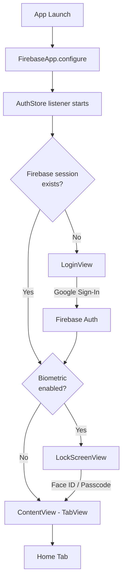
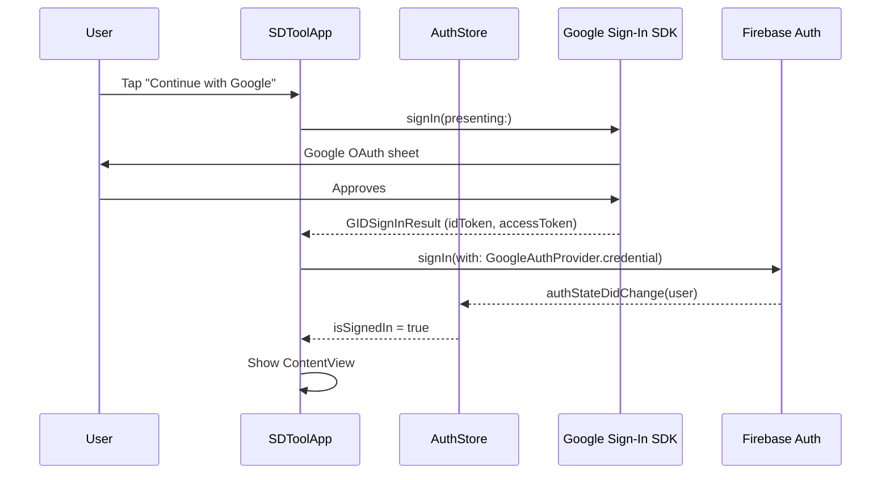
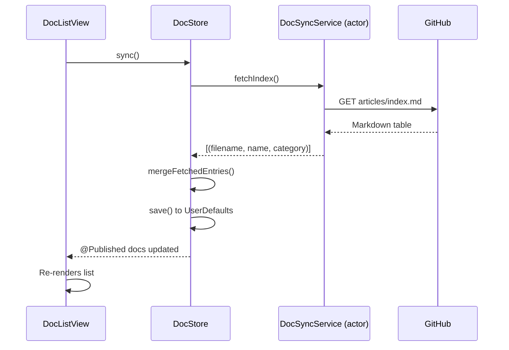
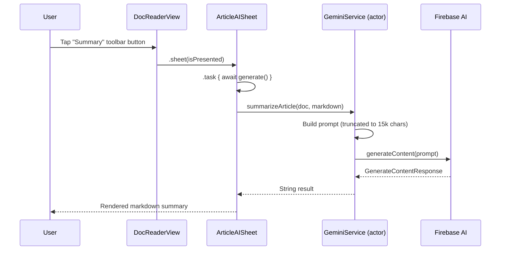
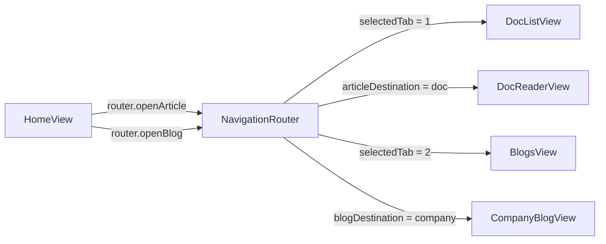

# Architecture

SDTool follows a **unidirectional data flow** pattern using SwiftUI's `ObservableObject` + `@AppStorage` + actor-based services.

---

## Layer Overview

```
┌─────────────────────────────────────────────────┐
│                   SwiftUI Views                  │
│  HomeView  DocListView  BlogsView  FlashCards    │
│  SettingsView  DocReaderView  CompanyBlogView    │
└──────────────────┬──────────────────────────────┘
                   │ reads / binds
┌──────────────────▼──────────────────────────────┐
│              ObservableObject Stores             │
│  DocStore  BlogStore  FlashCardStore             │
│  ActivityStore  ReadingProgressStore             │
│  AuthStore  DailyPickStore  LikedPostsStore      │
└──────────────────┬──────────────────────────────┘
                   │ async calls
┌──────────────────▼──────────────────────────────┐
│               Swift Actors (Services)            │
│  DocSyncService  BlogSyncService                 │
│  FlashCardSyncService  GeminiService             │
│  BlogFeedService  BlogTextExtractor              │
└──────────────────┬──────────────────────────────┘
                   │
┌──────────────────▼──────────────────────────────┐
│                External Services                 │
│  GitHub (raw content)   Firebase AI (Gemini)     │
│  Firebase Auth          RSS Feeds                │
└─────────────────────────────────────────────────┘
```

---

## App Launch Flow



---

## Authentication Flow



---

## Content Sync Flow



---

## AI Flow (Gemini)



---

## Cross-Tab Navigation



`NavigationRouter` is a singleton `ObservableObject`. `ContentView` observes it to drive tab switching. Each tab's `NavigationStack` observes `router.articleDestination` / `router.blogDestination` via `.onChange` to push the destination view.

---

## Data Persistence

| Store | Storage | Data |
|---|---|---|
| `DocStore` | UserDefaults | Article metadata (filename, name, category, state) |
| `ReadingProgressStore` | UserDefaults | Scroll progress per article (0.0–1.0) |
| `ActivityStore` | UserDefaults | Daily read counts (articles, blogs) |
| `LikedPostsStore` | UserDefaults | Liked blog post URLs + metadata |
| `BlogStore` | UserDefaults | Blog company list |
| `FlashCardStore` | UserDefaults | Deck metadata + cards |
| `FlashCardProgress` | UserDefaults | Known/unknown card keys |
| `DailyPickStore` | UserDefaults | Today's picked article + blog |
| `AppSettings` | UserDefaults (`@AppStorage`) | Theme, font, font size, Face ID toggle |

> All data is non-sensitive (reading progress, preferences). No financial or health data is stored. UserDefaults is acceptable for this data profile.

---

## Thread Safety

- All sync services are Swift **actors** — safe to call from any context
- All store updates happen on `@MainActor` via `DispatchQueue.main.async` or `await MainActor.run`
- `GeminiService` is an actor — concurrent AI calls are serialized automatically
- `BiometricService` and `AuthStore` are `ObservableObject` on main thread

---

## Key Design Decisions

| Decision | Rationale |
|---|---|
| GitHub as CMS | Zero backend cost, content versioned, community PRs for new articles |
| Firebase Auth (Google only) | Simplest OAuth without paid Apple Developer account requirement |
| Firebase AI with `.googleAI()` backend | Free tier, no Vertex AI billing setup needed |
| UserDefaults for all persistence | Content is non-sensitive; avoids CoreData complexity for MVP |
| `@AppStorage` for settings | Automatic SwiftUI binding, persists across launches |
| Actor for sync services | Swift concurrency, no manual locking needed |
| `NavigationRouter` singleton | Cross-tab deep linking without prop drilling |
