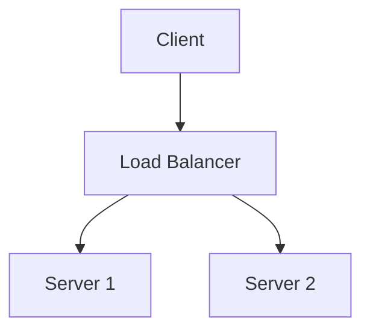

# Content Guide

All content in SDTool is sourced directly from this GitHub repository. The app syncs on demand — no CMS, no backend, no API keys needed for content.

---

## Repository Structure

```
SD-Tool-ios/
├── articles/
│   ├── index.md              ← article registry (required)
│   └── *.md                  ← article files
├── blogs/
│   └── index.md              ← blog company registry (required)
└── flashcards/
    └── *.md                  ← flash card decks
```

---

## Articles

### index.md Format

The app reads `articles/index.md` to discover available articles. Each article is one row in a markdown table:

```markdown
| Filename | Name | Category |
|---|---|---|
| system-design-basics.md | System Design Basics | System Design |
| database-indexing.md | Database Indexing Deep Dive | Databases |
| cap-theorem.md | CAP Theorem Explained | Distributed Systems |
```

**Rules:**
- `Filename` must match the actual `.md` file in `articles/`
- `Category` groups articles in the app — use an existing category or create a new one
- Order in the table = order shown in the app

**Supported Categories:**
- `System Design`
- `Databases`
- `Networking`
- `Distributed Systems`
- `Security`
- `Architecture`
- `Meta` (for guides like this one)

### Article File Format

Articles are standard Markdown. The app renders them natively using MarkdownUI with full support for:

- Headers (`#`, `##`, `###`)
- Bold, italic, inline code
- Code blocks with syntax highlighting
- Blockquotes
- Tables
- Images (rendered inline, tap to zoom)
- **Mermaid diagrams** (rendered natively via mermaid.js)

### Mermaid Diagrams

Wrap diagrams in a mermaid code fence:

````markdown

````

Tap the diagram in the app to open a full-screen zoomable view.

### Images

Images must use full absolute URLs (relative paths won't work since content is fetched raw from GitHub):

```markdown

```

### Article Template

Use `article-template.md` in the repo root as your starting point. Key sections:

```markdown
# Title

## Introduction
What problem does this solve?

## Core Concepts
Key ideas with clear explanations.

## Deep Dive
Detailed breakdown. Use Mermaid for architecture diagrams.

## Trade-offs
Pros and cons. What are the real-world implications?

## Real World Usage
How do companies like Netflix, Uber, Google use this?

## Summary
Key takeaways in bullet points.
```

---

## Blogs

### index.md Format

```markdown
| Company | Website | RSS Feed |
|---|---|---|
| Netflix Tech Blog | https://netflixtechblog.com | https://netflixtechblog.com/feed |
| Uber Engineering | https://eng.uber.com | https://eng.uber.com/feed |
| Airbnb Engineering | https://medium.com/airbnb-engineering | https://medium.com/feed/airbnb-engineering |
```

**Rules:**
- `RSS Feed` must be a valid RSS/Atom feed URL — test by opening in browser (should show XML)
- `Website` is opened when user taps the company name
- Companies are shown in the order listed

**Finding RSS feeds:**
```
https://engineering.company.com/feed
https://blog.company.com/rss
https://medium.com/feed/@companyname
https://company.com/blog/rss.xml
```

---

## Flash Cards

### Deck File Format

Each `.md` file in `flashcards/` is one deck. The filename becomes the deck ID.

```markdown
# Deck Title

## Card: Question text here?
Answer text here. Can be multi-line.
Can include `inline code`.

## Card: What is the CAP theorem?
CAP stands for Consistency, Availability, and Partition Tolerance.
A distributed system can only guarantee two of the three at any time.

## Card: What is consistent hashing?
A technique that minimizes key remapping when nodes are added or removed
from a distributed hash table.
```

**Rules:**
- File must start with `# Deck Title` (used as display name)
- Each card starts with `## Card: ` followed by the question
- Answer is everything between this `## Card:` and the next
- Mermaid diagrams in answers are supported

### Deck Categories

The app groups decks by filename prefix if you want to organize them:

```
system-design-basics.md   → shown as-is
databases-01.md           → shown as-is
```

---

## Sync Behavior

| Content | Trigger | Frequency |
|---|---|---|
| Articles | Manual (sync button) | On demand |
| Blogs | App launch + manual | Cached per `feedCacheHours` setting (default 6h) |
| Flash Cards | App launch | On launch if SHA changed |

Articles are cached locally at:
```
Documents/articles/<filename>.md
```

The app detects new/changed articles by comparing the GitHub API file list against locally stored metadata.
